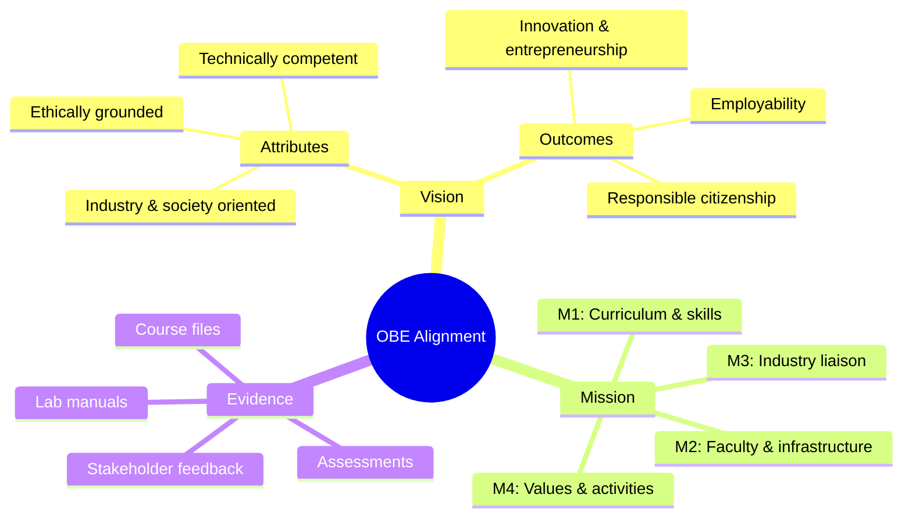
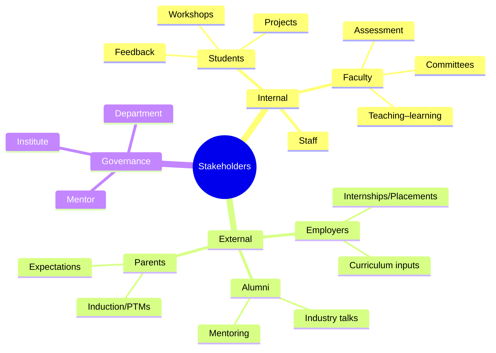
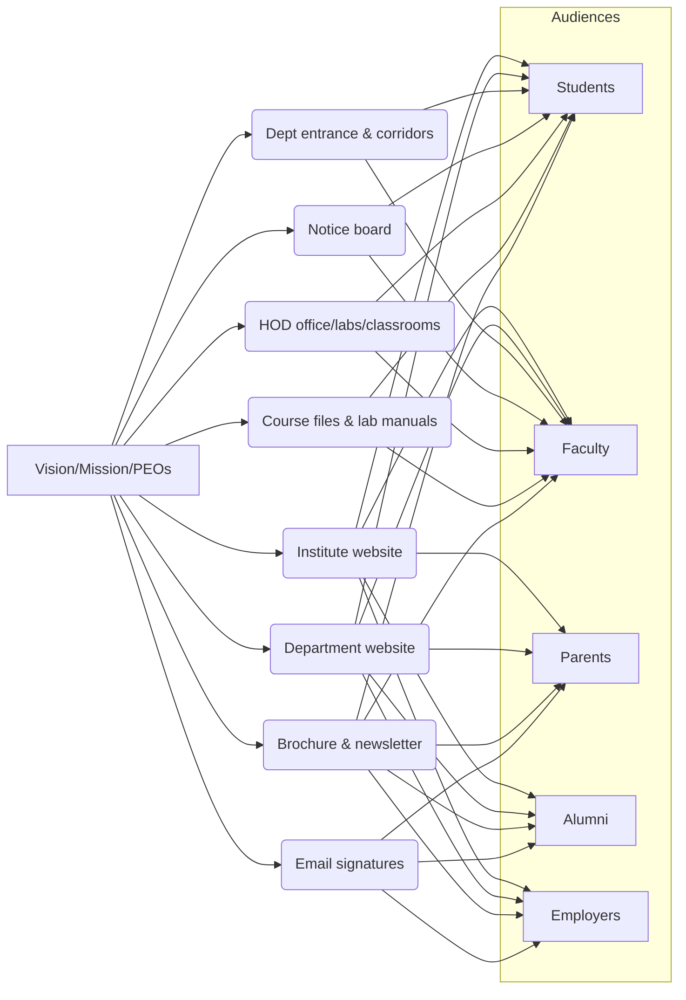
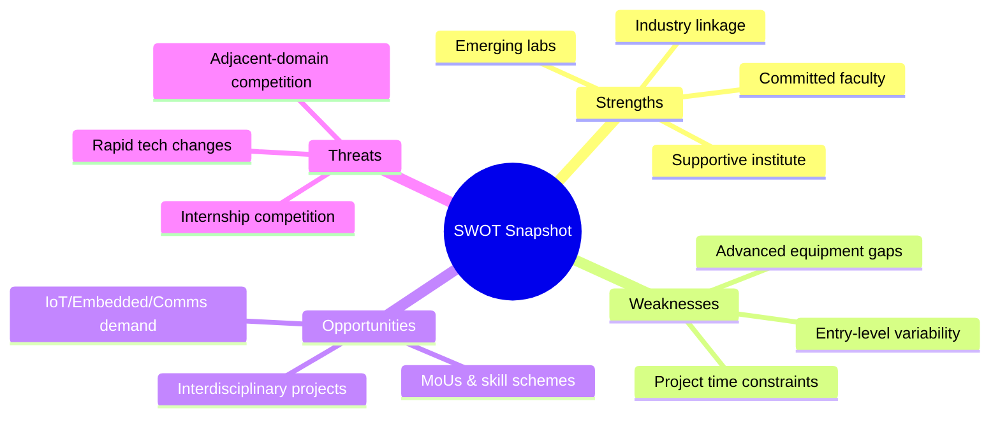
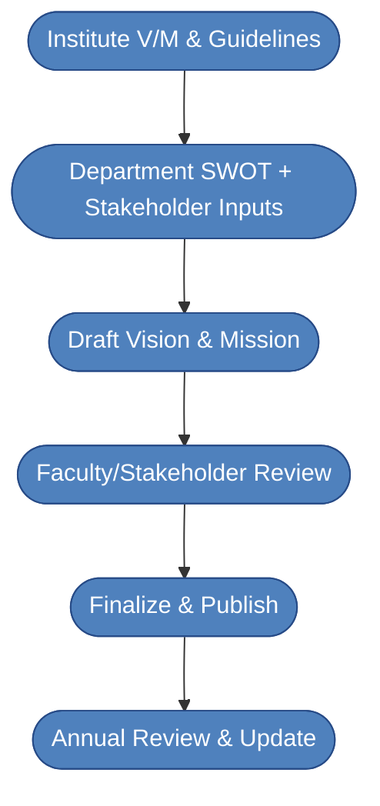
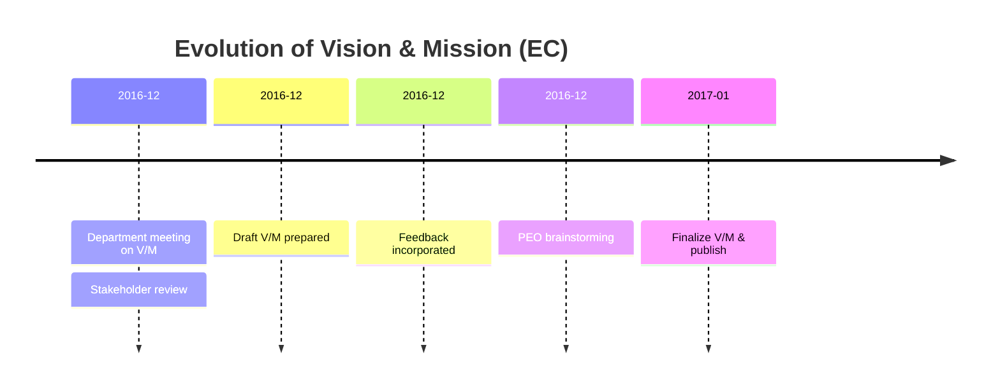
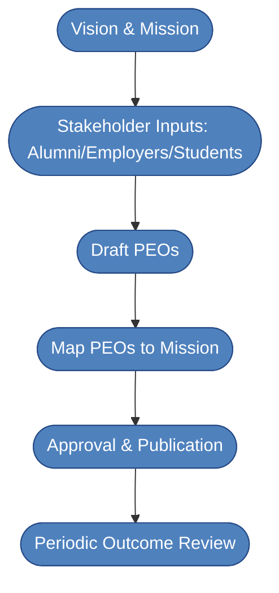
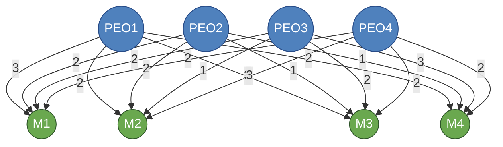
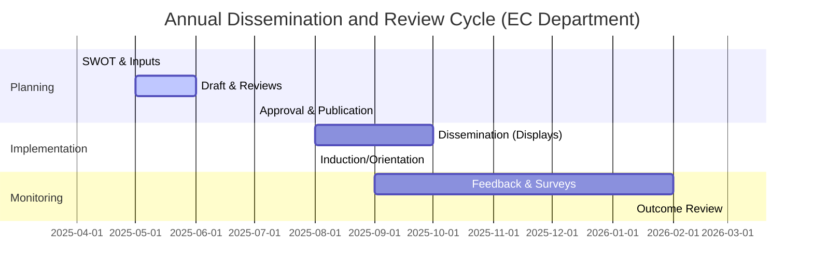

# Criteria 1 Report — Electronics & Communication (EC) Department

## Government Polytechnic, Palanpur

## Table of Contents

- [1.0 Executive Summary](#10-executive-summary)
- [1.1 State the Vision and Mission of the Department and Institution](#11-state-the-vision-and-mission-of-the-department-and-institution)
- [1.2 State the Program Educational Objectives (PEOs)](#12-state-the-program-educational-objectives-peos-program-educational-objectives-peos)
- [1.3 Indicate where and how the Vision, Mission and PEOs are published and disseminated](#13-indicate-where-and-how-the-vision-mission-and-peos-are-published-and-disseminated)
- [1.4 State the process for defining the Vision and Mission of the department, and PEOs of the Program](#14-state-the-process-for-defining-the-vision-and-mission-of-the-department-and-peos-of-the-program)
- [1.5 Establish consistency of PEOs with Mission of the Department](#15-establish-consistency-of-peos-with-mission-of-the-department)

## 1.0 Executive Summary

- Vision & Mission: EC vision emphasizes competence, ethics, employability, innovation, and societal contribution; mission (M1–M4) operationalizes curriculum quality, infra/faculty development, industry liaison, and values through co- and extra-curriculars.
- OBE & NEP 2020: Clear alignment to outcome-based education and NEP priorities (skill‑orientation, value‑based learning, industry–academia linkage, and continuous faculty development) with detailed mappings.
- PEOs: Four PEOs cover employability/innovation (PEO1), vertical mobility via higher education (PEO2), ethics and societal responsibility (PEO3), and adaptability with sustainability focus (PEO4), with concise justifications.
- Dissemination: Multi‑channel publication via institute/department websites, displays, classes/labs, course files, brochures/newsletters, and email signatures; stakeholders engaged through inductions, workshops, and meetings.
- Processes: Structured cycles for defining V/M and PEOs using SWOT and stakeholder feedback; periodic review and improvement documented with flowcharts, mind maps, and an annual Gantt.
- Mapping & Consistency: PEO–Mission matrix with level justifications; strong alignment with AICTE/GTU/CTE and institute statements.

## 1.1 State the Vision and Mission of the Department and Institution

### A. Availability of the Vision & Mission statements of the Department

The department’s Vision, Mission, and PEOs are formally documented and disseminated via institute/department websites, display boards at the department entrance and corridors, HOD office, laboratories, classrooms, course files, and induction/orientation programs.

### Institute Vision (Government Polytechnic, Palanpur)

To produce competent diploma engineers as per the needs of industry and entrepreneurs with ethical values.

### Institute Mission (Government Polytechnic, Palanpur)

1. Industry oriented technical education
2. Excellent teaching and learning environment
3. Promote entrepreneurship activities
4. Continual growth in every sphere of life by developing core human values

### Department Vision (Electronics & Communication (EC) Engineering)

To prepare competent diploma-level electronics and communication engineers, catering to the needs of industries and society as excellent employees, innovators and entrepreneurs with moral values.

### Department Mission (Electronics & Communication (EC) Engineering)

- M1: Provide quality education in the field of EC engineering.
- M2: Develop state-of-the-art laboratories, classrooms, and upgrade faculty knowledge.
- M3: Strengthen industrial liaison by offering mutually beneficial services.
- M4: Execute extracurricular and co-curricular activities to inculcate innovation, entrepreneurship, and moral values.

### B. Appropriateness/Relevance of the Statements

#### 1. Vision Statement

##### Vision:

To prepare competent diploma-level electronics and communication engineers, catering to the needs of industries and society as excellent employees, innovators and entrepreneurs with moral values.

##### Justification:

- Clear and aspirational: Emphasizes technical competence, innovation, employability, and ethics.
- Future-oriented and stakeholder-centric: Addresses industry and societal needs consistent with OBE/NBA expectations.
- Aligned with diploma-level outcomes: Focus on practice-oriented readiness and responsible citizenship.

#### 2. Mission Statements

##### Mission:

- M1: Provide quality education in the field of EC engineering.
- M2: Develop state-of-the-art laboratories, classrooms, and upgrade faculty knowledge.
- M3: Strengthen industrial liaison by offering mutually beneficial services.
- M4: Execute extracurricular and co-curricular activities to inculcate innovation, entrepreneurship, and moral values.

##### Justification:

- Actionable strategy: Specifies pedagogy (M1), infrastructure and faculty development (M2), industry connect (M3), and value-based development (M4).
- Enables the vision: Collectively builds graduate attributes required by NBA for diploma programs.

#### 3. Overall Appropriateness and Relevance

- Internal consistency between vision and mission; relevant to EC discipline; reflects stakeholder needs (students, faculty, employers, society).

### A. Documented Alignment with Outcome-Based Education (OBE)

|                                      | Outcome based curriculum                                                                                                                   | Outcome based Teaching and Learning process                                                                                                    | Outcome based assessment                                                                                       |
|--------------------------------------|---------------------------------------------------------------------------------------------------------------------------------------------|-------------------------------------------------------------------------------------------------------------------------------------------------|-----------------------------------------------------------------------------------------------------------------|
| Vision                               | Identifies attributes required in an EC diploma engineer to meet industrial and societal needs.                                             | Focused on developing lifelong learning; highly student-centric; aims at apply–analyze–solve engineering problems.                             | Ensures students use knowledge and skills professionally (problem solving, designing experiments, communication). |
| M1: Quality EC education             | Focus on imparting EC core knowledge and its application.                                                                                   | Inclusion of tools and methods enabling students to learn all aspects of EC as diploma engineers; drives achievement of learning outcomes.      | Criteria-based assessments demonstrating achievement of outcomes and abilities.                                |
| M2: Labs/classrooms and faculty dev. | Framework for collaborative curriculum planning and tools for evaluating/improving the curriculum.                                          | Strategic enhancement of teaching–learning quality via student‑centric processes in classrooms and laboratories by qualified faculty.           | Measures technical skills through quizzes, troubleshooting, and project‑based learning.                         |
| M3: Industry liaison                 | Develop curriculum aligned to industrial needs by involving industry experts during design/review.                                          | Correlates student learning with industry via visits, workshops, expert seminars, and innovation/startup initiatives (e.g., SSIP).             | Articulates knowledge and practical skills via industry problem solving and evidence from internships/projects.  |
| M4: Co- and extra‑curriculars & values    | Includes co‑ and extra‑curriculars that encourage innovation, moral values, and entrepreneurship within the curriculum and departmental planning. | Arranges activities under gymkhana/department cells; student‑led technical events to boost innovation and entrepreneurial skills and teamwork. | Assesses innovation/entrepreneurship and values through participation quality and performance in activities.     |

### C. Consistency of Department Statements with the Institute Statements

#### Vision Alignment

- Department vision operationalizes the institute vision by specifying EC domain readiness, innovation, entrepreneurship, employability, and ethics.

#### Mission Alignment

- M1 ↔ Institute M1/M2 (quality education; strong teaching–learning environment)
- M2 ↔ Institute M2 (modern infrastructure; faculty upskilling)
- M3 ↔ Institute M1/M3 (industry orientation; entrepreneurship)
- M4 ↔ Institute M4 (human values; holistic growth)

### Consistency Analysis and Mapping with NEP 2020

#### Introduction to NEP 2020

NEP 2020 emphasizes holistic, multidisciplinary, skill‑based, and outcome‑driven education; value‑based learning; industry–academia collaboration; and continuous faculty development using student‑centric, ICT‑enabled pedagogies.

#### Key Highlights of NEP 2020

1. Skill-based, vocational, and employability-focused curricula.
2. Value-based, ethical, and socially responsible education.
3. Continuous professional development of teachers.
4. Student-centric, ICT-enabled teaching-learning methods.
5. Industry-academia collaboration and experiential learning.
6. Outcome-based and flexible curricula aligned with national priorities.

#### A. Mapping of Department Vision with NEP 2020

| Department Vision Element                                                                 | NEP 2020 Principle                                                                             | Consistency | Justification |
|-------------------------------------------------------------------------------------------|------------------------------------------------------------------------------------------------|------------:|--------------|
| Competent EC diploma engineers for industry and society                                   | Skill/vocational orientation; Employability                                                    | High        | Aligns with NEP’s focus on job readiness and practical skills. |
| Innovators and entrepreneurs with moral values                                            | Value-based education; Innovation and entrepreneurship                                         | High        | Embeds ethics and innovation/entrepreneurship mindset. |
| Societal contribution with responsible professional practice                              | Holistic development; Community engagement; Sustainability                                    | High        | Supports national development and responsible citizenship. |

#### B. Mapping of Department Mission with NEP 2020

| Department Mission Element                                                                | NEP 2020 Principle                                                                             | Consistency | Justification |
|-------------------------------------------------------------------------------------------|------------------------------------------------------------------------------------------------|------------:|--------------|
| M1: Quality EC education                                                                  | Outcome-based, skill-oriented technical education                                             | High        | Ensures practice-oriented outcomes and employability. |
| M2: Modern infra; faculty upgradation                                                     | Continuous teacher education; ICT-enabled pedagogy                                            | High        | Enables modern, student-centric learning environments. |
| M3: Strengthened industry liaison                                                         | Industry-academia collaboration; Experiential learning                                        | High        | Facilitates exposure to real-world problems and trends. |
| M4: Co/extra-curriculars for innovation, entrepreneurship, and values                     | Holistic education; Innovation and value-based learning                                       | High        | Nurtures creativity, leadership, and ethics. |

#### Summary

The department Vision and Mission align strongly with NEP 2020 through technical skill development, value-based education, industry linkage, outcome-based learning, and continuous faculty development.

## 1.2. State the Program Educational Objectives (PEOs) Program Educational Objectives (PEOs)

- PEO1: Successfully pursue professional electronics and communication engineering careers working in multidisciplinary areas, focusing on innovation and entrepreneurship.
- PEO2: Pursue higher education.
- PEO3: Demonstrate societal and ethical responsibility in every domain of life.
- PEO4: Adapt to technological changes with focus on societal and environmental issues.

### Justification for Appropriateness of PEOs (Diploma in EC Engineering)

The PEOs align with the department’s Vision/Mission, stakeholder expectations, and NBA’s outcome-based framework for diploma programs. Together they balance employability and innovation (PEO1), vertical mobility (PEO2), ethics and societal contribution (PEO3), and adaptability with sustainability focus (PEO4).

#### PEO1: Application of Knowledge and Skills for Careers
“Successfully pursue professional electronics and communication engineering careers working in multidisciplinary areas, focusing on innovation and entrepreneurship.”

##### Justification:

- Ensures job readiness and problem-solving aligned with NBA’s outcome-based focus.
- Reflects practical, hands-on orientation of diploma education and industry relevance.

#### PEO2: Higher Education and Vertical Mobility
“Pursue higher education.”

##### Justification:

- Supports NEP/AICTE pathways for progression and lifelong learning.
- Encourages higher studies, technical certifications, and lateral professional growth.
- Reinforces academic rigor and preparedness for evolving roles.

#### PEO3: Ethical and Professional Contribution
“Demonstrate societal and ethical responsibility in every domain of life.”

##### Justification:

- Addresses ethics, responsibility, and societal contribution mandated by NBA graduate attributes.
- Encourages entrepreneurship and professionalism aligned with national initiatives.
- Reinforces teamwork, communication, and responsible practice in diverse workplaces.

#### PEO4: Lifelong Learning and Adaptability
“Adapt to technological changes with focus on societal and environmental issues.”

##### Justification:

- Prepares graduates to track emerging technologies (IoT, AI, 5G) and adapt roles.
- Encourages flexibility, critical thinking, and self-directed learning.
- Supports sustained employability and innovation in dynamic, multidisciplinary contexts.

## 1.3. Indicate where and how the Vision, Mission and PEOs are published and disseminated

- Institute/Department Website: Vision, Mission, and PEOs published for internal and external stakeholders.
- Display Boards: Department entrance, corridors, notice boards, HOD office, laboratories, and classrooms.
- Course Files and Lab Manuals: Included and discussed during lectures/practicals.
- Induction/Orientation: Presented to first-year students; reiterated in workshops and meetings.
- Publications: Department brochure, newsletter, and official email signatures.

Figure-1. Diagram Showing the Various Types of Stakeholders

### Dissemination Table

| Sr. No. | Place of Dissemination                                   | Meant For                       |
|--------:|-----------------------------------------------------------|---------------------------------|
| 1       | Institute website (GP Palanpur)                           | Internal & External Stakeholder |
| 2       | Department website/page                                   | Internal & External Stakeholder |
| 3       | Department entrance/corridors display boards              | Internal & External Stakeholder |
| 4       | Departmental notice board                                 | Internal & External Stakeholder |
| 5       | HOD office, labs, faculty cabins                          | Internal Stakeholder            |
| 6       | Induction/orientation program                             | Internal & External Stakeholder |
| 7       | Course files and lab manuals                              | Internal Stakeholder            |
| 8       | Department brochure                                       | Internal & External Stakeholder |
| 9       | Department email signature (HOD-EC)                        | Internal & External Stakeholder |
| 10      | Newsletter of department                                  | Internal & External Stakeholder |

### Students

- They have the most important role in the program.
- Their feedback helps improve pedagogy, implement innovative teaching–learning methods, enhance facilities, and plan co- and extra-curricular activities.

### Faculty

- Directly interact with students through lectures/labs and evaluate performance via multiple assessments.
- Serve on committees executing and monitoring curricular and co-curricular activities; contribute to V/M/PEOs and COs.

### Mentor

The Mentor guides and supports the department for accreditation readiness and continuous improvement.

#### 1. Guidance and Advice

- Provides expert guidance on NBA expectations, best practices, and gap-closure strategies.

#### 2. Review and Feedback

- Reviews SAR drafts and offers constructive feedback and clarifications.

#### 3. Support in Documentation

- Ensures documentation is accurate, complete, and well-organized per NBA quality requirements.

#### 4. Preparation for Visit

- Assists in preparing faculty/staff for the NBA visit, including mock interactions and infrastructure readiness.

#### 5. Continuous Improvement

- Emphasizes OBE and continuous improvement; aligns V/M/PEOs/POs/COs with NBA guidelines.

#### 6. Problem Solving

- Acts as a resource to address challenges or gaps in accreditation compliance.

### Employers

- End users of diploma engineers; advise on curriculum gaps, bolster institute–industry interactions, and support internships/placements.

### Parents

- Entrust the program for their wards’ career goals; provide expectations during inductions/PTMs.

### Alumni

- Ambassadors of the program; their feedback informs curriculum updates for real-world demands; support mentoring and placements.

## 1.4. State the process for defining the Vision and Mission of the department, and PEOs of the Program

### SWOT Analysis - Draft Version

#### Strengths
- Committed faculty; mentoring culture; supportive institute environment.
- Functioning labs; growing access to design/test tools; active co- and extra-curriculars.

#### Weaknesses
- Limited advanced equipment; procurement timelines; variability in student preparedness.

#### Opportunities
- Regional demand in IoT, embedded, communications, automation; MoUs and schemes for collaboration.

#### Threats
- Fast tech evolution; competition for internships and placements; expectation of immediate productivity.

### SWOT Analysis – Department of EC, GP Palanpur

#### Strengths
- Dedicated faculty with student-centric approach and mentoring culture.
- Emerging laboratories, incremental access to standard design/test tools; active co- and extra-curriculars.
- Linkage with local industry and alumni involvement for talks, visits, and internships.
- Supportive institute administration and conducive academic environment.

#### Weaknesses
- Limited advanced equipment compared to metro institutes; procurement lead times.
- Time constraints for extensive industry projects within semesters.
- Variability in student preparedness at entry; need for bridge/remedial modules.

#### Opportunities
- Regional industry demand for EC skills (IoT, embedded, communications, automation).
- Collaboration via skill development schemes, innovation policies, and MoUs.
- Scope for interdisciplinary projects and community-centric initiatives.

#### Threats
- Rapid technology evolution; competition for placements and internships.
- Industry expectations for immediate productivity; competition from adjacent domains.

### Strength
- Dedicated faculty; mentoring and counseling; supportive academic climate.
- Labs upgraded in phases; integration of modern tools and ICT-enabled pedagogy.
- Active industry linkage; alumni engagement; workshops and expert talks.

### Weakness
- Gaps in advanced test equipment and specialized software; limited time for large projects.
- Heterogeneous entry-level preparedness; need for bridge courses and remedial support.

### Opportunities
- Skill-development initiatives; entrepreneurship and innovation policies; community-centric projects.
- Interdisciplinary collaborations within and outside the institute.

### Threats
- Rapid obsolescence of technologies; competition from adjacent disciplines.

### Overcoming Weaknesses of the Department over time

### Weaknesses
- Limited advanced equipment; constrained time for extensive industry projects; variability in preparedness.

### Strength
- Phased procurement plan for lab upgrades; targeted MoUs to access external facilities; bridge/remedial modules; integrate mini-projects and internships within the curriculum to maximize exposure.

### A. Description of process of defining Vision & Mission of the Department

This section describes the structured approach used to formulate and refine the department’s Vision and Mission. Starting from the institute’s V/M and applicable guidelines (AICTE/NBA/GTU/CTE/NEP 2020), the department conducts a SWOT with stakeholders, drafts statements, reviews them in faculty and stakeholder forums, finalizes, publishes, and periodically reviews for continuous improvement.

#### Process for Defining Vision and Mission of the Department

1. Consider Institute Vision & Mission and regulatory guidance (AICTE/NBA/GTU/CTE/NEP 2020).
2. Conduct SWOT with inputs from stakeholders (students, alumni, employers, faculty, parents).
3. Draft Vision & Mission; review in department meeting; iterate with stakeholders.
4. Finalize statements; publish across channels; schedule periodic reviews.

#### Government Polytechnic, Palanpur

#### Electronics & Communication Engineering Department

#### Draft Vision and Mission

Following points were considered while forming the department Vision and Mission.

Department Vision (Draft): Empowering EC diploma engineers to drive technology with integrity and positive societal impact.

Department Mission (Draft):
1. Build strong EC fundamentals and practical skills aligned with industry needs.
2. Nurture ethical conduct and professional responsibility.
3. Enhance learning quality via innovative pedagogy and faculty development.
4. Encourage solving real-world problems through projects and community engagement.

#### Pre-final version of Vision and Mission

Department Vision (Pre-final): Create technically competent and ethically grounded EC diploma graduates contributing to industry and society through innovation and entrepreneurship.

Department Mission (Pre-final):
- Provide rigorous EC education integrated with hands-on practice.
- Instill ethical values and a contributory approach in students.
- Improve learning through continuous faculty upskilling and modern methods.
- Promote innovation, entrepreneurship, and community service via co- and extra-curriculars.

#### Final version of Vision and Mission

Department Vision (Final): To prepare competent diploma-level electronics and communication engineers, catering to the needs of industries and society as excellent employees, innovators and entrepreneurs with moral values.

Department Mission (Final):
- M1: Provide quality education in the field of EC engineering.
- M2: Develop state-of-the-art laboratories, classrooms, and upgrade faculty knowledge.
- M3: Strengthen industrial liaison by offering mutually beneficial services.
- M4: Execute extracurricular and co-curricular activities to inculcate innovation, entrepreneurship, and moral values.

### B. Description of process involved in defining the PEOs of the program

1. Start from finalized Vision & Mission and industry expectations for diploma graduates.
2. Brainstorm with faculty; consult alumni/employers for career outcomes 3–5 years post-graduation.
3. Draft PEOs (employability/innovation, higher studies, ethics, adaptability & sustainability).
4. Map PEOs to Mission elements with levels and justifications; approve and publish.
5. Accept: Freeze PEOs after department and stakeholder concurrence; schedule periodic review.

#### PEO-Definition

Broad long-term career goals that describe what diploma graduates are expected to achieve 3–5 years after completing the program.

#### Focus

Professional achievement, lifelong learning, societal contribution, ethical practice, and sustainability.

#### Audience

Intended for diploma pass-outs after they enter the workforce or pursue higher studies.

#### Steps (Narrative)

1. Institute Vision and Mission: Serve as foundation and guiding principles.
2. Department Vision and Mission: Department-level formulation aligned to institute V/M.
3. Stakeholders' View: Gather inputs from alumni, parents & students, and employers.
4. Evaluate: Iterate PEO drafts based on stakeholder feedback and outcome targets.
5. Accept: Finalize and publish PEOs; integrate in curricula and assessment.

## 1.5 Establish consistency of PEOs with Mission of the Department

### A. Preparation of a matrix of PEOs and elements of Mission statement (Levels: 1=Slight, 2=Moderate, 3=Substantial)

| PEO  | Mission | Mapping | Rationale (concise) |
|------|---------|--------:|---------------------|
| PEO1 | M1      | 3       | Quality EC education drives professional success and innovation. |
| PEO1 | M2      | 2       | Infra/faculty upgradation supports hands-on skills for careers. |
| PEO1 | M3      | 3       | Industry liaison fosters employability, innovation, entrepreneurship. |
| PEO1 | M4      | 2       | Activities nurture innovation/entrepreneurial mindset. |
| PEO2 | M1      | 2       | Strong fundamentals enable higher studies. |
| PEO2 | M2      | 2       | Advanced labs/classrooms facilitate academic progression. |
| PEO2 | M3      | 1       | Industry links offer exposure but are secondary for higher study. |
| PEO2 | M4      | 1       | Co/extra activities complement, not core to higher study. |
| PEO3 | M1      | 2       | Curriculum integrates professional ethics and societal context. |
| PEO3 | M2      | 1       | Infra/faculty indirectly support ethics awareness. |
| PEO3 | M3      | 2       | Industry liaison surfaces societal/ethical practice scenarios. |
| PEO3 | M4      | 3       | Activities explicitly inculcate values and responsibility. |
| PEO4 | M1      | 2       | Curriculum updates expose students to emerging technologies. |
| PEO4 | M2      | 3       | Upgraded infra/faculty enable adaptation to technological change. |
| PEO4 | M3      | 2       | Industry engagement highlights trends and sustainability needs. |
| PEO4 | M4      | 2       | Activities sensitize to environmental/societal issues. |

### B. Consistency/justification of co-relation parameters of the above matrix

- PEO1 aligns strongly with M1 and M3 (employability and innovation focus), moderately with M2 and M4.
- PEO2 aligns moderately with M1 and M2 (foundation and facilities), slightly with M3/M4.
- PEO3 aligns strongly with M4 (values), moderately with M1/M3, slightly with M2.
- PEO4 aligns strongly with M2 (upgradation), moderately with M1/M3/M4.

1. Slight (Low) 2. Moderate (Medium) 3. Substantial (High)

### C. Consistency of the Department statements with the Institute statements

| Statement                                                                                                                   | Institute (GP Palanpur)                                                                                                         | Department (EC, GP Palanpur)                                                                                                                                                                                   | Consistency |
|-----------------------------------------------------------------------------------------------------------------------------|---------------------------------------------------------------------------------------------------------------------------------|----------------------------------------------------------------------------------------------------------------------------------------------------------------------------------------------------------------|------------|
| Vision                                                                                                                      | Produce competent diploma engineers for industry/entrepreneurs with ethical values.                                            | Prepare competent EC diploma engineers serving industry and society as employees, innovators, and entrepreneurs with moral values.                                                                             | Strong     |
| Mission 1                                                                                                                   | Industry oriented technical education                                                                                           | M1: Provide quality education in EC engineering.                                                                                                                                                               | Strong     |
| Mission 2                                                                                                                   | Excellent teaching and learning environment                                                                                     | M2: Develop state-of-the-art labs/classrooms; upgrade faculties.                                                                                                                                               | Strong     |
| Mission 3                                                                                                                   | Promote entrepreneurship activities                                                                                             | M3: Strengthen industry liaison for mutual benefits; M4: Activities for innovation/entrepreneurship.                                                                                                           | Strong     |
| Mission 4                                                                                                                   | Continual growth with core human values                                                                                         | M4: Activities to inculcate moral values.                                                                                                                                                                      | Strong     |

### Consistency analysis/Alignment of Department Vision statement with AICTE, GTU, CTE and Institute Vision statements

#### AICTE Vision

To be a world-class organization leading technological and socio-economic development of the country by enhancing the global competitiveness of technical manpower and by ensuring high quality technical education to all sections of the society.

#### GTU Vision

To be a global university for the creation and dissemination of knowledge and innovation in science & technology, humanities and multidisciplinary domains for sustainable development and enrichment of human life.

#### CTE Vision

To facilitate quality technical and professional education having relevance for both industry and society, with moral and ethical values, giving equal opportunity and access, aiming to prepare globally competent technocrats.

#### Institute Vision (GP Palanpur)

Produce competent diploma engineers as per the needs of industry and entrepreneurs with ethical values.

#### Department Vision (EC, GP Palanpur)

Prepare competent EC diploma engineers serving industry and society as employees, innovators, and entrepreneurs with moral values.

#### Justification for Alignment

- AICTE: Strong alignment through focus on technical manpower quality and ethical orientation.
- GTU: Partial-to-strong alignment; vision supports knowledge creation/innovation via employable, ethical graduates.
- CTE: Strong alignment with quality, relevance to industry/society, and moral values.
- Institute: Department vision is a focused realization of the institute vision in the EC domain.

| Vision Statement | Focus Area                                                    | AICTE | GTU   | CTE   | Institute | Justification |
|------------------|---------------------------------------------------------------|:-----:|:-----:|:-----:|:---------:|---------------|
| Department       | Technical proficiency, ethics, employability, innovation      | High  | Medium| High  | High      | Specific EC focus realizes broader institute and regulatory visions. |

### Consistency analysis/Alignment of Department Mission statement with AICTE, GTU, CTE and Institute Mission statements

#### AICTE Mission

1. A true facilitator and an objective regulator
2. Transparent governance and accountable approach towards the society
3. Planned and coordinated development of Technical Education in the country by ensuring world-class standards of institutions through accreditation
4. Emphasis on developing high quality institutions, academic excellence, and innovative research and development programs
5. Networking with/ or a network of institutions for optimum resource utilization
6. Dissemination of knowledge
7. Technology forecasting and global manpower planning
8. Promoting industry-institution interaction for developing new products, services, and patents
9. Inculcating entrepreneurship
10. Encouraging indigenous technology
11. Focusing on non-formal education
12. Providing affordable education to all
13. Making Technical Education in India globally acceptable

#### GTU Mission

1. Develop centers of academic excellence with comprehensive education, training, and research infrastructure.
2. Build resources and competencies of global standard across educational domains.
3. Develop research-oriented pedagogy; nurture innovators, entrepreneurs, and professionals.
4. Enhance collaborations with academia, industry, government, NGOs; align with national/global needs.
5. Encourage multidisciplinary research; flexible learning ecosystem.

#### CTE Mission

1. Quality technical/professional education with continuous improvement of resources and personnel.
2. Promote a conducive ecosystem for Academia, Industry, Research, Innovations, and Startups.
3. Provide affordable quality education with moral values, equal opportunities, accessibility, and accountability.
4. Allocate competent human resources and infrastructure for world-class professional education.

#### Institute Mission (GP Palanpur)

M1: Industry oriented technical education; M2: Excellent teaching/learning environment; M3: Promote entrepreneurship; M4: Continual growth with core human values.

#### Department Mission (EC, GP Palanpur)

M1: Quality EC education; M2: Modern infra and faculty upgradation; M3: Industry liaison; M4: Co/extra-curriculars for innovation/entrepreneurship/values.

#### Justification for Alignment

- AICTE: Aligns through quality improvement (M1/M2), industry interaction (M3), and entrepreneurship (M4); technology forecasting and affordability addressed at institute/university level.
- GTU: Aligns via academic excellence (M1), pedagogy and faculty development (M2), innovation/entrepreneurship (M3/M4), and collaborations (M3).
- CTE: Strong alignment on quality, access/relevance to industry and society, and values.
- Institute: Direct mapping M1–M4 between institute and department missions as listed.

| Mission Statement | Focus Area                                                                                      | AICTE | GTU   | CTE   | Institute | Justification |
|-------------------|--------------------------------------------------------------------------------------------------|:-----:|:-----:|:-----:|:---------:|---------------|
| Department M1–M4  | Quality EC education; infra/faculty; industry liaison; innovation/values via activities          | High  | High  | High  | High      | Comprehensive coverage of quality, relevance, and values; finer-grained EC focus. |

### Process of Dissemination among stakeholders

Vision, Mission, and PEOs are disseminated through continuous interactions: faculty meetings, student workshops, parent/alumni meets, placements and training talks, and during lectures and labs (via manuals). They are also presented during the first-year orientation program.

| Place of Display                                  | Dissemination                                                                                              | Publication                                                                                              |
|---------------------------------------------------|------------------------------------------------------------------------------------------------------------|----------------------------------------------------------------------------------------------------------|
| Institute website (GP Palanpur)                   | Public access for all stakeholders                                                                         | https://gppalanpur.ac.in                                                                                 |
| Department website/page                            | Program-specific information for students, parents, alumni, employers                                      | https://ec.gppalanpur.ac.in                                                                              |
| Department entrance/corridors display boards       | Daily visibility for students, faculty, visitors                                                           | Printed V/M/PEOs posters; updated per review cycle                                                       |
| Departmental notice board                          | Official notices; reminders; updates                                                                       | Hard copy; QR code to website                                                                            |
| HOD office                                         | Briefings to visitors; mentoring discussions                                                               | Display frames; desk copies                                                                              |
| Laboratories and faculty cabins                    | Lab manuals with V/M/PEOs; faculty counseling                                                              | Lab manual front pages; cabin posters                                                                    |
| Classrooms                                         | Regular reinforcement during lectures and course orientations                                              | First lecture slides; course outlines                                                                     |
| Induction/orientation program                      | Introduction to new students and parents                                                                   | Orientation PPT and handbook                                                                             |
| Course files & lab manuals                         | Embedded in pedagogy and assessment                                                                        | Course file templates; lab front-matter                                                                  |
| Department brochure and newsletter                 | Periodic circulation                                                                                       | Printed/PDF copies with V/M/PEOs                                                                         |
| Official email signatures (HOD/department)         | Passive reach to external stakeholders                                                                     | Email footers referencing V/M/PEOs and URLs                                                              |

### PEOs: Publication and Dissemination

| Sr. No. | Place of Dissemination                 | Meant For                       |
|--------:|----------------------------------------|---------------------------------|
| 1       | Institute website (GP Palanpur)        | Internal & External Stakeholder |
| 2       | Department website/page                | Internal & External Stakeholder |
| 3       | Departmental notice board              | Internal & External Stakeholder |
| 4       | HOD office, laboratories, faculty labs | Internal Stakeholder            |
| 5       | Course files and lab manuals           | Internal Stakeholder            |

### Stakeholder Roles in Dissemination and Feedback

### Students
- Central stakeholders; feedback improves pedagogy, facilities, and co- and extra-curricular planning.
- Participate in workshops, project reviews, and surveys aligned to PEOs/POs/COs.

### Faculty
- Deliver lectures/labs; embed V/M/PEOs in course files and lab manuals.
- Serve on committees for curriculum, industry liaison, and quality assurance.

### Mentor
- Guides alignment to NBA’s OBE framework and audit-readiness.
- Reviews SAR drafts; suggests improvements; supports visit preparation and documentation.

### Employers
- Provide curriculum-gap inputs; host visits/internships; contribute to projects and talks.
- Offer feedback on graduate performance and emerging skill needs.

### Parents
- Engage during induction/PTMs; provide expectations and constraints; support continuous improvement.

### Alumni
- Act as ambassadors; mentor students; advise on trends; support placements and internships.
