## 1.1 State the Vision and Mission of the Department and Institution

## A. Availability of the Vision &amp; Mission statements of the Department

## Institute Vision

- To develop technically  proficient  and  ethically  sound  diploma  engineers  contributing  to industry and society needs.

## Institute Mission

- To impart quality technical education.
- To shape students towards sensitizing in ethical values and contributing in nature.
- To familiarize students with the world of work.

## Department Vision:

To  develop  technically  sound  and  ethically  strong  diploma  electronics  and  communication engineers contributing to industry and society.

## Department Mission:

- To develop students' proficiency in the field of electronics &amp; communication engineering to serve the industry and society.
- To focus on inculcating ethical values and contributory approach.
- To provide effective teaching learning to students through continuous faculty development.

## B. Appropriateness/Relevance of the Statements

## 1. Vision Statement

## Vision:

"To  develop  technically  sound  and  ethically  strong  diploma  electronics  and  communication engineers contributing to industry and society."

## Justification:

The vision statement of the department clearly articulates the long-term aspiration and desired future state.  As  per  the  definition,  a  vision  statement  should  serve  as  an  inspiring,  future-oriented declaration that guides institutional efforts.

This vision is:

- Clear and meaningful , emphasizing both technical competence and ethical strength.
- Aspirational and forward-looking , addressing the contemporary demands of industry and society.
- Aligned with professional and societal expectations , reflecting the institution's commitment to producing responsible and capable diploma engineers.

Thus,  it  is appropriate and correct from the  definition  perspective ,  fulfilling  the  criteria  of clarity, relevance, and alignment with long-term academic and professional goals.

## 2. Mission Statements

## Mission:

1. To develop students' proficiency in the field of electronics &amp; communication engineering to serve the industry and society.
2. To focus on inculcating ethical values and contributory approach.
3. To provide effective teaching learning to students through continuous faculty development.

## Justification:

The  mission  statements  precisely  describe  the  operational  strategies  and  immediate  objectives through  which  the  vision  will  be  achieved.  By  definition,  a  mission  statement  should  state  the institution's purpose, address key stakeholders, and outline the means to accomplish the vision.

The given mission statements are:

- Specific and relevant to the discipline of Electronics &amp; Communication Engineering , focusing on technical skill development and societal contribution.
- Inclusive of core academic values such as ethical practices and continuous learning.
- Addressing  key  functional  areas like  teaching-learning  methodologies  and  faculty development,  which  are  essential  for  maintaining  academic  excellence  and  delivering quality education.

The mission statements collectively ensure alignment with the vision and are correctly framed, relevant, and appropriate from the definition perspective .

## 3. Overall Appropriateness and Relevance

The Vision and Mission statements:

- Maintain internal consistency and complement each other .
- Reflect the core purpose of a diploma-level technical education program .
- Address the needs and expectations of stakeholders including students, faculty, industry, and society.
- Are correct as per standard definitions , being clear, relevant, purposeful, and aligned with the long-term objectives of the department and institution.

The department vision and mission statements are highly relevant and appropriate in the context of Outcome-Based Education (OBE) as promoted by the National Board of Accreditation (NBA). Here's an analysis of their appropriateness:

1. Focus  on  Outcomes: The  vision  and  mission  clearly  define  the  desired  outcomes  for students - technically sound, ethically strong engineers who can contribute to industry and society. This aligns well with OBE's emphasis on defining clear, measurable outcomes for educational programs.
2. Holistic  Development: The  statements  address  both  technical  proficiency  and  ethical values, which corresponds to NBA's focus on developing well-rounded professionals. This approach supports the development of both hard and soft skills.
3. Industry  and  Society  Relevance: There's  a  strong  emphasis  on  serving  industry  and society, which aligns with NBA's goal of ensuring that education is relevant to real-world needs and produces graduates who can contribute effectively to their field.
4. Continuous  Improvement: The  mission  includes  a  commitment  to  continuous  faculty development,  which  supports  OBE's  principle  of  ongoing  improvement  in  educational quality.
5. Specificity to the Field: The  vision and  mission  are specific to electronics  and communication engineering at the diploma level, allowing for targeted outcome definition as required in OBE.
6. Measurable Objectives: While not explicitly stated, the mission points provide a basis for developing measurable learning outcomes, which is crucial in OBE.
7. Stakeholder  Focus: By  mentioning  industry,  society,  and  faculty  development,  the statements acknowledge key stakeholders in the educational process, which is important in NBA's accreditation framework.
8. Ethical  Component: The  emphasis  on  ethics  aligns  with  NBA's  recognition  of  the importance of professional ethics and values in engineering education.
9. Teaching-Learning  Process: The  mission  specifically  mentions  effective  teachinglearning, which is a key component of OBE and NBA's evaluation criteria.

Overall, these vision and mission statements provide a solid foundation for developing an OBEcompliant program that would meet NBA's accreditation standards.

## C. Consistency of the Department statements with the Institute statements

## Consistency analysis/Alignment of Department Vision statement with AICTE, GTU, CTE and Institute Vision statements

| Statement                                                                                                                   | Institute                                                                                                                                        | Department                                                                                                                                                                                                                                                                                                                                                       | Consistency Analysis   |
|-----------------------------------------------------------------------------------------------------------------------------|--------------------------------------------------------------------------------------------------------------------------------------------------|------------------------------------------------------------------------------------------------------------------------------------------------------------------------------------------------------------------------------------------------------------------------------------------------------------------------------------------------------------------|------------------------|
| Develop  technically  proficient  and  ethically  sound  diploma engineers  contributing  to  industry  and  society needs. | Develop technically sound  and  ethically  strong  diploma  electronics  and  communication  engineers  contributing  to  industry  and society. | Strong Consistency: Both statements emphasize the  development  of  technically  competent  and  ethical  graduates  who  can  contribute  to  the  industry  and  society. The Department's vision specifically targets  electronics  and  communication  engineering,  demonstrating  a  clear  focus  within  the  broader  Institute vision.                 | Vision                 |
| To  impart  quality  technical  education.                                                                                  | To  develop  students'  proficiency in the field of  electronics  &  communication  engineering  to  serve  the  industry and society.           | Strong  Consistency:  The  Department's  mission  directly supports the Institute's mission by focusing  on imparting technical education in a specific field.  The emphasis on serving industry and society further  reinforces the Consistency.                                                                                                                | Mission 1              |
| To shape students  towards  sensitizing  in  ethical values and  contributing  in  nature.                                  | To  focus  on  inculcating  ethical  values  and  contributory approach.                                                                         | Strong  Consistency:  Both  statements  prioritize  the  development of ethical students who are committed  to  contributing  to  society.  While  the  Institute's  mission  is  broader,  the  Department's  mission  specifically targets ethical values and a contributory  approach  within  the  context  of  electronics  and  communication engineering. | Mission 2              |
| To  familiarize  students  with  the  world of work.                                                                        | To  provide  effective  teaching  learning  to  students  through  continuous  faculty  development.                                             | Moderate  Consistency:  The  Institute's  mission  focuses  on  preparing  students  for  the  workplace,  while the Department's mission centres on improving  teaching  and  learning.  Faculty  development  can  ultimately contribute to student preparedness.                                                                                              | Mission 3              |

## AICTE vision

To be a world-class organization leading technological and socio-economic development of the country by enhancing the global competitiveness of technical manpower and by ensuring high quality technical education to all sections of the society.

## GTU vision

To be a global university for the creation and dissemination of knowledge and innovation in science &amp; technology, humanities and multidisciplinary domains for sustainable development and enrichment of human life.

## CTE vision

To facilitate quality technical and professional education having relevance for both industry and society, with moral and ethical values, giving equal opportunity and access, aiming to prepare globally competent technocrats.

## Institute vision

Develop technically proficient and ethically sound diploma engineers contributing to industry and society needs.

## Department vision:

Develop  technically  sound  and  ethically  strong  diploma  electronics  and  communication engineers contributing to industry and society.

## Justification for Alignment:

Alignment  with  AICTE  Vision: The  department's  focus  on  developing  technically  sound engineers  aligns  with  AICTE's  goal  of  enhancing  the  global  competitiveness  of  technical manpower. The emphasis on ethical strength also contributes to the overall quality of technical education.

Alignment with GTU Vision: While the department's vision does not explicitly mention innovation or sustainable development, the focus on developing technically sound engineers can contribute to these  areas.  By  producing  skilled  engineers,  the  department  contributes  to  the  creation  and dissemination of knowledge and innovation.

Alignment with CTE Vision: The department's vision aligns strongly with CTE's goals of quality technical education, relevance to industry and  society, and  preparing globally  competent technocrats.  The  focus  on  both  technical  proficiency  and  ethical  strength  ensures  that  the department's graduates are well-prepared for the industry.

Alignment with Institute Vision: The department vision is a specific extension of the institute's vision. By focusing on electronics and communication engineering, the department contributes to the overall goal of developing technically proficient and ethically sound diploma engineers.

| Vision  Statement   | Focus Area                                                                                    | Alignment  with  AICTE  Vision   | Alignment  with GTU  Vision   | Alignment  with CTE  Vision   | Alignment  with  Institute  Vision   | Justification                                                                                                                                                                                                                                                                                                               |
|---------------------|-----------------------------------------------------------------------------------------------|----------------------------------|-------------------------------|-------------------------------|--------------------------------------|-----------------------------------------------------------------------------------------------------------------------------------------------------------------------------------------------------------------------------------------------------------------------------------------------------------------------------|
| Department          | Technically  sound  and  ethically  strong diploma  electronics and  communicatio n engineers | Strong                           | Partial                       | Strong                        | Strong                               | The  department's  vision  aligns  well  with  the  AICTE,  CTE,  and  institute  visions,  focusing  on  the  development  of  technically  proficient  and  ethically sound engineers.  However, its focus is more  specific  than  GTU's  vision,  which  emphasizes  a  broader  scope  of  knowledge  and  innovation. |

## Consistency analysis/Alignment of Department Mission statement with AICTE, GTU, CTE and Institute Mission statements

## AICTE Mission

1. A true facilitator and an objective regulator
2. Transparent governance and accountable approach towards the society
3. Planned and coordinated development of Technical Education in the country by ensuring world-class standards of institutions through accreditation
4. Emphasis  on  developing  high  quality  institutions,  academic  excellence,  and  innovative research and development programs.
5. Networking with/ or a network of institutions for optimum resource utilization
6. Dissemination of knowledge
7. Technology forecasting and global manpower planning
8. Promoting  industry-institution  interaction  for  developing  new  products,  services,  and patents
9. Inculcating entrepreneurship
10. Encouraging indigenous technology
11. Focusing on non-formal education
12. Providing affordable education to all
13. Making Technical Education in India globally acceptable

## GTU Mission

1. To develop centers of academic excellence at university premises and at affiliated colleges in  domains  of  science,  engineering,  technology,  management,  and  environment  for imparting comprehensive education, training, and research infrastructure as per the nation requirements.
2. To build resources, facilities, proficiencies and other related infrastructure of global standard for  the  development  of  knowledge,  skills,  and  competencies  in  the  various  educational domains.
3. To  develop  research-oriented  pedagogy  for  flourishing  ideas  and  to  nurture  innovators, entrepreneurs and professionals of tomorrow
4. To  build  and  enhance  collaborations  with  other  academic,  research,  industry,  and government organizations as well as NGOs across the globe so that education, training and research at university and its affiliated colleges become aligned with national and global level requirements.
5. To encourage multidisciplinary research and develop flexible learning ecosystem.

## CTE Mission

1. Quality  technical  and  professional  education  with  continuous  improvement  of  all  the resources and personnel
2. To  promote  conducive  ecosystem  for  Academic,  Industry,  Research,  Innovations  and Startups
3. To provide affordable quality professional education with moral values, equal opportunities, accessibility and accountability
4. To allocate competent and dedicated human resources and infrastructure to the institutions for  providing  world-class  professional  education  to  become  a  Global  Leader  ('Vishwa Guru')

## Institute Mission

1. To impart quality technical education.
2. To shape students towards sensitizing in ethical values and contributing in nature.
3. To familiarize students with the world of work.

## Department Mission:

- To develop students' proficiency in the field of electronics &amp; communication engineering to serve the industry and society.
- To focus on inculcating ethical values and contributory approach.
- To provide effective teaching learning to students through continuous faculty development.

## Justification for alignment:

- Alignment  with  AICTE  Mission: The  department  mission  aligns  with  elements  of AICTE's mission, such as developing high-quality institutions (through proficient engineers) and promoting industry interaction (serving industry needs). However, it doesn't directly  address  technology  forecasting,  entrepreneurship,  or  affordable  education  (these may be addressed at the institute or university level).
- Alignment  with  GTU  Mission: The  department  mission  aligns  with  aspects  of  GTU's mission, like academic excellence (developing proficiency) and research (through faculty development).  However,  GTU's  focus  is  broader,  encompassing  various  disciplines  and flexible learning, which are not explicitly mentioned in the department's mission.
- Alignment with CTE Mission: The department mission directly addresses all aspects of CTE's mission. It emphasizes quality technical education (developing proficiency), industry relevance  (serving  industry  and  society),  ethical  values  (inculcating  ethical  values),  and accessibility (through effective teaching-learning).
- Alignment  with  Institute  Mission: The  department  mission  aligns  strongly  with  the institute's mission. Both focus on imparting quality technical education and shaping students ethically. The department mission provides a more specific focus on the field of electronics &amp; communication engineering.

| Mission  Statement   | Focus Area                                                                                                                                   | Alignment  with AICTE  Mission   | Alignment  with GTU  Mission   | Alignment  with CTE  Mission   | Alignment  with  Institute  Mission   | Justification                                                                                                                    |
|----------------------|----------------------------------------------------------------------------------------------------------------------------------------------|----------------------------------|--------------------------------|--------------------------------|---------------------------------------|----------------------------------------------------------------------------------------------------------------------------------|
| Department           | Develop proficiency in  electronics  &  communication  engineering,  inculcate  ethical  values,  and  provide  effective  teaching-learning | Strong                           | Partial                        | Strong                         | Strong                                | The  department  mission  aligns  well  with all except GTU's  broader  focus  on  multiple  disciplines  and flexible learning. |

## Consistency Analysis and Mapping of Department Vision &amp; Mission with NEP 2020

## Introduction to NEP 2020

The National Education Policy (NEP) 2020 is a landmark education reform framework introduced by  the  Government  of  India,  aiming  to  revamp  the  education  system  to  meet  the  changing developmental  needs  of  the  country  while  retaining  its  cultural  and  human  values.  The  policy emphasizes  holistic,  multidisciplinary,  skill-based,  and  outcome-driven  education,  promoting equity,  inclusivity,  and  value-based  learning.  It  encourages  vocational  integration,  ethical  and humanistic  education,  continuous  faculty  development,  and  fostering  employability  through technical skill enhancement.

## Key highlights of NEP 2020 include:

1. Focus on skill-based and vocational education from an early stage.
2. Integration of value-based, ethical, and socially responsible learning.
3. Emphasis on continuous professional development of teachers.
4. Adoption of modern, student-centric, ICT-enabled teaching-learning methods.
5. Promotion of industry-academia collaboration and experiential earning.
6. Outcome-based and flexible curricula aligned with national priorities.

The policy envisions India as a global knowledge superpower with a robust, employable, ethical, and socially responsible technical workforce.

## A. Detailed Mapping of Department Vision with NEP 2020

| Department  Vision Element                                                         | Relevant NEP 2020 Principle                                                                               | Consistency  Level   | Justification for Alignment                                                                                                                                                 |
|------------------------------------------------------------------------------------|-----------------------------------------------------------------------------------------------------------|----------------------|-----------------------------------------------------------------------------------------------------------------------------------------------------------------------------|
| To  develop  technically  sound  diploma electronics  and communication  engineers | Skill-based,  vocational,  and  technical  education; Employability-focused higher  education             | High                 | Aligns  directly  with  NEP  2020's  emphasis  on  promoting  skill-based  education  and  technical  excellence  for  employability  and  meeting  industrial  demands.    |
| To  develop  ethically  strong  engineers                                          | Value-based,  ethical  and  humanistic  education;  Constitutional  and  civic  responsibility            | High                 | Ensures  technical  graduates  uphold integrity, fairness, and  social  responsibility,  reflecting NEP's objective of  integrating  ethics  into  professional education.  |
| Contributing  to  industry  and  society                                           | Holistic and multidisciplinary education;  National development; Sustainability and  community engagement | High                 | Reflects  NEP's  vision  for  graduates  to  actively  contribute  to  economic  progress,  sustainable  development, and community  welfare,  supporting  national  goals. |

## B. Detailed Mapping of Department Mission with NEP 2020

| Department Mission Element                                                                                                       | Relevant NEP 2020  Principle                                                                                                     | Consistency  Level   | Justification for Alignment                                                                                                                                                                |
|----------------------------------------------------------------------------------------------------------------------------------|----------------------------------------------------------------------------------------------------------------------------------|----------------------|--------------------------------------------------------------------------------------------------------------------------------------------------------------------------------------------|
| Develop students' proficiency in  the  field  of  electronics  &  communication  engineering  to  serve the industry and society | Skill-based,  vocational  and  technical  education;  Outcome-based  education;  Industry-academia  collaboration                | High                 | Prepares students  with industry- relevant  technical  skills,  in  line  with  NEP's  goal  of  outcome- based,  employability-enhancing  education  integrated  with  industry exposure. |
| Inculcate  ethical  values  and  contributory approach                                                                           | Value-based  education;  Humanistic, ethical outlook;  National  and  societal  contribution                                     | High                 | Embeds ethics, moral reasoning,  and  social  sensitivity  into  professional  education,  consistent  with NEP's emphasis  on  holistic,  value-driven  learning.                         |
| Provide  effective  teaching- learning  to  students  through  continuous faculty development                                    | Pedagogical  reforms;  Continuous  teacher  education  and  professional  development;  ICT-enabled  teaching-learning processes | High                 | Supports  NEP's  directives  for  continuous  faculty  upskilling,  modern teaching methodologies,  and  student-centric,  technology- enabled learning environments.                      |

## Summary

The Department of Electronics &amp; Communication Engineering's Vision and Mission statements are highly aligned with the principles of NEP 2020. Both emphasize:

- Technical skill development
- Ethical and value-based education
- Industry collaboration and societal contribution
- Outcome-based learning
- Continuous professional development for educators

This alignment ensures the department's educational strategies are contemporary, nationally relevant, and contribute meaningfully to the national goal of preparing an employable, ethical, and socially responsible technical workforce.

## 1.2. State the Program Educational Objectives (PEOs) Program Educational Objectives (PEOs)

PEO 1: Students will apply their knowledge and skills in the field of electronics and communication engineering, to solve problems and contribute effectively to industry and society.

PEO 2: Students will uphold ethical principles to contribute to their communities as entrepreneurs and professionals.

PEO  3: Students  will  be  lifelong  learners  who  are  capable  of  adapting  to  technological advancements and emerging trends through career advancement and as professionals.

## Justification for Appropriateness of Program Educational Objectives (PEOs)

(Diploma in Electronics and Communication Engineering)

The  defined  Program  Educational  Objectives  (PEOs)  are  appropriately  designed  to  reflect  the vision,  mission,  stakeholder  needs,  and  graduate  attributes  required  by  the  NBA  for  diploma programs. Each PEO aligns with both technical competence and societal contribution, ensuring a well-rounded diploma graduate profile.

## PEO 1: Application of Knowledge and Skills

"Students  will  apply  their  knowledge  and  skills  in  the  field  of  electronics  and  communication engineering, to solve problems and contribute effectively to industry and society."

## Justification:

- This objective ensures that diploma graduates are job-ready, fulfilling the NBA's emphasis on program relevance to industry and society.
- It reflects the practical orientation of diploma education and aligns with Program Outcomes (POs)  like  problem  solving,  application  of  engineering  fundamentals,  and  modern  tool usage.
- The objective is consistent with stakeholder feedback gathered through SWOT analysis, especially  industry  and  alumni  inputs  emphasizing  employability,  hands-on  skills,  and applied problem-solving.
- By linking curriculum application to real-world challenges, it upholds the NBA's outcomebased education model.

## PEO 2: Ethical and Professional Contribution

"Students will uphold ethical principles to contribute to their communities as entrepreneurs and professionals."

## Justification:

- This  PEO addresses the NBA-mandated emphasis on ethics, responsibility,  and societal contribution,  especially  for  diploma  engineers  working  in  the  grassroots  of  technology deployment.
- Encouraging entrepreneurship aligns with national initiatives like Skill India and Start-up India, supporting self-reliant graduates.
- It also supports professionalism, which is vital in work environments where diploma holders take on critical implementation roles.
- Inclusion of ethics reflects the NBA's Graduate Attributes (GA) such as individual and team work, communication, and societal responsibility.

## PEO 3: Lifelong Learning and Adaptability

"Students will be lifelong learners who are capable of adapting to technological advancements and emerging trends through career advancement and as professionals." Justification:

- In the dynamic field of electronics and communication, continuous learning is essential to remain employable and innovative.
- This PEO prepares diploma engineers to pursue higher education, technical certifications, or  lateral  professional  growth  -  all  promoted  by  the  AICTE  and  NBA  guidelines  for vertical mobility.
- It  reinforces  the  lifelong  learning  attribute,  ensuring  pass  outs  to  remain  relevant  as technologies evolve (e.g., IoT, AI, 5G).
- Encourages  flexibility,  critical  thinking,  and  self-driven  learning  -  vital  in  today's technology-driven and multidisciplinary workplaces.

## 1.3. Indicate where and how the Vision, Mission and PEOs are published and disseminated among stakeholders

- ⮚ The  mission  and  vision  of  the  department  are  published  on  the  institute  and  department website which can be viewed by all the stakeholders.
- ⮚ The mission and vision displayed at prominent locations in the campus can be viewed by students, parents, faculty member and others.

Figure-1. Diagram Showing the Various Types of Stake holders

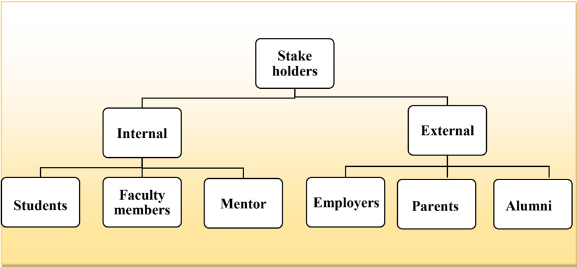

## Students:

-  They have most important role in the program.
-  Their feedback helps institute/department to improve pedagogy, to  implement innovative teaching-learning methodologies, to improve other facilities and to organize various extracurricular and co- curricular activities.

## Faculty:

-  They are important stake holders  as  they  directly  interact  with  the  students  through regular  classes/laboratories  and  assess  their  performance  through  various  evaluation techniques.
-  They are members of various committees  which execute/monitor curricular and cocurricular activities.
-  They are contributing for framing Vision, Mission, PEOs, and Course Outcomes.

## Mentor:

The Mentor plays  a  crucial  role  in  guiding  and  supporting  the  institution  or  department throughout the NBA accreditation process. Their responsibilities include:

## 1. Guidance and Advice:

- o The mentor provides expert guidance on how to prepare for NBA accreditation, sharing best practices and helping the institution understand NBA's criteria and expectations.

## 2. Review and Feedback:

- o They  review  the Self-Assessment  Report  (SAR) and  offer  constructive  feedback, suggesting improvements and clarifications where needed.

## 3. Support in Documentation:

- o The mentor helps ensure that documentation is accurate, complete, and well-organized, in line with NBA's quality requirements.

## 4. Preparation for Visit:

- o They assist in preparing the faculty and staff for the NBA team visit ,  including mock interviews and  ensuring  that  the  physical  and  digital  infrastructure  aligns  with  NBA standards.

## 5. Continuous Improvement:

- o The mentor emphasizes Outcome-Based Education (OBE) and continuous improvement, helping  the  institution  align  its vision,  mission,  PEOs,  POs,  and  COs with  NBA guidelines.

## 6. Problem Solving:

- o Acts  as  a  resource  for  addressing  challenges  or  gaps  in  compliance  with  accreditation standards.

## Employers:

-  They are one of the end users of the diploma engineers.
-  They provide suggestion for curriculum gap to make the students industry ready and improve institute-industry interactions.

## Parents :

-  They entrust the program so that their wards meet their career goals.

## Alumni:

-  They are the ambassadors of the program and their good footprint indicates long term success of the program.
-  Their feedback helps to make necessary changes in curriculum to meet the challenging demands of the real world.

The  vision,  mission  and  PEOs  are  disseminated  to  the  stakeholders  of  the  program  i.e., management,  faculty,  students,  staff,  alumni,  parents  and  current  and  prospective  employers through  continuous  interaction.  The  Vision  and  Mission  of  the  department  are  published  and disseminated through following:

|   Sr.  No. | Place of Dissemination                                                                       | Meant For                       |
|------------|----------------------------------------------------------------------------------------------|---------------------------------|
|          1 | Institute Website-http://www.gpgh.cteguj.in/                                                 | Internal & External Stakeholder |
|          2 | Department Website- https://sites.google.com/polytechnicgnr.gujarat.gov.in/el ectronics/home | Internal & External Stakeholder |
|          3 | Display Board at the entrance of department and  Corridors                                   | Internal & External Stakeholder |
|          4 | Departmental Notice Board                                                                    | Internal & External Stakeholder |
|          5 | H.O.D. Office, Departmental Laboratories and  Faculty cabins                                 | Internal Stakeholder            |
|          6 | Orientation/Induction Program                                                                | Internal & External Stakeholder |
|          7 | Course File                                                                                  | Internal Stakeholder            |
|          8 | Brochure of department                                                                       | Internal & External Stakeholder |
|          9 | Department email id signature (HOD-EC email id)                                              | Internal & External Stakeholder |
|         10 | Newsletter of department                                                                     | Internal & External Stakeholder |

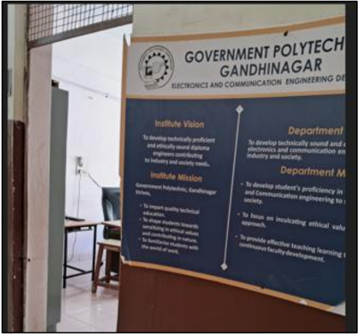

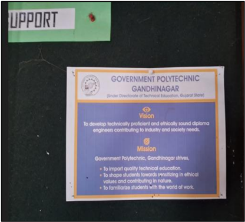

Corridor                                                                   Notice Board

Laboratory /Faculty seating                                         HOD Cabin

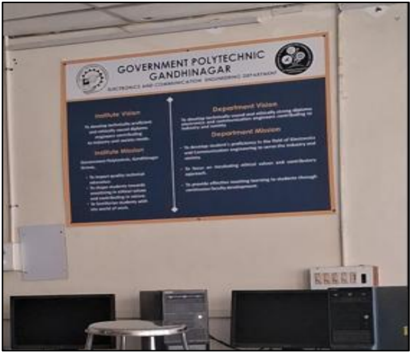

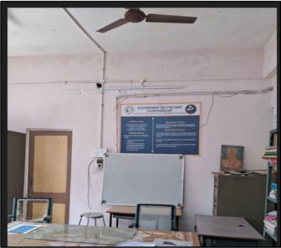

Classroom                                                Orientation/Induction Program

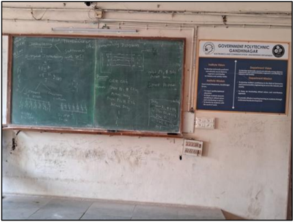

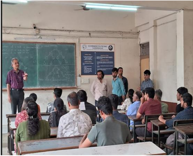

The PEOs of the department are published and disseminated through:

|   Sr.  No. | Place of Dissemination                                                                       | Meant For                       |
|------------|----------------------------------------------------------------------------------------------|---------------------------------|
|          1 | Institute Website-http://www.gpgh.cteguj.in/                                                 | Internal & External Stakeholder |
|          2 | Department Website- https://sites.google.com/polytechnicgnr.gujarat .gov.in/electronics/home | Internal & External Stakeholder |
|          3 | Departmental Notice Board                                                                    | Internal & External Stakeholder |
|          4 | H.O.D. Office, Departmental Laboratories,  and Faculty cabins                                | Internal Stakeholder            |
|          5 | Course File                                                                                  | Internal Stakeholder            |

## Process of Dissemination among stakeholders

Vision, Mission and PEOs are disseminated to all the  stakeholders of the program through faculty meetings, student workshops, parent meetings and placement and training activities at regular intervals. They are disseminated during lectures and lab sessions (In lab manuals) too. The Vision, Mission and PEOs are also disseminated during the first-year orientation program by department faculty members.

|                           | Place of Display                                                                        | Dissemination                                                                                                                                        | Publication                                                                                                                                                                                                                                                                                                                                                   |
|---------------------------|-----------------------------------------------------------------------------------------|------------------------------------------------------------------------------------------------------------------------------------------------------|---------------------------------------------------------------------------------------------------------------------------------------------------------------------------------------------------------------------------------------------------------------------------------------------------------------------------------------------------------------|
| Vision,  Mission  and PEO | ● HOD Chamber  ● Notice Boards  ● Classrooms  ● Laboratories  ● Staff Rooms  ● Corridor | ● Seminars/Workshops  ● Alumni Meetings  ● Parents-Teacher Meeting  ● First Year orientation program  ● Meeting  with  HRs  during  placement drives | ● Institute  Website  http://www.gpgh.cteguj. in/ ● Department  Website- https://sites.google.com/ polytechnicgnr.gujarat. gov.in/electronics/home  ● Newsletter  (Vision,  Mission)  ● Course files  ● Department  Brochure  (Vision, Mission)  ● Lab  manuals  ( Vision,  Mission) ● Department  email  id  signature (HOD-EC email  id) ( Vision, Mission) |

## 1.4. State the process for defining the Vision and Mission of the department, and PEOs of the Program

- Timeline and steps for SWOT, Vision, Mission and PEO formation

Timeline and steps for SWOT, Vision, Mission and PEO formation

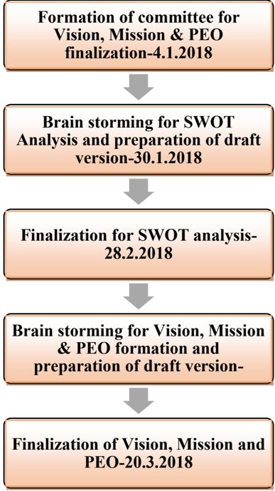

## SWOT Analysis - Draft Version

## Strengths

1. Strategic Location - Situated in the state capital, close to GIDC electronics estate, enabling better industry connectivity.
2. Qualified &amp; Motivated Faculty - Balanced mix of young, experienced, and selfdriven teaching staff.
3. Adequate Infrastructure - Sufficient facilities to support academic and co-curricular activities.
4. AICTE Approval - Recognized and approved diploma program in Electronics &amp; Communication.
5. Teamwork Culture - Strong collaboration between faculty and students.
6. Updated Curriculum - Recently revised syllabus aligned with current industry trends.
7. Academic Discipline - Strict adherence to academic calendar and schedules.
8. Resource-Rich Library - Well-stocked with relevant books and reference materials.

9. Modern Laboratories - Equipped with necessary instruments for practical learning.
10. Internet Connectivity - Sufficient access to support teaching-learning activities.
11. Industry Linkages - Active Industry-Institute interaction for student benefit.

## Weaknesses

1. Insufficient Supporting Staff - Limited non-teaching manpower for smooth departmental functioning.
2. No Department-Level Purchase Power - Hurdles in quick procurement of materials/equipment.
3. Low Student Enrolment - Declining intake over recent years.
4. Lower Merit Students - Entry-level academic standards need improvement.
5. Lack of Library Automation - Manual processes impacting efficiency.
6. Faculty Transfers - Frequent changes affecting continuity.
7. Limited Hands-on Exposure - Students lack adequate practical exposure in curriculum.
8. Inadequate Industry Visits/Exposure - Limited real-world industry experience integrated into studies.

## Opportunities

1. ICT-Based Teaching - Adoption of modern digital tools for enhanced learning.
2. Faculty Development - Training in latest and emerging technologies.
3. Student Startup Support - Encouraging entrepreneurship and innovation.
4. External  Funding -  Potential  to  attract  funds  from  donors,  alumni,  industries,  and foundations.

## Threats

1. Declining Interest in Diploma EC - Fewer students opting for the branch.
2. Competition from Private Institutes - Self-financed institutions in the vicinity.
3. Limited  Electronics  Industry  in  Gujarat -  Scarcity  of  design  and  manufacturing opportunities.
4. High Dropout Rates - Students leaving before completion of the course.

The Vision and Mission Statements of the department have been revised by considering the institutional Mission &amp; Vision. The department has adopted a consultative approach to establish its vision and mission by involving the stakeholders of the institute such as faculty, students, staff,  parents,  alumni,  industrial  experts,  and  employers.  While  articulating  the  vision  and mission statements for the department the future technology and societal requirements were also considered. Considering the institutional Vision and Mission as the base and incorporating global projections in the field of electronics and communication engineering, the Vision and Mission  Statements  of  the  department  have  been  defined.  The  faculty  members  of  the department met number of times to develop and cultivate a strong and meaningful Vision and Mission statements. SWOT analysis was done for the department as below.

## Strength

- Located in state capital nearby GIDC electronics estate
- Good blend of young, qualified, experienced and self-motivated faculty members
- Adequate infrastructure
- AICTE approved diploma EC
- Excellent team work among faculty and students
- Revised and updated curriculum of diploma EC
- Academic calendar is strictly adhered to the schedule
- Rich library
- Well-equipped laboratory
- Enough Internet access
- Good Industry Institute interaction

## Weakness

- Major lack of supporting staff
- No purchase power at department level
- Poor student enrollment
- Low merit students
- Lack of Library Automation
- Transfer of faculty
- Lack of exposure to students for hands on experience in curriculum
- Lack of industry exposure to students in curriculum

## Opportunities

- ICT based teaching learning
- Training of faculty members in emerging areas
- Student startup support
- Possibility of fund raising from Donors/Alumnus/Business/Foundation

## Threats

- Decreasing interest of students opting for diploma EC
- Self financed institutes in surroundings
- Lack of design and manufacturing industries in electronics field in Gujarat
- Major dropout of students

## Overcoming Weaknesses of the Department over the time

## Weaknesses

1. Lack of Library Automation
2. Lack of exposure to students for hands on experience in curriculum
3. Lack of industry exposure to students in curriculum

## Strength

1.  Library  Automation  (Since  April-2022 in institute library)
2. Micro project introduced in most of the subjects  in  curriculum  for  students  for hands on experience (In curriculum developed w.e.f. 2021)

3.  Internship  included  in  curriculum  for

A  series  of  discussions  were  conducted  simultaneously  among  parents,  students,  alumni, Industry experts and expert from NBA accredited institute to finalize the Vision, Mission and PEOs.

Stake Holder meeting for formation of vision, mission and PEOs of the department

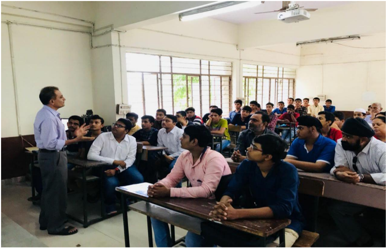

Stake Holder meeting for formation of vision, mission and PEOs of the department

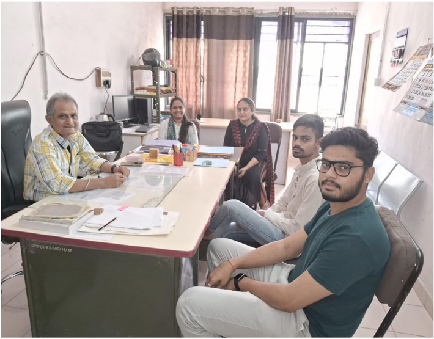

Department level meeting to develop and cultivate a strong and meaningful Vision, Mission and PEOs statements of the department

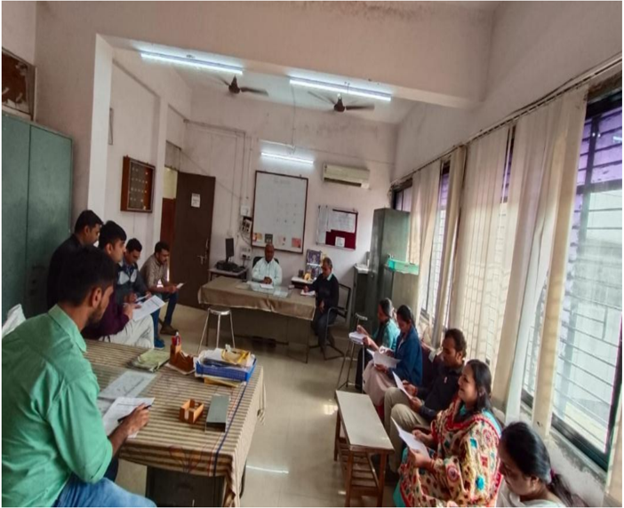

## A. Description of process of defining Vision &amp; Mission of the Department

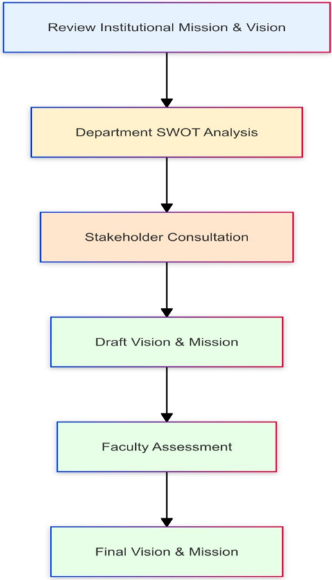

## Process for Defining Vision and Mission of the Department

This flowchart describes the process of developing a department's vision and mission statement. The process flows from top to bottom with the following main steps:

1. The process starts by considering the institutional Mission &amp; Vision.
2. SWOT analysis of the department is conducted in consultation with stakeholders.
3. A draft version of the Vision and Mission statements is formed based on inputs from various stakeholders (faculty, students,  staff,  parents,  alumni,  industrial  experts,  and employers).
4. An assessment of the draft version is done by faculty members.
5. Finally, the final Vision and Mission Statements are formed.

These stakeholders provide input into the drafting process. The flowchart indicates a structured approach to creating a department's vision and mission, incorporating perspectives from various stakeholders associated with the institution.

## Government polytechnic, Gandhinagar

## Electronics &amp; Communication Engineering Department

## Draft Vision and Mission

Following points are to be considered while forming Vision and Mission of the department.

Department Vision: Empowering innovative electronics and communication engineers who drive technological advancement with integrity and societal impact.

## Department Mission:

1. Cultivate expertise: Provide cutting-edge education in electronics and communication engineering, bridging academic knowledge with industry demands.
2. Foster ethics: Nurture responsible professionals who prioritize ethical considerations in their technical pursuits.
3. Enhance  learning: Continuously improve educational quality through faculty development and innovative teaching approaches.
4. Inspire impact: Encourage students to apply their skills towards solving real-world challenges and contributing to societal progress.

## Pre-final version of Vision and Mission

## Department Vision:

To create diploma graduates in electronics and communication engineering who are technically proficient and ethically grounded, making significant contributions to industry and society.

## Department Mission:

- To  equip  students  with  a  strong  foundation  in  electronics  and  communication engineering, preparing them to meet the needs of the industry and society.
- To instil ethical values and a sense of responsibility in students, encouraging them to contribute positively.
- To ensure a high-quality learning experience through ongoing faculty development and effective teaching methodologies.

## Final version of Vision and Mission

## Department Vision:

Develop  technically  sound  and  ethically  strong  diploma  electronics  and  communication engineers contributing to industry and society.

## Department Mission:

- To  develop  students'  proficiency  in  the  field  of  electronics  &amp;  communication engineering to serve the industry and society.
- To focus on inculcating ethical values and contributory approach.
- To  provide effective teaching learning to students through continuous faculty development.

## B. Description of process involved in defining the PEOs of the program

Process for Defining PEOs of the Department

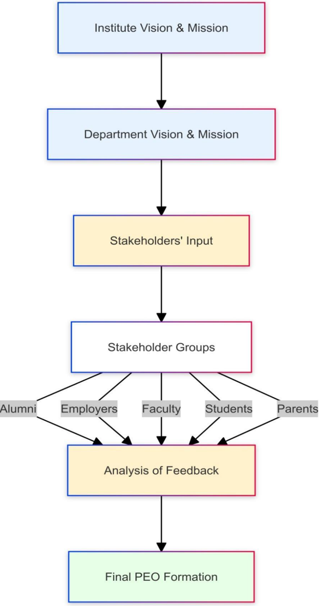

## PEO-Definition:

Broad long-term career goals that  describe  what  diploma  pass  out  students  are  expected  to achieve 3-5 years after completing the program.

Focus:

## Professional achievement, lifelong learning, societal contribution, and ethical practice.

## Audience:

Intended for diploma pass outs after they enter the workforce or pursue higher studies.

The image depicts a flowchart illustrating the process of developing and refining a department's vision and mission within an educational institution. This process involves multiple stakeholders and follows a structured approach. Here's a detailed description of the process shown:

## 1. Institute Vision and Mission:

The process begins with the overarching vision and mission of the institute. This serves as the foundation and guiding principle for all subsequent steps.

## 2. Department Vision and Mission:

Building  on  the  institute's  vision  and  mission,  a  preliminary  department-specific  vision  and mission  is  formulated.  This  step  ensures  alignment  between  the  department's  goals  and  the broader institutional objectives.

## 3. Stakeholders' View:

This  is  a  crucial  phase  where  input  is  gathered  from  various  stakeholders.  The  stakeholders included in this process are:

- ⮚ Alumni: Former students who can provide perspectives based on their experiences.
- ⮚ Parents &amp; Students: Current students and their parents, offering insights into expectations and experiences.
- ⮚ Employers: Organizations that hire graduates, providing industry perspectives and requirements.
- ⮚ Faculty Members: Academic staff who are integral to implementing the vision and mission.
- ⮚ Students:  Current  students  who  are  directly  affected  by  the  department's  policies  and direction.

These stakeholders contribute their views, likely through surveys, meetings, or other feedback mechanisms. Their diverse perspectives ensure a comprehensive understanding of the department's role and impact.

4. Summarize and Analyse Views:

After collecting input from all stakeholders, the next step involves consolidating and analyzing the gathered information. This likely includes identifying common themes, priorities, and areas of concern across different stakeholder groups.

## 5. Accept:

Based on the analysis of stakeholder views, the department leadership makes decisions on what aspects  to  incorporate  into  the  vision  and  mission.  This  step  may  involve  discussions  and refinements to ensure the final version adequately reflects stakeholder input while aligning with institutional goals.

6. PEOs (Program Educational Objectives):

The final step in this process is the formulation of Program Educational Objectives. These are specific,  measurable  goals  that  the  department  sets  for  its  educational  programs,  directly informed by the newly refined vision and mission.

This  systematic  approach  ensures  that  the  department's  vision,  mission,  and  educational objectives  are  not  created  in  isolation  but  are  instead  the  result  of  a  collaborative  effort  that considers multiple perspectives. It demonstrates a commitment to inclusivity and responsiveness to the needs and expectations of various groups connected to the department and institution.

## 1.5 Establish consistency of PEOs with Mission of the Department

The PEOs ensure the accomplishments of the mission of the Department with special emphasis on technical competence of engineers, value addition, and sustainable solutions to engineering problems. For the mapping of PEOs and Mission, several meetings of the faculty members were conducted  at  department  level.  The  feedback  of  the  faculty  members  was  taken  into consideration and the mapping was finalized as below.

The Vision, Mission and PEOs were also finalized based on the following components:

- ⮚ Departmental meeting
- ⮚ Feedback from industries
- ⮚ Feedback from students/ alumni
- ⮚ Feedback from training and placement department
- ⮚ Parents meet

Department level meeting-1 for mapping of PEOs and Mission

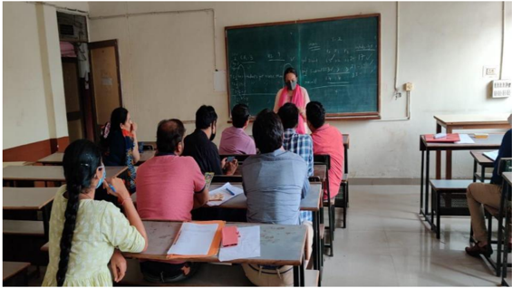

Department level meeting-2 for mapping of PEOs and Mission

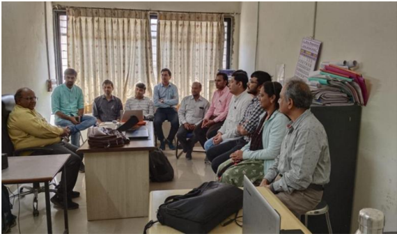

## A. Preparation of a matrix of PEOs and elements of Mission statement

| PEO                                                                                                                                                                                        | Mission                                                                                                                                     |   Mapping  Level |
|--------------------------------------------------------------------------------------------------------------------------------------------------------------------------------------------|---------------------------------------------------------------------------------------------------------------------------------------------|------------------|
| PEO 1:  Students will apply their knowledge and skills  in the field of electronics and communication  engineering, to solve problems and contribute  effectively to industry and society. | M1: To  develop  students'  proficiency  in  the  field  of  electronics  &  communication  engineering to serve the industry  and society. |                3 |
| PEO 1:  Students will apply their knowledge and skills  in the field of electronics and communication  engineering, to solve problems and contribute  effectively to industry and society. | M2: To  focus  on  inculcating  ethical  values  and  contributory  approach.                                                               |                1 |
| PEO 1:  Students will apply their knowledge and skills  in the field of electronics and communication  engineering, to solve problems and contribute  effectively to industry and society. | M3: To  provide  effective  teaching  learning  to  students  through  continuous  faculty  development.                                    |                2 |
| PEO 2:  Students will uphold ethical principles to  contribute to their communities as entrepreneurs and  professionals.                                                                   | M1: To  develop  students'  proficiency  in  the  field  of  electronics  &  communication  engineering to serve the industry  and society. |                2 |
| PEO 2:  Students will uphold ethical principles to  contribute to their communities as entrepreneurs and  professionals.                                                                   | M2: To  focus  on  inculcating  ethical  values  and  contributory  approach.                                                               |                3 |
| PEO 2:  Students will uphold ethical principles to  contribute to their communities as entrepreneurs and  professionals.                                                                   | M3: To  provide  effective  teaching  learning  to  students  through  continuous  faculty  development.                                    |                1 |
| PEO 3:  Students will be lifelong learners who are  capable of adapting to technological advancements  and emerging trends through career advancement and  as professionals.               | M1: To  develop  students'  proficiency  in  the  field  of  electronics  &  communication  engineering to serve the industry  and society. |                3 |
| PEO 3:  Students will be lifelong learners who are  capable of adapting to technological advancements  and emerging trends through career advancement and  as professionals.               | M2: To  focus  on  inculcating  ethical  values  and  contributory  approach.                                                               |                2 |
| PEO 3:  Students will be lifelong learners who are  capable of adapting to technological advancements  and emerging trends through career advancement and  as professionals.               | M3: To  provide  effective  teaching  learning  to  students  through  continuous  faculty  development.                                    |                2 |

## B. Consistency/justification of co-relation parameters of the above matrix

| PEO   | Mission   |   Mapping Level | Justification                                                                                                                                                                                                  |
|-------|-----------|-----------------|----------------------------------------------------------------------------------------------------------------------------------------------------------------------------------------------------------------|
| PEO1  | M1        |               3 | This is strongly aligned (level 3) because both the PEO  and M1 focus on developing proficiency in electronics  and  communication engineering to serve industry  and  society.                                |
| PEO1  | M2        |               1 | The weak alignment (level 1) is due to M2's focus on  ethical values, which is not explicitly mentioned in PEO  1.                                                                                             |
| PEO1  | M3        |               2 | There's  a  moderate  alignment  (level  2)  as  effective  teaching  and  faculty  development  indirectly  support  students' ability to apply knowledge and skills.                                         |
| PEO2  | M1        |               2 | There's moderate alignment (level 2) as serving industry  and  society  relates  to  contributing  to  communities,  though ethics aren't explicitly mentioned in M1.                                          |
| PEO2  | M2        |               3 | This is strongly aligned (level 3) due to the direct focus  on ethical values in both PEO 2 and M2.                                                                                                            |
| PEO2  | M3        |               1 | The  weak  alignment  (level  1)  is  because  faculty  development doesn't directly address ethical principles  or community contribution.                                                                    |
| PEO3  | M1        |               3 | There is a strong alignment (level 3) as proficiency in  the field directly supports adaptability to advancements,  though lifelong learning.                                                                  |
| PEO3  | M2        |               2 | The  moderate  alignment  (level  2)  comes  from  the  contributory  approach  in  M2,  which  relates  to  professional  development,  though  it  doesn't  directly  address technological adaptation.      |
| PEO3  | M3        |               2 | This  also  has  moderate  alignment  (level  2)  because  continuous faculty development indirectly supports the  concept of lifelong learning, though it doesn't explicitly  address students' adaptability. |

1. Slight (Low) 2.Moderate (Medium) 3. Substantial (High)