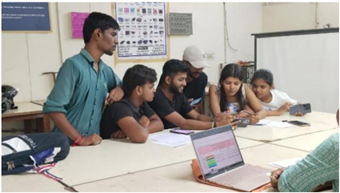
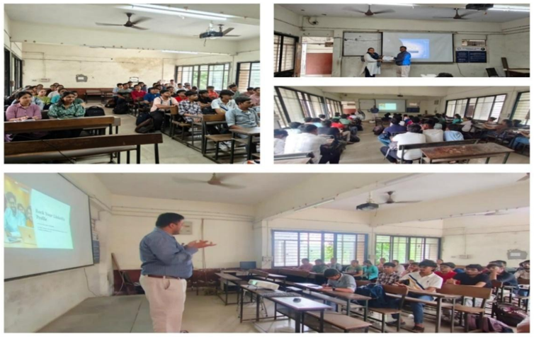
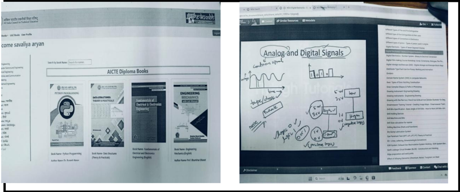
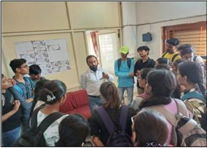
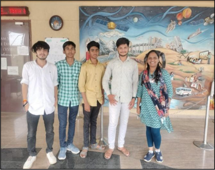
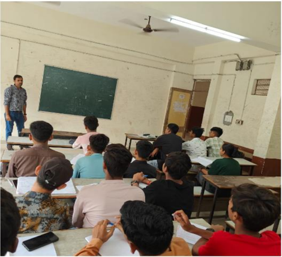
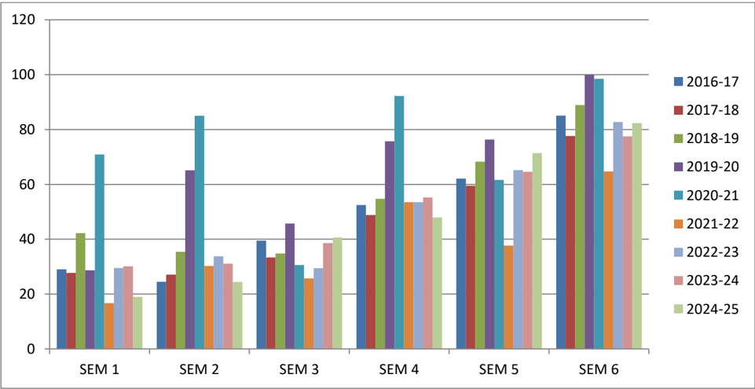

## ELECTRONICS AND COMMUNICATION ENGINEERING

## GOVERNMENT POLYTECHNIC GANDHINAGAR

SELF ASSESSMENT REPORT (SAR)

UNDERGRADUATE ENGINEERING PROGRAMS (TIER-II)

## SAR Contents

| Serial Code &  Link to the item   | Item                                                      | Page  Number   |
|-----------------------------------|-----------------------------------------------------------|----------------|
| PART A                            | Institutional Information                                 | I              |
| PART B                            | Criteria Summary                                          | V              |
|                                   | Program Level Criteria                                    |                |
| 1                                 | Vision, Mission and Program Educational Objectives        | 01             |
| 2                                 | Program Curriculum and Teaching - Learning Processes      | 30             |
| 3                                 | Course Outcomes and Program Outcomes                      | 138            |
| 4                                 | Students' Performance                                     | 183            |
| 5                                 | Faculty Information and Contributions                     | 207            |
| 6                                 | Facilities and Technical Support                          | 223            |
| 7                                 | Continuous Improvement                                    | 268            |
|                                   | Institute Level Criteria                                  |                |
| 8                                 | Student Support Systems                                   | 277            |
| 9                                 | Governance, Institutional Support and Financial Resources | 309            |
| PART C                            | Declaration by the Institution                            | 367            |
| Annexure-I                        | Program Outcomes(POs) & Program Specific  Outcomes(PSOs)  | 368            |

## PART A: Institutional Information

## 1. Name and Address of the Institution:

Government Polytechnic Gandhinagar

Opp. Tata Telecom, GIDC, K-6 Circle

Sector-26, Gandhinagar,

Gujarat Pin Code : 382028

## 2. Name and Address of the Directorate of Technical Education:

Directorate of Technical Education,

Block No. 2, 6th Floor, Karmyogi Bhavan,

Sector-10-A, Gandhinagar - 382 010

Phone: +91-79-232 53546

Fax: +91-79-232 53539

Email: dire-dte[at]gujarat[dot]gov[dot]in

## 3. Year of establishment of the Institution: 1991

## 4. Type of the Institution:

| University        |    |
|-------------------|----|
| Deemed University |    |
| Government Aided  |    |
| Autonomous        |    |
| Affiliated        | ✓  |

## 5. Ownership Status:

| Central Government        |    |
|---------------------------|----|
| State Government          | ✓  |
| Government Aided          |    |
| Self-Financing            |    |
| Trust                     |    |
| Society                   |    |
| Section 25 Company        |    |
| Any Other(Please specify) |    |

## 6. Other Academic Institutions of the Trust /Society / Company etc., if any:

| Name of the Institution(s)   | Year of  Establishment   | Programs of Study   | Location       |
|------------------------------|--------------------------|---------------------|----------------|
| Not Applicable               | Not Applicable           | Not Applicable      | Not Applicable |

7. Details of all the programs being offered by the institute under consideration:

|   Sr.  No | Program   Name                                         | Name of  The  Department                     |   Year  of  Start |   Intake | Increase/  decrease  in intake  if any   | Year of  increase   | AICTE  Approval   | Accreditation Status                                                                               |
|-----------|--------------------------------------------------------|----------------------------------------------|-------------------|----------|------------------------------------------|---------------------|-------------------|----------------------------------------------------------------------------------------------------|
|         1 | Diploma In  Chemical  Engineering                      | Chemical                                     |              2007 |       60 | 120                                      | 2009                | YES               | Granted accreditation  for 3 years for the  period (2025-28)                                       |
|         2 | Diploma in  Electronics &  Communication   Eng.        | Electronics &  Communicati on                |              1991 |       30 | 30                                       | 1998                | yes               | Granted accreditation  for 5 yearsfor the  period (2006-11)  Applied for  Accreditation in 2025    |
|         2 | Diploma in  Electronics &  Communication   Eng.        | Electronics &  Communicati on                |              1991 |       60 | 30                                       | 2008                | yes               | Granted accreditation  for 5 yearsfor the  period (2006-11)  Applied for  Accreditation in 2025    |
|         2 | Diploma in  Electronics &  Communication   Eng.        | Electronics &  Communicati on                |              1991 |       90 | 90                                       | 2009                | yes               | Granted accreditation  for 5 yearsfor the  period (2006-11)  Applied for  Accreditation in 2025    |
|         2 | Diploma in  Electronics &  Communication   Eng.        | Electronics &  Communicati on                |              1991 |      180 | -150                                     | 2020                | yes               | Granted accreditation  for 5 yearsfor the  period (2006-11)  Applied for  Accreditation in 2025    |
|         3 | Diploma in  Information  Technology                    | Information  Technology                      |              2007 |       60 | 120                                      | 2008                | yes               | Granted accreditation  for 3 years for the  period (2025-28)                                       |
|         4 | Diploma in  Biomedical  Engineering                    | Biomedical                                   |              2007 |       60 | 120                                      | 2009                | YES               | Not eligible for  accreditation                                                                    |
|         4 | Diploma in  Biomedical  Engineering                    | Biomedical                                   |              2007 |      180 | -30                                      | 2020                | YES               | Not eligible for  accreditation                                                                    |
|         4 | Diploma in  Biomedical  Engineering                    | Biomedical                                   |              2007 |      150 | -30                                      | 2022                | YES               | Not eligible for  accreditation                                                                    |
|         4 | Diploma in  Biomedical  Engineering                    | Biomedical                                   |              2007 |      120 | -60                                      | 2023                | YES               | Not eligible for  accreditation                                                                    |
|         5 | Diploma in  Computer  Engineering                      | Computer  Engineering                        |              1991 |       30 | 30                                       | 1998                | YES               | Granted accreditation  for 3 years for the  period (2025-28)                                       |
|         5 | Diploma in  Computer  Engineering                      | Computer  Engineering                        |              1991 |       60 | 30                                       | 2008                | YES               | Granted accreditation  for 3 years for the  period (2025-28)                                       |
|         5 | Diploma in  Computer  Engineering                      | Computer  Engineering                        |              1991 |       90 | 90                                       | 2009                | YES               | Granted accreditation  for 3 years for the  period (2025-28)                                       |
|         6 | Diploma in  Instrumentation  and control               | Instrumentat ion and  control                |              1991 |       30 | 30                                       | 2002                | YES               | Granted accreditation  for 5/ 6years for the  period (2006-11)  Applied for  Accreditation in 2025 |
|         6 | Diploma in  Instrumentation  and control               | Instrumentat ion and  control                |              1991 |       60 | 120                                      | 2009                | YES               | Granted accreditation  for 5/ 6years for the  period (2006-11)  Applied for  Accreditation in 2025 |
|         6 | Diploma in  Instrumentation  and control               | Instrumentat ion and  control                |              1991 |      180 | -120                                     | 2020                | Yes               | Granted accreditation  for 5/ 6years for the  period (2006-11)  Applied for  Accreditation in 2025 |
|         6 | Diploma in  Instrumentation  and control               | Instrumentat ion and  control                |              1991 |       60 | -30                                      | 2022                | YES               | Granted accreditation  for 5/ 6years for the  period (2006-11)  Applied for  Accreditation in 2025 |
|         7 | Diploma in  Electrical  engineering                    | Electrical                                   |              2009 |       60 | -                                        | -                   | YES               | Granted accreditation  for 3 years for the  period (2023-26)                                       |
|         8 | Diploma in  Automation And  Robotics                   | Automation  And Robotics                     |              2022 |       60 | -                                        | -                   | YES               | Not eligible for  accreditation                                                                    |
|         9 | Diploma in Civil  Engineering                          | Civil  Engineering                           |              2022 |       60 | -                                        | -                   | YES               | Not eligible for  accreditation                                                                    |
|        10 | Diploma In  Information And  Communication  Technology | Information  And  Communicati on  Technology |              2022 |       60 | -                                        | -                   | YES               | Not eligible for  accreditation                                                                    |
|        11 | Diploma In  Mechanical  Engineering                    | Mechanical  Engineering                      |              2022 |       60 | -                                        | -                   | YES               | Not eligible for  accreditation                                                                    |
|        12 | Diploma In  Metallurgy  Engineering                    | Metallurgy  Engineering                      |              2022 |       60 | -                                        | -                   | YES               | Not eligible for  accreditation                                                                    |

## 7.a Granted accreditation for 5/ 6 years for the period

|   Sr.  No. | Name of the  Department                  | Name of  the  Program                    | Year of 1st  Accreditation  (if applicable)                   | Year of 2nd  Accreditation  (if applicable)                   | Year of 3rd  Accreditation  (if applicable)                   |
|------------|------------------------------------------|------------------------------------------|---------------------------------------------------------------|---------------------------------------------------------------|---------------------------------------------------------------|
|          1 | Computer Engineering   Department        | Diploma in  Computer  Engineering        | Granted  accreditation for  5 years for the  period (2006-11) | Granted  accreditation for  3 years for the  period (2022-25) | Granted  accreditation for  3 years for the  period (2025-28) |
|          2 | Instrumentation &  Control Department    | Diploma in  Instrumentation  and control | Granted  accreditation for  5 years for the  period (2006-11) | --                                                            | --                                                            |
|          3 | Electronics &  Communication  Department | Diploma in  Electronics &  Communication | Granted  accreditation for  5 years for the  period (2006-11) | --                                                            | --                                                            |
|          4 | Chemical Engineering                     | Diploma in  Chemical  Engineering        | Granted  accreditation for  3 years for the  period (2022-25  | Granted  accreditation for  3 years for the  period (2025-28) | --                                                            |
|          5 | Information  Technology                  | Diploma in  Information  Technology      | Granted  accreditation for  3 years for the  period (2022-25  | Granted  accreditation for  3 years for the  period (2025-28) | --                                                            |
|          6 | Electrical Engineering                   | Diploma in  Electrical                   | Granted  accreditation for  3 years for the  period (2023-26) | --                                                            | --                                                            |

## 7.b Programs to be considered for Accreditation vide this application:

|   Sr. No. | Program Name                                       |
|-----------|----------------------------------------------------|
|         1 | Diploma in Electronics & Communication Engineering |
|         2 | Diploma in Instrumentation and control Engineering |

## 8. Total number of employees in the institution :

## A. Regular*Employees (Faculty and Staff):

## Table A.9.1 Regular Employees

| Items                                            |    | CAY  (2024-25)   | CAY  (2024-25)   | CAY m 1   (2023-24)   | CAY m 1   (2023-24)   | CAY m 2  (2022-23)   | CAY m 2  (2022-23)   |
|--------------------------------------------------|----|------------------|------------------|-----------------------|-----------------------|----------------------|----------------------|
|                                                  |    | Min              | Max              | Min                   | Max                   | Min                  | Max                  |
| Faculty members in  Engineering                  | M  | 80               | 81               | 81                    | 81                    | 74                   | 81                   |
| Faculty members in  Engineering                  | F  | 43               | 43               | 41                    | 42                    | 39                   | 42                   |
| Faculty members in  Maths, Science &  Humanities | M  | 6                | 6                | 6                     | 6                     | 7                    | 7                    |
|                                                  | F  | 4                | 4                | 4                     | 4                     | 5                    | 5                    |
| Non-teaching staff                               | M  | 5                | 5                | 5                     | 6                     | 9                    | 9                    |
| Non-teaching staff                               | F  | 4                | 4                | 4                     | 4                     | 5                    | 5                    |

* Including B.E. faculties of individual departments

Contractual Staff Employees *(Faculty and Staff): (Not covered in Table A):

## Table A.9.2 Contractual Staff Employees

| Items                                            |    | CAY  (2024-25)   | CAY  (2024-25)   | CAY m 1   (2023-24)   | CAY m 1   (2023-24)   | CAY m 2  (2022-23)   | CAY m 2  (2022-23)   |
|--------------------------------------------------|----|------------------|------------------|-----------------------|-----------------------|----------------------|----------------------|
|                                                  |    | Min              | Max              | Min                   | Max                   | Min                  | Max                  |
| Faculty members in  Engineering                  | M  | 1                | 1                | 1                     | 1                     | 1                    | 1                    |
| Faculty members in  Engineering                  | F  | 5                | 5                | 5                     | 5                     | 5                    | 5                    |
| Faculty members in  Maths, Science &  Humanities | M  | 0                | 0                | 0                     | 0                     | 0                    | 0                    |
| Faculty members in  Maths, Science &  Humanities | F  | 1                | 1                | 1                     | 1                     | 1                    | 1                    |
| Non-teaching staff                               | M  | 0                | 0                | 0                     | 0                     | 0                    | 0                    |
| Non-teaching staff                               | F  | 0                | 0                | 0                     | 0                     | 0                    | 0                    |

* Including B.E. faculties of individual departments

## 9.Total number of Engineering Students:

## Table A.10.1 UG Students

| Item                  |   CAY  (2024-25) |   CAY m 1   (2023-24) |   CAY m 2  (2022-23) |   CAY m 2  (2021-22) |
|-----------------------|------------------|-----------------------|----------------------|----------------------|
| Total no. of boys     |             2035 |                  2017 |                 1916 |                 1949 |
| Total no. of girls    |              285 |                   287 |                  250 |                  315 |
| Total no. of students |             2320 |                  2304 |                 2166 |                 2264 |

## Table A.10.2 PG Students

| Item                  | CAY  (2022-23)   | CAY m 1   (2021-22)   | CAY m 2  (2020-21)   |
|-----------------------|------------------|-----------------------|----------------------|
| Total no. of boys     |                  |                       |                      |
| Total no. of girls    |                  | NA                    |                      |
| Total no. of students |                  |                       |                      |

## 10. Contact Information of the Head of the Institution and NBA coordinator, if designated:

- i. Head of the Institution:

Name:

Shree R. D. Raghani

Designation:

Principal

Mobile No:

9428039918

Email id:

gp-gnagar-dte@gujarat.gov.in

- ii. NBA coordinator, if designated:

Name:

Shree J. T. Patankar

Designation:

HOD (Instrumentation & Control Engg.)

Mobile No:

9825514819

Email id: nbaelectricalgpg@gmail.com

## Part B Criteria Summery

## Name of the program: Electronics and Communication Engineering

| Criteria  No.            | Criteria                                                  | Mark/  Weightage         |
|--------------------------|-----------------------------------------------------------|--------------------------|
| Program Level Criteria   | Program Level Criteria                                    | Program Level Criteria   |
| 1                        | Vision, Mission and Program Educational Objectives        | 50                       |
| 2                        | Program Curriculum and Teaching - Learning Processes      | 200                      |
| 3                        | Course Outcomes and Program Outcomes                      | 100                      |
| 4                        | Students' Performance                                     | 200                      |
| 5                        | Faculty Information and Contributions                     | 150                      |
| 6                        | Facilities and Technical Support                          | 100                      |
| 7                        | Continuous Improvement                                    | 75                       |
| Institute Level Criteria | Institute Level Criteria                                  | Institute Level Criteria |
| 8                        | Student Support Systems                                   | 50                       |
| 9                        | Governance, Institutional Support and Financial Resources | 75                       |
| Total                    | Total                                                     | 1000                     |

## 1.1 State the Vision and Mission of the Department and Institution

## A. Availability of the Vision & Mission statements of the Department

## Institute Vision

- To develop technically  proficient  and  ethically  sound  diploma  engineers  contributing  to industry and society needs.

## Institute Mission

- To impart quality technical education.
- To shape students towards sensitizing in ethical values and contributing in nature.
- To familiarize students with the world of work.

## Department Vision:

To  develop  technically  sound  and  ethically  strong  diploma  electronics  and  communication engineers contributing to industry and society.

## Department Mission:

- To develop students' proficiency in the field of electronics & communication engineering to serve the industry and society.
- To focus on inculcating ethical values and contributory approach.
- To provide effective teaching learning to students through continuous faculty development.

## B. Appropriateness/Relevance of the Statements

## 1. Vision Statement

## Vision:

"To  develop  technically  sound  and  ethically  strong  diploma  electronics  and  communication engineers contributing to industry and society."

## Justification:

The vision statement of the department clearly articulates the long-term aspiration and desired future state.  As  per  the  definition,  a  vision  statement  should  serve  as  an  inspiring,  future-oriented declaration that guides institutional efforts.

This vision is:

- Clear and meaningful , emphasizing both technical competence and ethical strength.
- Aspirational and forward-looking , addressing the contemporary demands of industry and society.
- Aligned with professional and societal expectations , reflecting the institution's commitment to producing responsible and capable diploma engineers.

Thus,  it  is appropriate and correct from the  definition  perspective ,  fulfilling  the  criteria  of clarity, relevance, and alignment with long-term academic and professional goals.

## 2. Mission Statements

## Mission:

1. To develop students' proficiency in the field of electronics & communication engineering to serve the industry and society.
2. To focus on inculcating ethical values and contributory approach.
3. To provide effective teaching learning to students through continuous faculty development.

## Justification:

The  mission  statements  precisely  describe  the  operational  strategies  and  immediate  objectives through  which  the  vision  will  be  achieved.  By  definition,  a  mission  statement  should  state  the institution's purpose, address key stakeholders, and outline the means to accomplish the vision.

The given mission statements are:

- Specific and relevant to the discipline of Electronics & Communication Engineering , focusing on technical skill development and societal contribution.
- Inclusive of core academic values such as ethical practices and continuous learning.
- Addressing  key  functional  areas like  teaching-learning  methodologies  and  faculty development,  which  are  essential  for  maintaining  academic  excellence  and  delivering quality education.

The mission statements collectively ensure alignment with the vision and are correctly framed, relevant, and appropriate from the definition perspective .

## 3. Overall Appropriateness and Relevance

The Vision and Mission statements:

- Maintain internal consistency and complement each other .
- Reflect the core purpose of a diploma-level technical education program .
- Address the needs and expectations of stakeholders including students, faculty, industry, and society.
- Are correct as per standard definitions , being clear, relevant, purposeful, and aligned with the long-term objectives of the department and institution.

The department vision and mission statements are highly relevant and appropriate in the context of Outcome-Based Education (OBE) as promoted by the National Board of Accreditation (NBA). Here's an analysis of their appropriateness:

1. Focus  on  Outcomes: The  vision  and  mission  clearly  define  the  desired  outcomes  for students - technically sound, ethically strong engineers who can contribute to industry and society. This aligns well with OBE's emphasis on defining clear, measurable outcomes for educational programs.
2. Holistic  Development: The  statements  address  both  technical  proficiency  and  ethical values, which corresponds to NBA's focus on developing well-rounded professionals. This approach supports the development of both hard and soft skills.
3. Industry  and  Society  Relevance: There's  a  strong  emphasis  on  serving  industry  and society, which aligns with NBA's goal of ensuring that education is relevant to real-world needs and produces graduates who can contribute effectively to their field.
4. Continuous  Improvement: The  mission  includes  a  commitment  to  continuous  faculty development,  which  supports  OBE's  principle  of  ongoing  improvement  in  educational quality.
5. Specificity to the Field: The  vision and  mission  are specific to electronics  and communication engineering at the diploma level, allowing for targeted outcome definition as required in OBE.
6. Measurable Objectives: While not explicitly stated, the mission points provide a basis for developing measurable learning outcomes, which is crucial in OBE.
7. Stakeholder  Focus: By  mentioning  industry,  society,  and  faculty  development,  the statements acknowledge key stakeholders in the educational process, which is important in NBA's accreditation framework.
8. Ethical  Component: The  emphasis  on  ethics  aligns  with  NBA's  recognition  of  the importance of professional ethics and values in engineering education.
9. Teaching-Learning  Process: The  mission  specifically  mentions  effective  teachinglearning, which is a key component of OBE and NBA's evaluation criteria.

Overall, these vision and mission statements provide a solid foundation for developing an OBEcompliant program that would meet NBA's accreditation standards.

## C. Consistency of the Department statements with the Institute statements

## Consistency analysis/Alignment of Department Vision statement with AICTE, GTU, CTE and Institute Vision statements

| Statement                                                                                                                   | Institute                                                                                                                                        | Department                                                                                                                                                                                                                                                                                                                                                       | Consistency Analysis   |
|-----------------------------------------------------------------------------------------------------------------------------|--------------------------------------------------------------------------------------------------------------------------------------------------|------------------------------------------------------------------------------------------------------------------------------------------------------------------------------------------------------------------------------------------------------------------------------------------------------------------------------------------------------------------|------------------------|
| Develop  technically  proficient  and  ethically  sound  diploma engineers  contributing  to  industry  and  society needs. | Develop technically sound  and  ethically  strong  diploma  electronics  and  communication  engineers  contributing  to  industry  and society. | Strong Consistency: Both statements emphasize the  development  of  technically  competent  and  ethical  graduates  who  can  contribute  to  the  industry  and  society. The Department's vision specifically targets  electronics  and  communication  engineering,  demonstrating  a  clear  focus  within  the  broader  Institute vision.                 | Vision                 |
| To  impart  quality  technical  education.                                                                                  | To  develop  students'  proficiency in the field of  electronics  &  communication  engineering  to  serve  the  industry and society.           | Strong  Consistency:  The  Department's  mission  directly supports the Institute's mission by focusing  on imparting technical education in a specific field.  The emphasis on serving industry and society further  reinforces the Consistency.                                                                                                                | Mission 1              |
| To shape students  towards  sensitizing  in  ethical values and  contributing  in  nature.                                  | To  focus  on  inculcating  ethical  values  and  contributory approach.                                                                         | Strong  Consistency:  Both  statements  prioritize  the  development of ethical students who are committed  to  contributing  to  society.  While  the  Institute's  mission  is  broader,  the  Department's  mission  specifically targets ethical values and a contributory  approach  within  the  context  of  electronics  and  communication engineering. | Mission 2              |
| To  familiarize  students  with  the  world of work.                                                                        | To  provide  effective  teaching  learning  to  students  through  continuous  faculty  development.                                             | Moderate  Consistency:  The  Institute's  mission  focuses  on  preparing  students  for  the  workplace,  while the Department's mission centres on improving  teaching  and  learning.  Faculty  development  can  ultimately contribute to student preparedness.                                                                                              | Mission 3              |

## AICTE vision

To be a world-class organization leading technological and socio-economic development of the country by enhancing the global competitiveness of technical manpower and by ensuring high quality technical education to all sections of the society.

## GTU vision

To be a global university for the creation and dissemination of knowledge and innovation in science & technology, humanities and multidisciplinary domains for sustainable development and enrichment of human life.

## CTE vision

To facilitate quality technical and professional education having relevance for both industry and society, with moral and ethical values, giving equal opportunity and access, aiming to prepare globally competent technocrats.

## Institute vision

Develop technically proficient and ethically sound diploma engineers contributing to industry and society needs.

## Department vision:

Develop  technically  sound  and  ethically  strong  diploma  electronics  and  communication engineers contributing to industry and society.

## Justification for Alignment:

Alignment  with  AICTE  Vision: The  department's  focus  on  developing  technically  sound engineers  aligns  with  AICTE's  goal  of  enhancing  the  global  competitiveness  of  technical manpower. The emphasis on ethical strength also contributes to the overall quality of technical education.

Alignment with GTU Vision: While the department's vision does not explicitly mention innovation or sustainable development, the focus on developing technically sound engineers can contribute to these  areas.  By  producing  skilled  engineers,  the  department  contributes  to  the  creation  and dissemination of knowledge and innovation.

Alignment with CTE Vision: The department's vision aligns strongly with CTE's goals of quality technical education, relevance to industry and  society, and  preparing globally  competent technocrats.  The  focus  on  both  technical  proficiency  and  ethical  strength  ensures  that  the department's graduates are well-prepared for the industry.

Alignment with Institute Vision: The department vision is a specific extension of the institute's vision. By focusing on electronics and communication engineering, the department contributes to the overall goal of developing technically proficient and ethically sound diploma engineers.

| Vision  Statement   | Focus Area                                                                                    | Alignment  with  AICTE  Vision   | Alignment  with GTU  Vision   | Alignment  with CTE  Vision   | Alignment  with  Institute  Vision   | Justification                                                                                                                                                                                                                                                                                                               |
|---------------------|-----------------------------------------------------------------------------------------------|----------------------------------|-------------------------------|-------------------------------|--------------------------------------|-----------------------------------------------------------------------------------------------------------------------------------------------------------------------------------------------------------------------------------------------------------------------------------------------------------------------------|
| Department          | Technically  sound  and  ethically  strong diploma  electronics and  communicatio n engineers | Strong                           | Partial                       | Strong                        | Strong                               | The  department's  vision  aligns  well  with  the  AICTE,  CTE,  and  institute  visions,  focusing  on  the  development  of  technically  proficient  and  ethically sound engineers.  However, its focus is more  specific  than  GTU's  vision,  which  emphasizes  a  broader  scope  of  knowledge  and  innovation. |

## Consistency analysis/Alignment of Department Mission statement with AICTE, GTU, CTE and Institute Mission statements

## AICTE Mission

1. A true facilitator and an objective regulator
2. Transparent governance and accountable approach towards the society
3. Planned and coordinated development of Technical Education in the country by ensuring world-class standards of institutions through accreditation
4. Emphasis  on  developing  high  quality  institutions,  academic  excellence,  and  innovative research and development programs.
5. Networking with/ or a network of institutions for optimum resource utilization
6. Dissemination of knowledge
7. Technology forecasting and global manpower planning
8. Promoting  industry-institution  interaction  for  developing  new  products,  services,  and patents
9. Inculcating entrepreneurship
10. Encouraging indigenous technology
11. Focusing on non-formal education
12. Providing affordable education to all
13. Making Technical Education in India globally acceptable

## GTU Mission

1. To develop centers of academic excellence at university premises and at affiliated colleges in  domains  of  science,  engineering,  technology,  management,  and  environment  for imparting comprehensive education, training, and research infrastructure as per the nation requirements.
2. To build resources, facilities, proficiencies and other related infrastructure of global standard for  the  development  of  knowledge,  skills,  and  competencies  in  the  various  educational domains.
3. To  develop  research-oriented  pedagogy  for  flourishing  ideas  and  to  nurture  innovators, entrepreneurs and professionals of tomorrow
4. To  build  and  enhance  collaborations  with  other  academic,  research,  industry,  and government organizations as well as NGOs across the globe so that education, training and research at university and its affiliated colleges become aligned with national and global level requirements.
5. To encourage multidisciplinary research and develop flexible learning ecosystem.

## CTE Mission

1. Quality  technical  and  professional  education  with  continuous  improvement  of  all  the resources and personnel
2. To  promote  conducive  ecosystem  for  Academic,  Industry,  Research,  Innovations  and Startups
3. To provide affordable quality professional education with moral values, equal opportunities, accessibility and accountability
4. To allocate competent and dedicated human resources and infrastructure to the institutions for  providing  world-class  professional  education  to  become  a  Global  Leader  ('Vishwa Guru')

## Institute Mission

1. To impart quality technical education.
2. To shape students towards sensitizing in ethical values and contributing in nature.
3. To familiarize students with the world of work.

## Department Mission:

- To develop students' proficiency in the field of electronics & communication engineering to serve the industry and society.
- To focus on inculcating ethical values and contributory approach.
- To provide effective teaching learning to students through continuous faculty development.

## Justification for alignment:

- Alignment  with  AICTE  Mission: The  department  mission  aligns  with  elements  of AICTE's mission, such as developing high-quality institutions (through proficient engineers) and promoting industry interaction (serving industry needs). However, it doesn't directly  address  technology  forecasting,  entrepreneurship,  or  affordable  education  (these may be addressed at the institute or university level).
- Alignment  with  GTU  Mission: The  department  mission  aligns  with  aspects  of  GTU's mission, like academic excellence (developing proficiency) and research (through faculty development).  However,  GTU's  focus  is  broader,  encompassing  various  disciplines  and flexible learning, which are not explicitly mentioned in the department's mission.
- Alignment with CTE Mission: The department mission directly addresses all aspects of CTE's mission. It emphasizes quality technical education (developing proficiency), industry relevance  (serving  industry  and  society),  ethical  values  (inculcating  ethical  values),  and accessibility (through effective teaching-learning).
- Alignment  with  Institute  Mission: The  department  mission  aligns  strongly  with  the institute's mission. Both focus on imparting quality technical education and shaping students ethically. The department mission provides a more specific focus on the field of electronics & communication engineering.

| Mission  Statement   | Focus Area                                                                                                                                   | Alignment  with AICTE  Mission   | Alignment  with GTU  Mission   | Alignment  with CTE  Mission   | Alignment  with  Institute  Mission   | Justification                                                                                                                    |
|----------------------|----------------------------------------------------------------------------------------------------------------------------------------------|----------------------------------|--------------------------------|--------------------------------|---------------------------------------|----------------------------------------------------------------------------------------------------------------------------------|
| Department           | Develop proficiency in  electronics  &  communication  engineering,  inculcate  ethical  values,  and  provide  effective  teaching-learning | Strong                           | Partial                        | Strong                         | Strong                                | The  department  mission  aligns  well  with all except GTU's  broader  focus  on  multiple  disciplines  and flexible learning. |

## Consistency Analysis and Mapping of Department Vision & Mission with NEP 2020

## Introduction to NEP 2020

The National Education Policy (NEP) 2020 is a landmark education reform framework introduced by  the  Government  of  India,  aiming  to  revamp  the  education  system  to  meet  the  changing developmental  needs  of  the  country  while  retaining  its  cultural  and  human  values.  The  policy emphasizes  holistic,  multidisciplinary,  skill-based,  and  outcome-driven  education,  promoting equity,  inclusivity,  and  value-based  learning.  It  encourages  vocational  integration,  ethical  and humanistic  education,  continuous  faculty  development,  and  fostering  employability  through technical skill enhancement.

## Key highlights of NEP 2020 include:

1. Focus on skill-based and vocational education from an early stage.
2. Integration of value-based, ethical, and socially responsible learning.
3. Emphasis on continuous professional development of teachers.
4. Adoption of modern, student-centric, ICT-enabled teaching-learning methods.
5. Promotion of industry-academia collaboration and experiential earning.
6. Outcome-based and flexible curricula aligned with national priorities.

The policy envisions India as a global knowledge superpower with a robust, employable, ethical, and socially responsible technical workforce.

## A. Detailed Mapping of Department Vision with NEP 2020

| Department  Vision Element                                                         | Relevant NEP 2020 Principle                                                                               | Consistency  Level   | Justification for Alignment                                                                                                                                                 |
|------------------------------------------------------------------------------------|-----------------------------------------------------------------------------------------------------------|----------------------|-----------------------------------------------------------------------------------------------------------------------------------------------------------------------------|
| To  develop  technically  sound  diploma electronics  and communication  engineers | Skill-based,  vocational,  and  technical  education; Employability-focused higher  education             | High                 | Aligns  directly  with  NEP  2020's  emphasis  on  promoting  skill-based  education  and  technical  excellence  for  employability  and  meeting  industrial  demands.    |
| To  develop  ethically  strong  engineers                                          | Value-based,  ethical  and  humanistic  education;  Constitutional  and  civic  responsibility            | High                 | Ensures  technical  graduates  uphold integrity, fairness, and  social  responsibility,  reflecting NEP's objective of  integrating  ethics  into  professional education.  |
| Contributing  to  industry  and  society                                           | Holistic and multidisciplinary education;  National development; Sustainability and  community engagement | High                 | Reflects  NEP's  vision  for  graduates  to  actively  contribute  to  economic  progress,  sustainable  development, and community  welfare,  supporting  national  goals. |

## B. Detailed Mapping of Department Mission with NEP 2020

| Department Mission Element                                                                                                       | Relevant NEP 2020  Principle                                                                                                     | Consistency  Level   | Justification for Alignment                                                                                                                                                                |
|----------------------------------------------------------------------------------------------------------------------------------|----------------------------------------------------------------------------------------------------------------------------------|----------------------|--------------------------------------------------------------------------------------------------------------------------------------------------------------------------------------------|
| Develop students' proficiency in  the  field  of  electronics  &  communication  engineering  to  serve the industry and society | Skill-based,  vocational  and  technical  education;  Outcome-based  education;  Industry-academia  collaboration                | High                 | Prepares students  with industry- relevant  technical  skills,  in  line  with  NEP's  goal  of  outcome- based,  employability-enhancing  education  integrated  with  industry exposure. |
| Inculcate  ethical  values  and  contributory approach                                                                           | Value-based  education;  Humanistic, ethical outlook;  National  and  societal  contribution                                     | High                 | Embeds ethics, moral reasoning,  and  social  sensitivity  into  professional  education,  consistent  with NEP's emphasis  on  holistic,  value-driven  learning.                         |
| Provide  effective  teaching- learning  to  students  through  continuous faculty development                                    | Pedagogical  reforms;  Continuous  teacher  education  and  professional  development;  ICT-enabled  teaching-learning processes | High                 | Supports  NEP's  directives  for  continuous  faculty  upskilling,  modern teaching methodologies,  and  student-centric,  technology- enabled learning environments.                      |

## Summary

The Department of Electronics & Communication Engineering's Vision and Mission statements are highly aligned with the principles of NEP 2020. Both emphasize:

- Technical skill development
- Ethical and value-based education
- Industry collaboration and societal contribution
- Outcome-based learning
- Continuous professional development for educators

This alignment ensures the department's educational strategies are contemporary, nationally relevant, and contribute meaningfully to the national goal of preparing an employable, ethical, and socially responsible technical workforce.

## 1.2. State the Program Educational Objectives (PEOs) Program Educational Objectives (PEOs)

PEO 1: Students will apply their knowledge and skills in the field of electronics and communication engineering, to solve problems and contribute effectively to industry and society.

PEO 2: Students will uphold ethical principles to contribute to their communities as entrepreneurs and professionals.

PEO  3: Students  will  be  lifelong  learners  who  are  capable  of  adapting  to  technological advancements and emerging trends through career advancement and as professionals.

## Justification for Appropriateness of Program Educational Objectives (PEOs)

(Diploma in Electronics and Communication Engineering)

The  defined  Program  Educational  Objectives  (PEOs)  are  appropriately  designed  to  reflect  the vision,  mission,  stakeholder  needs,  and  graduate  attributes  required  by  the  NBA  for  diploma programs. Each PEO aligns with both technical competence and societal contribution, ensuring a well-rounded diploma graduate profile.

## PEO 1: Application of Knowledge and Skills

"Students  will  apply  their  knowledge  and  skills  in  the  field  of  electronics  and  communication engineering, to solve problems and contribute effectively to industry and society."

## Justification:

- This objective ensures that diploma graduates are job-ready, fulfilling the NBA's emphasis on program relevance to industry and society.
- It reflects the practical orientation of diploma education and aligns with Program Outcomes (POs)  like  problem  solving,  application  of  engineering  fundamentals,  and  modern  tool usage.
- The objective is consistent with stakeholder feedback gathered through SWOT analysis, especially  industry  and  alumni  inputs  emphasizing  employability,  hands-on  skills,  and applied problem-solving.
- By linking curriculum application to real-world challenges, it upholds the NBA's outcomebased education model.

## PEO 2: Ethical and Professional Contribution

"Students will uphold ethical principles to contribute to their communities as entrepreneurs and professionals."

## Justification:

- This  PEO addresses the NBA-mandated emphasis on ethics, responsibility,  and societal contribution,  especially  for  diploma  engineers  working  in  the  grassroots  of  technology deployment.
- Encouraging entrepreneurship aligns with national initiatives like Skill India and Start-up India, supporting self-reliant graduates.
- It also supports professionalism, which is vital in work environments where diploma holders take on critical implementation roles.
- Inclusion of ethics reflects the NBA's Graduate Attributes (GA) such as individual and team work, communication, and societal responsibility.

## PEO 3: Lifelong Learning and Adaptability

"Students will be lifelong learners who are capable of adapting to technological advancements and emerging trends through career advancement and as professionals." Justification:

- In the dynamic field of electronics and communication, continuous learning is essential to remain employable and innovative.
- This PEO prepares diploma engineers to pursue higher education, technical certifications, or  lateral  professional  growth  -  all  promoted  by  the  AICTE  and  NBA  guidelines  for vertical mobility.
- It  reinforces  the  lifelong  learning  attribute,  ensuring  pass  outs  to  remain  relevant  as technologies evolve (e.g., IoT, AI, 5G).
- Encourages  flexibility,  critical  thinking,  and  self-driven  learning  -  vital  in  today's technology-driven and multidisciplinary workplaces.

## 1.3. Indicate where and how the Vision, Mission and PEOs are published and disseminated among stakeholders

- ⮚ The  mission  and  vision  of  the  department  are  published  on  the  institute  and  department website which can be viewed by all the stakeholders.
- ⮚ The mission and vision displayed at prominent locations in the campus can be viewed by students, parents, faculty member and others.

Figure-1. Diagram Showing the Various Types of Stake holders

## Students:

-  They have most important role in the program.
-  Their feedback helps institute/department to improve pedagogy, to  implement innovative teaching-learning methodologies, to improve other facilities and to organize various extracurricular and co- curricular activities.

## Faculty:

-  They are important stake holders  as  they  directly  interact  with  the  students  through regular  classes/laboratories  and  assess  their  performance  through  various  evaluation techniques.
-  They are members of various committees  which execute/monitor curricular and cocurricular activities.
-  They are contributing for framing Vision, Mission, PEOs, and Course Outcomes.

## Mentor:

The Mentor plays  a  crucial  role  in  guiding  and  supporting  the  institution  or  department throughout the NBA accreditation process. Their responsibilities include:

## 1. Guidance and Advice:

- o The mentor provides expert guidance on how to prepare for NBA accreditation, sharing best practices and helping the institution understand NBA's criteria and expectations.

## 2. Review and Feedback:

- o They  review  the Self-Assessment  Report  (SAR) and  offer  constructive  feedback, suggesting improvements and clarifications where needed.

## 3. Support in Documentation:

- o The mentor helps ensure that documentation is accurate, complete, and well-organized, in line with NBA's quality requirements.

## 4. Preparation for Visit:

- o They assist in preparing the faculty and staff for the NBA team visit ,  including mock interviews and  ensuring  that  the  physical  and  digital  infrastructure  aligns  with  NBA standards.

## 5. Continuous Improvement:

- o The mentor emphasizes Outcome-Based Education (OBE) and continuous improvement, helping  the  institution  align  its vision,  mission,  PEOs,  POs,  and  COs with  NBA guidelines.

## 6. Problem Solving:

- o Acts  as  a  resource  for  addressing  challenges  or  gaps  in  compliance  with  accreditation standards.

## Employers:

-  They are one of the end users of the diploma engineers.
-  They provide suggestion for curriculum gap to make the students industry ready and improve institute-industry interactions.

## Parents :

-  They entrust the program so that their wards meet their career goals.

## Alumni:

-  They are the ambassadors of the program and their good footprint indicates long term success of the program.
-  Their feedback helps to make necessary changes in curriculum to meet the challenging demands of the real world.

The  vision,  mission  and  PEOs  are  disseminated  to  the  stakeholders  of  the  program  i.e., management,  faculty,  students,  staff,  alumni,  parents  and  current  and  prospective  employers through  continuous  interaction.  The  Vision  and  Mission  of  the  department  are  published  and disseminated through following:

|   Sr.  No. | Place of Dissemination                                                                       | Meant For                       |
|------------|----------------------------------------------------------------------------------------------|---------------------------------|
|          1 | Institute Website-http://www.gpgh.cteguj.in/                                                 | Internal & External Stakeholder |
|          2 | Department Website- https://sites.google.com/polytechnicgnr.gujarat.gov.in/el ectronics/home | Internal & External Stakeholder |
|          3 | Display Board at the entrance of department and  Corridors                                   | Internal & External Stakeholder |
|          4 | Departmental Notice Board                                                                    | Internal & External Stakeholder |
|          5 | H.O.D. Office, Departmental Laboratories and  Faculty cabins                                 | Internal Stakeholder            |
|          6 | Orientation/Induction Program                                                                | Internal & External Stakeholder |
|          7 | Course File                                                                                  | Internal Stakeholder            |
|          8 | Brochure of department                                                                       | Internal & External Stakeholder |
|          9 | Department email id signature (HOD-EC email id)                                              | Internal & External Stakeholder |
|         10 | Newsletter of department                                                                     | Internal & External Stakeholder |

Corridor                                                                   Notice Board

Laboratory /Faculty seating                                         HOD Cabin

Classroom                                                Orientation/Induction Program

The PEOs of the department are published and disseminated through:

|   Sr.  No. | Place of Dissemination                                                                       | Meant For                       |
|------------|----------------------------------------------------------------------------------------------|---------------------------------|
|          1 | Institute Website-http://www.gpgh.cteguj.in/                                                 | Internal & External Stakeholder |
|          2 | Department Website- https://sites.google.com/polytechnicgnr.gujarat .gov.in/electronics/home | Internal & External Stakeholder |
|          3 | Departmental Notice Board                                                                    | Internal & External Stakeholder |
|          4 | H.O.D. Office, Departmental Laboratories,  and Faculty cabins                                | Internal Stakeholder            |
|          5 | Course File                                                                                  | Internal Stakeholder            |

## Process of Dissemination among stakeholders

Vision, Mission and PEOs are disseminated to all the  stakeholders of the program through faculty meetings, student workshops, parent meetings and placement and training activities at regular intervals. They are disseminated during lectures and lab sessions (In lab manuals) too. The Vision, Mission and PEOs are also disseminated during the first-year orientation program by department faculty members.

|                           | Place of Display                                                                        | Dissemination                                                                                                                                        | Publication                                                                                                                                                                                                                                                                                                                                                   |
|---------------------------|-----------------------------------------------------------------------------------------|------------------------------------------------------------------------------------------------------------------------------------------------------|---------------------------------------------------------------------------------------------------------------------------------------------------------------------------------------------------------------------------------------------------------------------------------------------------------------------------------------------------------------|
| Vision,  Mission  and PEO | ● HOD Chamber  ● Notice Boards  ● Classrooms  ● Laboratories  ● Staff Rooms  ● Corridor | ● Seminars/Workshops  ● Alumni Meetings  ● Parents-Teacher Meeting  ● First Year orientation program  ● Meeting  with  HRs  during  placement drives | ● Institute  Website  http://www.gpgh.cteguj. in/ ● Department  Website- https://sites.google.com/ polytechnicgnr.gujarat. gov.in/electronics/home  ● Newsletter  (Vision,  Mission)  ● Course files  ● Department  Brochure  (Vision, Mission)  ● Lab  manuals  ( Vision,  Mission) ● Department  email  id  signature (HOD-EC email  id) ( Vision, Mission) |

## 1.4. State the process for defining the Vision and Mission of the department, and PEOs of the Program

- Timeline and steps for SWOT, Vision, Mission and PEO formation

Timeline and steps for SWOT, Vision, Mission and PEO formation

## SWOT Analysis - Draft Version

## Strengths

1. Strategic Location - Situated in the state capital, close to GIDC electronics estate, enabling better industry connectivity.
2. Qualified & Motivated Faculty - Balanced mix of young, experienced, and selfdriven teaching staff.
3. Adequate Infrastructure - Sufficient facilities to support academic and co-curricular activities.
4. AICTE Approval - Recognized and approved diploma program in Electronics & Communication.
5. Teamwork Culture - Strong collaboration between faculty and students.
6. Updated Curriculum - Recently revised syllabus aligned with current industry trends.
7. Academic Discipline - Strict adherence to academic calendar and schedules.
8. Resource-Rich Library - Well-stocked with relevant books and reference materials.

9. Modern Laboratories - Equipped with necessary instruments for practical learning.
10. Internet Connectivity - Sufficient access to support teaching-learning activities.
11. Industry Linkages - Active Industry-Institute interaction for student benefit.

## Weaknesses

1. Insufficient Supporting Staff - Limited non-teaching manpower for smooth departmental functioning.
2. No Department-Level Purchase Power - Hurdles in quick procurement of materials/equipment.
3. Low Student Enrolment - Declining intake over recent years.
4. Lower Merit Students - Entry-level academic standards need improvement.
5. Lack of Library Automation - Manual processes impacting efficiency.
6. Faculty Transfers - Frequent changes affecting continuity.
7. Limited Hands-on Exposure - Students lack adequate practical exposure in curriculum.
8. Inadequate Industry Visits/Exposure - Limited real-world industry experience integrated into studies.

## Opportunities

1. ICT-Based Teaching - Adoption of modern digital tools for enhanced learning.
2. Faculty Development - Training in latest and emerging technologies.
3. Student Startup Support - Encouraging entrepreneurship and innovation.
4. External  Funding -  Potential  to  attract  funds  from  donors,  alumni,  industries,  and foundations.

## Threats

1. Declining Interest in Diploma EC - Fewer students opting for the branch.
2. Competition from Private Institutes - Self-financed institutions in the vicinity.
3. Limited  Electronics  Industry  in  Gujarat -  Scarcity  of  design  and  manufacturing opportunities.
4. High Dropout Rates - Students leaving before completion of the course.

The Vision and Mission Statements of the department have been revised by considering the institutional Mission & Vision. The department has adopted a consultative approach to establish its vision and mission by involving the stakeholders of the institute such as faculty, students, staff,  parents,  alumni,  industrial  experts,  and  employers.  While  articulating  the  vision  and mission statements for the department the future technology and societal requirements were also considered. Considering the institutional Vision and Mission as the base and incorporating global projections in the field of electronics and communication engineering, the Vision and Mission  Statements  of  the  department  have  been  defined.  The  faculty  members  of  the department met number of times to develop and cultivate a strong and meaningful Vision and Mission statements. SWOT analysis was done for the department as below.

## Strength

- Located in state capital nearby GIDC electronics estate
- Good blend of young, qualified, experienced and self-motivated faculty members
- Adequate infrastructure
- AICTE approved diploma EC
- Excellent team work among faculty and students
- Revised and updated curriculum of diploma EC
- Academic calendar is strictly adhered to the schedule
- Rich library
- Well-equipped laboratory
- Enough Internet access
- Good Industry Institute interaction

## Weakness

- Major lack of supporting staff
- No purchase power at department level
- Poor student enrollment
- Low merit students
- Lack of Library Automation
- Transfer of faculty
- Lack of exposure to students for hands on experience in curriculum
- Lack of industry exposure to students in curriculum

## Opportunities

- ICT based teaching learning
- Training of faculty members in emerging areas
- Student startup support
- Possibility of fund raising from Donors/Alumnus/Business/Foundation

## Threats

- Decreasing interest of students opting for diploma EC
- Self financed institutes in surroundings
- Lack of design and manufacturing industries in electronics field in Gujarat
- Major dropout of students

## Overcoming Weaknesses of the Department over the time

## Weaknesses

1. Lack of Library Automation
2. Lack of exposure to students for hands on experience in curriculum
3. Lack of industry exposure to students in curriculum

## Strength

1.  Library  Automation  (Since  April-2022 in institute library)
2. Micro project introduced in most of the subjects  in  curriculum  for  students  for hands on experience (In curriculum developed w.e.f. 2021)

3.  Internship  included  in  curriculum  for

A  series  of  discussions  were  conducted  simultaneously  among  parents,  students,  alumni, Industry experts and expert from NBA accredited institute to finalize the Vision, Mission and PEOs.

Stake Holder meeting for formation of vision, mission and PEOs of the department

Stake Holder meeting for formation of vision, mission and PEOs of the department

Department level meeting to develop and cultivate a strong and meaningful Vision, Mission and PEOs statements of the department

## A. Description of process of defining Vision & Mission of the Department

## Process for Defining Vision and Mission of the Department

This flowchart describes the process of developing a department's vision and mission statement. The process flows from top to bottom with the following main steps:

1. The process starts by considering the institutional Mission & Vision.
2. SWOT analysis of the department is conducted in consultation with stakeholders.
3. A draft version of the Vision and Mission statements is formed based on inputs from various stakeholders (faculty, students,  staff,  parents,  alumni,  industrial  experts,  and employers).
4. An assessment of the draft version is done by faculty members.
5. Finally, the final Vision and Mission Statements are formed.

These stakeholders provide input into the drafting process. The flowchart indicates a structured approach to creating a department's vision and mission, incorporating perspectives from various stakeholders associated with the institution.

## Government polytechnic, Gandhinagar

## Electronics & Communication Engineering Department

## Draft Vision and Mission

Following points are to be considered while forming Vision and Mission of the department.

Department Vision: Empowering innovative electronics and communication engineers who drive technological advancement with integrity and societal impact.

## Department Mission:

1. Cultivate expertise: Provide cutting-edge education in electronics and communication engineering, bridging academic knowledge with industry demands.
2. Foster ethics: Nurture responsible professionals who prioritize ethical considerations in their technical pursuits.
3. Enhance  learning: Continuously improve educational quality through faculty development and innovative teaching approaches.
4. Inspire impact: Encourage students to apply their skills towards solving real-world challenges and contributing to societal progress.

## Pre-final version of Vision and Mission

## Department Vision:

To create diploma graduates in electronics and communication engineering who are technically proficient and ethically grounded, making significant contributions to industry and society.

## Department Mission:

- To  equip  students  with  a  strong  foundation  in  electronics  and  communication engineering, preparing them to meet the needs of the industry and society.
- To instil ethical values and a sense of responsibility in students, encouraging them to contribute positively.
- To ensure a high-quality learning experience through ongoing faculty development and effective teaching methodologies.

## Final version of Vision and Mission

## Department Vision:

Develop  technically  sound  and  ethically  strong  diploma  electronics  and  communication engineers contributing to industry and society.

## Department Mission:

- To  develop  students'  proficiency  in  the  field  of  electronics  &  communication engineering to serve the industry and society.
- To focus on inculcating ethical values and contributory approach.
- To  provide effective teaching learning to students through continuous faculty development.

## B. Description of process involved in defining the PEOs of the program

Process for Defining PEOs of the Department

## PEO-Definition:

Broad long-term career goals that  describe  what  diploma  pass  out  students  are  expected  to achieve 3-5 years after completing the program.

Focus:

## Professional achievement, lifelong learning, societal contribution, and ethical practice.

## Audience:

Intended for diploma pass outs after they enter the workforce or pursue higher studies.

The image depicts a flowchart illustrating the process of developing and refining a department's vision and mission within an educational institution. This process involves multiple stakeholders and follows a structured approach. Here's a detailed description of the process shown:

## 1. Institute Vision and Mission:

The process begins with the overarching vision and mission of the institute. This serves as the foundation and guiding principle for all subsequent steps.

## 2. Department Vision and Mission:

Building  on  the  institute's  vision  and  mission,  a  preliminary  department-specific  vision  and mission  is  formulated.  This  step  ensures  alignment  between  the  department's  goals  and  the broader institutional objectives.

## 3. Stakeholders' View:

This  is  a  crucial  phase  where  input  is  gathered  from  various  stakeholders.  The  stakeholders included in this process are:

- ⮚ Alumni: Former students who can provide perspectives based on their experiences.
- ⮚ Parents & Students: Current students and their parents, offering insights into expectations and experiences.
- ⮚ Employers: Organizations that hire graduates, providing industry perspectives and requirements.
- ⮚ Faculty Members: Academic staff who are integral to implementing the vision and mission.
- ⮚ Students:  Current  students  who  are  directly  affected  by  the  department's  policies  and direction.

These stakeholders contribute their views, likely through surveys, meetings, or other feedback mechanisms. Their diverse perspectives ensure a comprehensive understanding of the department's role and impact.

4. Summarize and Analyse Views:

After collecting input from all stakeholders, the next step involves consolidating and analyzing the gathered information. This likely includes identifying common themes, priorities, and areas of concern across different stakeholder groups.

## 5. Accept:

Based on the analysis of stakeholder views, the department leadership makes decisions on what aspects  to  incorporate  into  the  vision  and  mission.  This  step  may  involve  discussions  and refinements to ensure the final version adequately reflects stakeholder input while aligning with institutional goals.

6. PEOs (Program Educational Objectives):

The final step in this process is the formulation of Program Educational Objectives. These are specific,  measurable  goals  that  the  department  sets  for  its  educational  programs,  directly informed by the newly refined vision and mission.

This  systematic  approach  ensures  that  the  department's  vision,  mission,  and  educational objectives  are  not  created  in  isolation  but  are  instead  the  result  of  a  collaborative  effort  that considers multiple perspectives. It demonstrates a commitment to inclusivity and responsiveness to the needs and expectations of various groups connected to the department and institution.

## 1.5 Establish consistency of PEOs with Mission of the Department

The PEOs ensure the accomplishments of the mission of the Department with special emphasis on technical competence of engineers, value addition, and sustainable solutions to engineering problems. For the mapping of PEOs and Mission, several meetings of the faculty members were conducted  at  department  level.  The  feedback  of  the  faculty  members  was  taken  into consideration and the mapping was finalized as below.

The Vision, Mission and PEOs were also finalized based on the following components:

- ⮚ Departmental meeting
- ⮚ Feedback from industries
- ⮚ Feedback from students/ alumni
- ⮚ Feedback from training and placement department
- ⮚ Parents meet

Department level meeting-1 for mapping of PEOs and Mission

Department level meeting-2 for mapping of PEOs and Mission

## A. Preparation of a matrix of PEOs and elements of Mission statement

| PEO                                                                                                                                                                                        | Mission                                                                                                                                     |   Mapping  Level |
|--------------------------------------------------------------------------------------------------------------------------------------------------------------------------------------------|---------------------------------------------------------------------------------------------------------------------------------------------|------------------|
| PEO 1:  Students will apply their knowledge and skills  in the field of electronics and communication  engineering, to solve problems and contribute  effectively to industry and society. | M1: To  develop  students'  proficiency  in  the  field  of  electronics  &  communication  engineering to serve the industry  and society. |                3 |
| PEO 1:  Students will apply their knowledge and skills  in the field of electronics and communication  engineering, to solve problems and contribute  effectively to industry and society. | M2: To  focus  on  inculcating  ethical  values  and  contributory  approach.                                                               |                1 |
| PEO 1:  Students will apply their knowledge and skills  in the field of electronics and communication  engineering, to solve problems and contribute  effectively to industry and society. | M3: To  provide  effective  teaching  learning  to  students  through  continuous  faculty  development.                                    |                2 |
| PEO 2:  Students will uphold ethical principles to  contribute to their communities as entrepreneurs and  professionals.                                                                   | M1: To  develop  students'  proficiency  in  the  field  of  electronics  &  communication  engineering to serve the industry  and society. |                2 |
| PEO 2:  Students will uphold ethical principles to  contribute to their communities as entrepreneurs and  professionals.                                                                   | M2: To  focus  on  inculcating  ethical  values  and  contributory  approach.                                                               |                3 |
| PEO 2:  Students will uphold ethical principles to  contribute to their communities as entrepreneurs and  professionals.                                                                   | M3: To  provide  effective  teaching  learning  to  students  through  continuous  faculty  development.                                    |                1 |
| PEO 3:  Students will be lifelong learners who are  capable of adapting to technological advancements  and emerging trends through career advancement and  as professionals.               | M1: To  develop  students'  proficiency  in  the  field  of  electronics  &  communication  engineering to serve the industry  and society. |                3 |
| PEO 3:  Students will be lifelong learners who are  capable of adapting to technological advancements  and emerging trends through career advancement and  as professionals.               | M2: To  focus  on  inculcating  ethical  values  and  contributory  approach.                                                               |                2 |
| PEO 3:  Students will be lifelong learners who are  capable of adapting to technological advancements  and emerging trends through career advancement and  as professionals.               | M3: To  provide  effective  teaching  learning  to  students  through  continuous  faculty  development.                                    |                2 |

## B. Consistency/justification of co-relation parameters of the above matrix

| PEO   | Mission   |   Mapping Level | Justification                                                                                                                                                                                                  |
|-------|-----------|-----------------|----------------------------------------------------------------------------------------------------------------------------------------------------------------------------------------------------------------|
| PEO1  | M1        |               3 | This is strongly aligned (level 3) because both the PEO  and M1 focus on developing proficiency in electronics  and  communication engineering to serve industry  and  society.                                |
| PEO1  | M2        |               1 | The weak alignment (level 1) is due to M2's focus on  ethical values, which is not explicitly mentioned in PEO  1.                                                                                             |
| PEO1  | M3        |               2 | There's  a  moderate  alignment  (level  2)  as  effective  teaching  and  faculty  development  indirectly  support  students' ability to apply knowledge and skills.                                         |
| PEO2  | M1        |               2 | There's moderate alignment (level 2) as serving industry  and  society  relates  to  contributing  to  communities,  though ethics aren't explicitly mentioned in M1.                                          |
| PEO2  | M2        |               3 | This is strongly aligned (level 3) due to the direct focus  on ethical values in both PEO 2 and M2.                                                                                                            |
| PEO2  | M3        |               1 | The  weak  alignment  (level  1)  is  because  faculty  development doesn't directly address ethical principles  or community contribution.                                                                    |
| PEO3  | M1        |               3 | There is a strong alignment (level 3) as proficiency in  the field directly supports adaptability to advancements,  though lifelong learning.                                                                  |
| PEO3  | M2        |               2 | The  moderate  alignment  (level  2)  comes  from  the  contributory  approach  in  M2,  which  relates  to  professional  development,  though  it  doesn't  directly  address technological adaptation.      |
| PEO3  | M3        |               2 | This  also  has  moderate  alignment  (level  2)  because  continuous faculty development indirectly supports the  concept of lifelong learning, though it doesn't explicitly  address students' adaptability. |

1. Slight (Low) 2.Moderate (Medium) 3. Substantial (High)

2

## Program Curriculum and Teaching Learning Process

50

## 2.1. Program Curriculum

2.1.1 State the process used to identify extent of compliance of the curriculum for attaining the Program Outcomes (POs) and Program Specific Outcomes (PSOs)

## A. Process used to identify extent of compliance of curriculum for attaining POs & PSOs

Government  Polytechnic  Gandhinagar  is  affiliated  to  Gujarat  Technological  University (GTU). The course curriculum for diploma in electronics and communication engineering is provided by the university. Each syllabus is mentioned with course title and course code, semester in which it is offered, teaching and examination scheme with credit, content, percentage Weightage of each topic, distribution of marks for each cognitive level, course outcomes, list of experiments, list of equipment and reference books.

University  started  it  academic  activities  in  2008  and  first  revised  curriculum  has  been implemented from academic year 2012-13. GTU established CDC (Curriculum Development Cell) in 2012 to revise the curriculum of all diploma-engineering courses under the supervision of experts from NITTTR (National Institute of Technical Teachers Training and Research) Bhopal and GTU affiliated Diploma Colleges across the state. Syllabus design process Involve all the stake holders of the  system,  implementers,  students,  faculties,  alumni  and  industry  experts.  CDC  finalized  the curriculum for each course. The structure of EC curriculum is shown in table 2.1.1.1.

## Teaching Scheme and Course Category

Table 2.1.1.1. Teaching Scheme & Course Category (Old- For batches admitted before 2021)

| Course  Code   | Course Title                                     | Teaching  Scheme/  L   | Week  T      | P            | Credit  (L+T+P)   | Theory  Mark   | ESE  PA      | Practical  Mark  ESE  PA   | Practical  Mark  ESE  PA   | Grand  Total   | Course  Category   |
|----------------|--------------------------------------------------|------------------------|--------------|--------------|-------------------|----------------|--------------|----------------------------|----------------------------|----------------|--------------------|
| SEMESTER - 1   | SEMESTER - 1                                     | SEMESTER - 1           | SEMESTER - 1 | SEMESTER - 1 | SEMESTER - 1      | SEMESTER - 1   | SEMESTER - 1 | SEMESTER - 1               | SEMESTER - 1               | SEMESTER - 1   | SEMESTER - 1       |
| 3300001        | Basic Mathematics                                | 2                      | 2            | 0            | 4                 | 70             | 30           | 0                          | 0                          | 100            | BM                 |
| 3300002        | English                                          | 3                      | 2            | 0            | 5                 | 70             | 30           | 20                         | 30                         | 150            | HS                 |
| 3300005        | Basic Physics                                    | 3                      | 0            | 2            | 5                 | 70             | 30           | 20                         | 30                         | 150            | ES                 |
| 3311101        | Electronic Components & Practice                 | 4                      | 0            | 4            | 8                 | 70             | 30           | 40                         | 60                         | 200            | PC                 |
| 3320901        | Basic of Electrical Engineering                  | 3                      | 0            | 2            | 5                 | 70             | 30           | 20                         | 30                         | 150            | ES                 |
| 3300013        | Basic of Computer & Information Technology       | 0                      | 0            | 4            | 4                 | 0              | 0            | 40                         | 60                         | 100            | ES                 |
| SEMESTER - 2   | SEMESTER - 2                                     | SEMESTER - 2           | SEMESTER - 2 | SEMESTER - 2 | SEMESTER - 2      | SEMESTER - 2   | SEMESTER - 2 | SEMESTER - 2               | SEMESTER - 2               | SEMESTER - 2   | SEMESTER - 2       |
| 1990001        | Contributor Personality Development              | 4                      | 0            | 0            | 4                 | 70             | 30           | 20                         | 30                         | 150            | HS                 |
| 3320002        | Advanced Mathematics   (Group -1)                | 2                      | 2            | 0            | 4                 | 70             | 30           | 0                          | 0                          | 100            | EM                 |
| 3300003        | Environment Conservation  & Hazard Management    | 4                      | 0            | 0            | 4                 | 70             | 30           | 0                          | 0                          | 100            | HS                 |
| 3321101        | Electronic Circuits & Applications               | 4                      | 0            | 4            | 8                 | 70             | 30           | 40                         | 60                         | 200            | PC                 |
| 3321102        | Electronic Networks                              | 3                      | 2            | 2            | 7                 | 70             | 30           | 20                         | 30                         | 150            | PC                 |
| 3321103        | Electronics workshop                             | 0                      | 0            | 4            | 4                 | 0              | 0            | 40                         | 60                         | 100            | PC                 |
| SEMESTER - 3   | SEMESTER - 3                                     | SEMESTER - 3           | SEMESTER - 3 | SEMESTER - 3 | SEMESTER - 3      | SEMESTER - 3   | SEMESTER - 3 | SEMESTER - 3               | SEMESTER - 3               | SEMESTER - 3   | SEMESTER - 3       |
| 3331101        | Antenna & Wave Propagation                       | 3                      | 0            | 2            | 5                 | 70             | 30           | 20                         | 30                         | 150            | PC                 |
| 3331102        | Analog Electronics                               | 4                      | 0            | 4            | 8                 | 70             | 30           | 40                         | 60                         | 200            | PC                 |
| 3331103        | Principle Of Electronic Communication            | 3                      | 0            | 2            | 5                 | 70             | 30           | 20                         | 30                         | 150            | PC                 |
| 3331104        | Digital Logic Design                             | 3                      | 1            | 2            | 6                 | 70             | 30           | 20                         | 30                         | 150            | PC                 |
| 3331105        | Programming In C                                 | 3                      | 0            | 4            | 7                 | 70             | 30           | 40                         | 60                         | 200            | PC                 |
| SEMESTER- 4    | SEMESTER- 4                                      | SEMESTER- 4            | SEMESTER- 4  | SEMESTER- 4  | SEMESTER- 4       | SEMESTER- 4    | SEMESTER- 4  | SEMESTER- 4                | SEMESTER- 4                | SEMESTER- 4    | SEMESTER- 4        |
| 3341101        | Microprocessor And Assembly Language Programming | 3                      | 0            | 2            | 5                 | 70             | 30           | 20                         | 30                         | 150            | PC                 |
| 3341102        | Digital Communication                            | 3                      | 0            | 2            | 5                 | 70             | 30           | 20                         | 30                         | 150            | PC                 |
| 3341103        | Optical Communication                            | 3                      | 0            | 2            | 5                 | 70             | 30           | 20                         | 30                         | 150            | PC                 |
| 3341104        | Electronics Instruments & Measurement            | 3                      | 0            | 2            | 5                 | 70             | 30           | 20                         | 30                         | 150            | PC                 |
| 3341105        | Industrial Electronics                           | 4                      | 0            | 2            | 6                 | 70             | 30           | 20                         | 30                         | 150            | PC                 |
| 3341106        | Circuit Design Tools                             | 0                      | 0            | 4            | 4                 | 0              | 0            | 40                         | 60                         | 100            | PC                 |
| SEMESTER - 5   | SEMESTER - 5                                     | SEMESTER - 5           | SEMESTER - 5 | SEMESTER - 5 | SEMESTER - 5      | SEMESTER - 5   | SEMESTER - 5 | SEMESTER - 5               | SEMESTER - 5               | SEMESTER - 5   | SEMESTER - 5       |
| 3351101        | Microcontroller                                  | 4                      | 0            | 2            | 6                 | 70             | 30           | 20                         | 30                         | 150            | PC                 |
| 3351102        | Mobile Communication                             | 4                      | 0            | 2            | 6                 | 70             | 30           | 20                         | 30                         | 150            | PC                 |
| 3351103        | Microwave & Radar Engineering                    | 4                      | 0            | 2            | 6                 | 70             | 30           | 20                         | 30                         | 150            | PC                 |
| 3351104        | Software Practices                               | 0                      | 0            | 2            | 2                 | 70             | 0            | 20                         | 30                         | 150            | PC                 |
| 3351105        | Computer Networks                                | 4                      | 0            | 2            | 6                 | 70             | 30           | 20                         | 30                         | 150            | PEC                |
| 3351107        | Project-I                                        | 0                      | 0            | 4            | 4                 | 0              | 0            | 40                         | 60                         | 100            | PBC                |
| SEMESTER - 6   | SEMESTER - 6                                     | SEMESTER - 6           | SEMESTER - 6 | SEMESTER - 6 | SEMESTER - 6      | SEMESTER - 6   | SEMESTER - 6 | SEMESTER - 6               | SEMESTER - 6               | SEMESTER - 6   | SEMESTER - 6       |
| 3361101        | Entrepreneurship and industrial management       | 4                      | 0            | 0            | 4                 | 70             | 30           | 0                          | 0                          | 100            | M                  |
| 3361102        | Consumer Electronics                             | 4                      | 0            | 2            | 6                 | 70             | 30           | 20                         | 30                         | 150            | PC                 |
| 3361103        | Maintenance Of Electronics Equipments            | 0                      | 0            | 2            | 2                 | 0              | 0            | 20                         | 30                         | 50             | PC                 |
| 3361104        | VLSI                                             | 4                      | 0            | 2            | 6                 | 70             | 30           | 20                         | 30                         | 150            | PEC                |
| 3361105        | Embedded System                                  | 4                      | 0            | 2            | 6                 | 70             | 30           | 20                         | 30                         | 150            | PEC                |
| 3361109        | Project - II                                     | 0                      | 0            | 6            | 6                 | 0              | 0            | 200                        | 100                        | 300            | PBC                |

##  Abbreviations:

- HS - Humanities & Social Science Courses
- BM - Basic Mathematics
- EM - Engineering Mathematics
- ES - Engineering Science Course
- M - Management based course
- PC - Program Core Course
- PEC - Program Elective Course
- PBC - Project Based Course

##  Semester wise Credit distribution and Weightage

Table 2.1.1.2. Credit distribution and its Weightage Semester wise

| Sr. No   | Semester   |   Credit | Weightage   |
|----------|------------|----------|-------------|
| 1        | First      |       31 | 16.94%      |
| 2        | Second     |       31 | 16.94%      |
| 3        | Third      |       31 | 16.94%      |
| 4        | Fourth     |       30 | 16.39%      |
| 5        | Fifth      |       30 | 16.39%      |
| 6        | Sixth      |       30 | 16.39%      |
|          | Total      |      183 | 100.00%     |

Figure 2.1.1.1. Graphical Representation of Percentage Credit Distribution in Semester

Table 2.1.1.3. Percentage Weightage of course and credit distribution

| Sr   No.   | Components                                |   Credit |   No. of  courses | %  Weightage  of course   | % Weightage of  course credit   |
|------------|-------------------------------------------|----------|-------------------|---------------------------|---------------------------------|
| 1          | HS - Humanities & Social  Science Courses |       13 |                 3 | 8.57%                     | 7.10%                           |
| 2          | BM - Basic Science                        |        4 |                 1 | 2.86%                     | 3.33%                           |
| 3          | EM - Engineering Math                     |        4 |                 1 | 2.86%                     | 3.33%                           |
| 4          | ES - Engineering Science  Course          |       14 |                 3 | 8.57%                     | 11.67%                          |
| 5          | M - Management based course               |        4 |                 1 | 2.86%                     | 3.33%                           |
| 6          | PC - Program Core Course                  |      116 |                21 | 60.00%                    | 96.67%                          |
| 7          | PEC - Program Elective  Course            |       18 |                 3 | 8.57%                     | 15.00%                          |
| 8          | PBC - Project Based Course                |       10 |                 2 | 5.71%                     | 8.33%                           |
|            | Total                                     |      183 |                35 | 100%                      | 100%                            |

Figure 2.1.1.2 Graphical Representation of Percentage Weightage of Credit Distribution in Semester

Figure 2.1.1.3 Graphical representation of percentage Weightage of course credit distribution

To keep in line with AICTE model curriculum, Gujarat Technological University has made fourth  revision  and  design  Competency-focused  Outcome-based  Green  Curriculum-2021  (COGC2021) with nine different categories of courses. It was in effect from September 2021. First batch of this revised curriculum will pass out in June 2024.

As per the need of Industries some courses having programming with hardware as well as new course categories of Audit and Mandatory are added in the curriculum in line with NEP2020 from the year 2024-25.

| Course       | Course Title                                  | Teaching  Credit  Theory   | Teaching  Credit  Theory   | Teaching  Credit  Theory   | Teaching  Credit  Theory   | Teaching  Credit  Theory   | Practical  Grand   | Practical  Grand   | Practical  Grand   | Total  Course Category   | Total  Course Category                    |
|--------------|-----------------------------------------------|----------------------------|----------------------------|----------------------------|----------------------------|----------------------------|--------------------|--------------------|--------------------|--------------------------|-------------------------------------------|
| Code         |                                               | Scheme/ Week  L            | T                          | (L+T+P)  P                 | Mark  ESE                  | Mark  ESE                  | Mark  PA           | ESE                | PA                 |                          |                                           |
| SEMESTER - 1 | SEMESTER - 1                                  | SEMESTER - 1               | SEMESTER - 1               | SEMESTER - 1               | SEMESTER - 1               | SEMESTER - 1               | SEMESTER - 1       | SEMESTER - 1       | SEMESTER - 1       | SEMESTER - 1             | SEMESTER - 1                              |
| 4300001      | Mathematics                                   | 3                          | 1                          | 0                          | 4                          | 70                         | 30                 | 0                  | 0                  | 100                      | Basic science                             |
| 4300002      | Communication Skills in English               | 2                          | 0                          | 2                          | 3                          | 70                         | 30                 | 25                 | 25                 | 150                      | HS                                        |
| 4300005      | Physics                                       | 3                          | 0                          | 2                          | 4                          | 70                         | 30                 | 25                 | 25                 | 150                      | Basic science                             |
| 4300010      | Basics  of  Information  and  Communication   | 0                          | 0                          | 4                          | 2                          | 0                          | 0                  | 25                 | 25                 | 50                       | Engineering                               |
| 4300015      | Technology  Sports and Yoga                   | 0                          | 0                          | 2                          | 0                          | 0                          | 0                  | 50                 | 0                  | 50                       | Sciences  HS                              |
| 4311101      | Fundamentals of Electrical Engineering        | 3                          | 0                          | 2                          | 4                          | 70                         | 30                 | 25                 | 25                 | 150                      | Engineering                               |
| 4311102      | Fundamentals of Electronics                   | 4                          | 0                          | 2                          | 5                          | 70                         | 30                 | 25                 | 25                 | 150                      | Sciences  Program Core                    |
| SEMESTER - 2 | SEMESTER - 2                                  | SEMESTER - 2               | SEMESTER - 2               | SEMESTER - 2               | SEMESTER - 2               | SEMESTER - 2               | SEMESTER - 2       | SEMESTER - 2       | SEMESTER - 2       | SEMESTER - 2             | SEMESTER - 2                              |
| 4300003      | Environment and Sustainability                | 3                          | 0                          | 0                          | 3                          | 70                         | 30                 | 0                  | 0                  | 100                      | General Science                           |
| 4300012      | Engineering  Drawing  and  Computer  Aided    | 0                          | 0                          | 4                          | 2                          | 0                          | 0                  | 25                 | 25                 | 50                       | Engineering                               |
| 4300016      | Design  Indian Constitution                   | 2                          | 0                          | 0                          | 0                          | 0                          | 0                  | 50                 | 0                  | 50                       | Sciences  HS                              |
| 4320002      | Engineering Mathematics                       | 3                          | 1                          | 0                          | 4                          | 70                         | 30                 | 0                  | 0                  | 100                      | Basic Sciences                            |
| 4321101      | Electronics Workshop                          | 0                          | 0                          | 4                          | 2                          | 0                          | 0                  | 25                 | 25                 | 50                       | Engineering                               |
| 4321102      | Digital Electronics                           | 3                          | 0                          | 2                          | 4                          | 70                         | 30                 | 25                 | 25                 | 150                      | Sciences  Program Core                    |
| 4321103      | Electronic Circuits & Applications            | 3                          | 0                          | 2                          | 4                          | 70                         | 30                 | 25                 | 25                 | 150                      | Program Core                              |
| SEMESTER - 3 | SEMESTER - 3                                  | SEMESTER - 3               | SEMESTER - 3               | SEMESTER - 3               | SEMESTER - 3               | SEMESTER - 3               | SEMESTER - 3       | SEMESTER - 3       | SEMESTER - 3       | SEMESTER - 3             | SEMESTER - 3                              |
| 4330001      | Summer Internship-I                           | 0                          | 0                          | 2                          | 1                          | 0                          | 0                  | 25                 | 25                 | 50                       | Summer Internship-1  (2 Weeks) after sem- |
| 4331101      | Electronic Circuits & Networks                | 3                          | 0                          | 2                          | 4                          | 70                         | 30                 | 25                 | 25                 | 150                      | 2  Program Core                           |
| 4331102      | Electronic Measurements & Instruments         | 3                          | 0                          | 2                          | 4                          | 70                         | 30                 | 25                 | 25                 | 150                      | Program Core                              |
| 4331103      | Industrial Electronics                        | 3                          | 0                          | 2                          | 4                          | 70                         | 30                 | 25                 | 25                 | 150                      | Program Core                              |
| 4331104      | Principle of Electronic Communication         | 3                          | 0                          | 2                          | 4                          | 70                         | 30                 | 25                 | 25                 | 150                      | Program Core                              |
| 4331105      | Programming In C                              | 2                          | 0                          | 2                          | 3                          | 70                         | 30                 | 25                 | 25                 | 150                      | Program Core                              |
| SEMESTER - 4 | SEMESTER - 4                                  | SEMESTER - 4               | SEMESTER - 4               | SEMESTER - 4               | SEMESTER - 4               | SEMESTER - 4               | SEMESTER - 4       | SEMESTER - 4       | SEMESTER - 4       | SEMESTER - 4             | SEMESTER - 4                              |
| 4340002      | Contributor Personality Development           | 2                          | 0                          | 0                          | 2                          | 70                         | 30                 | 25                 | 25                 | 150                      | Program elective                          |
| 4341101      | Microprocessor & Microcontroller              | 3                          | 0                          | 2                          | 4                          | 70                         | 30                 | 25                 | 25                 | 150                      | Program Core                              |
| 4341102      | Digital Communication                         | 3                          | 0                          | 2                          | 4                          | 70                         | 30                 | 25                 | 25                 | 150                      | Program Core                              |
| 4341103      | Fiber Optics Communication                    | 3                          | 0                          | 2                          | 4                          | 70                         | 30                 | 25                 | 25                 | 150                      | Program elective                          |
| 4341104      | Circuit Design Tools                          | 0                          | 0                          | 2                          | 1                          | 0                          | 0                  | 25                 | 25                 | 50                       | Program Core                              |
| 4341105      | Linear Integrated Circuit (Analog Electronics | 3                          | 0                          | 2                          | 4                          | 70                         | 30                 | 25                 | 25                 | 150                      | Program Core                              |
| 4341106      | Antenna & Wave Propagation                    | 2                          | 0                          | 2                          | 3                          | 70                         | 30                 | 25                 | 25                 | 150                      | Program Core                              |
| SEMESTER - 5 | SEMESTER - 5                                  | SEMESTER - 5               | SEMESTER - 5               | SEMESTER - 5               | SEMESTER - 5               | SEMESTER - 5               | SEMESTER - 5       | SEMESTER - 5       | SEMESTER - 5       | SEMESTER - 5             | SEMESTER - 5                              |
| 4300021      | Entrepreneurship and Start-ups                | 3                          | 0                          | 0                          | 3                          | 70                         | 30                 | 0                  | 0                  | 100                      | Program Core                              |
| 4351102      | Embedded System                               | 3                          | 0                          | 2                          | 4                          | 70                         | 30                 | 25                 | 25                 | 150                      | Program Core                              |
| 4351103      | Microwave and Radar Communication             | 3                          | 0                          | 2                          | 4                          | 70                         | 30                 | 25                 | 25                 | 150                      | Program elective                          |
| 4351104      | Mobile & Wireless Communication               | 3                          | 0                          | 2                          | 4                          | 70                         | 30                 | 25                 | 25                 | 150                      | Program Core                              |
| 4351105      | Software Practices                            | 0                          | 0                          | 2                          | 1                          | 0                          | 0                  | 25                 | 25                 | 50                       | Program Core                              |
| 4351106      | Summer Internship-II                          | 0                          | 0                          | 6                          | 3                          | 0                          | 0                  | 50                 | 50                 | 100                      | Program Core                              |
| 4351107      | Electronics  and  Communication  Engineering  | 0                          | 0                          | 2                          | 1                          | 0                          | 0                  | 50                 | 50                 | 100                      | Program Core                              |
| 4351108      | Project-I  OOPS & Python Programming          | 2                          | 0                          | 2                          | 3                          | 70                         | 30                 | 25                 | 25                 | 150                      | Program elective                          |
| SEMESTER - 6 | SEMESTER - 6                                  | SEMESTER - 6               | SEMESTER - 6               | SEMESTER - 6               | SEMESTER - 6               | SEMESTER - 6               | SEMESTER - 6       | SEMESTER - 6       | SEMESTER - 6       | SEMESTER - 6             | SEMESTER - 6                              |
| 4361101      | Computer Networks & Data Communication        | 3                          | 0                          | 2                          | 4                          | 70                         | 30                 | 25                 | 25                 | 150                      | Program Core                              |
| 4361102      | VLSI                                          | 3                          | 0                          | 2                          | 4                          | 70                         | 30                 | 25                 | 25                 | 150                      | Program Core                              |
| 4361103      | Electronics  &  Communication  Engineering    | 0                          | 0                          | 2                          | 1                          | 0                          | 0                  | 25                 | 25                 | 50                       | Program Core                              |
| 4361104      | Project-II  Android App Development           | 0                          | 0                          | 4                          | 2                          | 0                          | 0                  | 50                 | 50                 | 100                      | Program Core                              |
| 4361106      | Renewable  Energy  &  Emerging  Trends  in    | 2                          | 0                          | 2                          | 3                          | 70                         | 30                 | 25                 | 25                 | 150                      | Program elective                          |

Electronics Table 2.1.1.4 New Teaching Scheme & course Category (New- For batches admitted from 2021)

-  Semester wise Credit distribution and Weightage

Table 2.1.1.5 Credit distribution and its Weightage Semester wise

| Sr. No   | Semester   |   Credit | Weightage   |
|----------|------------|----------|-------------|
| 1        | First      |       22 | 18.33%      |
| 2        | Second     |       19 | 15.83%      |
| 3        | Third      |       20 | 16.67%      |
| 4        | Fourth     |       22 | 18.33%      |
| 5        | Fifth      |       23 | 19.17%      |
| 6        | Sixth      |       14 | 11.67%      |
|          | Total      |      120 | 100%        |

Figure 2.1.1.4. Graphical Representation of Percentage Weightage of Credit Distribution in Semester

Table 2.1.1.5 Percentage Weightage of course and credit distribution

| Sr.  No.   | Components                                |   Credit |   No. of  courses | % Weightage  of course   | % Weightage of  course credit   |
|------------|-------------------------------------------|----------|-------------------|--------------------------|---------------------------------|
| 1          | HS - Humanities & Social  Science Courses |        3 |                 3 | 7.50%                    | 2.50%                           |
| 2          | BS - Basic Science                        |       12 |                 3 | 7.50%                    | 10.00%                          |
| 3          | GS - General science                      |        3 |                 1 | 2.50%                    | 2.50%                           |
| 4          | ES - Engineering Science  Course          |       10 |                 4 | 10.00%                   | 8.33%                           |
| 5          | PC - Program Core Course                  |       75 |                23 | 57.50%                   | 62.50%                          |
| 6          | PEC - Program Elective  Course            |       16 |                 5 | 12.50%                   | 13.33%                          |
| 7          | Internship                                |        1 |                 1 | 2.50%                    | 0.83%                           |
|            | Total                                     |      120 |                40 | 100%                     | 100%                            |

Figure 2.1.1.6 Graphical representation of percentage Weightage of course distribution

Figure 2.1.1.6 Graphical representation of percentage course credit distribution

## Identification of Compliance of curriculum for attaining POs and PSOs

The process of mapping of course outcome with POs and PSOs for each course is described in Criterion3 in detail with justification.

## Program Articulation Matrix

The Program Articulation Matrix (PAM) is an essential academic tool in Outcome-Based Education (OBE), primarily utilized to systematically map the relationship between Course Outcomes (COs) and Program Outcomes (POs) as well as Program Specific Outcomes (PSOs) in an educational program.

Under the National Board of Accreditation (NBA) framework, the emphasis is on ensuring that the courses taught within a program contribute effectively to the achievement of clearly defined program outcomes. The PAM provides a structured visual representation of this alignment. It ensures that each course's intended learning outcomes (COs) meaningfully contribute to the overall diploma attributes specified by POs and PSOs.

The Program Articulation Matrix (PAM) is a powerful tool for:

-  Ensuring systematic curriculum-outcome alignment
-  Identifying areas of improvement within the curriculum
-  Addressing curricular gaps through targeted interventions
-  Providing evidence of outcome-based education implementation to NBA
-  Supporting continuous improvement for educational quality assurance

The program articulation matrix indicates the extent each course helps to attain program outcomes.

|   Sr.  No. |   Course  Code | Code  ID   | Course Name                                       | PO1 PO2 PO3 PO4 PO5 PO6 PO7              | PSO1   | PSO2   |
|------------|----------------|------------|---------------------------------------------------|------------------------------------------|--------|--------|
|          1 |        3300001 |            | C111  Basic Mathematics                           | 2.80  1.20  2.00  -  -  -  1.00          | -      | -      |
|          2 |        3300002 |            | C112  English                                     | 1.00  -  2.00  -  -  1.00  1.00          | -      | -      |
|          3 |        3300005 |            | C113  Basic Physics                               | 3.00  1.00  1.00  2.00  1.00  -  -       | -      | -      |
|          4 |        3311101 | C114       | Electronic Components &  Practice                 | 2.40  1.80  1.80  2.80  2.00  2.00  1.80 | 1.20   | 1.40   |
|          5 |        3320901 | C115       | Basic Of Electrical  Engineering                  | 3.00  1.40  1.00  2.40  2.00  1.00  1.60 | 2.20   | 3.00   |
|          6 |        3300013 | C116       | Basic Of Computer &  Information Technology       | 2.75  2.00  2.00  3.00  2.00  -  2.67    | -      | 1.50   |
|          7 |        3990001 | C121       | Contributor Personality  Development              | 1.00  -  2.00  -  -  1.00  2.67          | -      | -      |
|          8 |        3320002 | C122       | Advanced Mathematics  (Group1)                    | 2.80  1.20  2.00  -  -  -  1.00          | -      | -      |
|          9 |        3300003 | C123       | Environment Conservation &  Hazard Management     | 3.00  -  3.00  -  2.33  -  2.00          | -      | -      |
|         10 |        3321101 | C124       | Electronic Circuits &  Applications               | 3.00  2.50  1.80  2.50  2.00  2.00  2.00 | 2.20   | 2.60   |
|         11 |        3321102 |            | C125  Electronic Networks                         | 3.00  2.75  2.50  2.00  1.50  2.00  2.25 | 2.50   | 2.75   |
|         12 |        3321103 |            | C126  Electronics Workshop                        | 3.00  1.80  2.25  2.75  3.00  2.00  2.50 | 2.40   | 2.20   |
|         13 |        3331101 |            | C231  Antenna & Wave Propagation                  | 2.20  2.50  2.00  2.80  2.75  2.00  2.75 | 2.60   | 2.75   |
|         14 |        3331102 |            | C232  Analog Electronics                          | 3.00  2.25  1.67  2.60  2.33  2.00  2.25 | 2.60   | 2.80   |
|         15 |        3331103 | C233       | Principle Of Electronic  Communication            | 2.80  1.75  1.50  2.50  2.00  2.00  2.50 | 2.40   | 2.20   |
|         16 |        3331104 |            | C234  Digital Logic Design                        | 3.00  2.75  1.60  2.75  1.75  1.00  2.00 | 2.75   | 2.80   |
|         17 |        3331105 |            | C235  Programming In C                            | 2.60  2.25  2.00  2.40  1.60  2.00  2.20 | 2.00   | 3.00   |
|         18 |        3341101 | C241       | Microprocessor And Assembly  Language Programming | 3.00  2.75  2.00  2.75  2.25  2.00  2.25 | 2.00   | 2.25   |
|         19 |        3341102 |            | C242  Digital  Communication                      | 3.00  2.00  1.50  2.67  2.00  2.00  2.50 | 2.40   | 2.25   |
|         20 |        3341103 |            | C243  Optical Communication                       | 3.00  2.20  2.25  2.25  2.00  1.50  2.25 | 2.80   | 2.60   |
|         21 |        3341104 | C244       | Electronics Instruments And  Measurement          | 3.00  1.75  2.33  2.60  2.00  2.00  2.60 | 2.80   | 2.40   |
|         22 |        3341105 |            | C245  Industrial Electronics                      | 3.00  2.00  2.00  2.60  2.20  -  2.60    | 2.80   | 2.40   |
|         23 |        3341106 |            | C246  Circuit Design Tools                        | 3.00  2.20  3.00  2.60  2.40  2.50  1.80 | 2.80   | 3.00   |
|         24 |        3351101 |            | C351  Microcontroller                             | 2.60  2.00  2.40  2.67  1.80  2.50  2.75 | 2.40   | 2.40   |

| Sr.  No.   | Course  Code   | Code  ID Course Name                              | PO1 PO2 PO3 PO5                          | PO4                                      | PO6 PO7                                  |   PSO1 |   PSO2 |
|------------|----------------|---------------------------------------------------|------------------------------------------|------------------------------------------|------------------------------------------|--------|--------|
| 25         | 3351102        | C352  Mobile Communication                        |                                          | 2.40  2.25  2.33  2.00  2.00  1.50  2.00 |                                          |   2.2  |   2    |
| 26         | 3351103        | C353  Microwave & Radar  Engineering              |                                          | 2.20  1.60  2.20  2.00  2.00  2.00  1.80 |                                          |   2    |   2.2  |
| 27         | 3351104        | C354  Software Practices                          | 2.80  2.00  3.00  3.00  1.75  2.00  2.25 |                                          |                                          |   2.6  |   3    |
| 28         | 3351105        | C355  Computer Networks                           | -                                        | 1.80  1.75  1.50  2.25  1.50             | 1.80                                     |   2.2  |   1.67 |
| 29         | 3351107        | C356  Project I                                   |                                          |                                          | 2.80  2.50  3.00  3.00  2.67  3.00  3.00 |   3    |   2.8  |
| 30         | 3361101        | C361  Entrepreneurship And  Industrial Management |                                          |                                          | 3.00  2.00  1.00  1.00  2.00  2.00  3.00 |   2.2  |   2    |
| 31         | 3361102        | C362  Consumer Electronics                        | -                                        | 3.00  1.60  2.40  2.20  2.00             | 2.60                                     |   2.8  |   2.4  |
| 32         | 3361103        | C363  Maintenance Of Electronics  Equipments      | -                                        | 3.00  1.60  1.60  2.60  1.80             | 3.00                                     |   3    |   2.4  |
| 33         | 3361104        | C364  VLSI                                        | -                                        | 3.00  2.40  2.60  1.80  2.00             | 2.00                                     |   1.8  |   2.4  |
| 34         | 3361105        | C365  Embedded System                             |                                          |                                          | 3.00  2.00  2.20  2.50  2.00  2.20  2.80 |   2.8  |   2.4  |
| 35         | 3361109        | C366  Project  II                                 |                                          |                                          | 3.00  2.25  2.40  2.75  2.75  2.20  3.00 |   2.6  |   3    |
|            |                | Average Attainment                                |                                          |                                          | 2.71  2.00  2.05  2.46  2.04  1.90  2.24 |   2.43 |   2.43 |

Table 2.1.1.7. Program Articulation Matrix-Batch-Admitted before 2021 (Old)

|   Sr.  No. |   Course  Code | Code  ID   | Course Name                                          | PO1 PO2       | PO3              | PO4   | PO5     | PO6 PO7 PSO1           | PSO2   |
|------------|----------------|------------|------------------------------------------------------|---------------|------------------|-------|---------|------------------------|--------|
|          1 |        4300001 |            | C111.1  Mathematics                                  |               | 3.00  1.25  1.00 | -     | -  -    | 1.00  -                | -      |
|          2 |        4300002 | C112.1     | Communication Skills in  English                     | 1.75  -       | -                | -     | -       | 2.00  1.80  -          | -      |
|          3 |        4300005 |            | C113.1  Physics                                      |               | 3.00  1.00  1.00 | 2.00  | 1.00  - | 1.00  -                | -      |
|          4 |        4300010 | C114.1     | Basics of Information and  Communication Technology  |               | 2.80  2.00  2.00 | 2.00  |         | 1.25  2.00  2.40  2.40 | 2.40   |
|          5 |        4300015 |            | C115.1  Sports and Yoga                              | 2.40  -       | -                | -     | 1.00  - | 2.00  -                | -      |
|          6 |        4311101 | C116.1     | Fundamentals of Electrical  Engineering              | 3.00  2.00  - |                  | 1.00  |         | 3.00  1.00  2.00  1.75 | 1.50   |
|          7 |        4311102 |            | C117.1  Fundamentals of Electronics                  |               | 3.00  1.20  1.60 | 2.20  |         | 1.67  1.25  1.00  2.00 | 2.00   |
|          8 |        4300003 | C121.1     | Environment and  Sustainability                      |               | 2.00  1.80  1.60 | 1.00  |         | 1.80  1.25  1.40  2.00 | 2.00   |
|          9 |        4300012 | C122.1     | Engineering Drawing and  Computer Aided Design       |               | 3.00  1.50  2.75 | 2.50  |         | 2.00  2.00  2.00  2.00 | 2.25   |
|         10 |        4300016 |            | C123.1  Indian Constitution                          | -             | 1.00  1.00       | -     |         | 2.00  1.00  2.00  -    | -      |
|         11 |        4320002 |            | C124.1  Engineering Mathematics                      |               | 3.00  1.00  1.00 | -     | -  -    | 1.00  -                | -      |
|         12 |        4321101 |            | C125.1  Electronics Workshop                         |               | 2.60  2.20  2.40 | 2.80  |         | 1.60  1.40  2.20  2.60 | 2.60   |
|         13 |        4321102 |            | C126.1  Digital Electronics                          |               | 3.00  1.80  1.80 | 1.80  |         | 2.00  1.80  1.20  2.50 | 2.80   |
|         14 |        4321103 | C127.1     | Electronic Circuits &  Applications                  |               | 3.00  2.20  2.40 | 2.40  |         | 1.50  2.80  1.60  2.20 | 2.60   |
|         15 |        4330001 |            | C231.1  Summer Internship-I                          |               | 1.40  1.00  1.50 | 1.20  |         | 1.00  1.00  1.00  3.00 | 2.80   |
|         16 |        4331101 | C232.1     | Electronic Circuits &  Networks                      |               | 3.00  2.80  2.60 | 2.20  |         | 1.60  1.80  2.20  2.00 | 2.50   |
|         17 |        4331102 | C233.1     | Electronic Measurements &  Instruments               |               | 3.00  2.00  2.50 | 2.80  |         | 2.00  1.00  1.20  2.80 | 2.40   |
|         18 |        4331103 |            | C234.1  Industrial Electronics                       |               | 3.00  1.83  1.83 | 2.17  |         | 1.75  2.33  1.33  2.83 | 2.50   |
|         19 |        4331104 | C235.1     | Principle of Electronic  Communication               |               | 2.80  2.00  1.60 | 2.20  |         | 1.60  1.00  2.60  2.60 | 2.20   |
|         20 |        4331105 |            | C236.1  Programming In C                             |               | 2.60  2.25  2.00 | 2.40  |         | 1.60  1.60  2.20  2.00 | 3.00   |
|         21 |        4340002 | C241.1     | Contributor Personality  Development                 | -             | 1.00  1.00       | -     | -       | 1.00  1.50  -          | -      |
|         22 |        4341101 | C242.1     | Microprocessor &  Microcontroller                    |               | 3.00  2.00  2.20 | 2.20  |         | 1.00  2.20  2.40  1.80 | 2.40   |
|         23 |        4341102 |            | C243.1  Digital Communication                        |               | 3.00  1.40  1.40 | 2.40  |         | 1.60  1.80  2.60  2.40 | 2.25   |
|         24 |        4341103 |            | C244.1  Fiber Optics Communication  3.00  1.80  1.60 |               |                  | 2.40  |         | 1.67  1.50  2.20  3.00 | 2.20   |
|         25 |        4341104 |            | C245.1  Circuit Design Tools                         |               | 2.50  2.67  2.67 | 3.00  |         | 1.67  1.00  1.25  2.75 | 3.00   |
|         26 |        4341105 | C246.1     | Linear Integrated Circuit  (Analog Electronics)      |               | 3.00  2.60  2.40 | 2.20  |         | 2.00  2.80  2.40  2.60 | 2.80   |
|         27 |        4341106 | C247.1     | Antenna & Wave  Propagation                          |               | 3.00  2.80  2.60 | 2.20  |         | 1.60  1.80  2.20  2.60 | 2.75   |

Table 2.1.1.8. Program Articulation Matrix-Batch-Admitted in 2021 and onwards

| Sr.  No.   | Course  Code   | Code  ID     | Course Name                                           | PO1 PO2 PO3      |   PO4 | PO5   | PO6 PO7 PSO1           |   PSO2 |
|------------|----------------|--------------|-------------------------------------------------------|------------------|-------|-------|------------------------|--------|
| 28         | 4300021        | C351.1       | Entrepreneurship and Start- ups                       | 2.80  2.00  1.80 |  1.25 |       | 1.25  2.40  2.60  2.00 |   1    |
| 29         | 4351102        |              | C352.1  Embedded System                               | 3.00  2.40  2.00 |  2    |       | 1.67  2.20  2.40  2.00 |   2.8  |
| 30         | 4351103        | C353.1       | Microwave and Radar  Communication                    | 2.20  1.60  2.20 |  2    |       | 2.00  2.00  1.80  2.40 |   2.2  |
| 31         | 4351104        | C354.1       | Mobile & Wireless  Communication                      | 2.80  2.00  1.80 |  2    |       | 1.60  2.00  2.40  2.60 |   2.2  |
| 32         | 4351105        |              | C355.1  Software Practices                            | 3.00  2.20  2.00 |  2.4  |       | 1.00  1.33  3.00  2.00 |   1    |
| 33         | 4351106        |              | C356.1  Summer Internship-II                          | 1.60  2.00  1.80 |  1.2  |       | 2.20  1.60  2.00  3.00 |   2    |
| 34         | 4351107        | C357.1       | Electronics and  Communication Engineering  Project-I | 3.00  2.00  1.40 |  1.6  |       | 1.80  1.40  3.00  3.00 |   2.8  |
| 35         | 4351108        | C358.1       | OOPS & Python  Programming                            | 2.25  2.00  2.00 |  1.75 | -     | 1.25  2.50  2.00       |   2    |
| 36         | 4361101        | C361.1       | Computer Networks & Data  Communication               | 3.00  2.20  1.80 |  1.6  |       | 1.40  2.20  2.80  1.60 |   2.8  |
| 37         | 4361102        | C362.1  VLSI |                                                       | 2.60  2.40  2.00 |  2.2  |       | 2.67  2.33  2.20  2.00 |   2    |
| 38         | 4361103        | C363.1       | Electronics &  Communication Engineering  Project-II  | 3.00  1.00  2.33 |  1.8  |       | 2.00  2.00  2.00  3.00 |   2.4  |
| 39         | 4361104        |              | C364.1  Android App Development                       | 2.20  2.40  3.00 |  2.4  |       | 1.60  1.40  1.00  2.00 |   2.4  |
| 40         | 4361106        | C365.1       | Renewable Energy &  Emerging Trends in  Electronics   | 2.33  2.00  2.00 |  2    |       | 2.00  2.00  2.67  3.00 |   2.33 |
|            |                |              | Average Attainment                                    | 2.70  1.88  1.91 |  2.04 |       | 1.69  1.71  1.95  2.38 |   2.33 |

## Process for Finding Curricular Gaps:

The Entire Process of Finding Curricular Gaps Focuses On (Through Program Articulation Matrix): The basic steps for gap analysis include:

## 1. Mapping Outcomes through PAM:

-  The Program Assessment Matrix (PAM) serves as a critical tool to systematically link Course Outcomes (COs) to Program Outcomes (POs) and Program Specific Outcomes (PSOs).
-  Each course offered in the curriculum is analyzed for its contribution to the attainment of POs and PSOs.
-  The strength of mapping is usually quantified using levels (e.g., 1 - low, 2 - moderate, 3 high), showing how strongly each course outcome supports specific program outcomes.
-  This mapping provides a consolidated overview of how well the curriculum aligns with the intended program-level educational objectives.

## 2. Identifying Gaps:

-  Once the PAM is developed, gap identification involves a detailed analysis of the distribution and strength of mappings across all CO-PO and CO-PSO relationships.
-  Gaps are identified when:
-  Certain POs or PSOs are not addressed or are mapped at a very low level (e.g., Level 0 or 1) across the entire program.
-  Some  outcomes  are  underrepresented  or  overly  dependent  on  a  limited  number  of courses.
-  There is imbalanced mapping, where some POs are addressed excessively while others are neglected.
-  It  ensures  that  the  curriculum's contribution to program  goals is comprehensive and evenly distributed, without over-reliance on a few courses.

## 3. Addressing the Identified Gaps:

-  The insights derived from PAM directly inform stakeholders to take corrective actions.
-  This may include updating syllabi, or organizing seminar, workshops, expert lectures, industrial visit where specific POs/PSOs are lacking.

## Flowchart of Process for finding curricular gaps

Figure 2.1.1.7 Process to identify gaps in curriculum

## Step 1: Define Program Outcomes (POs) (Defined by NBA)

Program  Outcomes  (POs)  are  specific  competencies  that  students  are  expected  to  achieve  upon completion of diploma. These are derived from the NBA. Clearly defining POs helps in aligning course objectives with broader educational expectations and ensures uniformity in curriculum planning and delivery.

## Step 2: Develop PAM by mapping each Course Outcome (CO) to relevant POs and PSOs using levels (1 = Low, 2 = Moderate, 3 = High)

The Program Articulation Matrix (PAM) is a structured tool where each Course Outcome (CO) is mapped against Program Outcomes (POs) and Program Specific Outcomes (PSOs). The mapping is based on the extent to which a course supports each outcome:

-  Level 1 : Low contribution
-  Level 2 : Moderate contribution
-  Level 3 : High contribution

## Step 3: Calculate the average mapping score for each PO and PSO across all courses

Once the matrix is filled, calculate the average score for each PO and PSO by aggregating the mapping levels across all relevant courses. This score gives an overall view of how strongly the curriculum supports each outcome and helps quantify program effectiveness.

## Step 4: Compare each average value against a predefined threshold (2.00)

A benchmark or threshold (commonly set at 2.00 ) is used to assess adequacy. Each PO and PSO's average score is compared to this threshold:

-  If the average is ≥ 2.00 , the outcome is considered adequately addressed.
-  If it is < 2.00 , there is a shortfall that must be investigated.

This numerical comparison adds objectivity to the evaluation process.

## Step 5: Identify any PO/PSO with average < 2.00 as a GAP area

Any Program Outcome or Program Specific Outcome with an average score below the threshold is flagged as a curricular gap . These gaps indicate that students may not be adequately achieving certain competencies or skills and highlight areas in need of academic attention.

## Step 6: Analyse reasons for low value of mapping and suggest corrective measures

Conduct a root cause analysis to identify why certain POs/PSOs are underachieved. Possible reasons may include:

-  Insufficient course content addressing that PO/PSO
-  Lack of practical exposure or contextual learning
-  Misalignment of assessments with intended outcomes.
-  Based  on  the  analysis,  formulate  actionable  recommendations  to  address  the  root causes.

## Step 7: Update curriculum and organise activities to bridge gaps.

Based on the identified gaps and their causes, implement curriculum changes such as:

-  Organising expert lecture, workshops, seminars, industrial visit to fill the gap
-  Introducing interdisciplinary learning
-  Updating curriculum

This step is crucial for closing the loop in the Continuous Quality Improvement (CQI) process.

Based on the provided Program Articulation Matrix, the curricular gaps can be identified as below:

## Curricular Gap Analysis for the Batch Admitted before 2021 (Old)

PO mapping Summary and Gap Identification

Table 2.1.1.9. PO mapping Summary and Gap Identification

| Program Outcome                                                          |   Average  mapping | Gap Identified (Threshold  < 2.00)   |
|--------------------------------------------------------------------------|--------------------|--------------------------------------|
| PO1 - Basic & Discipline specific  knowledge                             |               2.71 | No                                   |
| PO2 - Problem Analysis                                                   |               2    | No                                   |
| PO3 - Design/Development of Solutions                                    |               2.05 | No                                   |
| PO4 - Engineering Tools, Experimentation  and Testing                    |               2.46 | No                                   |
| PO5 - Engineering practices for Society,  Environment and Sustainability |               2.04 | No                                   |
| PO6 - Project Management                                                 |               1.9  | Yes                                  |
| PO7 - Life-long Learning                                                 |               2.24 | No                                   |
| PSO1                                                                     |               2.43 | No                                   |
| PSO2                                                                     |               2.43 | No                                   |

## Detailed Gap Analysis: PO6 - Project Management

PO6 involves applying engineering project management principles as an individual, team member, or leader  to  manage  projects  and  effectively  communicate  engineering  activities.  The  PAM  analysis indicates an average attainment of 1.90 for PO6, which is below the acceptable threshold of 2.00, hence indicating a gap.

## Reasons for Gap in PO6:

- Limited exposure to management-oriented activities within technical subjects.
- Inadequate integration of project planning, resource management and team coordination exercises in core courses.
- Few standalone modules focused on professional communication or project handling.

## Suggested Actions to Bridge PO6 Gap:

- Incorporate team work in mini and major project courses
-  Arrange Industrial Visits, expert lectures, workshops from industry experts
- Promote collaborative projects and presentations to strengthen leadership and communication.

## Curricular Gap Analysis for the Batch Admitted from 2021 and onwards (New)

## PO mapping Summary and Gap Identification

| Program Outcome                                                           |   Average  mapping | Gap Identified (Threshold  < 2.00)   |
|---------------------------------------------------------------------------|--------------------|--------------------------------------|
| PO1 - Basic & Discipline specific  knowledge                              |               2.7  | No                                   |
| PO2 - Problem Analysis                                                    |               1.88 | Yes                                  |
| PO3 - Design/Development of  Solutions                                    |               1.91 | Yes                                  |
| PO4 - Engineering Tools,  Experimentation and Testing                     |               2.04 | No                                   |
| PO5 - Engineering practices for  Society, Environment and  Sustainability |               1.69 | Yes                                  |
| PO6 - Project Management                                                  |               1.71 | Yes                                  |
| PO7 - Life-long Learning                                                  |               1.95 | Yes                                  |

Table 2.1.1.10. PO mapping Summary and Gap Identification

## Detailed Gap Analysis

PO2 - Problem Analysis

Reasons for Gap in PO2:

- Inconsistent application of standard analytical frameworks across subjects.
- Insufficient real-world problem-solving examples in labs or tutorials.

Suggested Actions to Bridge PO2 Gap:

- Organize project competitions.
- Arrange Industrial Visits, expert lectures, workshops.

PO3 - Design/Development of Solutions

Reasons for Gap in PO3:

- Lack of interdisciplinary design thinking in curriculum.

Suggested Actions to Bridge PO3 Gap:

- Organize workshops/project hackathons focused on design innovation.
- Encourage collaborative system-building challenges in projects.
- Arrange Industrial Visits, expert lectures, workshops.

PO5 - Engineering practices for Society, Environment and Sustainability Reasons for Gap in PO5:

- Low integration of social or ethical impact into technical courses.
- No dedicated module on sustainability or technology ethics.

Suggested Actions to Bridge PO5 Gap:

- Motivate students to prepare Projects focused on this Program outcome.
- Arrange Industrial Visits, expert lectures, workshops.

PO6 - Project Management

Reasons for Gap in PO6:

- Limited exposure to management-oriented activities within technical subjects.
- Inadequate integration of project planning, resource management and team coordination exercises in core courses.
- Few standalone modules focused on professional communication or project handling.

## Suggested Actions to Bridge PO6 Gap:

- Incorporate team work in mini and major project courses
-  Arrange Industrial Visits, expert lectures, workshops from industry experts.
- Promote collaborative projects and presentations to strengthen leadership and communication.

PO7 - Life-long Learning

Reasons for Gap in PO7:

- Absence of subjects focused on life skills and professional skills.

Suggested Actions to Bridge PO7 Gap:

- Inclusion of more courses based on life skills.
- Organising industrial visit for exposure of real-world scenario.

## B. List the curricular gaps for the attainment of POs &amp; PSOs

Curricular Gaps from Program Articulation Matrix for the Batch Admitted in 2019 &amp; 2020

| Program  Outcome          |   Average  Mapping | Gap Identified   | Appropriateness of the Gap                                                                                                                                                                                                                                                                                                                                                                                                                                                                                                                                                 |
|---------------------------|--------------------|------------------|----------------------------------------------------------------------------------------------------------------------------------------------------------------------------------------------------------------------------------------------------------------------------------------------------------------------------------------------------------------------------------------------------------------------------------------------------------------------------------------------------------------------------------------------------------------------------|
| PO6 - Project  Management |                1.9 | Yes              | The average mapping for PO6 falls below  the  defined  threshold  of  2.00,  indicating  insufficient  attainment  in  project  management  skills.  This  justifies  its  classification  as  a  valid  curricular  gap.  It  reflects a lack of opportunities for students  to practice planning, execution, leadership,  and  communication  within  real  or  simulated  project  environments.  Hence,  targeted  interventions  are  appropriate  and  necessary to ensure students are industry- ready  in  terms  of  managing  engineering  projects effectively. |

Table 2.1.1.11. Curricular Gaps from Program Articulation Matrix for the Batch Admitted in 2019 &amp; 2020

Curricular Gaps from Program Articulation Matrix for the Batch Admitted in 2021 and onwards

| Program  Outcome                                                             |   Average  Mapping | Gap  Identified   | Appropriateness of the Gap                                                                                                                                                                                                                                                                                                                                                                                                                |
|------------------------------------------------------------------------------|--------------------|-------------------|-------------------------------------------------------------------------------------------------------------------------------------------------------------------------------------------------------------------------------------------------------------------------------------------------------------------------------------------------------------------------------------------------------------------------------------------|
| PO2  -  Problem  Analysis                                                    |               1.88 | Yes               | The average mapping score for PO2 is below the 2.00  threshold,  indicating  insufficient  development  of  students'  analytical  skills  for  engineering  problems.  This  gap  suggests  that  the  curriculum  may  lack  structured  problem-solving  exercises  or  application- based case studies. Addressing this will ensure students  can  effectively  identify  and  analyze  technical  challenges using standard methods. |
| PO3-  Design/Dev elopment of  Solutions                                      |               1.91 | Yes               | With an average below 2.00, PO3 shows students are  not gaining adequate experience in developing design  solutions. This may result from limited design-centric  assignments  or  lack  of  interdisciplinary  projects.  Bridging  this  gap  can  enhance  innovation,  creativity,  and solution-based learning among students.                                                                                                       |
| PO5- Engineerin g  practices  for  Society,  Environme nt  and  Sustainabili |               1.69 | Yes               | This  gap  reflects  a  low  emphasis  on  integrating  environmental,  ethical,  and  societal  aspects  into  the  curriculum. A 1.69 average mapping indicates students  may not  fully  understand  the  societal  implications  of  technology. Strengthening this PO prepares students to  be socially responsible engineers.                                                                                                       |
| PO6- Project  Manageme nt                                                    |               1.71 | Yes               | The score for PO6 confirms that students have limited  opportunities  to  practice  management  principles  in  projects. This includes leadership, communication, and  resource  planning  skills,  which  are  crucial  for  engineering  practice.  This  gap  supports  the  need  for  structured  project-based  learning  and  management  workshops.                                                                              |
| PO7-Life- long  Learning                                                     |               1.95 | Yes               | A score of 1.95 highlights the need to promote student  autonomy  in  learning  and  staying  updated  with  technological trends. This gap is appropriate as current  pedagogy may not sufficiently foster continuous, self- driven  learning  habits.  Addressing  it  can  help  build  adaptability and resilience in professional life.                                                                                              |

Table 2.1.1.12. Curricular Gaps from Program Articulation Matrix for the Batch Admitted in 2021 and onwards

The process of finding curricular gaps from the Program Articulation Matrix is crucial for meeting NBA accreditation criteria 2.1.2, which focuses on the attainment of Program Outcomes and Program Specific Outcomes.

## Justification of the process to find curricular gap:

1. Threshold Selection: The threshold of 2 for average attainment is chosen based on the common practice in outcome-based education. On a scale typically ranging from 1 to 3, a value of 2 represents satisfactory accomplishment. Anything below this indicates a need for improvement.
2. Comprehensive Evaluation: By calculating the average mapping for each PO and PSO across all courses, we get a holistic view of how well the curriculum is addressing each outcome.
3. Objective Identification of Gaps: Comparing each average mapping to the threshold provides an objective method to identify areas where the curriculum may be falling short. This removes subjectivity from the process.
4. Alignment with NBA Requirements: NBA criteria 2.1.2 specifically asks for the identification of curricular gaps concerning the attainment of POs and PSOs. This process directly addresses this requirement.
5. Basis for Improvement: Identifying these gaps provides a clear starting point for curriculum enhancement. It allows the institution to focus its efforts on the most critical areas needing improvement.
6. Continuous  Improvement:  This  process  supports  the  principle  of  continuous  improvement, which is a key aspect of NBA accreditation. By regularly assessing and addressing curricular gaps, the program can evolve and better meet the needs of students and industry.

In conclusion, this process provides a systematic, objective, and comprehensive approach to identifying curricular  gaps  as  required  by  NBA  accreditation  criteria  2.1.2.  It  enables  institutions  to  pinpoint specific  areas  for  improvement  in  their  curriculum,  supporting  the  overall  goal  of  enhancing educational quality and student outcomes.

## 2.1.2     Content beyond the Syllabus (15)

## A. Steps taken to get identified gaps included in the curriculum

Head , EC Department

Gandhinagar-Gujarat Indla

## Figure 2.1.2.1 Mail sent to university

HOD EC &lt;hodoc623@gmallcom?

## Regarding curriculum in Diploma EC (GP, Gandhinagar) Gap

message

To: Inlo@gtu acin

Thu Oct 7, 2021 at 1.18 PM

Respected Sir,

Government polytechnic, Gandhinagar offers a diploma course In Elcctonics and comm engincering:

suggestions .

- the students updaled and Industry ready

Thanking you in anticipaton

EC Dopartment Government Polytechnic Gandhinagar-Gujarat India

Figure 2.1.2.2 Mail sent to university

## B. State the delivery details of the content beyond the syllabus for the attainment of POs

|   Sr. No. | Event  Type       | Academic  Year   | Date       | Event Name                                                                                                           |
|-----------|-------------------|------------------|------------|----------------------------------------------------------------------------------------------------------------------|
|         1 | Webinar           | 2020-21          | 19-Oct-20  | Care for wellbeing during corona crisis by Dr.  Palak Ahir                                                           |
|         2 | Webinar           | 2020-21          | 29-Dec-20  | Introduction to Deep Learning by  Mr. Pratik  Parmar                                                                 |
|         3 | Webinar           | 2020-21          | 20-Mar-21  | 21st Century Skills - Ways to develop them by Dr.  Pooja Mehta                                                       |
|         4 | Webinar           | 2020-21          | 28-Apr-21  | Entrepreneurship, innovation and SSIP awareness  by  Mr. Ankit Didwania                                              |
|         5 | Webinar           | 2020-21          | 21-May-21  | Low power design approach in VLSI by Mr.  Harshal K. Prajapati                                                       |
|         6 | Webinar           | 2020-21          | 25-May-21  | Television systems by Mr. Hitesh Panchal                                                                             |
|         7 | Webinar           | 2020-21          | 31-May-21  | Electronics Hardware Development: Challenges  and Scope in India by Mr. Hardik Galodiya                              |
|         8 | Expert  Lecture   | 2021-22          | 18-Sep-21  | Expert lecture on LEO Based Satellite Network-  Starlink Case study by Mr. Pramod Tripathi,  Lecturer IT, GP G'nagar |
|         9 | Industrial  Visit | 2021-22          | 24-Sep-21  | Industrial visit at Dutt Electronics                                                                                 |
|        10 | Visit             | 2021-22          | 24-Jan-22  | Toy making & joyful learning using Robotics                                                                          |
|        11 | Workshop          | 2021-22          | 04-May-22  | Smart soldering practice by Jayesh Sharma,  Manish Verma, Kashyap Tiwari (GEC, Modasa)                               |
|        12 | Industrial  Visit | 2021-22          | 28-Jun-22  | Industrial visit at Dutt Electronics                                                                                 |
|        13 | Workshop          | 2022-23          | 14-Sep-22  | Electronics Workshop on Mobile Repairing by  Mr. Pavan Maurya (Owner - P. K. Electronics)                            |
|        14 | Workshop          | 2022-23          | 12-Apr-23  | Hands on practical on VLSI by Mr. Mihir Dave  (Sr. Lect. EC, GP, Ahmedabad)                                          |
|        15 | Expert  Lecture   | 2022-23          | 19-05-23   | Expert lecture on Mixed reality by Mr. Pratik  Parmar (CREAR)                                                        |
|        16 | Workshop          | 2022-23          | 23-June-23 | HAM Radio Workshop                                                                                                   |

|   17 | Industrial  Visit   | 2022-23   | 23-June-23                | Exhibition - Space Application Center (ISRO),  Ahmedabad                                                                            |
|------|---------------------|-----------|---------------------------|-------------------------------------------------------------------------------------------------------------------------------------|
|   18 | Technical  Event    | 2023-24   | 28-July-23 to 30- July-23 | SEMICON INDIA-2023 Exhibition                                                                                                       |
|   19 | Expert  Lecture     | 2023-24   | 26-Oct-2023               | Awareness Program on National Cyber Security  ('Cyber Chaitanya' Cyber awareness campaign  2.0)                                     |
|   20 | Technical  Event    | 2023-24   | 09-Dec-23                 | Startup Conclave-2023 Exhibition Visit @  Helipad Exhibition Centre, Gandhinagar                                                    |
|   21 | Expert  Lecture     | 2023-24   | 3-Oct-23                  | Expert lecture on Career Opportunities for  Engineers by Mr. Kalpesh Parmar, Asst. TPO &  Lecturer EC, Govt Polytechnic Gandhinagar |
|   22 | Technical  Event    | 2023-24   | 11-Jan-24                 | Vibrant Sumeet-2024 @ Mahatma Mandir,  Gandhinagar visit report.                                                                    |
|   23 | Industrial  Visit   | 2023-24   | 08-Apr-24                 | Dutt Electronics, Gandhinagar                                                                                                       |
|   24 | Industrial  Visit   | 2023-24   | 08-Apr-24                 | Electro EMS Services, Gandhinagar                                                                                                   |
|   25 | Industrial  Visit   | 2023-24   | 01-May-24                 | BISAG-N, Gandhinagar                                                                                                                |
|   26 | Visit               | 2023-24   | 04-May-24                 | Workshop at Centre for Creative Learning, IIT  Gandhinagar                                                                          |
|   27 | Industrial  Visit   | 2024-25   | 09-Aug-24                 | Upeya Electronics LLP, Gandhinagar                                                                                                  |
|   28 | Technical  Event    | 2024-25   | 18-Sep-24                 | Re-Invest_4th Global Renewable Energy Investor  Meet @ Mahatma Mandir Convention &  Exhibition Centre, Gandhinagar, Gujarat         |
|   29 | Technical  Event    | 2024-25   | 15-Oct-24                 | Iconic Tower-2, GIFT City Gandhinagar visit  under Vikash Saptah Celebration                                                        |
|   30 | Visit               | 2024-25   | 09-Dec-24                 | Visit at PDEU IIC                                                                                                                   |
|   31 | ISTE  Event         | 2024-25   | 23-Jan-25                 | Darwing Competition on topic "Online gaming  Addiction"                                                                             |
|   32 | SSIP  Event         | 2024-25   | 28-Jan-25                 | "Heritage Meets Innovation: Youth  Entrepreneurship for Sustainable Growth in India"                                                |
|   33 | ISTE  Event         | 2024-25   | 01-Feb-25                 | Industrial Expert Seminar on "Industrial  Application of AR/VR" under ISTE student  chapter.                                        |

Table 2.1.2.1. Delivery details of the content beyond the syllabus

|   34 | ISTE  Event                   | 2024-25   | 05-Feb-25          | Industrial Expert Seminar on "The Bizzarness of  Quantum Computing" under ISTE student  chapter.                                                     |
|------|-------------------------------|-----------|--------------------|------------------------------------------------------------------------------------------------------------------------------------------------------|
|   35 | Gujarat  Vidhan  Sabha  Visit | 2024-25   | 25-Mar-25          | Gujarat Vidhan Sabha                                                                                                                                 |
|   36 | Industrial  Visit             | 2024-25   | 04-Apr-25          | Vikram Sarabhai Space Exhibition (VSSE) -  Space Application Center (ISRO), Ahmedabad                                                                |
|   37 | Expert  Lecture               | 2024-25   | 08-Apr-25          | Expert Lecture on "Contributor Personality  Development" - Subject Code: DI02000131                                                                  |
|   38 | Short  course-3  Months       | 2024-25   | 28-Aug-24  Onwards | Short course (3 Months) on New age engineering  and creativity skills for polytechnic students by  IITGN-CCL                                         |
|   39 | Project  Exhibition           | 2024-25   | 01-May-25          | Project Exhibition of EC department                                                                                                                  |
|   40 | Expert  lecture               | 2024-25   | 7-July-2025        | Expert lecture on How to Create and Manage a  LinkedIn Profile by Mr. Ankit Didwania,  Lecturer, IT department, Government  Polytechnic, Gandhinagar |

## C. Mapping of content beyond syllabus with the POs &amp; PSOs

|   Sr  No. | Event Name                                                                                 | Academic  Year   | PO/PSO  Mapping   | Justification/Appropriateness of mapping                                                                                                                                    |
|-----------|--------------------------------------------------------------------------------------------|------------------|-------------------|-----------------------------------------------------------------------------------------------------------------------------------------------------------------------------|
|         1 | Care for wellbeing  during corona crisis by  Dr. Palak Ahir                                | 2020-21          | PO5, PO7          | PO5:  Raises  awareness  of  ethical  practices  and societal well-being in a health crisis.   PO7:  Encourages  adaptability  and  proactive  learning during emergencies. |
|         2 | Introduction to Deep  Learning by Mr. Pratik  Parmar                                       | 2020-21          | PO1, PO2          | PO1: Provides foundational understanding of  AI, rooted in engineering and mathematics.   PO2:  Equips  students  to  analyze  problems  solvable through machine learning. |
|         3 | 21st Century Skills -  Ways to develop them  by Dr. Pooja Mehta                            | 2020-21          | PO6, PO7          | PO6:  Develops  communication  and  leadership for project management.   PO7: Inspires students to pursue continuous  self-improvement and skill development.               |
|         4 | Expert lecture on  Innovation and SSIP  awareness by Mr. Ankit  Didwania                   | 2020-21          | PO5, PO6          | PO5: Encourages sustainable innovation with  ethical considerations.   PO6:  Introduces  project  management  principles through entrepreneurial lens.                      |
|         5 | Low power design  approach in VLSI by  Mr. Harshal K. Prajapati                            | 2020-21          | PO1, PO3          | PO1:  Uses  engineering  fundamentals  in  circuit design.   PO3:  Addresses  need-based  design  for  energy-efficient systems.                                            |
|         6 | Television systems by  Mr. Hitesh Panchal                                                  | 2020-21          | PO1, PO2          | PO1: Builds understanding of core electronics  principles in broadcasting.   PO2:  Analyzes  signal  transmission  and  system behavior.                                    |
|         7 | Electronics Hardware  Development:  Challenges and Scope in  India by Mr. Hardik  Galodiya | 2020-21          | PO1, PO5          | PO1:  Strengthens  understanding  of  E&C  hardware challenges.   PO5:  Connects  technology  with  India’s  sustainability goals.                                        |
|         8 | Expert lecture on LEO  Based Satellite Network-  Starlink Case study                       | 2021-22          | PO1, PO7          | PO1:  Applies  fundamentals  to  advanced  satellite systems.   PO7:  Promotes  exploration  of  emerging  communication technologies.                                      |
|         9 | Industrial visit at Dutt  Electronics                                                      | 2021-22          | PO5, PO6,  PO7    | PO5:  Observes  ethical  and  sustainable  engineering practices.   PO6: Involves teamwork and communication  in real project settings.                                     |

|    |                                                                |         |                                             | solving using hardware.                                                                                                                                                                                                                                                                                                                                              |
|----|----------------------------------------------------------------|---------|---------------------------------------------|----------------------------------------------------------------------------------------------------------------------------------------------------------------------------------------------------------------------------------------------------------------------------------------------------------------------------------------------------------------------|
| 10 | Toy making & joyful  learning using Robotics                   | 2021-22 | PO2, PO3,  PO4, PO5,  PO6, PO7,  PSO1, PSO2 | PO2: Identifies problems in educational toys.   PO3: Involves design of robotic solutions.   PO4: Uses tools for testing.   PO5: Encourages educational sustainability.   PO6: Manages learning tasks in a team.   PO7: Promotes curiosity-driven learning.   PSO1:  Develops  assembly  and  troubleshooting skills.   PSO2:  Integrates  hardware  and  coding  to |
| 11 | Smart soldering practice  by Jayesh Sharma et al               | 2021-22 | PO2, PO3,  PO4, PSO1,  PSO2                 | solve real-life learning problems.  PO2: Learns to identify  and  resolve  circuit- level issues.   PO3:  Assists  in  assembling  functioning  circuits.   PO4:  Uses  soldering  tools  and  testing  methods effectively.   PSO1: Enhances hands-on repair skills.   PSO2:  Applies  real-world  solutions  using  hardware.                                      |
| 12 | Industrial visit at Dutt  Electronics                          | 2021-22 | PO5, PO6,  PO7                              | PO5:  Observes  sustainable  and  ethical  practices.   PO6: Engages in team-based learning.   PO7: Recognizes evolving industry practices  and tools.                                                                                                                                                                                                               |
| 13 | Electronics Workshop  on Mobile Repairing by  Mr. Pavan Maurya | 2022-23 | PO2, PO3,  PO4, PSO1,  PSO2                 | PO2: Diagnoses faults in mobile devices.   PO3:  Involves  structured  repair  solutions.  PO4: Uses tools for testing and fixing.   PSO1: Gains proficiency in device servicing.   PSO2:  Develops  applied  solutions  using  hardware.                                                                                                                            |
| 14 | Hands on practicals on  VLSI by Mr. Mihir  Dave                | 2022-23 | PO2, PO3,  PO4, PSO1,  PSO2                 | PO2: Understands and analyzes VLSI system  design.                                                                                                                                                                                                                                                                                                                   |

|    |                                                           |         |                             | PO3: Designs logic circuits.   PO4: Uses simulation tools and test benches.   PSO1: Builds hardware-oriented skills.   PSO2: Creates system-level solutions.                                                                                                                            |
|----|-----------------------------------------------------------|---------|-----------------------------|-----------------------------------------------------------------------------------------------------------------------------------------------------------------------------------------------------------------------------------------------------------------------------------------|
| 15 | Expert lecture on Mixed  reality by Mr. Pratik  Parmar    | 2022-23 | PO1, PO7                    | PO1:  Introduces  foundational  concepts  of  AR/VR.   PO7: Encourages keeping pace with emerging  immersive technologies.                                                                                                                                                              |
| 16 | HAM Radio Workshop                                        | 2022-23 | PO2, PO3,  PO4, PSO1,  PSO2 | PO2: Understands RF signal challenges.   PO3:  Supports  in  designing  basic  communication setups.   PO4: Conducts tuning and performance tests.   PSO1: Installs and manages HAM systems.   PSO2:  Creates  working  communication  circuits.                                        |
| 17 | Exhibition - Space  Application Center  (ISRO), Ahmedabad | 2022-23 | PO3, PO5,  PO6, PO7,  PSO2  | PO3:  Inspires  system-level  space  tech  thinking.   PO5:  Highlights  societal  and  environmental  applications.   PO6: Involves communication with industry  experts.   PO7:  Motivates  continuous  knowledge  seeking.   PSO2:  Links  real  hardware  with  national  problems. |
| 18 | SEMICON INDIA-2023  Exhibition                            | 2023-24 | PO5, PO6,  PO7              | PO5: Understands semiconductor impact on  society.   PO6:  Exposes  students  to  project  management insights.   PO7: Stimulates engagement in technological  advancements.                                                                                                            |
| 19 | Awareness Program on  National Cyber Security             | 2023-24 | PO1, PO2,  PO7              | PO1: Covers basic digital security knowledge.   PO2: Identifies security risks and solutions.   PO7:  Motivates  updating  knowledge  in  dynamic tech space.                                                                                                                           |
| 20 | Startup Conclave-2023  Exhibition Visit                   | 2023-24 | PO2, PO3,  PO5, PO6,  PO7   | PO2: Identifies real-world startup challenges.   PO3: Designs conceptual frameworks seen in  startups.                                                                                                                                                                                  |

|    |                                                             |         |                                        | PO5: Observes tech innovations for societal  good.   PO6:  Gains  insight  into  entrepreneurial  project management.   PO7:  Encourages  exploration  of  business  innovations.                                                                                                                                       |
|----|-------------------------------------------------------------|---------|----------------------------------------|-------------------------------------------------------------------------------------------------------------------------------------------------------------------------------------------------------------------------------------------------------------------------------------------------------------------------|
| 21 | Expert lecture on Career  Opportunities for  Engineers      | 2023-24 | PO1, PO7                               | PO1: Helps relate foundational knowledge to  career domains.   PO7:  Encourages  continual  self-assessment  and skill upgrades.                                                                                                                                                                                        |
| 22 | Vibrant Sumeet-2024  Visit                                  | 2023-24 | PO5, PO6                               | PO5:  Highlights  innovations  contributing  to  societal and environmental growth.   PO6: Enhances understanding of organizing  and managing public-scale tech events.                                                                                                                                                 |
| 23 | Dutt Electronics,  Gandhinagar                              | 2023-24 | PO5, PO6,  PO7                         | PO5: Provides exposure to industry practices  and ethical operations.   PO6:  Enhances  understanding  of  teamwork  and communication in real projects.   PO7: Promotes reflection and learning  from  observed innovations.                                                                                           |
| 24 | Electro EMS Services,  Gandhinagar                          | 2023-24 | PO5, PO6,  PO7                         | PO5: Demonstrates application of electronics  in a sustainable and ethical context.   PO6:  Strengthens  collaborative  and  project- related soft skills.  PO7:  Motivates  technical  curiosity  and  adaptability.                                                                                                   |
| 25 | BISAG-N, Gandhinagar                                        | 2023-24 | PO5, PO6,  PO7, PSO2                   | PO5: Aligns technology with governance and  sustainability.   PO6:  Supports  communication  of  complex  systems to varied audiences.   PO7: Promotes engagement with innovative  satellite-based applications.   PSO2:  Shows  how  software/hardware  solutions serve real public needs.                             |
| 26 | Workshop at Centre for  Creative Learning, IIT  Gandhinagar | 2023-24 | PO2, PO3,  PO4, PO5,  PO6, PSO1,  PSO2 | PO2: Identifies problems in educational tools.   PO3:  Designs  creative  models  for  learning.  PO4: Applies engineering tools and kits.   PO5:  Links  creativity  with  sustainable  educational practices.   PO6: Builds team-based project skills.   PSO1:  Gains  insight  into  troubleshooting  learning kits. |

|    |                                                                  |         |                             | PSO2: Develops hybrid learning solutions.                                                                                                                                                                                                                                                                    |
|----|------------------------------------------------------------------|---------|-----------------------------|--------------------------------------------------------------------------------------------------------------------------------------------------------------------------------------------------------------------------------------------------------------------------------------------------------------|
| 27 | Upeya Electronics LLP,  Gandhinagar                              | 2024-25 | PO5, PO6,  PO7, PSO1,  PSO2 | PO5:  Demonstrates  sustainable  practices  in  electronics design.   PO6:  Offers  experience  in  workplace  collaboration.   PO7: Encourages learning through industrial  observations.   PSO1:  Focuses  on  hands-on  maintenance  skills.   PSO2: Supports creation of electronics-based  innovations. |
| 28 | Re-Invest_4th Global  Renewable Energy  Investor Meet            | 2024-25 | PO1, PO5,  PO7              | PO1: Connects core engineering concepts to  energy solutions.   PO5:  Showcases  renewable  energy's  role  in  sustainability.   PO7: Emphasizes the importance of staying  updated with green tech.  PO3:  Explores  integration  of  technology  in                                                       |
| 29 | Iconic Tower-2, GIFT  City Gandhinagar visit                     | 2024-25 | PO3, PO5,  PO6              | infrastructure design.   PO5:  Reflects  on  societal  and  ecological  aspects of urban innovation.   PO6:  Encourages  professional  communication during industrial interaction.                                                                                                                          |
| 30 | Visit at PDEU IIC                                                | 2024-25 | PO5, PO6,  PO7              | impact.   PO6:  Enhances  understanding  of  project  ideation and management.                                                                                                                                                                                                                               |
| 31 | Drawing Competition on  'Online gaming  Addiction'               | 2024-25 | PO2, PO7                    | PO2: Analyzes behavioral and societal issues  with a technical lens.   PO7: Encourages awareness and continuous  learning about impact of gaming addiction on  lifestyle.                                                                                                                                    |
| 32 | Heritage Meets  Innovation: Youth  Entrepreneurship              | 2024-25 | PO5, PO6                    | PO5:  Fosters  innovation  with  cultural  and  societal relevance.   PO6: Enhances entrepreneurial leadership and  project planning skills.                                                                                                                                                                 |
| 33 | Industrial Expert  Seminar on 'Industrial  Application of AR/VR' | 2024-25 | PO1, PO7                    | PO1: Builds conceptual knowledge of AR/VR  technology.   PO7: Inspires  curiosity  to  explore  advanced  tools for future industries.                                                                                                                                                                       |

|   34 | Industrial Expert  Seminar on 'The  Bizzarness of Quantum  Computing'   | 2024-25   | PO1, PO7                               | PO1:  Introduces  foundational  understanding  of quantum computing.   PO7:  Promotes  lifelong  learning  in  rapidly  evolving computing domains.                                                                                                                                                                                                             |
|------|-------------------------------------------------------------------------|-----------|----------------------------------------|-----------------------------------------------------------------------------------------------------------------------------------------------------------------------------------------------------------------------------------------------------------------------------------------------------------------------------------------------------------------|
|   35 | Gujarat Vidhan Sabha                                                    | 2024-25   | PO5, PO6,  PO7                         | PO5:  Relates  public  policy  to  engineering  ethics and sustainability.   PO6:  Offers  exposure  to  administrative  communication and decision-making.   PO7: Encourages reflective engagement with  policy processes.                                                                                                                                     |
|   36 | Vikram Sarabhai Space  Exhibition (ISRO)                                | 2024-25   | PO5, PO6,  PO7                         | PO5: Demonstrates societal benefits of space  technology.   PO6:  Develops  communication  and  team  coordination.   PO7: Stimulates lifelong interest in scientific  discovery.                                                                                                                                                                               |
|   37 | Expert Lecture on  'Contributor Personality  Development'               | 2024-25   | PO1, PO6,  PO7                         | PO1:  Encourages  students  to  apply  foundational knowledge toward self-growth.   PO6:  Enhances  soft  skills  and  professionalism.   PO7:  Promotes  commitment  to  continual  improvement.                                                                                                                                                               |
|   38 | Short course on New  Age Engineering and  Creativity Skills             | 2024-25   | PO2, PO3,  PO4, PO6,  PO7, PSO1,  PSO2 | PO2:  Focuses  on  analyzing  practical  challenges.   PO3: Cultivates creative design approaches.   PO4: Involves testing and use of tools. PO6:  Teaches  project  execution  in  collaborative  environments.   PO7: Fosters adaptive learning.   PSO1:  Emphasizes  maintenance  of  creative  engineering systems.   PSO2: Develops functional prototypes. |
|   39 | Project Exhibition                                                      | 2024-25   | PO2, PO3,  PO4, PO6,  PO7, PSO1,  PSO2 | PO2: Showcases analytical problem-solving.   PO3:  Demonstrates  design  of  engineering  solutions.   PO4:  Involves  testing,  modeling,  and                                                                                                                                                                                                                 |

Table 2.1.2.2. Mapping of content beyond syllabus with the POs &amp; PSOs

|    |                                               |         |          | presentation.   PO6: Encourages teamwork and leadership.   PO7:  Reflects  continuous  learning  from  project-based outcomes.   PSO1: Applies real-time troubleshooting.   PSO2: Builds  deployable  solutions  for  real- world needs.                                                                                                                                                                                                                                                    |
|----|-----------------------------------------------|---------|----------|---------------------------------------------------------------------------------------------------------------------------------------------------------------------------------------------------------------------------------------------------------------------------------------------------------------------------------------------------------------------------------------------------------------------------------------------------------------------------------------------|
| 40 | How to Create and  Manage a LinkedIn  Profile | 2024-25 | PO6, PO7 | PO6-Creating  and  managing  a  LinkedIn  profile  enhances  a  student's  ability  to  communicate professionally, present projects  effectively,  and  collaborate  with  peers  or  recruiters. These are core skills under project  management and team roles.  PO7-LinkedIn  is  a  platform  for  continuous  professional  engagement  and  learning  through  networking,  skill  endorsements,  job  updates, and access to global industry trends,  supporting lifelong learning. |

## PO-PSO Coverage analytics report

Table 2.1.2.3. PO-PSO Coverage analytics report

| PO/PSO   | Description                                                                                                                             |   Event Count |
|----------|-----------------------------------------------------------------------------------------------------------------------------------------|---------------|
| PO7      | Life-long learning: Analyze needs and engage in continual technological  learning.                                                      |            27 |
| PO6      | Project  Management:  Use  management  principles  to  lead/manage  projects and communicate effectively.                               |            23 |
| PO5      | Engineering practices for Society, Environment and sustainability: Apply  technology in societal, sustainability, and ethical contexts. |            21 |
| PO2      | Problem  Analysis:  Identify  and  analyze  well-defined  engineering  problems using standard methods.                                 |            13 |
| PO1      | Basic  &  Discipline  specific  knowledge:  Apply  knowledge  of  mathematics, science, and engineering fundamentals to solve problems. |            12 |
| PO3      | Design/Development  of  Solutions:  Design  solutions  for  technical  problems and assist in system or process design.                 |            12 |
| PSO2     | Create customized solutions for real-life problems using hardware and  software.                                                        |            11 |
| PSO1     | Develop proficiency in installation, maintenance and troubleshooting of  electronics and communication systems.                         |             9 |
| PO4      | Engineering Tools, Experimentation and Testing: Use modern tools and  techniques to conduct standard tests and measurements.            |             8 |

Figure 2.1.2.3. Graphical representation of PO-PSO Coverage analytics

## 2.2. Teaching-Learning Process (160)

## 2.2.1. Describe  the  Process  followed  to  ensure/improve  quality  of  Teaching Learning (25)

## A. Adherence to Academic calendar (3):

To ensure an effective and disciplined teaching-learning environment, the department follows a three-tier academic calendar system, starting from the University level down to the Department level.

## 1. GTU Calendar:

Gujarat Technological University (GTU) declares the academic calendar before the start of every term. It includes the start and end dates of the semester, tentative exam schedules, internship periods, and official vacation/holiday lists.

## 2. Institute Calendar:

Based on GTU's academic calendar, Government Polytechnic, Gandhinagar prepares its institutional calendar. It incorporates term duration, internal examinations, industrial visits, expert lectures and holidays.

3. Department Calendar -Electronics and Communication Engineering: The department prepares a comprehensive academic calendar aligned with both GTU and  institute  calendars.  It  serves  as  the  backbone  for  planning  and  implementing  all departmental academic and co-curricular activities. It includes:
2. o Term start and end dates for each semester
3. o Class Test schedules
4. o Remedial exam periods and submission timelines
5. o Industrial/site visits, seminars, expert lectures, webinars and co-curricular activities
6. o Parent-teacher meetings and weak student support sessions
7. o Government-declared holidays and Diwali vacation

## Key Attributes of Calendar Adherence:

- o Smooth functioning of the teaching-learning process
- o Clarity of all scheduled events across the campus
- o A structured and well-organized academic environment
- o Avoidance of clashes between various institutional activities
- o Equal  opportunity  for  students  to  participate  in  co-curricular  and  extracurricular activities
- o Fair planning window for faculty to deliver the syllabus effectively

The academic calendar is published on departmental notice boards and through electronic media at the beginning of each term. This layered adherence enhances coordination, discipline, and overall academic quality at the department level.

## GOVERNMENT POLYTECHNIC, GANDHINAGAR ACADEMIC CALENDAR 2022-23 (EVEN) (222)

| Particulars                                                                                                                                               |                                                                                                                                                           |
|-----------------------------------------------------------------------------------------------------------------------------------------------------------|-----------------------------------------------------------------------------------------------------------------------------------------------------------|
| Parcnt Tcachcr Meeting                                                                                                                                    | After Test 1 result                                                                                                                                       |
| Wcak Students' classes (optional)                                                                                                                         | After Parent Tcacher Meeting                                                                                                                              |
| Industrial Visit /Site Visit and Expert lecturel Seminar/ Webinar/ Co-curricular activities                                                               | In month, Feb-2023, Mar-2023, Apr- 2023 (As per availability)                                                                                             |
| Test- 2                                                                                                                                                   |                                                                                                                                                           |
| Remedial Exam                                                                                                                                             | Last week of term (If needed)                                                                                                                             |
| Final Term work submission                                                                                                                                | Last week of term                                                                                                                                         |
| Practical Exam (ESE)                                                                                                                                      | As per GTU schedule                                                                                                                                       |
| Final End Sem Exam by GTU                                                                                                                                 | As per GTU schedule                                                                                                                                       |
| Folidays: 26-01-23, 18-02-23,08-03-23,22-03-23,30-03-23,04-04-23,07-04-23, 14-04-23 (As per Government of Gujarat holiday list)                           | Folidays: 26-01-23, 18-02-23,08-03-23,22-03-23,30-03-23,04-04-23,07-04-23, 14-04-23 (As per Government of Gujarat holiday list)                           |
| Note: All parents/Guardians are welcome meer subjecr coordinator for feedback of their child on 1* and Saturday of every month except government holidays | Note: All parents/Guardians are welcome meer subjecr coordinator for feedback of their child on 1* and Saturday of every month except government holidays |

H9D

Electronics and Commanication Department

Government Polytechnic, Gandhinagar

Figure 2.2.1.1 Department Academic calendar format

## B. Use of various instructional planning and delivery methods (3)

Effective  teaching-learning  requires  a  mix  of  different  instructional  planning  and  delivery methods. The Department of Electronics and Communication uses a variety of teaching methods to ensure better understanding, active learning, and deeper engagement of students.

Below are the key teaching-learning methods adopted by the department:

## ❖ Traditional Black board and Chalk method

This  is  the  most  widely  used  teaching  method  where  faculty  teach  using  a  blackboard  (or green/white board) and chalk (or marker pens).

Figure 2.2.1.2 Traditional black (Green) board and Chalk method

## Importance:

-  Simple and effective for concept explanation
-  Real-time interaction between faculty and students
-  Immediate doubt solving and feedback
-  Easy monitoring of student understanding
-  Helps maintain classroom discipline and focus

## ❖ Multimedia method

Faculty  members  use  various  ICT  tools  like  PowerPoint  presentations,  video  lectures, animations, and simulation software to explain complex concepts in an interactive way.

Figure 2.2.1.3 Multimedia teaching

## Importance

-  Learning is more effective and interesting
-  Easy understanding of topics
-  Students may get additional knowledge of topics.
-  Video lecture provide practical application of knowledge to industries.

## ❖ Demonstration method

The demonstration of equipment / instrument is one of the practical methods to explain concept to  students.  Various  models  and  charts  in  different  subjects  in  department  are  useful  to  clear  the concepts of topics.

Figure 2.2.1.4 Demonstration teaching method

## Importance

-  Improves conceptual clarity through hands-on learning
-  Encourages active participation of students
-  Builds confidence and interest in subjects
-  Enhances practical skills and real-time observation

## ❖ Seminars / Presentation

Students are assigned topics from the curriculum or related fields. They research, prepare, and present in front of peers and faculty.

Figure 2.2.1.5 Seminar/Presentation teaching method

## Importance

-  Improves understanding of topics in depth
-  Enhances communication and presentation skills
-  Builds self-confidence and teamwork
-  Promotes self-learning and research attitude

## ❖ Teaching through online Platform

During the COVID-19 pandemic, the Department of Electronics and Communication adopted Microsoft Teams as the primary platform for conducting online classes. It enabled faculty members to deliver lectures, conduct assessments, and interact with students effectively during lockdown periods. Microsoft team was used for following aspects:

-  Live online classes with screen sharing and digital whiteboard
-  Conducting quizzes, unit tests, and viva exams
-  Maintaining subject-wise channels for better class management
-  Organizing parent-teacher meetings and online mentoring
-  Sharing of lecture recordings for revision

Figure 2.2.1.6 Microsoft Team online teaching

However,  post-pandemic,  the  department  has  transitioned  to  using  Google  Classroom  as  the primary online platform for supporting academic activities, and it continues to be used effectively even in the current academic sessions. Google classroom is used for following aspects.

-  Uploading of study materials, notes, and recorded video lectures
-  Sharing of assignments, question banks, and lab manuals
-  Collection of written submissions such as assignments and practical journals
-  Continuous communication between faculty and students outside classroom hours

Figure 2.2.1.7 Google classroom online teaching

## Importance:

-  Supports blended learning with a mix of online and offline resources
-  Students can access content anytime, aiding revision and self-paced learning
-  Encourages the habit of independent and responsible learning
-  Provides a structured digital environment for academic content management
-  Bridges the gap in case of student absenteeism or special needs

## ❖ Use of Models, Charts, and Posters

Models and wall charts are placed in classrooms and labs to give visual support to theoretical topics.

Figure 2.2.1.8 Chart/poster in laboratory

## Importance :

-  Enhances memory retention through visual aids
-  Encourages students' interest in the subject
-  Helps in quick revision and referencing during practicals.
-  Aids in better classroom environment and decorum

## Conclusion:

The  department  continuously adopts innovative teaching-learning strategies to  improve academic delivery. The blend of traditional and modern instructional methods ensures that students grasp core concepts, apply knowledge in real-life situations, and become confident professionals.

## C. Methodologies to support weak students and encourage bright students (4)

Students entering diploma programs exhibit diverse academic abilities and learning speeds. Some students require additional support to grasp core concepts, while others excel and seek enrichment beyond the standard curriculum. To ensure no student is left behind and every learner is nurtured to their potential, the department has implemented a policy for the identification and support of Weak Students and the advancement of Bright Students. This initiative helps improve academic outcomes, ensures balanced growth, and fosters a performance-driven culture.

## Weak Students - Identification

Weak students (slow learners) are identified through:

-  Academic performance: Scoring less than 50% in unit/mid-semester/class tests.
-  Attendance:  Less  than  75%  attendance,  as  low  presence  often  correlates  with  poor understanding.
-  Conceptual clarity: Difficulty in grasping basic topics, requiring repeated explanations.
-  Class engagement: Low participation in discussions, hesitation in asking doubts, and poor assignment submission record.
-  Past academic history: Consistently low performance in previous semesters.

## Steps Taken for Weak Students

To support weak students, the department implements structured academic interventions such as:

-  Remedial/Extra Classes for concept revision and doubt-solving.
-  Personalized Mentoring by subject faculty during lectures.
-  Assignments/question  bank  is  provided  focused  on  university  question  patterns  and basic concept reinforcement.
-  Youtube subject related video links are provided aligned with the syllabus.
-  One-to-One Counselling with subject teachers and mentors for motivation.
-  Parent-Teacher Interaction to ensure parental support and track attendance.

## Improvement in Weak Students (Result-Based Evidence)

-  Continuous support has led to gradual improvement in internal marks (from &lt;50% to 55-65% range) in many students.
-  Increased  attendance and  classroom  participation  observed after  mentoring  and counseling and parent teacher meeting.
-  Students  identified  as  weak  in  one  semester  have  progressed  to  average  or  higher academic standing in the following semesters.
-  The 'loop is closed' by tracking their university result and documenting it, ensuring measurable outcomes.

## Bright Students - Identification

Bright students are identified based on:

-  Scoring more than 60% in class/unit/mid-semester exams.
-  Strong previous academic record and consistent performance.
-  Quick grasp of concepts, problem-solving skills, and self-learning capabilities.
-  Active participation in class discussions, group activities, and leadership roles.
-  High attendance and academic discipline.

## Steps Taken for Bright Students

To encourage high performers, the department offers:

-  Encouraging them to participate in technical workshops and competitions.
-  Advanced  Learning  via  NPTEL  videos  and  Youtube  subject  related  videos  and additional reference material aligned with the syllabus.
-  Recognition &amp; Motivation through certificates and displaying achievers on department notice boards or websites.
-  Regular Feedback and encouragement from faculty to promote innovation, curiosity, and self-directed learning.

## Improvement in Bright Students (Result-Based Evidence)

-  These  students  consistently  achieve  good  grades  (60%  and  above)  in  internal  and university exams.
-  Results  show  that  these  students  maintaining  or  improving  their  academic  standing across semesters.

## Conclusion

The  implementation  of  this  policy  has  significantly  contributed  to  academic  upliftment  and holistic development of the students. Through early identification, customized academic planning, and consistent monitoring, the policy has helped to bridge learning gaps. This initiative directly supports the vision of outcome-based education and reflects the department's commitment to student-centric academic excellence.

Figure 2.2.1.9 Parents Teacher Meeting

## D. Quality of classroom teaching ( 3 )

The Electronics &amp; Communication Engineering Department emphasizes effective and engaging classroom teaching to ensure attainment of Course Outcomes (COs) and foster deep learning among diploma students.

## 1. Academic Planning &amp; Preparedness

The department strictly follows the academic calendar issued by GTU and the institute. Subject allotment  is  done  well  in  advance  before  the  commencement  of  each  semester,  enabling  faculty members to prepare:

-  Lesson plans
-  Laboratory plans
-  PowerPoint presentations / study materials / lecture notes

This ensures that teaching aligns with the academic schedule and individual faculty timetables approved by the Head of Department (HOD).

## 2. Course File Preparation

Each subject coordinator, along with associated faculty members, prepares a comprehensive Course File which includes:

-  University syllabus
-  Lesson plan
-  List of practicals and lab manual
-  Study materials
-  Assignment questions for weak students
-  Class test papers mapped with COs
-  Attendance records
-  Counseling and mentoring records

This documentation ensures transparency and structured delivery of curriculum.

## 3. Teaching Methodology

Faculty members adopt a variety of instructional methods to cater to diverse learning needs:

-  Whiteboard and chalk method
-  Multimedia teaching (PowerPoint, videos, animations)
-  Demonstration-based teaching
-  Seminar and discussion method

At the end of every session, students are encouraged to summarize key points , ask questions , and clarify doubts, which enhance interactive learning.

## 4. Learner-Centric Approach

The teaching approach promotes a positive and conducive environment for active participation. Faculty  members  frequently  use  question-answer  techniques , brainstorming,  and  problem-solving sessions to test and reinforce student understanding.

## 5. Assessment of Learning

Various internal assessment tools are implemented to evaluate the learning outcomes:

-  Class/Mid test (Internal)
-  Practical viva

These assessments are mapped with COs to ensure proper monitoring of learning objectives.

## 6. Industry Interaction &amp; Exposure

To bridge the gap between industry and academics, the department regularly organizes:

-  Expert talks and seminars on emerging technologies
-  Industrial visits to enhance practical understanding and real-world relevance
-  MOUs with industries

## 7. Faculty Development &amp; Up-gradation

The department places strong emphasis on continuous faculty development to ensure highquality teaching and subject expertise. Faculty members actively participate in Faculty Development Programs (FDPs) , MOOCs , Workshops , and Short-Term Training Programs (STTPs) to upgrade their technical knowledge and pedagogical skills.

In addition to this:

-  One faculty member has successfully completed their M.E. and two have also earned Ph.D. degrees.
-  A number of faculty members are currently pursuing higher studies (M.E./ M.Tech or Ph.D.) in reputed institutions.
-  These academic pursuits enhance the subject depth, research orientation, and overall teaching quality of the department.

This continuous focus on faculty up-skilling ensures that students receive updated, industryrelevant, and research-backed instruction.

## 8. Monitoring and Feedback

-  The HOD conducts surprise classroom and lab visits to verify coverage of lesson plans, proper resource utilization, and teaching effectiveness.
-  Feedback from students  is  periodically  collected  and  analyzed.  Based  on  this,  HOD provides constructive suggestions for continuous improvement in teaching quality.
-  CCTV surveillance in classrooms ensures real-time monitoring and discipline.

## 9. Infrastructure Support

The campus is Wi-Fi enabled, facilitating access to digital content and online learning resources during classroom sessions.

## Conclusion:

The department ensures high-quality classroom teaching through planning, varied instructional methods, regular assessments, industry-academia linkage, and continuous monitoring. These initiatives collectively aim to enhance student learning, achieve COs, and maintain academic excellence.

## E. Conduct of experiments ( 3 )

The  Electronics  &amp;  Communication  Engineering  Department  places  strong  emphasis  on  the effective  conduct  of  laboratory  experiments  to  ensure  practical  understanding  and  application  of theoretical  concepts.  The  process  is  well-structured  and  mapped  with  Course  Outcomes  (COs)  to measure student learning effectively.

## 1. Planning of Practical Sessions

The Subject Coordinator prepares a detailed list of experiments and laboratory manual as per the  GTU-prescribed syllabus, which also  clearly outlines the  intended learning  outcomes and their mapping with Course Outcomes (COs). A course file is maintained which includes:

-  List of experiments
-  Weekly laboratory planning
-  Lab manuals
-  Assessment rubrics

## 2. Common Laboratory Manuals

-  From  the  academic  year  2021-22,  the  Director  of  Technical  Education  (DTE)  has implemented a standardized approach by introducing common laboratory manuals for each subject.
-  This initiative ensures uniformity in experiment delivery, evaluation, and alignment with learning outcomes across all polytechnics.

## 3. Hands-on Learning Environment

-  Practical sessions are conducted in well-equipped laboratories, where students perform experiments in small groups to ensure better individual attention and learning.
-  Faculty  members  provide  detailed  explanation  and  demonstration  before  allowing students to perform the experiments, ensuring that students understand both theory and application.

## 4. Alternative Learning Resources

In  case  of  non-availability  of  specific  equipment  or  trainers,  the  department  adopts alternative strategies to ensure continuity in practical learning, such as:

-  Simulation software
-  Mobile applications
-  Virtual laboratories (Govt. of India initiatives)
-  YouTube video lectures and animations
-  Visits to other polytechnic institutes for hands-on demonstration

## 5. Assessment of Practical Outcomes

-  Faculty members use rubrics-based evaluation at the end of each practical session to assess the student's performance and achievement of learning outcomes.
-  Regular feedback is given to students to improve their practical skills and understanding.
-  A practical examination is conducted at the end of each semester as per GTU norms, which further ensures attainment of the practical component of the curriculum.

## Conclusion:

The  department  ensures  that  practical  sessions  are  planned,  delivered,  and  assessed effectively  using  a  mix  of  physical  and  virtual  resources.  Emphasis  on  hands-on  experience,

standardization of lab manuals, and continuous evaluation ensures the holistic development of technical skills among diploma students.

Figure 2.2.1.10 Lab Experiment

## F. Continuous assessment in the laboratory ( 3 )

A well-defined continuous assessment system is implemented across all laboratory courses to ensure consistent and fair evaluation of student performance throughout the semester.

##  Regular Evaluation :

Students are assessed in each lab session based on their participation, performance, sincerity, and timely submission of assigned work.

##  Assessment Approach :

Continuous assessment is carried out  by  the  concerned  subject  in-charge  using  pre-decided assessment parameters. The criteria are designed to suit the nature of the subject and the type of laboratory (e.g., software-based, hardware-based, etc.).

##  End-Semester Practical Examination :

Practical examinations are conducted at the end of each semester.

- o For  Semesters  5  and  6 , external  examiners  appointed  by  Gujarat  Technological University (GTU) to conduct the evaluation.
- o For Semesters 1 to 4, the departmental faculty conducts the examination as per institute and university norms.

This  structured  approach  ensures  that  students  are  continuously  monitored,  guided,  and evaluated throughout the semester.

Figure 2.2.1 (11) Practical rubrics

| Assessment criterion              | Excellent 5 or 4 marks                                                                                                | Good 3or 2 marks Very                                                                                | Good                                                                                     | Fair                                                                                | Marks   |
|-----------------------------------|-----------------------------------------------------------------------------------------------------------------------|------------------------------------------------------------------------------------------------------|------------------------------------------------------------------------------------------|-------------------------------------------------------------------------------------|---------|
| Program Completeness/ Correctness | Code IS completely functional                                                                                         | Code completely functional with minor implementation issues                                          | Codc IS marginally functional with multiple   crrors andor incomplete code scctions_     | Codc is minimally functional with significant portion of code missing or incomplete |         |
| Readability                       | Codc is cxtremely well organized, properly formatted and casy to follow . Related code sections arc logically grouped | Codc is rcasonably casy to follow with logically grouped codcs Minor formatting problems.            | Codc is rcadable with significant cfforts Significant problems with code organization    | Codc is poorly organized with little to no consistency in formatting and            |         |
| Design testing                    | All the test cascs covcred with proper simulation rcsults arc                                                         | Rcasonablc test cascs arc covered with issucs in very fcw test cascs                                 | Testing of the code with very                                                            | Test casc design is crroncous Or inconsistent with the code                         |         |
| Efficiency                        | Code is cfficient without sacrificing readability and understanding                                                   | Code is mostly cfficicnt with scope to improve by sclection of diffcrent constructs Or modelling     | Codc is marginally cfficicnt with significant scope to improve by changing coding styles | Codc unable to achieve the rcsult with an irrclevant patched coding                 |         |
| Documentation/ Presentation       | Code is well documcntcd with rclatcd comments and design details. No typos/grammatical Crrors                         | Code is well documented with minor formatting issucs. Minimal typing mistakes and grammatical crrors | Significant portions of the code arc undocumcntcd Or poorly documcnted                   | Major portion of thc codc is not documented or is with 'irrelevant wrong comments   |         |
| Total marks                       |                                                                                                                       |                                                                                                      |                                                                                          |                                                                                     |         |

## G. Student feedback of teaching learning process and action taken (3)

The institute follows a defined policy to collect,  analyze, and  act  upon  student  feedback  to continuously  improve  the  teaching-learning  process  (TLP).  Feedback  is  taken  with  transparency, confidentiality, and without hurting their progress.

## 1) Feedback Collection Process

## a) Direct feedback

-  A well-defined process is implemented at department level.
-  All students are encouraged to submit feedback.
-  Feedback is collected once each semester, either offline or online, coordinated by the Head of Department (HoD) / department coordinator.
-  The questionnaire covers key aspects of TLP (content knowledge, delivery, communication, punctuality/regularity, interaction, response to queries, prerequisite coverage, real-life examples, and learning support).
-  Responses are recorded on a five points scale (Excellent/ Very good/Good/Fair/Satisfactory).
-  Data confidentiality is maintained; only consolidated results are shared.

## b) Indirect feedback

-  HoD  conduct  periodic  campus/classroom  interactions  with  students  regarding  academics, laboratories, and support services.
-  Course  Exit  Survey  (for  each  course)  and  Program  Exit  Survey  (for  pass-out  students)  are administered every semester/year to capture attainment against course/program outcomes.

## 2) Data Analysis &amp; Reporting

-  Department  compiles  the  received  feedback,  prepares  consolidated  analysis  reports,  and identifies strengths and areas for improvement at course and faculty levels.
-  Reports are discussed by HoD with concerned faculty members.

## 3) Action Taken Mechanism

-  The HoD may suggest and guide faculty as per the feedback, which may include:
- o Participation in FDPs and workshops for pedagogy enhancement.
- o Adjustments in lesson planning, pace of delivery, and learner engagement methods.
- o Additional tutorials, remedial sessions, lab demonstrations and Youtube videos.
- o Improvement/addition of learning resources (notes, PPTs, manuals, question banks).
-  Appreciation/Motivation: Faculty showing consistently high or improved feedback receive appreciation certificates from the department.

## 4) Effectiveness

-  Improvements are monitored in the subsequent feedback cycle(s) and reflected through better consolidated scores, increased student satisfaction, and improved CO/PO attainment trends.
-  Continuous review closes the feedback loop and sustains TLP quality.

## 2.2.2 Initiatives to improve the quality of semester tests and assignments (15)

## A.  Process  for  internal  semester  question  paper  setting  and  evaluation  and effective process implementation ( 5 )

Internal assessment for each course is conducted through class tests. The following structured process is followed for question paper setting, evaluation, and implementation to ensure transparency and academic effectiveness:

-  The Head of Department (HOD) appoints a subject in-charge for each course, responsible for setting the class test paper and evaluating student performance.
-  The  subject  in-charge,  in  consultation  with  the  subject  coordinator,  defines  the  syllabus coverage for the class test and informs students in advance.
-  The question paper is designed by the subject in-charge with clear mapping to Course Outcomes (COs). Questions are framed as per Bloom's Taxonomy levels, ensuring inclusion of various cognitive domains (R/U/A) as per suggestion provided by the Departmental IQAC Committee/ Head of Department.
-  The question papers are submitted to the Department GTU Coordinator for smooth conduction of the test.
-  Students  are  briefed  regarding  the  question  paper  format,  evaluation  scheme,  and  syllabus coverage. Seating arrangements and test schedules are displayed on the department notice board and/or digital media.
-  After the test, answer sheets are evaluated by the subject in-charge. Marks and performance are declared as per the scheduled timeline.
-  Result  analysis  is  carried  out  by  the  subject  in-charge  to  identify  slow  learners.  Remedial measures such as counselling and remedial classes are conducted to support their improvement.
-  During  COVID-19  pandemic,  the  same  procedure  was  followed  through  online  platforms, maintaining consistency and academic integrity in internal assessments.

Figure 2.2.2 (1) Assessment for PA Theory Component (Old Syllabus)

Figure 2.2.2 (2) Assessment for PA Theory Component (Competency-focused Outcome-based Green Curriculum)

Figure 2.2.2 (3) Assessment for PA Theory Component (NEP syllabus)

## B. Question paper setting taking into account outcomes / learning levels (5)

For internal assessment through class tests, question paper setting is carried out systematically with a clear focus on Course Outcomes (COs) and student learning levels .

-  The subject in-charge prepares the question paper by mapping each question to the appropriate Course Outcome (CO) and Bloom's Taxonomy level, ensuring coverage of different cognitive domains such as knowledge, comprehension and application.
-  The question paper also reflects the learning level expected from students based on the syllabus and academic progression of the course.
-  Once the paper is prepared, the subject coordinator provides the test paper to the departmental GTU coordinator for the smooth conduct of the class test.
-  During the CO-wise assessment review, the following key aspects are verified for each question paper:
- o Type of exam (Class Test, Remedial Test, etc.)
- o Bloom's Taxonomy level addressed (e.g., Remember, Understand, Apply)
- o Weightage of each CO as per the course assessment scheme

This structured approach ensures that question papers are not only academically sound but also outcome-based and student-centric.

## C. COs covering in Class test / Mid - term tests and assignment ( 5 )

To ensure proper alignment of internal assessments with Course Outcomes (COs) , a structured assessment plan is prepared and implemented for each subject.

-  At the beginning of the semester, the subject in-charge prepares the assessment plan (a part of the lesson plan).
-  The assessment plan clearly outlines the CO-wise mapping for each evaluation method and covers the following elements:
- o Course COs assessment is done by class test/mid test.
-  This  systematic  approach  ensures  continuous  and  outcome-based  evaluation  throughout  the semester.
-  A standard class test format is used across all subjects, as shown in the sample provided below. The format includes:
- o Mapping of each question with the corresponding CO
- o Indication of cognitive level (Remembering / Understanding / Applying, i.e., R/U/A)
- o Marks distribution for each question
- o Structured layout with optional and compulsory sections, ensuring coverage of the entire CO range

This process promotes transparency, uniformity, and enables CO attainment tracking effectively across all subjects and assessments.

## Government Polytechnic, Gandhinagar

## EC Department

Class Test-I, Sem-6

Date:

19/02/2025

Time:

11:30AM To 12:30 PM

Subject:

VLSI

Subject Code:

4361102

Marks:

20

## Instructions:

1. Attempt all questions.
2. Make Suitable assumptions wherever necessary.
3. Figures to the right indicate full marks.
4. Use of simple calculators and non-programmable scientific calculators are permitted.

## Course Outcomes:

- CO1-Describe working of MOSFET system.
- CO2 -Maintain MOS inverters.
- CO5 - Develop VERILOG Programs for combinational and sequential circuits.

Figure 2.2.2 (4) Sample Class test paper

| Q.No.   | Questions                                                                                                                                                                                                                                                 | CO   | R/U/A   | Marks   |
|---------|-----------------------------------------------------------------------------------------------------------------------------------------------------------------------------------------------------------------------------------------------------------|------|---------|---------|
| Q:1     | Attempt any two:  1. Draw  the  symbols  of  N-channel  and  P-channel  depletion  type  MOSFET.  2. List out advantages and disadvantages of scaling. (at least two).  3. Draw Accumulation region of MOS system under external bias with  band diagram. | CO1  | R       | 4       |
| Q:2     | Draw and explain linear region and saturation region of MOSFET  Transistor                                                                                                                                                                                | CO1  | U       | 4       |
|         | OR                                                                                                                                                                                                                                                        |      |         |         |
| Q:2     | Draw and explain inversion region of MOS system under external bias  with band diagram.                                                                                                                                                                   | CO1  | U       | 4       |
| Q:3     | (A) Define any two: (i) VOL (ii) VIH (iii) VIL  (B) Draw VTC of ideal inverter.                                                                                                                                                                           | CO2  | R       | 3       |
|         | OR                                                                                                                                                                                                                                                        |      |         |         |
|         | Draw voltage transfer characteristic of CMOS with all regions and  voltage levels.                                                                                                                                                                        | CO2  | R       | 3       |
| Q:4     | Explain  working  and  voltage  transfer  characteristic  of  enhancement  type load inverter.                                                                                                                                                            | CO2  | U       | 4       |
|         | OR                                                                                                                                                                                                                                                        |      |         |         |
| Q:4     | Explain working and voltage transfer characteristic of nMOS inverter.                                                                                                                                                                                     | CO2  | U       | 4       |
| Q:5     | Write a Verilog code for AND gate using data flow modelling style and  OR gate using structural modelling style.                                                                                                                                          | CO5  | A       | 2       |
|         | OR                                                                                                                                                                                                                                                        |      |         |         |
| Q:5     | Write a Verilog code for Half adder using behavioural modelling style.                                                                                                                                                                                    | CO5  | A       | 2       |
| Q:6     | Write Verilog code for 4 x1 multiplexer using behavioural modelling style                                                                                                                                                                                 | CO5  | A       | 3       |
|         | OR                                                                                                                                                                                                                                                        |      |         |         |
| Q :6    | Verilog code for full adder - Using case statement.                                                                                                                                                                                                       | CO5  | A       | 3       |

## 2.2.3 Quality of Experiments (15)

## A. Experimental methodologies (5)

-  In Electronics &amp; communication department we have allotted all courses in six (06) different laboratories. Details of laboratories are given in below table.
-  For all the courses laboratory experiments are designed as per suggested experiment list in GTU curriculum.
-  Batch  size  for  laboratory  session  is  decided  as  per  guideline  of  Department  of  Technical Education.
-  The laboratory sessions are conducted as per time table approved by Head and Principal.
-  The procedure/theory/learning outcome is explained by faculties in prior to  performance of experiment.
-  Groups of 4 to 5 students are allowed to perform the practical for hands-on practice under the supervision of faculties and staff.
-  Students are encouraged to perform practical on bread board in courses where experiments kits are not available.
-  Students are  encouraged to design  and develop  circuits on PCB in courses like Electronics Workshop and Project for testing and troubleshooting.
-  Students prepare laboratory manual during course work which is continuously evaluated by concern faculty.
-  Laboratory-in charge is allocated for each laboratory, to take care of laboratory.
-  Equipment utilization register is maintained for each laboratory and it is dully signed by faculty.
-  Experiments are performed on equipment or trainer kit. Some subjects are having computer related experiment so those are performed on computer lab.
-  If  there  is  no  equipment  or  trainer  kit  available  then  that  practical  is  performed  either  with simulation software or with virtual labs.
-  For  better  practical  understanding,  in  the  courses  like  AWP  and  VLSI,  we  try  to  arrange workshop and hand on practical of these courses at nearby institute.

Figure: 2.2.3. (1)Workshop at GP, Ahmedabad on HAM Radio application for emergency communication

Figure: 2.2.3. (2) Hands on practical on VLSI at GP, Ahmedabad

## Features of laboratory manual/ file

-  Laboratory manuals for all course are available with the department in hard copy/ soft copy.
-  The list of experiment is prepared as per the suggested list of experiment by GTU in curriculum.
-  DTE provides standardized common lab manuals for all subjects to ensure uniform practical training across all polytechnic institutes. These manuals help maintain consistency in laboratory work and assessments.
-  Each title of the experiment is mapped with relevant course outcome of the course.
-  Sample laboratory manual of each course with reading and observation is available to refer and verify the respective experiment data.

## Availability of adequate and well-equipped workshops, Laboratories

-  The  Electronics  and  communication  engineering  department  of  Government  Polytechnic Gandhinagar having sufficient number of workshops and laboratories for conducting various laboratory sessions
-  All Laboratories are furnished with efficient equipments for students to engage in hands on activities with equipments and participate in experiential learning during the practical sessions as well as during flexible times as per their own interest.
-  Equipments  are  stored  in  their  designated  location  with  appropriate  tagging  for  the  easy accessibility.
-  Our laboratories consist of a comprehensive array of instruments and facilities, providing ample resources to support experimentation endeavors.
-  All laboratories are provided with adequate display boards/Charts for necessary information to students and sufficient furniture facilities.
-  The laboratories slots are provided as per curriculum requirement.

Table: 2.2.3. (1) Name of Laboratory and in charge

|   SR.  NO | ROOM  NO.                               | LAB NAME            | NAME OF LAB INCHARGE   |   NAME OF LAB INCHARGE |
|-----------|-----------------------------------------|---------------------|------------------------|------------------------|
|         1 | Computer and Communication  Lab         | Mr. P. J. DALVADI   | Mr. B. D. PRAJAPATI    |                    115 |
|         2 | Digital and Computer Lab                | Ms. L. K. CHHAYA    | Mr. H. P. SUTARIYA     |                    117 |
|         3 | Microprocessor and  Microcontroller Lab | Mr. K. M. PARMAR    |                        |                    120 |
|         4 | Electronics Lab                         | Mr. V. P.  JARIWALA | Ms. A. K. KONKANI      |                    121 |
|         5 | Industrial Electronics and optics  Lab  | Ms. D. R. VARADIYA  |                        |                    125 |
|         6 | Antenna and microwave Lab               | Mrs. Z. B. MODI     | Ms. A. K. KONKANI      |                    126 |

## B. Innovative experiments including industry attached practices, virtual labs (05)

-  In  many  courses,  we  use  some  innovative  practices  to  attach  students  more  with  new technologies.  Faculties  of  the  department  are  always  starving  for  innovative  laboratory experiments.
-  Apart from experiments defined by the curriculum, mini-projects are to be given to the students that are in alignment with the industrial requirements as well as current trends. To enhance the simulation skills of students.

|   SR.  NO | SEMESTER   | SUBJECT                            | TOOL                 | DETAIL                                                                 |
|-----------|------------|------------------------------------|----------------------|------------------------------------------------------------------------|
|         1 | 6          | VLSI                               | QUARTUS-II           | SIMULATION SOFTWARE                                                    |
|         2 | 2          | DE                                 | MULTIMEDIA LOGIC     | SIMULATION SOFTWARE                                                    |
|         3 | 6          | ADD                                | MIT APP INVENTOR     | SIMULATION SOFTWARE                                                    |
|         4 | 5,6        | CN                                 | CISCO PACKET  TRACER | SIMULATION SOFTWARE                                                    |
|         5 | 5,6        | Microcontroller,  EMBEDDED  SYSTEM | Proteus              | Device  interfacing  and  simulation  with  8051  microcontrollers     |
|         6 | 5,6        | KEIL MCUIDE  8051                  | Microcontroller      | 8051 Programming                                                       |
|         7 | 4          | Scilab                             | DCOM                 | Modulation  and  demodulation  of  analog  and  digital  communication |
|         8 | 5          | Scilab                             | Software practices   | All the practicals as per manual  are performed.                       |

Table: 2.2.3. (2) Sample copy of ICT Tools and Software

## Nodal center for Virtual lab, IIT Delhi .

-  Our  institute  has  been  recognized  as  a  Virtual  Lab  Nodal  Center  by  IIT  Delhi,  providing students  with  hands-on  access  to  virtual  experiments  and  simulations  that  enhance  their practical learning experience.

-  The Virtual Lab data is maintained centrally and is available with the designated coordinator. All relevant documents and access credentials are stored in the central file of the department. Faculty members or students requiring access may contact the coordinator.

Figure: 2.2.3. (3) Nodal center for Virtual lab copy

## Relevance to outcomes (05)

-  For all the courses, laboratory experiments to be performed are mapped with CO.
-  DTE provides standardized common lab manuals for all subjects to ensure uniform practical training across all polytechnic institutes.
-  The assessment is done based on rubrics for performance-based courses.
-  Maximum COs are included in the list of experiments to be performed.
-  The remaining COs are assessed through CO-wise examinations and other activities suggested by course coordinator.

## Practical Outcome Course Outcome matrix Course Outcomes (COs): Microwave and Radar Communication) (4351103)

- a) CO1 Distinguish Electromagnetic wave propaBation through reflections from voltage and Current transmission

c) Co3 Maintain microwave components and Set Up of microwave bench optimum Operation. d)CO4 Maintain microwave semiconductor devices used to realize amplifiers and Oscillators. e)co5 Maintain SONAR and RADAR systems as microwave applications. for

- b) CO2 Analyze performance of microwave components from a field point of view.

Figure: 2.2.3. (4) Sample copy of laboratory experiments to be performed are mapped with CO

| 5. No.   | Practical Outcome/Title of experiment                                              | Co2   | coa   | co5   |
|----------|------------------------------------------------------------------------------------|-------|-------|-------|
|          | Demonstrate Transmission line its parameters and                                   |       |       |       |
|          | Identify various microwave components in the microwave circuit.                    |       |       |       |
|          | Test different control functions of GUNN power supply and draw V/I characteristics |       |       |       |
|          | Set the microwave bench for optimum operation.                                     |       |       |       |
|          | Measure the frequency generated bY source and different wavelength in              |       |       |       |
|          | Measure VSWR for given microwave loads                                             |       |       |       |
|          | Measurement of attenuation of a given fixed attenuator:                            |       |       |       |
|          | Study of Power division in Directional coupler and its characteristics.            |       |       |       |
|          | Study circulator and its characteristics                                           |       |       |       |
| 10       | Study of Power division in Magic Tee and its characteristics.                      |       |       |       |
| 11       | Calibration of given variable attenuator                                           |       |       |       |
| 12       | Introduction to RADAR                                                              |       |       |       |
| 13-      | Measure VSWR and reflection coefficient for Biven length of transmission line.     |       |       |       |

| Rubrics   | Prepare The experiment al setup. (5)   | Operate the equipment setup or circuit (5)   | Follow safe practices measures. (5)   | Record observatio ns correctly. (5)   | Interpret the result and conclude (5)   | Total 25   |
|-----------|----------------------------------------|----------------------------------------------|---------------------------------------|---------------------------------------|-----------------------------------------|------------|
| Marks     |                                        |                                              |                                       |                                       |                                         |            |

Figure: 2.2.3. (5) Sample copy of laboratory experiments Rubrics

-  This is only a sample copy; rubrics for practical and copies for other subjects are available in the respective faculty's course file.

## 2.2.4 Quality of Students Projects and Report Writing (35)

-  The  Electronics  &amp;  Communication  Department  at  Government  Polytechnic,  Gandhinagar, affiliated  with  Gujarat  Technological  University  (GTU),  offers  project  work  to  students  in designated  groups  during  the  5th  and  6th  semesters  (Final  Year),  as  per  the  university's curriculum structure.
-  Under the GTU curriculum introduced in September 2012, final-year project work carried a total of 10 credits and was divided into two parts:
- Project-1  ( Course  Code:  3351107 )  in  the  5th  semester  -  4  credits,  with  Internal Evaluation: 60 marks and External Evaluation: 40 marks, Total: 100 marks.
- Project-2  ( Course  Code:  3361109 )  in  the  6th  semester  -  6  credits,  with  Internal Evaluation: 100 marks and External Evaluation: 200 marks, Total: 300 marks.

(GTU Website Reference for Diploma Program - Project: Circular dated 13.08.2012, available at: https://s3-ap-southeast-1.amazonaws.com/gtusitecirculars/circulars/12Aug/13082012\_03.pdf )

-  With the implementation of the Competency-focused Outcome-based Green Curriculum-2021 (COGC-2021), the curriculum was restructured  to  introduce  mandatory  summer internships alongside  project  work.  The  summer  internships  aim  to  provide  practical,  industry-focused exposure, guided by AICTE recommendations.
-  As  a  result,  the  allocation  of  credits  and  structure  for  project  courses  was  revised  to accommodate these internships in the final year. With the GTU revised curriculum implemented from  2021,  the  final-year  project  credit  distribution  was  reduced  to  a  total  of  2  credits,  as follows:
- E&amp;C Project-1 ( Course Code: 4351107 )  in  the  5th  semester - 1 credit, with  Internal Evaluation: 50 marks and External Evaluation: 50 marks, Total: 100 marks.
- E&amp;C Project-2 ( Course Code: 4361103 )  in  the  6th  semester - 1 credit, with  Internal Evaluation: 25 marks and External Evaluation: 25 marks, Total: 50 marks.
-  Also,  Since  2021,  GTU's  revised  diploma  curriculum  (COGC-2021),  Competency-focused Outcome-based Green Curriculum-2021 , includes a 10-mark micro/mini project in the midsemester internal evaluation. These micro/mini, application-oriented projects (14-16 hrs/semester) promote hands-on, competency-based learning, teamwork, documentation, and presentation skills.
-  This  change  is  aligned  with  NEP  2020,  which  emphasizes  experiential  and  industry-linked education, integrating theory with practice.

## A. Projects identification and guide allocation Process

## Project Identification Process:

- Final year diploma projects (typically in Semesters 5 and 6) are based on real-life problems sourced  suggestive  from  industry,  research  organizations,  government  bodies,  or  sociotechnical issues.
- Shodh-Yatra :  Students undertake a "Shodh-Yatra" (problem-finding journey) after the 4th semester  to  identify  project  ideas  from  industry  or  relevant  organizations.  This  scouting  is typically completed before or just after the start of the 5th semester.
- Each  student  or  group  must  submit  their  problem  definition  to  their  department  project coordinator within the prescribed time limit specified by GTU and their allocated faculty guide.
- The  department  project  coordinator  and  assigned  guides  evaluate  the  submitted  problems, correcting and consolidating them as needed before submitting official documentation to GTU in the university-specified format.

## Guide Allocation:

- Each student or group is assigned a faculty guide responsible for reviewing, mentoring, and monitoring project progress throughout the academic year.
- The guide evaluates the problem definition and determines feasibility and relevance.
- An industry mentor may also be involved in guidance and evaluation, especially during final presentations and evaluations.
- The final allocation and confirmation process is managed by the concerned department HOD and communicated as per university guidelines.

## Key Points to be considered:

- Projects must align with a student's chosen electives or branch specialization.
- Regular evaluations and reviews by guides are mandatory, and involvement of industry mentors is encouraged for practical/vocational relevance.
- Strict timelines are set for project identification, title submission, and evaluation stages, usually within the first three weeks of the 5th semester.

## Guidelines for Students

## A. Team Formation

- Team Size: 3 to 4 students per group
- Each group must be assigned to a faculty mentor/ Guide
- Mentor will evaluate progress weekly and maintain a Project Progress Record

## B. Project Selection Guidelines

1. Must address a real-world problem or innovative application.
2. Ideas may originate from:
3.  Industry visits
4.  Faculty suggestions
5.  Student research
6.  Community needs (NGO/MSME/Smart City)
3. Projects should integrate both hardware and software components.
4. Projects with SSIP/startup potential are highly encouraged.

## B. Types and relevance of the projects and their contribution towards attainment of POs and PSOs

- Every EC  diploma project in fifth and sixth semester should be clearly classified (application/product/research/review),  selected  after  evaluating  environment,  safety,  ethical, cost, and standards aspects, and mapped to relevant POs/PSOs.
- Most students opt for UDP (User Defined Projects), and industry mentors provide guidance mainly for selected project titles as per department project guide suggestions.
- Most  projects are UDPs  with  optional  industry mentor  input for title selection and implementation  guidance.  This  structured  approach  aligns  with  both  GTU  curriculum  and Outcome based education requirements for quality assurance and outcome-based education.

## Mapping with Program Outcomes (POs) &amp; Program Specific Outcomes (PSOs)

- Projects must demonstrate contributions to the solution of engineering problems, design and development,  teamwork,  communication,  ethics,  societal/environmental  impact,  life-long learning.
- Also, in line with the application of electronics/communication engineering concepts, tools, and processes for real-world problem solving and innovation.

## Project List Year 2024-25 and its relevance domain

| Project Title                             | Type               | Cost                   | Standards               | Mapping to  POs/PSOs   | Guide  Name               |
|-------------------------------------------|--------------------|------------------------|-------------------------|------------------------|---------------------------|
| Accident Alert  Location Tracking  System | Application- based | Cost-effective  design | GPS, ICT  standards     | PO1, PO7,  PSO1        | Ms.  Devyani R.  Varadiya |
| IoT Based Home  Automation                | Product-based      | Affordable  components | IoT, IS/IEC  standards  | PO2, PO10,  PSO2       | Ms.  Devyani R.  Varadiya |
| Landmine Detecting  Robotic Vehicle       | Application- based | Optimized for  field   | Safety, robotics  norms | PO3, PO7,  PO8, PSO1   | Mr. Kalpesh  M. Parmar    |

| IoT Wireless Digital  Weighing Scale             | Product-based      | Low-cost  scale design   | Weights &  measures    | PO2, PO10,  PSO1   | Mr. Kalpesh  M. Parmar    |
|--------------------------------------------------|--------------------|--------------------------|------------------------|--------------------|---------------------------|
| RADAR System  using Arduino &  Ultrasonic Sensor | Research/  Product | Minimal  hardware cost   | Electronics  standards | PO4, PO12,  PSO3   | Ms.  Devyani R.  Varadiya |

## Project List Year 2023-24 and its relevance domain

| Project Title                               | Type               | Cost                       | Standards                                     | Mapping to  POs/PSOs   | Guide  Name               |
|---------------------------------------------|--------------------|----------------------------|-----------------------------------------------|------------------------|---------------------------|
| IoT Based  Attendance System  using RFID    | Application- based | Cost-effective  deployment | RFID, IoT, data  security  standards          | PO1, PO7,  PO8, PSO1   | Ms.  Devyani R.  Varadiya |
| Bluetooth Controlled  RC Car using  Arduino | Product-based      | Low-cost  hardware  design | Arduino,  Bluetooth  communication  standards | PO2, PO3,  PO10, PSO2  | Ms.  Devyani R.  Varadiya |

## Project List Year 2022-23 and its relevance domain

| Project Title                               | Type               | Cost                             | Standards                                  | Mapping to  POs/PSOs   | Guide  Name             |
|---------------------------------------------|--------------------|----------------------------------|--------------------------------------------|------------------------|-------------------------|
| IoT and Biometric  Based Attendance  System | Application- based | Economical  RFID & IoT  hardware | RFID protocols,  IoT & ICT  standards      | PO1, PO7,  PO8, PSO1   | Ms. Lipi  Chhaya        |
| Long Range  Transmitter &  Receiver         | Product-based      | Cost- optimized RF  design       | Communication  & transmission  standards   | PO2, PO10,  PSO2       | Mr.  Kalpesh M.  Parmar |
| Arduino Based  Temperature Control  Fan     | Application- based | Low-cost  component  choice      | Electrical  appliance &  control standards | PO1, PO2,  PO7, PSO1   | Mr. Pratik  A. Parmar   |

## Project List Year 2021-22 and its relevance domain

| Project Title                                                 | Type               | Cost                                 | Standards                                            | Mapping to  POs/PSOs              | Guide  Name         |
|---------------------------------------------------------------|--------------------|--------------------------------------|------------------------------------------------------|-----------------------------------|---------------------|
| Arduino Based Fire  Extinguishing Robot                       | Application- based | Low-cost  robotics                   | Safety  equipment &  robotics  standards             | PO1, PO2,  PO7, PO8,  PSO1        | Mr. H. D.  Shukla   |
| Auto Sun Track Solar  Panel                                   | Product-based      | Affordable  tracking  mechanism      | Renewable  energy &  electrical  standards           | PO1, PO2,  PO7, PSO1              | Mr. M. B.  Gandhi   |
| Forest Fire Detection  Using Wireless  Sensor                 | Application- based | Low-power  WSN design                | Wireless  communication  & sensor  standards         | PO1, PO7,  PO8, PSO1              | Ms. Lipi  Chhaya    |
| IoT Based Home  Automation                                    | Product-based      | Cost-effective  smart  modules       | IoT, IS/IEC  standards                               | PO2, PO10,  PSO2                  | Mr. K. M.  Parmar   |
| Touch Sensitive  Color Changing  Plants (Arduino +  RGB LEDs) | Application- based | Low-cost  components                 | Electrical safety  standards                         | PO2, PO3,  PO7, PSO2              | Mr. V. P.  Jariwala |
| GSM Based Fire  Alarm System                                  | Application- based | Economical  GSM  integration         | GSM  communication  & safety device  standards       | PO1, PO7,  PO8, PO10,  PSO1       | Mrs. Z. B.  Modi    |
| Wireless Notice  Board using Arduino  & Bluetooth Module      | Product-based      | Affordable  wireless  display design | Bluetooth &  electronics  display standards          | PO2, PO3,  PO7, PO10,  PSO2       | Ms. D. R.  Varadiya |
| Smart Home  Automation System  Project                        | Product-based      | Low-cost  smart home  setup          | IoT & electrical  appliance  standards               | PO2, PO7,  PO10, PSO2             | Mr. V. P.  Jariwala |
| Greenhouse  Monitoring System  using Arduino Nano  R3         | Application- based | Low-cost  sensors                    | Agricultural &  environmental  monitoring  standards | PO1, PO2,  PO7, PSO1              | Mrs. Z. B.  Modi    |
| Pulse Oximeter                                                | Product-based      | Affordable  medical  electronics     | Biomedical &  IEC safety  standards                  | PO1, PO7,  PO8, PO10,  PSO1, PSO2 | Ms. L. K.  Chhaya   |

| Portable Power Bank Product-based                      | Cost-effective  power storage                  | Battery charging  & USB  standards               | PO2, PO7,  PO10, PSO2            | Ms. D. R.  Varadiya   |
|--------------------------------------------------------|------------------------------------------------|--------------------------------------------------|----------------------------------|-----------------------|
| IoT Based Smart  Village                               | Application- based  Low-cost IoT  network      | IoT,  communication  & environmental  standards  | PO1, PO2,  PO7, PO8,  PO10, PSO1 | Mrs. Z. B.  Modi      |
| Smart Shopping  Trolley with Smart  Billing using RFID | Product-based  Low-cost  RFID solution         | RFID & POS  transaction  standards               | PO2, PO7,  PO8, PO10,  PSO2      | Ms. L. K.  Chhaya     |
| Android Based  Wireless Notice  Board and Printer      | Product-based  Cost-efficient  implementatio n | Android  communication  & IoT display  standards | PO2, PO3,  PO7, PO10,  PSO2      | Mr. K. M.  Parmar     |

## C. Process for monitoring and evaluation

## 1. Weekly Monitoring &amp; Progress Reporting

- Each project group meets their assigned faculty guide once every week for structured progress monitoring.
- Guides record observations in a weekly progress report, covering work done, issues faced, corrective actions suggested, and alignment with POs/PSOs.

## 2. Continuous Assessment by Faculty Guide

- Evaluation  includes  technical  progress,  design  quality,  adherence  to  safety,  ethical practices, cost management, and compliance with relevant standards.
- Industry mentors (for selected UDP projects) provide suggestive inputs on title selection and technical improvements when required.

## 3. Individual &amp; Group Performance Tracking

- Contributions  of  each  student  are  tracked  through  the  progress  reports,  interim presentations, and mentor feedback.
- Rubrics  aligned  to  NBA  criteria  assess  problem-solving,  innovation,  teamwork, communication, and ethical/environmental considerations.

## 4. Mid-Term &amp; Final Review

- Mid-term  review  assesses  ~50%  project  completion  status;  corrective  measures  are taken if required.
- Final review and evaluation (internal + external) involve prototype demonstration, vivavoce, and documentation quality check.

## 5. Documentation &amp; Feedback

- All weekly progress reports, rubric sheets, mentor comments, and evaluation summaries are maintained for NBA SAR evidence.
- Feedback is used for improving project execution processes in subsequent batches.

Legends: R = Remembrance; U = Understanding; A = Application and above levels (Revised Bloom's taxonomy)

Fifth semester Evaluation Scheme Project - I Course Code: 3351107

|           |                                                          | Contact   | Distribution of Theory Marks   | Distribution of Theory Marks   | Distribution of Theory Marks   | Distribution of Theory Marks   |
|-----------|----------------------------------------------------------|-----------|--------------------------------|--------------------------------|--------------------------------|--------------------------------|
| Unit  No. | Unit Title                                               | Hours     | R  Level                       | U  Level                       | A  Level                       | Total  Marks                   |
| I         | Shodhyatra                                               | 04        | 00                             | 10                             | 05                             | 15                             |
| II        | Problem Definition & Submission                          | 08        | 05                             | 10                             | 05                             | 20                             |
| III       | Design Solution                                          | 20        | 10                             | 10                             | 10                             | 30                             |
| IV        | Hardware/software simulation and  partial Implementation | 16        | 00                             | 10                             | 10                             | 20                             |
| V         | Documentation & Presentation                             | 08        | 00                             | 05                             | 10                             | 15                             |
|           | Total                                                    | 56        | 15                             | 45                             | 40                             | 100                            |

## Sixth semester Evaluation Scheme Project - II Course Code: 3361109

| Unit   |                                                                   | Contact  Hours   | Distribution of Theory Marks   | Distribution of Theory Marks   | Distribution of Theory Marks   | Distribution of Theory Marks   |
|--------|-------------------------------------------------------------------|------------------|--------------------------------|--------------------------------|--------------------------------|--------------------------------|
| No.    | Unit Title                                                        |                  | R  Level                       | U  Level                       | A  Level                       | Total  Marks                   |
| I      | Create PCB/Write Program Codes                                    | 08               | 05                             | 05                             | 20                             | 30                             |
| II     | Component Mounting and  soldering/rectification of syntax  errors | 12               | 05                             | 05                             | 20                             | 30                             |
| III    | Software Testing and Loading/  Hardware Test                      | 20               | 05                             | 10                             | 25                             | 30                             |
| IV     | Final Implementation                                              | 20               | 00                             | 05                             | 25                             | 30                             |
| V      | Model design                                                      | 12               | 00                             | 05                             | 25                             | 30                             |
| VI     | Documentation & final  Presentation                               | 12               | 00                             | 00                             | 30                             | 50                             |
|        | Total                                                             | 84               | 15                             | 35                             | 50                             | 200                            |

## Project Presentation Rubrics (Course Code: 4361103)

| Activity                   | Technical Content of  project (Innovative/  Project Complexity/  Quality of Build and  Components  /Recent trends  /Expansion etc.)   | Status of  Hardware/  Coding   | PPT  content/  style   | Communication  skill  (Verbal/Non  verbal)   | Question  Answer/  Discussion   |
|----------------------------|---------------------------------------------------------------------------------------------------------------------------------------|--------------------------------|------------------------|----------------------------------------------|---------------------------------|
| Weightage                  | 0 to 4 Marks                                                                                                                          | 0 to 4  Marks                  | 0 to 4 Marks           | 0 to 4 Marks                                 | 0 to 4 Marks                    |
| Presentation-1  (20-Marks) |                                                                                                                                       |                                |                        |                                              |                                 |
| Presentation-2  (20-Marks) |                                                                                                                                       |                                |                        |                                              |                                 |

## Documentation / Project Report Rubrics: (Course Code: 4361103)

| Activity                  | Report as per  University  format   | Report Contents  (Sequence.  Bibliography,  Resources  etc.)   | Presentation  of Block  diagram/  Circuit/ Flow  Chart   | Submission of  weekly  Progress  Report   | Overall  Quality of  Report   |
|---------------------------|-------------------------------------|----------------------------------------------------------------|----------------------------------------------------------|-------------------------------------------|-------------------------------|
| Weightage                 | 0 to 2 Marks                        | 0 to 2 Marks                                                   | 0 to 2 Marks                                             | 0 to 2  Marks                             | 0 to 2 Marks                  |
| Documentation  (10-Marks) |                                     |                                                                |                                                          |                                           |                               |

Evaluation  rubric  for  the  10-mark  micro/mini  project  as  internal  evaluation  in  GTU's Competency-focused Outcome-based Green Curriculum-2021 (COGC-2021) (* suggestive as per subject requirements mentioned in syllabus)

| Evaluation  Parameter                 | Description                                                                           |   Marks  Allocation  (Out of 10) |
|---------------------------------------|---------------------------------------------------------------------------------------|----------------------------------|
| Planning &  Execution                 | Quality of plan, problem-solving approach                                             |                                3 |
| Teamwork &  Contribution              | Collaboration and documented individual effort.                                       |                                2 |
| Technical Skills                      | Implementation/coding/simulation competency                                           |                                2 |
| Report Quality &  Presentation Skills | Clear, structured, and well-presented report/chart/ppt etc. &  effective presentation |                                3 |

## D. Process to assess individual and team performance

## 1. Individual Assessment

- Each  student's  contribution  is  tracked  through  weekly  progress  reports  and  guide observations during meetings and presentations.
- Peer  feedback  and  individual viva sessions evaluate understanding, skills,  and communication.

## 2. Team Evaluation

- Overall project progress, collaboration, and quality of outcomes are assessed by faculty guides and external examiners.
- Industry mentors provide input on team coordination and practical implementation for relevant projects.

## 3. Assessment Methods

- Structured  rubrics  aligned  with  NBA  criteria  cover  technical  content,  teamwork, innovation, ethics, and environmental aspects.
- Both ongoing monitoring and final evaluations are used to gauge performance.

## 4. Feedback and Improvement

- Timely feedback is shared with students and teams to promote learning, accountability, and teamwork enhancement.
- This streamlined process ensures fair and effective evaluation of both individuals and teams while  meeting  NBA  accreditation  standards  and  supporting  our  department  and  university guidelines.

The following competencies broadly needs to be developed in students :

- 1) Co-creation &amp; Interpersonal abilities
- 2) Analysis Test and Troubleshooting skills
- 3) Programming/ simulation/ debugging skills
- 4) PCB fabrication/ soldering skills/ modeling skill
- 5) Documentation &amp; Presentation skill

## E. Quality of completed projects/working prototypes

- Completed  projects  and  working  prototypes  are  evaluated  rigorously  for  functionality, innovation, and adherence to project objectives.
- Quality parameters include reliability, robustness, safety, ethical considerations, costeffectiveness, and compliance with relevant standards.
- Projects  are  expected  to  demonstrate  practical  applicability  and  relevance  to  real-world problems, especially in line with UDP guidelines and industry input where applicable.
- Documentation  quality-including  design  specifications,  test  results,  and  user  manuals-is reviewed to ensure completeness and clarity.
- Final assessment involves faculty guides and external examiners who verify prototype working condition, effectiveness, and the student's understanding during demonstration and viva.
- The  evaluation  results  are  mapped  with  Program  Outcomes  (POs)  and  Program  Specific Outcomes (PSOs) as evidence for NBA accreditation.

## F. Papers published /Awards received by projects etc

## Student Startup and Innovation Policy (SSIP) Funding support

- During the academic year 2025, the Electronics &amp; Communication Department had a notable final-year project titled 'Mine Guard - Landmine Detecting Robotic Vehicle,' led by Mr. Prince Patel (Team Leader).
- This project received funding through the SSIP Cell at the institute level. Under this support, the team successfully developed a Proof of Concept (PoC), showcasing innovation, practical application, and potential societal impact.

## Co-curricular and Professional Participation

- Students  from  the  Electronics  &amp;  Communication  Department  attended  'Heritage  Meets Innovation:  Youth  Entrepreneurship  for  Sustainable  Growth  in  India'  -  BRICS  Youth Entrepreneurship Pre-Consultations Event hosted at the National Forensic Sciences University, Gandhinagar, Gujarat.
- The  event  provided  exposure  to  innovation-driven  entrepreneurship,  sustainable  growth strategies,  and  networking  with  national  and  international  delegates.  Students  received participation  certificates,  reinforcing  their  competence  in  entrepreneurship,  innovation,  and societal contribution.

## Project-Based Learning, Innovation, and Departmental Activities

- A. Expert session for project selection
- B. Industrial visit &amp; Industry mentor inputs provided by department training &amp; placement cell.
- C. Discussion sessions with alumni students
- For project guidance for project problem definition selection, we had arranged online webinar by invited expert Mr. A M Bhatt (Faculty at EC department, GP Jamnagar) on 24th august 2022. The photographs and e-certificate provided to guest speaker after expert session.
- For project guidance and technical discussion for project selection, we  had arranged expert

2.2.4 (1) Webinar on project identification and selection

lecture by invited Alumni of EC Department, GP Gandhinagar Mr. Parth Mistri (Student of GEC, Gandhinagar) on 28th August 2024. The photographs and e-certificate provided to guest speaker after expert session.

2.2.4 (2) Project guidance and technical discussion

2.2.4 (3) Expert Lecture on Project Selection Methodology

2.2.4 (4) Year 2024-25 Project Presentation

2.2.4 (5) Year 2022-23 Project Presentation

2.2.4 (6) Year 2021-22 Project Presentation Project Prototype/ Models

Landmine detecting robotic vehicle

IOT wireless digital weighing scale

Android Based Voice Controlled Notice Board                      IOT based home automation

IoT and biometric based attendance system

Arduiono based temperature control fan

Arduino Obstacle Avoiding Car

SSIP Event Start-Up Charcha

Participation in BRICS Youth Council Enterpreneurship Pre-Consultation

## 2.2.5 Industry interaction and community service ( 30 )

## A. Industry supported labs ( 02 )

- Right now we are not having any industry supported lab. We are planning to establish with industry support.

## B. Delivery of appropriate Course work by Industry experts (5)

- It is always essential to establish and develop a healthy relationship with the Industrial resource persons to support the learning process. Various experts from different fields are invited to deliver expert lecture/ talk on technology development in today's era.
- Respective subject faculty finalizes the contents and delivery of expert lecture to impact the quality of students learning throughout the experience.
- Here, subject faculties identify the need and requirements of industrial support for students as per curriculum. The experts are contacted and invited via offline or online mode.
- Key note speakers and the participants' details are provided here.

## Year 2020-21

2 .2.5 (2) Introduction to Deep Learning

|   Sr. No. | Date       | Topic                                                             | Expert                                                            | Participants            |
|-----------|------------|-------------------------------------------------------------------|-------------------------------------------------------------------|-------------------------|
|         1 | 29/12/2020 | Introduction to Deep Learning                                     | Mr. Pratik Parmar, Lecturer EC, GP  Gandhinagar                   | 23                      |
|         2 | 20/03/2021 | 21st Century Skills - Ways to  develop them                       | Dr. Pooja Mehta, Asst. Pro.,  S.P.B.Patel Engineering College     | 60 (from all  branches) |
|         3 | 28/04/2021 | Entrepreneurship, innovation  and SSIP awareness                  | Mr. Ankit Didwania, Lecturer, IT  Dept, GP Gandhinagar            | 38                      |
|         4 | 21/05/2021 | Low power design approach  in VLSI                                | Mr. Harshal K. Prajapati, Lecturer  EC, GP Rajkot                 | 22                      |
|         5 | 25/05/2021 | Television systems                                                | Mr. Hitesh Panchal, Lecturer EC,  GP Ahmedabad                    | 10                      |
|         6 | 31/05/2021 | Electronics Hardware  Development: Challenges and  Scope in India | Mr. Hardik Galodiya, Founder  director, Amogh Technopreneurs  LLP | 15                      |

Year 2021-22

|   Sr. No. | Date       | Topic                                            | Expert                                                                     | Participants                  |
|-----------|------------|--------------------------------------------------|----------------------------------------------------------------------------|-------------------------------|
|         1 | 03/07/2021 | Project Guidance                                 | Mr. N.B.Shah                                                               | 17                            |
|         2 | 18/09/2021 | LEO Based Satellite  Network- Starlink Casestudy | Mr. Pramod Tripathi, Lecturer EC,  GP Gandhinagar                          | 17                            |
|         3 | 18/12/2021 | Career opportunities for  engineers              | Mr. K.M.Parmar, Lecturer EC, GP  Gandhinagar                               | 179 (from  various  branches) |
|         4 | 22/01/2022 | Quantitative Aptitude                            | Mr. K.M.Parmar, Lecturer EC, GP  Gandhinagar                               | 217 (from  various  branches) |
|         5 | 04/05/2022 | Smart soldering practice                         | Jayesh Sharma, Manish Verma,  Kashyap Tiwari, LDCE, Ahmedabad  GEC, Modasa | 16                            |

2.2.5 (4) Toy making &amp; joyful learning using Robotics

## Year 2022-23

|   Sr. No. | Date       | Topic                       | Expert            |   Participants |
|-----------|------------|-----------------------------|-------------------|----------------|
|         1 | 19/05/2023 | Mixed reality               | Mr. Pratik Parmar |             40 |
|         2 | 23/06/2023 | HAM Radio                   | Mr. N. B. Nadoda  |              7 |
|         3 | 12/04/2023 | Hands on practicals on VLSI | Mr. Mihir Dave    |              7 |

HAM Radio Workshop                      Hands on practical on VLSI 2.2.5 (5) Workshop and Hands on sessions

## Year 2023-24

|   Sr. No. | Date      | Topic                               | Expert                                          |   Participants |
|-----------|-----------|-------------------------------------|-------------------------------------------------|----------------|
|         1 | 26-Oct-23 | National Cyber Security             | 'Cyber Chaitanya' Cyber awareness  campaign 2.0 |             27 |
|         2 | 10-Mar-23 | Career Opportunities for  Engineers | Mr. Kalpesh Parmar                              |             73 |

## Year 2024-25

|   Sr. No. | Date      | Topic                                | Expert            |   Participants |
|-----------|-----------|--------------------------------------|-------------------|----------------|
|         1 | 23-Oct-24 | Job opportunity in solar  sector     | Mr. Darshan Dhola |             36 |
|         2 | 08-Apr-25 | Contributor Personality  Development | Dr. K. H. Talati  |             48 |

## C. Industrial Visits/ tours for students (3)

- An essential aspect of the diploma engineering curriculum for Electronics and Communication (EC)  students  is  the  Industrial  Visit  or  Tour.  This  critical  event  ensures  that  students  gain firsthand experience by visiting companies, offering valuable insights into real-world corporate environments.
- The  EC  department  prioritizes  these  visits  to  provide  students  with  practical  exposure, implementation of theoretical concepts and their practical applications. Industrial Visits serve as a tactical approach in technical education, allowing students to observe working methods, engage with professionals, and seek clarification on their queries.
- Beyond  academics,  these  visits  aim  to  develop  students'  insights,  providing  a  practical understanding of their theoretical knowledge. The EC department recognizes the significance of these experiences in shaping well-rounded professionals who are prepared for the demands of the industry. Through these initiatives, students not only enhance their technical skills but also  gain  a  holistic  understanding  of  applying  their  academic  learning  in  professional environment.

Year 2021-22

|   Sr. No. | Date       | Name of Industry                              | Semesters   |   No. of  Participants | Name of Faculty   |
|-----------|------------|-----------------------------------------------|-------------|------------------------|-------------------|
|         1 | 24/09/2021 | Dutt Electronics   (Online Industrial Visit)  | 3 & 5       |                     18 | Mr. N.B.Shah      |
|         2 | 28/06/2022 | Dutt Electronics   (Offline Industrial Visit) | 2           |                     12 | Mrs. Z.B.Modi     |
|         3 | 24/01/2022 | Toy making & joyful  learning using Robotics  | 5           |                     11 | Mr. N. Shah       |

Year 2022-23

2.2.5 (6) Various visits

|   Sr. No. | Date       | Name of Industry   |   Semesters |   No. of  Participants | Name of Faculty   |
|-----------|------------|--------------------|-------------|------------------------|-------------------|
|         1 | 23/06/2023 | SAC-ISRO           |           4 |                      7 | D.R.Varadiya      |

Year 2023-24

|   Sr.  No. | Date      | Name of Industry                                            | Semesters         |   No. of  Participants | Name of Faculty                                            |
|------------|-----------|-------------------------------------------------------------|-------------------|------------------------|------------------------------------------------------------|
|          1 | 08-Apr-24 | Dutt Electronics,  Gandhinagar                              | 2, 4, 6  (EC/ICT) |                     68 | Mr. K. M.  Parmar, Mr. P. J.  Dalvadi, Ms. D.  R. Varadiya |
|          2 | 08-Apr-24 | Electro EMS Services,  Gandhinagar                          | 2, 4, 6  (EC/ICT) |                     34 | Ms. D. R.  Varadiya   Mr. K. M.  Parmar                    |
|          3 | 01-May-24 | BISAG-N, Gandhinagar                                        | 2, 4  EC&4ICT     |                     46 | Ms. D. R.  Varadiya   Mr. V. P.  Jariwala                  |
|          4 | 04-May-24 | Workshop at Centre for  Creative Learning, IIT  Gandhinagar | 2 & 4  (EC/ICT)   |                     26 | Ms. L. K.  Chhaya, Ms. A.  K. Konkani                      |

Dutt Electronics, Gandhinagar

Electro EMS Services, Gandhinagar

BISAG-N, Gandhinagar

Year 2024-25

|   Sr. No. | Date      | Name of Industry                                                                         | Semesters         |   No. of  Participants | Name of Faculty                                                |
|-----------|-----------|------------------------------------------------------------------------------------------|-------------------|------------------------|----------------------------------------------------------------|
|         1 | 09-Aug-24 | Upeya Electronics  LLP, Gandhinagar                                                      | 5 th (EC/ICT)     |                     28 | Dr. M. R.  Prajapati,   Ms. D. R.  Varadiya, Ms. A.  K. Kokani |
|         2 | 09-Dec-24 | PDEU IIC                                                                                 | 5  (EC/ICT)       |                     27 | Ms. L. K.  Chhaya, Mr. K.  M. Parmar                           |
|         3 | 04-Apr-25 | Vikram Sarabhai  Space Exhibition  (VSSE) - Space  Application Center  (ISRO), Ahmedabad | 2, 4, 6 EC,  4ICT |                     63 | Ms. D. R.  Varadiya,  Mr. V. P.  Jariwala, Mr. P.  B. Bhatt    |

Upeya Electronics LLP, Gandhinagar

Vikram Sarabhai Space Exhibition (VSSE) - SAC(ISRO)

PDEU IIC

## D. Industrial training/ internship (5)

- With  a  view  to  expose  students  for  thinking  about  professional  career  by  observing, understanding working mechanism and having hand-on practice of ongoing work of industry and  to  obtain  various  types  of  skills,  internship  program  has  been  made  mandatory  for  the students during 3rd and 5th semester.
- This internship is to equip the students with practical knowledge and provide them exposure to real time industrial environments. Various options are provided to the students for the internship like in Government Agencies/ skill centers/ social sector/ Govt. initiated social schemes/ NGOs etc.
- The duration of internship for 3rd semester students is two weeks and for 5th semester students is six weeks.

## Year 2022-23

|   Sr. No. |   Semester |   Number of enrolled Students |   Students completed internship  Participants |
|-----------|------------|-------------------------------|-----------------------------------------------|
|         1 |          3 |                            19 |                                            14 |

## Year 2023-24

|   Sr. No. |   Semester |   Number of enrolled Students |   Students completed internship  Participants |
|-----------|------------|-------------------------------|-----------------------------------------------|
|         1 |          3 |                            10 |                                             8 |
|         2 |          5 |                             7 |                                             6 |

## Year 2024-25

|   Sr. No. |   Semester |   Number of enrolled Students |   Students completed internship  Participants |
|-----------|------------|-------------------------------|-----------------------------------------------|
|         1 |          3 |                            18 |                                            14 |
|         2 |          5 |                             9 |                                             9 |

## Year 2025-26

|   Sr. No. |   Semester |   Number of enrolled Students |   Students completed internship  Participants |
|-----------|------------|-------------------------------|-----------------------------------------------|
|         1 |          5 |                            14 |                                            13 |

## E. Post training/ internship Assessment (10)

- On completion of the internship, evaluation is conducted at the institute. Based on evaluation rubric, students are evaluated based on the knowledge acquired during the internship period.

## Rubrics for Internal Evaluation

## Internal Evaluation 25 Marks PA(I)

| Parameter                                                 | Excellent   | Good   | Average   | Not up the level of Satisfaction   | Obtained Marks   |
|-----------------------------------------------------------|-------------|--------|-----------|------------------------------------|------------------|
| Mark range                                                | 4-5         | 3-4    | 2-3       | Below 2                            |                  |
| Knowledge acquisition in specific domain. 5 marks         |             |        |           |                                    |                  |
| Skill and attitude attainment in specific domain. 5 marks |             |        |           |                                    |                  |
| Feedback and suggestions given are incorporated? 5 marks  |             |        |           |                                    |                  |
| Quality of the prepared report and poster . marks         |             |        |           |                                    |                  |
| of the presentation 5 marks Quality                       |             |        |           |                                    |                  |

To be carried out by the mentor in consultation with Industry) Minimum Passing Marks: 13

| rint Date ubject Code:       | rint Date ubject Code:       | rint Date ubject Code:        |             |      |
|------------------------------|------------------------------|-------------------------------|-------------|------|
|                              | Enrollmcnt No                | Student Name                  | Internal 25 | Viva |
|                              | 216230311008                 | GOSWAMI DIVY NARESH           | 18          | 20   |
|                              | 22623031                     | KORAT NETRAKUMAR MUKESHBHAI   | 20          | 24   |
|                              |                              | PATEL KHWAHISH HARDIK         |             |      |
|                              | 226230311008                 |                               |             | 20   |
|                              | 226230311011                 | PRAJAPATI PRITESH GIRISHBHAI  | 20          | 22   |
|                              | 226230311012                 | RAJPUT KRISHA VIJAYKUMAR      | 20          |      |
|                              | 226230311013                 | RISHABH PRATHMESHBHAI BHATT   |             |      |
|                              | 226230311014                 | SAMEER RAFIK MANSURI          |             |      |
|                              | 226230311016                 | SOLANKI KIRTAN SHANKARBHAI    |             |      |
|                              | 236238311002                 | Patel Prince Bhupeshkumar     | 20          |      |
|                              | 236238311005                 | THAKOR KISHANKUMAR BHARATSINH | ZR          | AB   |
| Signature 0 Intemal Examiner | Signature 0 Intemal Examiner | Signature 0 Intemal Examiner  |             |      |

Sample Evaluation sheet

## F. Contribution to Community related Projects/ Activities (5)

- Engaging  in  community  service  provides  students  with  the  opportunity  to  become  active members of their community and has a lasting, positive impact on society at large.
- Community service or volunteer is menables students to acquire life skills and knowledge, as well as provide a service to those who need it most.

300 seeds ball prepared by students of all departments in June 2022.

|   Sr. No. | Date                      | Event                                                                                                                                             | Participants                     |
|-----------|---------------------------|---------------------------------------------------------------------------------------------------------------------------------------------------|----------------------------------|
|         1 | 25/04/2022                | Cloth collection and donation activity                                                                                                            | 10                               |
|         2 | 16/02/2022                | Awareness Program based on Panch Prakalp (Fit  India, Corona vaccination, Cow based agriculture,  Environmental cleanliness & water conservation) | District School  students        |
|         3 | 1 st  week of  June, 2022 | Sead Ball Activity                                                                                                                                | 6                                |
|         4 | 26/01/2023                | Contribution for soldier fund on the event of  Republic day.                                                                                      | All student and  staff members   |
|         5 | 31/03/2023                | 'Use Cycle, Save Energy' Environment  awareness event                                                                                             | 23                               |
|         6 | 25/08/2023                | E-waste collection campaigning                                                                                                                    | 03                               |
|         7 | 01/08/2023                | Himalayan Meditation rally                                                                                                                        | 300 approx                       |
|         8 | 01/09/2024                | Celebration of 'Rastriy Posan Maonth', awareness of  millets                                                                                      | School students                  |
|         9 | 16/01/2025                | ACPDC awareness program                                                                                                                           | District School  students        |
|        10 | Round the  year           | RTO (Learning license)  duties by faculties                                                                                                       | All learning   license aspirants |

Contribution for soldier fund on the event of Republic day

NSS clothes donation

'Use Cycle, Save Energy' Environment awareness event on 31/03/2023.

ACPDC awareness program

## 2.2.6. Information Access Facilities and Student Centric Learning Initiatives (15)

## Introduction / Overview of available information access facilities

- The 24X7 Internet facilities are available at the Institute for students.
- The students also have wired connectivity of internet in each lab.
- The Government of Gujarat has provided Tablets to the students at a cost of Rs. 1000. So that students could take lever age of today's technological trends and add some more knowledge into their technical database.
- Nodal center for Virtual lab, IIT Delhi.
- Our college provides access to the National Digital Library of India (NDLI), a comprehensive online repository developed by IIT Kharagpur under the Ministry of Education.
- The institute website serves as the official digital platform providing essential information about the college.
- The department website offers detailed information about the department's faculty, curriculum, lab facilities, events, and academic activities.
- The  department  provides  students  with  24x7  access  to  academic  resources  through  a  wellorganized Google Drive repository.
- The  department  regularly  organizes  expert  lectures,  Industrial  visits  are  to  help  students understand real-world applications and industry practices related to their field of study.
- The Government of Gujarat has provided Microsoft Teams accounts as well as Office 365 subscriptions (covid-19).
- Faculty  members  use  Google  Classroom  to  share  lecture  notes,  assignments,  quizzes,  and important  updates  with  students.  It  enables  smooth  communication,  timely  feedback,  and enhances the overall teaching-learning process.
- Induction Program for first year students.

## A. Availability of facilities &amp; Effective Utilization; specify the facilities, materials and scope for self-learning, Webinars, NPTEL Podcast, MOOCs etc. (10)

- The 24X7 Internet facilities are available at the Institute for students where students can login by getting OTP which will keep their internet live for 30 Minutes. So, students can access video material on their smart phones and their laptops.
- The students also have wired connectivity of internet in each lab. Sufficient LAN ports are available in all labs.
- A projector is setup along with screen in room 135. This is helpful in teaching learning process and project presentation for the students.
- The  department  has  a  movable  projector  available  for  setting  up  ICT-based  learning  in classrooms 116 and 122.

Figure: 2.2.6.(1) Multimedia Classroom

- The Government of Gujarat has provided Tablets to the students at a cost of Rs. 1000. So that students could take lever age of today's technological trends and add some more knowledge into their technical database.
- Under the Namo E-Tablet Scheme, Gujarat Government offers subsidized tablets (Acer/Lenovo)  to first-year college and polytechnic students from  financially  weaker backgrounds (annual income ≤ ₹1 lakh). Students pay a token fee of ₹1,000 for a device valued around ₹8-9 k, preloaded with educational content. Though ₹200 crore was budgeted to reach ~3 lakh students, no tablets have been distributed in the last three years.
- The Government of Gujarat has facilitated digital education by providing Microsoft Teams

Figure: 2.2.6. (2) Tablet distribute to students copy

accounts and Office 365 subscriptions to faculty and students. This initiative supports seamless online teaching, learning.

- Faculty members can now conduct live classes, share study materials, and interact with students more efficiently during COVID time. And no teaching suffers during pandemic. It has enhanced the overall accessibility and effectiveness of digital education in the institute.
- All the teaching and learning data is available with faculty members through Microsoft Teams. This includes lecture recordings, study materials, assignments, and student attendance records. It helps ensure organized and efficient academic management.

Figure: 2.2.6 (3) Sample of registration details of MS Team credential

|                       | Phonenurnber required                                         |
|-----------------------|---------------------------------------------------------------|
|                       | tor students                                                  |
|                       | 7070                                                          |
|                       | 2020 IUE                                                      |
|                       | False 2020                                                    |
|                       | Fale                                                          |
|                       | 2020 False                                                    |
|                       | 2070 2026                                                     |
|                       | 2020                                                          |
|                       | 2020 irue 07076513 alse 2020                                  |
|                       | 70c019 2020                                                   |
|                       | 2020                                                          |
|                       | 2020 IRUE                                                     |
|                       | false 2020                                                    |
|                       | 2020 IRUE                                                     |
|                       | 2020 TRUE                                                     |
|                       | 2020                                                          |
|                       | Oifice 365 lor sudents false 2020 IRUE                        |
|                       | False 7070                                                    |
|                       | False 2020                                                    |
|                       | Otfice 365 dor students 2020 ST Rcrular                       |
|                       | 2020                                                          |
|                       | 2020 STRerula                                                 |
|                       | 2017 176230311071 IRUE                                        |
|                       | Olfice 365 Altor students 2019 196230311003 IRUE 196230311003 |
|                       | 2019 196230311001 IRUE                                        |
|                       | Ofifice 365 Allor students 02269c07 2019 196230311005 TRUE    |
|                       | 2019 FALSE 196230311007 IRUE                                  |
|                       | Otfice 365 A1for students 2019 196730311008 IRUE              |
|                       | 50957272 2019 False 196730311009                              |
|                       | 2019 196230311010                                             |
|                       | 2019 fALSE IRUE                                               |
|                       | 2019 FALSE 2019 FALSE 196230321015                            |
|                       | 196230311016 IRUE                                             |
| 196230311019Mlan      | 2019] FALSE                                                   |
|                       | 2019 196230311019 IRUE                                        |
|                       | 60630917 2019 False 196230311021 Otfice 365A1 for students    |
|                       | 2019 false 196230311022                                       |
|                       | Otfice 365 2019 196230311024 2019| FALSE 196230311026         |
|                       | 196220311027 2019 196230311028                                |
|                       | 2019 false 196230311029                                       |
|                       | 2019] 196230311031 TRUE                                       |
|                       | Deda3lSd 2019] 196230311032                                   |
|                       | 2019 1962*0311502                                             |
|                       | 2019 FALSE 196230311503 IRUE                                  |
|                       | 2019 196230311504                                             |
|                       | 2019 196230311505 IRUE                                        |
|                       | 2019 196230311506 TRUE                                        |
| 48M-176230302511 shan | 176230303521 FALSE IRue 2020                                  |
|                       | 176230303530 2020                                             |
|                       | 186230303084] 2020 54558d41 186230303082 2020                 |
|                       | 73016523 IRUE                                                 |
|                       | 186220303110 2020                                             |
|                       | 186220203539] 2020 FALSE 2020                                 |
|                       | 16623000000                                                   |
|                       | FALSE 2020 IRUE IRUE                                          |
|                       | 2020 IRUE                                                     |
|                       | 1862300c0000 2020                                             |
|                       | 200                                                           |
|                       | 186220211087_                                                 |

##  Nodal center for Virtual lab, IIT Delhi.

- Our  institute  has  been  recognized  as  a  Virtual  Lab  Nodal  Center  by  IIT  Delhi,  providing students  with  hands-on  access  to  virtual  experiments  and  simulations  that  enhance  their practical learning experience.
- The Virtual Lab data is maintained centrally and is available with the designated coordinator. All relevant documents and access credentials are stored in the central file of the department.
- Faculty  members  or  students  requiring  access  may  contact  the  coordinator.  This  ensures centralized management and easy retrieval of Virtual Lab resources.

Figure: 2.2.6. (4)Virtual labs offer practical learning in courses

##  Institute Library - EC Department Collection:

- Apart from NDLI access, the institute library houses a dedicated collection of over 1,570 books related to Electronics and Communication Engineering.
- These include textbooks, reference books, manuals, and competitive exam materials covering key areas like analog &amp; digital electronics, communication systems, microprocessors, VLSI, and embedded systems.
- The  library  supports  students'  academic,  project,  and  research  needs,  and  provides  a  quiet environment for self-study and knowledge enhancement.
- Students issue books from the institute library as per their academic requirements. Records of both book issuance and return are systematically maintained in the library.
- A sample copy of the record format is available for reference. This helps in ensuring proper tracking and management of library resources.

Figure: 2.2.6. (5) A sample copy of the Library book issue return record

| Shect2                                                                                                                                                                                                                                                                                                                                                                                                                                                                                                                                                                                                                                                                                                                                                                                                                                                                                                                                                                                                                                                                   | Shect2                                                                                                                                                                                                                                                                                                                                                                                                                                                                                                                                                                                                                                                                                                                                                                                                                                                                                                                                                                                                                                                                                                                                                                                                                                                                                                                                                                                                                                                                                                                                                                    |
|--------------------------------------------------------------------------------------------------------------------------------------------------------------------------------------------------------------------------------------------------------------------------------------------------------------------------------------------------------------------------------------------------------------------------------------------------------------------------------------------------------------------------------------------------------------------------------------------------------------------------------------------------------------------------------------------------------------------------------------------------------------------------------------------------------------------------------------------------------------------------------------------------------------------------------------------------------------------------------------------------------------------------------------------------------------------------|---------------------------------------------------------------------------------------------------------------------------------------------------------------------------------------------------------------------------------------------------------------------------------------------------------------------------------------------------------------------------------------------------------------------------------------------------------------------------------------------------------------------------------------------------------------------------------------------------------------------------------------------------------------------------------------------------------------------------------------------------------------------------------------------------------------------------------------------------------------------------------------------------------------------------------------------------------------------------------------------------------------------------------------------------------------------------------------------------------------------------------------------------------------------------------------------------------------------------------------------------------------------------------------------------------------------------------------------------------------------------------------------------------------------------------------------------------------------------------------------------------------------------------------------------------------------------|
| GOVERNMENT POLYTECHNIC GANDHINAGARI623)                                                                                                                                                                                                                                                                                                                                                                                                                                                                                                                                                                                                                                                                                                                                                                                                                                                                                                                                                                                                                                  | GOVERNMENT POLYTECHNIC GANDHINAGARI623)                                                                                                                                                                                                                                                                                                                                                                                                                                                                                                                                                                                                                                                                                                                                                                                                                                                                                                                                                                                                                                                                                                                                                                                                                                                                                                                                                                                                                                                                                                                                   |
| SR Date Card numbor Last namo Flrst name GPG?2 Patel Parul 421856 Jhala Harishchandrasinh [2022-10-13 GPG145 Panchal Shraddha GPG15 Panchal Shraddha 2o2210515257 GPG15 Panchal Shraddha GPG126 Shah Shailaja 216230311OO4PANDYA HARSH HARSH 10 GPG84 [Chhaya Lipi 11 Patankar Jagdish 12 GPG128 Palankar 13 GPG128 Palankar Jagdish GPG128 Patankar Jagdish 15 2022-12-19 13,46.34 GPG128 Palankar Jagdish 2022-12-1913,4647 GPG128 Palankar Jagdish 17 GPG94 RATHOD GAURAVKUMAR 18 GPG88 JOSHI DARSHNA 19 GPG88 JOSHI DARSHNA 20 2023-041012.1304 GPG128 Palankar Jagdish 21 2023 041011321 GPG128 Patankar 22 2023 0413123133 GPG128 Palankar Jagdish 23 2023-04-27 1406,12 GPG145 Panchal Shraddha 24 GPG145 Panchal Shraddha 25 RATHOD GAURAVKUMAR 26 GPG19 MODI SOHNI 27 GPG19 MODI SOHN 28 2023 0519161743 GPG19 MODI SOHNI 29 GPG19 MODI SOHNI 30 GPG17 Rupala Hirenkumar 31 GPG17 Rupala Hirenkumar 32 Rupala Hirenkumar 33 GPG94 RAIHOD GAURAVKUMAR GPG148 Pate Sandip 35 GPG148 Palel Sandip 36 GPG148 Palel Sandp 37 GPG148 Palel Sandip GPG148 Palel Sandip | CENTRAL LIBRARY ACCESS KOHA DATA (SAMPLE) Amo home holding Iransaction Barcode Title Author brnch branch Checkin 324 GPG Check out 6156 ELECTRICAL ANDELECTRONICS MEASUREMENT 662 AND INSIRUMENTATION Geg Check out 1977 Control System Component Checkin 501 INDUSTRIAL INSTRUMENTIONAND CONIROL Cneck out 501 INDUSTRIALINSTRUMENTIONANDCONIROL Check out 980 POWER ELECIRONICS GPG Check out 4317 Proqramming in Basic ELECTRICAL AÑD ELECTRONICS MEASUREMENT 661 AND INSIRUMENIATION Trouble shooting and maintenance of electronics Check out 185 equipment Check_out 5626 ED3 Check oul 5633 PROGRAMMINGINC ED3 Check in 5626 ED3 GPG Checkin 5633 ED3 Check out 5540 PROGRAMMNGINANSIC Check out 5539 PROGRAMMINGINANSIC [EDD GPG Check out 6953 ENGINEERINGDRAWING GPG Check out 855 GPG Check 855 5540 PROGRAMMNGINANSIC IED Check 5539 PROGRAMMNGINANSC-ED Checkoul 4322 OOP with Ctt GPG Check 1977 Control System Component GPG Check out 1744 Electronic Instrumentation GPG GPG Check 6953 ENGINEERINGDRAWING GPG GPG Check oul 7334 GeG GPG Check out 7332 GPG GPG Check out 7333 GCSRPAGARADHARITBHATIFA 2002 GPG GPG [GCSR RAHENAK MAKANO MA VASVAT NIYAMO Check out_ 7331 2002 GPG Check oul 2520 DIGITALELECIRONCS GPG GPG Checkout 2800 Eudamentals oDiquaCircuits GPG GPG Check oul 3289 GPG GPG Check out 1216 Enqineerng Malhemalics GPG GPG Checkout 1178 Elements of Discrete Mathematics GPG GPG Check oul 7169 GPG GPG Check out 6907 ADVANCEENGINEERING MATHS GPG GPG Check 1178 Elements olDiscrele Malhemalics GPG GPG CheckIn 6907 GPG GPG |
| Page                                                                                                                                                                                                                                                                                                                                                                                                                                                                                                                                                                                                                                                                                                                                                                                                                                                                                                                                                                                                                                                                     | Page                                                                                                                                                                                                                                                                                                                                                                                                                                                                                                                                                                                                                                                                                                                                                                                                                                                                                                                                                                                                                                                                                                                                                                                                                                                                                                                                                                                                                                                                                                                                                                      |

##  EC Department Library:

- In  addition  to  the  central  library,  the  Electronics  and  Communication  (EC)  Department maintains  its  own  departmental  library  with  a  collection  of  200+  specialized  books.  This includes subject-specific textbooks and reference materials tailored to the EC curriculum.
- The  department  library  serves  as  a  quick-access  resource  hub  for  students  and  faculty, promoting focused academic support and ease of learning within the department itself.
- "The  first  library,  which  was  previously  available  only  in  offline  mode,  is  now  accessible through the digital library platform for easier and wider access."
- The institute website serves as the official digital platform providing essential information about

Figure: 2.2.6. (6) Inauguration of digital library of department on 1 st  of May 2025

the college, including academics, admissions, facilities, notices, and student services. It helps students stay updated with important announcements and access key resources.

https://sites.google.com/view/gpgandhinagar/home

Figure: 2.2.6. (7) Institute website

- The department website offers detailed information about the department's faculty, curriculum, lab  facilities,  events,  and  academic  activities.  It  supports  students  by  providing  learning materials, project guidance, and updates related to departmental achievements. https://sites.google.com/polytechnicgnr.gujarat.gov.in/electronics/home

Figure: 2.2.6. (8) Department website

##  Google Drive-Based Learning Material Access

- The  department  provides  students  with  24x7  access  to  academic  resources  through  a  wellorganized  Google  Drive  repository.  This  includes  lecture  notes,  lab  manuals,  previous  year question papers, assignments, and reference materials, arranged semester and subject-wise.
- The facility supports self-learning and ensures students can conveniently access study materials anytime, enhancing the overall learning experience.
- Students can conveniently access the study materials stored in Google Drive by scanning the

provided QR code, which directs them to the digital repository for quick and easy reference.

- Students can conveniently access the study materials stored in Google Drive by scanning the provided QR code, which directs them to the digital repository for quick and easy reference.

Figure: 2.2.6. (9) Google Drive-Based Learning Material Access QR code is available on

## notice board

- The  department  regularly  organizes  expert  lectures  by  industry  professionals  and  academic experts  to  enhance  students'  technical  knowledge  and  exposure.  Industrial  visits  are  also arranged to help students understand real-world applications and industry practices related to their field of study.

Figure: 2.2.6 (10) Sample copy of events conducted

##  List of E resources available

- Students  are  informed  regarding  NPTEL/SWAYAM portal for different  MOOC training in engineering. Now, GTU has introduced MOOC credit program in sem-4 and sem-5 in NEP based syllabus. An introductory lecture is organized to make students aware of NPTEL website,
- o Google classroom
- o Microsoft Team
- Faculty  members  use  Google  Classroom  to  share  lecture  notes,  assignments,  quizzes,  and important  updates  with  students.  It  enables  smooth  communication,  timely  feedback,  and enhances the overall teaching-learning process.

Figure: 2.2.6(11) Usage of Google classroom created for students

- The  Government  of  Gujarat  has  provided  Microsoft  Teams  accounts  and  Office  365 subscriptions to all diploma institute faculties during the COVID-19 pandemic.
- This initiative aimed to support uninterrupted online teaching and learning. Faculties can now effectively conduct virtual classes, share study materials, and collaborate with students in real time.  The  use  of  Office  365  tools  has  enhanced  productivity  and  streamlined  academic communication.

Figure: 2.2.6. (12) MS Team used by faculties of E.C. Department

- Data related to lectures and lab sessions are maintained by the respective faculty members. This includes records of topics covered, attendance, and practical performance. Such documentation helps ensure proper academic monitoring and compliance.
- The department conducts a bridge course for lateral entry students (from Certificate to Diploma) to  strengthen  their  fundamental  knowledge  and  bridge  curriculum  gaps.  The  course  covers essential  topics  in  mathematics,  basic  sciences,  and  core  engineering  subjects,  ensuring  a smooth academic transition and better classroom engagement.
- GTU has introduced a MOOC credit program in Semester 4 and Semester 5 under the NEPbased syllabus, which will be implemented from the next academic year. This program allows students to earn academic credits through online courses offered by recognized platforms.
- It aims to promote flexible, self-paced, and industry-relevant learning. A sample copy of the MOOC credit course details is attached for reference. Gujarat Technological University  website of GTU

OAlL rights reserved Gujarat Technological University

Figure: 2.2.6. (13) Sample copy of the MOOC credit course details is attached for reference

## Student Centric Learning Initiatives &amp; Effective Implementation (05)

-  Student Centric Learning .noeskok of o eoooecfi kus ofuk uo usso sf seucno eooo cf o sesucof
-  Student  Centric  Learning  is  a  worldwide  popular  teaching  methodology  which  provides  a thorough understanding of the concepts and process through active learning and co-operative participation.
-  The project and problem-based learning is one kind of student centric learning which gives spark to the students' lateral thinking and promotes real application of the experiments in their fields of engineering.
-  We are using various methods to raise the interest of students in the courses and technical events. We adapt various learning methods in classroom, like
-  Presentations
-  Seminar/WORKSHOP
-  Industrial Visit
-  You tube
-  National Digital library
-  E-Books (AICTE E Kumbh portal)
-  Induction program
-  Skilling Program
-  Students present project or topic-based PPTs to improve communication, subject understanding, peer learning, and confidence.

Figure: 2.2.6. (14) Students present their project presentation in class.

Figure: 2.2.6. (15) Workshop organized by the department

-  Seminars  and  workshops  by  industry  and  academic  experts  enhance  students'  technical knowledge, soft skills, and link classroom learning with real-world applications.
-  Industrial  visits  give  students  practical  exposure  to  industry  practices,  technologies,  and workflows, bridging classroom learning with real applications. Reports with details, participation, and observations are maintained for academic records.
-  Faculty share subject-related YouTube links to support self-learning and revision. A department faculty has created playlists on C Programming and DC Circuits, shared via Google Classroom and WhatsApp for easy access.
-  Our college provides access to the National Digital Library of India (NDLI), offering books, journals, videos, and exam materials. Students use it to enhance knowledge, support research, and promote self-learning.

Figure: 2.2.6. (16) Sample photographs of industrial visit

Figure: 2.2.6 (17) Sample copy of you tube channel

GOVERNMENT POLYTECUNICCANDIINACAR (623)

Figure: 2.2.6. (18) Copy of NDLI club and registered students sheet

| NDL Student registration list lor Oda Sem 2025-26   | NDL Student registration list lor Oda Sem 2025-26   | NDL Student registration list lor Oda Sem 2025-26   |
|-----------------------------------------------------|-----------------------------------------------------|-----------------------------------------------------|
| Enrollment No                                       | Name o/ tho Student                                 | sign                                                |
| 236230311002                                        | ALOKSINI RAJPUT                                     |                                                     |
| 236230311004                                        | BHATT OM VIJAYKUMAR                                 |                                                     |
| 236230311008                                        | DAVE JAYKRUT DHARMENDRA                             |                                                     |
| 236230311010                                        | KATHIRIYA SMIT HARESHBHAI                           | Smi                                                 |
| 236230311012                                        | PANCHAL SHUBH DILIPKUMAR                            |                                                     |
| 236230311014                                        | PARAM HITESH RAJGOR                                 |                                                     |
| 236230311017                                        | PATEL PARTHKUMAR                                    |                                                     |
| 236230311018                                        | PATEL RAKESHKUMAR AMARATBHAI                        |                                                     |
| 236230311020                                        | PRAJAPATI MOHIT VIJAYKUMAR                          |                                                     |
| 236230311024                                        | SANYAJA KARAN KESHUBHAI                             |                                                     |
| 236230311025                                        | SAVALIYA ARYAN VIPULBHAI                            |                                                     |
| 236230311034                                        | IVOHARA TALHA IMTIYAZBHAI                           |                                                     |
| 246238311004                                        | ADITYA SHAILESHBHAI PATEL                           | 5'                                                  |
| 246238311006                                        | PATEL VIDHI NARENDRABHAI                            |                                                     |

-  AICTE e-Kumbh promotes digital learning by offering online resources, webinars, and expert  sessions  to  enhance  technical  knowledge  and  industry  readiness.  Students  are encouraged to use the platform and actively benefit from its resources for academic growth.
-  As per GTU guidelines, the department conducts a two-week induction program for firstyear students with sessions on values, communication, arts, technical awareness, and expert talks. It helps students adapt to college life, build confidence, and understand departmental activities. Records of the program are well maintained.

Figure: 2.2.6.(19) Students use e-resources on AICTE e-Kumbh platform by using their credentials

| Monday   | Iuesday   | Wednesday   |         | Friday   | Mondy      | Iuedy     | 2122   | Ihurdy 22   | Friday 202   |
|----------|-----------|-------------|---------|----------|------------|-----------|--------|-------------|--------------|
|          | (HPS)     | (BS)        |         | indusury | (BS)       |           |        |             |              |
|          | cultur    | (MRP)       | culturc | indusury | cuhurc (RP | cuhurc    | (RP)   | cuhuc       |              |
|          | n         | Mentngand   |         | indusury |            |           |        | (RG         |              |
|          |           |             |         |          | LO         |           |        |             |              |
|          | (LKO)     |             |         |          | (DRV)      | (DRV)     | (DRV)  |             |              |
|          | (DRV)     | (DRV)       |         |          | (DRV)      | cuhuc Wus | (MRP   |             |              |

Figure: 2.2.6. (20) Sample Time table of induction program

-  This year, the Wadhwani Foundation Skilling Program was conducted to improve students' communication, job readiness, and entrepreneurship skills. Such value-added programs are held annually to support overall development and provide certificates on completion.
-  The KCG Education Department's Finishing School, launched in 2016-17, delivers 80 hours of skill-enhancement training-structured across four modules-that empower final-year college students  with  life  skills,  employability  skills,  and  spoken  English  proficiency  to  boost  their industry readiness.

Figure: 2.2.6. (21) Sample certificate of student

-  Upon successful completion of the Finishing School program offered by the KCG Education Department,  students  are  awarded  a  certificate  recognizing  their improved  life  skills, employability skills, and communication proficiency.

Figure: 2.2.6. (22) Sample certificate of student

## 2.2.7. New Initiatives for embedding Professional Skills (15)

## A. Employability skill enhancement Initiatives and effective implementation (08) Employability Skill Enhancement Initiatives

The  Department  of  Electronics  and  Communication  Engineering  at  Government Polytechnic, Gandhinagar strongly emphasizes the development of professional and employability skills among diploma students. To achieve this, structured initiatives are carried out through Placement Fairs, the Career Guidance &amp; Counselling Cell (CGCC), and Industrial Visits &amp; Expert Lectures.

## 1. Placement Fairs (Job Fairs)

The  institute,  in  collaboration  with  the  Education  Department  and  the  Knowledge Consortium  of  Gujarat  (KCG),  organized  mega  placement  camps  providing  state-level opportunities for diploma students.

-  15-16 March 2023, GP Gandhinagar - 2 EC students participated
-  04-05 March 2024, GP Gandhinagar - 1 EC student participated
-  20 March 2025, GEC Gandhinagar - 2 EC students participated.

These  initiatives  have  provided  students  with  real  interview  exposure  and  direct interaction with industries, while companies appreciated the discipline and technical competence of students.

## 2. Career Guidance &amp; Counselling Cell (CGCC)

The EC Department runs an active Career Guidance &amp; Counselling Cell which organizes expert talks, workshops, and training sessions for career growth and employability.

-  Workshops on Mobile Repairing, VLSI, Smart Soldering.
-  Expert Lectures on Career Opportunities, Cyber Security, Mixed Reality.
-  Soft Skills sessions on Aptitude, Communication, and Interview Preparation.

These initiatives improved communication skills, professional awareness, and prepared students for higher studies and entrepreneurship.

## Industrial Visits &amp; Expert Lectures

## 3. Academic Year 2024-25

Students  visited  Upeya  Electronics  LLP,  Gandhinagar  for  IoT,  AI/ML,  and  App Development,  and the Vikram Sarabhai Space Exhibition (ISRO),  Ahmedabad for Satellite Communication. Around 100 students benefited.

## Academic Year 2023-24

Visits included Dutt Electronics (PCB designing &amp; fabrication), Electro EMS Services (SMT &amp; testing processes), BISAG-N (satellite communication), and PDEU Innovation Centre (entrepreneurship).  Students  also  gained  exposure  through  Semicon  India  2023,  Startup Conclave  2023,  Vibrant  Summit  2024,  and  an  Innovation  Workshop  at  IIT  Gandhinagar, benefiting 200+ students.

## Academic Year 2022-23

Industrial visit to SAC-ISRO for Antenna &amp; Satellite communication. Workshops on Disaster Management, HAM Radio, and Mobile Repairing were also conducted.

## Academic Year 2021-22

Visits to Dutt Electronics (PCB designing - online &amp; offline). Expert lectures on Career Opportunities for Engineers, Aptitude Preparation, Robotics, Soft Skills, and Smart Soldering improved employability skills of students.

## Comprehensive Employability and Soft Skills Training Initiative

-  Wadhwani  Foundation  Skilling  Program  was  offered  to  students  to  enhance  their employability and soft skills. The program focused on communication, job readiness, and entrepreneurship.

-  Such  value-added  programs  are  organized  every  year  to  support  students'  overall development.  These  initiatives  help  bridge  the  gap  between  academics  and  industry expectations. After completion of course they provide certificate.

## B. Personality development related Initiatives &amp; effective implementation (07 ) Personality development related Initiatives

The  Department  of  Electronics  and  Communication  Engineering  at  Government Polytechnic,  Gandhinagar  emphasizes  the  holistic  development  of  students  by  strengthening their  personality,  communication,  and  life  skills.  These  initiatives  aim  to  prepare  diploma students to face challenges with confidence, adaptability, and professionalism. The activities are implemented through structured programs and collaborations as detailed below:

## 1. Finishing School Programme

The  institute,  in  collaboration  with  the  Education  Department  and  Knowledge Consortium of Gujarat (KCG), has successfully implemented the Finishing School Programme for final year students.

-  Duration: 80 hours
-  Focus  Areas: Life  skills,  employability  skills,  functional  English,  and  personality development.
-  Outcome: Students developed self-confidence, communication ability, and professional etiquette, which enabled them to perform better in interviews and workplace environments.

## 2. Training &amp; Placement (T&amp;P) Cell Activities

The T&amp;P Cell of the institute plays a vital role in the overall personality development of EC students.

-  Sessions  on 'How  to  Face  Job  Interviews' are  conducted  every  year  for  final-year students.
-  Mock interviews, group discussions, and personality grooming workshops are arranged.
-  Students are trained to handle stress, demonstrate leadership, and improve interpersonal skills.
-  Outcome: Students become more confident in presenting themselves, resulting in improved performance during placement drives.

## 3. Value-Added Personality Development Programs

In addition to core technical training, the department encourages students to participate in programs aimed at soft skills, communication, and entrepreneurship mindset.

-  Wadhwani Foundation Skilling Program: Focused on communication, job readiness, and entrepreneurship skills. Certificates are awarded upon completion.
-  Expert Lectures &amp; Workshops: Topics covered include soft skills for job interviews, career opportunities, teamwork, and leadership.
-  Outcome: Students  gain  exposure  to  real-life  professional  situations,  enhancing  their adaptability and confidence.

## Outcomes of Personality Development Initiatives

-  Improved communication skills and self-confidence among students.
-  Enhanced ability to face interviews and interact with industry professionals.
-  Positive attitude, leadership qualities, and teamwork capabilities.
-  Better adaptability to changing industry demands and lifelong learning orientation.
-  Stronger alignment of academic learning with professional personality requirements.

Sample certificate of student

## 2.2.8. Co-curricular &amp; Extra-Curricular Activities (10)

## Co-curricular Activities

The Electronics &amp; Communication Engineering Department at Government Polytechnic, Gandhinagar conducts a variety of co-curricular activities to enhance technical competence, industry exposure, and practical learning among students.

-  The department organizes Project Exhibitions to showcase innovative ideas and practical solutions developed by students.
-  Regular Expert Lectures and Seminars are conducted by industry experts and academicians to bridge the gap between academics and industry practices.
-  Industrial  Visits  are  arranged  to  reputed  industries  to  provide  students  with  real-time exposure to industrial processes and technologies.
-  Various Workshops and Hands-on Training Programs on PCB Design, VLSI, HAM radio are conducted to strengthen applied knowledge.

|   Sr.  No | Organized Events and  Titles                                         | Organized  Period   |   No. of  Participants |   No.  of  Days | Resource Person /  Organizer    |
|-----------|----------------------------------------------------------------------|---------------------|------------------------|-----------------|---------------------------------|
|         1 | Industrial Expert Seminar on  'The Bizzarness of Quantum  Computing' | 05/02/2025          |                     50 |               1 | Organized by G. P.  Gandhinagar |
|         2 | Industrial Expert Seminar on  'Industrial Application of  AR/VR'     | 01/02/2025          |                     60 |               1 | Organized by G. P.  Gandhinagar |
|         3 | Workshop on  'Ethical  Hacking & Cyber Security'                     | 18/03/2024          |                     35 |               1 | Demmisto  Technologies          |

## Activities under ISTE Student Chapter (Co-curricular Activities)

|   Sr.  No | Organized Events and  Titles   | Organized  Period   |   No. of  Participants |   No.  of  Days | Resource Person /  Organizer                    |
|-----------|--------------------------------|---------------------|------------------------|-----------------|-------------------------------------------------|
|         1 | Project Exhibition 1.0         | 01/05/2025          |                    125 |               1 | Organized by EC  Department, G. P.  Gandhinagar |

EC Department Activities (Co-curricular Activities )

## Extra-Curricular Activities

The Electronics &amp; Communication Engineering Department at Government Polytechnic, Gandhinagar actively motivates students to participate in various extra-curricular activities for their holistic development.

-  Students  enthusiastically  participated  in  the  Annual  Sports  Week  -  Kheldili  2k23, Kheldili 2k24, and Kheldili 2k25, where they showcased their talent in different sports and games, fostering team spirit, leadership, and discipline.
-  Under the banner of NSS (National Service Scheme), students took part in multiple social and cultural initiatives, including:
-  International Yoga Day celebrations promoting physical and mental well-being.
-  Tree Plantation Drive - "Vasudhavandan", contributing to environmental sustainability.
-  Independence Day Celebrations and Tiranga Yatra, inculcating patriotism and national pride.
-  Garba Event - "Kesariyo 2024", preserving and promoting cultural heritage.
-  Voter Awareness Oath and Road Safety Oath, spreading awareness towards responsible citizenship and safe practices.

These extra-curricular activities not only provide students with opportunities to showcase their skills  but  also  help  in  nurturing  values  of  discipline,  social  responsibility,  and  cultural belongingness.

|   Sr.  No | Organized Events and  Titles                                                        | Organized  Period   |   No. of  Participants |   No. of  Days | Resource Person /  Organizer                                                                                                        | Resource Person /  Organizer   | Resource Person /  Organizer   |
|-----------|-------------------------------------------------------------------------------------|---------------------|------------------------|----------------|-------------------------------------------------------------------------------------------------------------------------------------|--------------------------------|--------------------------------|
|         1 | Drawing Competition on  topic  'Online Gaming  Addiction'                           | 23/01/2025          |                     30 |              1 | Organized  Department,  Gandhinagar                                                                                                 | by  G.                         | EC  P.                         |
|         2 | Elocution Competition on  'Is Artificial Intelligence  Good or Bad?'                | 25/02/2024          |                      6 |              1 | Organized  Gandhinagar                                                                                                              | by                             | G.  P.                         |
|         3 | Life Style for Environment  ( પર્યાવરણને અનુકૂળ  જીવન શૈલી)  - Street Play  Program | 19/05/2023          |                    150 |              1 | Conducted  Government  Polytechnic,  Gandhinagar  association  with  Gujarat  Pollution  Control  Board  and  Paryavaran  Ahmedabad |                                | by  in  Mitra                  |

Activities under ISTE Student Chapter (Extra-Curricular Activities)

3

## Course Outcomes and Program Outcomes

## 3.1 Establish the correlation between the courses and the POs &amp; PSOs (20)

The Program Outcomes (POs) are the skills and competencies which student should have after completion  of  the  program.  The  Program  Outcomes  (POs)  are  specified  by  National  Board  of Accreditation (NBA) for all diploma courses all over the nation.

The Program Specific Outcomes (PSOs) are the statements that defines outcomes of a program which make students realize the fact that the knowledge and techniques learnt in this course has direct implication for his/her professional life. The Program Specific Outcomes (PSOs) have been proposed after taking consideration of various stake holders like students, alumni, society, industry persons and parents. Afterwards, PSOs were discussed and approved in meeting of faculty members of the Electronics and Communication Department IQAC Committee.

The POs and PSOs of Diploma Electronics and Communication Program are listed below.

## (A) Program Outcomes (POs):

PO1:  Basic  and  Discipline  specific  knowledge: Apply  knowledge  of  basic  mathematics, science and engineering fundamentals and engineering specialization to solve the engineering problems.

PO2:  Problem  analysis: Identify  and  analyze  well-defined  engineering  problems  using codified standard methods.

PO3: Design/ development of solutions: Design solutions for well-defined technical problems and assist with the design of systems components or processes to meet specified needs.

- PO4: Engineering Tools, Experimentation and Testing: Apply modern engineering tools and appropriate technique to conduct standard tests and measurements.

PO5: Engineering practices for society, sustainability and environment: Apply appropriate technology in context of society, sustainability, environment and ethical practices.

- PO6: Project Management: Use engineering management principles individually, as a team member  or  a  leader  to  manage  projects  and  effectively  communicate  about  well-defined engineering activities.

PO7: Life-long learning: Ability to analyze individual needs and engage in updating in the context of technological changes.

## (B) Program Specific Outcomes (PSOs):

| PSO1   | Develop proficiency in Installation, maintenance and troubleshooting  of electronics and communication systems.   |
|--------|-------------------------------------------------------------------------------------------------------------------|
| PSO2   | Create customized solution of real-life problems using hardware and  software.                                    |

## 3.1.1 Course Outcomes  (05)

Course outcomes for Diploma in Electronics and Communication is developed by the faculties of Diploma Electronics and Communication department of Government Polytechnic, Gandhinagar. In EC department we use to have a policy to make a specific faculty as a subject in-charge before the beginning of the semester, and that faculty have to make a COs for that subject and should be endorsed by IQAC committee as well. This activity has been taken every time if and when need.

Course Title, course code and course ID for each semester have been listed through Tables B.3.1.1. course ID format is : C111 [C-for course, 1-Year of course (1/2/3), 1-Semester of course (1/2/3/4/5/6), -1 - course number for respective semester (1/2/3/4/5/6).

| SEM   | COURSE TITLE                                     |   COURSE  CODE | COURSE ID   |
|-------|--------------------------------------------------|----------------|-------------|
| I     | Basic Mathematics                                |        3300001 | C111        |
| I     | English                                          |        3300002 | C112        |
| I     | Basic Physics                                    |        3300005 | C113        |
| I     | Electronic Components & Practice                 |        3311101 | C114        |
| I     | Basic Of Electrical Engineering                  |        3320901 | C115        |
| I     | Basic Of Computer & Information Technology       |        3300013 | C116        |
| II    | Contributor Personality Development              |        3990001 | C121        |
| II    | Advanced Mathematics                             |        3320002 | C122        |
| II    | Environment Conservation And Hazard Management   |        3300003 | C123        |
| II    | Electronic Circuits & Applications               |        3321101 | C124        |
| II    | Electronic Networks                              |        3321102 | C125        |
| II    | Electronics Workshop                             |        3321103 | C126        |
| III   | Antenna & Wave Propagation                       |        3331101 | C231        |
| III   | Analog Electronics                               |        3331102 | C232        |
| III   | Principle Of Electronic Communication            |        3331103 | C233        |
| III   | Digital Logic Design                             |        3331104 | C234        |
| III   | Programming In C                                 |        3331105 | C235        |
| IV    | Microprocessor And Assembly Language Programming |        3341101 | C241        |
| IV    | Digital Communication                            |        3341102 | C242        |
| IV    | Optical Communication                            |        3341103 | C243        |
| IV    | Electronics Instruments And Measurement          |        3341104 | C244        |
| IV    | Industrial Electronics                           |        3341105 | C245        |
| IV    | Circuit Design Tools                             |        3341106 | C246        |
| V     | Microcontroller                                  |        3351101 | C351        |
| V     | Mobile Communication                             |        3351102 | C352        |
| V     | Microwave & Radar Engineering                    |        3351103 | C353        |
| V     | Software Practices                               |        3351104 | C354        |
| V     | Computer Networks                                |        3351105 | C355        |
| V     | PROJECTI                                         |        3351107 | C356        |
| VI    | Entrepreneurship And Industrial Management       |        3361101 | C361        |
| VI    | Consumer Electronics                             |        3361102 | C362        |
| VI    | Maintenance Of Electronics Equipments            |        3361103 | C363        |
| VI    | VLSI                                             |        3361104 | C364        |
| VI    | Embedded System                                  |        3361105 | C365        |
| VI    | Project  II                                      |        3361109 | C366        |

(Table B.3.1.1 All offered course for Electronics and Communication for the batch 2020-2023)

| SEM   | COURSE TITLE                                                               | COURSE  CODE     | COURSE ID   |
|-------|----------------------------------------------------------------------------|------------------|-------------|
| I     | Mathematics                                                                | 4300001          | C111        |
| I     | Communication Skills in English                                            | 4300002          | C112        |
| I     | Physics                                                                    | 4300005          | C113        |
| I     | Basics of Information and Communication Technology                         | 4300010          | C114        |
| I     | Sports and Yoga                                                            | 4300015          | C115        |
| I     | Fundamentals of Electrical Engineering                                     | 4311101          | C116        |
| I     | Fundamentals of Electronics                                                | 4311102          | C117        |
| II    | Environment and Sustainability                                             | 4300003          | C121        |
| II    | Engineering Drawing and Computer Aided Design                              | 4300012          | C122        |
| II    | Indian Constitution                                                        | 4300016          | C123        |
| II    | Engineering Mathematics                                                    | 4320002          | C124        |
| II    | Electronics Workshop                                                       | 4321101          | C125        |
| II    | Digital Electronics                                                        | 4321102          | C126        |
| II    | Electronic Circuits & Applications                                         | 4321103          | C127        |
| III   | Summer Internship-I                                                        | 4330001          | C231        |
| III   | Electronic Circuits & Networks                                             | 4331101          | C232        |
| III   | Electronic Measurements & Instruments                                      | 4331102          | C233        |
| III   | Industrial Electronics                                                     | 4331103          | C234        |
| III   | Principle of Electronic Communication                                      | 4331104          | C235        |
| III   | Programming In C                                                           | 4331105          | C236        |
| IV    | Contributor Personality Development                                        | 4340002          | C241        |
| IV    | Microprocessor & Microcontroller                                           | 4341101          | C242        |
| IV    | Digital Communication                                                      | 4341102          | C243        |
| IV    | Fiber Optics Communication                                                 | 4341103          | C244        |
| IV    | Circuit Design Tools                                                       | 4341104          | C245        |
| IV    | Linear Integrated Circuit(Analog Electronics)                              | 4341105          | C246        |
| IV    | Antenna & Wave Propagation                                                 | 4341106          | C247        |
| V     | Entrepreneurship and Start-ups                                             | 4300021          | C351        |
| V     | Embedded System                                                            | 4351102          | C352        |
| V     | Microwave and Radar Communication                                          | 4351103          | C353        |
| V     | Mobile & Wireless Communication                                            | 4351104          | C354        |
| V     | Software Practices                                                         | 4351105          | C355        |
| V     | Summer Internship-II                                                       | 4351106          | C356        |
| V     | Electronics and Communication Engineering Project-I                        | 4351107          | C357        |
| V     | OOPS & Python Programming                                                  | 4351108          | C358        |
| VI    | Computer Networks & Data Communication                                     | 4361101          | C361        |
| VI    | VLSI                                                                       | 4361102          | C362        |
| VI    | Electronics & Communication Engineering Project-II                         | 4361103          | C363        |
| VI    | Android App Development  Renewable Energy & Emerging Trends in Electronics | 4361104  4361106 | C364  C365  |

(Table B.3.1.2 All offered course for Electronics and Communication for the batch 2021-2024 &amp; 2022-2025)

Course outcomes of one course from each semester of study have been listed through Tables B.3.1.3 to B.3.1.8 for the batch of 2020 to 2023

Course Name : Electronic Components &amp; Practice, Course Code: 3311101 , Course ID: C114, Semester: 1, Academic Year: 2020-21, Batch: 2020-2023

(Table B.3.1.3 Course outcomes of ECP)

| CO     | After successful completion of the course, student will be able to                                |
|--------|---------------------------------------------------------------------------------------------------|
| C114.1 | Test various basic passive electronic components.                                                 |
| C114.2 | Select  relevant  fuses,  cables,  connectors,  switches  and  relays  for  electronic  circuits. |
| C114.3 | Build basic DC power supply.                                                                      |
| C114.4 | Test the functionality of transistor in various configurations.                                   |
| C114.5 | Interpret datasheet for various electronics components.                                           |

Course Name : Electronic Networks, Course Code: 3321102 , Course ID: C125,

Semester: 2, Academic Year: 2020-21, Batch: 2020-2023

| CO     | After successful completion of the course, student will be able to     |
|--------|------------------------------------------------------------------------|
| C125.1 | Use various network theorems to analyze electronic networks.           |
| C125.2 | Calculate parameters of series/parallel resonant and coupled circuits. |
| C125.3 | Build different types of Attenuator and Equalizer Circuits.            |
| C125.4 | Calculate design parameters of k-type and m-type passive filters.      |

(Table B.3.1.4 Course outcomes of EN)

## Course Name : Analog Electronics, Course Code: 3331102 , Course ID: C232,

## Semester: 3, Academic Year: 2021-22, Batch: 2020-2023

(Table B.3.1.5 Course outcomes of AE)

| CO     | After successful completion of the course, student will be able to   |
|--------|----------------------------------------------------------------------|
| C232.1 | Interpret the effect of negative feedback in amplifier.              |
| C232.2 | Test various types of oscillators.                                   |
| C232.3 | Measure the efficiency of various power amplifiers.                  |
| C232.4 | Use  JFET and MOSFET.                                                |
| C232.5 | Build electronic circuits using OPAMP and IC 555.                    |

Course Name : Microprocessor And Assembly Language Programming Course Code: 3341101 , Course ID: C241,

Semester: 4, Academic Year: 2021-22, Batch: 2020-2023

(Table B.3.1.6 Course outcomes of MALP)

| CO     | After successful completion of the course, student will be able to           |
|--------|------------------------------------------------------------------------------|
| C241.1 | Describe the architecture of Intel 8085 microprocessor.                      |
| C241.2 | Develop assembly language programs using Arithmetic and Logic instructions.  |
| C241.3 | Develop program by efficient use of the addressing modes and timing diagram. |
| C241.4 | Develop assembly language program using stack and subroutine.                |
| C241.5 | Interface memory and I/O devices with 8085 microprocessors.                  |

Course Name : Microwave &amp; Radar Engineering Course Code: 3351103 , Course ID: C353, Semester: 5, Academic Year: 2022-23, Batch: 2020-2023

| CO     | After successful completion of the course, student will be able to         |
|--------|----------------------------------------------------------------------------|
| C353.1 | Analyze microwave propagation through transmission line.                   |
| C353.2 | Analyze performance of microwave components.                               |
| C353.3 | Experiment with microwave test bench for parameter measurement.            |
| C353.4 | Use microwave semiconductor devices to realize amplifiers and oscillators. |
| C353.5 | Distinguish various RADAR systems.                                         |

## (Table B.3.1.7 Course outcomes of MWR)

Course Name : Very Large Scale Integration Course Code: 3361104 , Course ID: C364, Semester: 6, Academic Year: 2022-23, Batch: 2020-2023

(Table B.3.1.8 Course outcomes of VLSI)

| CO     | After successful completion of the course, student will be able to   |
|--------|----------------------------------------------------------------------|
| C364.1 | Illustrate VLSI methodology and design style with MOS circuit.       |
| C364.2 | Analyze basic MOS inverter.                                          |
| C364.3 | Implement MOS logic circuits.                                        |
| C364.4 | Develop simple VHDL Programs for Combinational circuits.             |
| C364.5 | Develop simple VHDL Programs for Sequential circuits.                |

Course outcomes of one course from each semester of study have been listed through Tables B.3.1.9 to B.3.1.14 for the batch of 2021 to 2024 and onwards.

Course Name : Fundamental of Electronics, Course Code: 4311102 , Course ID: C117, Semester: 1, Academic Year: 2021-22, Batch: 2021-2024

(Table B.3.1.9 Course outcomes of FOE)

| CO     | After successful completion of the course, student will be able to   |
|--------|----------------------------------------------------------------------|
| C117.1 | Use basic active and passive electronic components                   |
| C117.2 | Develop different types of rectifiers using PN junction diode.       |
| C117.3 | Use special purpose diodes for different applications                |
| C117.4 | Analyze various transistor configurations.                           |
| C117.5 | Dispose electronic waste safely.                                     |

Course Name : Digital Electronics, Course Code: 4321102 , Course ID: C126,

Semester: 2, Academic Year: 2021-22, Batch: 2021-2024

(Table B.3.1.10 Course outcomes of DE)

| CO     | After successful completion of the course, student will be able to                         |
|--------|--------------------------------------------------------------------------------------------|
| C126.1 | Interpret various number systems and their conversions with binary arithmetic  operations. |
| C126.2 | Implement simplified Boolean equations using logic gates.                                  |
| C126.3 | Test different types of combinational logic circuits.                                      |
| C126.4 | Test different types of sequential logic circuits                                          |
| C126.5 | Classify various memories and logic families                                               |

Course Name : Electronic Measurements &amp; Instruments, Course Code: 4331102 , Course ID: C233,

Semester: 3, Academic Year: 2022-23, Batch: 2021-2024

| CO     | After successful completion of the course, student will be able to                                       |
|--------|----------------------------------------------------------------------------------------------------------|
| C233.1 | Measure values of various passive components with proper accuracy, precision  and resolution             |
| C233.2 | Measure various electrical parameters using different electrical and electronic  meters.                 |
| C233.3 | Measure various signal parameters using advanced electronic instruments.                                 |
| C233.4 | Select appropriate transducer and sensor for measurement of physical quantity                            |
| C233.5 | Use electronic instruments for specific testing, measurement and troubleshooting  of electronic circuits |

(Table B.3.1.11 Course outcomes of EMI)

Course Name : Microprocessor And Microcontroller Course Code: 4341101 , Course ID: C242, Semester: 4, Academic Year: 2022-23, Batch: 2021-2024

(Table B.3.1.12 Course outcomes of M&amp;M)

| CO     | After successful completion of the course, student will be able to           |
|--------|------------------------------------------------------------------------------|
| C242.1 | Identify basic features of microprocessor                                    |
| C242.2 | Explain architecture and working of microprocessor                           |
| C242.3 | illustrate microcontroller internal architecture                             |
| C242.4 | Write and execute assembly language programs(software) for given application |
| C242.5 | Interface microcontroller with hardware for given application                |

Course Name : Embedded System Course Code: 4351102 , Course ID: C352, Semester: 5, Academic Year: 2023-24, Batch: 2021-2024

| CO     | After successful completion of the course , student will be able to   |
|--------|-----------------------------------------------------------------------|
| C352.1 | Select appropriate microcontroller for given embedded system          |
| C352.2 | Explain architecture and working of AVR microcontroller               |
| C352.3 | Write and execute embedded C program forgiven application             |
| C352.4 | interface AVR microcontroller with hardware for given embedded system |
| C352.5 | Develop small embedded system using AVR microcontroller.              |

## (Table B.3.1.13 Course outcomes of ES)

Course Name : Computer Networks and Data Communication Course Code: 4361101 , Course ID: C361,

Semester: 6, Academic Year: 2023-24, Batch: 2021-2024

| CO     | After successful completion of the course , student will be able to                                                                                                            |
|--------|--------------------------------------------------------------------------------------------------------------------------------------------------------------------------------|
| C361.1 | Analyze the key concepts of data communication, the various physical network  topologies and layered models.                                                                   |
| C361.2 | Select proper transmission media and devices based on network requirements                                                                                                     |
| C361.3 | Manage  contemporary  network  infrastructures  and  configure  fundamental  network  devices  based  on  criteria  and  analyze  communication  protocols  of  hardware layer |
| C361.4 | Use Internet protocols and standards.                                                                                                                                          |
| C361.5 | Understanding  of  network  security,  cryptography,  IP  security,  web  security,  information security standards                                                            |

(Table B.3.1.14 Course outcomes of CNDC)

## 3.1.2 CO-PO matrices of courses selected in 3.1.1 (5)

## Course Articulation Matrix

Course Articulation Matrix (CAM) means, the degree of each CO of the course is in line with PO. Course Articulation Matrix for Diploma in Electronics and Communication affiliated to GTU is developed by the faculties of Diploma Electronics and Communication department of Government Polytechnic, Gandhinagar. In EC department we use to have a policy to make a specific faculty as a subject in-charge before the beginning of the semester, and that faculty have to make a COs for that subject and should be endorsed by IQAC committee as well. This activity has been taken every time if and when need.

Moreover, the new syllabus which was introduced by the GTU from year 2021 for such subjects same way at department level we have assign a task by subject in-charge. Before starting of every semester, the task has been given to the concern faculty to develop CO of the course in line with PO with justification and also make a CO-PO-PSO mapping with proper justification.

The Course Articulation Matrix for one subject from each semester is presented through Tables B.3.1.15  -  B.3.1.20.  The  last  row  of  each  below  tables  of  course  articulation  matrix  indicates mapping of course with POs /PSOs for the batch of 2020 to 2023. Note:

1. Enter correlation levels 1, 2 or 3 as defined below:

- 1: Slight (Low) 2: Moderate (Medium) 3: Substantial (High)

If there is no correlation, put '-'

## CO-PO-PSO Mapping (for the Batch 2020-2023)

Course Name : Electronic Components &amp; Practice, Course Code: 3311101 , Course ID: C114, Semester: 1, Academic Year: 2019-20, Batch: 2019-2022

(Table B.3.1.15 Course outcomes of ECP)

| Course  CO   |   PO1 |   PO2 |   PO3 |   PO4 | PO5   | PO6   |   PO7 |   PSO1 |   PSO2 |
|--------------|-------|-------|-------|-------|-------|-------|-------|--------|--------|
| C114.1       |   3   |   2   |   1   |   3   | -     | -     |   2   |    1   |    1   |
| C114.2       |   2   |   2   |   2   |   3   | 2     | -     |   2   |    1   |    2   |
| C114.3       |   3   |   2   |   3   |   3   | 2     | 2     |   2   |    2   |    2   |
| C114.4       |   2   |   2   |   1   |   2   | 2     | -     |   2   |    1   |    1   |
| C114.5       |   2   |   1   |   2   |   3   | -     | -     |   1   |    1   |    1   |
| Average      |   2.4 |   1.8 |   1.8 |   2.8 | 2     | 2     |   1.8 |    1.2 |    1.4 |

Course Name : Electronic Networks, Course Code: 3321102 , Course ID: C125,

Semester: 2, Academic Year: 2019-20, Batch: 2019-2022

| Course  CO   |   PO1 |   PO2 |   PO3 |   PO4 |   PO5 | PO6   |   PO7 |   PSO1 |   PSO2 |
|--------------|-------|-------|-------|-------|-------|-------|-------|--------|--------|
| C125.1       |     3 |  3    |   2   |     2 |   1   | -     |  3    |    2   |   2    |
| C125.2       |     3 |  3    |   2   |     2 |   1   | -     |  2    |    2   |   3    |
| C125.3       |     3 |  2    |   3   |     2 |   2   | 2     |  2    |    3   |   3    |
| C125.4       |     3 |  3    |   3   |     2 |   2   | -     |  2    |    3   |   3    |
| Average      |     3 |  2.75 |   2.5 |     2 |   1.5 | 2     |  2.25 |    2.5 |   2.75 |

(Table B.3.1.16 Course outcomes of EN)

Course Name : Analog Electronics, Course Code: 3331102 , Course ID: C232,

Semester:

3,

Academic Year:

2020-21,

Batch:

2019-2022

(Table B.3.1.17 Course outcomes of AE)

| Course  CO   |   PO1 | PO2   | PO3   |   PO4 | PO5   | PO6   | PO7   |   PSO1 |   PSO2 |
|--------------|-------|-------|-------|-------|-------|-------|-------|--------|--------|
| C232.1       |     3 | 2     | -     |   3   | -     | -     | 2     |    2   |    2   |
| C232.2       |     3 | 2     | 1     |   3   | -     | -     | 2     |    3   |    3   |
| C232.3       |     3 | 2     | 2     |   3   | 2     | -     | 2     |    2   |    3   |
| C232.4       |     3 | -     | -     |   1   | 2     | -     | -     |    3   |    3   |
| C232.5       |     3 | 3     | 2     |   3   | 3     | 2     | 3     |    3   |    3   |
| Average      |     3 | 2.25  | 1.67  |   2.6 | 2.33  | 2.00  | 2.25  |    2.6 |    2.8 |

Course Name : Microprocessor And Assembly Language Programming Course Code: 3341101 , Course ID: C241,

Semester: 4, Academic Year: 2020-21, Batch: 2019-2022

| Course  CO   |   PO1 | PO2   | PO3   | PO4   | PO5   | PO6   | PO7   |   PSO1 | PSO2   |
|--------------|-------|-------|-------|-------|-------|-------|-------|--------|--------|
| C241.1       |     3 | -     | -     | -     | -     | -     | -     |      1 | -      |
| C241.2       |     3 | 3     | 2     | 3     | 2     | -     | 2     |      2 | 2      |
| C241.3       |     3 | 3     | 2     | 3     | 2     | -     | 2     |      2 | 2      |
| C241.4       |     3 | 3     | 2     | 3     | 2     | -     | 2     |      2 | 2      |
| C241.5       |     3 | 2     | 2     | 2     | 3     | 2     | 3     |      3 | 3      |
| Average      |     3 | 2.75  | 2.00  | 2.75  | 2.25  | 2.00  | 2.25  |      2 | 2.25   |

(Table B.3.1.18 Course outcomes of MALP)

Course Name : Microwave &amp; Radar Engineering Course Code: 3351103 , Course ID: C353, Semester: 5, Academic Year: 2021-22, Batch: 2019-2022

| Course  CO   |   PO1 |   PO2 |   PO3 |   PO4 | PO5   | PO6   |   PO7 |   PSO1 |   PSO2 |
|--------------|-------|-------|-------|-------|-------|-------|-------|--------|--------|
| C353 .1      |   3   |   2   |   2   |     2 | 2     | -     |   2   |      2 |    2   |
| C353 .2      |   2   |   2   |   2   |     2 | 2     | -     |   2   |      2 |    2   |
| C353 .3      |   2   |   2   |   2   |     3 | 2     | 2     |   2   |      3 |    3   |
| C353 .4      |   3   |   1   |   3   |     2 | -     | 2     |   2   |      2 |    3   |
| C353 .5      |   1   |   1   |   2   |     1 | -     | -     |   1   |      1 |    1   |
| Average      |   2.2 |   1.6 |   2.2 |     2 | 2.00  | 2.00  |   1.8 |      2 |    2.2 |

(Table B.3.1.19 Course outcomes of ENS)

Course Name

: Very Large Scale Integration

Course Code:

3361104

, Course ID:

C364,

Semester:

6,

Academic Year:

2021-22,

Batch:

2019-2022

| Course  CO   |   PO1 |   PO2 |   PO3 |   PO4 | PO5   | PO6   |   PO7 |   PSO1 |   PSO2 |
|--------------|-------|-------|-------|-------|-------|-------|-------|--------|--------|
| C361 .1      |     3 |   2   |   2   |   1   | -     | -     |     2 |    1   |    1   |
| C361.2       |     3 |   3   |   2   |   3   | -     | -     |     2 |    2   |    2   |
| C361.3       |     3 |   3   |   3   |   1   | 2     | -     |     2 |    2   |    3   |
| C361.4       |     3 |   2   |   3   |   2   | 2     | -     |     2 |    2   |    3   |
| C361.5       |     3 |   2   |   3   |   2   | 2     | -     |     2 |    2   |    3   |
| Average      |     3 |   2.4 |   2.6 |   1.8 | 2.00  | -     |     2 |    1.8 |    2.4 |

(Table B.3.1.20 Course outcomes of VLSI)

The Course Articulation Matrix for one subject from each semester is presented through Tables B.3.1.21  -  B.3.1.26.  The  last  row  of  each  below  tables  of  course  articulation  matrix  indicates mapping of course with POs /PSOs for the batch of 2021-2024 and onwards

## CO-PO-PSO Mapping (for the Batch 2021-2024 and onwards)

Course Name : Fundamental of Electronics, Course Code: 4311102 , Course ID: C117, Semester: 1, Academic Year: 2021-22, Batch: 2021-2024

| Course  CO   |   PO1 |   PO2 |   PO3 |   PO4 | PO5   | PO6   | PO7   |   PSO1 |   PSO2 |
|--------------|-------|-------|-------|-------|-------|-------|-------|--------|--------|
| C117.1       |     3 |   2   |   1   |   3   | -     | 2     | 1     |      1 |      1 |
| C117.2       |     3 |   1   |   2   |   2   | 1     | 1     | -     |      1 |      2 |
| C117.3       |     3 |   1   |   2   |   2   | 1     | 1     | 1     |      3 |      2 |
| C117.4       |     3 |   1   |   2   |   2   | -     | -     | -     |      2 |      2 |
| C117.5       |     3 |   1   |   1   |   2   | 3     | 1     | 1     |      3 |      3 |
| Average      |     3 |   1.2 |   1.6 |   2.2 | 1.67  | 1.25  | 1.00  |      2 |      2 |

(Table B.3.1.21 Course outcomes of FOE)

Course Name : Digital Electronics, Course Code: 4321102 , Course ID:

C126,

Semester: 2, Academic Year: 2021-22, Batch: 2021-2024

| Course  CO   |   PO1 |   PO2 |   PO3 |   PO4 | PO5   |   PO6 |   PO7 | PSO1   |   PSO2 |
|--------------|-------|-------|-------|-------|-------|-------|-------|--------|--------|
| C126.1       |     3 |   1   |   1   |   1   | -     |   1   |   1   | -      |    2   |
| C126.2       |     3 |   3   |   2   |   2   | -     |   2   |   1   | 2      |    3   |
| C126.3       |     3 |   2   |   2   |   2   | -     |   2   |   1   | 3      |    3   |
| C126.4       |     3 |   2   |   2   |   2   | -     |   2   |   1   | 3      |    3   |
| C126.5       |     3 |   1   |   2   |   2   | 2     |   2   |   2   | 2      |    3   |
| Average      |     3 |   1.8 |   1.8 |   1.8 | 2.00  |   1.8 |   1.2 | 2.50   |    2.8 |

(Table B.3.1.22 Course outcomes of DE)

Course Name : Electronic Measurements &amp; Instruments, Course Code: 4331102 , Course ID: C233,

Semester: 3, Academic Year: 2022-23, Batch: 2021-2024

| Course  CO   |   PO1 | PO2   | PO3   |   PO4 | PO5   | PO6   |   PO7 |   PSO1 |   PSO2 |
|--------------|-------|-------|-------|-------|-------|-------|-------|--------|--------|
| C233.1       |     3 | 2     | 2     |   2   | -     | -     |   1   |    3   |    3   |
| C233.2       |     3 | 2     | -     |   3   | 2     | -     |   1   |    3   |    2   |
| C233.3       |     3 | -     | -     |   3   | -     | -     |   1   |    3   |    2   |
| C233.4       |     3 | 2     | 3     |   3   | 2     | 1     |   2   |    2   |    3   |
| C233.5       |     3 | 2     | -     |   3   | -     | -     |   1   |    3   |    2   |
| Average      |     3 | 2.00  | 2.50  |   2.8 | 2.00  | 1.00  |   1.2 |    2.8 |    2.4 |

(Table B.3.1.23 Course outcomes of EMI)

Course Name : Microprocessor And Microcontroller Course Code: 4341101 , Course ID: C242, Semester: 4, Academic Year: 2022-23, Batch: 2021-2024

| Course  CO   |   PO1 |   PO2 |   PO3 |   PO4 | PO5   |   PO6 |   PO7 |   PSO1 |   PSO2 |
|--------------|-------|-------|-------|-------|-------|-------|-------|--------|--------|
| C242.1       |     3 |     2 |   2   |   2   | 1     |   2   |   2   |    2   |    3   |
| C242.2       |     3 |     1 |   2   |   1   | -     |   2   |   1   |    2   |    1   |
| C242.3       |     3 |     2 |   2   |   3   | -     |   2   |   3   |    2   |    2   |
| C242.4       |     3 |     2 |   2   |   2   | -     |   2   |   3   |    1   |    3   |
| C242.5       |     3 |     3 |   3   |   3   | 1     |   3   |   3   |    2   |    3   |
| Average      |     3 |     2 |   2.2 |   2.2 | 1.00  |   2.2 |   2.4 |    1.8 |    2.4 |

(Table B.3.1.24 Course outcomes of M&amp;M)

Course Name : Embedded System Course Code: 4351102 , Course ID:

C352, 2021-2024

Semester: 5, Academic Year: 2023-24, Batch:

| Course  CO   |   PO1 |   PO2 |   PO3 |   PO4 | PO5   |   PO6 |   PO7 | PSO1   |   PSO2 |
|--------------|-------|-------|-------|-------|-------|-------|-------|--------|--------|
| C352.1       |     3 |   2   |     1 |     1 | 2     |   2   |   2   | 2      |    3   |
| C352.2       |     3 |   2   |     1 |     1 | -     |   1   |   1   | -      |    2   |
| C352.3       |     3 |   2   |     2 |     2 | -     |   2   |   3   | -      |    3   |
| C352.4       |     3 |   3   |     3 |     3 | 1     |   3   |   3   | 2      |    3   |
| C352.5       |     3 |   3   |     3 |     3 | 2     |   3   |   3   | 2      |    3   |
| Average      |     3 |   2.4 |     2 |     2 | 1.67  |   2.2 |   2.4 | 2.00   |    2.8 |

(Table B.3.1.25 Course outcomes of ES)

Course Name : Computer Networks and Data Communication Course Code: 4361101 , Course ID: C361,

Semester: 6, Academic Year: 2023-24, Batch: 2021-2024

| Course  CO   |   PO1 |   PO2 |   PO3 |   PO4 |   PO5 |   PO6 |   PO7 |   PSO1 |   PSO2 |
|--------------|-------|-------|-------|-------|-------|-------|-------|--------|--------|
| C361.1       |     3 |   2   |   2   |   1   |   2   |   2   |   2   |    1   |    3   |
| C361.2       |     3 |   2   |   2   |   2   |   1   |   1   |   3   |    2   |    2   |
| C361.3       |     3 |   2   |   2   |   2   |   1   |   2   |   3   |    1   |    3   |
| C361.4       |     3 |   2   |   2   |   1   |   1   |   3   |   3   |    2   |    3   |
| C361.5       |     3 |   3   |   1   |   2   |   2   |   3   |   3   |    2   |    3   |
| Average      |     3 |   2.2 |   1.8 |   1.6 |   1.4 |   2.2 |   2.8 |    1.6 |    2.8 |

(Table B.3.1.26 Course outcomes of CNDC)

## 3.1.3. Program level Course PO/PSO matrix of all courses INCLUDING first year courses (10)

There are some competencies that students must possess to be an outstanding Diploma Electronics and  Communication  professional  for  development  of  the  industry,  academics  and  society.  The competencies  are  reflected  into  Program  Outcomes.  The  curriculums  are  designed  so  that  the required professional abilities can be developed.

The basic science courses are developed to transmit engineering knowledge in respective domains. Such courses are strongly mapped to attain PO1. These courses also contribute slightly / moderately /  substantially  to  impart  ability  for  problem  analysis  and  ability  to  design/develop  solutions. Looking at the course contents and the extent it helps to attain respective POs, i.e. PO1, PO2, PO3, the courses are mapped substantially-3, moderately-2 and slightly-1.

The courses in higher semesters help them to investigate complex problems at working in industry (PO3) and make them aware towards societal and environmental problems (PO5), which in turn sensitize the students to find out environmentally sustainable solutions. The extents these courses help to attain respective POs, i.e. PO3, PO5, the courses are mapped slightly/moderately/substantially.

PSO1 statement shows that a Diploma Electronics and Communication professional works as a team member to solve well defined problems using programming skills. PSO2 statement shows that it helps society by utilizing basic network &amp; software. All the courses offered by the department also  contribute  to  achieve  Program  Specific  Outcomes.  Hence  all  the  courses  are  also  mapped accordingly (PSO1/PSO2). Moreover, many subjects help the students to work as a professional or as an entrepreneur by applying principles and management practices slightly / moderately / strongly and hence they are mapped accordingly.

After deliberation in  the  committee  consisting  of  senior  faculty  members  and  respective  course coordinators, the Program Articulation Matrix and Course Articulation Matrix are prepared.

## Program Articulation Matrix

The program articulation matrix indicates the extent each course helps to attain program outcomes.

Program level Course PO matrix of all courses is reported as Table B.3.1.27. for the batch of 20202023

|   Sr.  No. | Course  Code Code  ID   | Course Name                                    | PO1 PO2 PO3      | PO4   | PO5   | PO6 PO7          | PSO1   | PSO2   |
|------------|-------------------------|------------------------------------------------|------------------|-------|-------|------------------|--------|--------|
|          1 |                         | 3300001  C111  Basic Mathematics               | 2.80  1.20  2.00 | -     | -     | -  1.00          | -      | -      |
|          2 | 3300002  C112  English  |                                                | 1.00  -  2.00    | -     | -     | 1.00  1.00       | -      | -      |
|          3 |                         | 3300005  C113  Basic Physics                   | 3.00  1.00  1.00 | 2.00  | 1.00  | -  -             | -      | -      |
|          4 | 3311101  C114           | Electronic Components  & Practice              | 2.40  1.80  1.80 | 2.80  |       | 2.00  2.00  1.80 | 1.20   | 1.40   |
|          5 | 3320901  C115           | Basic Of Electrical  Engineering               | 3.00  1.40  1.00 | 2.40  |       | 2.00  1.00  1.60 | 2.20   | 3.00   |
|          6 | 3300013  C116           | Basic Of Computer &  Information  Technology   | 2.75  2.00  2.00 | 3.00  | 2.00  | -  2.67          | -      | 1.50   |
|          7 | 3990001  C121           | Contributor Personality  Development           | 1.00  -  2.00    | -     | -     | 1.00  2.67       | -      | -      |
|          8 | 3320002  C122           | Advanced Mathematics  (Group1)                 | 2.80  1.20  2.00 | -     | -     | -  1.00          | -      | -      |
|          9 | 3300003  C123           | Environment  Conservation &  Hazard Management | 3.00  -  3.00    | -     | 2.33  | -  2.00          | -      | -      |
|         10 | 3321101  C124           | Electronic Circuits &  Applications            | 3.00  2.50  1.80 | 2.50  |       | 2.00  2.00  2.00 | 2.20   | 2.60   |
|         11 |                         | 3321102  C125  Electronic Networks             | 3.00  2.75  2.50 | 2.00  |       | 1.50  2.00  2.25 | 2.50   | 2.75   |
|         12 |                         | 3321103  C126  Electronics Workshop            | 3.00  1.80  2.25 | 2.75  |       | 3.00  2.00  2.50 | 2.40   | 2.20   |
|         13 | 3331101  C231           | Antenna & Wave  Propagation                    | 2.20  2.50  2.00 | 2.80  |       | 2.75  2.00  2.75 | 2.60   | 2.75   |
|         14 |                         | 3331102  C232  Analog Electronics              | 3.00  2.25  1.67 | 2.60  |       | 2.33  2.00  2.25 | 2.60   | 2.80   |
|         15 | 3331103  C233           | Principle Of Electronic  Communication         | 2.80  1.75  1.50 | 2.50  |       | 2.00  2.00  2.50 | 2.40   | 2.20   |
|         16 |                         | 3331104  C234  Digital Logic Design            | 3.00  2.75  1.60 | 2.75  |       | 1.75  1.00  2.00 | 2.75   | 2.80   |

|   Sr.  No. | Course  Code Code  ID   | Course Name                                            | PO1 PO2 PO3      |   PO4 | PO5 PO6 PO7      |   PSO1 |   PSO2 |
|------------|-------------------------|--------------------------------------------------------|------------------|-------|------------------|--------|--------|
|         17 |                         | 3331105  C235  Programming In C                        | 2.60  2.25  2.00 |  2.4  | 1.60  2.00  2.20 |    2   |   3    |
|         18 | 3341101  C241           | Microprocessor And  Assembly Language  Programming     | 3.00  2.75  2.00 |  2.75 | 2.25  2.00  2.25 |    2   |   2.25 |
|         19 |                         | 3341102  C242  Digital Communication  3.00  2.00  1.50 |                  |  2.67 | 2.00  2.00  2.50 |    2.4 |   2.25 |
|         20 | 3341103  C243           | Optical  Communication                                 | 3.00  2.20  2.25 |  2.25 | 2.00  1.50  2.25 |    2.8 |   2.6  |
|         21 | 3341104  C244           | Electronics Instruments  and Measurement               | 3.00  1.75  2.33 |  2.6  | 2.00  2.00  2.60 |    2.8 |   2.4  |
|         22 |                         | 3341105  C245  Industrial Electronics                  | 3.00  2.00  2.00 |  2.6  | 2.20  -  2.60    |    2.8 |   2.4  |
|         23 |                         | 3341106  C246  Circuit Design Tools                    | 3.00  2.20  3.00 |  2.6  | 2.40  2.50  1.80 |    2.8 |   3    |
|         24 |                         | 3351101  C351  Microcontroller                         | 2.60  2.00  2.40 |  2.67 | 1.80  2.50  2.75 |    2.4 |   2.4  |
|         25 | 3351102  C352           | Mobile  Communication                                  | 2.40  2.25  2.33 |  2    | 2.00  1.50  2.00 |    2.2 |   2    |
|         26 | 3351103  C353           | Microwave & Radar  Engineering                         | 2.20  1.60  2.20 |  2    | 2.00  2.00  1.80 |    2   |   2.2  |
|         27 |                         | 3351104  C354  Software Practices                      | 2.80  2.00  3.00 |  3    | 1.75  2.00  2.25 |    2.6 |   3    |
|         28 |                         | 3351105  C355  Computer Networks                       | 1.80  1.75  1.50 |  2.25 | 1.50  -  1.80    |    2.2 |   1.67 |
|         29 |                         | 3351107  C356  Project I                               | 2.80  2.50  3.00 |  3    | 2.67  3.00  3.00 |    3   |   2.8  |
|         30 | 3361101  C361           | Entrepreneurship And  Industrial Management            | 3.00  2.00  1.00 |  1    | 2.00  2.00  3.00 |    2.2 |   2    |
|         31 |                         | 3361102  C362  Consumer Electronics                    | 3.00  1.60  2.40 |  2.2  | 2.00  -  2.60    |    2.8 |   2.4  |
|         32 | 3361103  C363           | Maintenance Of  Electronics Equipment                  | 3.00  1.60  1.60 |  2.6  | 1.80  -  3.00    |    3   |   2.4  |
|         33 | 3361104  C364  VLSI     |                                                        | 3.00  2.40  2.60 |  1.8  | 2.00  -  2.00    |    1.8 |   2.4  |
|         34 |                         | 3361105  C365  Embedded System                         | 3.00  2.00  2.20 |  2.5  | 2.00  2.20  2.80 |    2.8 |   2.4  |

(Table B.3.1.27 Program Articulation Matrix-Batch-2020-2023)

| Sr.  No.   | Course  Code   | Code  ID   | Course Name               | PO1 PO2 PO3      |   PO4 | PO5   | PO6 PO7          |   PSO1 |   PSO2 |
|------------|----------------|------------|---------------------------|------------------|-------|-------|------------------|--------|--------|
| 35         |                |            | 3361109  C366  Project II | 3.00  2.25  2.40 |  2.75 |       | 2.75  2.20  3.00 |   2.6  |   3    |
|            |                |            | Average Attainment        | 2.71  2.00  2.05 |  2.46 |       | 2.04  1.90  2.24 |   2.43 |   2.43 |

Program level Course PO matrix of all courses is reported as Table B.3.1.28 for the batch of 20212024 and onwards.

|   Sr.  No. | Course  Code Code  ID   | Course Name                                          | PO1   | PO2   | PO3   | PO4   | PO5   | PO6   | PO7   | PSO1   | PSO2   |
|------------|-------------------------|------------------------------------------------------|-------|-------|-------|-------|-------|-------|-------|--------|--------|
|          1 | 4300001  C111.1         | Mathematics                                          | 3.00  | 1.25  | 1.00  | -     | -     | -     | 1.00  | -      | -      |
|          2 | 4300002  C112.1         | Communication Skills  in English                     | 1.75  | -     | -     | -     | -     | 2.00  | 1.80  | -      | -      |
|          3 | 4300005  C113.1         | Physics                                              | 3.00  | 1.00  | 1.00  | 2.00  | 1.00  | -     | 1.00  | -      | -      |
|          4 | 4300010  C114.1         | Basics of Information  and Communication  Technology | 2.80  | 2.00  | 2.00  | 2.00  | 1.25  | 2.00  | 2.40  | 2.40   | 2.40   |
|          5 | 4300015  C115.1         | Sports and Yoga                                      | -     | -     | -     | -     | -     | -     | -     | -      | -      |
|          6 | 4311101  C116.1         | Fundamentals of  Electrical Engineering              | 3.00  | 2.00  | -     | 1.00  | 3.00  | 1.00  | 2.00  | 1.75   | 1.50   |
|          7 | 4311102  C117.1         | Fundamentals of  Electronics                         | 3.00  | 1.20  | 1.60  | 2.20  | 1.67  | 1.25  | 1.00  | 2.00   | 2.00   |
|          8 | 4300003  C121.1         | Environment and  Sustainability                      | 2.00  | 1.80  | 1.60  | 1.00  | 1.80  | 1.25  | 1.40  | 2.00   | 2.00   |
|          9 | 4300012  C122.1         | Engineering Drawing  and Computer Aided  Design      | 3.00  | 1.50  | 2.75  | 2.50  | 2.00  | 2.00  | 2.00  | 2.00   | 2.25   |
|         10 | 4300016  C123.1         | Indian Constitution                                  | -     | -     | -     | -     | -     | -     | -     | -      | -      |
|         11 | 4320002  C124.1         | Engineering  Mathematics                             | 3.00  | 1.00  | 1.00  | -     | -     | -     | 1.00  | -      | -      |
|         12 | 4321101  C125.1         | Electronics Workshop                                 | 2.60  | 2.20  | 2.40  | 2.80  | 1.60  | 1.40  | 2.20  | 2.60   | 2.60   |
|         13 | 4321102  C126.1         | Digital Electronics                                  | 3.00  | 1.80  | 1.80  | 1.80  | 2.00  | 1.80  | 1.20  | 2.50   | 2.80   |

|   Sr.  No. | Course  Code Code  ID   | Course Name                                      | PO1   |   PO2 |   PO3 | PO4   | PO5   |   PO6 |   PO7 | PSO1   | PSO2   |
|------------|-------------------------|--------------------------------------------------|-------|-------|-------|-------|-------|-------|-------|--------|--------|
|         14 | 4321103  C127.1         | Electronic Circuits &  Applications              | 3.00  |  2.2  |  2.4  | 2.40  | 1.50  |  2.8  |  1.6  | 2.20   | 2.60   |
|         15 | 4330001  C231.1         | Summer Internship-I                              | 1.40  |  1    |  1.5  | 1.20  | 1.00  |  1    |  1    | 3.00   | 2.80   |
|         16 | 4331101  C232.1         | Electronic Circuits &  Networks                  | 3.00  |  2.8  |  2.6  | 2.20  | 1.60  |  1.8  |  2.2  | 2.00   | 2.50   |
|         17 | 4331102  C233.1         | Electronic  Measurements &  Instruments          | 3.00  |  2    |  2.5  | 2.80  | 2.00  |  1    |  1.2  | 2.80   | 2.40   |
|         18 | 4331103  C234.1         | Industrial Electronics                           | 3.00  |  1.83 |  1.83 | 2.17  | 1.75  |  2.33 |  1.33 | 2.83   | 2.50   |
|         19 | 4331104  C235.1         | Principle of Electronic  Communication           | 2.80  |  2    |  1.6  | 2.20  | 1.60  |  1    |  2.6  | 2.60   | 2.20   |
|         20 | 4331105  C236.1         | Programming In C                                 | 2.60  |  2.25 |  2    | 2.40  | 1.60  |  1.6  |  2.2  | 2.00   | 3.00   |
|         21 | 4340002  C241.1         | Contributor Personality  Development             | -     |  1    |  1    | -     | -     |  1    |  1.5  | -      | -      |
|         22 | 4341101  C242.1         | Microprocessor &  Microcontroller                | 3.00  |  2    |  2.2  | 2.20  | 1.00  |  2.2  |  2.4  | 1.80   | 2.40   |
|         23 | 4341102  C243.1         | Digital  Communication                           | 3.00  |  1.4  |  1.4  | 2.40  | 1.60  |  1.8  |  2.6  | 2.40   | 2.25   |
|         24 | 4341103  C244.1         | Fiber Optics  Communication                      | 3.00  |  1.8  |  1.6  | 2.40  | 1.67  |  1.5  |  2.2  | 3.00   | 2.20   |
|         25 | 4341104  C245.1         | Circuit Design Tools                             | 2.50  |  2.67 |  2.67 | 3.00  | 1.67  |  1    |  1.25 | 2.75   | 3.00   |
|         26 | 4341105  C246.1         | Linear Integrated  Circuit (Analog  Electronics) | 3.00  |  2.6  |  2.4  | 2.20  | 2.00  |  2.8  |  2.4  | 2.60   | 2.80   |
|         27 | 4341106  C247.1         | Antenna & Wave  Propagation                      | 3.00  |  2.8  |  2.6  | 2.20  | 1.60  |  1.8  |  2.2  | 2.60   | 2.75   |
|         28 | 4300021  C351.1         | Entrepreneurship and  Start-ups                  | 2.80  |  2    |  1.8  | 1.25  | 1.25  |  2.4  |  2.6  | 2.00   | 1.00   |
|         29 | 4351102  C352.1         | Embedded System                                  | 3.00  |  2.4  |  2    | 2.00  | 1.67  |  2.2  |  2.4  | 2.00   | 2.80   |
|         30 | 4351103  C353.1         | Microwave and Radar  Communication               | 2.20  |  1.6  |  2.2  | 2.00  | 2.00  |  2    |  1.8  | 2.40   | 2.20   |
|         31 | 4351104  C354.1         | Mobile & Wireless  Communication                 | 2.80  |  2    |  1.8  | 2.00  | 1.60  |  2    |  2.4  | 2.60   | 2.20   |

(Table B.3.1.28 Program Articulation Matrix-Batch-2021-2024 and onwards)

| Sr.  No.   | Course  Code Code  ID   | Course Name                                           |   PO1 |   PO2 |   PO3 |   PO4 | PO5   |   PO6 |   PO7 |   PSO1 |   PSO2 |
|------------|-------------------------|-------------------------------------------------------|-------|-------|-------|-------|-------|-------|-------|--------|--------|
| 32         | 4351105  C355.1         | Software Practices                                    |  3    |   2.2 |  2    |  2.4  | 1.00  |  1.33 |  3    |   2    |   1    |
| 33         | 4351106  C356.1         | Summer Internship-II                                  |  1.6  |   2   |  1.8  |  1.2  | 2.20  |  1.6  |  2    |   3    |   2    |
| 34         | 4351107  C357.1         | Electronics and  Communication  Engineering Project-I |  3    |   2   |  1.4  |  1.6  | 1.80  |  1.4  |  3    |   3    |   2.8  |
| 35         | 4351108  C358.1         | OOPS & Python  Programming                            |  2.25 |   2   |  2    |  1.75 | -     |  1.25 |  2.5  |   2    |   2    |
| 36         | 4361101  C361.1         | Computer Networks &  Data Communication               |  3    |   2.2 |  1.8  |  1.6  | 1.40  |  2.2  |  2.8  |   1.6  |   2.8  |
| 37         | 4361102  C362.1         | VLSI                                                  |  2.6  |   2.4 |  2    |  2.2  | 2.67  |  2.33 |  2.2  |   2    |   2    |
| 38         | 4361103  C363.1         | Electronics &  Communication  Engineering Project-II  |  3    |   1   |  2.33 |  1.8  | 2.00  |  2    |  2    |   3    |   2.4  |
| 39         | 4361104  C364.1         | Android App  Development                              |  2.2  |   2.4 |  3    |  2.4  | 1.60  |  1.4  |  1    |   2    |   2.4  |
| 40         | 4361106  C365.1         | Renewable Energy &  Emerging Trends in  Electronics   |  2.33 |   2   |  2    |  2    | 2.00  |  2    |  2.67 |   3    |   2.33 |
|            |                         | Average Attainment                                    |  2.71 |   1.9 |  1.93 |  2.04 | 1.70  |  1.73 |  1.95 |   2.38 |   2.33 |

The program articulation matrix indicates the extent each course helps to attain program outcomes.

## 3.2 Attainment of Course Outcomes (40)

## 3.2.1 Describe the assessment processes used to gather the data upon which the evaluation of Course Outcome is based (10)

We are using two methods for calculating attainment of course outcomes of each subject, Direct and Indirect Method. For calculation of final attainment 80% of direct COs attainment and 20% of indirect  COs  attainment  is  considered.  Our  institute  is  affiliated  to  Gujarat  Technological University. So, direct course outcomes attainment calculated based on the university scheme. There are four major (Maximum) components defined by the University for evaluating the performance of the students as shown in figure 3.2.1. Course exit survey form filled by student for indirect course outcomes attainment.

(Fig 3.2.1: Structure and weightage for CO attainment)

The various assessment components and processes used to gather the data for the evaluation of Course  Outcomes  by  direct  method  are  described  as  follows.  The  maximum  marks  and  the weightage of each assessment component in the final grade are also summarized in the Table 3.2.1.1

|   Sr.  No. | Component  Name           | Exam  Conducted by   |   Marks | Remarks                                                | Relevance of assessment  process                                           |
|------------|---------------------------|----------------------|---------|--------------------------------------------------------|----------------------------------------------------------------------------|
|          1 | End Semester  Exam  (ESE) | University           |      70 | Results are declared  by university in  form of Grades | ESE is intended for making  a  comprehensive  assessment of the ability of |

&amp;

|    |                                             |                                                      |                          |                                                                                                                                     | students  to  understand  /  apply  /  analyze  /  evaluate  the  various  aspects  of  the  respective  course  based  on  the entire syllabus.                                                                                                                                                                                                                                                      |
|----|---------------------------------------------|------------------------------------------------------|--------------------------|-------------------------------------------------------------------------------------------------------------------------------------|-------------------------------------------------------------------------------------------------------------------------------------------------------------------------------------------------------------------------------------------------------------------------------------------------------------------------------------------------------------------------------------------------------|
|  2 | End Semester  Practical  Exam  ESE(V) - PR  | Department  (Sem. 1 to 4)  University  (Sem. 5 to 6) | 20/40/2 5  20/40/50 /200 | Results are declared  by university in  form of Grades                                                                              | The  comprehensive  assessment  associated  with  the  practical  aspects  of  the  course  is  carried  out  at  the  end of the semester through  practical  exam  and  viva  voce.                                                                                                                                                                                                                 |
|  3 | Mid Semester  Exam  PA(M)  +  Micro Project | Department                                           | 30                       | Results are declared  by university in  form                  of  Grades. Marks are  provided by the  department to the  university | The  Class  test/Mid  Semester  Exam  are  conducted  to  assess  the  ability  of  students  to  understand  /  apply  /  analyses  /  evaluate  the  various  aspects  of  the  respective course.  At the end of the semester as  per  curriculum  students  need  to  submit  the  micro  project  as  per  concern  subject from which student  get  hands  on  practice  of  Application level. |
|  4 | Internal  PA(I)                             | Department                                           | 25/30/50 /60/100         | Results are declared  by university in  form of Grades.  Marks are provided  by the department  to the university                   | Assesses  the  ability  of  students  to  apply  the  theoretical aspects in practice  as  an  individual  task  or  as  team  work.  It  also  helps  to  reinforce the concepts gained  through  class  room  learning.  The assessment is carried out  at the end of each experiment  conducted and is based on the  inferences  drawn,  data  collected,  analyzed                                |

(Table B.3.2.1.1 Assessment Component Weightage)

PA (M) Conducted by Institute.

PA (I) Conducted by Institute.

ESE (V) PR For 1 to 4 Semester Conducted by Institute and for 5 to 6 Semester conducted by university.

Various courses offered to the students of diploma Electronics and

Communication as per GTU curriculum has three different evaluation schemes.

CO attainment is based on the internal and external assessment as per GTU scheme of examination.

Depending upon nature, of course, maximum marks for various courses may be 100,150,200.

## Step 1: Fix the weightage of each Assessment Component Prescribed by GTU for the courses offered in the program as per teaching scheme.

Our institute is affiliated to Gujarat Technological University. There are four major (Maximum) components defined by the University for evaluating the performance of the students. The number of components for the subject varies from 2 to 4. The component wise distribution of marks for various credit and scheme is as shown in Table 3.2.1.2. Based on the Component wise marks we fix the weightage to each component

## Subjects having Credit 3/4/5/6/7

## Subjects having Credit 7/8

## Component wise Weightage

|   Component |   Marks | % Weight   |
|-------------|---------|------------|
|          70 |   46.67 | ESE        |
|          30 |   20    | PA         |
|          20 |   13.33 | ESE        |
|          30 |   20    | PA         |
|         150 |  100    | Total      |

(a)

## Subjects having Credit 1/2/3/4/6

## Component wise Weightage (Practical Only)

| Component   | Marks    | % Weight      |
|-------------|----------|---------------|
| 30/60/200   | 60/66.67 | PA (I)        |
| 20/40/100   | 40/33.33 | ESE (V) -  PR |
| 50/100/300  | 100      | Total         |

## Component wise Weightage

| Component   |   Marks | % Weight   |
|-------------|---------|------------|
|             |      35 | ESE  70    |
| 30          |      15 | PA         |
| 40          |      20 | ESE        |
| 60          |      30 | PA         |
| 200         |     100 | Total      |

(b)

## Subjects having Credit 4/6

## Component wise Weightage (Theory only)

|   Component |   Marks | % Weight   |
|-------------|---------|------------|
|          70 |      70 | ESE        |
|          30 |      30 | PA (M)     |
|         100 |     100 | Total      |

(d)

(c)

(Table 3.2.1.2 Subjects with (a) 4 components, (b) 4 components, (c) 2 components &amp; (d) 2 components as assessment tool)

PA (M) Conducted by Institute.

PA (I) Conducted by Institute.

ESE (V) PR For 1 to 4 semester Conducted by Institute and for 5 to 6 semesters conducted by university.

ESE - Conducted by University

Step 2: Fix the Criteria for CO attainment Level.

At  the  end  of  each  course,  the  CO  attainment  is  evaluated  for  all  curriculum  components.  The attainment  level  is  set  by  the  Course  Coordinator  with  the  reference  of  previous  results.  The attainment is made by the institution or the program for analyzing the students' knowledge. For setting up the attainment level, our department has used the following method. Attainment level is taken as given below as considering student percentage fixed and varying the marks.

(Table 3.2.1.3 CO attainment levels)

|   CO Attainment  Level | 1 st  and 2 nd  Year                       | 3 rd  Year                                 |
|------------------------|--------------------------------------------|--------------------------------------------|
|                      3 | 50% of students score more than 60%  marks | 50% of students score more  than 70% marks |
|                      2 | 50% of students score more than 50%  marks | 50% of students score more  than 60% marks |
|                      1 | 50% of students score more than 40%  marks | 50% of students score more  than 50% marks |

At the end of each course CO attainment is evaluated for all courses. For setting up the attainment level our department has used the following method.

| For First  and  Second- Year  Courses   | 2020 Entry Batch   | 2020 Entry Batch   | 2021 Entry Batch   | 2021 Entry Batch   | 2022 Entry Batch   | 2022 Entry Batch   |
|-----------------------------------------|--------------------|--------------------|--------------------|--------------------|--------------------|--------------------|
| For First  and  Second- Year  Courses   | % of  Marks        | Level              | % of  Marks        | Level              | % of  Marks        | Level              |
|                                         | 60                 | 3                  | 60                 | 3                  | 60                 | 3                  |
|                                         | 50                 | 2                  | 50                 | 2                  | 50                 | 2                  |
|                                         | 40                 | 1                  | 40                 | 1                  | 40                 | 1                  |

(Table 3.2.1.4 Target Level for First and Second-Year Courses)

| For Last  Year  Courses   | 2020 Entry Batch   | 2020 Entry Batch   | 2021 Entry Batch   | 2021 Entry Batch   | 2022 Entry Batch   | 2022 Entry Batch   |
|---------------------------|--------------------|--------------------|--------------------|--------------------|--------------------|--------------------|
| For Last  Year  Courses   | % of  Marks        | Level              | % of  Marks        | Level              | % of  Marks        | Level              |
| For Last  Year  Courses   | 70                 | 3                  | 70                 | 3                  | 70                 | 3                  |
| For Last  Year  Courses   | 60                 | 2                  | 60                 | 2                  | 60                 | 2                  |
| For Last  Year  Courses   | 50                 | 1                  | 50                 | 1                  | 50                 | 1                  |

(Table 3.2.1.5 Target Level for Final Year Courses)

Step 3: Convert grade to marks ESE (TH) and ESE (V) - PR

For ESE (TH) and ESE (V)  PR components the grades from the GTU result are converted to marks as per table given below.

| Mark Range   | Grade   |   Mid value of range |
|--------------|---------|----------------------|
| 85 to 100    | AA      |                 92.5 |
| 75 to 84     | AB      |                 80   |
| 65 to 74     | BB      |                 70   |
| 55 to 64     | BC      |                 60   |
| 4554         | CC      |                 50   |
| 4044         | CD      |                 42   |
| 3539         | DD      |                 37   |
| <35          | FF      |                 17   |

(Table 3.2.1.6 Grade to Marks Conversion)

## Step 4: Tabulate CO wise marks of each student for each assessment component .

Each assessment component comprises of various elements which are as follows:

- Theory End Semester exam (70 marks)
- Theory Mid Semester Exam (30 marks, Comprise of Class test and Mid Semester Exam)
- Practical End Semester Viva (20/25/40/50/60 marks)
- Practical Progressive Assessment (25/30/50/60/100 marks)

(Figure 3.2.3: Sample Overall Marksheet for course Digital Communication)

| GOVERNMENT POLYTECHNIC GANDHINAGAR                | GOVERNMENT POLYTECHNIC GANDHINAGAR                | GOVERNMENT POLYTECHNIC GANDHINAGAR                | GOVERNMENT POLYTECHNIC GANDHINAGAR                | GOVERNMENT POLYTECHNIC GANDHINAGAR   | GOVERNMENT POLYTECHNIC GANDHINAGAR   | GOVERNMENT POLYTECHNIC GANDHINAGAR   | GOVERNMENT POLYTECHNIC GANDHINAGAR   | GOVERNMENT POLYTECHNIC GANDHINAGAR   | GOVERNMENT POLYTECHNIC GANDHINAGAR   | GOVERNMENT POLYTECHNIC GANDHINAGAR   | GOVERNMENT POLYTECHNIC GANDHINAGAR   | GOVERNMENT POLYTECHNIC GANDHINAGAR   | GOVERNMENT POLYTECHNIC GANDHINAGAR   | GOVERNMENT POLYTECHNIC GANDHINAGAR   | GOVERNMENT POLYTECHNIC GANDHINAGAR   | GOVERNMENT POLYTECHNIC GANDHINAGAR   | GOVERNMENT POLYTECHNIC GANDHINAGAR   | GOVERNMENT POLYTECHNIC GANDHINAGAR   |
|---------------------------------------------------|---------------------------------------------------|---------------------------------------------------|---------------------------------------------------|--------------------------------------|--------------------------------------|--------------------------------------|--------------------------------------|--------------------------------------|--------------------------------------|--------------------------------------|--------------------------------------|--------------------------------------|--------------------------------------|--------------------------------------|--------------------------------------|--------------------------------------|--------------------------------------|--------------------------------------|
| SUBJECT CODE & NAME 4341102 Digital Communication | SUBJECT CODE & NAME 4341102 Digital Communication | SUBJECT CODE & NAME 4341102 Digital Communication | SUBJECT CODE & NAME 4341102 Digital Communication |                                      |                                      |                                      |                                      |                                      |                                      | NO OF STUDENTS :                     | NO OF STUDENTS :                     | NO OF STUDENTS :                     | NO OF STUDENTS :                     |                                      |                                      |                                      |                                      |                                      |
|                                                   | Enrollment                                        |                                                   | PAM                                               | PAM                                  | PAM                                  | PAM                                  | PAM                                  | PAM                                  | PAM                                  | ESE_V                                |                                      |                                      |                                      |                                      |                                      |                                      |                                      |                                      |
|                                                   | Name of Students No                               | 70                                                | 30                                                | 30                                   | 30                                   | 30                                   | 30                                   | 30                                   | 30                                   | 25                                   |                                      |                                      |                                      | 25                                   |                                      |                                      |                                      |                                      |
|                                                   |                                                   |                                                   |                                                   | C243.2                               | C243.3                               | C243,4                               | C243.5                               |                                      | TOTAL                                |                                      | C243.1                               | C243.2                               | C243.3                               | C243,4                               | C243.5                               |                                      | TOTAL                                |                                      |
|                                                   | 216230311007 |THAKUR UTTAM KAVINDRA               | 65.1                                              | 7,0 7.0                                           |                                      |                                      | 5.0                                  | 2.0                                  | 0.0                                  | 24                                   | 15                                   | 5.0                                  | 5.0                                  | 2.0                                  | 4.0                                  |                                      |                                      | 18                                   |                                      |
|                                                   | [216230311001 |SHARMA KETAN UMESHBHAI             | 15.4                                              | 4.0                                               | 40                                   | 10                                   | 3.0                                  | 10                                   | 0.0                                  | 13                                   | 18                                   | 5.0                                  | 50                                   | 20                                   |                                      |                                      |                                      | 18                                   |                                      |
|                                                   | [216230311002 |KESHVALA KETAN UKABHAI             | 42                                                | 7.0                                               |                                      | 30                                   | 5.0                                  | 2.0                                  |                                      | 24                                   | 15                                   |                                      | 50                                   | 20                                   | 4.0                                  | 20                                   |                                      | 18                                   |                                      |
|                                                   | 216230311003 |PATEL DAKSHKUMAR HARESHBHAI         | 15.4 5.0                                          |                                                   |                                      | 2.0                                  |                                      | 2.0                                  |                                      | 18                                   | 18                                   | 5.0                                  | 50                                   | 20                                   | 4.0                                  |                                      |                                      | 18                                   |                                      |
|                                                   | [216230311004 |PANDYA HARSH HIMANSHUBHAI          | 49                                                | 7.0                                               |                                      |                                      | 5.0                                  | 2.0                                  |                                      | 24                                   | 18                                   |                                      | 5.0                                  | 20                                   | 4.0                                  |                                      |                                      | 18                                   |                                      |
|                                                   | [216230311005 |Ansari Anas Mo Ilyas               | 25.9 4.0                                          | 40                                                |                                      | 10                                   | 3.0                                  | 10                                   |                                      | 13                                   | 13                                   | 40                                   | 40                                   | 10                                   | 3.0                                  | 10                                   | 0.0                                  | 13                                   |                                      |

For  all  relevant  components  for  the  subject  CO  wise  marks  of  each  student  for  each  assessment component is tabulated. Sample for ESE TH component is shown in table 3.2.4.

(Figure 3.2.4: Sample Tabular form of CO wise marks for component ESE\_TH for Digital Communication)

| GOVERNMENT POLYTECHNIC GANDHINAGAR   | GOVERNMENT POLYTECHNIC GANDHINAGAR   | GOVERNMENT POLYTECHNIC GANDHINAGAR   | GOVERNMENT POLYTECHNIC GANDHINAGAR   | GOVERNMENT POLYTECHNIC GANDHINAGAR   | GOVERNMENT POLYTECHNIC GANDHINAGAR   | GOVERNMENT POLYTECHNIC GANDHINAGAR   | GOVERNMENT POLYTECHNIC GANDHINAGAR   | GOVERNMENT POLYTECHNIC GANDHINAGAR   | GOVERNMENT POLYTECHNIC GANDHINAGAR   | GOVERNMENT POLYTECHNIC GANDHINAGAR   |
|--------------------------------------|--------------------------------------|--------------------------------------|--------------------------------------|--------------------------------------|--------------------------------------|--------------------------------------|--------------------------------------|--------------------------------------|--------------------------------------|--------------------------------------|
| SUBJECT CODE AND NAME                | SUBJECT CODE AND NAME                | 4341102 Digital Communication        | 4341102 Digital Communication        | 4341102 Digital Communication        | 4341102 Digital Communication        | 4341102 Digital Communication        | 4341102 Digital Communication        | NO OF STUDENTS:                      | NO OF STUDENTS:                      |                                      |
| Sr. No                               | Enrollment No-                       | Name of Students                     | C243.1 30.00                         | C243.2 30.00                         | C243.3 10.00                         | C243.4 20.00                         | C243.5 10.00                         | 0.00                                 | OUT OF TOTAL(70)                     | OUT OF TOTAL (100)                   |
|                                      | 216230311007                         | [THAKUR UTTAM KAVINDRA               | 27.9                                 | 27.9                                 | 9.3                                  | 18.6                                 | 9.3                                  |                                      | 65.1                                 | 93                                   |
|                                      | 216230311001                         | ISHARMA KETAN UMESHBHAI              | 6.6                                  | 6.6                                  | 2.2                                  | 4.4                                  | 2.2                                  |                                      | 15.4                                 | 22                                   |
|                                      | 216230311002                         | KESHVALA KETAN UKABHAI               | 18                                   | 18                                   |                                      | 12                                   |                                      |                                      | 42                                   | 60                                   |
|                                      | 216230311003                         | PATEL DAKSHKUMAR HARESHBHAI          | 6.6                                  | 6.6                                  | 2.2                                  | 4.4                                  | 2.2                                  |                                      | 15.4                                 | 22                                   |
|                                      | 216230311004                         | PANDYA HARSH HIMANSHUBHAI            | 21                                   | 21                                   |                                      | 14                                   |                                      |                                      | 49                                   | 70                                   |
|                                      | 216230311005                         | Ansari Anas Mo Ilyas                 | 111                                  | 11.1                                 | 3.7                                  |                                      | 3.7                                  |                                      | 25.9                                 | 37                                   |

## Step 5 : Consolidate all the elements of all the components CO wise and apply the component wise weightage to each element to get weighted marks of each CO.

Sample for CO1 is shown in Figure 3.2.5. Similarly, element wise consolidation for all COs of a course gives the attainment level of all the CO of a particular course.

## GOVERNMENT POLYTECHNIC GAYDHINAGAR

ATTAINMENT EVALUATION (243.1

| Tern Date:                 | 15-03-2023                               | To                                       | 24-06-2023                               |
|----------------------------|------------------------------------------|------------------------------------------|------------------------------------------|
| Programme:                 | Diploma in Electronics and Conmunication | Diploma in Electronics and Conmunication | Diploma in Electronics and Conmunication |
| Semester                   |                                          |                                          |                                          |
| Acadenic Year              |                                          |                                          |                                          |
| Course Code and Nane :     | 4341102                                  | Digital Communication                    | Digital Communication                    |
| Course Coordinator :       |                                          |                                          |                                          |
| Faculty Menbers Involved : |                                          |                                          |                                          |
| No 0 Students in Class :   |                                          |                                          |                                          |

(243.1 TARGETLEVEL

50

No of students

| Teaching scheme     |   ESE TH |   PAM |   ESEV |   PA ! |
|---------------------|----------|-------|--------|--------|
| Component weightage |    46.67 |    20 |  16.67 |  16.67 |

| Attainment Jevel   |               |              |              |
|--------------------|---------------|--------------|--------------|
| Criteria           | Marks >= 6006 | 5006?Marks > | 4006 > Marks |

(Figure 3.2.5: Sample consolidation of element wise marks for CO1 For Digital Communication)

| CO Attainment Jevel   | [No. of srudents   |
|-----------------------|--------------------|
| 3.0                   |                    |
| 2.0                   |                    |
| 0.0                   |                    |
| Total                 |                    |
| 2= 2 (in % )          | 50.0               |

|      | COMPONENT      | ESE_Th   | PAM   | ESEV   | PAI   | TOTAL   | TOTAL WEIGHTAGE MARKS   | WEIGHTAGE MARKS OBTAIN   | ATTAINMENT LEVEL   |
|------|----------------|----------|-------|--------|-------|---------|-------------------------|--------------------------|--------------------|
|      | WEICHTAGE      | 30.00    | 30.00 | 30     | 30.00 | 120.00  | 30.00                   |                          |                    |
| SrNo | Enrollnent No. |          |       |        |       |         |                         |                          |                    |
|      |                | 28       | 23    | 20     | 20    | 91      | 2429                    | 80,97                    |                    |
|      |                |          |       | 20     | 20    | 60      |                         |                          |                    |
|      |                | 16       | 23    | 20     | 20    |         |                         | 65.57                    |                    |
|      |                |          |       | 20     | 20    | 64      |                         | 48,8;                    |                    |
|      |                | 21       |       | 20     | 20    | 84      | 2107                    |                          |                    |
|      |                |          | 18    | 26     | 16    | 56      |                         | 43,70                    |                    |

We have taken students records for a particular subject as a sample data. In above figure column 3 to 6 shown marks gained by each student in different assessment component.

Total weightage marks of each component and for each student calculated by equation,

Total Weightage Marks = ∑ 𝑊𝑒𝑖𝑔ℎ𝑡𝑎𝑔𝑒 𝑜𝑓 𝑐𝑜𝑚𝑝𝑜𝑛𝑒𝑛𝑡 × 𝑀𝑎𝑟𝑘𝑠 𝑜𝑏𝑡𝑎𝑖𝑛𝑒𝑑 𝑖𝑛 𝑐𝑜𝑚𝑝𝑜𝑛𝑒𝑛𝑡

<!-- formula-not-decoded -->

Marks obtained by student (Sr.No.-3) in C243.1

<!-- formula-not-decoded -->

Percentage weightage marks obtained by student in C243.1 =

<!-- formula-not-decoded -->

Percentage weightage marks obtained by each student is calculated. Student wise CO attainment calculation  criteria  is  given  in  table  3.2.5.  As  per  that  table  student  216230311002  obtained 65.57% in C243.1, so attainment level in C243.1 is 3. Same as 216230311003 obtained 43.83% in C243.1, so attainment level in C243.1 is 1.

(Table 3.2.1.7 Student wise CO calculation criteria)

|   CO Attainment  Level | Target  Attainment Level   | Percentage for First &  Second Year   | Percentage for Final  Year   |
|------------------------|----------------------------|---------------------------------------|------------------------------|
|                      3 |                            | >= 60 %                               | >= 70 %                      |
|                      2 |                            | >= 50 and <= 60%                      | >= 60% and <= 70%            |
|                      1 |                            | >=40%and <= 50%                       | >= 50% and <= 60%            |
|                      0 |                            | < 40%                                 | < 50%                        |

## Step 6: Consolidate all COs of a course by direct method.

For each student CO wise attainment calculated. After that we make one summary sheet of all CO Attainment as shown in figure 3.2.6. From that, average value of each CO is considered as direct CO attainment for final attainment calculation.

(Figure 3.2.6: Sample summary sheet of all COs attainment for Digital Communication)

|                            |                            | GOVERNMENT POLYTECHNIC GANDHINAGAR       | GOVERNMENT POLYTECHNIC GANDHINAGAR       | GOVERNMENT POLYTECHNIC GANDHINAGAR       | GOVERNMENT POLYTECHNIC GANDHINAGAR       | GOVERNMENT POLYTECHNIC GANDHINAGAR       | GOVERNMENT POLYTECHNIC GANDHINAGAR       | GOVERNMENT POLYTECHNIC GANDHINAGAR   |
|----------------------------|----------------------------|------------------------------------------|------------------------------------------|------------------------------------------|------------------------------------------|------------------------------------------|------------------------------------------|--------------------------------------|
| Term Date:                 |                            |                                          |                                          |                                          |                                          |                                          |                                          |                                      |
|                            |                            | 15-03-2023                               | 15-03-2023                               | TO                                       |                                          | 24-06-2023                               | 24-06-2023                               |                                      |
| Programme                  | Programme                  | Diploma in Electronics and Communication | Diploma in Electronics and Communication | Diploma in Electronics and Communication | Diploma in Electronics and Communication | Diploma in Electronics and Communication | Diploma in Electronics and Communication |                                      |
| Semester                   | Semester                   |                                          |                                          |                                          |                                          |                                          |                                          |                                      |
| Academic Year :            | Academic Year :            | Mar 2023 TO Jun 2023                     | Mar 2023 TO Jun 2023                     | Mar 2023 TO Jun 2023                     | Mar 2023 TO Jun 2023                     | Mar 2023 TO Jun 2023                     | Mar 2023 TO Jun 2023                     |                                      |
| Course Code and Name       | Course Code and Name       |                                          | Digital Communication                    | Digital Communication                    | Digital Communication                    | Digital Communication                    | Digital Communication                    |                                      |
| Course Coordinator         | Course Coordinator         | 0.00                                     | 0.00                                     | 0.00                                     | 0.00                                     | 0.00                                     | 0.00                                     |                                      |
| Faculty Members Involved : | Faculty Members Involved : | 0.00                                     | 0.00                                     | 0.00                                     | 0.00                                     | 0.00                                     | 0.00                                     |                                      |
| No of Students in Class    | No of Students in Class    | 6.00                                     | 6.00                                     | 6.00                                     | 6.00                                     | 6.00                                     | 6.00                                     |                                      |
|                            | AVERAGE ATTAINMEN          |                                          |                                          |                                          |                                          | 2                                        |                                          | 2.166666667                          |
|                            |                            | C243.1                                   | C243.2                                   | C243.3                                   | C243.4                                   | C243.5                                   |                                          | TOTAL                                |
|                            | Maximum weighted Marks     | 30.00                                    | 30.00                                    | 10.00                                    | 20.00                                    | 10.00                                    | 0.00                                     | 100.00                               |
| Sr. No                     | Roll No.                   | CO wise attainment level                 | CO wise attainment level                 | CO wise attainment level                 | CO wise attainment level                 | CO wise attainment level                 | CO wise attainment level                 | Student wise                         |
|                            | 216230311007               |                                          |                                          |                                          |                                          |                                          |                                          | 2.7                                  |
|                            | (216230311001              |                                          |                                          |                                          |                                          |                                          |                                          | 0.9                                  |
|                            | 216230311002               |                                          | 3                                        |                                          | 3                                        | 3                                        | 3                                        | 2.7                                  |
|                            | 216230311003               |                                          |                                          |                                          |                                          |                                          |                                          | 0.9                                  |
|                            | 216230311004               |                                          |                                          |                                          | 3                                        | 3                                        | 3                                        | 2.7                                  |
|                            | 216230311005               |                                          |                                          |                                          |                                          |                                          |                                          | 0.9                                  |

Step 7: Consolidate all COs of a course by indirect method.

Course Exit Survey:

A course exit survey is conducted via hard copy for students who have completed the particular course. The Course outcome relevant questionnaires are asked in Course Exit Survey to evaluate the  contribution  of  Course  to  attain  POs  and  PSOs.  Course  exit  survey  also  helps  the  Course Coordinator to take further corrective actions to improve. Sample of Digital Communication Course exit survey is shown in below figure:

## Government Polytechnic, Gandhinagar Electronics and Communication Department

(Figure: 3.2.7 Course Exit Survey)

Course: Digital Communication (4341102)

Date:

Enrollment Number:

- 1 Are you able to define digital communication and its characteristics?

- 5 Excellent

4 - Very Good

3 Good

2 Average

Poor

- 2 Are you able to explain the function of various bandpass modulation techniques?

- 5 - Excellent 4 - Very Good 3 Good 2 Average Poor

3. Are you able to discuss various coding techniques used in data transmission?

- 5 - Excellent

- 4 - Very Good 3 Good 2 Average 1 Poor

- Are you able to distinguish between various multiplexing and multiple access techniques?

- 5 - Excellent Very &lt;

- 4 - Good 3 Good 2 Average 1 Poor

- 5 Are you able to illustrate digital communication-based applications?

- 5 - Excellent

4 - Very Good

3 Good

2 Average

Poor

Based on Course Exit survey data received from student the co-relation has been established weightage between 1 to 3 as per need for calculating attainment of CO. So, we have established a co-relation for the values Excellent, Very Good, Good, Average and Poor with 3, 2.5, 2, 1.5 &amp; 1 according. The received data from the student is compiled as shown in figure and average of COs used for final attainment calculation.

| GOVERNMENT POLYTECHNIC GANDHINAGAR   | GOVERNMENT POLYTECHNIC GANDHINAGAR   | GOVERNMENT POLYTECHNIC GANDHINAGAR   | GOVERNMENT POLYTECHNIC GANDHINAGAR       | GOVERNMENT POLYTECHNIC GANDHINAGAR       | GOVERNMENT POLYTECHNIC GANDHINAGAR       | GOVERNMENT POLYTECHNIC GANDHINAGAR       | GOVERNMENT POLYTECHNIC GANDHINAGAR       | GOVERNMENT POLYTECHNIC GANDHINAGAR       | GOVERNMENT POLYTECHNIC GANDHINAGAR       |
|--------------------------------------|--------------------------------------|--------------------------------------|------------------------------------------|------------------------------------------|------------------------------------------|------------------------------------------|------------------------------------------|------------------------------------------|------------------------------------------|
|                                      | Term Date:                           |                                      | 15-03-2023                               |                                          | Io                                       |                                          | 24-06-2023                               |                                          |                                          |
|                                      | Programme                            |                                      | Diploma in Electronics and Communication | Diploma in Electronics and Communication | Diploma in Electronics and Communication | Diploma in Electronics and Communication | Diploma in Electronics and Communication | Diploma in Electronics and Communication | Diploma in Electronics and Communication |
|                                      | Semester                             |                                      |                                          |                                          |                                          |                                          |                                          |                                          |                                          |
|                                      | Academic Year                        |                                      | Mar 2023 IO Jun 2023                     | Mar 2023 IO Jun 2023                     | Mar 2023 IO Jun 2023                     | Mar 2023 IO Jun 2023                     | Mar 2023 IO Jun 2023                     | Mar 2023 IO Jun 2023                     | Mar 2023 IO Jun 2023                     |
|                                      | Course Code and Name                 |                                      | 4341102                                  |                                          |                                          |                                          |                                          |                                          |                                          |
|                                      |                                      |                                      | Digital Communication                    |                                          |                                          |                                          |                                          |                                          |                                          |
|                                      | Course Coordinator                   |                                      |                                          |                                          |                                          |                                          |                                          |                                          |                                          |
|                                      | Faculty Members Involved             |                                      |                                          |                                          |                                          |                                          |                                          |                                          |                                          |
|                                      | No of Students in Class              |                                      | 6.00                                     |                                          |                                          |                                          |                                          |                                          |                                          |
|                                      |                                      |                                      | 2.50                                     | 225                                      | 2.25                                     | 2.50                                     | 2.25                                     |                                          |                                          |
|                                      |                                      |                                      |                                          |                                          | C243.3                                   | C243.4                                   | C243.5                                   |                                          |                                          |
|                                      |                                      | Name of Studeuts                     | C243.1                                   | C243.2                                   |                                          |                                          |                                          |                                          |                                          |
|                                      | 216230311007                         | THAKUR UTTAM KAVINDRA                |                                          | 2.5                                      | 1.5                                      |                                          |                                          |                                          |                                          |
|                                      |                                      |                                      | 2.5                                      |                                          |                                          | 1.5                                      | 1.5                                      |                                          |                                          |
|                                      | 216230311001                         | SHARMA KETAN UMESHBHAI               |                                          | 2.5                                      |                                          | 2.5                                      |                                          |                                          |                                          |
|                                      | 216230311002                         | KESHVALA KETAN UKABHAI               |                                          | 15                                       |                                          |                                          |                                          |                                          |                                          |
|                                      | 216230311003                         | PATEL DAKSHKUMAR HARESHBHAI          | 2.5                                      | 15                                       |                                          |                                          |                                          |                                          |                                          |
|                                      | 216230311004                         | PANDYA HARSH HIMANSHUBHAI            |                                          |                                          |                                          |                                          |                                          |                                          |                                          |
|                                      |                                      |                                      |                                          | 2.5                                      | 2.5                                      |                                          | 2.5                                      |                                          |                                          |
|                                      | 216230311005                         | Ansari Anas Mo Ilyas                 |                                          |                                          |                                          |                                          |                                          |                                          |                                          |
|                                      |                                      |                                      |                                          |                                          |                                          |                                          | 2.5                                      |                                          |                                          |
|                                      |                                      |                                      |                                          |                                          | 2.5                                      |                                          |                                          |                                          |                                          |

(Figure 3.2.8: Sample summary sheet of all Indirect COs attainment for Digital Communication)

Step 8: Determine the overall attainment level of the course.

80 % weightage is given to direct assessment and 20 % to indirect assessment for overall

CO

Calculation.

For Example:

Direct Attainment Value of C243.1 = 2

Indirect Attainment Value of C243.1 = 2.50

Overall Attainment level of C243.1 = (2 x 0.8) + (2.50 x 0.2) = 2.10

Final overall attainment level of each COs for Digital Communication is calculated as shown in table 3.2.1.4.

|                                                                                  |   C243.1 |   C243.2 |   C243.3 |   C243.4 |   C243.5 |
|----------------------------------------------------------------------------------|----------|----------|----------|----------|----------|
| Direct COs Attainment                                                            |      2   |     2    |     2    |      2   |     2    |
| Indirect COs  Attainment                                                         |      2.5 |     2.25 |     2.25 |      2.5 |     2.25 |
| Final COs Attainment  (80% of Direct  Attainment +  20% of Indirect  Attainment) |      2.1 |     2.05 |     2.05 |      2.1 |     2.05 |

(Table 3.2.1.8: Overall Attainment Level Calculation for Digital Communication)

## 3.2.2 Record the attainment of Course Outcomes of all courses with respect to set attainment levels (30)

|   Sr.  No. |   Sem | Course  Code   | Course Name                                 |   CO1 |   CO2 |   CO3 |      | CO4  CO5   |   Average  CO |
|------------|-------|----------------|---------------------------------------------|-------|-------|-------|------|------------|---------------|
|          1 |     1 | C111           | Basic Mathematics                           |  1.15 |  1.14 |  1.11 | 1.10 | 1.09       |          1.12 |
|          2 |     1 | C112           | English                                     |  2.27 |  2.28 |  2.33 | -    | -          |          2.29 |
|          3 |     1 | C113           | Basic Physics                               |  2.66 |  2.51 |  2.65 | 2.49 | 2.62       |          2.59 |
|          4 |     1 | C114           | Electronic Components &  Practice           |  2.72 |  2.71 |  2.73 | 2.70 | 2.70       |          2.71 |
|          5 |     1 | C115           | Basic Of Electrical  Engineering            |  2.62 |  2.6  |  2.58 | 2.60 | 2.57       |          2.59 |
|          6 |     1 | C116           | Basic Of Computer &  Information Technology |  2.77 |  2.88 |  2.81 | 2.87 | -          |          2.83 |

| Sr.  No.   | Sem     | Course  Code                                       | Course Name             | CO1        |   CO2 | CO3   | CO4  CO5   |   Average  CO |
|------------|---------|----------------------------------------------------|-------------------------|------------|-------|-------|------------|---------------|
| 7  9       | 2       | C121  Development                                  | Contributor Personality | 1.61  1.66 |  1.62 | -     | -          |          1.63 |
| 8          | C122    | Advanced Mathematics  (Group-1)                    | 2.24                    | 2.24       |  2.14 | 2.24  | 2.29       |          2.23 |
| 7  9       | C123    | Environment  Conservation &  Hazard Management     | 2.37                    | 2.29       |  2.46 | 2.39  | -          |          2.38 |
| 10         | C124    | Electronic Circuits &  Applications                | 2.72                    | 2.69       |  2.65 | 2.68  | 2.63       |          2.68 |
| 11         | C125    | Electronic Networks                                | 2.73                    | 2.68       |  2.65 | 2.69  | -          |          2.69 |
| 12         | C126    | Electronics Workshop                               | 2.60                    | 2.61       |  2.62 | 2.60  | 2.56       |          2.6  |
| 13  3      | C231    | Antenna & Wave  Propagation                        | 1.53                    | 1.46       |  1.53 | 1.49  | 1.48       |          1.5  |
| 14         | C232    | Analog Electronics                                 | 1.67                    | 1.76       |  1.67 | 1.70  | 1.66       |          1.69 |
| 15         | C233    | Principle Of Electronic  Communication             | 1.48                    | 1.44       |  1.55 | 1.53  | 1.55       |          1.51 |
| 16         | C234    | Digital Logic Design                               | 1.52                    | 1.46       |  1.55 | 1.47  | 1.48       |          1.5  |
| 17         | C235    | Programming In C                                   | 1.74                    | 1.67       |  1.69 | 1.69  | 1.66       |          1.69 |
| 18  4      | C241    | Microprocessor And  Assembly Language  Programming | 2.02                    | 1.91       |  1.98 | 2.02  | 1.98       |          1.98 |
| 19         | C242    | Digital Communication                              | 2.05                    | 2.15       |  2.12 | 2.10  | 2.09       |          2.1  |
| 20         | C243    | Optical Communication                              | 1.90                    | 1.89       |  1.86 | 1.95  | 1.90       |          1.9  |
| 21         | C244    | Electronics Instruments  And Measurement           | 2.05                    | 2.04       |  2.05 | 2.07  | 1.99       |          2.04 |
| 22         | C245    | Industrial Electronics                             | 1.82                    | 1.80       |  1.81 | 1.82  | 1.77       |          1.8  |
| 23         | C246    | Circuit Design Tools                               | 2.64                    | 2.59       |  2.64 | 2.60  | 2.63       |          2.62 |
| 24  25     | C351    | Microcontroller                                    | 2.71                    | 2.68       |  2.76 | 2.78  | 2.66       |          2.72 |
| 24  25     | 5  C352 | Mobile Communication                               | 2.15                    | 2.17       |  2.24 | 2.12  | 2.15       |          2.17 |
| 26         | C353    | Microwave & Radar                                  | 1.88                    | 2.03       |  2    | 2.08  | 1.98       |          2    |

| Sr.  No.   |   Sem | Course  Code   | Course Name                                 | CO1   | CO2   | CO3   |      | CO4  CO5   | Average  CO   |
|------------|-------|----------------|---------------------------------------------|-------|-------|-------|------|------------|---------------|
| 27         |     6 |                | Engineering                                 |       |       |       |      |            |               |
|            |     6 | C354           | Software Practices                          | 2.66  | 2.71  | 2.75  | 2.83 | 2.73       | 2.74          |
| 28         |     6 | C355           | Computer Networks                           | 2.28  | 2.30  | 2.31  | 2.30 | 2.35       | 2.31          |
| 29         |     6 | C356           | Project-I                                   | 2.80  | 2.92  | 2.90  | 2.90 | 2.92       | 2.89          |
| 30         |     6 | C361           | Entrepreneurship And  Industrial Management | 1.82  | 1.79  | 1.67  | 1.82 | 1.80       | 1.78          |
| 31         |     6 | C362           | Consumer Electronics                        | 2.50  | 2.33  | 2.52  | 2.50 | 2.42       | 2.45          |
| 32         |     6 | C363           | Maintenance Of  Electronics Equipment       | 2.70  | 2.73  | 2.75  | 2.78 | 2.78       | 2.75          |
| 33         |     6 | C364           | VLSI                                        | 2.02  | 2.05  | 2.03  | 2.03 | 2.07       | 2.04          |
| 34         |     6 | C365           | Embedded System                             | 2.60  | 2.59  | 2.59  | 2.60 | 2.55       | 2.59          |
| 35         |     6 | C366           | Project - II                                | 2.48  | 2.42  | 2.38  | 2.40 | 2.48       | 2.43          |

(Table 3.2.2.1 Attainment of Course outcome of Batch 2020-2023)

|   Sr.  No. |   Sem | Course  Code   | Course Name                                          |            |      |      |      | CO1 CO2  CO3  CO4  CO5 CO6   | Average  CO   |
|------------|-------|----------------|------------------------------------------------------|------------|------|------|------|------------------------------|---------------|
|          1 |     1 | C111           | Mathematics                                          | 0.96  0.97 | 0.99 | 0.88 | 0.96 | -                            | 0.95          |
|          2 |     1 | C112           | Communication Skills in  English                     | 2.15  2.25 | 2.22 | 2.24 | 1.85 | -                            | 2.14          |
|          3 |     1 | C113           | Physics                                              | 1.65  1.59 | 1.64 | 1.43 | 1.41 | -                            | 1.55          |
|          4 |     1 | C114           | Basics of Information and  Communication  Technology | 2.14  2.23 | 2.19 | 2.22 | 1.77 | -                            | 2.11          |
|          5 |     1 | C115           | Sports and Yoga                                      | -  -       | -    | -    | -    | -                            | -             |
|          6 |     1 | C116           | Fundamentals of  Electrical Engineering              | 1.42  1.40 | 1.36 | 1.38 | -    | -                            | 1.39          |
|          7 |     1 | C117           | Fundamentals of  Electronics                         | 1.33  1.31 | 1.28 | 1.29 | 1.28 | -                            | 1.30          |
|          8 |     2 | C121           | Environment and                                      | 1.23  1.28 | 1.30 | 1.23 | 1.29 | -                            | 1.27          |

| Sr.  No.   | Sem   | Course  Code   | Course Name                                     |            |      |      | CO1 CO2  CO3  CO4  CO5 CO6   |      | Average  CO   |
|------------|-------|----------------|-------------------------------------------------|------------|------|------|------------------------------|------|---------------|
|            |       |                | Sustainability                                  |            |      |      |                              |      |               |
| 9          |       | C122           | Engineering Drawing and  Computer Aided Design  | 2.29  2.30 | 2.30 | 2.29 | -                            | -    | 2.29          |
| 10         |       | C123           | Indian Constitution                             | -  -       | -    | -    | -                            | -    | -             |
| 11         |       | C124           | Engineering Mathematics  0.77  0.73             |            | 0.70 | 0.72 | 0.67                         | -    | 0.72          |
| 12         |       | C125           | Electronics Workshop                            | 2.46  2.47 | 2.51 | 2.46 | 2.45                         | -    | 2.47          |
| 13         |       | C126           | Digital Electronics                             | 1.61  1.62 | 1.66 | 1.59 | 1.63                         | -    | 1.62          |
| 14         |       | C127           | Electronic Circuits &  Applications             | 1.50  1.54 | 1.42 | 1.52 | 1.50                         | -    | 1.50          |
| 15         |       | C231           | Summer Internship-I                             | 2.70  2.65 | 2.72 | 2.64 | 2.65                         | -    | 2.67          |
| 16         |       | C232           | Electronic Circuits &  Networks                 | 1.59  1.70 | 1.61 | 1.64 | 1.58                         | -    | 1.62          |
| 17         |       | C233           | Electronic Measurements  & Instruments          | 1.40  1.36 | 1.48 | 1.45 | 1.47                         | -    | 1.43          |
| 18         |       | C234           | Industrial Electronics                          | 1.61  1.56 | 1.65 | 1.60 | 1.61                         | 2.87 | 1.82          |
| 19         |       | C235           | Principle of Electronic  Communication          | 1.61  1.55 | 1.56 | 1.57 | 1.53                         | -    | 1.56          |
| 20         |       | C236           | Programming In C                                | 1.69  1.66 | 1.69 | 1.69 | 1.69                         | -    | 1.68          |
| 21         |       | C241           | Contributor Personality  Development            | 2.88  2.83 | 2.88 | 2.87 | 2.92                         | 2.93 | 2.89          |
| 22         |       | C242           | Microprocessor &  Microcontroller               | 2.61  2.71 | 2.75 | 2.71 | 2.68                         | -    | 2.69          |
| 23         |       | C243           | Digital Communication                           | 2.10  2.05 | 2.05 | 2.10 | 2.05                         | -    | 2.07          |
| 24         | 4     | C244           | Fiber Optics  Communication                     | 2.19  2.20 | 2.20 | 2.24 | 2.14                         | -    | 2.19          |
| 25         |       | C245           | Circuit Design Tools                            | 2.68  2.66 | 2.73 | 2.71 | -                            | -    | 2.70          |
| 26         |       | C246           | Linear Integrated  Circuit(Analog  Electronics) | 2.57  2.60 | 2.55 | 2.52 | 2.57                         | -    | 2.56          |

|   Sr.  No. |   Sem | Course  Code   | Course Name                                           |            |      |      | CO1 CO2  CO3  CO4  CO5 CO6   |    |   Average  CO |
|------------|-------|----------------|-------------------------------------------------------|------------|------|------|------------------------------|----|---------------|
|         27 |     5 | C247           | Antenna & Wave  Propagation                           | 2.59  2.55 | 2.55 | 2.57 | 2.60                         | -  |          2.57 |
|         28 |     5 | C351           | Entrepreneurship and  Start-ups                       | 1.86  1.84 | 1.92 | 1.94 | 1.84                         | -  |          1.88 |
|         29 |     5 | C352           | Embedded System                                       | 2.18  2.22 | 2.28 | 2.16 | 2.18                         | -  |          2.2  |
|         30 |     5 | C353           | Microwave and Radar  Communication                    | 2.84  2.82 | 2.82 | 2.92 | 2.80                         | -  |          2.84 |
|         31 |     5 | C354           | Mobile & Wireless  Communication                      | 2.66  2.70 | 2.74 | 2.8  | 2.68                         | -  |          2.72 |
|         32 |     5 | C355           | Software Practices                                    | 2.80  2.80 | 2.82 | 2.82 | 2.90                         | -  |          2.83 |
|         33 |     5 | C356           | Summer Internship-II                                  | 2.88  2.80 | 2.76 | 2.92 | 2.80                         | -  |          2.83 |
|         34 |     5 | C357           | Electronics and  Communication  Engineering Project-I | 2.84  2.84 | 2.84 | 2.82 | 2.90                         | -  |          2.85 |
|         35 |     5 | C358           | OOPS & Python  Programming                            | 1.34  1.46 | 1.44 | 1.48 | -                            | -  |          1.43 |
|         36 |     5 | C361           | Computer Networks &  Data Communication               | 2.58  2.50 | 2.42 | 2.56 | 2.52                         | -  |          2.52 |
|         37 |     5 | C362           | VLSI                                                  | 2.46  2.26 | 2.44 | 2.42 | 2.36                         | -  |          2.39 |
|         38 |     6 | C363           | Electronics &  Communication  Engineering Project-II  | 2.86  2.84 | 2.92 | 2.94 | 2.92                         | -  |          2.9  |
|         39 |     5 | C364           | Android App  Development                              | 2.84  2.88 | 2.86 | 2.86 | 2.86                         | -  |          2.86 |
|         40 |     5 | C365           | Renewable Energy &  Emerging Trends in  Electronics   | 2.08  2.08 | 2.06 | 2.06 | -                            | -  |          2.07 |

(Table 3.2.2.2 Attainment of Course outcome of Batch 2021-2024)

|   Sr.  No. |   Sem | Course  Code   | Course Name             |                  |   CO1 CO2 CO3  CO4  CO5  CO6 |      |    |   Average  CO |
|------------|-------|----------------|-------------------------|------------------|------------------------------|------|----|---------------|
|          1 |     1 | C111           | Mathematics             | 1.37  1.34  1.44 |                         1.37 | 1.33 | -  |          1.37 |
|          2 |     1 | C112           | Communication Skills in | 1.94  1.86  1.85 |                         1.85 | 2.14 | -  |          1.93 |

| Sr.  No.   | Sem   | Course  Code   | Course Name                                          |                  |                  |      | CO1 CO2 CO3  CO4  CO5  CO6   |      | Average  CO   |
|------------|-------|----------------|------------------------------------------------------|------------------|------------------|------|------------------------------|------|---------------|
|            |       |                | English                                              |                  |                  |      |                              |      |               |
| 3          |       | C113           | Physics                                              |                  | 1.21  1.21  1.15 | 1.21 | 1.20                         | -    | 1.19          |
| 4          |       | C114           | Basics of Information and  Communication  Technology | 2.08  2.03       | 2.12             | 2.02 | 1.60                         | -    | 1.97          |
| 5          |       | C115           | Sports and Yoga                                      | -  -             | -                | -    | -                            | -    | -             |
| 6          |       | C116           | Fundamentals of  Electrical Engineering              | 1.73  1.81       | 1.77             | 1.74 | -                            | -    | 1.77          |
| 7          |       | C117           | Fundamentals of  Electronics                         | 1.50  1.50       | 1.45             | 1.42 | 1.45                         | -    | 1.46          |
| 8          |       | C121           | Environment and  Sustainability                      | 1.22  1.22  1.22 |                  | 1.25 | 1.25                         | -    | 1.23          |
| 9          |       | C122           | Engineering Drawing and  Computer Aided Design       |                  | 1.01  1.01  1.04 | 0.97 | -                            | -    | 1.01          |
| 10         |       | C123           | Indian Constitution                                  | -  -             | -                | -    | -                            | -    | -             |
| 11         | 2     | C124           | Engineering Mathematics  0.91  0.88  0.86            |                  |                  | 0.92 | 0.90                         | -    | 0.89          |
| 12         |       | C125           | Electronics Workshop                                 | 1.66  1.66       | 1.68             | 1.61 | 1.69                         | -    | 1.66          |
| 13         |       | C126           | Digital Electronics                                  | 1.19  1.16  1.17 |                  | 1.22 | 1.14                         | -    | 1.17          |
| 14         |       | C127           | Electronic Circuits &  Applications                  | 1.28  1.26       | 1.22             | 1.26 | 1.23                         | -    | 1.25          |
| 15         |       | C231           | Summer Internship-I                                  | 2.29  2.28       | 2.33             | 2.34 | 2.30                         | -    | 2.31          |
| 16         |       | C232           | Electronic Circuits &  Networks                      | 1.87  1.90       | 1.89             | 1.91 | 1.88                         | -    | 1.89          |
| 17         |       | C233           | Electronic Measurements  & Instruments               | 2.15  2.14       | 2.12             | 2.15 | 2.19                         | -    | 2.15          |
| 18         | 3     | C234           | Industrial Electronics                               | 1.85  1.97       | 1.88             | 1.87 | 1.85                         | 2.87 | 2.05          |
| 19         |       | C235           | Principle of Electronic  Communication               | 1.90  2.09       | 2.13             | 2.05 | 1.95                         | -    | 2.02          |
| 20         |       | C236           | Programming In C                                     | 1.90  1.86       | 1.89             | 1.88 | 1.91                         | -    | 1.89          |
| 21         |       | C241           | Contributor Personality  Development                 | 2.87  2.89       | 2.87             | 2.81 | 2.86                         | 2.84 | 2.86          |
| 22         |       | C242           | Microprocessor &  Microcontroller                    | 2.53  2.56       | 2.56             | 2.50 | 2.48                         | -    | 2.52          |
| 23         | 4     | C243           | Digital Communication                                | 2.75  2.76       | 2.75             | 2.73 | 2.80                         | -    | 2.76          |
| 24         |       | C244           | Fiber Optics  Communication                          | 1.85  1.85       | 1.80             | 1.93 | 1.93                         | -    | 1.87          |

| Sr.  No.               | Sem   | Course  Code   | Course Name                                           |            |      |      | CO1 CO2 CO3  CO4  CO5  CO6   |    |   Average  CO |
|------------------------|-------|----------------|-------------------------------------------------------|------------|------|------|------------------------------|----|---------------|
| 25  29  30             | 5     | C245           | Circuit Design Tools                                  | 2.86  2.83 | 2.89 | 2.83 | -                            | -  |          2.85 |
| 26                     | 5     | C246           | Linear Integrated  Circuit(Analog  Electronics)       | 2.29  2.20 | 2.29 | 2.3  | 2.27                         | -  |          2.27 |
| 27                     | 5     | C247           | Antenna & Wave  Propagation                           | 2.60  2.55 | 2.58 | 2.57 | 2.64                         | -  |          2.59 |
| 28  33  34  35  36  37 |       | C351           | Entrepreneurship and  Start-ups                       | 1.90  1.92 | 1.93 | 1.99 | 1.90                         | -  |          1.93 |
| 28  33  34  35  36  37 |       | C352           | Embedded System                                       | 2.73  2.75 | 2.76 | 2.79 | 2.72                         | -  |          2.75 |
| 28  33  34  35  36  37 |       | C353           | Microwave and Radar  Communication                    | 2.68  2.65 | 2.68 | 2.6  | 2.71                         | -  |          2.67 |
| 31                     |       | C354           | Mobile & Wireless  Communication                      | 2.33  2.22 | 2.29 | 2.23 | 2.30                         | -  |          2.27 |
| 32                     |       | C355           | Software Practices                                    | 2.73  2.77 | 2.77 | 2.73 | 2.72                         | -  |          2.75 |
| 28  33  34  35  36  37 |       | C356           | Summer Internship-II                                  | 2.94  2.83 | 2.91 | 2.86 | 2.86                         | -  |          2.88 |
| 28  33  34  35  36  37 |       | C357           | Electronics and  Communication  Engineering Project-I | 2.77  2.89 | 2.87 | 2.84 | 2.89                         | -  |          2.85 |
| 28  33  34  35  36  37 |       | C358           | OOPS & Python  Programming                            | 1.46  1.45 | 1.24 | 1.24 | -                            | -  |          1.35 |
|                        | 6     | C361           | Computer Networks &  Data Communication               | 2.54  2.53 | 2.51 | 2.5  | 2.47                         | -  |          2.51 |
|                        | 6     | C362           | VLSI                                                  | 2.57  2.60 | 2.63 | 2.67 | 2.61                         | -  |          2.61 |
| 38                     | 6     | C363           | Electronics &  Communication  Engineering Project-II  | 2.84  2.83 | 2.84 | 2.86 | 2.84                         | -  |          2.84 |
| 39                     | 6     | C364           | Android App  Development                              | 2.76  2.90 | 2.83 | 2.83 | 2.83                         | -  |          2.83 |
| 40                     | 6     | C365           | Renewable Energy &  Emerging Trends in  Electronics   | 2.89  2.93 | 2.79 | 2.81 | -                            | -  |          2.85 |

(Table 3.2.2.3 Attainment of Course outcome of Batch 2022-2025)

## 3.3 Attainment of Program Outcomes &amp; Program Specific Outcomes (40)

Program Outcomes (POs) represent the knowledge, skills and attitudes the students should have at the end of a three year diploma program in India.

Program  Specific  Outcomes  are  statements  that  describe  what  the  graduates  of  a  specific engineering program should be able to do.

## 3.3.1. Describe assessment tools and processes used for assessing the attainment

## of each POs and PSOs as mentioned in Annexure 1 (10)

(Fig. 3.3.1.1 Structure for POs &amp; PSOs Attainment)

The  assessment  tools  and  processes  used  for  measuring  the  attainment  of  each  of  the  Program Outcomes  and  Program  Specific  Outcomes  consist  of  direct  and  indirect  attainment.  For  direct attainment process of POs consists of two tools i.e. direct assessment tool and indirect assessment tool for COs. The direct assessment tool consists of Internal and External assessment of the student as mentioned in above figure. The indirect assessment of COs is carried out by course exit survey.

## Direct POs &amp; PSOs Attainment:

Each COs of a particular course is mapped with the POs and PSOs with attainment level 1, 2, and 3. The value of particular COs attainment and COs POs PSOs mapping is used to derive the attainment of particular POs and PSOs using the below equation.

𝑃𝑂𝑠 &amp; 𝑃𝑆𝑂 𝐷𝑖𝑟𝑒𝑐𝑡 𝐴𝑡𝑡𝑎𝑖𝑛𝑚𝑒𝑛𝑡 =

3

Likewise, attainment of all POs and PSOs with respect to all COs are derived and tabulated in COsPOs-PSOs attainment matrix.

The last row of COs-POs-PSOs attainment matrix indicates weighted average of all COs attainment for particular POs and PSOs, which in turns, represents POs and PSOs attainment for a particular course. A sample COs-POs-PSOs attainment matrix is given below. It represents the contribution of the respective course in direct attainment of POs and PSOs.

## GOVERNMENT POLYTECHNIC GANDHINAGAR

| Term Date:                 |                                          | TO                                       | 24-06-2023                               |
|----------------------------|------------------------------------------|------------------------------------------|------------------------------------------|
| [Programme                 | Diploma in Electronics and Communication | Diploma in Electronics and Communication | Diploma in Electronics and Communication |
| Semester                   |                                          |                                          |                                          |
| Academic Year              | 2023 TO Jun 2023 Mar                     | 2023 TO Jun 2023 Mar                     | 2023 TO Jun 2023 Mar                     |
| Course Code and Name       | 4341102                                  | Digital Communication                    | Digital Communication                    |
| Course Coordinator         |                                          |                                          |                                          |
| Faculty Members Involved : |                                          |                                          |                                          |
| No of Students in Class    | 6.00                                     | 6.00                                     | 6.00                                     |

| co        | AVERAGE   | POI   | PO2   | PO3   | PO4   | PO;   | PO6   | PO7   | PSOI   |     |
|-----------|-----------|-------|-------|-------|-------|-------|-------|-------|--------|-----|
| C243.1    | 2.10      |       |       |       |       |       |       |       |        |     |
| C243.2    | 2.05      |       |       |       |       |       |       |       | 2      |     |
|           |           | 21    |       |       |       |       |       | 21    |        |     |
|           | 2.05      |       |       |       |       |       |       |       |        |     |
| C243.4    | 2.10      |       |       |       |       |       |       |       |        |     |
|           |           | 4     |       |       |       | 1.4   | 14    |       | 2      |     |
| C243.5    | 2.05      | 3.0   | 1.0   | 1.0   | 3.0   | 2.0   | 2.0   | 3.0   |        | 2.0 |
|           |           | 21    |       | 0.7   | 21    | 1.4   | 14    | 21    | 21     | 1.4 |
| Attaiment | Attaiment | 2.07  | 0.97  | 0.96  | 1.66  | Lll   | 1.24  | 1.79  | 1.66   | 155 |

## (Figure 3.3.1.2: Sample Cos-POs/PSOs Direct Attainment of Course Digital Communication)

Course attainment value for each POs and PSOs is then tabulated for all the courses of the program to measure  the  direct  attainment  value  for  POs  and  PSOs.  Average  of  all  course  POs  &amp;  PSOs  is considered as direct attainment of POs &amp; PSOs which further used for overall POs &amp; PSOs attainment calculation.

## Indirect POs &amp; PSOs Attainment:

Indirect assessment includes program exit survey. These are based on a questionnaire which directly resembles with POs and PSOs. It is taken from passed out students from each batch through hard copy. The format of program exit survey is shown in Figure 3.3.1.3.

## Government Polytechnic; Gandhinagar Electronics and Communication Department

## Program Exit Survey

Enrollment Number;

Date:

- fundamentals and engineering specialization to solve the engincering problems?

Poor

1 Execllent

2 Good

3 Good

4Avcrage

- standard methods?

1 Exccllent

2 Good

3 Good

- the design of systems components or processes to mect spxcilied needs?

5 Poor

1 Exccllent

2 Good Very

3 Good

4Average

- Arc you able to apply modern engineering tools and appropriate technique to conduct

L Exccllent

2 Good Very

3 Good

4Avcragc

- 5) technology  in context of society . sustainability . environment and cthical practices?

5 Poor

L Exccllent

2 Good Very

3 Good

4 Average

- PO6 as mcmber or enginecring activities?

1 Exccllent

2 Good

3 Good

- PO7 technological changes (i,e Lile Leaming) ? Long

LExccllent

2 Good Very

3 Good

4Avcragc

5 Poor

- 8) PSOI Develop  proliciency  in Installation;   maintenance   and troubleshooting of clectronics and communication systems ?

2 Good Very

3 Good

4Avcrage

- Are  you able to customized solution of real lile   problems hardware  and using

5 Poor

2 Good Very

3 Good

4Avcrage

## (Figure 3.3.1.3: Sample of Program Exit Survey Form)

The responses are analyzed and transformed into Weightage of 1 to 3 as per need for calculating attainment of POs &amp; PSOs. So, we have established a co-relation for the values Excellent, Very Good, Good, Average and Poor with 3, 2.5, 2, 1.5 &amp; 1 accordingly. From the response we make summary sheet which are shown in figure 3.3.1.4. Average of each POs &amp; PSOs is taken for overall attainment of POs &amp; PSOs calculation.

## Government Polytechnic, Gandhinagar

## Program Exit Survey Batch-2021-24

|   Enrollment Number |    |   PO2 | PO3   |   PO4 |   PO5 | PO6   |   PO7 | PSO1   |   PSO2 |
|---------------------|----|-------|-------|-------|-------|-------|-------|--------|--------|
|        216230311007 | 3  |     3 | 3     |   3   |   3   | 3     |     3 | 3      |    3   |
|        216230311005 | 3  |     3 | 2.5   |   2.5 |   2   | 2.5   |     2 | 2      |    2.5 |
|        216230311002 |    |     3 | 2     |   3   |   2.5 | 2     |     3 | 3      |    3   |
|        216230311003 | 2  |     3 |       |   3   |   3   | 2.5   |     3 | 3      |    2   |
|        216230311004 |    |     3 | 3     |   3   |   3   |       |     3 |        |    3   |

(Figure 3.3.1.4: Sample Summary Sheet of Indirect POs &amp; PSOs Attainment for Batch 202124)

## Overall attainment of POs and PSOs:

The overall attainment for each POs and PSOs is derived as per weightage of direct and indirect assessment. To measure the attainment of POs and PSOs, direct assessment has 80% weightage and indirect assessment has 20% weightage. Following illustrative table gives an insight of evaluating the weightage of direct and indirect attainment in measuring overall attainment of POs and PSOs.

|                                                             |   PO1 |   PO2 |   PO3 |   PO4 |   PO5 |   PO6 |   PO7 |   PSO1 |   PSO2 |
|-------------------------------------------------------------|-------|-------|-------|-------|-------|-------|-------|--------|--------|
| Direct Attainment  of POs/PSOs                              |  1.86 |  1.35 |  1.4  |  1.47 |  1.23 |  1.27 |  1.41 |   1.75 |    1.7 |
| Indirect  Attainment of  POs/PSOs                           |  2.6  |  3    |  2.7  |  2.9  |  2.7  |  2.6  |  2.8  |   2.7  |    2.7 |
| Final Attainment of  POs/PSOs  (80% Direct + 20%  Indirect) |  2.01 |  1.68 |  1.66 |  1.76 |  1.52 |  1.54 |  1.69 |   1.94 |    1.9 |

(Table 3.3.1.1: Sample Overall attainment of POs and PSOs For Batch 2021-2024)

## 3.3.2 Provide results of evaluation of each PO &amp; PSO (30)

|   COURSE  CODE | Code   |   PO1 | PO2   | PO3   | PO4   | PO5   | PO6   |   PO7 | PSO1   | PSO2   |
|----------------|--------|-------|-------|-------|-------|-------|-------|-------|--------|--------|
|        4300001 | C111   |  1.37 | 0.57  | 0.46  | -     | -     | -     |  0.46 | -      | -      |
|        4300002 | C112   |  1.13 | -     | -     | -     | -     | 1.30  |  1.16 | -      | -      |

|   COURSE  CODE | Code   | PO1   | PO2   | PO3   | PO4   | PO5   | PO6   | PO7   | PSO1   | PSO2   |
|----------------|--------|-------|-------|-------|-------|-------|-------|-------|--------|--------|
|        4300005 | C113   | 1.19  | 0.40  | 0.40  | 0.80  | 0.39  | -     | 0.40  | -      | -      |
|        4300010 | C114   | 1.84  | 1.32  | 1.31  | 1.35  | 0.83  | 1.31  | 1.56  | 1.56   | 1.56   |
|        4300015 | C115   | -     | -     | -     | -     | -     | -     | -     | -      | -      |
|        4311101 | C116   | 1.77  | 1.18  | -     | 0.59  | 1.74  | 0.59  | 1.18  | 1.03   | 0.88   |
|        4311102 | C117   | 1.46  | 0.59  | 0.78  | 1.08  | 0.81  | 0.62  | 0.49  | 0.97   | 0.97   |
|        4300003 | C121   | 0.82  | 0.74  | 0.66  | 0.41  | 0.74  | 0.51  | 0.57  | 0.82   | 0.82   |
|        4300012 | C122   | 1.01  | 0.51  | 0.92  | 0.84  | 0.68  | 0.67  | 0.67  | 0.67   | 0.75   |
|        4300016 | C123   | -     | -     | -     | -     | -     | -     | -     | -      | -      |
|        4320002 | C124   | 0.89  | 0.30  | 0.30  | -     | -     | -     | 0.30  | -      | -      |
|        4321101 | C125   | 1.44  | 1.22  | 1.33  | 1.55  | 0.88  | 0.78  | 1.22  | 1.44   | 1.44   |
|        4321102 | C126   | 1.17  | 0.71  | 0.70  | 0.70  | 0.76  | 0.70  | 0.47  | 0.98   | 1.10   |
|        4321103 | C127   | 1.25  | 0.92  | 1.00  | 1.01  | 0.62  | 1.17  | 0.67  | 0.92   | 1.09   |
|        4330001 | C231   | 1.08  | 0.77  | 1.16  | 0.92  | 0.77  | 0.77  | 0.77  | 2.31   | 2.15   |
|        4331101 | C232   | 1.89  | 1.76  | 1.64  | 1.39  | 1.01  | 1.13  | 1.39  | 1.26   | 1.58   |
|        4331102 | C233   | 2.15  | 1.44  | 1.80  | 2.01  | 1.43  | 0.72  | 0.86  | 2.01   | 1.72   |
|        4331103 | C234   | 2.05  | 1.20  | 1.20  | 1.42  | 1.27  | 1.58  | 0.90  | 1.94   | 1.68   |
|        4331104 | C235   | 1.89  | 1.35  | 1.08  | 1.49  | 1.09  | 0.70  | 1.77  | 1.77   | 1.50   |

|   COURSE  CODE | Code   | PO1   |   PO2 |   PO3 | PO4   | PO5   |   PO6 |   PO7 | PSO1   | PSO2   |
|----------------|--------|-------|-------|-------|-------|-------|-------|-------|--------|--------|
|        4331105 | C236   | 1.63  |  1.42 |  1.26 | 1.51  | 1.01  |  1.01 |  1.39 | 1.26   | 1.90   |
|        4340002 | C241   | -     |  0.96 |  0.96 | -     | -     |  0.95 |  1.43 | -      | -      |
|        4341101 | C242   | 2.52  |  1.68 |  1.85 | 1.85  | 0.84  |  1.85 |  2.02 | 1.52   | 2.01   |
|        4341102 | C243   | 2.76  |  1.28 |  1.29 | 2.21  | 1.47  |  1.65 |  2.39 | 2.21   | 2.07   |
|        4341103 | C244   | 1.87  |  1.12 |  0.99 | 1.49  | 1.03  |  0.93 |  1.38 | 1.87   | 1.37   |
|        4341104 | C245   | 2.38  |  2.54 |  2.54 | 2.85  | 1.57  |  0.95 |  1.19 | 2.61   | 2.85   |
|        4341105 | C246   | 2.27  |  1.97 |  1.82 | 1.67  | 1.51  |  2.12 |  1.82 | 1.97   | 2.12   |
|        4341106 | C247   | 2.59  |  2.42 |  2.25 | 1.90  | 1.38  |  1.56 |  1.9  | 2.24   | 2.37   |
|        4300021 | C351   | 1.80  |  1.29 |  1.16 | 0.81  | 0.81  |  1.54 |  1.67 | 1.30   | 0.65   |
|        4351102 | C352   | 2.75  |  2.2  |  1.83 | 1.83  | 1.52  |  2.02 |  2.2  | 1.83   | 2.56   |
|        4351103 | C353   | 1.95  |  1.42 |  1.95 | 1.77  | 1.78  |  1.76 |  1.6  | 2.13   | 1.96   |
|        4351104 | C354   | 2.13  |  1.51 |  1.36 | 1.52  | 1.21  |  1.52 |  1.82 | 1.97   | 1.67   |
|        4351105 | C355   | 2.75  |  2.01 |  1.82 | 2.19  | 0.91  |  1.22 |  2.75 | 1.83   | 0.92   |
|        4351106 | C356   | 1.54  |  1.92 |  1.73 | 1.15  | 2.11  |  1.54 |  1.92 | 2.88   | 1.92   |
|        4351107 | C357   | 2.85  |  1.9  |  1.33 | 1.52  | 1.71  |  1.33 |  2.85 | 2.85   | 2.67   |
|        4351108 | C358   | 1.02  |  0.92 |  0.88 | 0.78  | -     |  0.57 |  1.12 | 0.83   | 0.90   |
|        4361101 | C361   | 2.51  |  1.84 |  1.51 | 1.34  | 1.17  |  1.84 |  2.34 | 1.34   | 2.34   |

| COURSE  CODE                                                | Code                                                        |   PO1 |   PO2 |   PO3 |   PO4 |   PO5 |   PO6 |   PO7 |   PSO1 |   PSO2 |
|-------------------------------------------------------------|-------------------------------------------------------------|-------|-------|-------|-------|-------|-------|-------|--------|--------|
| 4361102                                                     | C362                                                        |  2.27 |  2.09 |  1.75 |  1.92 |  2.34 |  2.05 |  1.92 |   1.74 |   1.74 |
| 4361103                                                     | C363                                                        |  2.84 |  0.95 |  2.21 |  1.7  |  1.89 |  1.9  |  1.9  |   2.84 |   2.28 |
| 4361104                                                     | C364                                                        |  2.08 |  2.26 |  2.83 |  2.26 |  1.51 |  1.32 |  0.94 |   1.91 |   2.26 |
| 4361106                                                     | C365                                                        |  2.23 |  1.95 |  1.87 |  1.9  |  1.9  |  1.9  |  2.52 |   2.81 |   2.23 |
| Direct Attainment                                           | Direct Attainment                                           |  1.87 |  1.37 |  1.39 |  1.46 |  1.23 |  1.26 |  1.42 |   1.75 |   1.7  |
| Indirect Attainment  of POs/PSOs                            | Indirect Attainment  of POs/PSOs                            |  2.64 |  2.86 |  2.71 |  2.79 |  2.5  |  2.57 |  2.79 |   2.64 |   2.79 |
| Final Attainment of  POs/PSOs  (80% Direct + 20%  Indirect) | Final Attainment of  POs/PSOs  (80% Direct + 20%  Indirect) |  2.02 |  1.67 |  1.65 |  1.73 |  1.49 |  1.52 |  1.69 |   1.93 |   1.92 |

(Table 3.3.1.2 POs and PSOs attainment for the Entry Year Batch 2022-25)

|   COURSE  CODE | Code   |   PO1 | PO2   | PO3   | PO4   | PO5   | PO6   |   PO7 | PSO1   | PSO2   |
|----------------|--------|-------|-------|-------|-------|-------|-------|-------|--------|--------|
|        4300001 | C111   |  0.95 | 0.40  | 0.32  | -     | -     | -     |  0.33 | -      | -      |
|        4300002 | C112   |  1.24 | -     | -     | -     | -     | 1.41  |  1.28 | -      | -      |
|        4300005 | C113   |  1.55 | 0.53  | 0.52  | 1.03  | 0.50  | -     |  0.52 | -      | -      |
|        4300010 | C114   |  1.96 | 1.40  | 1.41  | 1.43  | 0.87  | 1.41  |  1.67 | 1.67   | 1.67   |

|   COURSE  CODE | Code   | PO1   | PO2   | PO3   | PO4   | PO5   | PO6   | PO7   | PSO1   | PSO2   |
|----------------|--------|-------|-------|-------|-------|-------|-------|-------|--------|--------|
|        4300015 | C115   | -     | -     | -     | -     | -     | -     | -     | -      | -      |
|        4311101 | C116   | 1.39  | 0.94  | -     | 0.46  | 1.38  | 0.46  | 0.93  | 0.81   | 0.69   |
|        4311102 | C117   | 1.30  | 0.52  | 0.69  | 0.95  | 0.71  | 0.54  | 0.43  | 0.86   | 0.86   |
|        4300003 | C121   | 0.84  | 0.76  | 0.68  | 0.43  | 0.76  | 0.53  | 0.59  | 0.84   | 0.84   |
|        4300012 | C122   | 2.29  | 1.15  | 2.10  | 1.91  | 1.53  | 1.53  | 1.53  | 1.53   | 1.72   |
|        4300016 | C123   | -     | -     | -     | -     | -     | -     | -     | -      | -      |
|        4320002 | C124   | 0.72  | 0.24  | 0.24  | -     | -     | -     | 0.25  | -      | -      |
|        4321101 | C125   | 2.14  | 1.81  | 1.98  | 2.31  | 1.31  | 1.15  | 1.81  | 2.14   | 2.14   |
|        4321102 | C126   | 1.62  | 0.97  | 0.97  | 0.97  | 1.09  | 0.97  | 0.65  | 1.35   | 1.51   |
|        4321103 | C127   | 1.50  | 1.10  | 1.20  | 1.20  | 0.75  | 1.40  | 0.80  | 1.10   | 1.30   |
|        4330001 | C231   | 1.25  | 0.89  | 1.34  | 1.07  | 0.89  | 0.89  | 0.89  | 2.67   | 2.50   |
|        4331101 | C232   | 1.62  | 1.52  | 1.40  | 1.19  | 0.86  | 0.97  | 1.20  | 1.09   | 1.36   |
|        4331102 | C233   | 1.43  | 0.95  | 1.19  | 1.34  | 0.94  | 0.48  | 0.57  | 1.33   | 1.14   |
|        4331103 | C234   | 1.82  | 1.05  | 1.05  | 1.23  | 1.15  | 1.39  | 0.78  | 1.73   | 1.48   |
|        4331104 | C235   | 1.46  | 1.04  | 0.84  | 1.15  | 0.83  | 0.52  | 1.35  | 1.35   | 1.14   |
|        4331105 | C236   | 1.46  | 1.27  | 1.13  | 1.35  | 0.90  | 0.90  | 1.24  | 1.12   | 1.69   |
|        4340002 | C241   | -     | 0.95  | 0.95  | -     | -     | 0.98  | 1.44  | -      | -      |

|   COURSE  CODE | Code   |   PO1 |   PO2 |   PO3 |   PO4 | PO5   |   PO6 |   PO7 |   PSO1 |   PSO2 |
|----------------|--------|-------|-------|-------|-------|-------|-------|-------|--------|--------|
|        4341101 | C242   |  2.69 |  1.79 |  1.97 |  1.98 | 0.88  |  1.97 |  2.16 |   1.62 |   2.15 |
|        4341102 | C243   |  2.07 |  0.97 |  0.96 |  1.66 | 1.11  |  1.24 |  1.79 |   1.66 |   1.55 |
|        4341103 | C244   |  2.19 |  1.31 |  1.17 |  1.75 | 1.22  |  1.09 |  1.6  |   2.19 |   1.61 |
|        4341104 | C245   |  2.25 |  2.4  |  2.39 |  2.7  | 1.50  |  0.9  |  1.13 |   2.47 |   2.7  |
|        4341105 | C246   |  2.56 |  2.22 |  2.05 |  1.88 | 1.71  |  2.39 |  2.05 |   2.22 |   2.39 |
|        4341106 | C247   |  2.57 |  2.4  |  2.23 |  1.89 | 1.37  |  1.54 |  1.89 |   2.23 |   2.36 |
|        4300021 | C351   |  1.75 |  1.25 |  1.13 |  0.79 | 0.79  |  1.5  |  1.63 |   1.26 |   0.63 |
|        4351102 | C352   |  2.2  |  1.76 |  1.47 |  1.47 | 1.21  |  1.61 |  1.76 |   1.45 |   2.06 |
|        4351103 | C353   |  2.09 |  1.51 |  2.09 |  1.89 | 1.88  |  1.91 |  1.71 |   2.28 |   2.08 |
|        4351104 | C354   |  2.53 |  1.82 |  1.63 |  1.81 | 1.45  |  1.81 |  2.17 |   2.35 |   1.99 |
|        4351105 | C355   |  2.83 |  2.08 |  1.89 |  2.27 | 0.95  |  1.26 |  2.83 |   1.89 |   0.94 |
|        4351106 | C356   |  1.51 |  1.89 |  1.7  |  1.13 | 2.07  |  1.51 |  1.88 |   2.83 |   1.89 |
|        4351107 | C357   |  2.85 |  1.89 |  1.33 |  1.52 | 1.71  |  1.33 |  2.85 |   2.85 |   2.66 |
|        4351108 | C358   |  1.07 |  0.96 |  0.96 |  0.84 | -     |  0.6  |  1.2  |   0.96 |   0.95 |
|        4361101 | C361   |  2.52 |  1.85 |  1.51 |  1.33 | 1.18  |  1.85 |  2.34 |   1.34 |   2.35 |
|        4361102 | C362   |  2.08 |  1.9  |  1.6  |  1.75 | 2.14  |  1.87 |  1.75 |   1.59 |   1.59 |
|        4361103 | C363   |  2.85 |  0.95 |  2.23 |  1.73 | 1.92  |  1.96 |  1.94 |   2.9  |   2.32 |

| COURSE  CODE                                                | Code                                                        |   PO1 |   PO2 |   PO3 |   PO4 |   PO5 |   PO6 |   PO7 |   PSO1 |   PSO2 |
|-------------------------------------------------------------|-------------------------------------------------------------|-------|-------|-------|-------|-------|-------|-------|--------|--------|
| 4361104                                                     | C364                                                        |  2.1  |  2.29 |  2.86 |  2.29 |  1.53 |  1.33 |  0.95 |   1.91 |   2.29 |
| 4361106                                                     | C365                                                        |  1.61 |  1.39 |  1.37 |  1.38 |  1.38 |  1.38 |  1.84 |   2.06 |   1.61 |
| Direct Attainment  of POs/PSOs                              | Direct Attainment  of POs/PSOs                              |  1.86 |  1.35 |  1.4  |  1.47 |  1.23 |  1.27 |  1.41 |   1.75 |   1.7  |
| Indirect Attainment  of POs/PSOs                            | Indirect Attainment  of POs/PSOs                            |  2.6  |  3    |  2.7  |  2.9  |  2.7  |  2.6  |  2.8  |   2.7  |   2.7  |
| Final Attainment of  POs/PSOs  (80% Direct + 20%  Indirect) | Final Attainment of  POs/PSOs  (80% Direct + 20%  Indirect) |  2.01 |  1.68 |  1.66 |  1.76 |  1.52 |  1.54 |  1.69 |   1.94 |   1.9  |

(Table 3.3.1.3 POs and PSOs attainment for the Entry Year Batch 2021-24)

|   COURSE  CODE | Code   |   PO1 | PO2   |   PO3 | PO4   | PO5   | PO6   | PO7   |      | PSO1  PSO2   |
|----------------|--------|-------|-------|-------|-------|-------|-------|-------|------|--------------|
|        3300001 | C111   |  1.04 | 0.45  |  0.74 | -     | -     | -     | 0.37  | -    | -            |
|        3300002 | C112   |  0.76 | -     |  1.55 | -     | -     | 0.77  | 0.76  | -    | -            |
|        3300005 | C113   |  2.59 | 0.86  |  0.88 | 1.72  | 0.86  | -     | -     | -    | -            |
|        3311101 | C114   |  2.17 | 1.63  |  1.63 | 2.53  | 1.81  | 1.82  | 1.63  | 1.09 | 1.27         |
|        3320901 | C115   |  2.59 | 1.21  |  0.86 | 2.08  | 1.71  | 0.87  | 1.38  | 1.90 | 2.59         |
|        3300013 | C116   |  2.6  | 1.90  |  1.91 | 2.85  | 1.90  | -     | 2.53  | -    | 1.42         |
|        3990001 | C121   |  0.54 | -     |  1.08 | -     | -     | 0.55  | 1.45  | -    | -            |
|        3320002 | C122   |  2.08 | 0.89  |  1.49 | -     | -     | -     | 0.74  | -    | -            |

|   COURSE  CODE | Code   |   PO1 | PO2   |   PO3 | PO4   |   PO5 | PO6   |   PO7 |      | PSO1  PSO2   |
|----------------|--------|-------|-------|-------|-------|-------|-------|-------|------|--------------|
|        3300003 | C123   |  2.35 | -     |  2.46 | -     |  1.86 | -     |  1.58 | -    | -            |
|        3321101 | C124   |  2.68 | 2.24  |  1.6  | 2.23  |  1.78 | 1.75  |  1.77 | 1.96 | 2.32         |
|        3321102 | C125   |  2.69 | 2.46  |  2.23 | 1.79  |  1.34 | 1.76  |  2.02 | 2.23 | 2.46         |
|        3321103 | C126   |  2.6  | 1.56  |  1.95 | 2.37  |  2.59 | 1.72  |  2.15 | 2.08 | 1.91         |
|        3331101 | C231   |  1.1  | 1.24  |  1    | 1.40  |  1.37 | 0.99  |  1.37 | 1.30 | 1.37         |
|        3331102 | C232   |  1.69 | 1.26  |  0.93 | 1.47  |  1.3  | 1.10  |  1.26 | 1.47 | 1.58         |
|        3331103 | C233   |  1.41 | 0.87  |  0.74 | 1.26  |  1.01 | 1.03  |  1.26 | 1.21 | 1.11         |
|        3331104 | C234   |  1.5  | 1.37  |  0.79 | 1.37  |  0.87 | 0.49  |  1    | 1.37 | 1.39         |
|        3331105 | C235   |  1.46 | 1.27  |  1.12 | 1.35  |  0.9  | 1.10  |  1.24 | 1.13 | 1.36         |
|        3341101 | C241   |  1.98 | 1.81  |  1.32 | 1.81  |  1.48 | 1.32  |  1.48 | 1.32 | 1.48         |
|        3341102 | C242   |  2.1  | 1.40  |  1.04 | 1.86  |  1.39 | 1.39  |  1.75 | 1.68 | 1.57         |
|        3341103 | C243   |  1.9  | 1.40  |  1.42 | 1.43  |  1.27 | 0.96  |  1.43 | 1.77 | 1.65         |
|        3341104 | C244   |  2.04 | 1.20  |  1.6  | 1.77  |  1.35 | 1.33  |  1.77 | 1.90 | 1.63         |
|        3341105 | C245   |  1.8  | 1.21  |  1.2  | 1.56  |  1.32 | -     |  1.56 | 1.68 | 1.44         |
|        3341106 | C246   |  2.62 | 1.92  |  2.62 | 2.27  |  2.1  | 2.18  |  1.58 | 2.45 | 2.62         |
|        3351101 | C351   |  2.36 | 1.82  |  2.18 | 2.43  |  1.63 | 2.26  |  2.5  | 2.18 | 2.18         |
|        3351102 | C352   |  1.74 | 1.64  |  1.7  | 1.45  |  1.46 | 1.08  |  1.44 | 1.59 | 1.45         |
|        3351103 | C353   |  1.46 | 1.06  |  1.47 | 1.33  |  1.31 | 1.36  |  1.2  | 1.33 | 1.47         |
|        3351104 | C354   |  2.55 | 1.84  |  2.76 | 2.74  |  1.6  | 1.82  |  2.03 | 2.37 | 2.74         |
|        3351105 | C355   |  1.38 | 1.34  |  1.16 | 1.74  |  1.15 | -     |  1.39 | 1.69 | 1.28         |
|        3351107 | C356   |  2.69 | 2.43  |  2.9  | 2.90  |  2.55 | 2.89  |  2.89 | 2.88 | 2.69         |
|        3361101 | C361   |  1.78 | 1.19  |  0.59 | 0.59  |  1.21 | 1.16  |  1.78 | 1.30 | 1.19         |

| COURSE  CODE                                                | Code                                                        |   PO1 |   PO2 |   PO3 |   PO4 |   PO5 | PO6   |   PO7 |      |   PSO1  PSO2 |
|-------------------------------------------------------------|-------------------------------------------------------------|-------|-------|-------|-------|-------|-------|-------|------|--------------|
| 3361102                                                     | C362                                                        |  2.45 |  1.31 |  1.96 |  1.78 |  1.64 | -     |  2.12 | 2.29 |         1.96 |
| 3361103                                                     | C363                                                        |  2.75 |  1.47 |  1.47 |  2.38 |  1.65 | -     |  2.75 | 2.75 |         2.2  |
| 3361104                                                     | C364                                                        |  2.04 |  1.63 |  1.77 |  1.23 |  1.36 | -     |  1.36 | 1.23 |         1.63 |
| 3361105                                                     | C365                                                        |  2.59 |  1.72 |  1.89 |  2.15 |  1.72 | 1.89  |  2.41 | 2.41 |         2.07 |
| 3361109                                                     | C366                                                        |  2.43 |  1.45 |  1.95 |  2.22 |  2.22 | 1.78  |  2.43 | 2.1  |         2.43 |
| Direct Attainment  of POs/PSOs                              | Direct Attainment  of POs/PSOs                              |  2.01 |  1.47 |  1.54 |  1.87 |  1.54 | 1.42  |  1.66 | 1.81 |         1.81 |
| Indirect Attainment  of POs/PSOs                            | Indirect Attainment  of POs/PSOs                            |  1.92 |  2.58 |  2.33 |  2.08 |  2.33 | 2.17  |  2.25 | 2.67 |         2.48 |
| Final Attainment of  POs/PSOs  (80% Direct + 20%  Indirect) | Final Attainment of  POs/PSOs  (80% Direct + 20%  Indirect) |  2    |  1.69 |  1.7  |  1.91 |  1.7  | 1.57  |  1.78 | 1.98 |         1.94 |

(Table 3.3.1.4 POs and PSOs attainment for the Entry Year Batch 2020-23)

Intake Information: ENROLLED DATA SHEET TABLE 4.1

| Item                                                                        |   CAY 2024-25 |   CAYm1  2023-24 |   CAYm2 2022-23 |   CAY m 3 2021-22 |   CAY m 4 2020-21 |   CAYm5 2019-20 |
|-----------------------------------------------------------------------------|---------------|------------------|-----------------|-------------------|-------------------|-----------------|
| Sanctioned intake  strength of the program  ( N )                           |            30 |               30 |              30 |                30 |                30 |             180 |
| Total number of  students admitted  through state-level  counselling ( N 1) |            21 |               24 |              14 |                19 |                17 |              31 |
| Number of students  admitted through  Institute level quota  ( N 2)         |            00 |               00 |              00 |                00 |                00 |              00 |
| Number of students  admitted through lateral  entry ( N3 )                  |            00 |               05 |              03 |                03 |                01 |              01 |
| Total number of  students admitted in the  Program  ( N 1 +  N 2 +  N3 )    |            21 |               29 |              17 |                22 |                18 |              32 |

CAY - Current Academic Year

CAYm1- Current Academic Year minus1= Current Assessment Year

CAYm2 - Current Academic Year minus2=Current Assessment Year minus 1

CAYm3 - Current Academic Year minus3=Current Assessment Year minus 2

CAYm4 - Current Academic Year minus4=Current Assessment Year minus 3

CAYm5 - Current Academic Year minus5=Current Assessment Year minus 4

TABLE 4.2

| Year of entry         | N1 + N2 + N3 (As defined  above)   | Number of students who have successfully  graduated without backlogs in any  semester/year of study   | Number of students who have successfully  graduated without backlogs in any  semester/year of study   | Number of students who have successfully  graduated without backlogs in any  semester/year of study   |
|-----------------------|------------------------------------|-------------------------------------------------------------------------------------------------------|-------------------------------------------------------------------------------------------------------|-------------------------------------------------------------------------------------------------------|
|                       |                                    | I Year                                                                                                | II Year                                                                                               | III Year                                                                                              |
| CAY 2024-25           | 21                                 |                                                                                                       |                                                                                                       |                                                                                                       |
| CAYm1 2023-24         | 29                                 | 04                                                                                                    | 02                                                                                                    |                                                                                                       |
| CAYm2 2022-23         | 17                                 | 02                                                                                                    | 02                                                                                                    | 02                                                                                                    |
| CAYm3(LYG) 2021-22    | 22                                 | 01                                                                                                    | 01                                                                                                    | 01                                                                                                    |
| CAYm4 (LYGm1)2020-21  | 18                                 | 05                                                                                                    | 01                                                                                                    | 01                                                                                                    |
| CAYm5 (LYGm2) 2019-20 | 32                                 | 04                                                                                                    | 04                                                                                                    | 03                                                                                                    |

LYG - Last Year Graduate

LYGm1 - Last Year Graduate minus 1

LYGm2 - Last Year Graduate minus 2

TABLE 4.3

|                       | N1 + N2 +  N3 (As defined   | Number of students who have  successfully graduated  in stipulated  period of study   | Number of students who have  successfully graduated  in stipulated  period of study   | Number of students who have  successfully graduated  in stipulated  period of study   |
|-----------------------|-----------------------------|---------------------------------------------------------------------------------------|---------------------------------------------------------------------------------------|---------------------------------------------------------------------------------------|
| Year of entry         | above)                      | I Year                                                                                | II Year                                                                               | III Year                                                                              |
| CAY 2024-25           | 21                          |                                                                                       |                                                                                       |                                                                                       |
| CAYm1 2023-24         | 29                          | 16                                                                                    |                                                                                       |                                                                                       |
| CAYm2 2022-23         | 17                          | 13                                                                                    | 07                                                                                    | 06                                                                                    |
| CAYm3(LYG) 2021-22    | 22                          | 14                                                                                    | 05                                                                                    | 03                                                                                    |
| CAYm4 (LYGm1)2020-21  | 18                          | 13                                                                                    | 06                                                                                    | 05                                                                                    |
| CAYm5 (LYGm2) 2019-20 | 32                          | 26                                                                                    | 19                                                                                    | 07                                                                                    |

## 4.1 Enrolment Ratio (20)

Enrolment Ratio= (N1+N2) / N

| Item  (Students enrolled at the First Year Level on average basis during  the previous three academic years including the current academic  year)   |   Marks |
|-----------------------------------------------------------------------------------------------------------------------------------------------------|---------|
| > = 90% Students                                                                                                                                    |      20 |
| > = 80% Students                                                                                                                                    |      18 |
| > = 70% Students                                                                                                                                    |      16 |
| > = 60% Students                                                                                                                                    |      12 |
| > = 50% Students                                                                                                                                    |      08 |
| < 50% Students                                                                                                                                      |       0 |

| Sr. No   | Year    | N       | N1 + N2   | Enrolment Ratio=            (N1 + N2 ) /N   |
|----------|---------|---------|-----------|---------------------------------------------|
| 1        | 2024-25 | 30      | 21        | 70.00%                                      |
| 2        | 2023-24 | 30      | 24        | 80.00%                                      |
| 3        | 2022-23 | 30      | 14        | 46.67%                                      |
| Average  | Average | Average | Average   | 65.56%                                      |

Average = [(ER1+ER2+ER3)/3]*100 = 65.56 % (For 2024-25, 2023-24, 2022-23)

## 4.2 Success Rate in the stipulated period of the program (60)

## 4.2.1 Success rate without backlogs in any year of study (40)

SI=  (Number  of  students  who  have  passed  from  the  program  without  backlog)/  (Number  of students admitted in the first year of that batch plus actually admitted in 2nd year via lateral entry)

| Item                                                                                                                                                                              |   Last Year  Graduate,  (LYG)  CAYm3        (2021-2022) |   Last Year  Graduate,  (LYGm1)  CAYm4  (2020-2021) |   Last Year  Graduate,  (LYGm2)  CAYm5  (2019-2020) |
|-----------------------------------------------------------------------------------------------------------------------------------------------------------------------------------|---------------------------------------------------------|-----------------------------------------------------|-----------------------------------------------------|
| Total number of students (admitted  through state level counselling +  admitted through Institute on level  quota+ actually admitted through  lateral entry) ( N 1 +  N 2 +  N3 ) |                                                   22    |                                               18    |                                               32    |
| Number of students who have  passed without backlogs in the  stipulated period(Y)                                                                                                 |                                                    1    |                                                1    |                                                3    |
| Success index (SI)=Y/X                                                                                                                                                            |                                                    0.05 |                                                0.06 |                                                0.09 |
| Average SI                                                                                                                                                                        |                                                    0.06 |                                                0.06 |                                                0.06 |

Average SI = Mean of success index (SI) for past three batches

Success rate without backlogs in any year of study = 40 × Average SI = 40 × 0.06 = 2.67

## 4.2.2 Success rate with backlog in stipulated period of study (20)

SI= (Number of students who have passed from the program in the stipulated period of course duration)/ (Number of students admitted in the first year of that batch plus actually admitted in 2nd year via lateral  entry)

|                                                                                                                                                                                         |   Last Year  Graduate,  (LYG)  CAYm3    (2021-2022) |   Last Year  Graduate,  (LYGm1)  CAYm4  (2020-2021) |   Last Year  Graduate,  (LYGm2)  CAYm5  (2019-2020) |
|-----------------------------------------------------------------------------------------------------------------------------------------------------------------------------------------|-----------------------------------------------------|-----------------------------------------------------|-----------------------------------------------------|
| Item  Total number of students (admitted  through state level counselling +  admitted through Institute on level  quota+ actually admitted through  lateral entry) ( N 1 +  N 2 +  N3 ) |                                               22    |                                               18    |                                               32    |
| Number of students who have passed  without backlogs in the stipulated  period(Y)                                                                                                       |                                                3    |                                                5    |                                                7    |
| Success index (SI)=Y/X                                                                                                                                                                  |                                                0.14 |                                                0.27 |                                                0.22 |
| Average SI                                                                                                                                                                              |                                                0.21 |                                                0.21 |                                                0.21 |

Average SI = mean of success index (SI) for past three batches

Success rate = 20 × Average  SI = 20 × 0.21 = 4.2

## 4.3 Academic Performance in First Year (25)

API = ((Mean of 1st Year Grade Point Average of all successful Students on a 10-point scale) or (Mean of the percentage of marks of all successful students in First Year/ 10)) x

(Successful students/number of students appeared in the  examination) .

Successful students are those who are permitted to proceed to the second year

.

| Academic Performance                                             |   CAYm1  2023-24 |   CAYm2  2022-23 |   CAYm3  2021-22  LYG |
|------------------------------------------------------------------|------------------|------------------|-----------------------|
| Mean of CGPA or Mean  Percentage of all successful  students (X) |             4.61 |             3.16 |                  3.09 |
| Total no. of successful students (Y)                             |            16    |            13    |                 14    |
| Total no. of students appeared in  the examination (Z)           |            24    |            14    |                 19    |
| API = X* (Y/Z)                                                   |             3.07 |             2.93 |                  2.28 |
| Average API = (AP1 + AP2 +  AP3)/3                               |             2.76 |             2.76 |                  2.76 |

Academic Performance Level = 2.5 * Average API = 2.5*2.76 = 6.90

## 4.4    Academic Performance in Second Year (20)

API = ((Mean of 2 nd Year Grade Point Average of all successful Students on a 10 point scale) or  (Mean of the  percentage of marks of  all successful students in Second Year/ 10)) x (successful students/number of students appeared in the examination) Successful students are those who are permitted to proceed to the final year

| Academic Performance                                             |   CAYm2  2022-23 |   CAYm3  2021-22  LYG |   CAYm4  2020-24  LYGm1 |
|------------------------------------------------------------------|------------------|-----------------------|-------------------------|
| Mean of CGPA or Mean  Percentage of all successful  students (X) |             6.35 |                  6.31 |                    5.1  |
| Total no. of successful students (Y)                             |             7    |                  5    |                    6    |
| Total no. of students appeared in  the examination (Z)           |            16    |                 17    |                   14    |
| API = X* (Y/Z)                                                   |             2.78 |                  1.85 |                    2.19 |
| Average API = (AP1 + AP2 +  AP3)/3                               |             2.27 |                  2.27 |                    2.27 |

Academic Performance Level = 2.0 * Average API = 2*2.27    = 4.55

## 4.5 Academic Performance in Final Year (15)

API = (Mean of Final  Year Grade Point Average of all  successful  Students on a 10 point  scale) or (Mean of the percentage of marks of all successful students in Final Year/10) x (successful students/number of students appeared in the examination)

Successful students are those who passed in all the final year courses

| Academic Performance                                             |   CAYm3  2021-22  LYG |   CAYm4  2020-21  LYGm1 |   CAYm5  2019-20  LYGm2 |
|------------------------------------------------------------------|-----------------------|-------------------------|-------------------------|
| Mean of CGPA or Mean  Percentage of all successful  students (X) |                  8.22 |                    7.6  |                    7.89 |
| Total no. of successful students (Y)                             |                  3    |                    5    |                    7    |
| Total no. of students appeared in  the examination (Z)           |                  5    |                    6    |                   19    |
| API = X* (Y/Z)                                                   |                  4.93 |                    6.33 |                    2.91 |
| Average API = (AP1 + AP2 +  AP3)/3                               |                  4.72 |                    4.72 |                    4.72 |

Academic Performance Level =1.5 * Average API = 1.5 * 4.72 = 7.08

## 4.6 Placement, Higher Studies, and Entrepreneurship (40)

| Item                                                                                   |   Last Year  Graduate,  (LYG)  (2021-22) |   Last Year  Graduate,  minus-1  (LYGm1)  (2020-2021) |   Last Year  Graduate,  minus-2  (LYGm2)  (2019-20) |
|----------------------------------------------------------------------------------------|------------------------------------------|-------------------------------------------------------|-----------------------------------------------------|
| Total No. of Final Year Students (N)                                                   |                                     5    |                                                  6    |                                               19    |
| No. of students placed in companies or  Government Sector (X)                          |                                     3    |                                                  0    |                                                6    |
| No. of students admitted to higher studies (Y)                                         |                                     2    |                                                  5    |                                                8    |
| No. of students turned entrepreneur in the  respective field of engineering/technology |                                     0    |                                                  0    |                                                0    |
| (Z)  Placement Index (P) : (1.25X + Y +Z)/N                                            |                                     1.15 |                                                  0.83 |                                                0.82 |
| Average placement= (P1 + P2 + P3)/3                                                    |                                     0.93 |                                                  0.93 |                                                0.93 |

Assessment Points = 40 *Average placement =   40 * 0.93   = 37.33

4.6 a. Provide the placement data in the below mentioned format with the name of the program and the assessment year (separately for CAYm1, CAYm2 and CAYm3)

## Electronics &amp; communication engineering department CAYm1(2023-24)

Placement detail of caym1 (2023 passed out batch)

Table 4.6.1 Placement Detail of CAYm1

|   Sr.  No. | Student name                 | Enrolment  no.           | Name of employer                       | Appointment  no.   |
|------------|------------------------------|--------------------------|----------------------------------------|--------------------|
|          1 | Patel Dakshkumar  Hareshbhai | 216230311003             | Testen Electronics                     | Salary Slip        |
|          2 | Ansari Anas Mo Ilyas         |                          | 216230311005 Vyom Computer And Service | Salary Slip        |
|          3 | Thakur Uttam Kavindra        | 216230311007  Ceat Tyres | Sales                                  | 11011445           |

Table 4.6.2 Placement Detail of CAYm2 Batch)

| Electronics & Communication Engineering Department  CAYm2(2022-23)   | Electronics & Communication Engineering Department  CAYm2(2022-23)   | Electronics & Communication Engineering Department  CAYm2(2022-23)   | Electronics & Communication Engineering Department  CAYm2(2022-23)   | Electronics & Communication Engineering Department  CAYm2(2022-23)   |
|----------------------------------------------------------------------|----------------------------------------------------------------------|----------------------------------------------------------------------|----------------------------------------------------------------------|----------------------------------------------------------------------|
| Sr.  No.                                                             | Student Name                                                         | Enrolment No.                                                        | Name of Employer                                                     | Appointment No.                                                      |
| Placement Detail of CAYm1 (2023 Passed out  NIL                      | Placement Detail of CAYm1 (2023 Passed out  NIL                      | Placement Detail of CAYm1 (2023 Passed out  NIL                      | Placement Detail of CAYm1 (2023 Passed out  NIL                      | Placement Detail of CAYm1 (2023 Passed out  NIL                      |

## Electronics &amp; communication engineering department Caym3(2021-22)

(Agent) Table 4.6.3 Placement Detail of CAYm3

|   Sr.  No. | Student name                    |   Enrolment no. | Name of employer                                                         | Appointment no.         |
|------------|---------------------------------|-----------------|--------------------------------------------------------------------------|-------------------------|
|          1 | Chaurasiya Shubham Ashok        |    196230311007 | Placement detail of caym1 (2023 passed out batch) Zydus Lifesciences Ltd | 141428                  |
|          2 | Karan Koshti                    |    196230311009 | Teamlease Skills  University                                             | Tr10425775              |
|          3 | Panchal Uday Mehulkumar         |    196230311013 | Einfochips Pvt Ltd                                                       | Ehmppl/Ol/Ei/016/22- 23 |
|          4 | Patel Milankumar  Bharatkumar   |    196230311019 | Alpine Bird Services,  Ahmedabad                                         | Salary Slip             |
|          5 | Rakholiya Shahil Jaysukhbhai    |    196230311024 | Microlink Solutions Pvt  Ltd                                             | 6369                    |
|          6 | Prajapati Ankitkumar  Madevbhai |    196230311506 | Life Insurance  Corporation Of India                                     | Lic0186483e             |

## 4.7 Professional Activities (20)

## 4.7.1 Professional societies / student chapters and organizing technical events (10)

## A. Availability of Professional Societies/Chapters &amp; Relevant activities (05)

## ISTE (Student chapter):

The Indian Society for Technical Education (ISTE) is the leading National Professional non-profit making Society for the Technical Education System in our country with the motto of Career Development of Teachers and Personality Development of Students and overall development of our Technical Education System.

| Professional Societies/Chapters   | Year       |
|-----------------------------------|------------|
| ISTE Chapter                      | Since 2022 |

Activities under ISTE student chapter:

|   Sr.  No | Organized Events and Titles                                                                       | Organized  Period   |   No. Of  Partici pants |   No. of  Days | Resource Person                                                                                                                                                               |
|-----------|---------------------------------------------------------------------------------------------------|---------------------|-------------------------|----------------|-------------------------------------------------------------------------------------------------------------------------------------------------------------------------------|
|         1 | Project Exhibition 1.0                                                                            | 01/05/2025          |                     125 |              1 | Organized by EC  Department, G. P.  Gandhinagar                                                                                                                               |
|         2 | Industrial Expert Seminar on  "The Bizzarness of Quantum  Computing" under ISTE  student chapter. | 05/02/2025          |                      50 |              1 | Organized by G. P.  Gandhinagar                                                                                                                                               |
|         3 | Industrial Expert Seminar on  "Industrial Application of  AR/VR" under ISTE student  chapter.     | 01/02/2025          |                      60 |              1 | Organized by  G.P.Gandhinagar                                                                                                                                                 |
|         4 | Darwing Competition on topic  "Online gaming Addiction"                                           | 23/01/2025          |                      30 |              1 | Organized by G. P.  Gandhinagar                                                                                                                                               |
|         5 | Elocution Competition  (Is Artificial Intelligence good  or bad?)                                 | 25/02/2024          |                       6 |              1 | Organized by G. P.  Gandhinagar                                                                                                                                               |
|         6 | Life style for Environment  ( પર્યાવરણને અનુકૂળ જીવન શૈલી )                                       | 19/05/2023          |                     150 |              1 | Street Play Program  conducted by  Government  Polytechnic  Gandhinagar in  association with  Gujarat Pollution  control board and  Paryavaran Mitra  Ahmedabad  organisation |
|         7 | workshop on Ethical Hacking  & Cyber Security                                                     | 18/03/2024          |                      35 |              1 | Demmisto  Technologies                                                                                                                                                        |

Outcome: Improved confidence, interpersonal skills, and holistic development of students.

## B. Number, quality of engineering events (05)

-  Various  activities  like  Expert  Lectures,  Seminars,  Guest  Lectures  and  Career Guidance Programs are  conducted to enhance various technical and professional skills among the students.
-  Through these, we motivate our young, energetic, enthusiastic students to use their creative minds and their boundless imagination in the best possible way.
-  With  the  help  of  this,  students  exhibit  their  talents  which  help  in  their  career development and to elevate themselves onto excellent positions in the society.

## Academic Year 2024-25

Re-Invest\_4th Global Renewable Energy Investor Meet

|   Sr.  No | Title Of Event                                        | Date       | Type Of  Event   |   No. of  Student  Participants | Name of  Expert/Place                                                |
|-----------|-------------------------------------------------------|------------|------------------|---------------------------------|----------------------------------------------------------------------|
|         1 | Re-Invest_4th Global  Renewable Energy  Investor Meet | 18/09/2024 | Technical  Event |                              20 | Ministry of New  and Renewable  Energy (MNRE),  Government of  India |
|         2 | Vikash Saptah  Celebration                            | 15/10/2024 | Technical  Event |                              50 | Iconic Tower-2,  GIFT City  Gandhinagar                              |
|         3 | Contributor Personality  Development                  | 08/04/2025 | Expert  Lecture  |                              45 | Mr. K. H. Talati                                                     |

Vikash Saptah Celebration

Contributor Personality Development

Industrial Visit (Academic Year 2024-25)

|   Sr | Date       | Area/Subject  Of Industrial  Visit   | Name Of  Industry/Org anization                                                  | Name Of  Contact  Person  Of  Industry   | Sem   |   Number  Of  Students  Benefited | Names Of  Faculties  Who  Visited  Industry                                  |
|------|------------|--------------------------------------|----------------------------------------------------------------------------------|------------------------------------------|-------|-----------------------------------|------------------------------------------------------------------------------|
|    1 | 09/08/2024 | Iot, AI/ML,  App  Development        | Upeya  Electronics  LLP,  Gandhinagar                                            | Pratik  Parmar                           | 5     |                                50 | Dr. Monali R.  Prajapati,  Ms. Devyani  R. Varadiya,  Ms. Anjana K.  Kokani  |
|    2 | 25/03/2025 | Indian  Constitution                 | Gujarat  Vidhan Sabha                                                            | Governm ent Of  Gujarat                  | 2,4,6 |                                60 | Mr. N. B.  Shah                                                              |
|    3 | 04/04/2025 | Satellite  Communicati on            | Vikram  Sarabhai  Space  Exhibition  (VSSE) -  Space  Application  Center (ISRO) | Nilesh M.  Desai                         | 2,4,6 |                                50 | Ms. Devyani  R. Varadiya,  Mr. Vishal P.  Jariwala,      Mr. Palak B.  Bhatt |

Upeya Electronics LLP, Gandhinagar

Gujarat Vidhan Sabha

Vikram Sarabhai Space Exhibition (VSSE) - Space Application Center (ISRO)

Academic Year 2023-24

|   Sr.  No | Title Of Event                                                                                  | Date                      | Type Of  Event   |   No. Of  Student  Participants | Name Of  Expert/Place                     |
|-----------|-------------------------------------------------------------------------------------------------|---------------------------|------------------|---------------------------------|-------------------------------------------|
|         1 | Semicon India-2023  Exhibition                                                                  | 28-07-2023 To  30-07-2023 | Technical  Event |                             171 | Mahatma  Mandir,  Gandhinagar             |
|         2 | Awareness Program On  National Cyber Security  ('Cyber Chaitany' Cyber  Awareness Campaign 2.0) | 26-10-2023                | Expert  Lecture  |                             185 | National  Forensic  Sciences  University  |
|         3 | Startup Conclave-2023  Exhibition Visit @  Helipad Exhibition Centre,  Gandhinagar              | 09-12-2023                | Technical  Event |                              25 | Helipad  Exhibition  Centre,  Gandhinagar |
|         4 | Vibrant Sumeet-2024 @  Mahatma Mandir,  Gandhinagar Visit Report                                | 11-01-2024 To  12-01-2024 | Technical  Event |                              60 | Mahatma  Mandir,  Gandhinagar             |
|         5 | Innovation And Creativity                                                                       | 04-05-2024                | Workshop         |                              42 | IIT  Gandhinagar                          |

## SEMICON INDIA-2023 Exhibition (Technical Event)

Awareness Program on National Cyber Security (Expert Lecture)

Startup Conclave-2023(Technical Event)

Vibrant Sumeet-2024 (Technical Event)

Industrial Visit (Academic Year 2023-24)

|   Sr | Date       | Area/Subject Of  Industrial Visit                                                              | Name Of  Industry/O rganization           | Name Of  Contact  Person Of  Industry   | Sem   |   No.  Of  Stude nts  Benef ited | Names Of  Faculties  Who Visited  Industry                                 |
|------|------------|------------------------------------------------------------------------------------------------|-------------------------------------------|-----------------------------------------|-------|----------------------------------|----------------------------------------------------------------------------|
|    1 | 08-04-2024 | PCB Designing  And Fabrication,  Manufacturing  Processes And  Testing.                        | Dutt  Electronics,  Gandhinagar           | Dutt  Electronics,  Gandhinagar         | 2,4,6 |                               63 | Ms. Devyani  R. Varadiya   Mr. Kalpesh  M. Parmar   Dr. Pravin J.  Dalvadi |
|    2 | 08-04-2024 | Electronic  Manufacturing  Services, Smt  (Surface Mount  Technology), And  Testing Processes. | Electro Ems  Services,  Gandhinagar       | Electro Ems  Services,  Gandhinagar     | 2,4,6 |                               72 | Ms. Devyani  R. Varadiya   Mr. Kalpesh  M. Parmar                          |
|    3 | 01-05-2024 | Satellite  Communication                                                                       | Bisag-N,  Gandhinagar                     | Bisag-N,  Gandhinagar                   | 2,4   |                               52 | Ms. Devyani  R. Varadiya   Mr. Vishal P.  Jariwala                         |
|    4 |            | 09-12-2024  Entrepreneurship                                                                   | PDEU  Innovation  And  Incubation  Centre | PDEU,  Gandhianagr                      | 5     |                               14 | Ms.Lipi  Chhaya,  Mr. K.M.  Parmar                                         |

Dutt Electronics, Gandhinagar

Electro EMS Services, Gandhinagar

BISAG-N, Gandhinagar

Academic Year 2022-23

|   Sr.  No | Title Of Event                            | Date     | Type Of  Event   |   No. Of  Student  Participa nts | Name Of  Expert    |
|-----------|-------------------------------------------|----------|------------------|----------------------------------|--------------------|
|         1 | Mixed Reality                             | 19-05-23 | Expert  Lecture  |                               40 | Mr. Pratik  Parmar |
|         2 | HAM Radio                                 | 23-06-23 | Expert  Lecture  |                                7 | Mr.  N.B.Nadoda    |
|         3 | Hands On Practicals On  VLSI              | 12-04-23 | Expert  Lecture  |                                7 | Mr. Mihir Dave     |
|         4 | Disaster Management &  HAM Radio          | 16-12-22 | Workshop         |                               26 | Mr.  N.B.Nadoda    |
|         5 | Electronics Workshop On  Mobile Repairing | 14-09-22 | Workshop         |                                7 | Mr. Pavan  Maurya  |

Mixed reality (Expert lecture)

HAM Radio

Hands on practical's on VLSI

Disaster Management &amp; HAM Radio

Electronics Workshop on Mobile Repairing

Industrial Visit (Academic Year 2022-23)

|   Sr | Date        | Area/Subject  Of Industrial  Visit   | Name Of  Industry/ Organizati on   | Name Of  Contact  Person  Of  Industry   |   Sem |   Number  Of  Students  Benefite d | Names Of  Faculties  Who Visited  Industry   |
|------|-------------|--------------------------------------|------------------------------------|------------------------------------------|-------|------------------------------------|----------------------------------------------|
|    1 | 23-06- 2023 | Antenna &  Satellite                 | SAC-ISRO                           | Exhibition                               |     4 |                                  7 | D.R.Varadiya                                 |

SAC-ISRO Visit Program

## 4.7.2 Publications of technical magazines, newsletters, etc. (05)

## A. Quality &amp; Relevance of the contents and Print Material (03)

-  Electronics and communication department releases newsletter for each semester. It is published on notice board of E.C. department.
-  The Department shall list the publications mentioned earlier along with the names of the editors, publishers, etc.
-  Electronics  &amp;  Communication  department  publishes  yearly  twice  newsletter  that broadly includes Vision and Mission of Department and Institute , PSOs , Photographs related  to  Departmental  Curricular  activities  and  Institute  Co-Curricular  activities, Technical blogs and Placement of students.

## B. Participation of Students from the program (2)

-  The  head  of  Department  is  the  chief  editor  and  designated  faculty  and  student coordinator  yearly  provide  volunteer  contribution  for  proof  reading  and  selection  of contents that has key thrust on upcoming technologies and development in the field of electronics and communication and research.
-  Electronics  &amp;  Communication  department  publishes  yearly  twice  newsletter  that broadly includes Vision and Mission of Department and Institute , PSOs , Photographs related  to  Departmental  Curricular  activities  and  Institute  Co-Curricular  activities, Technical blogs and Placement of students.

List of Publication of Newsletters in CAY (2024-2025)

| Year                        | Publication  Name       | Chief Editor/Faculty  coordinator           |   Sem | Name of the  Students(Assistant  Editor)   |
|-----------------------------|-------------------------|---------------------------------------------|-------|--------------------------------------------|
| 2024-25  (ODD- term)  Vol-1 | Electronika  Darpan     | Dr. Monali Prajapati  (Chief Editor)        |     1 | Soni Hetvi  Bhaveshkumar                   |
| 2024-25  (ODD- term)  Vol-1 | Electronika  Darpan     |                                             |     3 | Bhatt Om Vijaykumar                        |
| 2024-25  (ODD- term)  Vol-1 | Electronika  Darpan     | Mr. Harshal Sutariya  (Faculty Coordinator) |     5 | Rishabh Prathmeshbhai  Bhatt               |
| 2024-25  (EVEN-term)  Vol-2 | ( इलेक्ट्रॉनिका दर्पण ) | Dr. Monali Prajapati  (Chief Editor)        |     2 | Rathod Yash  Premalkumar                   |
| 2024-25  (EVEN-term)  Vol-2 | Electronika  Darpan     |                                             |     4 | Aloksinh Rajput                            |
| 2024-25  (EVEN-term)  Vol-2 | Electronika  Darpan     | Mr. Harshal Sutariya  (Faculty Coordinator) |     6 | Korat Netra  Mukeshbhai                    |

List of Publication of Newsletters in CAYm1 (2023-2024)

| Year                        | Publication  Name   | Chief Editor/Faculty  coordinator           |   Sem | Name of the  Students(Assistant  Editor)   |
|-----------------------------|---------------------|---------------------------------------------|-------|--------------------------------------------|
| 2023-24  (ODD- term)  Vol-1 | ElectroSphere       | Dr. Monali Prajapati  (Chief Editor)        |     1 | Bhatt Om Vijaykumar                        |
| 2023-24  (ODD- term)  Vol-1 | ElectroSphere       | Dr. Monali Prajapati  (Chief Editor)        |     3 | Rishabh Prathmeshbhai  Bhatt               |
| 2023-24  (ODD- term)  Vol-1 | ElectroSphere       | Mr. Harshal Sutariya  (Faculty Coordinator) |     5 | Pandya Harsh  Himanshubhai                 |
| 2023-24  (EVEN-term)  Vol-2 | ElectroSphere       | Dr. Monali Prajapati  (Chief Editor)        |     2 | Vohra Talha Imtiyazbhai                    |
| 2023-24  (EVEN-term)  Vol-2 | ElectroSphere       | Mr. Harshal Sutariya                        |     4 | Korat Netra Mukeshbhai                     |
| 2023-24  (EVEN-term)  Vol-2 | ElectroSphere       | (Faculty Coordinator)                       |     6 | Thakur Uttam Kavindra                      |

List of Publication of Newsletters in CAYm2 (2022-2023)

| Year                        | Publication  Name    | Chief Editor/Faculty  coordinator    |   Sem | Name of the  Students(Assistant  Editor)   |
|-----------------------------|----------------------|--------------------------------------|-------|--------------------------------------------|
| 2022-23  (ODD- term)  Vol-1 | ElectroNirman        | Dr. Monali Prajapati  (Chief Editor) |     1 | Korat Netra Mukeshbhai                     |
| 2022-23  (ODD- term)  Vol-1 | ElectroNirman        | Mr. Harshal Sutariya                 |     3 | Pandya Harsh  Himanshubhai                 |
| 2022-23  (ODD- term)  Vol-1 | ElectroNirman        | (Faculty Coordinator)                |     5 | Bhatt Rudra Sudhirbhai                     |
| 2022-23  (EVEN-term)  Vol-2 | ( इलेक्ट्रोनिर्ापण ) | Dr. Monali Prajapati  (Chief Editor) |     2 | Patel Khwahish Hardik                      |
| 2022-23  (EVEN-term)  Vol-2 | ElectroNirman        | Mr. Harshal Sutariya                 |     4 | Keshvala Ketan Ukabhai                     |
| 2022-23  (EVEN-term)  Vol-2 | ElectroNirman        | (Faculty Coordinator)                |     6 | Mistry Parth Prashantkumar                 |

## 4.7.3 Participation in inter/institute/state/national events by students of the program of study (05)

Electronics  &amp;  Communication  department  have  encouraged  and  motivated  students  to participate  in  technical  events  with  strong  support  of  department  faculties  and  head  of department.

|   Sr  No. |   Enrolment  No. | Name of Student               | Name of  Event   | Place                  |   Year | Outcome   |
|-----------|------------------|-------------------------------|------------------|------------------------|--------|-----------|
|         1 |     186230311010 | Bhandari Divyesh  Manoharbhai | G3Q1.0           | Government  of Gujarat |   2022 | Winner    |

## Faculty Information for Current Academic Year (Year:-2024-25)

| Sr.No   | Name of  faculty member   | University Degree   | Area of Specialization                     | Distribution of   | Distribution of   | Distribution of   | Academic  Research           | Academic  Research                                           | Current Designation   | Initial Date of Joining   | Association Type   | At present working with  Institution (Y/N)   | In Case No, Date of leaving                       |
|---------|---------------------------|---------------------|--------------------------------------------|-------------------|-------------------|-------------------|------------------------------|--------------------------------------------------------------|-----------------------|---------------------------|--------------------|----------------------------------------------|---------------------------------------------------|
| Sr.No   | Name of  faculty member   | University Degree   | Area of Specialization                     | a                 | b                 | c                 | Research Paper  Publications | Faculty Receiving  M.Tech/ Ph.D. during  the Assessment Year | Current Designation   | Initial Date of Joining   | Association Type   | At present working with  Institution (Y/N)   | In Case No, Date of leaving                       |
| 1       | Shri R.D. Raghani         | ME                  | Miicroprocessors  System and  Applications | 33                | 0                 | 67                |                              |                                                              | HOD                   | 14/9/2022                 | Regular            | Y                                            |                                                   |
| 2       | Smt. K.R. Shah            | BE                  | Electronics &  Communication  Engineering  | 0                 | 0                 | 0                 |                              |                                                              | Sr.Lecturer           | 15/06/2018                | Regular            | Y                                            | VRS  31-03-2025                                   |
| 3       | Shri N.B. Shah            | M.E.                | Electronics&  Communication  System        | 37                | 0                 | 63                |                              |                                                              | Sr.Lecturer           | 20/2/2015                 | Regular            | Y                                            |                                                   |
| 4       | Shri K.P.Patel            | M.E                 | Electronics&  Communication                | 0                 | 0                 | 0                 |                              |                                                              | Sr.Lecturer           | 1/7/2015                  | Regular            | Y                                            | At CTE                                            |
| 5       | Dr. M. R. Prajapati       | ME and  PhD         | Electronics &  Communication  Engineering  | 10                | 0                 | 90                |                              |                                                              | Sr.Lecturer           | 26/10/2021                | Regular            | Y                                            |                                                   |
| 6       | Shri R.G. Patankar        | M.Tech              | Electronics &  Communication  Engineering  | 0                 | 0                 | 0                 |                              |                                                              | Sr.Lecturer           | 6/10/2012                 | Regular            | Y                                            | At CTE                                            |
| 7       | Smt. M. D. Doshi          | M.E                 | Communication  Systems  Engineering        | 0                 | 0                 | 0                 |                              |                                                              | Lecturer              | 5/12/2019                 | Regular            | Y                                            | Deputation at  GPA from  13/7/2023                |
| 8       | Shri P.B. Bhatt           | ME.                 | Communication  Systems  Engineering        | 30                | 0                 | 70                |                              |                                                              | Lecturer              | 1/11/2022                 | Regular            | Y                                            |                                                   |
| 9       | Shri H.D. Shukla          | M.E                 | Communication  Systems  Engineering        | 73                | 0                 | 27                |                              |                                                              | Lecturer              | 30/06/2015                | Regular            | Y                                            |                                                   |
| 10      | Shri R.C. Patel           | M.E                 | Electronics &  Communication  Systems      | 41                | 0                 | 59                |                              |                                                              | Lecturer              | 16/06/2016                | Regular            | Y                                            |                                                   |
| 11      | Shri M. B. Gandhi         | M.E                 | Communication  Systems  Engineering        | 55                | 0                 | 45                |                              |                                                              | Lecturer              | 30/06/2015                | Regular            | Y                                            |                                                   |
| 12      | Smt. Z.B. Modi            | M.E                 | Communication  Engineering                 | 0                 | 0                 | 0                 |                              |                                                              | Lecturer              | 30/06/2015                | Regular            | Y                                            | Deputation at  VGEC  Chandkheda  from  17/09/2024 |
| 13      | Shri V.P. Jariwala        | M.E                 | Communication  Systems  Engineering        | 50                | 0                 | 50                |                              |                                                              | Lecturer              | 30/06/2015                | Regular            | Y                                            |                                                   |
| 14      | Shri H. P. Sutariya       | M.E                 | Communication  Systems  Engineering        | 55                | 0                 | 45                |                              |                                                              | Lecturer              | 28/10/2016                | Regular            | Y                                            |                                                   |

|   15 | Shri P.A. Parmar         | BE and  M.Tech   | M.Tech  (Mechtronics), BE  (EC)           |   25 |   0 |   75 |          | Lecturer  22/11/2016   | Regular   | Y   |
|------|--------------------------|------------------|-------------------------------------------|------|-----|------|----------|------------------------|-----------|-----|
|   16 | Ms. L. K. Chhaya         | B.E.             | Electronics &  Communication  Engineering |   49 |   0 |   51 | Lecturer | 28/10/2016             | Regular   | Y   |
|   17 | Shri K.M. Parmar         | B.Tech           | Electronics &  Communication  Engineering |   15 |   0 |   85 | Lecturer | 24/11/2016             | Regular   | Y   |
|   18 | Dr. P.J. Dalwadi         | ME and  Ph.D     | Electronics &  Communication  Engineering |   63 |   0 |   38 | Lecturer | 5/11/2016              | Regular   | Y   |
|   19 | Shri B.D.Prajapati       | M.E.             | Electronics &  Communication  Engineering |    6 |   0 |   94 | Lecturer | 3/11/2016              | Regular   | Y   |
|   20 | Ms. A.K.Konkani          | B.E.             | Electronics &  Communication  Engineering |   27 |   0 |   73 | Lecturer | 29/10/2016             | Regular   | Y   |
|   21 | Ms. Devyani R.  Varadiya | B.E.             | Electronics &  Communication  Engineering |   40 |   0 |   60 | Lecturer | 13/11/2020             | Regular   | Y   |
|   22 | Shri S. R. Patel         | M.Sc             | Mathematics                               |    0 |   5 |    0 | Lecturer | 29/01/2022             | Regular   | Y   |
|   23 | Dr. R. S. Upadhyay       | MSc and  Ph.D.   | Mathematics                               |    0 |  18 |    0 | Lecturer | 06/09/2018             | Regular   | Y   |
|   24 | Shri. K.H.Talati         | M.A              | English                                   |    0 |  21 |    0 | Lecturer | 31/07/2020             | Regular   | Y   |
|   25 | Dr. S. J. Patel          | MA and  Ph.D     | English                                   |    0 |   7 |    0 | Lecturer | 04/09/2019             | Regular   | Y   |
|   26 | Dr. D. R. Sharma         | M.Sc and  Ph.D   | Chemistry                                 |    0 |   3 |    0 | Lecturer | 26/06/2015             | Regular   | Y   |
|   27 | Smt. S. N. Patel         | M.Sc             | Chemistry                                 |    0 |   3 |    0 | Lecturer | 06/10/2012 Contractual |           | Y   |

## Faculty Information for Current Academic Year minus 1 (Year:-2023-24)

| Sr.No   | Name of  faculty member   | University Degree   | Area of Specialization                     | Distribution   | Distribution   | Distribution   | Academic  Research           | Academic  Research                                           | Current Designation   | Initial Date of Joining   | Association Type   | At present working with  Institution (Y/N)   | In Case No, Date of leaving        |
|---------|---------------------------|---------------------|--------------------------------------------|----------------|----------------|----------------|------------------------------|--------------------------------------------------------------|-----------------------|---------------------------|--------------------|----------------------------------------------|------------------------------------|
| Sr.No   | Name of  faculty member   | University Degree   | Area of Specialization                     | a              | b              | c              | Research Paper  Publications | Faculty Receiving  M.Tech/ Ph.D. during  the Assessment Year | Current Designation   | Initial Date of Joining   | Association Type   | At present working with  Institution (Y/N)   | In Case No, Date of leaving        |
| 1       | Shri R.D. Raghani         | ME                  | Miicroprocessors  System and  Applications | 33             | 0              | 67             |                              |                                                              | HOD                   | 14/9/2022                 | Regular            | Y                                            |                                    |
| 2       | Smt. K.R.Shah             | BE                  | Electronics &  Communication  Engineering  | 0              | 0              | 0              |                              |                                                              | Sr.Lecturer           | 15/06/2018                | Regular            | Y                                            | At ACPDC                           |
| 3       | Shri N.B. Shah            | M.E.                | Electronics&  Communication  System        | 39             | 0              | 61             |                              |                                                              | Sr.Lecturer           | 20/2/2015                 | Regular            | Y                                            |                                    |
| 4       | Shri K.P.Patel            | M.E                 | Electronics&  Communication                | 43             | 0              | 57             |                              |                                                              | Sr.Lecturer           | 1/7/2015                  | Regular            | Y                                            | At CTE                             |
| 5       | Dr. M.R.Prajapati         | ME and  PhD         | Electronics &  Communication  Engineering  | 13             | 0              | 87             |                              | 2024                                                         | Sr.Lecturer           | 26/10/2021                | Regular            | Y                                            |                                    |
| 6       | Shri R.G. Patankar        | M.Tech              | Electronics &  Communication  Engineering  | 0              | 0              | 0              |                              |                                                              | Sr.Lecturer           | 6/10/2012                 | Regular            | Y                                            | At CTE                             |
| 7       | Smt. M.D.Doshi            | M.E                 | Communication  Systems  Engineering        | 0              | 0              | 0              |                              |                                                              | Lecturer              | 5/12/2019                 | Regular            | Y                                            | Deputation  at GPA from  13/7/2023 |
| 8       | Shri P.B. Bhatt           | ME.                 | Communication  Systems  Engineering        | 36             | 0              | 64             |                              |                                                              | Lecturer              | 1/11/2022                 | Regular            | Y                                            |                                    |
| 9       | Shri H.D. Shukla          | M.E                 | Communication  Systems  Engineering        | 58             | 0              | 42             |                              |                                                              | Lecturer              | 30/06/2015                | Regular            | Y                                            |                                    |
| 10      | Shri R.C. Patel           | M.E                 | Electronics &  Communication  Systems      | 53             | 0              | 47             |                              |                                                              | Lecturer              | 16/06/2016                | Regular            | Y                                            |                                    |
| 11      | Shri M.B. Gandhi          | M.E                 | Communication  Systems  Engineering        | 38             | 0              | 62             |                              |                                                              | Lecturer              | 30/06/2015                | Regular            | Y                                            |                                    |
| 12      | Smt. Z.B. Modi            | M.E                 | Communication  Engineering                 | 0              | 0              | 0              |                              |                                                              | Lecturer              | 30/06/2015                | Regular            | Y                                            | On long  leave                     |
| 13      | Shri V.P. Jariwala        | M.E                 | Communication  Systems  Engineering        | 67             | 0              | 33             |                              |                                                              | Lecturer              | 30/06/2015                | Regular            | Y                                            |                                    |
| 14      | Shri H. P. Sutariya       | M.E                 | Communication  Systems  Engineering        | 38             | 0              | 62             |                              | 2023                                                         | Lecturer              | 28/10/2016                | Regular            | Y                                            |                                    |
| 15      | Shri P.A. Parmar          | BE and  M.Tech      | M.Tech  (Mechtronics), BE  (EC)            | 15             | 0              | 85             |                              |                                                              | Lecturer              | 22/11/2016                | Regular            | Y                                            |                                    |
| 16      | Ms. L. K. Chhaya          | B.E.                | Electronics &  Communication  Engineering  | 42             | 0              | 58             |                              |                                                              | Lecturer              | 28/10/2016                | Regular            | Y                                            |                                    |
| 17      | Shri K.M. Parmar          | B.Tech              | Electronics &  Communication  Engineering  | 35             | 0              | 65             |                              |                                                              | Lecturer              | 24/11/2016                | Regular            | Y                                            |                                    |

|   18 | Dr. P.J. Dalwadi         | ME and  Ph.D    | Electronics &  Communication  Engineering   |   35 |   0 |   65 | 2024   | Lecturer   | 5/11/2016   | Regular   | Y   |
|------|--------------------------|-----------------|---------------------------------------------|------|-----|------|--------|------------|-------------|-----------|-----|
|   19 | Shri B.D.Prajapati       | M.E.            | Electronics &  Communication  Engineering   |    0 |   0 |  100 |        | Lecturer   | 3/11/2016   | Regular   | Y   |
|   20 | Ms. A.K.Konkani          | B.E.            | Electronics &  Communication  Engineering   |   34 |   0 |   66 |        | Lecturer   | 29/10/2016  | Regular   | Y   |
|   21 | Ms. Devyani R.  Varadiya | B.E.            | Electronics &  Communication  Engineering   |   26 |   0 |   74 |        | Lecturer   | 13/11/2020  | Regular   | Y   |
|   22 | Shri S. R. Patel         | M.Sc            | Mathematics                                 |    0 |  11 |    0 |        | Lecturer   | 29/01/2022  | Regular   | Y   |
|   23 | Dr. R. S.  Upadhyay      | MSc  and  Ph.D. | Mathematics                                 |    0 |  15 |    0 |        | Lecturer   | 06/09/2018  | Regular   | Y   |
|   24 | Shri. K. H. Talati       | M.A             | English                                     |    0 |   3 |    0 |        | Lecturer   | 31/07/2020  | Regular   | Y   |
|   25 | Dr. S. J. Patel          | MA  and  Ph.D   | English                                     |    0 |  12 |    0 |        | Lecturer   | 04/09/2019  | Regular   | Y   |
|   26 | Shri. S. M. Modi         | M.Sc.           | Physics                                     |    0 |  13 |    0 |        | Lecturer   | 01/11/2022  | Regular   | Y   |

## Faculty Information for Current Academic Year minus 2 (Year:-2022-23)

| Sr.No   | Name of  faculty member   | University Degree   | Area of Specialization                     | Distributio n of   | Distributio n of   | Distributio n of   | Academic  Research           | Academic  Research                                           | Current Designation   | Initial Date of Joining   | Association Type   | At present working with  Institution (Y/N)   |                             |
|---------|---------------------------|---------------------|--------------------------------------------|--------------------|--------------------|--------------------|------------------------------|--------------------------------------------------------------|-----------------------|---------------------------|--------------------|----------------------------------------------|-----------------------------|
| Sr.No   | Name of  faculty member   | University Degree   | Area of Specialization                     | a                  | Load (%)  b        | c                  | Research Paper  Publications | Faculty Receiving  M.Tech/ Ph.D. during  the Assessment Year | Current Designation   | Initial Date of Joining   | Association Type   | At present working with  Institution (Y/N)   | In Case No, Date of leaving |
| 1       | Shri R.D.  Raghani        | ME                  | Miicroprocessors  System and  Applications | 0                  | 0                  | 0                  |                              |                                                              | HOD                   | 14-9-2022                 | Regular            | Y                                            | Transferred  from  AVPTI    |
| 2       | Smt. K.R.Shah             | BE                  | Electronics &  Communication  Engineering  | 0                  | 0                  | 0                  |                              |                                                              | Sr.Lecturer           | 15/06/2018                | Regular            | Y                                            | At ACPDC                    |
| 3       | Shri N.B. Shah            | M.E.                | Electronics&  Communication  System        | 75                 | 0                  | 25                 |                              |                                                              | Sr.Lecturer           | 20/2/2015                 | Regular            | Y                                            |                             |
| 4       | Shri K.P.Patel            | M.E                 | Electronics&  Communication                | 33                 | 0                  | 67                 |                              |                                                              | Sr.Lecturer           | 1/7/2015                  | Regular            | Y                                            |                             |
| 5       | Ms.  M.R.Prajapati        | ME and  PhD         | Electronics &  Communication  Engineering  | 32                 | 0                  | 68                 | 1                            |                                                              | Sr.Lecturer           | 26/10/2021                | Regular            | Y                                            |                             |
| 6       | Shri R.G.  Patankar       | M.Tech              | Electronics &  Communication  Engineering  | 0                  | 0                  | 0                  |                              |                                                              | Sr.Lecturer           | 6/10/2012                 | Regular            | Y                                            |                             |
| 7       | Smt. M.D.Doshi            | M.E                 | Communication  Systems  Engineering        | 0                  | 0                  | 0                  |                              |                                                              | Lecturer              | 5/12/2019                 | Regular            | Y                                            |                             |
| 8       | Shri P.B. Bhatt           | ME.                 | Communication  Systems  Engineering        | 0                  | 0                  | 0                  |                              |                                                              | Lecturer              | 1-11-2022                 | Regular            | Y                                            | Transferred  from  AVPTI    |
| 9       | Shri H.D. Shukla          | M.E                 | Communication  Systems  Engineering        | 71                 | 0                  | 29                 |                              |                                                              | Lecturer              | 30/06/2015                | Regular            | Y                                            |                             |
| 10      | Shri R.C. Patel           | M.E                 | Electronics &  Communication  Systems      | 17                 | 0                  | 83                 |                              |                                                              | Lecturer              | 16/06/2016                | Regular            | Y                                            |                             |
| 11      | Shri M.B. Gandhi          | M.E                 | Communication  Systems  Engineering        | 57                 | 0                  | 43                 |                              |                                                              | Lecturer              | 30/06/2015                | Regular            | Y                                            |                             |
| 12      | Smt. Z.B. Modi            | M.E                 | Communication  Engineering                 | 42                 | 0                  | 58                 |                              |                                                              | Lecturer              | 30/06/2015                | Regular            | Y                                            |                             |
| 13      | Shri V.P.  Jariwala       | M.E                 | Communication  Systems  Engineering        | 26                 | 0                  | 74                 |                              |                                                              | Lecturer              | 30/06/2015                | Regular            | Y                                            |                             |
| 14      | Shri H. P.  Sutariya      | M.E                 | Communication  Systems  Engineering        | 0                  | 0                  | 100                |                              |                                                              | Lecturer              | 28/10/2016                | Regular            | Y                                            |                             |
| 15      | Shri P.A. Parmar          | BE and  M.Tech      | M.Tech  (Mechtronics), BE  (EC)            | 0                  | 0                  | 100                |                              |                                                              | Lecturer              | 22/11/2016                | Regular            | Y                                            |                             |
| 16      | Ms. L. K. Chhaya          | B.E.                | Electronics &  Communication  Engineering  | 44                 | 0                  | 56                 |                              |                                                              | Lecturer              | 28/10/2016                | Regular            | Y                                            |                             |
| 17      | Shri K.M. Parmar          | B.Tech              | Electronics &  Communication  Engineering  | 47                 | 0                  | 53                 |                              |                                                              | Lecturer              | 24/11/2016                | Regular            | Y                                            |                             |
| 18      | Mr. P.J. Dalwadi          | ME and  Ph.D        | Electronics &  Communication  Engineering  | 0                  | 0                  | 100                | 1                            |                                                              | Lecturer              | 5/11/2016                 | Regular            | Y                                            |                             |

|   19 | Shri  B.D.Prajapati      | M.E.             | Electronics &  Communication  Engineering   |   0 |   0 |   100 |          | Lecturer  3/11/2016   | Regular   | Y   |
|------|--------------------------|------------------|---------------------------------------------|-----|-----|-------|----------|-----------------------|-----------|-----|
|   20 | Ms. A. K.  Konkani       | B.E.             | Electronics &  Communication  Engineering   |   0 |   0 |   100 | Lecturer | 29/10/2016            | Regular   | Y   |
|   21 | Ms. Devyani R.  Varadiya | B.E.             | Electronics &  Communication  Engineering   |  43 |   0 |    57 | Lecturer | 13/11/2020            | Regular   | Y   |
|   22 | Smt. K .D.  Mankad       | M.Sc             | Mathematics                                 |   0 |   6 |     0 | Lecturer | 04/12/2019            | Regular   | Y   |
|   23 | Smt. K.B.Dabhi           | M.Sc             | Mathematics                                 |   0 |   5 |     0 | Lecturer | 11/12/2015            | Regular   | Y   |
|   24 | Dr. R. S.  Upadhyay      | M.Sc. and  Ph.D. | Mathematics                                 |   0 |  10 |     0 | Lecturer | 06/09/2018            | Regular   | Y   |
|   25 | Shri.  K. H.  Talati     | M.A              | English                                     |   0 |   7 |     0 | Lecturer | 31/07/2020            | Regular   | Y   |
|   26 | Dr. S. J. Patel          | MA and  Ph.D     | English                                     |   0 |   6 |     0 | Lecturer | 04/09/2019            | Regular   | Y   |

## 5.1 Student Faculty Ratio (SFR)(25)

S:F ratio = N/F; F = No. of faculty = (a + b) for every assessment year

- a: Faculty of the specific program/ department considering fractional load
- b: Faculty serving this program from other Program / department considering fractional load
- c: Faculty of this program serving other program/ department considering fractional load

## Note: Fractional load calculation

1.  Faculty  taking  physics  course  is  having  50%  of  allocated  load  of  first  year  civil engineering  students,  25%  load  of  first  year  mechanical  engineering  and  25%  load  of electrical engineering  then  the  fractional load contribution  will be 0.50 for civil engineering, 0.25 each for mechanical and electrical engineering.
2.  Similarly  fractional  load  to  be  calculated  for  inter  department/program  work  load distribution.

## Regular Faculty means:

-  Minimum  75%  should  be  Regular/  full  time  faculty  and  the  remaining  shall  be Contractual Faculty as per AICTE norms and standards.
-  The  contractual  faculty  (doing  away  with  the  terminology  of  visiting/adjunct  faculty, whatsoever) who have taught for 2 consecutive semesters in the corresponding academic year on  full  time  basis  shall  be  considered  for  the  purpose  of  calculation  in  the  Student  Faculty Ratio.

N=No. of students = Sanctioned Intake + Actually admitted lateral entry students

Marks to be given proportionally from a maximum of 25 to a minimum of 10 for average SFR  between  25:1  to  30:1,  and  zero  for  average  SFR  higher  than  30:1.  Marks distribution is given as below:

&lt; = 25 - 25 Marks

&lt; = 26 - 22 Marks

&lt; = 27 - 20 Marks

&lt; = 28 - 15 Marks

&lt; = 29 - 12 Marks

&lt; = 30 - 10 Marks

&gt; 30 -   0 Marks

| Year                                 | N   (Number of Student)              | F  (Number of Faculty)               |   SFR=N/F |
|--------------------------------------|--------------------------------------|--------------------------------------|-----------|
| 2024-25 (CAY)                        | 103                                  | 6.64                                 |     15.51 |
| 2023-24 (CAYm1)                      | 99                                   | 6.60                                 |     15    |
| 2022-23 (CAYm2)                      | 95                                   | 5.70                                 |     16.66 |
| Average SFR for all assessment years | Average SFR for all assessment years | Average SFR for all assessment years |     15.72 |

Average SFR :  15.72

Assesement SFR :   25

## 5.1.1. Information about the regular and contractual faculty:

| Year            |   Total number of regular  faculty in the department |   Total number of contractual  faculty in the department |
|-----------------|------------------------------------------------------|----------------------------------------------------------|
| 2024-25 (CAY)   |                                                   21 |                                                        0 |
| 2023-24 (CAYm1) |                                                   21 |                                                        0 |
| 2022-23 (CAYm2) |                                                   19 |                                                        0 |

## 5.2. Faculty Qualification (25)

## 5.2.1 Faculty Qualification Index (20)

FQ = 2.0* (10x +7y)/F where x is no. of faculty with M.Tech. (in case of humanities and science M.Phil./Ph.D.)  and  y  is  no.  of  faculty  with  B.Tech.  (In  case  of  humanities  and  science MA/M.sc),

F is no. of faculty required to comply 1:25 Faculty Student Ratio.

## Faculty Qualification Index

| Years              | X                  | Y                  | F                  |   FQ=2.0*(10X+7Y)/F |
|--------------------|--------------------|--------------------|--------------------|---------------------|
| 2024-25            | 15                 | 7                  | 5                  |               79.6  |
| 2023-24            | 14                 | 6                  | 4                  |               91    |
| 2022-23            | 10                 | 6                  | 4                  |               71    |
| Average Assessment | Average Assessment | Average Assessment | Average Assessment |               80.53 |

## 5.2.2 Availability of Faculty/principal of that discipline with PhD. Qualification (5)

Yes Following faculties are having PhD qualification

|   Sr No | Name of Faculty     | Qualification   |   Year of achievement of PhD |
|---------|---------------------|-----------------|------------------------------|
|       1 | Dr. M. R. Prajapati | M.E + PhD (EC)  |                         2023 |
|       2 | Dr. P. J. Dalvadi   | M.E + PhD (EC)  |                         2024 |

## 5.3. Faculty Retention (20)

Faculty Retention considering CAYm2 (2022-23) as base year

Faculties Required as per 5.2.1 for CAYm2 : 4 faculty + 1 HOD = 5

No. of regular faculty members in CAYm2 (2022-23) = 19

No. of regular faculty members in CAYm1 (2023-24) = 19

No. of regular faculty members in CAY (2024-25) = 19

| Sr.N o                             | Name of  faculty member            | Initial Date of  Joining   | Is faculty  retained in  2023-24 ?   | Is faculty  retained in  2024-25 ?   |
|------------------------------------|------------------------------------|----------------------------|--------------------------------------|--------------------------------------|
| 1                                  | Smt. K. R. Shah                    | 15/06/2018                 | YES                                  | YES                                  |
| 2                                  | Shri N. B. Shah                    | 20/02/2015                 | YES                                  | YES                                  |
| 3                                  | Shri K. P. Patel                   | 01/07/2015                 | YES                                  | YES                                  |
| 4                                  | Mr. M. R. Prajapati                | 26/10/2021                 | YES                                  | YES                                  |
| 5                                  | Shri R. G. Patankar                | 06/10/2012                 | YES                                  | YES                                  |
| 6                                  | Smt. M. D. Doshi                   | 05/12/2019                 | YES                                  | YES                                  |
| 7                                  | Shri H. D. Shukla                  | 30/06/2015                 | YES                                  | YES                                  |
| 8                                  | Shri R. C. Patel                   | 16/06/2016                 | YES                                  | YES                                  |
| 9                                  | Shri M. B. Gandhi                  | 30/06/2015                 | YES                                  | YES                                  |
| 10                                 | Smt. Z. B. Modi                    | 30/06/2015                 | YES                                  | YES                                  |
| 11                                 | Shri V.P. Jariwala                 | 30/06/2015                 | YES                                  | YES                                  |
| 12                                 | Shri H. P. Sutariya                | 28/10/2016                 | YES                                  | YES                                  |
| 13                                 | Shri P.A. Parmar                   | 22/11/2016                 | YES                                  | YES                                  |
| 14                                 | Ms. L. K. Chhaya                   | 28/10/2016                 | YES                                  | YES                                  |
| 15                                 | Shri K.M. Parmar                   | 24/11/2016                 | YES                                  | YES                                  |
| 16                                 | Mr. P. J. Dalvadi                  | 05/11/2016                 | YES                                  | YES                                  |
| 17                                 | Shri B. D. Prajapati               | 03/11/2016                 | YES                                  | YES                                  |
| 18                                 | Miss A. K. Konkani                 | 29/10/2016                 | YES                                  | YES                                  |
| 19                                 | Ku. Devyani R. Varadiya            | 13/11/2020                 | YES                                  | YES                                  |
|                                    |                                    | Faculties Retained         | 19                                   | 19                                   |
| Total Faculties as per CAYm2 :  19 | Total Faculties as per CAYm2 :  19 | Faculties Retained  (%)    | 100%                                 | 100%                                 |

## 5.4. Faculty as participants in Faculty development/training activities conducted by other organizations (30)

-  A Faculty scores maximum five points for participation
-  Participant in 1 to 2 days Faculty/faculty development program: 1 Points
-  Participant in 3 to 5 days Faculty/faculty development program: 2 Points
-  Participant &gt;5 days Faculty/faculty development program: 5 points

Average assessment over three years (Marks limited to 30) = 30

|                                                                                | Max. 5 per Faculty   | Max. 5 per Faculty   | Max. 5 per Faculty   |
|--------------------------------------------------------------------------------|----------------------|----------------------|----------------------|
| Name of the Faculty                                                            | 2021-22  (CAYm3)     | 2022-23  (CAYm2)     | 2023-24  (CAYm1)     |
| A. K. Konkani                                                                  | 0                    | 0                    | 2                    |
| B. D. Prajapati                                                                | 2                    | 5                    | 5                    |
| P. B. Bhatt                                                                    | 0                    | 0                    | 5                    |
| Dr. N. R. Singh                                                                | 0                    | 0                    | 0                    |
| Dr. R. S. Upadhyay                                                             | 0                    | 0                    | 0                    |
| Dr. M. R. Prajapati                                                            | 2                    | 2                    | 0                    |
| Dr. P. J. Dalvadi                                                              | 5                    | 5                    | 5                    |
| Dr. S. J. Patel                                                                | 0                    | 2                    | 5                    |
| M. B. Gandhi                                                                   | 2                    | 5                    | 5                    |
| V. P. Jariwala                                                                 | 2                    | 5                    | 5                    |
| K. B. Dabhi                                                                    | 0                    | 0                    | 5                    |
| K. P. Patel                                                                    | 0                    | 0                    | 0                    |
| K. H. Talati                                                                   | 0                    | 2                    | 0                    |
| K. R. Shah                                                                     | 0                    | 0                    | 0                    |
| L. K. Chhaya                                                                   | 0                    | 0                    | 0                    |
| K. D. Mankad                                                                   | 0                    | 0                    | 0                    |
| M. D. Doshi                                                                    | 0                    | 0                    | 0                    |
| Z. B. Modi                                                                     | 0                    | 0                    | 0                    |
| N. G. Patoliya                                                                 | 0                    | 0                    | 0                    |
| K. M. Parmar                                                                   | 2                    | 5                    | 5                    |
| R. G. Patankar                                                                 | 0                    | 2                    | 2                    |
| R. C. Patel                                                                    | 2                    | 2                    | 5                    |
| P. A. Parmar                                                                   | 4                    | 5                    | 2                    |
| R. D. Raghani                                                                  | 0                    | 0                    | 0                    |
| A. K. Rathod                                                                   | 0                    | 0                    | 0                    |
| S. R. Patel                                                                    | 0                    | 0                    | 0                    |
| N. B. Shah                                                                     | 0                    | 0                    | 0                    |
| S. M. Modi                                                                     | 0                    | 0                    | 5                    |
| H. D. Shukla                                                                   | 2                    | 5                    | 5                    |
| R. G. Solanki                                                                  | 2                    | 0                    | 5                    |
| H. P. Sutariya                                                                 | 2                    | 5                    | 0                    |
| D. R. Varadiya                                                                 | 4                    | 5                    | 5                    |
| Sum                                                                            | 31                   | 55                   | 71                   |
| RF= Number of Faculty required to comply                                       | 9.68                 | 3.80                 | 3.96                 |
| with 25:1 Student-Faculty ratio as per 5.1   Assessment = 6 × Sum/0.5RF (Marks | 30                   | 30                   | 30                   |

[Table 5.4: Faculty Participation in FDPs]

5.4. a. Organized/ Conducted FDPs and STTP by this department at State / National Level (12)

## 5.5 Product development, Consultancy, Manufacturing contracts, testing contracts (8)

| Sr  No   | Name of Faculty                       | Duration                   | Nature of Work                                                       |
|----------|---------------------------------------|----------------------------|----------------------------------------------------------------------|
| 1        | Dr. P. J. Dalvadi                     | Aug-2021  to May- 2025     | Sector officer for Legislative Assembly 36- Gandhinagar (North)      |
| 2        | Mr. K. M. Parmar                      | 07/10/2022  to  08/10/2022 | Jury for Azadi Ka Amrut Mahotsav  Hackathon 2022                     |
| 3        | Mr. R.C. Patel                        | 07/10/2022  to  08/10/2022 | Jury for Azadi Ka Amrut Mahotsav  Hackathon 2022                     |
| 4        | Ku. D. R. Varadiya                    | 07/10/2022  to  08/10/2022 | Jury for Azadi Ka Amrut Mahotsav  Hackathon 2022                     |
| 5        | Ku. M. R. Prajapati                   | 07/10/2022  to  08/10/2022 | Jury for Azadi Ka Amrut Mahotsav  Hackathon 2022                     |
| 6        | Mr. N. B. Shah                        | 07/10/2022  to  08/10/2022 | Jury for Azadi Ka Amrut Mahotsav  Hackathon 2022                     |
| 7        | Smt. K. R. Shah                       | 07/10/2022  to  08/10/2022 | Jury for Azadi Ka Amrut Mahotsav  Hackathon 2022                     |
| 8        | Ku. D. R. Varadiya                    | 07/10/2022  to  08/10/2022 | Jury for Azadi Ka Amrut Mahotsav  Hackathon 2022                     |
| 9        | Mr. R. C. Patel                       | 02-05-2022                 | RTO Work Order for learning license                                  |
| 10       | Mr. K. M. Parmar                      | 02-05-2022                 | RTO Work Order for learning license                                  |
| 11       | Ku. M. R. Prajapati                   | 04/11/2023                 | Jury for New India Vibrant Hackathon 2023                            |
| 12       | Mr. P. B. Bhatt                       | 04/11/2023                 | Jury for New India Vibrant Hackathon 2023                            |
| 13       | Mr. V. P. Jariwala                    | 04/11/2023                 | Jury for New India Vibrant Hackathon 2023                            |
| 14       | Smt. M. R. Doshi                      | 04/11/2023                 | Jury for New India Vibrant Hackathon 2023                            |
| 15       | Ku. D. R. Varadiya                    | 04/11/2023                 | Jury for New India Vibrant Hackathon 2023                            |
| 16       | Ku. A. K. Konkani                     | 15/10/2023                 | Representative of commission-GPSC Exam  of Dy So & Dy Mamlatdar      |
| 17       | Mr. H. P. Sutariya                    | 15/10/2023                 | Representative of commission-GPSC Exam  of Dy So & Dy Mamlatdar      |
| 18       | Ku. D. R. Varadiya                    | 15/10/2023                 | Representative of commission-GPSC Exam  of Dy So & Dy Mamlatdar      |
| 19       | Mr. B. D. Prajapati                   | 15/10/2023                 | Representative of commission-GPSC Exam  of Dy So & Dy Mamlatdar      |
| 20       | Dr. P. J. Dalvadi                     | 15/10/2023                 | Representative of commission-GPSC Exam  of Dy So & Dy Mamlatdar      |
| 21       | Mr. B. D. Prajapati                   | 07/12/2023                 | Team Member Startup Conclave - 2023(Vibrant Gujarat)                 |
| 22       | Dr. P. J. Dalvadi                     | 07/12/2023                 | Team Member Startup Conclave - 2023(Vibrant Gujarat)                 |
| 23       | Mr. B. D. Prajapati                   | 07/01/2024                 | Representative of commission-GPSC, Class 1  & 2 Exam.                |
| 24       | Dr. P. J. Dalvadi  Ku. D. R. Varadiya | 07/01/2024                 | Representative of commission-GPSC, Class 1  & 2 Exam.                |
| 25  26   | Mr. R G. Patankar                     | 07/05/2024                 | Presiding Officer-Lokshabha General  Election                        |
| 27       | Mr. K. P. Patel                       | 07/05/2024                 | Presiding Officer-Lokshabha General  Election                        |
| 28       | Mr. V. P. Jariwala                    | 07/05/2024                 | Presiding Officer-Lokshabha General  Election                        |
| 29       | Mr. H. D. Shukla                      | 07/05/2024                 | Presiding Officer-Lokshabha General  Election                        |
| 30       | Mr. M. B. Gandhi                      | 07/05/2024                 | Presiding Officer-Lokshabha General  Election                        |
| 31       | Mr. P. A. Parmar                      | 07/05/2024                 | Presiding Officer-Lokshabha General  Election                        |
| 32       | Mr. K. M. Parmar                      | 07/05/2024                 | Presiding Officer-Lokshabha General  Election                        |
| 33       | Mr. B. D. Prajapati                   | 07/05/2024                 | Dispatching officer - Lokshabha General  Election                    |
| 34       | Dr. P. J. Dalvadi                     | 07/05/2024                 | Dispatching officer - Lokshabha General  Election                    |
| 35       | Dr. P. J. Dalvadi                     | 18/01/2024                 | Zonal/Asst. Zonal officer -36 Gandhinagar  Assembly Consituency-2024 |
| 36       | Mr. B. D. Prajapati                   | 18/01/2024                 | Zonal/Asst. Zonal officer -36 Gandhinagar  Assembly Consituency-2024 |
| 37       | Dr. P. J. Dalvadi                     | 04/06/2024                 | Counting officer- Lokshabha General  Election                        |
| 38       | Mr. B. D. Prajapati                   | 04/06/2024                 | Counting officer- Lokshabha General  Election                        |
| 39       | Mr. B. D. Prajapati                   | 22/12/2024                 | Representative of commission-GPSC, State  Tax Inspector, Class-3     |
| 40  41   | Dr. P. J. Dalvadi  Mr. H. P. Sutariya | 22/12/2024                 | Representative of commission-GPSC, State  Tax Inspector, Class-3     |
| 42       |                                       | Feb-2025 to  April-2025    | Hackathon 2025 Nodal Officer for  Gandhinagar Municipal Corporation  |
|          | Mr. N. B. Shah                        | Feb-2025 to  April-2025    | Hackathon 2025 Nodal Officer for  Gandhinagar Municipal Corporation  |

## 5.6 Faculty Performance Appraisal and Development System (FPADS) (30)

A. A well-defined FPADS instituted for all the assessment years :

Being a government institution, the faculty appraisal system is well defined, objective and transparent.  Faculties  are  required  to  fill  their  appraisal  report  every  year  in  the  month  of April in SATHI (System of Application of Technology for Human Resource Improvement) portal (till  March-2023).  From 2023 onwards, Faculties are required to fill their appraisal report every year in the month of April in Karmyogi portal (https://karmyogi.gujarat.gov.in/ ).

## This appraisal report has the following points written by the faculty:

1. Training program attended in a year.
2. Additional charge of any other post for 3 months or more.
3. Brief descriptions of the duties in 100 words.
4. Annual work plan and its achievement include tasks to be performed, deliverables and actual achievement.
5. A report of any extraordinary contribution resulting in significant benefit to society.
6. Specify factors that hindered the performance.
7. Indicate three specific areas in which training is required to upgrade skill.
8. Declare immovable property

## This appraisal report has the following points written by the senior reporting officer on a scale of 1 to 10:

1. Accomplishment of the work plan
2. Comment on the claim of the extraordinary work
3. Significant failure in respect of the work
4. Report of any disciplinary action
5. Quality of work output
6. Analytical ability
7. Attitude of work
8. Sense of responsibility
9. Interpersonal relation and emotional stability
10. Communication skill
11. Morale courage
12. Leadership quality
13. Knowledge of laws, rules, procedures and IT skills
14. Decision making ability
15. Taking initiative for any work
16. Coordination ability
17. Ability to motivate and team spirit
18. Integrity

The assessment made by the reporting officer with respect to the work output and various attributes  are  reviewed  by  the  reviewing  authority.  Overall  assessment  is  in  the  form  of marks out of 100. After carefully reviewing, it is shown to the faculty to let him/her know his/her  performance.  The  reports  are  then  sent  to  the  Commissionerate  of  Technical Education  for  further  process.  Sample  attached  in  the  annexure  for  references.  Following table shows various sections included in the performance appraisal report.

Performance Appraisal Report Format

|   Sr. No | Name of Section               | Section to be filled by   |
|----------|-------------------------------|---------------------------|
|        1 | Section I - Basic information | Establishment section     |
|        2 | Section II - Self Appraisal   | Faculty himself/herself   |
|        3 | Section III - Appraisal       | Head of Department        |
|        4 | Section IV - Review           | Head of Institution       |

[Table 5.6.1: Performance Appraisal Report Format]

[Figure 5.6.1: SATHI portal]

[Figure 5.6.2: Karmyogi portal]

B. Its implementation and effectiveness (15)

The entire appraisal system is transparent and time bound. During the first ever joining if the faculty  of  technical  branch  is  equipped  with  a  Master  degree  and  faculty  for  general  stream  is equipped  with  an  MPhil  or  Ph.D.  he/she  directly  placed  in  the  6000  (level  10)  grade  pay.  If  a faculty brings to the table a Ph.D. degree at the time of joining, he will be given 7000 (level 11) after successfully completing 4 years. For faculty a periodic change in their pay grade and all the

appraisal reports are to be reviewed and all the reports with a score of 60 or more out of 100 are considered to be eligible for the AGP promotion from 5400 to 6000 (level 9A to 10), 6000 to 7000 (level 10 to 11), 7000 to 8000 (level 11 to 12) and 8000 to 9000 (level 12 to 13A1) respectively. For AGP promotion of 9000 to 10000 additional PhD qualification is required (applicable for only 6 th Pay commission).

Eligibility criteria for various AGP movements for 6 th CPC are as follows:

| Degree                                                      |   AGP Scale  Movement | Eligibility Criteria           |
|-------------------------------------------------------------|-----------------------|--------------------------------|
| Bachelor of  Engineering (B.E.)                             |                  5400 | At the time of appointment     |
| Bachelor of  Engineering (B.E.)                             |                  6000 | After acquiring ME or 6  years |
| Bachelor of  Engineering (B.E.)                             |                  7000 | After completing 3 years       |
| Bachelor of  Engineering (B.E.)                             |                  8000 | After completing 5 years       |
| Bachelor of  Engineering (B.E.)                             |                  9000 | After completing 3 years       |
| Master of  Engineering/Master  of Technology  (M.E./M.Tech) |                  6000 | At the time of appointment     |
| Master of  Engineering/Master  of Technology  (M.E./M.Tech) |                  7000 | After completing 5 years       |
| Master of  Engineering/Master  of Technology  (M.E./M.Tech) |                  8000 | After completing 5 years       |
| Master of  Engineering/Master  of Technology  (M.E./M.Tech) |                  9000 | After completing 3 years       |

[Table 5.6.2: Eligibility for academic grade pay (AGP) scale movement as per 6th pay ]

The  faculty  members  are  given  Career  Advancement  (AGP)  as  per  AICTE  under  career advancement  scheme  (CAS)  on  the  basis  of  PBAS  points  obtained  during  the  assessment period.  The  eligible  faculty  member  aspiring  for  career  advancement  (Under  CAS)  needs  to submit  his/her  application,  which  is  scrutinized  by  the  CAS  Committee  in  the  institute.  The application is forwarded to the Commissionerate office for further processing.

The following faculty members are given career advancement as per sixth pay under CAS.

|   Sr.  No | Name of Faculty      | AGP Movement   | Date       |
|-----------|----------------------|----------------|------------|
|         1 | Smt. K. R. Shah      | 7000 to 8000   | 11/06/2006 |
|         2 | Smt. K. R. Shah      | 8000 to 9000   | 01/07/2009 |
|         3 | Shri. N. B. Shah     | 7000 to 8000   | 16/02/2006 |
|         4 | Shri. N. B. Shah     | 8000 to 9000   | 01/07/2009 |
|         5 | Shri. K. P. Patel    | 5400 to 7000   | 16/01/2007 |
|         6 | Shri. K. P. Patel    | 7000 to 8000   | 01/07/2012 |
|         7 | Shri. K. P. Patel    | 8000 to 9000   | 01/07/2015 |
|         8 | Dr. M. R. Prajapati  | 5400 to 6000   | 14/10/2011 |
|         9 | Dr. M. R. Prajapati  | 6000 to 7000   | 14/10/2014 |
|        10 | Shri. R. G. Patankar | 5400 to 7000   | 16/01/2008 |
|        11 | Shri. R. G. Patankar | 7000 to 8000   | 01/07/2013 |
|        12 | Shri. P. B. Bhatt    | 5400 to 6000   | 20/08/2014 |
|        13 | Smt. M. D. Doshi     | 5400 to 6000   | 06/10/2017 |
|        14 | Shri. H. D. Shukla   | 5400 to 6000   | 19/04/2017 |
|        15 | Shri. V. P. Jariwala | 5400 to 6000   | 25/04/2017 |
|        16 | Shri. M. B. Gandhi   | 5400 to 6000   | 08/05/2017 |
|        17 | Shri. R. C. Patel    | 6000 to 7000   | 13/06/2016 |
|        18 | Smt. Z. B. Modi      | 6000 to 7000   | 23/04/2016 |

[Table 5.6.3: Academic grade pay (AGP) as per sixth pay under Career advancement scheme (CAS)]

Gujarat  Government  implemented  7 th pay  scale  for  diploma  institutions  w.e.f  20/3/2020. Presently  all  faculty  members  are  getting  seventh  pay  scale.    Gujarat  government declared  Career  Advancement  Scheme  (CAS)  implementation  as  per  AICTE  7 th   pay recommendations on 01/03/2024.

The following faculty members are given career advancement as per seventh pay under CAS by CTE office.

|   Sr.  No | Name of Faculty       | AGP  Movement   | Date       |
|-----------|-----------------------|-----------------|------------|
|         1 | Ku. A. K. Konkani     | 9A to 10        | 31/10/2021 |
|         2 | Ku. D. R. Varadiya    | 9A to 10        | 12/07/2022 |
|         3 | Ku. L. K. Chhaya      | 9A to 10        | 28/10/2021 |
|         4 | Shri. K. M. Parmar    | 9A to 10        | 24/11/2021 |
|         5 | Shri. H. P. Sutariya  | 9A to 10        | 28/10/2021 |
|         6 | Shri. B. D. Prajapati | 10 to 11        | 03/11/2021 |
|         7 | Dr. P. J. Dalvadi     | 10 to 11        | 09/11/2021 |

## C. Details of qualification up-gradation of faculty (10)

Yes

Faculties  are  sent  for  higher  education  by  head  office  on  seniority  basis.  Following  faculties were permitted by the head office for pursuing higher study and the said faculties successfully up-graded their qualifications.

|   Sr  No | Name of Faculty       | Name of Programme  for Higher Study   | Duration       |
|----------|-----------------------|---------------------------------------|----------------|
|        1 | Dr. M. R. Prajapati   | M.E                                   | 2010-2012      |
|        2 | Dr. M. R. Prajapati   | PhD                                   | 2017-2023      |
|        3 | R. G. Patankar        | M.E                                   | 2009-2011      |
|        4 | P. B. Bhatt           | M.E                                   | 2010-2014      |
|        5 | M. D. Doshi           | M.E                                   | 2016-2018      |
|        6 | M. B. Gandhi          | M.E                                   | 2016-2018      |
|        7 | H. D. Shukla          | M.E                                   | 2016-2018      |
|        8 | V. P. Jariwala        | M.E                                   | 2016-2018      |
|        9 | H. P. Sutariya        | PhD (Pursuing)                        | 2024- Continue |
|       10 | Dr. P. J. Dalvadi     | PhD                                   | 2019-2024      |
|       11 | Shri. P. B. Bhatt     | PhD (Pursuing)                        | 2019- Continue |
|       12 | Smt. M. D. Doshi      | PhD (Pursuing)                        | 2021- Continue |
|       13 | Shri. M. B. Gandhi    | PhD (Pursuing)                        | 2022- Continue |
|       14 | Shri. H. D. Shukla    | PhD (Pursuing)                        | 2022- Continue |
|       15 | Shri. V. P.  Jariwala | PhD (Pursuing)                        | 2022- Continue |
|       16 | Shri. P. A. Parmar    | PhD (Pursuing)                        | 2022- Continue |
|       17 | Shri. B. D. Prajapati | PhD (Pursuing)                        | 2022- Continue |
|       18 | Shri. K. M. Parmar    | M.Tech (Pursuing)                     | 2025- Continue |

## 6.1 Availability of adequate, well-equipped classrooms to meet the curriculum requirements (10)

## Adequacy of Number of Classroom in department

| Course duration:               | 03 Year       |
|--------------------------------|---------------|
| Number of Available Classrooms | 05            |
| Adequacy                       | Yes, Adequate |

The Electronics and communication engineering department of Government Polytechnic Gandhinagar has well equipped adequate number of class rooms (05) are available for conducting the lectures and tutorials with CCTV to meet curriculum requirements.

|          | Building  Name                      | Seating  Capacity   |              | FACILITIES                     | FACILITIES                  | FACILITIES   | FACILITIES   | FACILITIES               | FACILITIES   | FACILITIES   |
|----------|-------------------------------------|---------------------|--------------|--------------------------------|-----------------------------|--------------|--------------|--------------------------|--------------|--------------|
| Sr.  No. | and  Room  No.                      |                     | Area  (m 2 ) | Projector                      | Chalk  Board/  White  Board | Benches      | Internet     | Laptop  (when  Required) |              | Fan   Light  |
| 1        | Main  Building  First  Floor  (116) | 90                  | 71.41        | Portable  projector            | √                           | √            | √            | √                        | √            | √            |
| 2        | Main  Building  First  Floor  (122) | 60                  | 46.58        | Portable  projector            | √                           | √            | √            | √                        | √            | √            |
| 3        | Main  Building  First  Floor  (124) | 90                  | 70.66        | Portable  projector            | √                           | √            | √            | √                        | √            | √            |
| 4        | Main  Building  First  Floor  (134) | 60                  | 47.33        | Portable  projector            | √                           | √            | √            | √                        | √            | √            |
| 5        | Main  Building  First  Floor  (135) | 90                  | 64.88        | Fixed  Projector  with  Screen | √                           | √            | √            | √                        | √            | √            |

Table: 6.1 List of Classroom /Tutorial room with amenities Adequate Classroom Infrastructure Checklist Class room: 116

|   Sl.  No. | Parameter                         | Criteria / Norms                                         | Available  (Yes/No)   | Quantity / Details                                             | Remarks /  Evidence  Attached   |
|------------|-----------------------------------|----------------------------------------------------------|-----------------------|----------------------------------------------------------------|---------------------------------|
|          1 | Size & Seating  Capacity          | Minimum 33 sq.m per  class, 30 seats                     | Yes                   | 71.1 Sq.m                                                      | Area sheet of  Institute        |
|          2 | Ventilation &  Lighting           | Adequate lighting and  airflow, fans/windows  functional | Yes                   | 6 Glass slider  window,  2 Ventilation                         | Photographs                     |
|          3 | ICT  Infrastructure               | Projector / Internet /  Audio system                     | Yes                   | Projector,  Namo-wifi,                                         | Photographs                     |
|          4 | Furniture                         | Comfortable  Benches/chairs,  whiteboard, clean  layout  | Yes                   | 30 Benches,  1 Chair,   1 Table,   1 Whiteboard,  1 Blackboard | Photographs                     |
|          5 | Cleanliness                       | Regularly cleaned and  maintained                        | Yes                   | Regularly cleaning  of each classroom                          | MGSA  register                  |
|          6 | Safety Measures                   | Fire extinguisher,  emergency exits,  CCTV, first aid    | Yes                   | MCBs,  Fire extinguisher  near entrance                        | Photographs                     |
|          7 | Network  Connectivity             | LAN / Wi-Fi present  and functional                      | Yes                   | Namo-wifi,  Institute wifi  (GP-MAIN)                          | Photographs                     |
|          8 | Evidence of  Academic Use         | Photos, lecture  sessions                                | Yes                   | As per timetable and  Muster                                   | Timetable  file                 |
|          9 | Utilization Time  table           | Timetable aligns with  course delivery                   | Yes                   | Student muster                                                 | Photographs                     |
|         10 | Display of  Academic  Information | Timetables, course  outcomes, notices  displayed         | Yes                   | Notice board  available near  entrance                         | Photographs                     |
|         11 | Academic  Ambience                | Posters, charts,  inspirational content                  | Yes                   | Posters, charts,  inspirational content                        | Photographs                     |
|         12 | Feedback from  Students/Faculty   | Collected and acted  upon                                | Yes                   | Feedback file                                                  | Feedback file                   |

Photographs \_116

## Adequate Classroom Infrastructure Checklist

## Class room: 122

|   Sl.  No. | Parameter                         | Criteria / Norms                                         | Available  (Yes/No)   | Quantity / Details                                             | Remarks /  Evidence  Attached   |
|------------|-----------------------------------|----------------------------------------------------------|-----------------------|----------------------------------------------------------------|---------------------------------|
|          1 | Size & Seating  Capacity          | Minimum 33 sq.m per  class, 30 seats                     | Yes                   | 46.58 Sq.m                                                     | Area sheet of  Institute        |
|          2 | Ventilation &  Lighting           | Adequate lighting and  airflow, fans/windows  functional | Yes                   | 4 Glass slider  window,  2 Ventilation                         | Photographs                     |
|          3 | ICT  Infrastructure               | Projector / Internet /  Audio system                     | Yes                   | Motorized Projector  screen,  Namo-wifi,                       | Photographs                     |
|          4 | Furniture                         | Comfortable  Benches/chairs,  whiteboard, clean  layout  | Yes                   | 20 Benches,  1 Chair,   1 Table,   1 Whiteboard,  1 Blackboard | Photographs                     |
|          5 | Cleanliness                       | Regularly cleaned and  maintained                        | Yes                   | Regularly cleaning  of each classroom                          | MGSA  register                  |
|          6 | Safety Measures                   | Fire extinguisher,  emergency exits,  CCTV, first aid    | Yes                   | MCBs,  Fire extinguisher  near entrance                        | Photographs                     |
|          7 | Network  Connectivity             | LAN / Wi-Fi present  and functional                      | Yes                   | Namo-wifi,  Institute wifi  (GP-MAIN)                          | Photographs                     |
|          8 | Evidence of  Academic Use         | Photos, lecture  sessions                                | Yes                   | As per timetable and  Muster                                   | Timetable  file                 |
|          9 | Utilization  Timetable            | Timetable aligns with  course delivery                   | Yes                   | Student muster                                                 | Photographs                     |
|         10 | Display of  Academic  Information | Timetables, course  outcomes, notices  displayed         | Yes                   | Notice board  available near  entrance                         | Photographs                     |
|         11 | Academic  Ambience                | Posters, charts,  inspirational content                  | Yes                   | Posters, charts,  inspirational content                        | Photographs                     |
|         12 | Feedback from  Students/Faculty   | Collected and acted  upon                                | Yes                   | Feedback file                                                  | Feedback file                   |

Photographs\_122

## Adequate Classroom Infrastructure Checklist

## Class room: 124

|   Sl.  No. | Parameter                         | Criteria / Norms                                         | Available  (Yes/No)   | Quantity / Details                                             | Remarks /  Evidence  Attached   |
|------------|-----------------------------------|----------------------------------------------------------|-----------------------|----------------------------------------------------------------|---------------------------------|
|          1 | Size & Seating  Capacity          | Minimum 33 sq.m per  class, 30 seats                     | Yes                   | 70.66 Sq.m                                                     | Area sheet of  Institute        |
|          2 | Ventilation &  Lighting           | Adequate lighting and  airflow, fans/windows  functional | Yes                   | 10 Glass slider  window,  2 Ventilation                        | Photographs                     |
|          3 | ICT  Infrastructure               | Projector / Internet /  Audio system                     | Yes                   | Projector,  Namo-wifi,   Audio system                          | Photographs                     |
|          4 | Furniture                         | Comfortable  Benches/chairs,  whiteboard, clean  layout  | Yes                   | 30 Benches,  1 Chair,   1 Table,   1 Whiteboard,  1 Blackboard | Photographs                     |
|          5 | Cleanliness                       | Regularly cleaned and  maintained                        | Yes                   | Regularly cleaning  of each classroom                          | MGSA  register                  |
|          6 | Safety Measures                   | Fire extinguisher,  emergency exits,  CCTV, first aid    | Yes                   | MCBs,  Fire extinguisher  near entrance                        | Photographs                     |
|          7 | Network  Connectivity             | LAN / Wi-Fi present  and functional                      | Yes                   | Namo-wifi,  Institute wifi  (GP-MAIN)                          | Photographs                     |
|          8 | Evidence of  Academic Use         | Photos, lecture  sessions                                | Yes                   | As per timetable and  Muster                                   | Timetable  file                 |
|          9 | Utilization  Timetable            | Timetable aligns with  course delivery                   | Yes                   | Student muster                                                 | Photographs                     |
|         10 | Display of  Academic  Information | Timetables, course  outcomes, notices  displayed         | Yes                   | Notice board  available near  entrance                         | Photographs                     |
|         11 | Academic  Ambience                | Posters, charts,  inspirational content                  | Yes                   | Posters, charts,  inspirational content                        | Photographs                     |
|         12 | Feedback from  Students/Faculty   | Collected and acted  upon                                | Yes                   | Feedback file                                                  | Feedback file                   |

Photographs\_124

## Adequate Classroom Infrastructure Checklist

## Class room: 134

|   Sl.  No. | Parameter                         | Criteria / Norms                                         | Available  (Yes/No)   | Quantity / Details                              | Remarks /  Evidence  Attached   |
|------------|-----------------------------------|----------------------------------------------------------|-----------------------|-------------------------------------------------|---------------------------------|
|          1 | Size & Seating  Capacity          | Minimum 33 sq.m per  class, 30 seats                     | Yes                   | 47.33 Sq.m                                      | Area sheet of  Institute        |
|          2 | Ventilation &  Lighting           | Adequate lighting and  airflow, fans/windows  functional | Yes                   | 4 Glass slider  window,  2 Ventilation          | Photographs                     |
|          3 | ICT  Infrastructure               | Projector / Internet /  Audio system                     | Yes                   | Namo-wifi,                                      | Photographs                     |
|          4 | Furniture                         | Comfortable  Benches/chairs,  whiteboard, clean  layout  | Yes                   | 20 Benches,  1 Chair,   1 Table,   1 Blackboard | Photographs                     |
|          5 | Cleanliness                       | Regularly cleaned and  maintained                        | Yes                   | Regularly cleaning of  each classroom           | MGSA  register                  |
|          6 | Safety Measures                   | Fire extinguisher,  emergency exits,  CCTV, first aid    | Yes                   | MCBs,  Fire extinguisher near  entrance         | Photographs                     |
|          7 | Network  Connectivity             | LAN / Wi-Fi present  and functional                      | Yes                   | Namo-wifi,  Institute wifi  (GP-MAIN)           | Photographs                     |
|          8 | Evidence of  Academic Use         | Photos, lecture  sessions                                | Yes                   | As per timetable and  Muster                    | Timetable  file                 |
|          9 | Utilization  Timetable            | Timetable aligns with  course delivery                   | Yes                   | Student muster                                  | Photographs                     |
|         10 | Display of  Academic  Information | Timetables, course  outcomes, notices  displayed         | Yes                   | Notice board  available near  entrance          | Photographs                     |
|         11 | Academic  Ambience                | Posters, charts,  inspirational content                  | Yes                   | Posters, charts,  inspirational content         | Photographs                     |
|         12 | Feedback from  Students/Faculty   | Collected and acted  upon                                | Yes                   | Feedback file                                   | Feedback file                   |

Photographs\_134

## Adequate Classroom Infrastructure Checklist

## Class room: 135

|   Sl.  No. | Parameter                         | Criteria / Norms                                          | Available  (Yes/No)   | Quantity / Details                                           | Remarks /  Evidence  Attached   |
|------------|-----------------------------------|-----------------------------------------------------------|-----------------------|--------------------------------------------------------------|---------------------------------|
|          1 | Size & Seating  Capacity          | Minimum 33 sq.m  per class, 30 seats                      | Yes                   | 64.88 Sq.m                                                   | Area sheet of  Institute        |
|          2 | Ventilation &  Lighting           | Adequate lighting  and airflow,  fans/windows  functional | Yes                   | 6 Glass slider  window,  2 Ventilation                       | Photographs                     |
|          3 | ICT  Infrastructure               | Projector / Internet /  Audio system                      | Yes                   | Projector,  Motorized screen  Namo-wifi,  Camera             | Photographs                     |
|          4 | Furniture                         | Comfortable  Benches/chairs,  whiteboard, clean  layout   | Yes                   | 30 Benches,  1 Chair,  1 Table,  1 Whiteboard,  1 Blackboard | Photographs                     |
|          5 | Cleanliness                       | Regularly cleaned  and maintained                         | Yes                   | Regularly cleaning of  each classroom                        | MGSA  register                  |
|          6 | Safety Measures                   | Fire extinguisher,  emergency exits,  CCTV, first aid     | Yes                   | MCBs,  Fire extinguisher near  entrance                      | Photographs                     |
|          7 | Network  Connectivity             | LAN / Wi-Fi present  and functional                       | Yes                   | Namo-wifi,  Institute wifi  (GP-MAIN)                        | Photographs                     |
|          8 | Evidence of  Academic Use         | Photos, lecture  sessions                                 | Yes                   | As per timetable and  Muster                                 | Timetable  file                 |
|          9 | Utilization  Timetable            | Timetable aligns with  course delivery                    | Yes                   | Student muster                                               | Photographs                     |
|         10 | Display of  Academic  Information | Timetables, course  outcomes, notices  displayed          | Yes                   | Notice board  available near  entrance                       | Photographs                     |
|         11 | Academic  Ambience                | Posters, charts,  inspirational content                   | Yes                   | Posters, charts,  inspirational content                      | Photographs                     |
|         12 | Feedback from  Students/Faculty   | Collected and acted  upon                                 | Yes                   | Feedback file                                                | Feedback file                   |

Photographs\_135

Common Facilities Available at Department

## 6.2. Availability of adequate and well-equipped workshops, Laboratories and Technical manpower to meet the curriculum requirements (40)

## A. Adequacy (10)

-  The  Electronics  and  communication  engineering  department  of  Government  Polytechnic Gandhinagar having sufficient number of workshops and laboratories for conducting various laboratory sessions
-  All Laboratories are furnished with efficient equipments for students to engage in hands on activities with equipments and participate in experiential learning during the practical sessions as well as during flexible times as per their own interest.
-  Equipments and Consumables are stored in their designated location with appropriate tagging for the easy accessibility.
-  Our laboratories consist of a comprehensive array  of instruments and facilities, providing ample resources to support experimentation endeavors.
-  All laboratories are provided with adequate display boards/Charts for necessary information to students and sufficient furniture facilities.
-  The laboratories slots are provided as per curriculum requirement.

| AICTE Guideline for Number of laboratory per year              | 2 Laboratory per year   |
|----------------------------------------------------------------|-------------------------|
| Duration of course (Electronics and Communication  Department) | 3 year                  |
| Required number of laboratory per year                         | 6                       |
| Number of Department laboratory :                              | 6                       |
| Adequate (Yes/No)                                              | Yes, Adequate           |

## List of Adequate Laboratory with course incorporated

|   Sr.  No. | Name of  Laboratory                       | Building Name and  Room No.                | Subject wise   utilization                                    | Semester   |
|------------|-------------------------------------------|--------------------------------------------|---------------------------------------------------------------|------------|
|          1 | Computer and  Communication               | Main Building  First  Floor                | Principles  of  Electronic  Communication                     | 3          |
|          1 | Computer and  Communication               | Main Building  First  Floor                | Digital Communication                                         | 4          |
|          1 | Computer and  Communication               | Main Building  First  Floor                | VLSI                                                          | 6          |
|          1 | Lab                                       | Main Building  First  Floor                | Computer  Network  &  Data  Communication                     | 6          |
|          1 | Computer and  Communication               | Room No: 115                               | Fundamentals  of  Information  and  Communication  Technology | 1          |
|          1 | Computer and  Communication               | Main Building  First  Floor                | Mobile  &  Wireless  Communication                            | 5          |
|          2 | Digital and  Computer Lab                 | Main Building  First  Floor   Room No: 117 | Basic  of  Computer  &  information Technology                | 1          |
|          2 | Digital and  Computer Lab                 | Main Building  First  Floor   Room No: 117 | Fundamentals  of  Information  and  Communication  Technology | 1          |
|          2 | Digital and  Computer Lab                 | Main Building  First  Floor   Room No: 117 | Digital Logic Design                                          | 3          |
|          2 | Digital and  Computer Lab                 | Main Building  First  Floor   Room No: 117 | Circuit Design Tools                                          | 4          |
|          2 | Digital and  Computer Lab                 | Main Building  First  Floor   Room No: 117 | Renewable Energy & Emerging  Trends in Electronics            | 6          |
|          3 | Microprocessor  and  Microcontroller  Lab | Main Building  First  Floor                | Software Practice                                             | 5  5       |
|          3 | Microprocessor  and  Microcontroller  Lab | Main Building  First  Floor                | Embedded System                                               |            |
|          3 | Microprocessor  and  Microcontroller  Lab | Main Building  First  Floor                | Programming In C                                              | 3          |
|          3 | Microprocessor  and  Microcontroller  Lab | Main Building  First  Floor                | Microprocessor  &  Microcontroller                            | 4          |
|          3 | Microprocessor  and  Microcontroller  Lab | Room No: 120                               | OOPS & Python Programming                                     | 5          |
|          3 | Microprocessor  and  Microcontroller  Lab | Main Building  First  Floor                | Android App Development                                       | 6          |
|          4 | Electronics Lab                           | Main Building  First                       | Electronics  Circuit  and  Application (ECA)                  | 2          |
|          4 | Electronics Lab                           | Main Building  First                       | Fundamental  of  Electrical  Engineering                      | 1          |
|          4 | Electronics Lab                           | Floor                                      | Fundamental of Electronics                                    | 1          |
|          4 | Electronics Lab                           | Room No: 121                               | Linear  Integrated  Circuit(Analog Electronics)               | 4          |
|          4 | Electronics Lab                           | Main Building  First                       | Electronics Circuit Network &  Measurement                    | 3          |
|          5 | Industrial  Electronics and  optics Lab   | Main Building  First  Floor                | Consumer Electronics                                          | 4          |
|          5 | Industrial  Electronics and  optics Lab   | Main Building  First  Floor                | Applied Electronics                                           | 4          |
|          5 | Industrial  Electronics and  optics Lab   | Main Building  First  Floor                | Optical Communication                                         | 4          |
|          5 | Industrial  Electronics and  optics Lab   | Room No: 125                               | Project-I                                                     | 5          |
|          5 | Industrial  Electronics and  optics Lab   | Main Building  First  Floor                | Project-II                                                    | 6          |
|          6 | Antenna and  microwave Lab                | Main Building  First  Floor                | Antenna And Wave Propagation                                  | 4          |
|          6 | Antenna and  microwave Lab                | Main Building  First  Floor                | Microwave  &  Radar  Engineering                              | 5          |
|          6 | Antenna and  microwave Lab                | Room No: 126                               | PCB  Designing  &  Electronics  workshop                      | 2          |

Table: 6.2.1 List of Laboratories

## Facility Available at Laboratory

| Name of Laboratory                      | Location                                   |   Room area  available   (meter  square) | Amenities                                                                                                             |
|-----------------------------------------|--------------------------------------------|------------------------------------------|-----------------------------------------------------------------------------------------------------------------------|
| Computer and  Communication Lab         | Main Building   First Floor   Room No: 115 |                                    47.33 | Computer, Internet port  Wi-Fi,    Lab Table, Stool, Faculty Table, Faculty  Chair, cupboard, display chart.          |
| Digital and Computer  Lab               | Main Building   First Floor   Room No: 117 |                                    47.33 | Computer, Internet port  Wi-Fi,    Lab  Table,  Stool,  Faculty  Table,  Faculty  Chair,  Cupboard,  Display  chart.  |
| Microprocessor and  Microcontroller Lab | Main Building   First Floor   Room No: 120 |                                    47.33 | Computer, Internet port  Wi-Fi,    Lab  Table,  Stool,  Faculty  Table,  Faculty Chair, cupboard, Display chart.      |
| Electronics Lab                         | Main Building   First Floor   Room No: 121 |                                    64.88 | Department library, Internet port    Wi- Fi,  Lab  Table,  Stool,  Faculty  Table,  Faculty Chair, cupboard,          |
| Industrial Electronics  and optics Lab  | Main Building   First Floor   Room No: 125 |                                    64.88 | Project  Room,  Internet  port,  Wi-Fi,  Lab-Table,  Stool,  Faculty  Table,  Faculty Chair, Cupboard, Display chart. |
| Antenna and  microwave Lab              | Main Building   First Floor   Room No: 126 |                                    64.88 | Wi-Fi, Lab Table, Stool, Faculty Table,  Faculty Chair, Cupboard.                                                     |

Table: 6.2.2 Facility Available at Laboratory

## 6.2. Availability of adequate and well-equipped workshops, Laboratories and Technical manpower  to meet the curriculum requirements (40)

( B) Quality of Laboratories/Workshop (20)

## NBA Laboratory Quality Checklist

## Basic Laboratory Details

Laboratory Name :

Course/Subject Mapped : Will be provided by HOD

Lab coordinator :

Subject coordinator :

No. of Students per Batch : 20 students per batch (1

st and 2 nd year),

15 students per batch (3 rd year)

|   Sr. | Parameter                                                        | Yes/No        | Remarks /  Evidence Available   |
|-------|------------------------------------------------------------------|---------------|---------------------------------|
|     1 | Equipment available as per curriculum                            | ☐  Yes  ☐  No |                                 |
|     2 | Working condition of equipment                                   | ☐  Yes  ☐  No |                                 |
|     3 | Availability of lab manual                                       | ☐  Yes  ☐  No |                                 |
|     4 | Lab timetable and student allocation                             | ☐  Yes  ☐  No |                                 |
|     5 | Technician available per lab                                     | ☐  Yes  ☐  No |                                 |
|     6 | Safety equipment present (fire  extinguisher, first aid)         | ☐  Yes  ☐  No |                                 |
|     7 | Maintenance and servicing record  (AMC)                          | ☐  Yes  ☐  No |                                 |
|     8 | Internet and ICT-enabled tools (e.g.  virtual labs, simulations) | ☐  Yes  ☐  No |                                 |
|     9 | Use of lab for project work and research                         | ☐  Yes  ☐  No |                                 |
|    10 | Lab outcomes mapped to COs/POs                                   | ☐  Yes  ☐  No |                                 |
|    11 | Availability of SOPs or operation  guidelines                    | ☐  Yes  ☐  No |                                 |
|    12 | Compliance with health & safety norms                            | ☐  Yes  ☐  No |                                 |
|    13 | Register up-to-date                                              | ☐  Yes  ☐  No |                                 |
|    14 | Laboratory is clean and organized                                | ☐  Yes  ☐  No |                                 |
|    15 | Display boards (safety, experiments list,  outcomes)             | ☐  Yes  ☐  No |                                 |

-  Electronics and communication engineering department has number of different laboratories with well equipped and sufficient Equipment's / Trainer Kits, which fulfill the curriculum requirement.
-  Computer laboratory having LAN facility.
-  Laboratories are open for students to carry out their Project work &amp; another work.
-  Purchase of required new equipment/computer is proposed on regular basis.
-  Practical work is done by the students under the guidance of concerned faculty member and the students have to maintain record keeping and readings regularly.
-  Cleanliness and tidiness is maintained regularly.
-  Safety  measures  like  first  aid  boxes  and  fire  extinguishers  are  available  and  maintained periodically.

|   Sr.  No. | Name of Lab                      | Building  Name and  Room No                  | List of Equipments                                                                                                                                                                                                                                                                      | Subject wise Utilization                                                                            |
|------------|----------------------------------|----------------------------------------------|-----------------------------------------------------------------------------------------------------------------------------------------------------------------------------------------------------------------------------------------------------------------------------------------|-----------------------------------------------------------------------------------------------------|
|          1 | Computer and  Communication  Lab | Main  Building   First Floor   Room No:  115 |  Amplitude  Modulation  Demodulation   Frequency modulation and  demodulation    Pulse  width  modulation  and demodulation (PWM)   Pulse  position  modulation  and demodulation (PPM)   Pulse  Amplitude  modulation  and  demodulation (PAM)   CRO,  DSO,  Function  generator |  Principles of Electronic  Communication                                                           |
|          1 | Computer and  Communication  Lab | Main  Building   First Floor   Room No:  115 |  ASK  modulation  &  demodulation   FSK  modulation  &  demodulation   PSK  modulation  &  demodulation                                                                                                                                                                              |  Digital  Communication                                                                            |
|          1 | Computer and  Communication  Lab | Main  Building   First Floor   Room No:  115 |  Computer System   Open Source software                                                                                                                                                                                                                                               |  Computer Networks,   Fundamentals  of  Information  and  Communication  Technology               |
|          2 | Digital and  Computer Lab        | Main  Building   First Floor                 |  Computer System   Open Source software                                                                                                                                                                                                                                               |  Basic  of  Computer  &  information  Technology   Circuit Design Tools,   Software Lab Practice |

|    |                                           | Room No:  117                           |  Half Adder and Full Adder   All Logic Gate   MUX and DEMUX trainer  kit   Digital  Board  to  verify  various flip flops   4  Bit  Binary  Adder  &  Subtractor Trainer                                                                                                                                                            |  Digital Logic Design                                                                                                         |
|----|-------------------------------------------|-----------------------------------------|------------------------------------------------------------------------------------------------------------------------------------------------------------------------------------------------------------------------------------------------------------------------------------------------------------------------------------------|--------------------------------------------------------------------------------------------------------------------------------|
|  3 | Microprocessor  and  Microcontroller  Lab | Main  Building   First Floor            |  Computer system   Open Source software                                                                                                                                                                                                                                                                                                |  OOPS  &  Python  Programming   Programming In C   Android  App  Development                                                |
|  3 | Microprocessor  and  Microcontroller  Lab | Room No:  120                           |  Microcontroller trainer Kit   Arduino Kit   Interface kit    Programmer kit                                                                                                                                                                                                                                                         |  Microprocessor  &  Microcontroller   Embedded System                                                                        |
|  4 | Electronics Lab                           | Main  Building   First Floor   Room No: |  Multimeter,    CRO, DSO   Function Generator   Discrete trainer kit   Breadboard kit   Transistor kit   Diode kit   Decade Resistor kit   Decade capacitor box   Display Board of Cables   Display  Board  of  Electronics  Component  and Switch Display Board   KVL and KCL kit   Thermistor  characteristics  Apparatus |  Electronic  Components  &  Practice   Electronics Circuit and  Application (ECA)   Fundamental  of  Electrical Engineering |
|  4 | Electronics Lab                           | 121                                     |  UJT Relaxation oscillator   Operational  Amplifier  kit  (OP-AMP   IC Trainer kit   555 timer kit  MOSFET  Characteristics  Kits                                                                                                                                                                                                    |  Analog Electronics,   Linear  Integrated  Circuit(Analog  Electronics)                                                      |
|  4 | Electronics Lab                           | Main  Building   First Floor   Room No: |  Digital multimeter,   Maxwell's Bridge,   LVDT trainer kit,                                                                                                                                                                                                                                                                          |  Electronics  Instruments  And  Measurement   Electronics  Circuit  Network  &  Measurement                                  |

|   5 | Industrial  Electronics and  optics Lab   | Main  Building   First Floor   Room No:  125   |  UJT as relaxation oscillator    SCR,  Diac,  and  Traiac  characteristics   SCR and AC phase control                                                                                                                    |  Industrial Electronics   Applied Electronics   |
|-----|-------------------------------------------|------------------------------------------------|-----------------------------------------------------------------------------------------------------------------------------------------------------------------------------------------------------------------------------|---------------------------------------------------|
|   5 | Industrial  Electronics and  optics Lab   | Main  Building   First Floor   Room No:  125   |  Fiber  communication  trainer                                                                                                                                                                                             |  Optical  Communication                          |
|   5 | Industrial  Electronics and  optics Lab   | Main  Building   First Floor   Room No:  125   |  Computer System   CRO   Function Generator                                                                                                                                                                              |  Project I   Project II                         |
|   6 | Antenna and  microwave Lab                | Main  Building   First Floor   Room No:  126   |  Antenna trainer kit                                                                                                                                                                                                       |  Antenna  and  Wave  Propagation                 |
|   6 | Antenna and  microwave Lab                | Main  Building   First Floor   Room No:  126   |  Microwave bench                                                                                                                                                                                                           |  Microwave  &  Radar  Engineering                |
|   6 | Antenna and  microwave Lab                | Main  Building   First Floor   Room No:  126   |  Component  display  board  & different types of diodes   Digital multimeter   CRO   Breadboard trainer  kit   Soldering   Iron   Function Generator   DC Power Supply   Soldering   Iron   PBC   DC Power Supply |  PCB  Designing  &  Electronics workshop         |

Table: 6.2.3. Laboratory Equipments details withSubject wise Utilization

## C. Technical Manpower support -Eligible and Adequate (10)

Mentioned is the list of major equipment available in the department. Apart from these, many other equipment costing less than 30,000/- are also available in the department.

| Sr. No.   | Name of the  Laboratory                                | No. of  students  per set- up  (Batch  Size)          | Name of the  Important  equipment  (costing more  than  Rs.30000)                                   | Weekly  utilization  status (all the  courses for  which the lab  is  utilized)   | Technical Manpower support     | Technical Manpower support   | Technical Manpower support     |
|-----------|--------------------------------------------------------|-------------------------------------------------------|-----------------------------------------------------------------------------------------------------|-----------------------------------------------------------------------------------|--------------------------------|------------------------------|--------------------------------|
| Sr. No.   | Name of the  Laboratory                                | No. of  students  per set- up  (Batch  Size)          | Name of the  Important  equipment  (costing more  than  Rs.30000)                                   | Weekly  utilization  status (all the  courses for  which the lab  is  utilized)   | Name of  the  technical  staff | Designation                  | Qualification                  |
| 1         | Computer and  Communication  Lab  (Room: 115)          | 20  Students  (1 st , 2 nd 15   Students  (3 rd year) | year),                                            Digital  Storage  Oscilloscope,  Computer  System | As per Time  table.                                                               | Mr.  Pradip R  Vaniya          | Lab  Assistant               | Diploma in  Civil  Engineering |
| 2         | Digital and  Computer Lab  (Room: 117)                 | 20  Students  (1 st , 2 nd 15   Students  (3 rd year) | year),                                            Computer System                                   | As per Time  table.                                                               | Mr.  Pradip R  Vaniya          | Lab  Assistant               | Diploma in  Civil  Engineering |
| 3         | Microprocessor  and  Microcontroller  Lab  (Room: 120) | 20  Students  (1 st , 2 nd 15   Students  (3 rd year) | year),                                            Computer  System                                  | As per Time  table.                                                               | Mr.  Pradip R  Vaniya          | Lab  Assistant               | Diploma in  Civil  Engineering |
| 4         | Antenna and  microwave  Lab(Room:  126)                | 20  Students  (1 st , 2 nd 15   Students  (3 rd year) | year),                                            Antenna  Trainer kit   Microwave  bench           | As per Time  table.                                                               | Mr.  Pradip R  Vaniya          | Lab  Assistant               | Diploma in  Civil  Engineering |

Table: 6.2.4.  Laboratory Equipment details and Technical Manpower Support

Lab photos

Lab photos

## 6.3. Additional facilities created for improving the quality of learning experience in laboratories (20)

- A. Facilities (10)
- B. Effective Utilization (05)
- C. Relevance to POs/PSOs (05)

## A. Facilities (10)

The Electronics and Communication Engineering Department offers the following additional facilities to enhance the teaching-learning experience in laboratories and to foster creative skills:

-  Regular procurement of equipment as per the university circulars to keep laboratories updated.
-  A department library, created and managed by students, providing additional learning resources and promoting a culture of self-directed learning.
-  NaMO Wi-Fi with a speed of 100 Mbps installed in the computer lab to facilitate high-speed internet access for students.
-  LAN ports established in all laboratories.
-  A projector with a screen installed in Room 135, supporting effective teaching-learning processes and enabling students to deliver project presentations efficiently.

| Government Polytechnic, Gandhinagar  Electronics & Communication Engineering Department   Year Wise purchase Equipment and Furniture   | Government Polytechnic, Gandhinagar  Electronics & Communication Engineering Department   Year Wise purchase Equipment and Furniture   | Government Polytechnic, Gandhinagar  Electronics & Communication Engineering Department   Year Wise purchase Equipment and Furniture   | Government Polytechnic, Gandhinagar  Electronics & Communication Engineering Department   Year Wise purchase Equipment and Furniture   |
|----------------------------------------------------------------------------------------------------------------------------------------|----------------------------------------------------------------------------------------------------------------------------------------|----------------------------------------------------------------------------------------------------------------------------------------|----------------------------------------------------------------------------------------------------------------------------------------|
| Sr.  No.                                                                                                                               | Year                                                                                                                                   | Equipment                                                                                                                              | Furniture                                                                                                                              |
| 1                                                                                                                                      | 2019-20                                                                                                                                | 80800                                                                                                                                  | 0                                                                                                                                      |
| 2                                                                                                                                      | 2020-21                                                                                                                                | 6624.94                                                                                                                                | 0                                                                                                                                      |
| 3                                                                                                                                      | 2021-22                                                                                                                                | 74578                                                                                                                                  | 0                                                                                                                                      |
| 4                                                                                                                                      | 2022-23                                                                                                                                | 32109                                                                                                                                  | 40340.8                                                                                                                                |
| 5                                                                                                                                      | 2023-24                                                                                                                                | 82026                                                                                                                                  | 21000                                                                                                                                  |
| 6                                                                                                                                      | 2024-25                                                                                                                                | 1257338                                                                                                                                | 99014                                                                                                                                  |

## Year-wise List of Equipment Purchases

## 2022-23

| SR   | Item  No   | Page  No   | Description                                                       | GEM order             | Date of  Purchase   | Quantity   |   Total  Amount | Entry  in  Register   |
|------|------------|------------|-------------------------------------------------------------------|-----------------------|---------------------|------------|-----------------|-----------------------|
| 1    | 90         | 90         | Display Board of Different Types  of Connectors                   | GEMC- 511687746367118 | 10/1/2023           | 1          |            6766 | E                     |
| 2    | 91         | 91         | Display Board of Different Types  of Relay                        | GEMC- 511687737675254 | 10/1/2023           | 1          |            7605 | E                     |
| 3    | 92         | 92         | Display Board on Semiconductor  Devices                           | GEMC- 511687795906976 | 10/1/2023           | 1          |            6142 | E                     |
| 4    | 93         | 93         | Display Board of Electronics  Component and Switch Display  Board | GEMC- 511687799954386 | 27/12/2022          | 1          |            4294 | E                     |
| 5    | 94         | 94         | Display Board of Cables                                           | GEMC- 511687713249884 | 10/1/2023           | 1          |            4485 | E                     |
| 6    | 95         | 95         | Bread Board Trainer with power  supply                            | GEMC- 511687790296848 | 27/12/2022          | 1          |            2817 | E                     |
|      |            |            |                                                                   |                       |                     | Total      |           32109 |                       |

## 2023-24

|   SR |   Item  No |   Page  No | Description                      | Model                 | Date of  Purchase   |   Quantity |   Total  Amount | Entry  in  Register   |
|------|------------|------------|----------------------------------|-----------------------|---------------------|------------|-----------------|-----------------------|
|    1 |         96 |         96 | Digital Multiplexer Kit          | GEMC- 511687709260328 | 19-01-2024          |          2 |            7998 | E                     |
|    2 |         97 |         97 | Mosfet Characteristics Apparatus | GEMC- 511687728534320 | 19-01-2024          |          1 |            7000 | E                     |

| 3   | 98   | 98   | 4 Bit Binary Adder & Subtractor  Trainer    | GEMC- 511687757184028     | 19-01-2024   | 2     |   6400 | E   |
|-----|------|------|---------------------------------------------|---------------------------|--------------|-------|--------|-----|
| 4   | 99   | 99   | Verification Of Truth Table Of  Logic Gates | GEMC- 511687786998075     | 19-01-2024   | 2     |   6700 | E   |
| 5   | 100  | 100  | Half & Full Adder Trainer                   | GEMC- 511687753954252     | 19-01-2024   | 2     |   6400 | E   |
| 6   | 101  | 101  | KVL And KCL Trainer Kit                     | GEMC- 511687708389199     | 19-01-2024   | 1     |   4400 | E   |
| 349 | 384  | 33   | HP Desktop Computer system                  | HP PC i5 12th  generation | 3/12/2023    | 1     |  43128 | D   |
|     |      |      |                                             |                           |              | Total |  82026 |     |

## 2024-25

| SR   | Item  No   | Page  No   | Description                                                                 | Model                 | Date of  Purchase   | Quantity   |   Total  Amount | Entry  in  Register   |
|------|------------|------------|-----------------------------------------------------------------------------|-----------------------|---------------------|------------|-----------------|-----------------------|
| 1    | 102        | 102        | Thermistor characteristics  Apparatus                                       | GEMC- 511687703250032 | 5/10/2024           | 1          |            5300 | E                     |
| 2    | 103        | 103        | C-LITE Projector Screen 120  Inches (C-LITE)   Model | C-LITE Motorised 120 | GEMC- 511687715560504 | 7/10/2024           | 2          |           19598 | E                     |
| 343  | 385        | 34         | ACER DESKTOP VERITON  M200-P500                                             | T-401/2024-25         | 12/12/2024          | 20         |         1232440 | D                     |
|      |            |            |                                                                             |                       |                     | Total      |         1257338 |                       |

## Year-wise List of Furniture Purchases

## 2022-23

| S R   | Item  No   | Page  No   | Description             | GEM order             | Date of  Purchase   | Quant ity   |   Total  Amount | Entry in  Register   |
|-------|------------|------------|-------------------------|-----------------------|---------------------|-------------|-----------------|----------------------|
| 1     | 45         | 92         | Faculty Chair  Class 2  | GEMC  511687755670347 | 9/3/2023            | 2           |          7340.8 | F                    |
| 2     | 43         | 80         | Steel cupboard  (Major) | GEMC  511687747218356 | 28/2/2023           | 3           |         33000   | F                    |
| Total | Total      | Total      | Total                   | Total                 | Total               | Total       |         40340.8 |                      |

## 2023-24

| S R   | Item  No   | Page  No   | Description             | GEM order              | Date of  Purchase   | Quantity   |   Total  Amoun t | Entry in  Register   |
|-------|------------|------------|-------------------------|------------------------|---------------------|------------|------------------|----------------------|
| 1     | 57         | 37         | Steel cupboard  (Major) | GEMC  5116877261645430 | 45086               | 2          |            21000 | F                    |
| Total | Total      | Total      | Total                   | Total                  | Total               | Total      |            21000 |                      |

## 2024-25

|   S R |   Item  No |   Page  No | Description               | GEM order             | Date of  Purchase   |   Quantity |   Total  Amoun t | Entry in  Register   |
|-------|------------|------------|---------------------------|-----------------------|---------------------|------------|------------------|----------------------|
|     1 |         18 |         50 | Computer Chair            | GEMC- 511687755837610 | 04-03-2025          |         20 |            35300 | F                    |
|     2 |         15 |         43 | Lab Table                 | GEMC- 511687777160660 | 04-03-2025          |          2 |            12600 | F                    |
|     3 |          2 |          4 | Executive Chair  Class-Ii | GEMC- 511687709345861 | 08-01-2025          |          1 |             4509 | F                    |

| 4   | 13   | 37   | Steel Stool     | GEMC- 511687774502952   | 08-01-2025   | 15    |   20505 | F   |
|-----|------|------|-----------------|-------------------------|--------------|-------|---------|-----|
| 5   | 1    | 1    | Steel Cup Board | GEMC- 511687714589496   | 4/2/2025     | 3     |   26100 | F   |
|     |      |      |                 |                         |              | Total |   99014 |     |

## B . Effective Utilization (05)

For efficient and effective utilization of available resources following measures have been taken.

-  Equipment Utilization Register format is mentioned in below table.
-  Internet Utilization during working hours

## Government Polytechnic , Gandhinagar

Lab Utilization Register - Lab

## Department: ELECTRONICS &amp; COMMUNICATION ENGINEERING

## Term:

Table: 6.3.1 Laboratory Equipment Utilization Format

## C. Relevance to POs/PSOs (05)

The details of effective utilization of facilities created for improving the quality of learning and teaching for student with relevance to Pos/ PSOs are given in table below.

## 1. Year-wise List of Equipment Purchases

## Additional facilities created (2022-23)

|   Sr.  No. | Facility Name                                     | Details                                                                                                              | Reason(s) for  creating facility                                                                                                             | Utilization                  | Areas in  which  students' are  expected to  have  enhanced  learning   | Relev ance  to  POs/P SOs   |
|------------|---------------------------------------------------|----------------------------------------------------------------------------------------------------------------------|----------------------------------------------------------------------------------------------------------------------------------------------|------------------------------|-------------------------------------------------------------------------|-----------------------------|
|          1 | Display Board  of Different  Types of  Connectors |  Board displaying RF  connectors,  audio/video  connectors, network  connectors   Labeled for easy  identification | To help students visually  identify  and  understand  various  connectors  practically  as  per  GTU  EC syllabus.                           | Fundamental  of  Electronics | Identification  of connector  Practical  applications                   | PO1,  PO2,  PSO1            |
|          2 | Display Board  of Different  Types of Relay       |  Includes  electromagnetic,  solid-state, reed  relays   Shows pin  configuration and  application notes           | For  demonstrating  different  relay  types  to  students  as  per  Electronics curriculum.                                                  | Fundamental  of  Electronics | Understanding  relay operation  Applications in  circuits               | PO1,  PO2,  PO3,  PSO1      |
|          3 | Display Board  on  Semiconductor  Devices         |  Displays diode,  LED, Zener diode,  BJT, FET, SCR with  symbol,  specifications, and  package type                 | To enable students to  visually identify and  correlate theoretical  learning with practical  semiconductor devices  as per GTU EC syllabus. | Fundamental  of  Electronics | Semiconductor  device  identification  understanding  characteristics   | PO1,  PO2,  PSO1,  PSO2     |

|   4 | Display Board  of Electronics  Component and  Switch Display  Board   | • Contains resistors,  capacitors,  inductors, push- button switches,  toggle switches,  rotary switches with  value ranges and  physical samples                                                                                                                                                                                | To  enhance  student  familiarity  with  electronic  components  and switches practically,  supporting  Basic  Electronics  practical  learning.                   | Fundamental  of  Electronics   | Component  recognition  Practical usage  in circuits   | PO1,  PO2,  PSO1              |
|-----|-----------------------------------------------------------------------|----------------------------------------------------------------------------------------------------------------------------------------------------------------------------------------------------------------------------------------------------------------------------------------------------------------------------------|--------------------------------------------------------------------------------------------------------------------------------------------------------------------|--------------------------------|--------------------------------------------------------|-------------------------------|
|   5 | Display Board  of Cables                                              | • Various  cables  Twisted  Pair  Cable  (UTP/STP),  Coaxial  Cable,  Optical  Fiber  Cable (Single-mode /  Multi-mode),  Ribbon  Cable,  Power  Cable  (Single-core / Multi- core),  USB  Cable  (Type A/B/C, Micro  USB), HDMI Cable,  Audio Cable (3.5mm  Aux,  RCA),  Serial  Cable  (RS232,  DB9),  LAN  Patch  Cord (RJ45) | To  facilitate  hands-on  circuit implementation as  part  of  IDC,  Basic  Electronics,  and  Analog  Electronics  practical  experiments as per GTU  curriculum. | Fundamental  of  Electronics   | Practical  circuit building  Debugging  skills         | PO1,  PO2,  PO3,  PSO1,  PSO2 |
|   6 | Bread Board  Trainer with  power supply                               | • Breadboard with  regulated DC supply  (±12V, 5V)  • Patch cords provided  • Built-in power  indicator and fuse  protection                                                                                                                                                                                                     | To help students visually  identify  and  understand  various  connectors  practically  as  per  GTU  EC syllabus.                                                 | Fundamental  of  Electronics   | Identification  of connectors  Practical  applications | PO1,  PO2,  PSO1              |

Table 6.3.2 Additional facilities (2022-23)

## Additional facilities created (2023-24)

|   Sr.  No . | Facility Name                               | Details                                                                                                                                                | Reason(s) for creating  facility                                                                                                            | Utilizatio n                                                                                                | Areas in  which  students' are  expected to  have  enhanced  learning   | Relev ance  to  POs/  PSOs   |
|-------------|---------------------------------------------|--------------------------------------------------------------------------------------------------------------------------------------------------------|---------------------------------------------------------------------------------------------------------------------------------------------|-------------------------------------------------------------------------------------------------------------|-------------------------------------------------------------------------|------------------------------|
|           1 | Digital Multiplexer Kit                     |  Trainer kit with 4:1  and  8:1  multiplexers   Switch  inputs  and  LED outputs   Operates on 5V DC                                                | To perform experiments on  multiplexers  and  understand  digital  data  selection  circuits  as  per  GTU  digital  electronics  syllabus. | Digital  Electronic s                                                                                       | Digital circuit  design  Practical  multiplexing                        | PO1,  PO2,  PSO1             |
|           2 | Mosfet Characteristics  Apparatus           |  Apparatus  to  study  V-I  characteristics  of MOSFET   Includes  variable  DC  supply,  digital  voltmeter  and  ammeter                           | To  study  MOSFET  characteristics  practically,  supporting  Analog  Electronics experiments in  the curriculum.                           | Analog  Electronic s,  Electronic s Circuit  and  Applicatio n (ECA)                                        | Understanding  MOSFET  behavior  V-I  characteristics  plotting         | PO1,  PO2,  PSO1,  PSO2      |
|           3 | 4 Bit Binary Adder &  Subtractor Trainer    |  Trainer kit for 4-bit  addition  and  subtraction   Switch  input  and  LED  output  • Based on IC logic                                            | To  enable  practical  understanding  of  binary  addition  and  subtraction  using digital circuits as per  GTU syllabus.                  | Digital  Electronic s                                                                                       | Binary  arithmetic  operations  Digital IC  applications                | PO1,  PO2,  PSO1             |
|           4 | Verification Of Truth  Table Of Logic Gates |  Digital  trainer  for  verifying  truth  tables of AND, OR,  NOT,  NAND,  NOR, XOR, XNOR  gates                                                      | To help students verify and  understand  logic  gate  operations  practically,  enhancing  digital  fundamentals.                           | Digital  Electronic s                                                                                       | Logic gate  operation  Truth table  verification                        | PO1,  PO2,  PSO1             |
|           5 | Half & Full Adder  Trainer                  |  Trainer  kit  for  half  adder and full adder  circuits   Input  switches,  output LEDs   Includes  circuit  diagram  for  learning                | To  demonstrate  half  and  full  adder  working,  supporting  digital  electronics  lab  learning  under GTU curriculum.                   | Digital  Electronic s                                                                                       | Combinational  logic circuits  Digital  addition  concepts              | PO1,  PO2,  PSO1             |
|           6 | KVL And KCL  Trainer Kit                    |  Trainer  board  to  verify  Kirchhoff's  Voltage  Law  and  Kirchhoff's Current  Law   Includes  variable  voltage  source  and  measurement points | To practically verify KVL  and  KCL  in  electrical  circuits, aligned with Basic  Electrical  Engineering  experiments.                    | Fundamen tal of  Electrical  Engineeri ng,  Electronic s Circuit  and  Applicatio n (ECA),  Fundamen tal of | Electrical  circuit  analysis  Practical law  verification              | PO1,  PO2,  PO3,  PSO1       |

Table 6.3.3 Additional facilities (2023-24)

|    |                             |                                                                                                                                         |                                                                                                                           | Electronic s                 |                                                              |                              |
|----|-----------------------------|-----------------------------------------------------------------------------------------------------------------------------------------|---------------------------------------------------------------------------------------------------------------------------|------------------------------|--------------------------------------------------------------|------------------------------|
|  7 | HP Desktop Computer  System |  HP  Desktop  with  Intel  i5  processor,  8GB RAM, 512GB  SSD   Windows and EDA  tools installed   LAN  and  internet  connectivity | To provide students access  to simulation tools, coding  practice,  and  report  generation  in  labs  and  project work. | Computer  Lab,  Project  Lab | Software tool  usage  Simulation  and  documentation  skills | PO1,  PO2,  PO4,  PO5,  PSO2 |

## Additional facilities created (2024-25)

|   Sr.  No . | Facility Name                                                                 | Details                                                                                                                                                          | Reason(s) for  creating facility                                                                                                                                                     | Utilization                                          | Areas in  which  students' are  expected to  have  enhanced  learning                                             | Relev ance  to  POs/  PSOs   |
|-------------|-------------------------------------------------------------------------------|------------------------------------------------------------------------------------------------------------------------------------------------------------------|--------------------------------------------------------------------------------------------------------------------------------------------------------------------------------------|------------------------------------------------------|-------------------------------------------------------------------------------------------------------------------|------------------------------|
|           1 | Thermistor  characteristics  Apparatus                                        |  Apparatus  to  study  temperature  vs  resistance  characteristics  of  thermistors   Includes  variable  heat  source,  thermometer,  and  measurement setup | To  study  the  characteristics  of  thermistors  practically, aiding in  the understanding of  temperature  sensors  and their application  in  electronics  as  per  GTU syllabus. | Electronics  Circuit  Network &  Measureme nt        | Understanding  thermistors  as  temperature  sensors  Plotting  and  analyzing  characteristics                   | PO1,  PO2,  PO4  PSO1,  PSO2 |
|           2 | C-LITE Projector  Screen 120 Inches  (C-LITE)   Model | C-LITE  Motorised 120 |  120-inch  motorised  projector screen   Remote  control  operation   Matte  white  surface  for clear visibility   Wall/ceiling  mountable                  | To  facilitate  effective  teaching  and demonstration of  practicals,  simulations,  and  presentations  in  classrooms and labs,  enhancing  visualization  and  engagement.       | Classroom,  Seminar  Hall, and  Lab  demonstrati ons | Visual  learning  through  clear  demonstration s  Enhanced  engagement  during  practical  and  theory  sessions | PO2,  PO4,  PSO2             |
|           3 | Acer Desktop Veriton  M200-P500                                               |  HP  Desktop  with  Intel  i5  processor,  8GB  RAM,  512GB  SSD   Windows  and  EDA  tools installed   LAN  and  internet  connectivity                      | To  provide  students  access  to  simulation  tools,  coding  practice,  and  report  generation  in  labs  and project work.                                                       | Computer  Lab, Project  Lab                          | Software  tool  usage  Simulation  and  documentation  skills                                                     | PO1,  PO2,  PO4,  PO5,  PSO2 |

Table 6.3.4 Additional facilities (2024-25)

## 2. Department Library

|   Sr.   No | Facility  Name      | Details                                 | Reason(s) for creating facility                             | Utilization                     | Area in which  students are  expected to  have  enhanced  learning   | Relevance  to  Pos/PSOs   |
|------------|---------------------|-----------------------------------------|-------------------------------------------------------------|---------------------------------|----------------------------------------------------------------------|---------------------------|
|          1 | Department  Library | Student- managed,  with  donated  books | Encourage resource-sharing,  self-management, and  learning | Throughout  the  academic  year | Academic,  personal, and  professional  growth                       | PO6, PO7,  PSO1           |

## Digital Library Inauguration Department of Electronics and Communication Government Polytechnic, Gandhinagar

The Department of Electronics and Communication proudly inaugurated its new Digital Library on 1 st May 2025 in Room No. 121 . The inauguration ceremony was graced by Principal Shree Mr. R. D. Raghani , Head of Department Mr. N. B. Shah , and all faculty members of the department.

This innovative digital library software was developed by the talented 4 th     semester students of the department under the expert guidance of Dr. Pravin Dalvadi,  Mr. Kalpesh Parmar , and Mr. Pratik Parmar . The platform enables students to search for books , issue books , and track due timings . An automated email notification system is also integrated to alert students when the book return deadline is exceeded.

The  project  reflects  the  department's  commitment  to  fostering  student  innovation  and  enhancing academic resources. A notable highlight of the initiative is the generous donation of over 75 books by Mr. Palak Bhatt , Mr. Vishal Jariwala , and Mr. Kalpesh Parmar .

This milestone marks a significant step toward digitization and improved access to learning materials for all students of the department.

Glimpses of Digital Library Inauguration, Department of Electronics and Communication Government Polytechnic, Gandhinagar, 1 st    May 2025

All subject learning materials are uploaded to the department's Google Drive by the respective subject teachers. Students can easily access these materials by scanning the provided QR code using the NaMO Wi-Fi with a speed of 100 Mbps.

The department's Google Drive includes:

-  Subject syllabus
-  Lab manuals
-  Assignments
-  Learning materials
-  GTU question papers

This facility ensures that students have easy and organized access to all essential learning resources anytime.

|   Sr.   No | Facility  Name                         | Details                                                                              | Reason(s) for creating facility                                                                                                                                                                                                                                                                    | Utilization                                                | Area in  which  students are  expected to  have  enhanced  learning   | Relevance  to  Pos/PSOs          |
|------------|----------------------------------------|--------------------------------------------------------------------------------------|----------------------------------------------------------------------------------------------------------------------------------------------------------------------------------------------------------------------------------------------------------------------------------------------------|------------------------------------------------------------|-----------------------------------------------------------------------|----------------------------------|
|          3 | NaMO  Wi-Fi                            | 100  MBPS                                                                            | With  the  help  of  internet  connectivity  students  and  staff  members  gets  advantages of digital learning  resources  and  free  online  learning resources.  It  is  also  required  for  general  data  filling and for any college or  university  related  online  activity or process. | Throughout  the  academic  year                            | Digital  learning,   e-resources,  research                           | PO1 ,  PO4 ,  PO6 ,  PO7 ,  PSO2 |
|          4 | LAN  facility  with  sufficient  Speed | Sufficient  LAN ports  are  available  with  100  Mbps                               | To enable seamless access to  digital  resources  and  fosters  efficient  collaboration,  enhancing  the  learning  experience  and  preparing  students  for  technological  advancements.                                                                                                       | In  laboratory  sessions  and  beyond  the working  hours. | Curricular,  Co-curricular  and  Extra- curricular  domains.          | PO1,  PO4,  PO7,  PSO2           |
|          5 | Multimedia  Classroom                  | The facility  of  Overhead  Projectors  and screens  were added  in  classroom- 135. | To enables clear visualization  of complex concepts, aiding  in practical demonstrations  and technical presentations.                                                                                                                                                                             | In all  classroom  sessions and  extra  sessions.          | Curricular, Co- curricular and  Extra-  Curricular  domains.          | PO1,  PO3,  PO6,  PSO1           |

## 6.4. Laboratories: Maintenance and overall ambiance (10)

## Maintenance of Laboratory:

-  Regular  check-up  and  maintenance  of  equipment  in  laboratories  are  carried  out  before  the commencement of the semester or as and when required. As per the requirement, minor repairs are  carried  out  by  the  laboratory  Assistant/faculty  and  major  repairs  are  outsourced  by  the Institute.
-  Computers maintenance is carried out before the commencement of the semester or as and when required. Minor repairs are carried out by the laboratory Assistant/faculty and major repairs are outsourced (on the call basis) by the Institute.
-  Department having internet of NamoWi-Fi is maintained for students and faculty usage.
-  Model /projects are stored properly in the Laboratory.
-  Laboratories Utilization register is maintained for all laboratories.
-  The Major maintenance of Electrical and Civil work of the laboratories are being carried out by R&amp;B department.

## Overall Ambiance:

-  Department has sufficient laboratories which are used as per time-table to meet the curriculum requirements.
-  All the laboratories are equipped with sufficient equipment to conduct the experiments.
-  Each Lab is equipped with white/chalk board, Internet and other teaching learning aids.
-  All the laboratories have available soft copy of lab manual.
-  All the laboratories are equipped with sufficient furniture like table, stool and chair.
-  Lightening system is very effective, along with natural light in every laboratory.
-  Sufficient number of windows is available for ventilation and natural light.
-  Do's and don'ts and safety measures rules are displayed in each laboratory.
-  First-Aid kit for medical emergency is available.
-  Fire extinguisher is provided for fire emergency.
-  Students are freely allowed to use laboratories/Computer center for their final year project work.

## 6.5. Availability of computing facility in the department (10)

Table 6.5.1 Computer facilities

| No. of computer  terminals             | Students  Computer ratio   | Details of legal  software                                                                                       | Details of  networking                                                                       | Details of  Printers/Scanners  etc.                      |
|----------------------------------------|----------------------------|------------------------------------------------------------------------------------------------------------------|----------------------------------------------------------------------------------------------|----------------------------------------------------------|
| 08 Terminals  (PCs) in   Room no.: 115 | 3 students per PC          |  Windows  professional  factory  loaded   Microsoft  Office   Open-Source  Software   Open-Source  simulator |  NaMo Wi-Fi (100  mbps)   Total 50 High  Speed LAN    ports  are  available in  department |  3 Printer   1 Multifunction  Printer     2 Projector |
| 08 Terminals  (PCs) in Room  no.: 117  | 3 students per PC          |  Windows  professional  factory  loaded   Microsoft  Office   Open-Source  Software   Open-Source  simulator |  NaMo Wi-Fi (100  mbps)   Total 50 High  Speed LAN    ports  are  available in  department |  3 Printer   1 Multifunction  Printer     2 Projector |
| 10 Terminals  (PCs) in Room  no.: 120  | 3 students per PC          |  Windows  professional  factory  loaded   Microsoft  Office   Open-Source  Software   Open-Source  simulator |  NaMo Wi-Fi (100  mbps)   Total 50 High  Speed LAN    ports  are  available in  department |  3 Printer   1 Multifunction  Printer     2 Projector |

##  6.5.1 Inventory Records

The department has three dedicated computer laboratories to facilitate effective teaching-learning and hands-on practice for students. The Computer and Communication Lab (Room No: 115), Digital and Computer Lab (Room No: 117), and Microprocessor and Microcontroller Lab (Room No: 120) are  located  on  the  first  floor  of  the  main  building.  All  these  laboratories  are  equipped  with computers and required  software  as  per  curriculum  needs,  detailed  in  Annexure  1.  These  computer laboratories  support  various  subject-related  practical,  project  development,  and  simulation-based learning,  ensuring  that  students  gain  essential  skills  aligned  with  program  outcomes  and  industry requirements.

Table 6.5.2 Details of Computer Laboratories

|   Sr. NO. | Name of Laboratory                      |   No. of Computer | Location                                  | Specification     |
|-----------|-----------------------------------------|-------------------|-------------------------------------------|-------------------|
|         1 | Computer and  Communication Lab         |                08 | Main Building   First Floor  Room No: 115 | As per annexure 1 |
|         2 | Digital and Computer Lab                |                08 | Main Building   First Floor  Room No: 117 | As per annexure 1 |
|         3 | Microprocessor and  Microcontroller Lab |                10 | Main Building   First Floor  Room No: 120 | As per annexure 1 |

|   Sr.  No. | Computer company               | Specification                                                                                                                                                                                                                                                                                                                                                                                                                                                                                               |
|------------|--------------------------------|-------------------------------------------------------------------------------------------------------------------------------------------------------------------------------------------------------------------------------------------------------------------------------------------------------------------------------------------------------------------------------------------------------------------------------------------------------------------------------------------------------------|
|          1 | Acer Desktop Veriton           |  Processor: AMD Ryzen 7 5000 series or  higher   Graphics Type: Integrated   Keyboard Connectivity: Wired   Mouse Connectivity: Wired   Total internal storage capacity: 1 TB NVME   Operating System (Factory Pre-Loaded):  Windows 11 Professional   RAM Size (GB): 16 with 1 DIMM slot free.   LED Backlit Monitor Size (INCHES): 23.8*   Cabinet Type: Tower   Inbuilt Wireless & Bluetooth Connectivity:  Yes   Number of Ethernet Ports:1 ( 10/100/1000 on  board Integrated Gigabit Port) |
|          2 | HP Desktop Computer   system   |  On Site OEM Warranty (Year): 5    12 th   Generation Intel Core  i5 processor   Windows 11 Home   Graphics Type: Integrated   Keyboard Connectivity: Wired   Mouse Connectivity: Wired   8 GB DDR4 RAM    512 GB SSD Hard Drive    Intel UHD Graphics 730   1 VGA, 1 HDMI-out 1.4b   Cabinet Type: Tower   Inbuilt Wireless & Bluetooth Connectivity:  Yes                                                                                                                                     |
|          3 | Acer Desktop Computer   system |  Processor (CPU) Intel Core i3-3240 (3rd Gen)   Base Frequency: 3.4 GHz   3 MB Intel Smart Cache   Windows 10   Motherboard  Compatible with LGA 1155 socket  (H61/H67/B75 chipset, typically   4 GB DDR4 RAM    Graphics Type: Integrated   Keyboard Connectivity: Wired   Mouse Connectivity: Wired   USB 2.0, USB 3.0 (depends on motherboard), VGA,  HDMI/DVI (optional), Ethernet LAN, Audio In/Out                                                                                            |

Table 6.5.3 Specification of Computer

## 1. B Details of Printer, Scanner and Projector

|   Sr. No. | Item      |   Quantity |
|-----------|-----------|------------|
|         1 | Printer   |          4 |
|         2 | Projector |          2 |

|   Sr.  No. | Particular                                      | Specification                                                                                                                                                                                                                                                                                                                                                                                                                                                    |
|------------|-------------------------------------------------|------------------------------------------------------------------------------------------------------------------------------------------------------------------------------------------------------------------------------------------------------------------------------------------------------------------------------------------------------------------------------------------------------------------------------------------------------------------|
|          1 | Canon MF3010  Scanner/ Printer  (Room no 119)   |  Type:  Monochrome laser  Print/Scan/Copy  Print speed :  18-19 ppm (A4) , first print ~ 7.8 s  Print quality:600×400 dpi  (up to 1200×600 dpi  refined)    Scan:  flatbed CIS, up to  600×600 dpi optical ,  9600 dpi enhanced    Paper input/output: 150-sheet tray / 100-sheet  output    Memory :  64 MB , connectivity via USB-2.0                                                                                                                    |
|          2 | Canon MF244 dw  Scanner/ Printer  (Room no 117) |  Type:  Mono-laser all-in-one (print, copy, scan)  with duplex and ADF    Print speed : Up to 27 ppm (A4), duplex at  ~15 ipm.   Print quality:  600×600 dpi native, up to  1200×1200 dpi with refinement    Copying:  supports 2-on-1, 4-on-1, ID-card copy     Scanning:  CIS flatbed + 35-sheet ADF, optical  600×600 dpi, enhanced up to 9600×9600 dpi \   Paper handling:  250-sheet tray + 1-sheet  multipurpose + 100-sheet output; duplex supports |

|    |                                                     | A4, Letter, Legal etc.    Connectivity:  USB 2.0, Ethernet,  Wi-Fi 802.11b/g/n, Wi-Fi Direct,    Memory:  512 MB RAM                                                                                                                                                                                                                                                                                   |
|----|-----------------------------------------------------|----------------------------------------------------------------------------------------------------------------------------------------------------------------------------------------------------------------------------------------------------------------------------------------------------------------------------------------------------------------------------------------------------------|
|  3 | Samsung laser ML  1640Laser Printer  (Room no. 101) |  Type : Compact monochrome laser printer for  A4/Letter pages   Print Speed : Up to 16 ppm (A4) / 17 ppm  (Letter), first page in <10 s   Resolution : Up to 1,200 × 600 dpi    Memory & Processor : 150 MHz CPU with 8 MB  RAM   Interface : USB 2.0 connectivity   Paper Handling : 150-sheet input tray, 100-sheet  output; supports up to A4/Legal                                             |
|  4 | HP LaserJet  P1606dn Printer  (Room no 125)         |  Duty Cycle : Up to 5,000 pages/month.   Monochrome laser ; ~26 ppm, 600×600 dpi (up to  1200 dpi achievable)   Features:  automatic duplex, network-ready, USB  2.0 and Ethernet   Print Speed:  Up to 26 ppm   Resolution:  600 × 600 dpi (FastRes 1200)   Memory:  32 MB   Compact design, optional 128 MB slot   Connectivity:  USB 2.0, Ethernet                                            |
|  5 | Hitachi CP- X4015WN Projector  (portable )          |  Display : 3LCD, native XGA 1024 × 768 (4:3),  supports up to 1600×1200 compressed  Connectivity:  VGA, HDMI, RJ-45 network, USB  presentations   Audio : Dual 8 W stereo speakers (16 W total)   Ideal for mid-sized classroom display                                                                                                                                                              |
|  6 | infocus projector  (Room 135)                       |  Display & Optics:  Texas Instruments DLP, 0.55″  DMD - XGA 1024 × 768 native resolution (4:3)  Brightness:  3,800 ANSI lumens (Eco mode:  3,040 lm)   Contrast:  Dynamic 30,000 : 1   Lamp:  203 W UHP; lamp life up to 8,000 h  (Normal), 10,000 h (Eco), 15,000 h (Dynamic)  Connectivity:  VGA, HDMI, RJ-45 network, USB  presentations   Audio:  3.5 mm in/out; integrated 10 W mono  speaker |

## 6.5.2 Computer Lab

Seating Capacity of Computer laboratory : 20

Arrangement of Computers, Power supply and Networking:

Photograph of Computer Lab

## 6.5.3 Computer to Student ratio

## A. List of courses conducting practical work in Computer Lab

|   Sr. No. | Term   |   Semester | Course                                                       |
|-----------|--------|------------|--------------------------------------------------------------|
|         1 | Odd    |          1 | Fundamentals  of  Information  and  Communication Technology |
|         2 | Odd    |          1 | Basic of Computer & information Technology                   |
|         3 | Odd    |          3 | Programming In C                                             |
|         4 | Odd    |          5 | OOPS & Python Programming                                    |
|         5 | Odd    |          5 | Software Practice                                            |
|         6 | Odd    |          5 | Project I                                                    |
|         7 | Even   |          4 | Circuit Design Tools                                         |
|         8 | Even   |          4 | Antenna And Wave Propagation                                 |
|         9 | Even   |          4 | Microprocessor & Microcontroller                             |
|        10 | Even   |          6 | Android App Development                                      |
|        11 | Even   |          6 | Project II                                                   |
|        12 | Even   |          6 | Computer Network & Data Communication                        |
|        13 | Even   |          6 | VLSI                                                         |
|        14 | Even   |          6 | Renewable  Energy  &  Emerging  Trends  in  Electronics      |

## B. Computer to student ratio

| Batch size of Student per Lab session   | 20 students per batch (1 st and 2 nd year),   15 students per batch (3 rd  year)   | 20 students per batch (1 st and 2 nd year),   15 students per batch (3 rd  year)   | 20 students per batch (1 st and 2 nd year),   15 students per batch (3 rd  year)   | 20 students per batch (1 st and 2 nd year),   15 students per batch (3 rd  year)   |
|-----------------------------------------|------------------------------------------------------------------------------------|------------------------------------------------------------------------------------|------------------------------------------------------------------------------------|------------------------------------------------------------------------------------|
| Number of Computer in Lab               | Room                                                                               | 115                                                                                | 117                                                                                | 120                                                                                |
| Number of Computer in Lab               | PC                                                                                 | 08                                                                                 | 08                                                                                 | 10                                                                                 |
| Computer to Student Ratio               | 1:3                                                                                | 1:3                                                                                | 1:3                                                                                | 1:3                                                                                |

## C. Operating System Information

| Operating System   | Windows 11 professional   |
|--------------------|---------------------------|
| License status     | Factory Pre-loaded        |

## 6.5.4 ICT Tools and Software

|   Sr.  No. | ICT Tools / Software                             | Usage Details                                                                                                                                                                                                                                                                                                                                                                 |
|------------|--------------------------------------------------|-------------------------------------------------------------------------------------------------------------------------------------------------------------------------------------------------------------------------------------------------------------------------------------------------------------------------------------------------------------------------------|
|          1 | Simulation  of  Wire  Antennas using 4NEC2       | Subject:  Antenna & Wave Propagation (4341106),  Sem 4: Purpose:   Free NEC-based antenna simulation for wire antenna  design, visualization of patterns, gain, impedance before physical  build, supporting hands-on learning in AWP.  Link:  https://www.qsl.net/4nec2/Tutorial_4NEC2_english.pdf                                                                           |
|          2 | Multisim Live                                    | Subject:   Circuit  Design  Tools  (4341104),  Sem  4;Purpose: Online circuit design and simulation to draw, test, and analyze  circuits  without  physical  components,  enhancing  practical  understanding.  Link : https://www.multisim.com/                                                                                                                              |
|          3 | EDSIM Simulator (Simtel)                         | Subject:  Microcontroller,  Sem 4; Purpose:  Microcontroller instruction-level simulation and virtual  testing.                                                                                                                                                                                                                                                               |
|          4 | Simtel 13                                        | Subject:  Wireless Communication (4351105),  Sem 5;  Purpose:   Simulation  and  analysis  for  wireless  communication  experiments.                                                                                                                                                                                                                                         |
|          5 | Scratch                                          | Subject:  Fundamentals of ICT (1313201),  Sem 1;  Purpose: Scratch is  a  simple,  block-based  coding  platform  that  helps  beginners-especially  kids-learn  programming  by  creating  games,  stories,  and  animations.  It's  fun,  visual,  and  teaches  creative  problem-solving  without  needing  to  write  real  codeplatform; Link:  https://scratch.mit.edu |
|          6 | Electric  Circuit  Studio  (Android Application) | Subject:  Analog Electronics (4341105),  Sem 4; Purpose: For simulating and analyzinganalog electronic circuits  on mobile devices, supporting practice outside the lab.                                                                                                                                                                                                      |
|          7 | MIT App Inventor                                 | Subject: Android  App  Development  (4361104),  Sem  6 ;  Purpose: Block-based  environment  to  develop  Android  applications;   Link: https://ai2.appinventor.mit.edu                                                                                                                                                                                                      |
|          8 | C Compiler                                       | Subject:  Programming in C (4331105),  Sem 4; Purpose:  Writing, compiling, and testing C programs practically.                                                                                                                                                                                                                                                               |
|          9 | CISCO Packet Tracer                              | Subject: Computer  Networks  and  Data  Communication  (4361101),  Sem 6; Purpose:   Network  designing,  configuring,  and  simulation  for  practical learning.                                                                                                                                                                                                             |
|         10 | Scilab Cloud                                     | Subject:  Digital Communication (4341102),  Sem 4; Purpose:  Audio and video signal processing experiments online;   Link: https://cloud.scilab.in/                                                                                                                                                                                                                           |

|   11 | Arduino IDE                               | Subject:  Digital Communication (4341102),  Sem 4; Purpose: For followings.   1. Introduction to Arduino IDE as open-source tool.  2. Implement different I/O functions of Arduino board.  3. Implement LED blinking code on Arduino board.  3. Implement code to interface switch and LED   |
|------|-------------------------------------------|----------------------------------------------------------------------------------------------------------------------------------------------------------------------------------------------------------------------------------------------------------------------------------------------|
|   12 | Scilab software                           | Subject: Software Practices (4351105)  Sem 5;  Purpose:   Lab experiments are based on Scilab.                                                                                                                                                                                               |
|   13 | Quartus  II  (Version  8.1)  Free version | Subject: VLSI (4361105)  Sem 6;  Purpose:   Lab experiments are based on simulation software.                                                                                                                                                                                                |

## 6.6. Language lab (10)

-  Language Lab is available in the institute.
-  Utilization register for the lab is maintained.
-  Location: Main Building, Room no. 46 (area is 31.75 sq. m.)
-  No. of PCs: 15
-  Projector: 01
-  Stools: 30

|   Sr. No. | Name of  Laboratory   |   Number of  students per  setup (Batch  Size) | Name of the  important  equipment(costing  more than  Rs.30,000)                                                                              | Weekly  utilization  status (all the  courses for  which the lab  is utilized)   | Technical  Manpower  support   |
|-----------|-----------------------|------------------------------------------------|-----------------------------------------------------------------------------------------------------------------------------------------------|----------------------------------------------------------------------------------|--------------------------------|
|         1 | Language  laboratory  |                                             25 | Computer System  costing Rs. 40119/-  5 Computers from  EC department on  general dead stock  and 5 from IC  department.  5 computer is added | Laboratory  Register is  maintained.                                             | NIL                            |

## Table 6.6.1 List of Equipment of Language Lab List of Activities in English Tutorials (Language Laboratory)

Table 6.6.2 List of Activities in Language Lab

|   SR  NO | NAME OF TOPIC                                    |   No. of  Computers |   Head  phones |   Projector |
|----------|--------------------------------------------------|---------------------|----------------|-------------|
|        1 | Introducing Oneself                              |                  10 |             10 |           1 |
|        2 | Talking about Family                             |                  10 |             10 |           1 |
|        3 | Discussing Weather                               |                  10 |             10 |           1 |
|        4 | Seeking Permission                               |                  10 |             10 |           1 |
|        5 | Talking about Hobbies                            |                  10 |             10 |           1 |
|        6 | Seeking Information at Railway Station/  Airport |                  10 |             10 |           1 |
|        7 | Taking Appointments                              |                  10 |             10 |           1 |
|        8 | Conversation with the Cashier- College/  Bank    |                  10 |             10 |           1 |
|        9 | Holiday Plans                                    |                  10 |             10 |           1 |
|       10 | Shopping at a Mall                               |                  10 |             10 |           1 |
|       11 | Telephonic Conversations                         |                  10 |             10 |           1 |
|       12 | Seeking Admission                                |                  10 |             10 |           1 |
|       13 | Wishing Birthday to a Friend                     |                  10 |             10 |           1 |
|       14 | Talking about your Favorite Sports               |                  10 |             10 |           1 |

Table 6.6.3 List of Web Links in Language Lab

|   Sr.No. | Link of Journals, Magazines, websites and Research Papers   |
|----------|-------------------------------------------------------------|
|        1 | http://www.bbc.co.uk/learningenglish/                       |
|        2 | http://www.free-english-study.com/                          |
|        3 | http://www.english-online.org.uk/course.htm                 |
|        4 | http://www.talkenglish.com/                                 |
|        5 | http://www.learnenglish.de/                                 |

## 7.1 Actions taken based on the results of evaluation of each of the POs &amp; PSOs

## A. Documentary evidence of POs and PSOs attainment levels (10)

|   Year |   PO1 |   PO2 |   PO3 |   PO4 |   PO5 |   PO6 |   PO7 |   PSO1 |   PSO2 |
|--------|-------|-------|-------|-------|-------|-------|-------|--------|--------|
|   2.01 |  1.68 |  1.66 |  1.76 |  1.52 |  1.54 |  1.69 |  1.94 |   1.9  |   2021 |
|   2.03 |  1.67 |  1.66 |  1.73 |  1.49 |  1.52 |  1.7  |  1.93 |   1.92 |   2022 |
|   1.99 |  1.69 |  1.7  |  1.91 |  1.7  |  1.56 |  1.78 |  1.98 |   1.94 |   2023 |
|   2.01 |  1.68 |  1.66 |  1.76 |  1.52 |  1.54 |  1.69 |  1.94 |   1.9  |   2024 |
|   2.03 |  1.67 |  1.66 |  1.73 |  1.49 |  1.52 |  1.7  |  1.93 |   1.92 |   2025 |

## B. Gaps, shortfalls, and plan of action for continuous improvement for CAY m1 (5)

POs &amp; PSOs Attainment Levels and Actions for improvement - CAYm1 (5)

| PO/  PSO   |   2023  Attain ment |   2024  Attainm ent |   Gap  (2024 -  2023) | Observation / Shortfall                                                       | Plan of Action for Continuous  Improvement                                                               |
|------------|---------------------|---------------------|-----------------------|-------------------------------------------------------------------------------|----------------------------------------------------------------------------------------------------------|
| PO1        |                1.99 |                2.01 |                  0.02 | Slight improvement,  maintaining strong  foundational knowledge.              | Enhance teaching with updated  study material and interactive  sessions incorporating applied  examples. |
| PO2        |                1.69 |                1.68 |                 -0.01 | Minor decline in analytical  and problem-solving  skills.                     | Increase problem-solving  workshops and introduce more  real-world case studies.                         |
| PO3        |                1.7  |                1.66 |                 -0.04 | Small decrease in creative  design and solution  development capabilities.    | Organize regular industry visits  and hands-on design challenge  sessions.                               |
| PO4        |                1.91 |                1.76 |                 -0.15 | Noticeable drop in  practical experimentation  and use of engineering  tools. | Invest in new lab equipment and  expand virtual and physical  practical sessions.                        |

| PO5        | 1.70   |   1.52 |   -0.18 | Significant decline in  engagement with societal  and sustainability  practices.   | Promote student participation in  renewable energy events and  visits to governance and policy  institutions to deepen their  understanding of sustainability- focused engineering practices   |
|------------|--------|--------|---------|------------------------------------------------------------------------------------|------------------------------------------------------------------------------------------------------------------------------------------------------------------------------------------------|
| PO6        | 1.56   |   1.54 |   -0.02 | Slight reduction in project  management and teamwork  skills.                      | Facilitate visits to innovation  and incubation centers and  conduct personality development  sessions to strengthen students'  project management, leadership,  and teamwork skills.          |
| PO7        | 1.78   |   1.69 |   -0.09 | Moderate decrease in  motivation for lifelong learning  and skill enhancement.     | Facilitate access to online  courses, skill development  programs, and ISTE students  related events.                                                                                          |
| PSO1  1.98 |        |   1.94 |   -0.04 | Slight decrease in students'  ability to develop tailored  hardware solutions.     | Focus to involve foundation- level STEM programs, to  enhance student interest and  understanding in core concepts  from the first year.                                                       |
| PSO2  1.94 |        |   1.9  |   -0.04 | Slight decline in software  problem-solving and innovation  exposure.              | Organize project exhibitions to  encourage development of  customized hardware-software  solutions for real-world  problems.                                                                   |

## C. Plan of action to bridge the gap and its Implementation ( ) POs &amp; PSOs Attainment Levels and Actions for improvement - CAYm1

POs

Target Level

A t t a i n m e n t Level

Observations

PO1: Basic and Discipline specific knowledge : Apply knowledge of basic mathematics, science and engineering fundamentals and engineering specialization to solve the engineering problems.

PO 1

1.99

2.01

Target Achieved.

Action Taken: Hosted a seminar on quantum computing to expand students' foundational and discipline-specific knowledge in emerging domains.

PO2: Problem analysis : Identify and analyze well-defined engineering problems using codified standard methods.

PO 2

1.69

1.68

Target  Not Achieved. Minor decline in analytical and problem-solving skills.

Action Taken: Integrated problem-solving activities with practical industry examples throughout theory, lab, and tutorial sessions to enhance students' analytical skills. Arranged student participation in an entrepreneurship program  'Heritage Meets Innovation: Youth Entrepreneurship program' also for sensitisation and awareness of real world problems.

PO3: Design/ development of solutions : Design solutions for well-defined technical problems and assist with the design of systems components or processes to meet specified needs.

PO 3

1.70

1.66

Target Not  Achieved. Small decrease in creative design and solution development capabilities.

Action Taken : Organized an industrial visit to Upeya Electronics Ltd  to give students hands-on exposure to electronic product design and solution development processes. Enhanced the curriculum by integrating practical workshops, assignments, and mini-projects, including mandatory internships as per GTU's revised syllabus, to strengthen design and development skills in line with current academic requirements.

PO4: Engineering Tools, Experimentation and Testing : Apply modern engineering tools and appropriate technique to conduct standard tests and measurements.

PO 4

1.91

1.76

Target  Not Achieved. Noticeable drop in practical experimentation and use of engineering tools.

Action Taken: Upgraded and expanded laboratory equipment to enhance hands-on practical learning and improve students' experimentation skills. Conducted expert talks, industry visits, hands-on workshops, and a GIFT City tour to enhance engineering tools awareness.

PO5: Engineering practices for society, sustainability and environment : Apply appropriate technology in context of society, sustainability, environment and ethical practices.

PO 5

1.70

1.52

Target Not  Achieved. Significant decline in engagement with societal and sustainability practices.

Action Taken: Facilitated student participation in renewable energy and sustainability events to enhance awareness of environmental and societal responsibilities . Arranged participation in a global renewable energy meet 'Re-Invest 4th Global Renewable Energy Investor Meet'  of sustainability in engineering practices.

PO6: Project Management : Use engineering management principles individually, as a team member or a leader to manage projects and effectively communicate about well- defined engineering activities.

PO 6

1.56

1.54

Target  Not Achieved. Slight reduction in project management and teamwork skills.

Action Taken: Facilitated an exposure visit to PDEU's Innovation and Incubation Center to strengthen students' project planning, execution, and management capabilities. Organized a personality development session 'Contributor Personality Development' to improve teamwork, leadership, and project execution skills.

PO7:Life-long learning : Ability to analyze individual needs and engage in updating in the context of technological changes.

PO 7

1.78

1.69

Target Not Achieved. Moderate decrease in motivation for lifelong learning and skill enhancement.

Action Taken: Encouraged students' participation in ISTE events and provided access to online learning platforms, skill development programs, to inspire lifelong learning and personal growth.

PSOs

Target Level

A t t a i n m e n t Level

Observations

PSO 1 : Develop proficiency in Installation, maintenance and troubleshooting of electronics and communication systems.

PSO1

1.98

1.94

Target Not Achieved. Slight decrease in students' ability to develop testing and troubleshooting skills.

Action Taken : Offered a short course on creativity and new-age engineering skills for first-year students in association with the Centre for Creative Learning, IIT Gandhinagar, to enhance practical experimentation abilities and achieve improvement

PSO 2 : Create customized solution of real life problems using hardware and software.

PSO2

1.94

1.90

Target Not Achieved. Slight decline in software problem-solving and innovation exposure.

Action Taken : Conducted a departmental techfest  to give students practical experience in developing customized hardware-software solutions.

## 7.2. Improvement in Success Index of Students without the backlog

Table 4.2.1 Success rate without backlogs in any year of study

| Item                                                                                                                                                                     |   (LYG)  2021-2022 |   (LYGm1)  2020-2021 |   (LYGm2)  2019-2020 |
|--------------------------------------------------------------------------------------------------------------------------------------------------------------------------|--------------------|----------------------|----------------------|
| Total number of  students (admitted  through state level  counselling +  admitted through  Institute on level  quota+ actually  admitted through  lateral entry) ( N 1 + |              22    |                18    |                32    |
| Number of students  who have passed  without backlogs in  the stipulated  period(Y)                                                                                      |               1    |                 1    |                 3    |
| Success index  (SI)=Y/X                                                                                                                                                  |               0.05 |                 0.06 |                 0.09 |
| Average API = (AP1  + AP2 + AP3)/3                                                                                                                                       |               0.06 |                 0.06 |                 0.06 |

Success rate without backlogs in any year of study = 40 × Average SI = 40 × 0.06 = 2.67

## 7.3. Improvement in Placement and Higher Studies

Placement index (from criteria 4.6)

| Item                                                               |   Last Year  Graduate,  (LYG)  (2021-22) |   Last Year  Graduate,  minus-1  (LYGm1)  (2020-2021) |   Last Year  Graduate,  minus-2  (LYGm2)  (2019-20) |
|--------------------------------------------------------------------|------------------------------------------|-------------------------------------------------------|-----------------------------------------------------|
| Total No. of Final Year Students (N)                               |                                     5    |                                                  6    |                                               19    |
| No. of students placed in companies or  Government Sector (X)      |                                     3    |                                                  0    |                                                6    |
| No. of students admitted to higher studies  (Y)                    |                                     2    |                                                  5    |                                                8    |
| No. of students turned entrepreneur in  the respective field of    |                                     0    |                                                  0    |                                                0    |
| engineering/technology (Z)  Placement Index (P) : (1.25X + Y +Z)/N |                                     1.15 |                                                  0.83 |                                                0.82 |
| Average placement= (P1 + P2 + P3)/3                                |                                     0.93 |                                                  0.93 |                                                0.93 |

Assessment Points = 40 *Average placement =   40 * 0.93   = 37.33

## 7.4. Improvement in Academic Performance in Final Year

## Academic Performance Index (from criteria 4.5)

| Academic Performance                                             |   CAYm3  2021-22  LYG |   CAYm4  2020-21  LYGm1 |   CAYm5  2019-20  LYGm2 |
|------------------------------------------------------------------|-----------------------|-------------------------|-------------------------|
| Mean of CGPA or Mean  Percentage of all successful  students (X) |                  8.22 |                    7.6  |                    7.89 |
| Total no. of successful students (Y)                             |                  3    |                    5    |                    7    |
| Total no. of students appeared in  the examination (Z)           |                  5    |                    6    |                   19    |
| API = X* (Y/Z)                                                   |                  4.93 |                    6.33 |                    2.91 |
| Average API = (AP1 + AP2 +  AP3)/3                               |                  4.72 |                    4.72 |                    4.72 |

Academic Performance Level =1.5 * Average API = 1.5 * 4.72 = 7.08

## 7.5 Internal Academic Audits for Continuous Improvement

## A. Audit Criteria

- Departmental IQAC: Monitors academic activities like lesson plans, attendance, practicals, assignments, and documentation following curriculum and faculty manuals.
- Institute  IQAC: Reviews  consolidated  departmental  audits  to  assess  teaching  quality, assessments, resource use, and policy adherence, ensuring systematic record maintenance.
- DTE Inspection: Annual audit focusing on academics and infrastructure, verifying faculty performance, outcomes, compliance with regulations, and placements.
- GTU Inspection: Every three year conducted once and includes checks of academic files, attendance, labs, assignments, assessments, industrial visits, and curriculum adherence.

## B. Frequency

- Departmental IQAC: Continuous semester-based monitoring.
- Institute IQAC: Annual consolidation and corrective review.
- DTE Inspection: Once per academic year.
- GTU Inspection: Every 3 years for affiliated polytechnics.

## C. Methodology

- Departmental  IQAC: Semester reviews of academic records, teaching schedules, attendance, and assessments, using feedback to recommend improvements.
- Institute  IQAC: Aggregates  reports  to  evaluate  compliance  and  teaching  effectiveness, directing quality initiatives and remedial actions.
- DTE  Inspection: External yearly on-site audit reviewing documentation, faculty, infrastructure, and policies, reported via COGENT portal.
- GTU Inspection: Expert committee physically verifies semester-wise academic activities, identifies gaps, and ensures corrective follow-up.

## D. Effectiveness

- Departmental  IQAC  ensures  timely  detection  of  academic  gaps  and  prompt  corrective actions.
- Institute IQAC  drives  institution-wide quality improvements  through  consolidated oversight.
- DTE Inspection provides impartial annual validation supporting development efforts.
- GTU  Inspection  confirms  adherence  to  academic  standards  and  guides  necessary improvements semester-wise.

## 7.6 New Facility created in the program

The  facilities  provided,  including  NaMo  Wi-Fi,  high-speed  LAN,  multimedia  classrooms, departmental  library,  innovation  club,  and  placement  and  counseling  cell,  can  be  broadly categorized as follows:

## 1. Infrastructure and Technical Support:

High-speed internet  connectivity  (NaMo  Wi-Fi,  LAN)  and  multimedia  classrooms  that support effective teaching and learning processes.

## 2. Learning Resources:

Departmental library facilities offering academic materials and reference sources essential for student learning. 'Virtual Lab Integration and Beyond-Campus Learning Facility'  is active  integration  to  promote  self-learning  and  extended  learning  opportunities  for students.

## 3. Student Support and Development:

Initiatives  such  as  the    CAREER  GUIDANCE  &amp;  COUNSELLING  CELL  (CGCC), Departmental  Innovation  Cell,    and  New  Age  Engineering  &amp;  Creativity  Skills  for Polytechnic Students (First Year EC/ICT) - a Skill Development and Innovative Learning Programs that promote student engagement, innovation, career guidance, and overall wellbeing.

## 1. Infrastructure and Technical Support

|   Sr.   No | Facility  Name                        | Details                                                                             | Reason(s) for creating  facility                                                                                                                                                                                                                                               | Area in which  students are  expected to  have  enhanced  learning   | Relevance  to  Pos/PSOs          |
|------------|---------------------------------------|-------------------------------------------------------------------------------------|--------------------------------------------------------------------------------------------------------------------------------------------------------------------------------------------------------------------------------------------------------------------------------|----------------------------------------------------------------------|----------------------------------|
|          1 | NaMO  Wi-Fi                           | 100 MBPS                                                                            | With the help of internet  connectivity students and staff  members gets advantages of  digital learning resources and  free online learning resources.  It is also required for general  data filling and for any college  or university related online  activity or process. | Digital  learning,   e-resources,  research                          | PO1 ,  PO4 ,  PO6 ,  PO7 ,  PSO2 |
|          2 | LAN  facility with  sufficient  Speed | Sufficient  LAN ports  are  available  with 100  Mbps                               | To enable seamless access to  digital resources and fosters  efficient collaboration,  enhancing the learning  experience and preparing  students for technological  advancements.                                                                                             | Curricular,  Co-curricular  and Extra- curricular  domains.          | PO1 ,  PO4 ,  PO7 ,  PSO2        |
|          3 | Multimedia  Classroom                 | The facility  of  Overhead  Projectors  and screens  were added  in all  classrooms | To enables clear visualization  of complex concepts, aiding in  practical demonstrations and  technical presentations.                                                                                                                                                         | Curricular,  Co-curricular  and Extra-  curricular  domains.         | PO1 ,  PO3 ,  PO6 ,  PSO1        |

| Electronics & Communication Engineering Department   | Electronics & Communication Engineering Department   | Electronics & Communication Engineering Department   |
|------------------------------------------------------|------------------------------------------------------|------------------------------------------------------|
| Year Wise purchase Equipment and Furniture           | Year Wise purchase Equipment and Furniture           | Year Wise purchase Equipment and Furniture           |
| Sr                                                   | Year                                                 | Equipment ( in Rs.)                                  |
| 1                                                    | 2021-22                                              | 74578                                                |
| 2                                                    | 2022-23                                              | 32109                                                |
| 3                                                    | 2023-24                                              | 82026                                                |
| 4                                                    | 2024-25                                              | 1257338                                              |

|   Sr.   No | Facility  Name      | Details                                                                                  | Reason(s) for  creating facility                             | Utilization                     | Area in which  students are  expected to  have enhanced  learning   | Relevance  to  Pos/PSOs   |
|------------|---------------------|------------------------------------------------------------------------------------------|--------------------------------------------------------------|---------------------------------|---------------------------------------------------------------------|---------------------------|
|          1 | Department  Library | 2. Department Library    Managed By  Students with  donated books  by faculty and  peers | Encourage resource- sharing, self- management, and  learning | Throughout  the  academic  year | Academic,  personal, and  professional  growth                      | PO6 ,  PO7 ,  PSO1        |

| Academic  Year   | TITLE                                                                                    | Category                         | PO/PSO mapping                  |
|------------------|------------------------------------------------------------------------------------------|----------------------------------|---------------------------------|
| 2021-22          | Departmental Innovation  Cell                                                            | Student Support  and Development | PO3, PO5, PO7                   |
| 2022-23          | 3.Student Support and Development initiatives: Career Guidance and  Counselling Cell     | Student Support  and Development | PO5, PO6, PO7  ,PSO2            |
| 2023-24          | Virtual Lab Integration and  Beyond-Campus Learning  Facility                            | Learning  Resources              | PO1, PO4, PO7,  PSO1            |
| 2024-25          | New Age Engineering &  Creativity Skills for  Polytechnic Students ( First  Year EC/ICT) | Student Support  and Development | PO1, PO2, PO3,  PO7, PSO1, PSO2 |

## 8.1 Mentoring system to help at individual level (10)

##  Mentoring system

An effective students mentoring systems has been implemented at Government Polytechnic, Gandhinagar to develop technically proficient and ethically sound diploma engineers. Students are mentored in different areas by faculties at various stages during their study in order to extend support for day to day student's matter in different areas such as:

-  To guide students   for making appropriate career choices
-  To  guide  them  in  solving  their  academic  issues  thereby  enhancing  their  performance  as  a student.
-  To motivate them to do online courses to expand their Knowledge.
-  To guide and support them if they share any personal problems and difficulties
-  To arrange Parent Teacher Meeting (PTM) as and when required.
-  To encourage the students to participate in academic, co-curricular, extra-curricular and other professional activities for their overall growth.

##  Types of mentoring system:

| Descriptions of mentoring system:   | Descriptions of mentoring system:                       | Descriptions of mentoring system:                                                                                                                                                                                                                                                                                                                                                                                                                                                                                                                                                                                                                                                                                                     |
|-------------------------------------|---------------------------------------------------------|---------------------------------------------------------------------------------------------------------------------------------------------------------------------------------------------------------------------------------------------------------------------------------------------------------------------------------------------------------------------------------------------------------------------------------------------------------------------------------------------------------------------------------------------------------------------------------------------------------------------------------------------------------------------------------------------------------------------------------------|
| Sr.  No.                            | Type of mentoring system                                | Functions                                                                                                                                                                                                                                                                                                                                                                                                                                                                                                                                                                                                                                                                                                                             |
| 1                                   | Orientation/Induction  program for first year  students |  Familiarize new admitted students/parents with  various  sections,  facilities,  department  of  the  institute, institute website, section heads, head of  the  department  (HoD),  faculty  members  and  make  them  aware  with  the  procedure  of  each  section.   Acquaint  students  with  Gujarat  Technological  University  (GTU)  teaching  scheme,  syllabus,  Examination  scheme,  GTU  website,  and  GTU  norms.   Make them familiar with the other Students and  Institute,  a  specific  2  weeks  Induction  Programme is arranged  for first  year  students,  which includes basic lectures on Mathematics,  English  and  General  activities  like  sports,  puzzles games, tree Plantation, visit etc. |
| 2                                   | Academic guidance                                       |  Share  information  of  academic  calendar,  academic  schedules,  study  material,  and  e- learning resources.                                                                                                                                                                                                                                                                                                                                                                                                                                                                                                                                                                                                                    |

|    |                                            |  Identify students with less attendance and they  are counselled by the mentor/HODs to improve  their attendance.   In  some cases parents are informed by written  letter, SMS and /or telephonically for their ward  attendance.   For academically slow learners, subject teacher  provides  additional  reading  materials,  model  question papers, assignment etc. in order to pace  them with other students.   |
|----|--------------------------------------------|---------------------------------------------------------------------------------------------------------------------------------------------------------------------------------------------------------------------------------------------------------------------------------------------------------------------------------------------------------------------------------------------------------------------------|
|  3 | Laboratory specific                        |  Students  are  motivated  to  complete  their  practical work and submission within time.   Students are advised to utilize the lab to carry  out mini project work.                                                                                                                                                                                                                                                   |
|  4 | Professional guidance/  Career advancement |  Students  are  encouraged  to  participate  in  competitive activities, expert lectures, seminars,  online platform courses and industrial visit for  up scaling their knowledge and skill.   Guidance  is  given  to  the  students  for  higher  studies.                                                                                                                                                            |
|  5 | Overall growth /  development              |  Students  are  encouraged  to  organize  and  participate  in  co-curricular/extracurricular  activities  under  guidance  of  faculty  members,  which help them to develop leadership qualities,  decision making abilities, team spirit for overall  growth.                                                                                                                                                         |

## [Table 8.1.1 Types of mentoring system]

##  Number of faculty mentors: One mentor per division

Each mentor maintains details like parents/guardian's name, addresses, contact numbers, etc.

##  Number of students per mentor:  As per strength of division

##  Frequency of meeting: Once in a semester, also based on student's need

##  Efficacy of our mentoring system:

-  Majority of students aim for higher studies as their career option and get admissions in BE/B. Tech. courses.
-  Many students are selected in Placement and are contributing their best to the society as an engineer.
-  Slow learners have improved their results after mentoring.

## 8.2 Feedback analysis and reward /corrective measures taken, if any (10)

## 8.2.1 Feedback collected for all courses:  YES

## 8.2.2 Feedback collection process

## o Direct feedback

-  Feedback collection process is well defined in the institute.
-  All the students are encouraged to give feedback.
-  Direct feedback from students is collected once in semester either in a hard copy or online at department level.
-  Format of student feedback form is shown below as per Annexure 8.2.1

## o Indirect feedback

-  Ground discipline committee, HoDs and principal frequently visit campus and directly interact with the students regarding the academic activities.
-  Officers appointed by Commissionerate of Technical Education (CTE) and Gujarat Technological University (GTU) collect various feedback from students and faculties during their inspection.
-  CTE office is observing academic activities through CCTV camera regularly.

## 8.2.3 Feedback analysis process

-  The feedback collected from students is analyzed based on specific predefined criteria.
-  The evaluation for each criteria is computed based on categorical values of Best, Good, Average and Poor as 4,3,2 and 1 respectively.
-  The mapping of numerical percentage values with categorical values has been predefined for following criteria.
- o Interaction with Students in the class
- o Course Content
- o Practical Examples / Ability
- o Regularity
- o Overall

## STUDENT FEEDBACK FORM

Government Polytechnic, Gandhinagar

Opp. Tata Telecom, Nr. "KH-6" Sector-26, GIDC, Gandhinagar-382024 Phone: (079) 23287433

|

E-mail:

gp-gnagar-dte@gujarat.gov.in

Website:

www.gpgh.cteguj.in

|

www.polytechnicgnr.gujarat.gov.in

\_\_\_\_\_\_\_\_\_\_\_\_\_ Engineering Department

Name of Faculty: \_\_\_\_\_\_\_\_\_\_\_\_\_\_\_\_\_\_\_\_\_\_\_\_\_\_\_\_\_\_\_\_\_\_\_\_\_\_\_\_\_\_\_

Date: \_\_\_\_\_\_\_\_\_\_\_\_\_\_\_\_\_\_\_\_\_\_\_\_\_\_\_

Course Code with Name: \_\_\_\_\_\_\_\_\_\_\_\_\_\_\_\_\_\_\_\_\_\_\_\_\_\_\_\_\_\_\_\_\_\_\_\_

Semester &amp; Division: \_\_\_\_\_\_\_\_\_\_\_\_\_\_\_\_\_\_\_\_\_\_\_\_\_\_\_\_\_\_\_\_\_\_\_\_\_\_\_

Enrollment No.: \_\_\_\_\_\_\_\_\_\_\_\_\_\_\_\_\_\_\_\_\_\_\_\_\_\_\_\_\_\_\_\_\_\_\_\_\_\_\_\_\_\_\_\_

Please answer the following questions. You do not have to write your name or enrollment number, but it will help if you indicate your current status.

Select any one option: A. Best = 4 | B. Good = 3 | C. Average = 2 | D. Poor = 1

Sr.

No.

Question

A. Best

B.

Good

C.

Average

D. Poor

1

Knowledge of the subject/course

□

□

□

□

2

Delivery/explanation of the subject/course

□

□

□

□

3

Command over language

□

□

□

□

4

Board work

□

□

□

□

5

Punctuality in conducting/coming to lectures

□

□

□

□

6

Encouragement  to  ask  questions/discuss  related

topics

□

□

□

□

7

Answer/response to queries

□

□

□

□

8

Revision of prerequisite contents

□

□

□

□

9

Giving real-life/field examples

□

□

□

□

10

Extending

learning

support

(class

notes/PPTs/materials)

□

□

□

□

How would you rate the overall effectiveness of the lecturer/teacher?

Excellent □       Very Good □       Good □       Fair □        Poor □

Your Opinion / Suggestions:

\_\_\_\_\_\_\_\_\_\_\_\_\_\_\_\_\_\_\_\_\_\_\_\_\_\_\_\_\_\_\_\_\_\_\_\_\_\_\_\_\_\_\_\_\_\_\_\_\_\_\_\_\_\_\_\_\_\_\_\_\_\_\_\_\_\_\_\_\_\_\_\_\_\_\_\_\_\_

\_\_\_\_\_\_\_\_\_\_\_\_\_\_\_\_\_\_\_\_\_\_\_\_\_\_\_\_\_\_\_\_\_\_\_\_\_\_\_\_\_\_\_\_\_\_\_\_\_\_\_\_\_\_\_\_\_\_\_\_\_\_\_\_\_\_\_\_\_\_\_\_\_\_\_\_\_\_

\_\_\_\_

[Annexure 8.2.1 Format of student feedback form]

## 8.2.4 Basis of reward/ corrective measures

-  Performance of each faculty is assessed and corrective measures are summarized (if any).
-  Feedback is shared with faculty members and constructive and inspiring suggestions are given by HOD if necessary.
-  Faculty members are regularly deputed to attend FDP/STTP for to improve teaching skill.
-  To improve the result of few courses following actions were taken
- o Conduction of Google classroom
- o Extra classes
- o Class test
- o industrial visit
- o expert lecture
-  Reward: Reflected in Performance Appraisal Reports (PAR)of individual faculty in form of marks

## 8.3. Feedback on facilities (5)

-  Feedback on various facilities is also collected as part of direct student feedback process, and also from GTU inspection team, CTE inspection team
-  Based on the feedback, competent authority takes the appropriate steps to resolve the issues for the respective facility.
-  Format of student feedback on facilities form is shown in is shown in Annexure 8.3.1
-  Student  grievance  system: Student  can  send  any  complaint  regarding  facility  of  institute through Head of the Department. The same is communicated to the respective committee/department from grievance committee through proper channel and grievances, if any, are resolved.

[Table 8.3.1 Corrective action taken based on feedback on facilities]

| Feedback                                                                 | Corrective Action                                                                                                                                                                                                                                                                                                                                                                  |
|--------------------------------------------------------------------------|------------------------------------------------------------------------------------------------------------------------------------------------------------------------------------------------------------------------------------------------------------------------------------------------------------------------------------------------------------------------------------|
| Request for some civil work                                              |  The  issue  was  put  forth  to  R  &  B  department  and  resolved.    New Flooring, wall paints, and sign board work have  been completed in the main building.                                                                                                                                                                                                               |
| Electrical  supply  issue  and  Tube  light not working /fan not working |  New electrical panel has been installed and supply issue  is resolved.   The issue is taken time to time with R & B electrical  section                                                                                                                                                                                                                                         |
| Wi-Fi facility must be provided                                          |  Most of the campus is covered under Wi-Fi facility                                                                                                                                                                                                                                                                                                                               |
| Department  specific-  Drinking  Water Facility                          |  RO Drinking Water Facility has been provided.                                                                                                                                                                                                                                                                                                                                    |
| Cleanliness of college   Poor Sanitation facility                        |  Institute  MGSA  coordinator  /departmental  MGSA  coordinator /contract Supervisor continuously monitor  the cleanliness activities   Annual cleanliness contract is given.   Received  grant  for  renovation  work  and  Sanitation  issues are resolved  by R&B   Routine water supply and sanitization issue is solved by  water and drainage committee of the institute |
| Canteen                                                                  |  Agency is appointed for canteen by tender procedure as  per Govt. norms                                                                                                                                                                                                                                                                                                          |

## STUDENT FEEDBACK OF INSTITUTE

## Please rate the following points

Sr.

No.

## Feedback Points

Poor Good

Very

Good

Excellent

- 1.1 Board

☐

☐

☐

☐

- 1.2 Bench

☐

☐

☐

☐

- 1.3 Fan

☐

☐

☐

☐

- 1.4 Cleanliness (Classroom)

☐

☐

☐

☐

- 2 Overall Laboratory Facility - Equipment

☐

☐

☐

☐

- 3 Seminar Room / Auditorium

☐

☐

☐

☐

- 4 Wi-Fi (Internet) Facility in Campus (NAMO Wi-Fi)

☐

☐

☐

☐

- 5.1 Availability of Books (Library)

☐

☐

☐

☐

- 5.2 Reading Space in Library

☐

☐

☐

☐

- 5.3 Library Staff

☐

☐

☐

☐

- 6 Toilet Block (Cleanliness)

☐

☐

☐

☐

- 7.1 Website (Information/Updates)

☐

☐

☐

☐

- 7.2 Notice Board

☐

☐

☐

☐

- 8 Fee (College + GTU) Collection Process

☐

☐

☐

☐

- 9 Girl's Common Room (Availability/Usage)

☐

☐

☐

☐

- 10 Canteen Facility

☐

☐

☐

☐

- 11 Drinking Water (Availability)

☐

☐

☐

☐

- 12.1  Industrial Visit

☐

☐

☐

☐

- 12.2  Seminar

☐

☐

☐

☐

- 13 Sports Facilities

☐

☐

☐

☐

- 14 Cultural Activities

☐

☐

☐

☐

- 15 Student Counseling / Mentoring

☐

☐

☐

☐

- 16 Transportation from College (To &amp; Fro)

☐

☐

☐

☐

- 17 Security Arrangement in Campus

☐

☐

☐

☐

- 18 Co-operation / Support from Student Section Staff

☐

☐

☐

☐

- 19 Hostel Facility (Overall) (to be filled only if you have stayed at institute hostel)

☐

☐

☐

☐

I am studying in following Department: \_\_\_\_\_\_\_\_\_\_\_\_\_\_\_\_\_\_\_\_\_\_\_\_\_\_\_

Semester \_\_\_\_\_\_\_\_\_\_\_\_\_\_\_\_\_\_\_\_\_\_\_

Name of Student (optional)\_\_\_\_\_\_\_\_\_\_\_\_\_\_\_\_\_\_\_\_\_\_\_\_\_\_\_\_\_\_\_\_\_\_\_\_\_\_\_\_\_\_\_\_\_\_

Enrollment Number (optional) \_\_\_\_\_\_\_\_\_\_\_\_\_\_\_\_\_\_\_\_\_\_\_\_\_\_\_\_\_\_

Your e-mail address for future communication. \_\_\_\_\_\_\_\_\_\_\_\_\_\_\_\_\_\_\_\_\_\_\_\_\_\_\_\_\_\_\_\_\_\_\_\_\_\_\_\_

Your year of Admission. \_\_\_\_\_\_\_\_\_\_\_\_\_\_\_\_\_\_\_\_\_\_\_\_\_\_\_\_

Suggestions for Improvement (if any):

\_\_\_\_\_\_\_\_\_\_\_\_\_\_\_\_\_\_\_\_\_\_\_\_\_\_\_\_\_\_\_\_\_\_\_\_\_\_\_\_\_\_\_\_\_\_\_\_\_\_\_\_\_\_\_\_\_\_\_\_\_\_\_\_\_\_\_\_\_\_\_\_\_\_\_\_\_\_

\_\_

[Annexure 8.3.1 Format of student feedback on facilities form]

## 8.4. Career Guidance, Training, Placement (20)

## A.  Availability

-  Government Polytechnic Gandhinagar (GPG) has risen as one of the preferred institute for the acquisition of talented students for campus placements.
-  The Placement Cell in the institute has been operational, with the dual objectives:
- I. To Guide them for pre placement activities as CV making /facing interviews   etc
- II. To  arrange  campus  placement  drives  with  the  industries  for  providing  best opportunities to students.
-  The institute achieves the objective through,

## 1. Training and Placement Coordinator of Institute (TPO)

The cell is headed by a Senior Faculty, nominated by the Principal and supported by the departmental  coordinators.  As  this  is  a  student-supported  activity,  students  are  involved from all the departments as a placement coordinators and volunteers.

## 2. Infrastructure

- a) Auditorium: Institute has an auditorium having capacity of 100 students which is used for placement activity like pre-placement talk and post placement activities.
- b) Interview Cabins: During placement, separate provision /facility for interview panel is provided to conduct interviews.
- c) General Discussion/Meeting Room : It is having seating capacity of 20 students with the projector facility.

## B. Management

## 1. Placement Team

-  GPG  has  effective  Training  &amp;  Placement  Cell  dedicated  for  strengthening  the interaction between Institute and industry.
-  The goal of Training &amp; Placement Cell is to provide employment opportunities to students in leading organizations.
-  The cell takes up various efforts/activities required to enhance the personality/skill  of students   enabling their better placements
-  The cell identifies the interested students in doing job.
-  The companies from all sectors are invited by Training &amp; Placement Department at GPG. On the interview day all requirements of the said company are fulfilled   for smooth functioning of the interview process.
-  Later, the selected students are informed through mail &amp; follow up   with industry is taken up if required
-  List of placement team members is as per the table 8.4.1

[Table 8.4.1 Placement Team Details]

|   Sr. No. | Name of Faculty     | Department   | Role                                |
|-----------|---------------------|--------------|-------------------------------------|
|         1 | Shri N.B. Shah      | EC           | TPO                                 |
|         2 | Shri. K.M. Parmar   | EC           | Assistant TPO and  Departmental TPO |
|         3 | Smt. B.L. Guleria   | CH           | Assistant TPO and  Departmental TPO |
|         4 | Shri M.J. Dehlvi    | IC           | Dept. TPO                           |
|         5 | Shri. H.V. Rupala   | BM           | Dept. TPO                           |
|         6 | Shri. H.A. Jhala    | IT           | Dept. TPO                           |
|         7 | Shri. G.B.Jadeja    | CE           | Dept. TPO                           |
|         8 | Shri. J.P.Patel     | EE           | Dept. TPO                           |
|         9 | Ku. B.H.Dave        | Civil        | Dept. TPO                           |
|        10 | Shri. C.M.Prajapati | Mechanical   | Dept. TPO                           |

## 2. Outlook of placement activity (approach)

-  Placement cell is very keen to increase the placement opportunities every year and for the same, efforts are made by inviting more industries.
-  The registration of students for placement is done at the beginning of the 6th semester every year.
-  The form for registration is as per the Annexure 8.4.1.
-  Each  department  is  having  final  year  students'  Social  media  group  for  sharing information regarding placement.
-  Placement cell invites industries by sending invitation emails or letters to companies or by communicating over telephone at the beginning of final semester.
-  Some industries are organizing campus placement regularly.
-  Based  on  the  industry  criteria,  the  data  of  eligible  student  is  send  to  the  specific industries.
-  The  date  and  venue  of  the  placement  is  decided  mutually  through  email/phone communication.
-  The company will be invited for the placement, either on-campus or off-campus.
-  Students are intimated through Social media group/email/classroom declaration for the placement date and venue

## Instrumentation and Control &amp; Electronics and Communication Engineering Department

## Flow of activities during Training &amp; Placement Process:

1

- •Registration of students for placement at the beginning of 5th/6th semester every year by individual department

2

- •Invitation to industries for job placement

3

- •Arrangement of preplacement talk

4

- •Aptitude/technical (online/offline) test is conducted by company as per their requirements and facilitation by institute

5

- •Declaration of result of aptitude/technical test (if any)

6

- •Arrangement of group discussion if required by the company

7

- •Conduct of interview by company if required

8

- •Intimation of selection of students by departmental TPO

1 . Brach:

2 Eurollent Number:

3 . Name:

- 4 .
- Gender (MIF):
- 6 . Permanent Addres::

Pincode:

8 . Mobile:

Whatsapp No:

9 Email:

10 State caste (GEN'SCISISEBC)

12 SSC HSC III Detail:

City:

| S1 No   | (GSEB'ICSE'CBSE /NIOS)   | Passing month   | Percentage   | Remark (if any)   |
|---------|--------------------------|-----------------|--------------|-------------------|
| HSc     |                          |                 |              |                   |
| ITI     |                          |                 |              |                   |

## 13 Diplona Details:

| S1 No   | Sen-1   | Senl-2   | Sen-3   | Sen-4   |
|---------|---------|----------|---------|---------|
| SPI     |         |          |         |         |
| Backlo: |         |          |         |         |

Ian t to take Part in 15 Reasons for taking part in (Degree

Sign 0f Student

Sign of Dept IPO

of HOD Sign

[Annexure 8.4.1 Placement registration form]

## Placement registration form:

## Govt Polytechnic Gandhinagar

## Placemneut registration form 2021-22

Date:

(Middle name

(Name

## 3. Advisory for students appearing in placement

- a. Student should regularly check the notice board in their respective department for any information regarding the T &amp; P.
- b. Students should be in regular contact with their T &amp; P representative.
- c. Students should regularly check email accounts, whatsapp group and SMS for any update regarding T &amp; P.
- d. Students should be well groomed with formal dress
- e. Students should carry following documents
6. o Latest resume
7. o All original certificates and one attested copy of each of them
8. o Two passport size photographs
9. o Envelopes and stationary
- f. Students should report 30 minutes before the start of placement activity
- g. Students should maintain discipline during campus placement
- h. Student already selected in a particular grade will not be allowed to attend the campus placement for the company of same or lower grade. However, a student selected in lower grade company will be allowed to attend the campus placement for the company of higher grade.

## 4. Major recruiting partners

Institute is now become center of attraction for many recruiters. Following are major recruiters for institute:

1. Reliance Industries Ltd
2. Nayara Energy
3. Arcelor Mittal and Nippon Steel
4. Aditya Birla Grasim
5. Tata chemicals
6. L&amp;T Infotech
7. Torrent Power
8. True Meditech Solutions
9. Essar steel
10. Balaji projects Ltd
11. Philips Carbon Black
12. WayToWeb Pvt. Ltd.
13. Moba Mobile Automation Pvt ltd
14. Masibus
15. Kribhco
16. Linde
17. L&amp;T Hydrocarbon
18. L&amp;T Technology services
19. SRF Ltd. , Dahej
20. Microlab Instruments. Ahmedabad
21. Multispan, Ahmedabad
22. Secure Meters, Sanand

23. Thermax Ltd.
24. Rubamin Ltd
25. TDSG Lithium Iron Battery
26. GSPC LNG
27. Ultratech Cement ltd, Aditya Birla Group
28. Masibus Automation &amp; Instrumentation

## 5. Placement fair

Education department, Gujarat government has started organizing placement fair since 2019. Six placement fairs have been successfully organized at various locations of Gujarat. Our students had participated in these fair at Gujarat Technological University, Ahmedabad campus. Govt. has allotted work  to  faculties  to  identify  job  vacancies.  Faculties  of  Government  Polytechnic, Gandhinagar approached various industries and got the vacancies for placement fair. Moreover, the placement fair 2022,2023&amp; 2024were hosted by Government Polytechnic, Gandhinagar.

|   Year | Date                    | Vacancies  sought by  GPG from  Industries         | students  participated                    | students  present                              | students  shortlisted   | students  selected                                               | Number of  faculty  coordinator  from GP  Gandhinagar     |
|--------|-------------------------|----------------------------------------------------|-------------------------------------------|------------------------------------------------|-------------------------|------------------------------------------------------------------|-----------------------------------------------------------|
|   2019 | 4/2/2019 &  5/2/2019    | 229 (13  companies  confirmed to  remain  present) | 234  Registered                           | 182  Registered  + 41 On the  spot  registered | 62                      | 36                                                               | 19                                                        |
|   2020 | 13/2/2020  &  14/2/2020 | 84                                                 | 225  Registered                           | 62                                             | NA                      | 19                                                               | 11                                                        |
|   2021 | 18/3/2021               | 28                                                 | 90  Registered  (from CE  and IT  branch) | 34 (from  CE and IT  branch)                   | NA                      | Placement  fair was  postponed  after  18/3/2021  due to  corona | 6                                                         |
|   2022 | 15/3/2022  &  16/3/2022 | 13                                                 | 166                                       | 71                                             | 0                       | 0                                                                | Hosted by Govt  Polytechnic  Gandhinagar                  |
|   2023 | 15/3/2023  &  16/3/2023 | 2                                                  | 190                                       | 82                                             | 45                      | 45                                                               | Hosted by Govt  Polytechnic  Gandhinagar                  |
|   2024 | 4/3/2024 &  5/3/2024    | 4                                                  | 207                                       | 76                                             | 28                      | 21                                                               | Hosted by Govt  Polytechnic  Gandhinagar                  |
|   2025 | 20/3/2025               | 0                                                  | 246                                       | 73                                             | 25                      | 0                                                                | Hosted By  Government  Engineering  College,  Gandhinagar |

[Table 8.4.2 GTU Placement fair details]

## Career guidance &amp; counseling

## 1. Pre-placement activities

The placement cell contacts the various industries via email for organizing campus interviews at our college.  As per requirement of technical skills of industry our placement team works. Moreover, seminar /workshops are arranged for student capacity enhancement. Furthermore, placement cell regularly organizes seminars for Interview skills. Placement cell and individual departments also organizes counseling seminars for the higher studies regularly.

| Sr no   | Topic                                         | Event conducted by                                                                                                                        | Date       |
|---------|-----------------------------------------------|-------------------------------------------------------------------------------------------------------------------------------------------|------------|
| 2018-19 | 2018-19                                       | 2018-19                                                                                                                                   | 2018-19    |
| 1       | Career guidance in chemical  engineering      | Mr. Sunil Kathvadiya, Sr.  Officer at IOCL, Vaodara  hosted by Chemical Dept                                                              | 9/4/2019   |
| 2       | How to face interview                         | Shri. Axay Zare, Lecturer  IC, GP Gandhinagar                                                                                             | 9/1/2019   |
| 3       | Institutional training  Programme             | Petroleum Conservation  Research Association,  (organised by NBShah,  TPO)                                                                | 3/4/2019   |
| 2019-20 | 2019-20                                       | 2019-20                                                                                                                                   | 2019-20    |
| 1       | Preparing for job interview                   | Shri Ishan Bhavsar,  Lecturer English, GP  Gandhinagar                                                                                    | 10/1/2020  |
| 2       | How to face interview                         | Shri. Axay Zare, Lecturer  IC, GP Gandhinagar                                                                                             | 10/1/2019  |
| 3       | How to face an interview                      | Dr. D.H.Ahir, HOD EC, GP  Gandhinagar                                                                                                     | 12/2/2020  |
| 4       | Prototype to Product                          | Parth Sejpal (AP, GTU)                                                                                                                    | 29/5/2020  |
| 2020-21 | 2020-21                                       | 2020-21                                                                                                                                   | 2020-21    |
| 1       | Entrepreneurship as a career  choice          | Dr.  K.  Poornima,  Associate  Prof.,  Dept  of  Management  studies,  Coordinator  of  ED  cell,  Global  Academy  of  Tech., Bengaluru. | 29/09/2020 |
| 2       | 21 st  Century Skills - Ways to  develop them | Dr. Pooja Mehta, Asst.Prof.,  S.P.B.Patel  Engineering  College                                                                           | 20/03/2021 |
| 3       | How to face Job interview                     | Shri.  Axay  Zare,  Lecturer  IC, GP Gandhinagar                                                                                          | 17/10/2020 |
| 2021-22 | 2021-22                                       | 2021-22                                                                                                                                   | 2021-22    |
| 1       | Career  Opportunities  for  Engineers         | Mr.  Kalpesh  Parmar  (Lect  EC  &  ATPO)  GP,                                                                                            | 18/12/2021 |
| 2       | Developing  Soft  Skills  for  Job Interview  | Gandhinagar   Dr.  Dhara  Rathod  (A.P.  English),  Institute  of                                                                         | 27/1/2022  |

[Table 8.4.3 Career counseling programs by placement cell]

|         |                                                                      | Advance  Research,  Gandhinagar.                                |            |
|---------|----------------------------------------------------------------------|-----------------------------------------------------------------|------------|
| 3       | Lecture  1-  Quantitative  Aptitude Lecture Series                   | Mr.  Kalpesh  Parmar  (Lect  EC  &  ATPO)  GP,  Gandhinagar     | 22/1/2022  |
| 2022-23 | 2022-23                                                              | 2022-23                                                         | 2022-23    |
| 1       | Youth  Development  Future  Prospects  (Career  Counseling)          | Rao  Consultants  and  Mr.  N.B.Shah (TPO)                      | 28/02/2023 |
| 2023-24 | 2023-24                                                              | 2023-24                                                         | 2023-24    |
| 1       | Career  Opportunities  for  Engineers,  Room  No-135,  main building | Mr.  Kalpesh  Parmar  (Lect  EC  &  ATPO)  GP,  Gandhinagar     | 03/10/2023 |
| 2       | Pre  Placement  Talk  (Electrical/IC/Chemical)-  Final year students | Ms.  Heema  Pandya,  HR,  Aditya  Birla  Grasim,  Veraval Plant | 19/12/2023 |

## 2. Finishing school (Soft skill component)

Finishing school is an initiative by education department to enhance the employability of final year students. A student, from any branch can enroll in this program. It focuses on sharpening students' soft skills so that he/she become industry ready in future. As a part of this program, 80-100 hours module is been divided into two components, each of 40-50 hours. Its major focus is on English Language Skill and Personality Development.

##  Objectives

The concept of finishing school is aimed to achieve the following target.

-  To groom the students by imparting module based training covering various aspects like group discussion, interview facing skills, public speaking etc.
-  To prepare the students to face the interview/presentation.
-  To polish the students so that they can be easily adapted in industry/office environment.

[Table 8.4.4 Finishing School Grant Allotment/utilization details]

| Sr. no.   | Year    | Grant Allotment   | Grant Utilization   | % grant  Utilization   |
|-----------|---------|-------------------|---------------------|------------------------|
| 1         | 2017-18 | 2,25,000          | Nil                 | -                      |
| 2         | 2018-19 | 2,17,391          | 1,60,491            | 73.8                   |
| 3         | 2019-20 | 2,17,391          | 89,945              | 41.4                   |
| 4         | 2020-21 | 2,12,765          | 61,565              | 34                     |
| 5         | 2021-22 | 2,12,765          | 1,47,129            | 69                     |
| 6         | 2022-23 | 2,55,500          | 2,55,500            | 100                    |
| 7         | 2023-24 | 5,11,000          | 2,56,798            | 50                     |
| 8         | 2024-25 | 5,11,000          | 1,65,749            | 32                     |
|           | TOTAL   | 13,40,812         | 7,14,630            | 63.64                  |

[Table 8.4.5 List of training conducted as finishing school]

|   Sr. No. | Year of FS  Training   | Duration   | Name of Expert                                                              |   No. of student  participants |
|-----------|------------------------|------------|-----------------------------------------------------------------------------|--------------------------------|
|         1 | 2024-25                | 80hrs      | H K Finishing School trainers                                               |                             47 |
|         2 | 2022-23                | 80hrs      | Mr. Saiyed Mohammad Faizan  Mr. Mohit Jindal  Dr. Aditya Yagnik             |                             40 |
|         3 | 2021-22                | 80 hrs     | Col. Arun Chopra  Ms. Nisha Mehta  Dr. Krishna Kanabar  Ms. Priti Mishra    |                             49 |
|         4 | 2020-21                | 80 Hr      | Ms. Megha Antani  Ms. Mayelinq Biponiwala  Ms. Vibha Tank  Ms. Urmil Yagnik |                             48 |
|         5 | 2019-20                | 80 Hr      | Ms. Vibha Tank and  Miss. Urmil Yagnik                                      |                             25 |
|         6 | 2018-19                | 100 Hr     | Mr. Ershad Ali Syde,  Ms. Dilshad M. Quraishi,  Ms. Aanchal Rajesh Jha      |                             37 |
|         7 | 2017-18                | 50 Hr      | Mrs. Supreeti Negi                                                          |                             35 |

Finishing school webinar 'Ups kill During Lockdown' was organized during May-June 2020. It was launched on 1 st  May 2020 by our honorable principal secretary Anju Sharma madam. The aim of this webinar is 'Life skills, employability skills and functional English- just with a click of a botton'. Our 121 students grabbed the opportunity to learn from the best trainers of their specialized area.

## 3. Finishing school (Technical)

-  To strengthen domain specific knowledge apart from curriculum, finishing school technical has been  started  for  final  year  students  supported  by  Gujarat  Knowledge  Society  (GKS),  this enhance their technical skill which will fulfill the gap between curriculum and industry.
-  Branch specific one week modules are designed by exert committee nominated by GKS and recommended to all polytechnics.

[Table 8.4.6 List of training conducted under Finishing School Technical]

|   Sr.  No. | Name of the  department   | Name of Module                                   | Duration                  | Name of Expert                                                               |   No. of  student  participants |
|------------|---------------------------|--------------------------------------------------|---------------------------|------------------------------------------------------------------------------|---------------------------------|
|          1 | Chemical                  | Effluent treatment  plant and operation          | 18/1/2020 to  15/2/2020   | Shri. V.B. Chauhan  Shri. C.J. Panchal                                       |                              25 |
|          2 | Chemical                  | Campus to chemical  plant                        | 16/1/2020 to  5/3/2020    | Ku. S.S. Patel  Shri. J.D. Rupapara                                          |                              25 |
|          3 | Chemical                  | Campus to chemical  plant                        | 30/5/2019 to  4/6/2019    | Shri. J.D. Rupapara  Shri. J.D. Raut  Shri. J.P. Malaviya  Shri. N.I. Gadhvi |                              17 |
|          4 | Computer                  | Network  Administration                          | 22/05/2019 to  28/05/2019 | Ku. K. B. Prajapati  Shri. A. S. Vaishnav                                    |                              13 |
|          5 | IT                        | Digital Marketing &  Search Engine  Optimization | 27/06/2019 to  08/07/2019 | Ms. L. J. Gadhavi                                                            |                               6 |

## 4. Rashtriya Uchchatar Shiksha Abhiyan (RUSA)

The key objectives of RUSA is

-  To improve the access, equity and quality in higher education through planned development of higher education at the state level.
-  Govt Polytechnic, Gandhinagar receives grant under RUSA for component 9 (equity initiative) from central government.

## o Major initiatives of RUSA:

## 1. Equity opportunity cell

We established  Equity  Opportunity  Cell  (EOC)  for  the  development  of  SC,  ST  and  OBC students including gender equality.

## 2. Remedial classes

Workshops are organized to train students thoroughly for taking English Proficiency exams under SCOPE.

## 3. Gender sensitization campaign

Under Gender Sensitization Campaign, the college organized 'Women Empowerment Week' for the awareness, safety, encouragement and empowerment of women.

## 4. Innovative scheme (mentoring of girl child)

Psychometric Test for girls was conducted by a famous city based Psychiatrist who is well known for his research publications.

## 5. Gender counseling

Workshop on Business Related Communication Skills was conducted for SC/ST and OBC girls.

|   Sr.  No | Event Date             | Topic                                                                         | Expert Name                                                  |   No. Of  student |
|-----------|------------------------|-------------------------------------------------------------------------------|--------------------------------------------------------------|-------------------|
|         1 | 04/12/2018             | Self Defense  Programme                                                       | Mr. Suraj Tripathi                                           |                40 |
|         2 | 31/01/2019             | Nutrition For Health  Workshop                                                | Ms. Sejal Patel                                              |                50 |
|         3 | 02/07/2019             | Seminar on "Guidance  for girls for enhancing  soft skills"                   | Dr. Meera Vasani                                             |                43 |
|         4 | 02/08/2019             | Seminar on "Guidance  for girls on business  skill development"               | Dr. Meera Vasani                                             |                43 |
|         5 | 8/7/2019 to  12/7/2019 | Workshop on "basic  civil defense training"                                   | Mrs. Anjana Nimavat                                          |                62 |
|         6 | 29/08/2019             | Latest Trends and  application in IT  industry using  Artificial Intelligence | Mr. Ranjendra Gaikwad  Mr. Archit somani,  Mr. Ujjawal Mehta |                50 |
|         7 | 08/09/2019             | Workshop on  "Awearness of girls                                              | Dr. Neeta K Shekhat                                          |                57 |

[Table 8.4.7 Events conducted under RUSA]

|    |            | health issues and  hygine"                                    |                                     |     |
|----|------------|---------------------------------------------------------------|-------------------------------------|-----|
|  8 | 19/02/2020 | Psychology Seminar  for Student                               | Dr. Nureen Chaudhary  with her Team | 300 |
|  9 | 24/05/2021 | Menstrual Health and  Hygiene Management                      | Dr. Singh and Her Team              |  40 |
| 10 | 20/04/2023 | ACT for Pre  conception and pre  natal diagnostic  techniques | Mr. Sudhir Desai                    |  70 |

## 5. MOOC courses for faculties and students

-  Trainings  approved  by  CTE:  Commissionerate  of  Technical  Education  (CTE),  Gujarat  has designed 'Faculty Development Web-Portal' to cater trainings to faculties. Faculties can apply to various trainings on 'Faculty Development Web-Portal' depending on their training needs. CTE office approves such application based on faculties' training need analysis. Faculties can attend faculty development programs or MOOCs after such approvals by CTE.
-  Government Polytechnic Gandhinagar signed MOUs with online learning platforms Coursera and Edx as a part of  continuing  education  in  Corona  pandemic.  Faculties  and  students  got opportunity to get free user licenses from Coursera/Edx provided by AICTE as per these MOUs. Faculties and students were encouraged to take courses from reputed international institutes/universities to develop their skills. Followings are the outcomes of this effort.

##  Coursera/Edx MOOC courses summary:

[Table 8.4.8 Coursera/Edx MOOC courses summary]

|   Sr  No | Online  Platform   | Number of unique courses  taken by faculties and  students   | Number of certificates earned  by faculties and students   |
|----------|--------------------|--------------------------------------------------------------|------------------------------------------------------------|
|        1 | Edx                | 65 courses                                                   | 567 certificates                                           |
|        2 | Coursera           | 51 courses                                                   | 216 certificates                                           |

## C. Effectiveness (5)

##  Placement data of institute:

|   Graduating  batch |   Total  Students  passed out |   Registered  Students |   Number of  placed  students |   On  Campus  Selection |   Off  Campus  Selection | Number of  students seek  admission in  higher studies   |
|---------------------|-------------------------------|------------------------|-------------------------------|-------------------------|--------------------------|----------------------------------------------------------|
|                 491 |                           198 |                     75 |                            38 |                      37 |                      264 | 2020-21                                                  |
|                 446 |                           121 |                     72 |                            32 |                      40 |                      249 | 2021-22                                                  |
|                 462 |                           137 |                     79 |                            43 |                      46 |                      196 | 2022-23                                                  |
|                 325 |                            84 |                     55 |                            31 |                      24 |                      190 | 2023-24                                                  |
|                 441 |                           152 |                     59 |                            43 |                      16 |                      121 | 2024-25                                                  |

[Table 8.4.9 Placement data of institute]

##  Program wise Placement data:

| Graduating  batch   | Branch   | Students  passed  out   | Registered  Students for  placement   | Number of  placed  students   | On  Campus  Selection   | Off  Campus  Selection   | Number of  students  gone for  higher  studies   | Highest  Package   | Avg.  Annual  Package  (LPA)   |
|---------------------|----------|-------------------------|---------------------------------------|-------------------------------|-------------------------|--------------------------|--------------------------------------------------|--------------------|--------------------------------|
| Graduating  batch   | Branch   | Students  passed  out   | Registered  Students for  placement   | Number of  placed  students   | On  Campus  Selection   | Off  Campus  Selection   | Number of  students  gone for  higher  studies   | (LPA)              | Avg.  Annual  Package  (LPA)   |
|                     | DCE      | 100                     | 8                                     | 6                             | 2                       | 4                        | 73                                               | 1.44               | 1.41                           |
|                     | DCH      | 141                     | 110                                   | 24                            | 24                      | 0                        | 21                                               | 3                  | 1.4                            |
|                     | DEC      | 18                      | 8                                     | 6                             | 3                       | 3                        | 16                                               | 1.8                | 1.32                           |
|                     | DEE      | 34                      | 20                                    | 3                             | 0                       | 3                        | 25                                               | 2.46               | 1.95                           |
|                     | DBM      | 52                      | 4                                     | 4                             | 2                       | 2                        | 41                                               | 1.56               | 1.2                            |
|                     | DIC      | 61                      | 40                                    | 32                            | 7                       | 25                       | 21                                               | 3                  | 1.96                           |
|                     | DIT      | 85                      | 8                                     | 0                             | 0                       | 0                        | 67                                               | NA                 | NA                             |
|                     | DCE      | 101                     | 7                                     | 0                             | 0                       | 0                        | 72                                               | NA                 | NA                             |
|                     | DCH      | 105                     | 72                                    | 37                            | 27                      | 10                       | 37                                               | 3.5                | 2.47                           |
|                     | DEC      | 7                       | 1                                     | 6                             | 0                       | 6                        | 8                                                | 1.8                | 1.47                           |
|                     | DEE      | 19                      | 5                                     | 7                             | 0                       | 7                        | 9                                                | 2.34               | 2.04                           |
|                     | DBM      | 59                      | 3                                     | 3                             | 1                       | 2                        | 41                                               | 1.8                | 1.2                            |
|                     | DIC      | 51                      | 33                                    | 19                            | 4                       | 15                       | 13                                               | 4                  | 2.6                            |
|                     | DIT      | 104                     | 0                                     | 0                             | 0                       | 0                        | 69                                               | NA                 | NA                             |
|                     | DCE      | 145                     | 13                                    | 4                             | 2                       | 2                        | 60                                               | 1.8                | 1.62                           |
|                     | DCH      | 114                     | 81                                    | 54                            | 35                      | 19                       | 24                                               | 4                  | 2.72                           |
|                     | DEC      | 5                       | 0                                     | 0                             | 0                       | 0                        | 5                                                | NA                 | NA                             |
|                     | DEE      | 26                      | 15                                    | 1                             | 1                       | 0                        | 13                                               | 3                  | 3                              |
|                     | DBM      | 24                      | 4                                     | 4                             | 1                       | 3                        | 19                                               | 3                  | 1.44                           |
|                     | DIC      | 23                      | 17                                    | 16                            | 4                       | 12                       | 5                                                | 3.5                | 2.3                            |
|                     | DIT      | 125                     | 7                                     | 0                             | 0                       | 0                        | 70                                               | NA                 | NA                             |
|                     | DCE      | 97                      | 5                                     | 2                             | 2                       | 0                        | 76                                               | 1.2                | 1.2                            |
|                     | DCH      | 79                      | 50                                    | 31                            | 25                      | 6                        | 21                                               | 4                  | 2.81                           |
|                     | DEC      | 3                       | 4                                     | 3                             | 0                       | 3                        | 2                                                | 1.8                | 1.44                           |
|                     | DEE      | 20                      | 11                                    | 5                             | 0                       | 5                        | 6                                                | 3.14               | 2.66                           |
|                     | DBM      | 14                      | 2                                     | 3                             | 1                       | 2                        | 10                                               | 3                  | 2.1                            |
|                     | DIC      | 15                      | 12                                    | 11                            | 3                       | 8                        | 4                                                | 3.6                | 2.67                           |
|                     | DIT      | 97                      | 0                                     | 0                             | 0                       | 0                        | 71                                               | NA                 | NA                             |
|                     | DCE      | 103                     | 5                                     | 1                             | 0                       | 1                        | 19                                               | 0.88               | 0.88                           |
|                     | DCH      | 92                      | 55                                    | 33                            | 33                      | 0                        | 16                                               | 4.5                | 3.75                           |
|                     | DEC      | 5                       | 4                                     | 0                             | 0                       | 0                        | 4                                                | NA                 | NA                             |

## Instrumentation and Control &amp; Electronics and Communication Engineering Department

[Table 8.4.10 Program wise Placement data]

| DEE    |   29 |   11 |   5 |   5 |   0 | 0   | 3.24   | 2.58   |
|--------|------|------|-----|-----|-----|-----|--------|--------|
| DBM    |    9 |    3 |   2 |   0 |   2 | 4   | 1.62   | 1.4    |
| DIC    |   20 |   19 |  16 |   5 |  11 | 1   | 5.88   | 2.8    |
| DIT    |  115 |    0 |   0 |   0 |   0 | 71  | NA     | NA     |
| DAR    |    2 |    0 |   0 |   0 |   0 | NA  | NA     | NA     |
| DCIVIL |   11 |   18 |   0 |   0 |   0 | 4   | NA     | NA     |
| DICT   |   32 |   14 |   0 |   0 |   0 | NA  | NA     | NA     |
| DME    |   23 |   23 |   2 |   0 |   2 | 2   | 3.2    | 2.25   |
| DMET   |    0 |    0 |   0 |   0 |   0 | NA  | NA     | NA     |

[Chart - 1 2020-21 Program wise Placement data]

[Chart - 2 2021-22 Program wise Placement data]

[Chart - 3 2022-23 Program wise Placement data]

[Chart - 4 2023-24 Program wise Placement data]

[Chart - 5 2024-25 Program wise Placement data]

##  Institute-Result analysis:

Result Analysis  -  With continuous guidance and motivation  students' progress is  gradually inclined towards success. The Result as shown below:

[Table 8.4.11 Institute-Result analysis]

| Year           |   SEM 1 |   SEM 2 | SEM 3   | SEM 4   | SEM 5   | SEM 6   |
|----------------|---------|---------|---------|---------|---------|---------|
| 29.04          |   24.5  |   39.49 | 52.5    | 62.09   | 85.05   | 2016-17 |
| 2017-18  27.69 |   27.11 |   33.38 | 48.83   | 59.52   |         | 77.63   |
| 2018-19  42.25 |   35.39 |   34.78 | 54.72   |         | 68.3    | 88.93   |
| 2019-20  28.67 |   65.11 |   45.73 | 75.73   | 76.35   |         | 100     |
| 2020-21  70.94 |   85.03 |   30.6  | 92.25   | 61.64   |         | 98.51   |
| 2021-22  16.71 |   30.27 |   25.76 | 53.51   |         | 37.68   | 64.71   |
| 2022-23  29.53 |   33.77 |   29.43 | 53.54   | 65.23   |         | 82.75   |
| 2023-24  30.13 |   31.07 |   38.57 |         | 55.22   | 64.58   | 77.49   |
| 2024-25  19.02 |   24.41 |   40.65 |         | 47.96   | 71.36   | 82.34   |

[Chart - 6 Yearly semester wise result analysis]

## 8.5. Entrepreneurship Cell/Technology Business Incubator (5)

## A. Availability

Senior  faculty  conducts  various  events  to  help  interested  students  to  know  the importance  of  being  an  entrepreneur,  provides  latest  information  about  center  and  state government funding schemes to become an entrepreneur. It fosters creativity and awareness of self-employment among students. Faculties of the institute attend programs on entrepreneurship at  various  organizations.  Informative  programs  are  arranged  under  Student  Startup  and Innovation  Policy  (SSIP)  cell  during  the  academic  term.  Faculties  have  served  as  Jury  in heckathon events.

## B. Management

## o Objective:

To motivate a student for entrepreneurial career so that they helps in nation building by creating job opportunities for self and others.

## o Approach:

-  Interested students are guided by class teacher/mentors.
-  Expert talks on entrepreneurship are organized periodically.

##  List of Faculty Development Program(FDP) attended by faculties:

[Table 8.5.1 List of FDP attended by faculties]

|   Sr  no | Name of faculties   | Name of training                                                    | FDP organized  by       | Duration of  FDP          |
|----------|---------------------|---------------------------------------------------------------------|-------------------------|---------------------------|
|        1 | Ms. P.H. Shukla     | Entrepreneurship  Development                                       | EDII,  Ahmedabad        | 29/7/2019 to  2/8/2019    |
|        2 | Ms. M.H. Dave       | Student Innovation And  Start-Up Ecosystem  Development at Academia | EDII,  Ahmedabad        | 18/11/2019 to  22/112019  |
|        3 | Shri. H.S. Modi     | Faculty Development  Programme                                      | EDII,  Ahmedabad        | 18/11/2019 to  22/112019  |
|        4 | Ms. Z.B. Modi       | Faculty Development  Programme for  Entreprenuership                | EDII,  Ahmedabad        | 16/9/2019 to  27/9/2019   |
|        5 | Smt S.A. Dhawan     | Faculty Development  Programme for  Entreprenuership                | EDII,  Ahmedabad        | 16/9/2019 to  27/9/2019   |
|        6 | Shri. A.K. Bula     | Faculty Development  Programme in  Entreprenuership                 | ICECD BOPAL,  Ahmedabad | 30/10/2017 to  11/11/2017 |
|        7 | Shri. R.D. Sathwara | Faculty Development  Programme in  Entreprenuership                 | ICECD BOPAL,  Ahmedabad | 19/2/2018 to  3/3/2018    |
|        8 | Shri. N.J. Dehlvi   | Faculty Development  Programme in  Entreprenuership                 | ICECD BOPAL,  Ahmedabad | 30/10/2017 to  11/11/2017 |

##  Expert talks conducted on Entrepreneurship:

[Table 8.5.2 Expert talks conducted on Entrepreneurship]

|   Sr no | Topic                                      | Conducted by                                                                           | Date                         |
|---------|--------------------------------------------|----------------------------------------------------------------------------------------|------------------------------|
|       1 | Career Advancement                         | District Employment Exchange  office, Gandhinagar                                      | 9/2/2018                     |
|       2 | Awareness of  employment portal  for job   | District Employment Exchange  office, Gandhinagar                                      | 14/2/2018                    |
|       3 | Entrepreneurship  development              | District Employment Exchange  office, Gandhinagar                                      | 20/2/2018                    |
|       4 | Awareness  programme on  entrepreneurship  | Government Polytechnic  Gandhinagar                                                    | 13/04/2018                   |
|       5 | Counseling of  Outreach & Project  Funding | Government Polytechnic  Gandhinagar                                                    | 26/7/2018                    |
|       6 | Mentoring Session of  SSIP                 | Government Polytechnic  Gandhinagar                                                    | 06/02/2021                   |
|       7 | Entrepreneurship  Awareness Program        | Mr. Sandip Patel & Mr.  Sidhdharth Bhatt (CED) at  Government Polytechnic  Gandhinagar | 18 th  and 19 th  July  2025 |

##  Students Start-up and Innovation Policy (SSIP)

##  Vision

Empowering the young population of the State to unlock their creative potential through Startup and Innovation so as to enable them to contribute for sustainable development and inclusive growth towards the realization of Aatmanirbhar  Gujarat.

##  Mission:

-  M1. To identify student innovators and provide supporting nurturing environment to stimulate the entrepreneurial attitude of the student startups.



- M2. To promote Student Start up &amp; Entrepreneurship ecosystem at among young minds and to inspire them to design technology based products and services leading to job creation.
-  SSIP 2.0 MoU ( Rs. 20,00,000/) with GKS Gujarat has been successfully completed on 14th September 2022 and on 20th January 2023 (First installment: Rs. 5,00,000/-) payment has been received by GKS.

## Students Start-up and Innovation Policy (SSIP) events:

| Sr No   | Year    | Program   | Name of event                                                                                                                       |   No of  teams/students  participated | Teams  selected   |
|---------|---------|-----------|-------------------------------------------------------------------------------------------------------------------------------------|---------------------------------------|-------------------|
|         |         | BM        |                                                                                                                                     |                                     3 | 2                 |
| 1       | 2017-18 | CE        | Open house project fair  (GEC Gandhinagar)                                                                                          |                                     5 | 0                 |
| 1       | 2017-18 | EC        | Open house project fair  (GEC Gandhinagar)                                                                                          |                                     3 | 1                 |
| 1       | 2017-18 | IT        | Open house project fair  (GEC Gandhinagar)                                                                                          |                                     3 | 0                 |
| 2       | 2017-18 | CE        | Smart Gujarat For New  India Hackathon                                                                                              |                                     1 | 0                 |
|         |         | IT        |                                                                                                                                     |                                     1 | 0                 |
| 3       |         | BM        | Gujarat Industrial  Hackathon 2018                                                                                                  |                                     2 | 2                 |
| 3       |         | CE        | Gujarat Industrial  Hackathon 2018                                                                                                  |                                     2 | 1                 |
| 3       |         | CH        | Gujarat Industrial  Hackathon 2018                                                                                                  |                                     3 | 2                 |
| 3       | 2018-19 | EC        | Gujarat Industrial  Hackathon 2018                                                                                                  |                                     2 | 0                 |
| 3       |         | IC        | Gujarat Industrial  Hackathon 2018                                                                                                  |                                     1 | 0                 |
| 3       |         | IT        | Gujarat Industrial  Hackathon 2018                                                                                                  |                                     2 | 1                 |
| 4       | 2019-20 | BM        | Student open innovation  Challenge                                                                                                  |                                     1 | 1                 |
| 5       | 2019-20 | IT        | IndiaSkills Gujarat 2020                                                                                                            |                                     1 | 1                 |
| 6       | 2021-22 | CH        | A webinar on "Student  startup and innovation  policy'                                                                              |                                    40 | -                 |
| 7       | 2021-22 | IC        | A Webinar on ' SSIP  Scheme'                                                                                                        |                                    20 | -                 |
| 8       | 2021-22 | All dept  | A Webinar on  'INNOVATIVE IDEAS  ARE WORTH  MILLIONS, ONLY IF  THEY ARE PATENT  PROTECTED ,Learn  WHY, WHAT and HOW  of Patents'    |                                   190 | -                 |
| 9       | 2021-22 | All dept  | A Webinar on 'Know  about SSIP and its success  stories'                                                                            |                                   180 | -                 |
| 10      | 2021-22 | All dept  | SSIP 2.0 Address by  Principal Secretary,  Education                                                                                |                                   200 | -                 |
| 11      | 2021-22 | All dept  | An expert session on  innovation in Plasma  Research domain                                                                         |                                    80 | -                 |
| 12      | 2022-23 | All dept  | Student Startup Research  and Innovation Festival  Program - A suggested  minute to minute  program-90 Minutes (  Start Up Charcha) |                                   100 | -                 |
| 13      | 2022-23 | All dept  | Student Start-up, Research  & Innovation Festival                                                                                   |                                    30 | -                 |

|   14 | 2022-23   | All dept   | Regional Round of Azadi  ka Amrit Mahotsav  Hackathon 2022                                                          |   4 | 2   |
|------|-----------|------------|---------------------------------------------------------------------------------------------------------------------|-----|-----|
|   15 | 2022-23   | All dept   | HOW TO  EFFECTIVELY PITCH  YOUR IDEA?                                                                               |  30 | -   |
|   16 | 2022-23   | All dept   | HACKATHON Grand  finale                                                                                             |   2 | 1   |
|   17 | 2023-24   | All dept   | start up conclave visit                                                                                             | 375 | -   |
|   18 | 2023-24   | All dept   | vibrant gujarat new india  hackathon                                                                                | 140 | -   |
|   19 | 2023-24   | All dept   | Vibrant Gujarat Global  Summit 2024                                                                                 |  50 | -   |
|   20 | 2023-24   | All dept   | Mission Life Awareness  Program                                                                                     | 121 | -   |
|   21 | 2023-24   | All dept   | SSIP 2.0 Workshop For  Diploma Computer and IT  Department (Second-Year  Students)                                  |   7 | -   |
|   22 | 2023-24   | All dept   | SSIP OUTREACH AND  SENSETISATION                                                                                    | 140 | -   |
|   23 | 2023-24   | All dept   | SSIP Event participation                                                                                            | 261 | -   |
|   24 | 2024-25   | All dept   | Robotics Training (GRC)                                                                                             | 261 | -   |
|   25 | 2024-25   | All dept   | NEP Innovation Lecture                                                                                              |  45 | -   |
|   26 | 2024-25   | All dept   | Incubation Centre Visit @  PDEU                                                                                     | 155 | -   |
|   27 | 2024-25   | All dept   | Vikasgatha SSIP event :  Talk Show on " Role &  Contribution of Successful  Start Ups in the  Development of Nation | 262 | -   |
|   28 | 2024-25   | All dept   | SSIP 2.0 Sensitization  Program Report                                                                              |  55 | -   |
|   29 | 2024-25   | CE         | SSIP - Induction  Programme Awareness  Session                                                                      |  85 | -   |
|   30 | 2024-25   | EC & ICT   | "Heritage Meets  Innovation: Youth  Entrepreneurship for  Sustainable Growth in  India"                             |  20 | -   |

[Table 8.5.3 Students Start-up and Innovation Policy (SSIP) events]

## C. Effectiveness

-  Institute has developed successful entrepreneurs working in society as below:

## List of successful Entrepreneurs from Institute:

|   Sr  No. | Name               | Branch   | Company/ Start-up Name                                                                               | Designation                             | Remarks                                                                                                                                                                                                                          |
|-----------|--------------------|----------|------------------------------------------------------------------------------------------------------|-----------------------------------------|----------------------------------------------------------------------------------------------------------------------------------------------------------------------------------------------------------------------------------|
|         1 | Mr. Pratik  Parmar | EC       | CREAR Electronics  pvt. ltd.,  Gandhinagar.                                                          | Founder and  CEO                        | Founder and CEO  of Atomo Innovation  Pvt Ltd, a deep-tech  startup focused on  building India's first  low-power edge  computing hardware  platform                                                                             |
|         2 | Manish  Bavishi    | EC       | Telecom and  Management  Consultants -  Ahmedabad                                                    | Director-  Technology  and  Innovations | www.tandmconsultants .com, PAN INDIA and  overseas as per the  project feasibility ,  manish@tandmconsult ants.com,9825009897                                                                                                    |
|         3 | Dhruv  Acharya     | EC       | Kirtan Technologies  Ahmedabad                                                                       | Owner                                   | dhruv@kirtantechnolog ies.com                                                                                                                                                                                                    |
|         4 | Hardik Shah        | EC       | Lionasys  Technologies Private  Limited, B464,  Money Plant High  Street, Jagatpur,  Gota, Ahmedabad | Cofounder &  CTO                        | lionasys.com (IoT, AI,  Web, Mobile, Custom  Software  Development),  info@lionasys.com,  9722831707                                                                                                                             |
|         5 | Sunil Chavda       | EC       | Electro EMS  Services , Gujarat                                                                      | Owner                                   | The company  specializes in electronic  manufacturing services  with capabilities  including through-hole  assembly, SMT  (Surface Mount  Technology) pick and  place assembly, and  other electronics  manufacturing  services. |
|         6 | Jayantilal Patel   | EC       | Dutt electronics ,E  102, GIDC Rd,  Sector 26,  Gandhinagar, Gujarat  382028                         | Owner                                   | Specializes in IoT,  Embedded Systems,  Remote Monitoring,  Oil & Gas solutions,  and related hardware  product development.                                                                                                     |

|   7. | Hardik  Galodiya     | EC   | AMOGH  TECHNOPRENEUR ES LLP,Third Floor,  Swagat Rainforest 2  Commercial  Complex, SWAGAT  RAINFOREST-2, B- 304, above KTM  Showroom, Kudasan,  Gandhinagar, Gujarat  382419   | Owner                           | End to end system level  technical design  support and solutions to  the Electronics  Industries,                                                                                                             |
|------|----------------------|------|---------------------------------------------------------------------------------------------------------------------------------------------------------------------------------|---------------------------------|---------------------------------------------------------------------------------------------------------------------------------------------------------------------------------------------------------------|
|    8 | Mr. Maulik  Mandani  | EC   | Techmark8 ltd. and  Engicube Ltd.                                                                                                                                               | Founder and  CEO                | Founded in 2018,  Manufacturer of  products like Laptop  Charging Trolleys,  Water ATMs, Kiosk  systems, and more,  focusing on  technology-driven  innovative solutions.                                     |
|    9 | Mr. Chirag  Raval    | EC   | Finix Technologies  Pvt Ltd. GIDC,  Gandhinagar.                                                                                                                                | Founder and  CEO                | Ahmedabad based                                                                                                                                                                                               |
|   10 | Mr. Kapta  Kartik    | IC   | Hikar Technomation  pvt ltd.                                                                                                                                                    | Founder and  Managing  director | Expertise in predictive  maintenance and  Industrial 4.0 based IoT  Smart factory solutions.  Serves in India  (Ahmedabad and  Vadodra) as well as  abroad (Abu Dhabi,  UAE).                                 |
|   11 | Mr. Uttam  Karkar    | IC   | Hikar Technomation  pvt ltd                                                                                                                                                     | Co-Founder  and Director        | Expertise in predictive  maintenance and  Industrial 4.0 based IoT  Smart factory solutions.  Serves in India  (Ahmedabad and  Vadodra) as well as  abroad (Abu Dhabi,  UAE).                                 |
|   12 | Mr. Kamnath  Trivedi | IC   | Vasudhaiva  Kutumbakam  Pratishthaan                                                                                                                                            | Owner                           | Taking advantage of  his family knowledge  in Ayurveda, Started  making ayurvedic  products at home and  now a successful  businessman providing  many ayurvedic  products to the people  and helping society |

|    |                                        |    |                                                             |                    | with his own  manufactured products                                                                                                                                              |
|----|----------------------------------------|----|-------------------------------------------------------------|--------------------|----------------------------------------------------------------------------------------------------------------------------------------------------------------------------------|
| 13 | Patel  Darshkumar  Suryakantbhai       | IC | V.M.S Seeds and  Fertilizers                                | Owner              | -                                                                                                                                                                                |
| 14 | Patel Manav  Bharatbhai                | IC | Shree Umiya Sales,  Vadilal Icecream  distributor           | Partner 50%        | -                                                                                                                                                                                |
| 15 | Patel  Krutangnakum ar Alpeshbhai      | IC | Madhav Traders- Stringing Machines                          | Owner              | -                                                                                                                                                                                |
| 16 | Chauhan  Deepraj  Miteshsinh           | IC | EnviChem Solution -  Waste water  treatment chemicals       | Owner              | -                                                                                                                                                                                |
| 17 | Bhatasana  Dhyey  Shaileshbhai         | IC | Sunsparkle Energy-  Dealer of parts of  Solar panels        | Owner              | -                                                                                                                                                                                |
| 18 | Mr. Gaurav G  Patel                    | BM | Shri Varahi Medical  and Surgical, Sector- 27, Gandhinagar. | Proprietor         | -                                                                                                                                                                                |
| 19 | Mr. Soni  Tarangkumar  Pragneshbhai    | BM | Sony Infotech                                               | Owner              | -                                                                                                                                                                                |
| 20 | Mr. Kirtan  Chudasama                  | BM | Pramukh Meditech,  Ahmedabad                                | Managing  Director | -                                                                                                                                                                                |
| 21 | Mr.  Ramchandanee  Chirag  Maheshkumar | IT | VAM5 Technologies,  GIDC-Gandhinagar                        | Co-founder         | Web-site :  www.vamfive.com, E- mail:  info@vamfive.com                                                                                                                          |
| 22 | Mr. Sahil  Dharmendrabh ai Nayak       | IT | Business  management system                                 | Owner              | Privately developing  and distributing  software (Fully  Automatic GST Invoice  and many other  Features ex. Inventory  Management, Report  File & Customer  Details Management) |
| 23 | Mr.Parag  Prajapati                    | CE | PR WEBSOLUTION                                              | Owner              | Business Website:  https://prwebsolution.c om/                                                                                                                                   |
| 24 | Mr. Harsh  Bhatt                       | CE | Solar Singularity  Private Limited                          | Founder &  CEO     | DIN 09014972  https://www.linkedin.c om/in/harsh-bhatt- 69238b193/?trk=public _profile_browsemap_pr ofile-result-card_result- card_full-                                         |

## Instrumentation and Control &amp; Electronics and Communication Engineering Department

|    |                       |    |                                |                             | click&originalSubdoma in=in                                                  |
|----|-----------------------|----|--------------------------------|-----------------------------|------------------------------------------------------------------------------|
| 25 | Keswani  Kamal Rajesh | CE | K.square  Professional Service | Hardware  Engineer and  CEO | https://www.linkedin.c om/in/kamal-keswani- 94211a19b/?originalSu bdomain=in |

[Table 8.5.4 List of successful Entrepreneurs from Institute]

9

## Governance, Institutional Support and Financial Resources

## 9.1. Organization, Governance and Transparency (25)

## 9.1.1. State the Vision and Mission of the Institute (5)

- A. Availability of the Vision &amp; Mission statements of the Institute (02)
- B. Appropriateness/Relevance of the Statements (03)

## Vision:

To develop technically proficient and ethically sound diploma engineers contributing to the industry and society needs.

## Mission:

- M1: To impart quality technical education
- M2: To shape students towards sensitizing in ethical values and contributing in nature
- M3: To familiarize students with world of work.

## 9.1.2  Governing body, administrative setup, functions of various bodies,  Service rules, procedures, recruitment and promotional policies (5)

- A. List the Governing Body Composition; their memberships, functions, and responsibilities (02)
- B. Minutes of the meetings and action-taken reports (01)
- C. The published service rules, policies and procedures with year of publication (01)
- D. Extent of awareness among the employees/students (01)

## 9.1.2. (A) Governing body

Government Polytechnic, Gandhinagar is a Government Institution under direct control of the Commissionerate  of  Technical  Education  which  is  one  of  the  departments  of  Education Department. Detailed structure of Governing Body is as shown in FIG. 9.1

- Principal Secretary, Education department, Government of Gujarat
- Directorate of Technical Education, D.T.E., Government of Gujarat
- Principal of Institute

[Figure 9.1 Governing Body]

75

##  Details of governing body (state level)

[Table 9.1.1 Details of Governing Body (state level)]

|   Sr.  No. | Name of the  body           | Member                                              | Brief functions and responsibilities                                                                                                                  |
|------------|-----------------------------|-----------------------------------------------------|-------------------------------------------------------------------------------------------------------------------------------------------------------|
|          1 | Governing Body  state level | 1. Principal secretary                              |  Highest authority at state level   To  formulate  state  policy  of  education  system  (for  both,  higher  education  and  technical  education) |
|          1 | Governing Body  state level | 2. Commissionerate  of  Technical  education  (CTE) |  To  drive  and  effective  implementation  of  technical  educational policy and to ensure  the quality of education   Provisioning of the budget  |
|          1 | Governing Body  state level | 3.    Principal                                     |  To run and manage institute  To  assure  quality  education  to  students                                                                          |

## 9.1.2. (B)    Institute administrative set-up

##  Administrative setup

Detailed structure of Administrative set-up of the college is as shown in Fig 9.2

[Figure 9.2 Institute Administrative setup]

## 9.1.2. (C)    Institute academics administration

-  Figure 9.3 shows the structure of Academics Administration.
-  Table 9.1.2 show brief functions and responsibilities of Academics Administration.
-  Table 9.1.3 shows Name of Head of the department for various programs.

##  Functions and responsibilities of academics administration

[Table 9.1.2 Brief functions and responsibilities of academics administration]

|   Sr.  No. | Name of  the body                         | Member                  | Brief of functions and responsibilities                                                                                                                                                                                                                                                                                                                                                                                                                                                                                                                                                                                               |
|------------|-------------------------------------------|-------------------------|---------------------------------------------------------------------------------------------------------------------------------------------------------------------------------------------------------------------------------------------------------------------------------------------------------------------------------------------------------------------------------------------------------------------------------------------------------------------------------------------------------------------------------------------------------------------------------------------------------------------------------------|
|          1 | Institute academic  administrative   body | Principal               |  To  drive  and  effective  implementation  of  technical  educational  policy  and  to  ensure  the  quality  of  education.   To  lead  direct  the  HODs  and  various  committees/councils  for  continuous  development  of  the institute.   To coordinate various departments to ensure optimum  utilization of the Institute level resources.   To provide academic related data as per the needs of  CTE and University.   To monitor AICTE compliance, University affiliation,  NBA requirements.   To  facilitate  Admission  help  centre  for  Admission  committee  for  Professional  Diploma  courses  (ACPDC). |
|          1 | Institute academic  administrative   body | Head of the  department |  To ensure department academic planning and the  effective implementation.   To prepare proposal for departmental facility  development.   To promote academic excellence in the department.   To manage and co-ordinate department level  administration.   To liaison department with institute.   To motivate staff and students for co-curricular and  extracurricular activities.   To plan and execute introductory induction program.   To motivate ICT usage in departmental academic  activities.                                                                                                                    |
|          1 | Institute academic  administrative   body | Teaching   staff        |  To play multiple roles in the institute.   To deliver academic load    To motivate and guide students for self-learning from  co-curricular and extracurricular activities.   To contribute in departmental and institute  development                                                                                                                                                                                                                                                                                                                                                                                           |
|          1 | Institute academic  administrative   body | Non- Teaching  staff    |  To Maintain various registers, records and equipment   To support faculty during laboratory work                                                                                                                                                                                                                                                                                                                                                                                                                                                                                                                                   |

[Figure 9.3 structure of Academics Administration]

|   1 | • Principal                      |
|-----|----------------------------------|
|   2 | • Head Of Department             |
|   3 | • Faculties  • Nonteaching Staff |

##  Head of the departments:

[Table 9.1.3 Name of head of the department]

|   Sr. No. | Name               | Head of Department                                                             |
|-----------|--------------------|--------------------------------------------------------------------------------|
|         1 | Mr. R. D. Raghani  | (I/C) Principal                                                                |
|         2 | Mr. A. D. Patel    | Electrical Engineering                                                         |
|         3 | Mr. J. T. Patankar | Instrumentation & Control Engineering/ Automation  and Robotics                |
|         4 | Mr. M. J. Desai    | Computer Engineering                                                           |
|         5 | Mr. N. B. Shah     | Electronics & Communication Engineering/  Information Communication Technology |
|         6 | Mr. V. J. Thekadi  | Civil Engineering                                                              |
|         7 | Mr. P. A. Vaghela  | Mechanical Engineering                                                         |
|         8 | Mr. J. R. Vadher   | Chemical Engineering                                                           |
|         9 | Ms. K. D. Mankad   | Humanity and Science                                                           |
|        10 | Ms. M. H. Dave     | Biomedical Engineering                                                         |
|        11 | Ms. H. R. Patel    | Information Technology                                                         |

##  Sample  format  of  work  distribution  for  Electronics  and  Communication  Engineering department

Date: 19-Aug-2023

## Departmental Work Distribution Drder [Updated)

|    | Work Assigned                                | Details                                                                                                                                                                                                                                                                                                                          | Name of Faculty                                                                                                                                                               |
|----|----------------------------------------------|----------------------------------------------------------------------------------------------------------------------------------------------------------------------------------------------------------------------------------------------------------------------------------------------------------------------------------|-------------------------------------------------------------------------------------------------------------------------------------------------------------------------------|
| Sr | Coordinator of EC Coordinator of ICT         | Overall coordination of work of EC Dept Overall coordination of work of ICT Dept                                                                                                                                                                                                                                                 | Dr. M.R Prajapati/Shri H D.Shukla R.G Patankar/ Shri P. B Bhatt Shri                                                                                                          |
|    | Time table                                   | Table, alternate load arrangement & over All types of Time load related work                                                                                                                                                                                                                                                     | Smt. ZB. Modi, Shri P A Parmar                                                                                                                                                |
|    | TEIM , Inspection of GTU and CTE             | TEIM and all kinds of inspection related work                                                                                                                                                                                                                                                                                    | Shri R.G Patankar /Smt. ZB Modi (HDS/VPJ/PJD if RGP & ZBM absent)                                                                                                             |
|    | Dept. GTU Coordinator & Team                 | Exam   Planning Inviting   Manuscripts Mid-sem collection & Record from teachers, All   type Mark sheet Verification of entries on GTU staff portal, keeping, Monitoring Gunning, Liaison with SS, Managing Assessment, Correspondence regarding student issues with GTU                                                         | Shri V.P Jarivala, (Dept.GTU Coordinator) Varadiya ( Co-coordinator} Ms. D.R                                                                                                  |
| 5  | NBA                                          | Maintaining   records as per NBA Requirement, Overcoming Attending Meetings and Record shortfalls, Preparing Proposal, issued) Keeping; (*'Criteria wise work as per other order                                                                                                                                                 | Shri R.G.Patankar Coordinator Shri P.B.Bhatt Coordinator Ms. LK Chhaya Co-cordinator                                                                                          |
|    | Class Mentor/ Teachers                       | Maintain student's attendance & all records, sign Bus I-card Prepare Student concession pass, scholarship forms, attendance sheet, SMS, Write letters to students at mid of term for low attendance, parents meeting, student's Provisional & final detain list in consultation with coordinator                                 | First Year EC - Ms. D.R.Varadiya First Year ICT Ms. LKChhaya Second EC Shri V.P Jarivala Second Year ICT ~Shri KM.Parmar Final Year EC - Smt. ZB.Modi/Shri Year               |
|    | Lab In-charge                                | Assuring Lab Cleanliness, Arranging and maintaining Relevant Equipment/Kits in concern Lab and Keeping List on cupboard for ready reference. Identifying faulty equipment and making procedures to repair. Assuring Equipment in locknkey with numbering and entries in registers. Maintain Equipment wise Utilization register. | Lab 121 Shri V.P Jarivala & Ms. AKKonkani Lab 125 Ms. D.RVaradiya Lab 126 Lab 117 Ms. LKChhaya/Shri HPSutariya Lab 120 Shri KM. Parmar Lab 115 Dr. PJ Dalvadi , B.D.Prajapati |
|    | Computer                                     | Keeping all computers of all labs in working condition by                                                                                                                                                                                                                                                                        | Shri KM Parmar, Shri H.P Sutariya                                                                                                                                             |
| 8  | Maintenance New Items, Dept Purchase & store | regular Maintenance & Repairing care. Prepare computerized data of all computers with remark Prepare Vikaslaxi proposal and carry out all activities related to Local purchase as well as Procedures for Maintenance of                                                                                                          | Shri R.G Patankar Shri P J Dalwadi                                                                                                                                            |
| 10 | & Dept. Cleanliness MGSN                     | working and write off of Non-working equipment . Prepare computerized data of all equipments_with remark. Maintaining ambiance of dept. Liaison with PWD, Cleanliness of Urinals, Lobby_classrooms etc. good                                                                                                                     | Shri RC Patel, Ms. D.R Varadiya                                                                                                                                               |
| 11 | Departmental Email                           | Email checking, forwarding and acknowledgement, Inform HOD if any urgent activity is to be taken on hand                                                                                                                                                                                                                         | Shri R.G. Patankar /Ms. LKChhaya (Shri in absence of all)                                                                                                                     |
| 12 | Project Coordinator                          | Project follow up, Report Preparation, seminars etc.  Prepare Project guided, Project PO Mapping & Project Evaluation sheet (for NBA) (EC and ICT)                                                                                                                                                                               | Dr. M.R Prajapati                                                                                                                                                             |

following duties to the Faculty Members/Staff for The undersigned is pleased to assign functioning of departmental administrative/academic/co-curricular activities. smooth

| 13    | Staff Muster                                       | Prepare Staff Muster ,Maintain CL/Leave records of staff Prepare all staff details as required by GTU/CTE, Staff detention proposal                                                  | Ms. AK Konkani                                                                           |
|-------|----------------------------------------------------|--------------------------------------------------------------------------------------------------------------------------------------------------------------------------------------|------------------------------------------------------------------------------------------|
| 14    | AICTE/GTU affiliation                              | Collect Prepare and provide data of and Dept. staff                                                                                                                                  | Ms. AKKonkani, Shri H.P. Sutariya                                                        |
| 15    | Training Placement                                 | Job Placement, Pass out student & D2D record, staff training, Internship MoU                                                                                                         | Shri KM Parmar                                                                           |
| 16    | Industrial  visit & Exp. Lect.                     | Industrial Visit , Expert lecture, workshop arrangement                                                                                                                              | Dr. M.RPrajapati                                                                         |
| 17    | Dept. Filing, notice board                         | Dept. letters in corresponding file Notice Board Keep                                                                                                                                | Shri R.C Patel, Ms. D.R.Varadiya                                                         |
| 18    | Maintenance work                                   | Maintenance electrical and civil work: class rooms, Labs equipments, staff cabin corridor                                                                                            | Shri KP Patel, Ms. A.K.Konkani                                                           |
| 19    | Lab wise classification safety of Kits /Equipments | Monitoring activities about verification of equipments/computers and record keeping of its status(Working/Non-working/Obsoleted) Do procedurelactivities related to repair/write off | SHri M B Gandhi Dr . PJ Dalwadi , Shri B.D. Prajapati                                    |
| 20 21 | SSIP & NSS RUSA                                    | Students start up related activities, NSS related work                                                                                                                               | Ms. D.R Varadiya Shri PA Parr Ms. LKChhaya                                               |
| 22    | Maintaining Registers & writes off                 | RUSA activities Entry of new items purchase and maintaining all registers & writes off.                                                                                              | Shri R.G. Patankar, Dr. PJ.Dalwadi, Shri B.D Prajapati, Shri V.P Jarivala Shri KM Parmar |
| 23    | MIS , Result Analysis& CTE/GTU Data keeping        | Maintaining & Coordinating urgent data requirement from CTE/GTU/Principal office Prepare and submit Year wise result Analysis and file copy of same in R.A. file                     | Shri H.D.Shukla                                                                          |
| 24    | BISAG Program                                      | Downloading program list Inform to students and make necessary arrangement                                                                                                           | Smt. ZB Modi, Ms. AK Konkani                                                             |
| 25    | Student Issues & Grievances                        | Student issues and Counseling                                                                                                                                                        | Shri KP Patel, Class Mentors                                                             |
| 26    | Admission/ Enrollment New                          | Students Enrollment Counseling & orientation , Cancellation of admission Fees records & Blocking New                                                                                 | LK Chhaya, Ms. AK Konkani, Ms. D.R Varadiya                                              |
| 27    | Finishing School /Yoga                             | Enrollment of students for finishing school/other courses                                                                                                                            |                                                                                          |
| 28    | Stationary & Hall Tickets                          | Keeping stationary stock & records & Distribution of Hall Tickets for All semesters                                                                                                  | Ms. AKKonkni                                                                             |
| 29    | Women Development                                  | Department level coordination for girl students.                                                                                                                                     | Ms. LKChhaya                                                                             |
| 31    | Sathi portal                                       | Coordination of PAR documentation (HRMS)                                                                                                                                             | Ms. LK Chhaya                                                                            |
|       | 360 deg feedback                                   | Department level coordination for 360 feedback                                                                                                                                       | Shri KM. Parmar                                                                          |
| 32    | Cogent Portal                                      | To coordinate cogent portal activity as per given instruction.                                                                                                                       | Ms. LK Chhaya                                                                            |
| 33    | Students Feedback                                  | All kinds of feedback as per NBA and Inspection                                                                                                                                      | Ms. DR. Varadiya, Ms. AK Konkani                                                         |
| 34    | Vacation Detention                                 | Vacation detention proposal                                                                                                                                                          | Shri M.B AK Konkani Gandhi, Ms.                                                          |
| 25    | IT and Media                                       | Website; you tube channel , Media, news letter,                                                                                                                                      | Ms. Z.B.Modi, HP Sutariva, Shri                                                          |

1

Shri PA

Other than above mentioned work, faculties will

Parmar

- and same must have to report to head.
- to 2. Assigned work must be completed in time, complete the work given time being; have

Head ol Deptt 852044. Ganuhinagar

3. Documents must be prepared and filed in respective file as per assigned work.

[Figure: 9.4 EC department work distribution order]

##  Sample format of  work distribution for IC Engineering department

No : GPGI

## GOVERNMENT POLYTECHNIC GANDHINAGAR

Tata Telecom Sector-26, GIDC, Gandhinagar-382 044 Phone (079) 3239830, 3225956 Fax (079) 3238331 e-mail inlo@polytechnicgnr.org website www polytechnicgnr org

| Instrumentation & Control Egg: Dcpartment- Work Distribution (2022)   | Instrumentation & Control Egg: Dcpartment- Work Distribution (2022)   | Instrumentation & Control Egg: Dcpartment- Work Distribution (2022)   | Instrumentation & Control Egg: Dcpartment- Work Distribution (2022)   | Instrumentation & Control Egg: Dcpartment- Work Distribution (2022)                                                                                                                                                                                                                          |
|-----------------------------------------------------------------------|-----------------------------------------------------------------------|-----------------------------------------------------------------------|-----------------------------------------------------------------------|----------------------------------------------------------------------------------------------------------------------------------------------------------------------------------------------------------------------------------------------------------------------------------------------|
| Sr. No                                                                | Allottcd work                                                         | Faculty Coordinator                                                   | Faculty Coordinator                                                   | Activitics to be perform                                                                                                                                                                                                                                                                     |
|                                                                       | Time Table, Subject coordinator distribution, Overload calculation    | Shree M Dchlvi Shree R B Gadhiya                                      | Shree M Dchlvi Shree R B Gadhiya                                      | Master Time-table along with patrak A, B and load calculation Class time-table, lab time-table. Prepare_list of course_coordinator.                                                                                                                                                          |
| 2                                                                     | Alumni Liasoning                                                      | Ku. $ N Shah Shree N H Jamalia                                        | Ku. $ N Shah Shree N H Jamalia                                        | Record keeping of all alumni Arrangement of Alumni meeting Provide all Alumni related documents as per NBA requirements Program Exit survey                                                                                                                                                  |
|                                                                       | Class coordinator (IC) First Year (SEM 1 2)                           |                                                                       |                                                                       | Reporting of new admitted students Enrollment form for Ist year students All GTU exam forms and related activity Fees receipt collection (Institute and GTU) Prepare student muster class and batch wise distribution (provide solt copy) Student related activity                           |
|                                                                       | Class coordinator (AR) First Year (SEM 1_2)                           | Shree J B Maheta                                                      | Shree J B Maheta                                                      | Reporting of new admitted students Enrollment form for Ist year students All GTU exam forms and related activity Fees receipt collection (Institute and GTU) Prepare student muster class and batch wise distribution (provide solt copy) Student related activity                           |
| 5                                                                     | Class coordinator (IC & AR) Second Year (SEM 4)                       | Ku. B P Gandhi                                                        | Ku. B P Gandhi                                                        | Enrollment form for C2D students All GTU exam forms and related activity Fees receipt collection (Institute and GTU) Prepare student muster class and batch wise distribution (provide soft copy) Student related activity                                                                   |
|                                                                       | Class coordinator (IC) Third Year (SEM_5_6)                           | Shree R B Gadhiya                                                     | Shree R B Gadhiya                                                     | Enrollment form for C2D students All GTU exam forms and related activity Fees receipt collection (Institute and GTU) Prepare student muster class and batch wise distribution (provide soft copy) Student related activity                                                                   |
|                                                                       | Lab in-charge                                                         | Transducer & Telemetry Lab (133)                                      | Ku. $ D Patel                                                         | Maintain particular lab book for lab utilization, at   lab location; s0   faculties can fill their lab at the time of lab session. Maintain   equipment utilization   register , at lab location; so faculties can fill usage of equipment details at the time of lab session. Jog log entry |
|                                                                       | Lab in-charge                                                         | Electronics Lab (131)                                                 | Shree J V Jariwala                                                    | Maintain particular lab book for lab utilization, at   lab location; s0   faculties can fill their lab at the time of lab session. Maintain   equipment utilization   register , at lab location; so faculties can fill usage of equipment details at the time of lab session. Jog log entry |
|                                                                       | Lab in-charge                                                         | Process instrumentatio                                                | Panchal                                                               | Maintain particular lab book for lab utilization, at   lab location; s0   faculties can fill their lab at the time of lab session. Maintain   equipment utilization   register , at lab location; so faculties can fill usage of equipment details at the time of lab session. Jog log entry |
|                                                                       | Lab in-charge                                                         | Analytical & Biomedical Instrumentatio Lab (130)                      | Shree R B Gadhiya                                                     | Maintain particular lab book for lab utilization, at   lab location; s0   faculties can fill their lab at the time of lab session. Maintain   equipment utilization   register , at lab location; so faculties can fill usage of equipment details at the time of lab session. Jog log entry |

|    |                                                                                                               | Control Lab (107)              | Shree P S Thaker Shree R D Sathvara   |                                                                                                                                                                                                                                                                                        |
|----|---------------------------------------------------------------------------------------------------------------|--------------------------------|---------------------------------------|----------------------------------------------------------------------------------------------------------------------------------------------------------------------------------------------------------------------------------------------------------------------------------------|
|    |                                                                                                               | Computer I2b                   | Shree J B Maheta                      |                                                                                                                                                                                                                                                                                        |
| 8  | Departmental Store                                                                                            | D L Jethva (Lab Assistant)     | D L Jethva (Lab Assistant)            | Maintain dead-stock. expandable and furnitur registers List of equipment 's and intemal audit Maintain all files regarding the above tasks                                                                                                                                             |
|    | Vikas-lakshi, New item purchase                                                                               | Ku. $ D Patel Shree P S Thaker | Ku. $ D Patel Shree P S Thaker        | Prepare Vikas-lakshi proposal Procurement of equipment 's € prepare specifications of equipment 's as lab requirement per                                                                                                                                                              |
| 10 | AICTE Affiliation and related work                                                                            | Shree R D Sathvara             | Shree R D Sathvara                    | All work related to AICTE afliliation process Record keeping in required format                                                                                                                                                                                                        |
| 1  | GTU Affiliation                                                                                               | Shree R D Sathvara             | Shree R D Sathvara                    | All work related to GTU afliliation process Record Keeping in required format                                                                                                                                                                                                          |
| 12 | Departmental Placement and MAY coordinator                                                                    | Shrcc M J Dchlvi               | Shrcc M J Dchlvi                      | Management of all placement events. To collect placement data of students Maintain placement tiles in required format industries and students                                                                                                                                          |
| 13 | Departmental coordinator of Industrial Visit, Expert lecture and Industrial training Faculty training and TNA | Ku. B P Gandhi                 | Ku. B P Gandhi                        | To organize industrial visits, workshops, technical To issue NOC for industrial training Maintain files in requircd format Maintain faculty training and TNA rclaled dala                                                                                                              |
| 14 | Finishing school coordinator                                                                                  |                                |                                       | Coordination of all activities rclated o finishing school Maintain fileldocumenlation of all activitics in                                                                                                                                                                             |
| 15 | RUSA coordinator                                                                                              | Ku. $ C Panchal                | Ku. $ C Panchal                       | Coordination of all activities rclated to RUSA Maintain filedocumcntation of all activitics in required format                                                                                                                                                                         |
| 16 | Departmental Mid sem Exam coordinator                                                                         | Ku. $ D Patel                  | Ku. $ D Patel                         | Prepare exam schedule and junior supcrvisor list of Mid-sem, Re-Mid exam Provide blank Answer sheets to supervisor for Midsem and Re-Mid exarn Students exam related issues Display GTU circulars, GTU academic calendar All correspondence related to GTU Maintain exam related files |

|    | Departmental GTU external exam/viva coordinator                 | Shree M J Dehlvi                                                     | Prepare the list of intemal examiner as per subject coordinator list and instructions from HOD Provide assistance to internal and external examiner for student allocation for external viva exam Collect all documents (Mark sheet sealed cover, Remuneration related) internal examiner from   |
|----|-----------------------------------------------------------------|----------------------------------------------------------------------|--------------------------------------------------------------------------------------------------------------------------------------------------------------------------------------------------------------------------------------------------------------------------------------------------|
| 17 | Departmental Electrical/CivillInternev CCTV_maintenance         | Shree A L Pandya                                                     | All correspondence and follow up for civil. electrical, CCTV and Internet maintenance Maintain files in required format                                                                                                                                                                          |
| 18 | MGSA coordinator                                                | Ku. B P Gandhi                                                       | All correspondence and coordination of MGSA activity Maintain files in required format                                                                                                                                                                                                           |
| 19 | IQAC committee                                                  | Shree A K Bula, Shree R D Sathvara, Ku. S D Patel, Shree N H Jamalia | All correspondence and coordination of IQAC related activity Maintain files in required format                                                                                                                                                                                                   |
| 20 | Departmental inspection coordinators                            | Shree A K Bula, Shree J B Maheta, Shree R B Gadhiya;                 | All coordination of Inspection related activity Maintain files in required format                                                                                                                                                                                                                |
| 21 | Departmental WID coordinator                                    | Ku: $ N Shah                                                         | All coordination of WID related activity Maintain files in required format                                                                                                                                                                                                                       |
| 22 | Departmental website development and News - letter coordinators | Shree J B Maheta, Shree R B Gadhiya,                                 | To update departmental information on college website Coordination of departmental News-letter                                                                                                                                                                                                   |
| 23 | Departmental NSS coordinator                                    | Shree J B Maheta                                                     | All correspondence and coordination of NSS related activity Maintain files in required format                                                                                                                                                                                                    |
| 24 | Departmental MOM (Minutes of Meeting)                           | Ku. S C Panchal                                                      | All coordination of MOM related activity Maintain files in required format                                                                                                                                                                                                                       |
| 25 | Staff leave record                                              | Shree A K Bula                                                       | Maintain record of all type of leaves of staff                                                                                                                                                                                                                                                   |
| 26 | Departmental SSIP coordinator                                   | Shree R B Gadhiya                                                    | Coordination of all SSIP events and related activities Record keeping of all SSIP related work in required_format                                                                                                                                                                                |
| 27 | NBA                                                             | Shree M J Dehlvi                                                     | Coordination of all NBA related activities Record keeping of all NBA related work in required _format                                                                                                                                                                                            |
| 28 | NBA criteria-1 coordinator                                      |                                                                      | Coordination of all NBA criteria-1 related activities Record keeping of all NBA criteria-| related work in required format                                                                                                                                                                       |
| 29 | NBA criteria-2 coordinator                                      | Shree N H Jamalia Shree P $ Thaker, Shree M $ Gohil                  | Coordination of all NBA criteria-2 related activities Record keeping of all NBA criteria-2 related work_in required format                                                                                                                                                                       |
| 30 | NBA criteria-3 coordinator                                      | Ku. $ D Patel, Ku. B P Gandhi                                        | Coordination of all NBA criteria-3 related activities Record keeping of all NBA criteria-3 related work in required format                                                                                                                                                                       |
| 31 | NBA criteria-4 coordinator                                      | Ku. $ C Panchal                                                      | Coordination of all NBA criteria-4 related activities Record keeping of all NBA criteria-4 related                                                                                                                                                                                               |

required format

|    |                                                       |                                                    | work in                                                                                                                    |
|----|-------------------------------------------------------|----------------------------------------------------|----------------------------------------------------------------------------------------------------------------------------|
| 32 | NBA criteria-5 coordinator                            | Shree J V Jariwala                                 | Coordination of all NBA criteria-5 related activities Record keeping of all NBA criteria-5 related work in required format |
| 33 | NBA criteria-6 coordinator                            | Shree J B Maheta; Shree R B Gadhiya                | Coordination of all NBA criteria-6 related activities Record keeping of all NBA criteria-6 related work in required format |
| 34 | NBA criteria-7 coordinator                            | Shree R D Sathvara Shree J V Jariwala              | Coordination of all NBA criteria-7 related activities Record keeping of all NBA criteria-7 related work in required format |
| 35 | NBA criteria-8 & 9 coordinator                        | Shree J V Jariwala                                 | Coordination of all NBA criteria-7 related activities Record keeping of all NBA criteria-7 related work in required format |
| 36 | PARSATHIIHRMS , Income tax                            | Shree R D Sathvara                                 | AII correspondence and coordination of PARISATHIHRMS and Income tax related activity Maintain files in required_format     |
| 37 | Faculty detention list                                | Shree P S Thaker                                   | All correspondence and coordination of Faculty detention list related activity Maintain files in required format           |
| 38 | Departmental work distribution preparation/Updatation | Shree A K Bula Shree J B Maheta, Shree R B Gadhiya | Prepare departmental work distribution documentorder. Updatation of the documentorder time to time as per HOD instruction: |

## dy:

[Figure: 9.5 IC department work distribution order]

## 9.1.2 D- Function and responsibilities of the various body/committees

Figure 9.5 shows the structure of various body/committees.

Table 9.1.4 shows brief functions and responsibilities of various body/committees.

[Figure 9.6 structure of various body/committees]

##  Functions and responsibilities of various body/committees:

|   Sr.  No | Committee                              | Brief Functions and responsibilities of committee                                                                                                                                                                                                                                                                                                          |
|-----------|----------------------------------------|------------------------------------------------------------------------------------------------------------------------------------------------------------------------------------------------------------------------------------------------------------------------------------------------------------------------------------------------------------|
|         1 | Civil work /  electrical   Maintenance |  Liaison with R & B for various development and  maintenance activities.   Follow up of the sanctioned budgeted works.   Reporting the progress of work regularly to head office.   Land Records maintenance related activities.   Routine maintenance and monitoring of Electrical supply.   Regular payment of electric power consumption charges. |
|         2 | Training and  Placement                |  To enhance activity of placement for students.   To provide a platform to students to interact and associate  with industries.   To organize Finishing school program (technical & soft  skills).   To maintain training records of faculties, faculty Develop  Program (FDP).                                                                        |
|         3 | Information &  Communication           |  Maintain the CCTV.   To maintain and update the institute Website.     To look after various AMC for ICT tools.   To maintain Institute networking.                                                                                                                                                                                                   |
|         4 | Women  Development                     |  To organize the expert program for female students and  staff to cope up with changing scenario.     Grievances related to women are addressed by the Internal  Complaints committee.                                                                                                                                                                   |
|         5 | Gymkhana                               |  Extra-curricular activities are coordinated under gymkhana  and records are maintained.                                                                                                                                                                                                                                                                  |

[Table 9.1.4 Functions and responsibilities of various body/ committees]

|   6. | MGSA             |  Monitoring of housekeeping activities such as cleanliness  of institute premises.    To sensitize students and staff for encouragement towards  cleanliness in their surroundings.   To coordinate various activities under Mahatma Gandhi  Swatchhta Abhiyan.                                                                        |
|------|------------------|-------------------------------------------------------------------------------------------------------------------------------------------------------------------------------------------------------------------------------------------------------------------------------------------------------------------------------------------|
|    7 | Hostel committee |  Manage Hostel admission, Maintenance and administration.   To visit and mentor hostel students as and when required.                                                                                                                                                                                                                   |
|    8 | NSS              |  To provide diversified opportunities to students to develop  their personality through community services.   To conduct program like tree plantation, technology  transfer programs, Traffic Rules and Safety Awareness and  other programs for self learning.    To maintain record of student participation in various  activities. |

##  Institute website committee :

[Table 9.1.5 Institute website committee]

|   Sr. No | Name of faculty    | Department   | Designation   |
|----------|--------------------|--------------|---------------|
|        1 | Mr. S. V. Patel    | CE           | Convener      |
|        2 | Mr. V. N. Chauhan  | CE           | Convener      |
|        3 | Mr. P. K. Tripathi | IT           | Member        |
|        4 | Ms. M. H. Dave     | BM           | Member        |
|        5 | Mr. H. C. Chavda   | EE           | Member        |
|        6 | Mr. P. A. Parmar   | EC           | Member        |
|        7 | Mr. R. B. Gadhiya  | IC           | Member        |

##  CCTV committee :

|   Sr. No | Name of faculty   | Department   | Designation   |
|----------|-------------------|--------------|---------------|
|        1 | Mr. M. J. Desai   | CE           | Convener      |
|        2 | Mr. E. P. Panchal | IT           | Co-Convener   |
|        3 | Mr. C. R. Katara  | IT           | Member        |

[Table 9.1.6 CCTV committee]

##  WDC Committee :

|   Sr. No | Name of faculty/NGO   | Department         | Designation                                         |
|----------|-----------------------|--------------------|-----------------------------------------------------|
|        1 | Ms. S. S. Patel       | CH                 | Convener                                            |
|        2 | Ms. D. R. Sharma      | GEN                | Member                                              |
|        3 | Ms. D. B. Joshi       | Civil              | Member                                              |
|        4 | Ms. S. N. Shah        | IC                 | Member                                              |
|        5 | Mrs. N. U. Sheth      | BM                 | Member                                              |
|        6 | Ms. S. R. Prasad      | EE                 | Member                                              |
|        7 | Ms. L. J. Gadhvi      | IT                 | Member                                              |
|        8 | Ms. L. K. Chhaya      | EC                 | Member                                              |
|        9 | Ms. S. G. Kumbhani    | CE                 | Member                                              |
|       10 | Ms. B. L. Guleriya    | CH                 | Member                                              |
|       11 | Ms. R. G. Solanki     | Mech               | Member                                              |
|       12 | Mr. N. K. Singh       | Asst. Prof. - CE   | Member (Male from Govt.  Engg. College Gandhinagar) |
|       13 | Ms. A. J. Sarvaiya    | Ms. A. J. Sarvaiya | NGO Representative                                  |

[Table 9.1.7 WDC Committee]

##  WDC activities :

|   SR No. | Name of Programme                                           | Date       | Name of Expert           | No.  Beneficieries   |
|----------|-------------------------------------------------------------|------------|--------------------------|----------------------|
|        1 | Art Workshop                                                | 20/1/2017  | WDC Faculties            | 77                   |
|        2 | Tie and dye program                                         | 2/2/2017   | Aakar acedamy            | 81                   |
|        3 | Mehndi competition                                          | 3/2/2017   | WDC Faculties            | 48                   |
|        4 | PDPU  &  Nirma  university visit                            | 15/3/2017  | WDC Faculties            | 40                   |
|        5 | Yoga celebration                                            | 21/6/2017  | WDC Faculties            | 38                   |
|        6 | Seminar  on  women's  legal rights                          | 01/09/2017 | Mr.Sudhir  Desai(PLV)    | 79                   |
|        7 | Seminar  on  dikari  mari ladkvayi                          | 12/10/2017 | Mrs.Varsha Bhatt         | 78                   |
|        8 | Girls counselling                                           | 26/02/2018 | WID faculties            | 79                   |
|        9 | Girls counselling                                           | 27/02/2018 | WID faculties            | 78                   |
|       10 | Women  Day  celebration  at  mahatma mandir                 | 08/03/2018 | Organized by  Government | -                    |
|       11 | Silk  thread  jewelry  making workshop                      | 10/04/2018 | MRS.B.P.Gandi            | 25                   |
|       12 | Women  safety  and  awareness                               | 20/4/2018  | Mr.P.C.Valera  sir(PSI)  | 82                   |
|       13 | Mahila  Sasktikaran  and self defense                       | 01/08/2018 | Mr.P.C.Valera  sir(PSI)  | 78                   |
|       14 | Nutrition and wellness                                      | 05/03/2019 | Dr.Gaurangini  Bhatt     | 74                   |
|       15 | Abhayam Helpline                                            | 16/03/2019 | Zala Vilas               | 25                   |
|       16 | Mahila  sasktikaran   and Self defence                      | 03/05/2019 | Mr.Suraj                 | 74                   |
|       17 | Fast  knitting/embrodery                                    | 21/6/2019  | Mr.S.G.Barot             | 22                   |
|       18 | Information  regarding  women empowerment                   | 08/07/2019 | Mr.P.C.Valera  sir(PSI)  | 78                   |
|       19 | Food and Nutrition                                          | 20/12/2019 | Smt.Veena Vora           | 15                   |
|       20 | Food and Nutrition                                          | 05/03/2020 | Smt.Veena Vora           | 54                   |
|       21 | Mahila  sasktikaran  (online)                               | 17/9/2020  | Mr.P.C.Valera  sir(PSI)  | 104                  |
|       22 | Nutrition  awerness  (online)                               | 23/9/2020  | Smt.Veena Vora           | 74                   |
|       23 | Mahila  salamati  (online)(for  1st  Year  students)        | 20/03/2021 | Mr.P.C.Valera  sir(PSI)  | 18                   |
|       24 | General  Health,  Hygiene,  teenage  Gynec  Problem(Online) | 23/04/2021 | Dr.Khushali  Shukla      | 42                   |
|       25 | Fluid  Art  Painting(Online)                                | 27/8/2021  | Mrs.Kavita  Pursvani     | 26                   |
|       26 | Aap  ni  suraksha  aap  na hath ma                          | 21/1/2022  | Mr.P.C.Valera  sir(PSI)  | 31                   |

|   27 | Jatiya Satamani                        | 3/2/2022                   | PI Ankitaben Shah                                    | 198         |
|------|----------------------------------------|----------------------------|------------------------------------------------------|-------------|
|   28 | Self  defence(Karate  Techniques)      | 10/3/2022                  | Mr Gaurang Rana                                      | 31          |
|   29 | Psycological  Problem  and Counselling | 9/9/2022                   | Dr Kinjal Chauhan  MD Psychiatric                    | 155         |
|   30 | Laws & Security                        | 23/2/2023                  | PI Chaudhry Madam  Senior Counsellor- Jitakshi Bhatt | 106         |
|   31 | Self  defense  (Karate  Techniques)    | 20/4/2023                  | Mr Gaurang Rana,  Ms. Aneri patel                    | 92          |
|   32 | corporate make up and  Hair Styling    | 12/9/2023                  | Mrs. Poonam  singh, Umang  Beauty Care.              | 136         |
|   33 | Awareness  of  "Cervical Cancer'       | 20/03/2024                 | Dr. Jaldharaben  Patel                               | 141         |
|   34 | Sprituality  By  Brahmakumaris         | 01/05/2024                 | Brahmakumari  Krupa didi                             | 179         |
|   35 | Taekwondo Program                      | 07/08/2024                 | Mr. Jatin Dave and  team                             | 160         |
|   36 | Women  safety  for  empowerment        | 26/09/2024                 | Mr. P. C Valera                                      | 96          |
|   37 | Employability  with  Empathy for girls | 16/01/2025  to  23/01/2025 | MS.Anjali Singh                                      | 40(6th sem) |

[Table 9.1.8 WDC activities]

##  Gymkhana committee :

[Table 9.1.9 Gymkhana committee]

|   Sr. No | Name of faculty   | DEPARTMENT   | Designation     |
|----------|-------------------|--------------|-----------------|
|        1 | Mr. G. P. Rathod  | ME           | Coordinator     |
|        2 | Mr. S. I.Anand    | EE           | Co- Coordinator |
|        3 | Mr. A. N. Mehta   | IT           | Co- Coordinator |
|        4 | Mr. N. K. Suthar  | CH           | Member          |
|        5 | Mr. N. R. Singh   | S&H          | Member          |
|        6 | Mr. P. B. Bhatt   | EC           | Member          |
|        7 | Ms. S. C. Panchal | IC           | Member          |
|        8 | Mr. G. B. Jadeja  | CE           | Member          |
|        9 | Mr. K. H. Raj     | MET          | Member          |

##  Gymkhana activities :

| Sr No.         | Events                                                                                                                                                                                                                                                | Event Date                                                  |
|----------------|-------------------------------------------------------------------------------------------------------------------------------------------------------------------------------------------------------------------------------------------------------|-------------------------------------------------------------|
| Year: 2018-19  | Year: 2018-19                                                                                                                                                                                                                                         | Year: 2018-19                                               |
| 1.             | Gujarati folk dance celebration                                                                                                                                                                                                                       | 6/10/2018                                                   |
| 2.             | Sports week(2018-19)                                                                                                                                                                                                                                  | 12/02/19 to 16/02/19                                        |
| Year:  2019-20 | Year:  2019-20                                                                                                                                                                                                                                        | Year:  2019-20                                              |
| 3.             | Gujarati folk dance celebration                                                                                                                                                                                                                       | 5/10/2019                                                   |
| 4.             | Sports week(2019-20)                                                                                                                                                                                                                                  | 18/01/20 to 24/01/20                                        |
| Year: 2021-22  | Year: 2021-22                                                                                                                                                                                                                                         | Year: 2021-22                                               |
| 5.             | (On the occasion of foundation day of  GTU)   Quiz cum survey  (Online)  -for imparting awareness of corona virus  pandemic among the students.  Participants: 90                                                                                     | 16/05/2021                                                  |
| 6.             | Shri ZaverchandMeghani's Songs Singing  Competition - Institute Level  PLATFORM: GOOGLE MEET  Participants registered : 17  Actual Present: 10  Winners : 3 (participated in University  level)                                                       | 02/09/2021  Time: 11:00 AM                                  |
| 7.             | Expert Lecture  TOPIC: " Ultimate Goal of Life "   Place : Chemical Dept. Hall, Government  Polytechnic, Sec-26, G'nagar.  Speaker :  Savyasachi Das  Presenters:  इस्कोन  (ISKCON)  भोपाल Attendees:- 45 staff and 10 representatives  of presenter. | 16-10-2021, Saturday (Ekaadashi)  Time : 1:00 pm to 3:00 pm |
| 8.             | Pledge for Organ Donation as a Social  Initiative/Community Outreach Program  અંગદાનજાગૃતિપ્રતિજ્ઞાકાગગક્રમ Number of beneficiaries :62                                                                                                               | 17/9/2021                                                   |
| 9.             | GTU Spirit 2022  Intercollege Cricket Tournament  Institute's Team played at SVIT, Vasad.                                                                                                                                                             | 02/03/2022                                                  |
| 10.            | KhelMahakumbh  Institute's Football Team Registered (16  students)  Institute's Volleyball Team registered(10  students)                                                                                                                              | March 2022                                                  |
| Year: 2022-23  | Year: 2022-23                                                                                                                                                                                                                                         | Year: 2022-23                                               |
| 11.            | Student's Achievement :   Enrollment number : 216230307013  Full name : Pradyum Prakash Sanyasi  Department : Computer department                                                                                                                     | 28/08/2022                                                  |

| Won silver medal & bronze medal  Event Name: 12th Gujarat State  Karate Association   | Shotokan Karate Championship-2022,  Under AzadiKaAmrit Mahotsav-2022  Organized By : Nska, Nihon Shotokan  Place: YugpurushVivekanand Sports  Complex, Vvnagar, Anand.                                                                                                        |                          |
|---------------------------------------------------------------------------------------|-------------------------------------------------------------------------------------------------------------------------------------------------------------------------------------------------------------------------------------------------------------------------------|--------------------------|
| 12.                                                                                   | G3Q(Gujarat Gyan Guru Quiz)  Students Registered: 632  Staff Registered: 93  Students Played/Attended: 394  Total Winners: 20  Price Money and Certificates provided  to the winners                                                                                          | 10/7/22 to 17/9/2022     |
| 13.                                                                                   | Garba Event (Kesariyo 2022)  All faculties and Students present in the  institute had Participated   Approximately 300 beneficiaries                                                                                                                                          | 26/9/2022                |
| 14.                                                                                   | Seminar   Topic: Personal Protection and Safety  Awareness  At Auditorium hall, CH Department.  By:   Shri Jatin Dave , Director ,  Gandhinagar Taekwondo Association   And   Shri MilapTataria, Secretary,  Gandhinagar Taekwondo Association.  Attendees: 150 approximately | 27/9/2022                |
| 15.                                                                                   | Sports Week 2023 (Kheldili2K23)  Cricket, KhoKho, Kabaddi, Volleyball.  Carrom, Chess, Badminton, Race, Long  jump, Javelin Throw, Discus Throw,  Shotput.  750 participants registered                                                                                       | 18/1/2023 to 25/1/2023   |
| Year: 2023-24                                                                         | Year: 2023-24                                                                                                                                                                                                                                                                 | Year: 2023-24            |
| 16.                                                                                   | Sports Week 2024 (Kheldili2K24)  Cricket, KhoKho, Kabaddi, Volleyball.  Carrom, Chess, Badminton, Race, Long  jump. Around 700 participants  registered                                                                                                                       | 19/02/2024 to 23/02/2024 |
| 17                                                                                    | Primary Rock Climbing Training at  GTU - 02 Students participated in State  level Training at Mount Abu organized  by GTU. (Particant's Names-  HimanshuVasava and RupaliTivari )                                                                                             | Sept., 2023              |
| 18                                                                                    | GTU Spirit 2023 InterZone Volley Ball  Tournament -Boys at SVIT Vasad.   12 students participated                                                                                                                                                                             | 10/04/2024               |
| 19                                                                                    | GTU Spirit 2023  InterZoneKabaddiTournament -Boys at  Lalubhai Trivedi Institute, Rajkot.                                                                                                                                                                                     | 06/04/2024               |

[Table 9.1.10 Gymkhana activities]

|               | 13 students participated                                                                                                                                |                          |
|---------------|---------------------------------------------------------------------------------------------------------------------------------------------------------|--------------------------|
|               | GTU Spirit 2023 InterCollegeCricket  Tournament -Boys at G.P.E.R.I  ,Mehsana.   16 students participated                                                | 20  06/04/2024           |
| Year: 2024-25 | Year: 2024-25                                                                                                                                           | Year: 2024-25            |
| 21            | Awareness Program organized by GTU  for Paris Olympics-2024                                                                                             | August-2024              |
| 22            | Sports Week 2025 (Kheldili2K25)  Cricket, KhoKho, Kabaddi, Volleyball.  Carrom, Chess, Badminton, Race, Long  jump. Around 700 participants  registered | 03/03/2025 to 07/03/2025 |

##  MGSA committee:

[Table 9.1.11 MGSA committee]

|   Sr. No | Name of faculty    | Department   | Designation    |
|----------|--------------------|--------------|----------------|
|        1 | Ms. K. D. Mankad   | GEN          | Coordinator    |
|        2 | Ms.  B. P. Gandhi  | IC           | Co-Coordinator |
|        3 | Ms. M. H. Vadhera  | CH           | Member         |
|        4 | Ms. D. R. Varadiya | EC           | Member         |
|        5 | Mr. R. B. Chauhan  | BM           | Member         |
|        6 | Ms. S. N. Patel    | GEN          | Member         |
|        7 | Mr. A. N. Mehta    | IT           | Member         |
|        8 | Ms. S. R. Prasad   | EE           | Member         |
|        9 | Ms. N. B. Shukla   | CE           | Member         |
|       10 | Mr. V. A. Bhagora  | MECH         | Member         |
|       11 | Ms. B. H. Dave     | CIVIL        | Member         |
|       12 | Mr. K. H. Raj      | MET          | Member         |
|       13 | Mr. M. R. Acharya  | CH           | Member         |
|       14 | Mr. H. C. Chavda   | EE           | Member         |
|       15 | Mr. P. R. Vaniya   | CIVIL        | Member         |
|       16 | Mr. Suraj Parmar   | Esta         | Member         |

##  MGSA activities:

| YEAR 2017-18   | YEAR 2017-18       | YEAR 2017-18   | YEAR 2017-18                    |
|----------------|--------------------|----------------|---------------------------------|
| Sr.No .        | TOPIC/ACTIVITY     | DATE           | EXPERT / Member                 |
| 1              | Essay  competition | 8/9/2017       | Mr. A. K. Bula   Mr. N. B. Shah |

| 2            | Drawing  competition                               | 11/9/2017               | Ms. L. J. Ghadhvi,   Ms. M. H. Vadrea   |
|--------------|----------------------------------------------------|-------------------------|-----------------------------------------|
| 3            | Debate competition                                 | 11/9/2017               | Mr. K. H. Talati,   Ms. N. V. Chauhan   |
| YEAR 2018-19 | YEAR 2018-19                                       | YEAR 2018-19            | YEAR 2018-19                            |
| 1            | Swachchhata  Pakhavadiyu                           | 17/9/2018 to  28/9/2018 | MGSA Committee members                  |
| 2            | Prabhat Feri                                       | 2/10/2018               | MGSA Committee members                  |
| 3            | Sarvadharm Prathana                                | 2/10/2018               | MGSA Committee members                  |
| 4            | Gandhivichar Vachan                                | 2/10/2018               | Mr.  A. K. Bula -Lecturer IC            |
| 5            | Expert lecture on Plastic  Pollution               | 2/10/2018               | Mr. N. I. Gadhvi - Lecturer  Chemical   |
| 6            | Gandhi Bhajan                                      | 2/10/2018               | MGSA Committee members                  |
| 7            | Visit to sabarmati ashram  Ahmedabad               | 2/10/2018               | MGSA Committee members                  |
| 8            | Essay Competition                                  | 4/10/2018               | MGSA Committee members                  |
| 9            | Elocution Competition                              | 4/10/2018               | MGSA Committee members                  |
| 10           | Poster Presentation                                | 4/10/2018               | MGSA Committee members                  |
| 11           | Visit to Mahatma Gandhi Dandi  Kutir               | 6/12/2018               | MGSA Committee members                  |
| 12           | Safay abhiyan at college campus                    | 20-4-2019               | MGSA Committee members                  |
| YEAR 2019-20 | YEAR 2019-20                                       | YEAR 2019-20            | YEAR 2019-20                            |
| 1            | Expert lecture on "Gandhiji na  Vicharo"           | 7/9/2020                | Mr. I. A. Bhavsar                       |
| 2            | Prayer and Bhajan                                  | 23/09/19                | MGSA Committee members                  |
| 3            | Shramdaan                                          | 25/09/19                | MGSA Committee members                  |
| 4            | Elocution Competition                              | 26/09/19                | MGSA Committee members                  |
| 5            | Essay Competition                                  | 27/09/19                | MGSA Committee members                  |
| 6            | Film Screening                                     | 30/09/19                | MGSA Committee members                  |
| 7            | Drawing Competition                                | 30/09/19                | Mrs. M. V. Prajapati &   Mr. S. R. Jain |
| 8            | Quiz Competition                                   | 1/10/2019               | MGSA Committee members                  |
| 9            | Fit india plaging run                              | 2/10/2019               | MGSA Committee members                  |
| 10           | Swachchhata pledge taking  ceremony                | 16/01/20                | MGSA Committee members                  |
| 11           | Plantation of sapling                              | 17/01/20                | MGSA Committee members                  |
| 12           | Presentation on waste recycling                    | 18/01/20                | MGSA Committee members                  |
| 13           | Poster making competition on  Swachchhata          | 20/01/20                | MGSA Committee members                  |
| 14           | Cleanliness drive in college  campus               | 21/01/20                | MGSA Committee members                  |
| 15           | Slogan writing competition on  water conservation  | 22/01/20                | Mr. N. I. Gadhvi                        |
| 16           | Talk-show on Swachchhata                           | 23/01/20                | MGSA Committee members                  |
| 17           | Poster making competition on  forest conservation  | 24/01/20                | MGSA Committee members                  |
| 18           | Cleanliness drive in hostel  campus                | 25/01/20                | MGSA Committee members                  |
| 19           | Best out of waste competition                      | 27/01/20                | Mr. J. V. Jariwala                      |
| 20           | Awareness Speech by student on  water conservation | 28/01/20                | MGSA Committee members                  |

| 21             | Awareness program on  'swachchhata' and 'say no to  single use plastic' at kolavada  village by students and faculty of  institute   | 29/01/20                 | MGSA Committee members                                |
|----------------|--------------------------------------------------------------------------------------------------------------------------------------|--------------------------|-------------------------------------------------------|
| 22             | Tree plantation                                                                                                                      | 24/07/2019               | MGSA Committee members                                |
| YEAR 2021-2022 | YEAR 2021-2022                                                                                                                       | YEAR 2021-2022           | YEAR 2021-2022                                        |
| 23             | Swachchhata pledge taking  ceremony                                                                                                  | 01/09/2021               | MGSA Committee members                                |
| 24             | Cleanliness awareness day                                                                                                            | 02/09/2021               | MGSA Committee members                                |
| 25             | Webinar on ' no  use of single   plastic'                                                                                            | 03/09/2021               | Mr. N. I. Gadhvi                                      |
| 26             | Cleanliness drive in college  campus                                                                                                 | 04/09/2021               | MGSA Committee members                                |
| 27             | Poster making competition on  ' Spreading Awareness Regarding  Importance of Cleanliness'                                            | 06/09/2021               | Ms. Poonam Lakhani                                    |
| 28             | Slogan writing competition on  'water and forest conservation                                                                        | 13/09/2021               | Ms. Binal Gandhi                                      |
| 29             | Webinar on 'Swachha Bharat'                                                                                                          | 14/09/2021               | Mr. T. R. Parmar                                      |
| 30             | Webinar on 'Swachhata hi seva'                                                                                                       | 15/09/2021               | Mr. I. B. Bhavasar                                    |
| YEAR 2023-2024 | YEAR 2023-2024                                                                                                                       | YEAR 2023-2024           | YEAR 2023-2024                                        |
| 31             | Shramdan Campaign,    Ek Tareekh, Ek Ghanta (tribute  to Mahatma Gandhi)                                                             | 01/10/2023               | MGSA Committee members and all  the Institute Faculty |
| 32             | 'Swachhata hi seva' (Campus  Clean and Discard the waste)                                                                            | 23/10/2023 to  4/11/2023 | MGSA Committee members and all  the Institute Faculty |
| YEAR 2023-2024 | YEAR 2023-2024                                                                                                                       | YEAR 2023-2024           | YEAR 2023-2024                                        |
| 33             | 'Swachhata hi seva' (Campus  Clean and Discard the waste)                                                                            | 17/9/2004 to  31/10/2024 | MGSA Committee members and all  the Institute Faculty |

## [Table 9.1.12 MGSA Activities]

##  Hostel core committee :

|   Sr. No | Name of faculty      | Department   | Designation                  |
|----------|----------------------|--------------|------------------------------|
|        1 | Mr. A. D. Patel      | EE           | Convener                     |
|        2 | Mrs. M. V. Prajapati | CE           | Member  (GIRL'S WARDEN)      |
|        3 | Mr. H. C. Chavda     | EE           | Co- Convener  (BOY'S WARDEN) |
|        4 | Ms. D.  B.  Joshi    | GEN (CIVIL)  | Member                       |
|        5 | Mr. J. B. Maheta     | IC           | Member                       |
|        6 | Mr. A. S. Patel      | IT           | Member                       |
|        7 | Mr.  K. H. Talati    | GEN (ENG)    | Member                       |
|        8 | Mr. M. R. Acharya    | CH           | Member                       |
|        9 | Mr. P. D. Dave       | BM           | Member                       |
|       10 | Ms.  L.  K. Chhaya   | EC           | Member                       |

[Table 9.1.13 Hostel core committee]

## ❖ NSS committee :

## Instrumentation and Control &amp; Electronics and Communication Engineering Department

[Table 9.1.14 NSS committee]

|   Sr. No | Name of faculty    | Department   | Designation   |
|----------|--------------------|--------------|---------------|
|        1 | Mr.  N. I. Gadhavi | CH           | Convener      |
|        2 | Mr. S. R. Modi     | GEN (PHY)    | Co- Convener  |
|        3 | Mr. C. R. Katara   | IT           | Member        |
|        4 | Ms. S. D. Patel    | IC           | Member        |
|        5 | Mr. A. S. Vaishnav | CE           | Member        |
|        6 | Ms. S. R. Prasad   | EE           | Member        |
|        7 | Mr. V. B. Chauhan  | CH           | Member        |
|        8 | Mr. V. A. Bhagora  | ME           | Member        |
|        9 | Ms. D. R. Varadiya | EC           | Member        |
|       10 | Ms. B. H. Dave     | CIVIL        | Member        |
|       11 | Ms. A. S. Kadiwala | MET          | Member        |

## ❖ NSS activities :

|   SR. NO | Event Date                    | Venue                                     | Topic                                                 | Guest/Resource  Person/Faculty Member                                                                                  |
|----------|-------------------------------|-------------------------------------------|-------------------------------------------------------|------------------------------------------------------------------------------------------------------------------------|
|        1 | 09-Jan-2017                   | Central Vista  Garden,  Gandhinagar       | Air Show by Indian Air  Force                         | Mr.  H. V. Rupala,  Mr.  M. M. Chaudhri,   Mr.  R. H. Khuman.  Mr. A. L. Pandya                                        |
|        2 | 11-Jan-2017  (after noon)     | Central Vista  Garden,  Gandhinagar       | Vibrant Gujarat Summit- 2017 Ground Exhibition  Visit | NSS coordinator                                                                                                        |
|        3 | 05-Dec-2016                   | Town Hall  Sector-17  Gandhinagar         | Seminar on Digital  Banking and cashless  Payment     | Shri Bhupendrasinh  Chudasama , Bank Person  from SBI                                                                  |
|        4 | 23-Jan-2017                   | MahnagarPalika  ,Gandhinagar              | Smart city-Vision  Workshop                           | Mayor Shri Pravinbhai  Patel, Senior citizens and  youth of Gandhinagar.                                               |
|        5 | 25-Jan-2017                   | Respective  Department                    | Rashtriya Mat Data Divas                              | ---                                                                                                                    |
|        6 | 27-Feb-2017                   | Campus                                    | Sainik Welfare Fund  Collection                       | Mr. A. D. Patel (HOD  EE) and two faculty  member                                                                      |
|        7 | 29-Sep-2016  to 2-Oct-2016    | Pansar Village                            | Public Awareness week  for cleanliness                | Shri Hiren Rupala and   students                                                                                       |
|        8 | 28-Mar-2017                   | Grounf Floor  ,New Academic  Building     | VyasanMuktiAbhiyan                                    | Mr .   Ashish Soni                                                                                                     |
|        9 | 03-Jun-2018                   | Campus  (Academic  Bulding Room  No- 103) | Traffic Rules and Safety  Awareness                   | Mr H. M.  Chaudhari(A.R.T.O)                                                                                           |
|       10 | 07-Nov-2018                   | Campus                                    | Tree Plantation                                       | NSS Students and others  interested students with  faculties participated.                                             |
|       11 | 09-Dec-2018                   | Campus  (Academic  Bulding Room  No- 103) | How to Tackle Medical  Emergency                      | Dr Kartik Patel ( Leo  Club of Gandhinagar)                                                                            |
|       12 | 12-Jun-2018                   | DandiKutir  Mahatma  Mandir  Gandhinagar  | Visit To DandiKutir                                   | NSS Students and others  interested students with  faculties participated.                                             |
|       13 | 16-Jan-2019                   | Campus (Main  Bulding Room  No- 135)      | Voters Awareness Forum                                | Guest :   Mr A. K. Bula &   Mr A. R. Zare.  NSS Students and others  interested students with  faculties participated. |
|       14 | 06-Sep-2018   to  12-Sep-2018 | New Academic  Bulding Room  number 103    | Thalassemia Awareness  Seminar                        | Guest :   Mr Harshil Vyas & Team  from Prathama Blood  Center                                                          |
|       15 | 31-Oct-2018                   | Campus                                    | National Unity Day  Celebration                       | All students                                                                                                           |

|   16. | 26-Nov-2018   | Campus  (BISAG Room)                      | Constitution Day  Celebration                                | Lecturer: Mr. A. K. Bula  & Mr. Rajendra Khuman  NSS Students and others  interested students with  faculties participated.                                        |
|-------|---------------|-------------------------------------------|--------------------------------------------------------------|--------------------------------------------------------------------------------------------------------------------------------------------------------------------|
|    17 | 15-Aug-2018   | Campus                                    | Independence Day 2018  Celebration                           | Principal  and faculties of  GP Gandhinagar                                                                                                                        |
|    18 | 26-Jan-2019   | Campus                                    | Republic Day Celebration                                     | Principal  and faculties of  GP Gandhinagar                                                                                                                        |
|    19 | 26-Feb-2019   | Campus  (Acedemic  Building Room  No 003) | Thallasemia Testing  campaign                                | 2nd semester students.                                                                                                                                             |
|    20 | 20-Mar-2019   | Campus  (Acedemic  Building Room  No 104) | Celebration of World  Sparrow Day                            | Ms Anjana Nimavat from  Vanshree Trust Vanshree  trust have given 100  sparrow nest free of cost  to students and staff                                            |
|    21 | 16-Apr-2019   | Mahatma  Mandir,  Gandhinagar             | Run for Voter Awareness                                      | This event is organised by  District Administration of  Gandhinagar for voter  awareness. Our institute  had actively participated  in this event.                 |
|    22 | 21-Jun-2019   | Central Vista  Park,  Gandhinagar         | Yoga Day Celebration                                         | This event is organized  by District  Administration of  Gandhinagar to celebrate  world yoga day.   Our institute had actively  participated in this event.       |
|    23 | 26-Aug-2019   | Campus  (Academic  Bulding Room  No- 103) | VyasanMukti& Ethical  Values                                 | This event is organized  under NSS to make  addiction free society,  and to nurture students  about ethical values.                                                |
|    24 | 26-Nov-2019   | Govt.  Polytechnic  Gandhinagar           | Constitution Day  Celebration                                | This event is organized  under NSS to spread  awareness about  constitution among  students.                                                                       |
|    25 | 29-Aug-2019   | Govt.  Polytechnic  Gandhinagar           | FIT ( Fitt India  Movement) Screening of  PMO Live screening | This event is organized  under NSS to spread  awareness about Health  Promotion.                                                                                   |
|    26 | 01-Sep-2020   | Govt.  Polytechnic  Gandhinagar           | Karuna Abhiyan                                               | This event is organized   under NSS to spread  awareness about Birds  Injuries and how to  rescue birds as action  plan prepared by Forest  Department Gandhinagar |

|   27. | 30-Sep-2019  &   01-Apr-2019   | Govt.  Polytechnic  Gandhinagar                      | Kuposhan& Naturopathy  Seminar                                               | This event is organized  under NSS to spread  knowledge about to stop  kuposhan and also health  benefit from Naturopathy.                                    |
|-------|--------------------------------|------------------------------------------------------|------------------------------------------------------------------------------|---------------------------------------------------------------------------------------------------------------------------------------------------------------|
|    28 | 23-Jan-2020                    | Govt.  Polytechnic  Gandhinagar                      | Celebration of Subhash  Chandra Bose jayanti                                 | Drawing competition,  Elocution Competition  and Documentary  screening is arranged to  understand the life of  Netaji Subhash Chandra  Bose.                 |
|    29 | 26-Jan-2020                    | Govt.  Polytechnic  Gandhinagar                      | Celebration of Republic  Day                                                 | Flag Hoisting is done in  premises of Government  Polytechnic Gandhinagar.                                                                                    |
|    30 | 30-Jan-2020                    | Govt.  Polytechnic  Gandhinagar &  Village  Kolavada | Martyr's Day / Gandhi  Nirvan Din                                            | On this day all faculties  with students pay  Homage to Martyr's and  also some faculties with  students visited village  Kolavada for cleanliness  activity. |
|    31 | 20-Feb-2020                    | Govt.  Polytechnic  Gandhinagar                      | International Mother  Tongue Day-21st  February                              | -                                                                                                                                                             |
|    32 | 20-Jun-2020                    | Home                                                 | International Yoga Day- 21st Jun 2020                                        | On this day all faculties  with students did yoga  with theme Do Yoga Beat  Corona and uploaded  their photos                                                 |
|    33 | 15-Aug 2020                    | Online                                               | Webinar : "Atma Nirbhar  Bharat"                                             | Students participated in  webinar to understand  and promote Atma  Nirbhar Bharat                                                                             |
|    34 | 15-Aug 2020                    | College  Campus                                      | Independence Day 2020  Celebration                                           | Celebration of  independence day                                                                                                                              |
|    35 | 15-08-2020  to 02-10- 2020     | From Home                                            | FIT India Campaign                                                           | Students participated in  promotion of FIT India  Campaign by posting  their running, jogging or  exercising video on social  media.                          |
|    36 | 19/10/2020                     | Online                                               | Webinar : "Care For  Wellbeing During Corona  Crisis" by Dr PalakAhir        | On this day all faculties  with students participated  in webinar and  understood how can we  take care of health in  Corona Crisis                           |
|    37 | 21/10/20                       | Online                                               | Poster competition -  Spreading Awareness To  Take Precaution in  COVID - 19 | Students participated in  poster competition in  spreading awareness to  take precaution in  COVID 19.                                                        |

|   38. | 6/11/2020                 | Online                                         | Google Quize - Spreading  Awareness To Take  Precaution in COVID - 19   | Students participated in  Google Quize in  spreading awareness to  take precaution in  COVID 19.                                                                                                                                                                                  |
|-------|---------------------------|------------------------------------------------|-------------------------------------------------------------------------|-----------------------------------------------------------------------------------------------------------------------------------------------------------------------------------------------------------------------------------------------------------------------------------|
|    39 | 13/01/2021                | On the Festival  of Uttarayan for  Bird Rescue | Karuna Abhiyan                                                          | This event is organised  under NSS & Prakruti  Yuva Seva Trust to  spread awareness about  Birds Injuries and how to  rescue birds as action  plan prepared by Forest  Department Gandhinagar.  Helpline numbers are  shared on website of  college to rescue the birds  in need. |
|    40 | 6/11/2020                 | Institute                                      | Soldier Fund Contribution                                               | In the time of corona  students were not in  institute, but all staff  members of Institute  collected amount of Rs.  11340/-for soldier fund.                                                                                                                                    |
|    41 | 26/01/2021                | Institute                                      | Republic Day 2021  Celebration                                          | Republic day celebrated.                                                                                                                                                                                                                                                          |
|    42 | 12/3/2021                 | Institute                                      | Azadi ka Amruit  Mahotsav                                               | Presentation is given by  Faculties of EC, GEN and  IT department on "Dandi  Yatra" to make audience  aware about historic  battle for truth.                                                                                                                                     |
|    43 | 21/06/2021                | Online, Home                                   | International Yoga Day                                                  | On this day all faculties  with students did yoga  with theme "Do Yoga &  Bust Immunity"                                                                                                                                                                                          |
|    44 | 17-7-21 to  23-07-21      | Institute                                      | Tree Plantation Drive                                                   | In this week every  departments have actively  participated in plantation  of various tree  "Garmalo", "Gulmahor",  "Kodiyu" and "Limado"                                                                                                                                         |
|    45 | 15-Aug 2021               | College  Campus                                | Independence Day 2021  Celebration                                      | Celebration of  independence day                                                                                                                                                                                                                                                  |
|    46 | 03-04-2021  & 02-07- 2021 | Institute                                      | COVID vaccination Drive  Dose 1 & Dose 2                                | Vaccination drive had  been arranged by NSS in  coordination of  Biomedical Department  to make maximum staff  members vaccinated.                                                                                                                                                |

|   47. | 4/9/2021   | Gurukul, GH 5  Circle to Circuit  House  Gandhinagar   | Fit India Freedom Run  2.0              | FIT INDIA FREEDOM  RUN 2.0 organised by  Nehru Yuva Kendra  Sangathan, Staff and  Students have participate  with them to spread  awareness among citizen  to adotp healthy life by  making themselve fit  everyday.                                                                                                                                                                                                                      |
|-------|------------|--------------------------------------------------------|-----------------------------------------|-------------------------------------------------------------------------------------------------------------------------------------------------------------------------------------------------------------------------------------------------------------------------------------------------------------------------------------------------------------------------------------------------------------------------------------------|
|    48 | 31/10/2021 | All Department,  Institute                             | National Unity Day  Celebration         | All Staff and Students  have taken pledge for  National Unity                                                                                                                                                                                                                                                                                                                                                                             |
|    49 | 29-01-2022 | All Department,  Institute                             | Soldier Fund Contribution               | In the time of corona  students were not in  institute, but all staff  members of Institute  collected amount of Rs.  11001/-for soldier fund.                                                                                                                                                                                                                                                                                            |
|    50 | 30/01/2022 | All Department,  Institute                             | Martyr's Day / Gandhi  Nirvan Din       | Students and staff  members remember  freedom fighters and pay  homage to them who laid  down  their lives for  India.  The day marks the death  anniversary of Mahatma  Gandhi, students became  aware of Mahatma  Gandhiji's prominent role  in the freedom struggle  through non-violent and  peaceful methods.                                                                                                                        |
|    51 | 16/11/2021 | All Department,  Institute                             | Legel Literacy Awareness                | All Staff and around 50  Students have  Participated                                                                                                                                                                                                                                                                                                                                                                                      |
|    52 | 24-02-2022 | Kolavada  Village                                      | Awareness on Cow based  Organic Farming | The key objective of  discussion points are  based on topic is Cow  based organic farming.  We went and discussed  the need of Cow based  organic farming in village  to increase the income of  farmers by increase in  agricultural production by  increasing agricultural  productivity by giving the  knowledge of scientific  methods of agriculture to  the farmers and they will  aware implemented  various agriculture  schemes. |

|   53. | 24-02-2022                | Kolavada  Village                     | Covid 19 Preventive  Measure and Vaccination  awareness   | We spread awareness on  Covid 19 preventive  measure and to increase  vacination to prevent  Covid 19 among villagers  and students studying in  primary school of  kolavada village.                                                    |
|-------|---------------------------|---------------------------------------|-----------------------------------------------------------|------------------------------------------------------------------------------------------------------------------------------------------------------------------------------------------------------------------------------------------|
|    54 | 21-03-22                  | Sec 6, Slum  Area, Nr Police  Station | Clothing Donation Drive                                   | We had collected old  cloth from staff of our  institute and donated  those to needy people in  slum area.                                                                                                                               |
|    55 | 21-06-22                  | Campus                                | International Yoga Day                                    | On this day all faculties  with students did yoga  with theme "Yoga for  Humanity"                                                                                                                                                       |
|    56 | 12-08-2022                | Campus                                | Tricolor Display Event                                    | All the staff together  displayed Tiranga in hand  and celebrated the 'Har  Ghar Tiranga'  Campaign..                                                                                                                                    |
|    57 | 15-08-2022                | College  Campus                       | Independence Day 2021  Celebration                        | Celebration of  independence day                                                                                                                                                                                                         |
|    58 | 15-08-2022                | College  Campus to K6  Circle         | Tiranga Yatra                                             | We had spreaded  awareness on Har Ghar  Tiranga campaign by  organising Tiranga Yatra  from college to K6 circle                                                                                                                         |
|    59 | 01/06/2022 to  14/06/2022 | College  Campus                       | Sead Ball Activity                                        | As per the guidelines  from GTU to prepare  Seed Ball to celebrate  World Environment Day  in unique way, we  prepared 300 Seed Ball.  All prepared Seed Balls  are buried in unused land  near Dholeshwar Temple  near Sabarmati River. |
|    60 | 29-01-2023                | College  Campus                       | Soldier Fund Contribution                                 | We had contributed Rs  19300/- for soldier fund  from our Institute.                                                                                                                                                                     |
|    61 | 17-07-22 to  23-07-2022   | College  Campus                       | Tree Plantation Drive                                     | In this week every  departments have actively  participated in plantation  of various tree  "Garmalo", "Gulmahor",  "Kodiyu" and "Limado"                                                                                                |

|    |                         |                 |                                  | We at G P Gandhinagar  have celebrated                                                                                                                                                                                                                                                                        |
|----|-------------------------|-----------------|----------------------------------|---------------------------------------------------------------------------------------------------------------------------------------------------------------------------------------------------------------------------------------------------------------------------------------------------------------|
| 62 | 21-06-2022              | College  Campus | International Yoga Day           | International Yoga Day  with the theme of 'Yoga  for Humanity'  as  directed by central and  state government. We  practiced yoga in college  campus with faculties and  students to spread  awareness about  importance of Yoga.                                                                             |
| 63 | 17/7/2022 to  23/7/2022 | College  Campus | Tree Plantation Drive            | We had collected old  cloth from staff of our  institute and donated  those to needy people in  slum area.                                                                                                                                                                                                    |
| 64 | 12-8-2022               | College  Campus | Tricolor Display Event           | We had celebrated  independence day with all  staff members and  students.                                                                                                                                                                                                                                    |
| 65 | 15/8/2022               | College  Campus | Celebration of  Independence Day | We had spreaded  awareness on  HarGharTiranga  campaign by  organisingTirangaYatra  from college to K6 circle                                                                                                                                                                                                 |
| 66 | 15/8/2022               | College  Campus | TirangaYatra                     | Government polytechnic  Gandhinagar has  celebrated 74th republic  day of our nation. All  facilities and students  were gathered around for  flag hosting. NSS  volunteers made parade  and students performed  wonderful culture dance.                                                                     |
| 67 | 26/1/2023               | College  Campus | 74th Republic day  celebration   | We had contributed Rs  19300/- for soldier fund  from our Institute                                                                                                                                                                                                                                           |
| 68 | 29/1/2023               | College  Campus | Soldier Fund Contribution        | 30 January each year  mark the death  anniversary of the father  of nation, Mahatma  Gandhi. The day is also  celebrated as Martyrs'  Day to commemorate  freedom fighters who  sacrificed their lives to  get us freedom. All  faculty and students  gathered and maintain  two minute silence on  30/1/2023 |

|   69. | 30/1/2023   | College  Campus   | Martyr's day                                | In this busy working life,  it is very hard to maintain  balance between work  and home for specially  working women. For that  a special yoga session  was arranged for working  women. Some basic yoga  position called 'Desk  yoga' were performed  those can be done at work  station easily.                                                                                                                                                                              |
|-------|-------------|-------------------|---------------------------------------------|--------------------------------------------------------------------------------------------------------------------------------------------------------------------------------------------------------------------------------------------------------------------------------------------------------------------------------------------------------------------------------------------------------------------------------------------------------------------------------|
|    70 | 02-03-23    | College  Campus   | Women empowerment -  Yoga for working women | The Shradhanjali was  arranged to remember and  give tributet to our breave  soldiers.                                                                                                                                                                                                                                                                                                                                                                                         |
|    71 | 14/2/2023   | College  Campus   | Pulvamaattachkshradhanj ali                 | Climate, science, and  Indian culture                                                                                                                                                                                                                                                                                                                                                                                                                                          |
|    72 | 16/2/2023   | College  Campus   | Science city visit                          | Science behineindian  culture                                                                                                                                                                                                                                                                                                                                                                                                                                                  |
|    73 | 28/2/2023   | College  Campus   | Science city visit                          | Shri  ShriRavishanarMaharaj                                                                                                                                                                                                                                                                                                                                                                                                                                                    |
|    74 | 15/3/2023   | College  Campus   | Science city visit                          | visit - Drug free compain  The main goal of this  event Run for climate is  the awareness about  Environment and  Climate. The institute has  arranged the run for  climate at our institute  and the faculties and  many students have  participated  enthusiastically and with  best effort for awareness  up to the more and more  people. Students and staff  members shared their  little effort for the  awareness regarding the  importance of Climate  and environment |

|   75. | 29/03/2023   | College  Campus   | Run for Climate        | The institute has  celebrated the event of  'Use Cycle, Save  Energy' regarding the  awareness about saving  energy and Climate. 60  Students and 18  Sataffmembers  have  participated  enthusiastically and with  best effort for this  awareness up to the more  and more people.                                                                                                                                                                                                                                                                                                                |
|-------|--------------|-------------------|------------------------|-----------------------------------------------------------------------------------------------------------------------------------------------------------------------------------------------------------------------------------------------------------------------------------------------------------------------------------------------------------------------------------------------------------------------------------------------------------------------------------------------------------------------------------------------------------------------------------------------------|
|    76 | 31/03/2023   | College  Campus   | Use Cycle, Save Energy | We had collected old  cloth from staff of our  institute and donated  those to needy people in  slum area.                                                                                                                                                                                                                                                                                                                                                                                                                                                                                          |
|    77 | 05-06-2023   | College  Campus   | World Environment Day  | For the awareness about  mindful and deliberate  utilization, instead of  mindless and destructive  consumption in our  routine life style to  safeguard our  environment from the  impact of the climate  change. Workshop  regarding the importance  of an environment day as  well as sustainable  practice and Mission  LiFE with promoting life  actions, make the college  campus plastic free,  avoiding food wastage in  hostel and canteen rooms  of college etc. Many  Students and faculties  have participated  enthusiastically with their  best efforts for this event  of awareness. |

|   78. | 17/06/2023   | College  Campus   | Suryanamaskar                     | 9th International Yoga  Day is going to be  celebrated in our Institute.  For centuries, people  from   all civilizations have  offered prayers to the sun  - the ultimate source of  life and energy. One such  practice is the yogic  sequence of Surya  Namaskar.Regular  practice of Surya  Namaskar also gives  strength and vitality to the  body          |
|-------|--------------|-------------------|-----------------------------------|------------------------------------------------------------------------------------------------------------------------------------------------------------------------------------------------------------------------------------------------------------------------------------------------------------------------------------------------------------------|
|    79 | 21/06/2023   | College  Campus   | Yoga day                          | As we know that Yoga  has various physical and  mental benefits. This is  an old practice which  originated in India. Yoga  practice includes many  physical exercises such as  breathing, postures, and  mental exercises such as  Meditation or Dhyanyog.  This day is celebrated to  raise awareness about the  benefits of yoga.                             |
|    80 | 11-8-2023    | College  Campus   | Tree plantation   'Vasudhavandan' | As we all know that  Global warming and  Pollution are being a big  issue for whole the world,   and to protect the world  form this one of the  important actions is to  plant more and more  trees. As a part of this  activity Tree plantation  has celebrated in the  campus and baby plant of  the trees like Kodiyu,  Limado, Gulmahor etc.  have planted. |

|   81. | 10-8-2023   | College  Campus   | Meri Mati MeraDesh                               | The Government of India  has initiated the Meri  Mati MeraDesh campaign  as the concluding   event of the  AzadikaAmritMahotsav,  commemorating 75 years  of Indian Independence.  The Government  Polytechnic, Gandhinagar  also celebrated it to show  respect and homage to the  land of India where  courageous martyrs,  freedom fighters, and  valiant women played  pivotal roles during the  struggle for India  freedom.   |
|-------|-------------|-------------------|--------------------------------------------------|-------------------------------------------------------------------------------------------------------------------------------------------------------------------------------------------------------------------------------------------------------------------------------------------------------------------------------------------------------------------------------------------------------------------------------------|
|    82 | 23/8/2023   | College  Campus   | LIVE stream  Chandrayaan-3   landing on the Moon | Government Polytechnic,  Gandhinagar had  organised LIVE stream  Chandrayaan-3   landing on the Moon at  SarswatiSadhana Hall  Moon to became witness  this momentous occasion  and share information  with all the faculty,  students, staff, and others  so that they may  witnessing this                                                                                                                                        |
|    83 | 24/8/2023   | College  Campus   | Cloth and Toys donatoin  to needy                | On the base of  understanding that no  matter how much you can  afford to give, as a one- off donation, through  regular giving, or by  fundraising for charity,  our donation matters.  Every donation received  adds up and helps  charities get to work and  make a positive  difference.                                                                                                                                        |

|   84. | 15/8/2023   | College  Campus   | Celebration of   Independence Day - 2023              | India's journey to  freedom was marked by  the sacrifices of  courageous freedom  fighters who strived to  liberate the country from  British oppression. This  day holds immense  importance for all  citizens, igniting a sense  of patriotism and national  pride. Government  Polytechnic, Gandhinagar  had also celebrated the  Independence Day.                                                                                                                                                  |
|-------|-------------|-------------------|-------------------------------------------------------|---------------------------------------------------------------------------------------------------------------------------------------------------------------------------------------------------------------------------------------------------------------------------------------------------------------------------------------------------------------------------------------------------------------------------------------------------------------------------------------------------------|
|    85 | 31/8/2023   | College  Campus   | Spiritual lecture session  by   'Bramha-Kumari' Panth | The Government  Polytechnic, Gandhinagar  organised Spiritual  lecture session by the  Brahma Kumaris. They  teaches a type of  meditation that  emphasizes identity as  souls rather than bodies.  Adherents believe that all  souls are good by nature  and that God is the source                                                                                                                                                                                                                    |
|    86 | 25-01-24    | College  Campus   | Celebration of National  Voters Day                   | As per the instruction  through SoP of  Universities ,  Government Polytechnic,  Gandhinagar has   celebrated  a National  Voter's Day by arranging  a Live session in the  auditorium of the  institute,   for new voter students to  take the advantage of  online beneficiary  guidance and interaction  of Hon'ble Prime  Minister shri Narendra  Modiji. Whole the session  were successfully  celebrated in the peaceful  environment with the  support of all presented  faculties and students. |

|   87. | 26-01-24   | College  Campus   | Celebration of Republic  Day 2024   | Government polytechnic  Gandhinagar has  celebrated 75th Republic  day of our nation in the   memory of India's  struggle for independence  and the establishment of a  self-governing nation.   Faculties and students  were gathered around for  flag hosting. Students  have participated in   different activities like  speeches and  cultural  dance.   |
|-------|------------|-------------------|-------------------------------------|---------------------------------------------------------------------------------------------------------------------------------------------------------------------------------------------------------------------------------------------------------------------------------------------------------------------------------------------------------------|
|    88 | 15-02-24   | College  Campus   | Eye check up Camp                   | Government polytechnic  Gandhinagar has  organized Eye check up  camp to prioritize visual  health  and also  contribute to fostering a  culture of wellness within  our academic community.  Many students and  faculties have  enthusiastically  participated to make the  event successful.                                                                |
|    89 | 15-02-24   | College  Campus   | Blood Donation Camp                 | Government polytechnic  Gandhinagar has  organised blood donation  camp to motivate people   to donate blood and social  works.  Many students  and faculties have  enthusiastically  participated to make the  camp successful and  helpful for needy people  in future.                                                                                     |
|    90 | 10-06-2024 | College  Campus   | Drug awareness oath                 | NSS TEAM, GPG                                                                                                                                                                                                                                                                                                                                                 |
|    91 | 15-08-2024 | College  Campus   | Independence Day 2024  Celebration  | MGSA TEAM                                                                                                                                                                                                                                                                                                                                                     |
|    92 | 13-09-2024 | College  Campus   | Nasha Mukt Bharat  Abhiyan          | NSS TEAM, GPG                                                                                                                                                                                                                                                                                                                                                 |
|    93 | 20-09-2024 | College  Campus   | Tree Plantation                     | NSS TEAM, GPG                                                                                                                                                                                                                                                                                                                                                 |
|    94 | 1-10-2024  | College  Campus   | Garba Event (Kesariyo- 2024)        | Gymkhana committee                                                                                                                                                                                                                                                                                                                                            |
|    95 | 10-10-2024 | College  Campus   | Elocution competition               | NSS TEAM, GPG                                                                                                                                                                                                                                                                                                                                                 |

[Table 9.1.15 NSS activities]

|   96. | 16-10-2024              | College  Campus   | Vikas Sapath Celebration                                                                      | NSS TEAM, GPG                       |
|-------|-------------------------|-------------------|-----------------------------------------------------------------------------------------------|-------------------------------------|
|    97 | 21-10-2024              | College  Campus   | Debate competition "Are  Exam the best way to  measure student  ability???"                   | Chemical Engg. Dept.                |
|    98 | 30-10-2024              | College  Campus   | Ekta divas sapath                                                                             | Chemical Engg. Dept.                |
|    99 | 26-1-2025               | College  Campus   | voter awareness oath and  road safety oath                                                    | NSS TEAM, GPG                       |
|   100 | 27-1-2025               | College  Campus   | Poetry competition  commemorating the 100th  birth anniversary of shri  Atal  Bihari Vajpayee | NSS TEAM, GPG                       |
|   101 | 27-1-2025               | College  Campus   | Road safety Rally                                                                             | NSS TEAM, GPG                       |
|   102 | 27-1-2025               | College  Campus   | Road safety Quiz                                                                              | NSS TEAM, GPG                       |
|   103 | 8-2-2025                | College  Campus   | Millet mahotsav visit                                                                         | NSS TEAM, GPG                       |
|   104 | 8-2-2025                | College  Campus   | BIMSTER youth summit  2025                                                                    | GTU NSS and NSS team,  GPG          |
|   105 | 28-2-2025               | College  Campus   | National science day  celebration                                                             | NSS TEAM, GPG                       |
|   106 | 07-03-2025              | College  Campus   | Sanskruti Vaktrutva  spardha Elocution  competition                                           | NSS TEAM, GPG                       |
|   107 | 03-05-2025              | College  Campus   | DHYAAN                                                                                        | Sh. N B Shah sir and NSS  TEAM, GPG |
|   108 | 01/07/2025 - 06/07/2025 | College  Campus   | International cooperative  ACADEMIC YEAR 2025                                                 | NSS TEAM, GPG                       |
|   109 | 20-09-2024              | College  Campus   | Tree Plantation                                                                               | NSS TEAM, GPG                       |
|   110 | 04/07/2025-  05-07-2025 | College  Campus   | Tree Plantation                                                                               | NSS TEAM, GPG                       |
|   111 | 28-7-2025               | College  Campus   | Celebrating 150th birth  anniversary of Sardar  Vallabh Bhai Patel                            | NSS TEAM, GPG                       |

Frequency of the meeting: Meetings are called as and when required &amp; Minutes of meeting records are maintained.

## 9.1.2(E) Functions and responsibilities of the office administration

Figure 9.6    shows the structure of office administration.

Table 9.1.16 shows brief functions and responsibilities of office administration.

[Figure 9.7 structure of office administration]

##  Functions and responsibilities of office administration:

[Table 9.1.16 Brief functions and Responsibilities of office administration]

|   Sr.  No. | Name of  Committee   | Brief functions and Responsibilities                                                                                                                                                                                                                                                                                                         |
|------------|----------------------|----------------------------------------------------------------------------------------------------------------------------------------------------------------------------------------------------------------------------------------------------------------------------------------------------------------------------------------------|
|          1 | Establishment        |  To maintain human resource planning/administration  including faculty/staff service matters.   To maintain Institute legal matters, RTI, Annual performance  redressal,  IFMS (Integrated Financial Management System)   Institute portal etc.                                                                                            |
|          2 | Account Section      |  To maintain account records for budget, planning, grant,  expenditure, student's fees   of Institute.    Process various bills.                                                                                                                                                                                                           |
|          3 | Student Section      |  Manage student section related activities/services like  scholarship matters , Bonafide / Character Certificate ,  Bus/Train Pass Authorization, Institute Transfer, Admission  cancellation, promote MYSY activities, Distribution of  Student Grade card and Provisional Certificates to students  and other student related activities. |
|          4 | Store & Purchase     |  To Prepare and propose new item requirements based on the  Department demands and submit to CTE office.   To plan and purchase from non-government funds.   To manage write-off procedure, maintenance equipment  based on the department request.   To process Post purchase procedure.                                                |

##  Student section committee:

|   Sr.No | Name of faculty      | DEPARTMENT   | Designation   |
|---------|----------------------|--------------|---------------|
|       1 | Mr. H.C. Chavda      | EE           | Convener      |
|       2 | Mr. N. K. Suthar     | CH           | Co- Convener  |
|       3 | Mr. T. R. Parmar     | IT           | Member        |
|       4 | Ms. S. N. Patel      | GEN          | Member        |
|       5 | Ms. D. P. Shevagekar | BM           | Member        |
|       6 | Ms. K. A. Maheta     | CE           | Member        |

[Table 9.1.17 Student Section Committee]

##  Store and purchase section committee:

[Table 9.1.18 Store and Purchase Section Committee]

|   Sr. No | Name Of Faculty    | Department       | Designation   |
|----------|--------------------|------------------|---------------|
|        1 | Mr. J. R. Vadher   | CH               | Convener      |
|        2 | Mr. R. D. Parmar   | EE               | Co- Convener  |
|        3 | Mr. K. H. Raj      | MET              | Co- Convener  |
|        4 | Mr. H.C. Chavda    | EE               | Member        |
|        5 | Mr. N. D. Sosa     | IT               | Member        |
|        6 | Mr.  P. J. Dalwadi | EC               | Member        |
|        7 | Ms. B. P. Gandhi   | IC               | Member        |
|        8 | Ms. P. G. Lakhani  | BM               | Member        |
|        9 | Mr. C. J. Panchal  | CH               | Member        |
|       10 | Mr. R. S. Upadhyay | GENERAL  (MATHS) | Member        |
|       11 | Mr. S. V. Patel    | CE               | Member        |

Frequency of the meeting: Meetings are called as and when required &amp; Minutes of meeting records are maintained.

## 9.1.2. (F)   Service rules, procedures, recruitment and promotional policies

## 1. Service Rules:

Service rules are framed by the General Administrative Department, Government of Gujarat. These rules are published in GCSR for creating awareness up to the maximum extent. Following links are provided on the institute website.

https://financedepartment.gujarat.gov.in/rules.html

GCSR 2002 (Gujarat Civil Service Rules)

## 2. Recruitment and Promotion Rule:

Recruitment rules are framed by the Education Department, the Commissionerate of Technical Education and Gujarat Administrative Department for teaching faculties and supporting staff as per AICTE/UGC norms.

## 3. Recruitment Procedure:

-  For teaching faculties, the recruitment procedure is carried out by  Gujarat Public Service Commission (GPSC) and the list of selected candidates is recommended to the Education Department, Government of Gujarat for further procedure.
-  For supporting staff (Non-teaching), recruitment procedure is carried out by Gujarat GaunSeva-Pasandgi-Mandal (GGSPM) and CTE.
-  The list of selected candidates is recommended to the Education Department, Government of Gujarat. Promotions are done as per Government of Gujarat norms often vetting by GPSC.

## 4. Stages of recruitment procedure:

-  As per norms of AICTE, required teaching post in various categories is calculated by each institute.

-  Shortage of staff in all the categories is intimated to the Education Department, Government of Gujarat (GoG) through Commissionerate of Technical Education (CTE), Gujarat.
-  The  education  department,  GoG  communicates  to  Gujarat  Public  Service  Commission (GPSC)  to initiate necessary recruitment for various teaching positions by giving advertisement in leading newspapers.
-  GPSC  normally  takes  a  written  test  followed  by  personal  interview  as  per  standard procedures.
-  The merit list of selected candidates is sent to the Education Department, GoG, and CTE, Gujarat. Education department, Gujarat issues recruitment orders for posting the recommended candidates to various Government colleges of Gujarat.

## 5. Promotional policies:

Promotional policies are framed and implemented by the education department for class 1 &amp; 2 as per AICTE/Govt. norms and for class 3 &amp; 4, policies are framed and implemented by CTE as per Govt. norms after the profiles of eligible candidates are vetted by GPSC.

## 9.1.3 Decentralization in working and grievance redressal mechanism (5)

- A.  List  the  names  of  the  faculty  members  who  have  been  delegated  powers  for  taking administrative decisions (02)
- B. Specify the mechanism and composition of grievance redressal cell including Anti Ragging Committee &amp; Sexual Harassment Committee (03)
3.  A teacher is mandated to play multiple roles in an institution. To provide detailed guidelines for  various activities  of  a  teacher,  a  Technical  Education  Institute  Manual  (TIEM) (https://dte.gujarat.gov.in/technical-education-institution-manual-teim-govt-polytechnics) has been prepared by the Commissionerate of Technical Education, Government of Gujarat. It is available on Commissionerate of Technical Education.
4.  Website: https://dte.gujarat.gov.in/ ( https://dte.gujarat.gov.in/ )
5.  This institute runs 12 quality education programs along with humanities and science. The details of key person are listed below.
6.  As per the guidelines of the TEIM, various committees have been formed for the smooth working of the institute.
7.  A  3-tier  administrative  system  is  designed  so  that  decision  making  is  decentralized  and multiple initiatives and development happens contemporarily on campus as shown in Figure 9.7.

[Figure 9.7 Committee Structure]

## 9.1.3.1 Grievance redressal system in Institute

Grievance Redress committee has been formed to address various student related issues.

##  Grievance cell committee:

[Table 9.1.19 Grievance Cell Committee]

|   Sr. No | Name of faculty    | Department   | Designation   |
|----------|--------------------|--------------|---------------|
|        1 | Mr. R. D. Raghani  | EC           | Convener      |
|        2 | Mr. A. D. Patel    | EE           | Co- Convener  |
|        3 | Mr. J. T. Patankar | IC           | Co- Convener  |
|        4 | Mr. M. J. Desai    | CE           | Member        |
|        5 | Mr. N. B. Shah     | EC           | Member        |
|        6 | Mr. V. J. Thekadi  | Civil        | Member        |
|        7 | Mr. P. A. Vaghela  | Mech         | Member        |
|        8 | Mr. J. R. Vadher   | CH           | Member        |
|        9 | Ms. K. D. Mankad   | GEN          | Member        |
|       10 | Ms. M. H. Dave     | BM           | Member        |
|       11 | Ms. H. R. Patel    | IT           | Member        |

##  SC/ST cell:

[Table 9.1.20 SC/ST cell]

|   Sr. No | Name of faculty       | Department   | Designation   |
|----------|-----------------------|--------------|---------------|
|        1 | Mr. P. A. Vaghela     | Mech         | Convener      |
|        2 | Mr. S. I. Anand       | EE           | Member        |
|        3 | Mr. K. H. Talati      | General      | Member        |
|        4 | Mr. V, H. Punasanwala | IT           | Member        |
|        5 | Mr. R. G. Patankar    | EC           | Member        |
|        6 | Ms. M. M. Chaudhary   | CE           | Member        |
|        7 | Ms. A. K. komkani     | EC           | Member        |
|        8 | Ms. Y. S. Vasava      | CE           | Member        |

## 9.1.3.2 Responsibilities of the cell

-  Addressing the grievance of the students and staff.
-  Implementation of the corrective steps to be taken to address the grievances and other

related matters.

-  To deal with issues raised in anti-ragging committee, examination committee (Related to  malpractice  issues),  Internal  Complain  Committee  against  sexual  harassment, WDC etc.

## 9.1.3.3 Grievance redressal mechanism

-  The students can submit the written application to committee.
-  On receipt of specific complains/ grievance from a student, the redressal cell meets, analyze the matter and corrective measures are taken wherever necessary.
-  All-important institutional information is displayed on college website.
-  In case of urgent issue, one can meet concerned officer at any time.

## 9.1.3.4 Internal complaint committee

-  The college has  formed  an  Internal  Complaints Committee  (Sexual  harassment  of women at work place prevention prohibition and redressal act 2013). The composition is as given below:
-  ICC  is  constructed  and  working  for  the  prevention,  prohibition  and  Redressal  of sexual  harassment  of  women/  any  kind  of  grievances  at  work  place  as  per  the guidelines  given  by  the  Supreme  Court  and  statutory  mandate  prohibiting  gender discrimination and gazette of India, MHRD (AICTE) dated 10/06/2016.
-  Women faculties and girls students may report to ICC members at any time ICC information is displayed at the prominent places.

[ Table 9.1.21 ICC Committee]

|   Sr. No. | Name                | Department         | Designation   |
|-----------|---------------------|--------------------|---------------|
|         1 | Ms. K. D. Makad     | GEN                | Convener      |
|         2 | MS. M. R. Prajapati | EC                 | Member        |
|         3 | Mr. N. B. Shah      | EC                 | Member        |
|         4 | Mrs. N. U. Sheth    | BM                 | Member        |
|         5 | Ms. S. N. Shah      | IC                 | Member        |
|         6 | Ms. D. B. Joshi     | Civil              | Member        |
|         7 | Ms. D. M. Makwana   | IC                 | Member        |
|         8 | Ms. C. B. Desai     | CH                 | Member        |
|         9 | Ms. B. H. Dave      | Civil              | Member        |
|        10 | Ms. S. K. Modi      | Lab-Asst.          | Member        |
|        11 | Mrs. A. J. Sarvaiya | Ngo Representative | Member        |
|        12 | Ku. Mittalba Rathod | Student -CE        | Member        |
|        13 | Ms. Krishna Pandya  | Student -BM        | Member        |

## 9.1.3.5 Anti-Ragging Committee

Anti-ragging committee functions as per AICTE norms. Anti-ragging instructions are displayed at prominent places.

-  To ensure that there is no ragging in the campus or hostel.
-  Implementation of Govt/University directives against the menace of ragging.
-  Anti Ragging Committee carryout surprise checking.

[Table 9.1.22 Anti-Ragging Committee]

|   Sr.  No. | NAME                  | Department                          | DESIGNATION   |
|------------|-----------------------|-------------------------------------|---------------|
|          1 | Mr. R. D. Raghani     | I/C Principal, EC                   | Convener      |
|          2 | Mr. A. D. Patel       | HOD EE                              | Co- Convener  |
|          3 | Mr. J. T. Patankar    | HOD IC                              | Co- Convener  |
|          4 | Mr. M. J. Desai       | HOD CE                              | Member        |
|          5 | Mr. N. B. Shah        | (I/C) HOD-EC                        | Member        |
|          6 | Mr. V. J. Thekadi     | (I/C) HOD-Civil                     | Member        |
|          7 | Mr. P. A. Vaghela     | (I/C) HOD-Mech                      | Member        |
|          8 | Mr. J. R. Vadher      | (I/C) HOD-CH                        | Member        |
|          9 | Ms. K. D. Mankad      | (I/C) HOD-GEN                       | Member        |
|         10 | Ms. M. H. Dave        | (I/C) HOD-BM                        | Member        |
|         11 | Ms. H. R. Patel       | (I/C) HOD-IT                        | Member        |
|         12 | Ms. M. V. Prajaapti   | Lect - CE                           | Member        |
|         13 | Mr. K. H. Talati      | Lect - GEN                          | Member        |
|         14 | Mr. H. C. Chavda      | Lect - EE                           | Member        |
|         15 | Mr. M. R. Acharya     | Lect. - CH                          | Member        |
|         16 | Mr. V. H. Punasanwala | Lect. - IT                          | Member        |
|         17 | Mr. P. D. Dave        | Lect. - BM                          | Member        |
|         18 | Mr. Darshil Jonval    | Stud. - EE                          | Member        |
|         19 | Mamlatdar Shree       | Collector Office,  Gandhinagar      | Member        |
|         20 | Police Inspector      | Sector 21  Police Station           | Member        |
|         21 | Mr. Samir V. Rami     | Writer, Media Student,  Gandhinagar | Member        |
|         22 | Mrs. Asha Sarvaiya    | Ngo Representative                  | Member        |
|         23 | Mrs. Sejal Dhudhaniya | Parent                              | Member        |

## 9.1.4 Delegation of financial powers (5)

- A. Demonstrate the utilization of financial powers for each of the assessment years (05) Institution should explicitly mention financial powers delegated to the Principal, Heads of Departments and relevant in-charges.

Delegation of financial power as per the State Government Rules explained as below:

-  Controlling officer - The Principal
-  Drawing and Disbursing Officer (DDO)
-  All HODs are empowered to put the demand as per the requirement for the purchase of laboratory/utility equipment/books/furniture/consumables /maintenance as follows:
-  If it is above Rs.20000/-, purchase is made at the office of the CTE.
-  If it is up to 20000/-, purchase is made at the Institute level by concerned department through store officer
-  Consumables as per the requirement are purchase by the HOD with due approval of Head of the Institute.

## 9.1.5 Transparency and availability of correct/unambiguous information in public domain (5)

A. Information on the policies, rules, processes is to be made available on web site (2) B. Dissemination of the information about student, faculty and staff (3) (Information on the policies, rules, processes is to be made available on web site. Provision of information in accordance with the Right to Information Act, 2005)

-  Institute newsletter is available at institute website (https://sites.google.com/view/gpgandhinagar/home).
-  The information related to service matter available on CTE website (www.dtegujarat.gov.in).
-  The information related to admission in professional courses in Gujarat State is available on ACPDC website (http://acpdc.co.in/). Link is also provided on Institute website.
-  All  the  necessary  Institute  information  regarding  the  students,  staff  and  other  cocurricular activities are available on the Institute website (https://sites.google.com/view/gpgandhinagar/home)
-  The syllabus result and other relevant information for students and staff are available on the GTU website (www.gtu.ac.in).
-  The vendor related information and the online bidding process are done through GEM portal for the procurement purpose.
-  As a government institute, the institute follows government rules, admission rule, and RTI act is applicable to this institute.
-  Mandatory disclosure under RTI is displayed on the Institute website.

## 9.2 Budget allocation, utilization, and public accounting at Institute level (10)

Summary of  current  financial  year's  budget  and  actual  expenditure  incurred  (for  the  institution exclusively) in the three previous financial years

Table 9.2.1 Total Income at Institute level: for CFYm1, CFYm2 &amp; CFYm3

| CFY: 2024-25 (Rs)   | CFY: 2024-25 (Rs)   | CFY: 2024-25 (Rs)   | CFY: 2024-25 (Rs)                                           | CFY: 2024-25 (Rs)              | CFY: 2024-25 (Rs)   | CFY: 2024-25 (Rs)                                        | CFY: 2024-25 (Rs)                                        | CFY: 2024-25 (Rs)        |
|---------------------|---------------------|---------------------|-------------------------------------------------------------|--------------------------------|---------------------|----------------------------------------------------------|----------------------------------------------------------|--------------------------|
| Total Income:       | Total Income:       | Total Income:       | 296114048                                                   | Actual Expenditure:            | Actual Expenditure: | 291761943                                                | Total No. of  Students:                                  | 2258                     |
| Fee                 | Govt./  Other       | Grants              | Others  (PLA, DST,  RUSA,  GUJCOST,  FS, AICTE,  GTU, etc.) | Recurring  including  Salaries | Non-  Recurring     | Others (PLA, DST, RUSA,  GUJCOST, FS, AICTE, GTU,  etc.) | Others (PLA, DST, RUSA,  GUJCOST, FS, AICTE, GTU,  etc.) | Expenditure  per student |
| 1549750             | 0                   | 295509794           | 604254                                                      | 268914348                      | 22847595            | 217755                                                   | 217755                                                   | 129212.55                |
| CFY-1: 2023-24 (Rs) | CFY-1: 2023-24 (Rs) | CFY-1: 2023-24 (Rs) | CFY-1: 2023-24 (Rs)                                         | CFY-1: 2023-24 (Rs)            | CFY-1: 2023-24 (Rs) | CFY-1: 2023-24 (Rs)                                      | CFY-1: 2023-24 (Rs)                                      | CFY-1: 2023-24 (Rs)      |
| Total Income:       | Total Income:       | Total Income:       | 262795521                                                   | Actual Expenditure:            | Actual Expenditure: | 259079949. 5                                             | Total No. of  Students:                                  | 2209                     |
| Fee                 | Govt./  Other       | Grants              | Others  (PLA, DST,  RUSA,  GUJCOST,  FS, AICTE,  GTU, etc.) | Recurring  including  Salaries | Non-  Recurring     | Others (PLA, DST, RUSA,  GUJCOST, FS, AICTE, GTU,  etc.) | Others (PLA, DST, RUSA,  GUJCOST, FS, AICTE, GTU,  etc.) | Expenditure  per student |
| 2120550             | 0                   | 262284521           | 511000                                                      | 253059972                      | 6019977.5           | 256798                                                   | 256798                                                   | 117283.82                |
| CFY-2: 2022-23 (Rs) | CFY-2: 2022-23 (Rs) | CFY-2: 2022-23 (Rs) | CFY-2: 2022-23 (Rs)                                         | CFY-2: 2022-23 (Rs)            | CFY-2: 2022-23 (Rs) | CFY-2: 2022-23 (Rs)                                      | CFY-2: 2022-23 (Rs)                                      | CFY-2: 2022-23 (Rs)      |
| Total Income:       | Total Income:       | Total Income:       | 216810874                                                   | Actual Expenditure:            | Actual Expenditure: | 213488046                                                | Total No. of  Students:                                  | 2166                     |
| Fee                 | Govt ./  Othe r     | Grants              | Others  (PLA, DST,  RUSA,  GUJCOST,  FS, AICTE,  GTU, etc.) | Recurring  including  Salaries | Non-  Recurring     | Others (PLA, DST, RUSA,  GUJCOST, FS, AICTE, GTU,  etc.) | Others (PLA, DST, RUSA,  GUJCOST, FS, AICTE, GTU,  etc.) | Expenditure  per student |
| 1890300             | 0                   | 216402924           | 407950                                                      | 211689382                      | 1601699             | 150649                                                   | 150649                                                   | 98563.27                 |
| CFY-3: 2021-22 (Rs) | CFY-3: 2021-22 (Rs) | CFY-3: 2021-22 (Rs) | CFY-3: 2021-22 (Rs)                                         | CFY-3: 2021-22 (Rs)            | CFY-3: 2021-22 (Rs) | CFY-3: 2021-22 (Rs)                                      | CFY-3: 2021-22 (Rs)                                      | CFY-3: 2021-22 (Rs)      |
| Total Income:       | Total Income:       | Total Income:       | 205582421                                                   | Actual Expenditure:            | Actual Expenditure: | 203589855                                                | Total No. of  Students:                                  | 2264                     |
| Fee                 | Govt ./  Othe r     | Grants              | Others  (PLA, DST,  RUSA,  GUJCOST,  FS, AICTE,  GTU, etc.) | Recurring  including  Salaries | Non-  Recurring     | Others (PLA, DST, RUSA,  GUJCOST, FS, AICTE, GTU,  etc.) | Others (PLA, DST, RUSA,  GUJCOST, FS, AICTE, GTU,  etc.) | Expenditure  per student |
| 1954050             | 0                   | 205269656           | 312765                                                      | 202268035                      | 1321820             | 283685                                                   | 283685                                                   | 89924.85                 |

[Table 9.2.1 - Total Income at Institute level]

## Note:

1. Non recurring expenditure will include; not limited to; the following:

- Civil/Construction costs

- Equipment (laboratory/workshops/others)

- Capital items

2. Recurring expenditure will include; not limited to; the following:

- Maintenance cost

- Consumable materials

- Salaries &amp; Honorarium

Expenses on Seminar/Training Programs/Faculty development programs

Annual Events expenses

Travel expenses

Advertisement &amp; Printing expenses

Annual Registration cost/Taxes

Travel expenses

Advertisement &amp; Printing expenses

Annual Registration cost/Taxes

Water expenses

Power expenses

Security expenses

## 9.2.1 Adequacy of budget allocation (4)

[Table 9.2.2 - Budget allocation at institute (recurring and non-recurring)]

| Items                                    | Budgeted in   | Actual  Expenses in   | Budgeted in   | Actual  Expenses in   | Budgeted in   | Actual  Expenses in   | Budgeted in   | Actual  Expenses in   |
|------------------------------------------|---------------|-----------------------|---------------|-----------------------|---------------|-----------------------|---------------|-----------------------|
| Items                                    | FY 2024-25    | FY 2024-25            | FY 2023-24    | FY 2023-24            | FY 2022-23    | FY 2022-23            | FY 2021-22    | FY 2021-22            |
| Infrastructure  Built-Up                 | 0             | 0                     | 499000        | 499000                | 0             | 0                     | 0             | 0                     |
| Library                                  | 24300         | 24300                 | 49210         | 49210                 | 12624         | 12624                 | 0             | 0                     |
| Laboratory  equipment                    | 19670656      | 18648586              | 2560672       | 2557408.5             | 639000        | 638140                | 222901        | 222901                |
| Furniture                                | 2799605       | 2623921               | 616000        | 616000                | 608117        | 608117                | 0             | 0                     |
| Laboratory  consumables                  | 0             | 0                     | 0             | 0                     | 147419        | 147419                | 157478        | 157478                |
| Maintenance  and spares                  | 449863        | 449863                | 393140        | 393140                | 0             | 0                     | 359128        | 359128                |
| Training and  Travel                     | 110000        | 69550                 | 110000        | 82472                 | 50000         | 44750                 | 60000         | 53190                 |
| Teaching and  non-teaching  staff salary | 258280000     | 257955712             | 243352000     | 242421172             | 204817000     | 203648777             | 192948000     | 192946000             |
| Miscellaneous  expenses*                 | 813620        | 813620                | 1565949       | 1565949               | 0             | 0                     | 245438        | 245438                |
| (Light, Rent,  Public,  Advert)          | 11252000      | 10418429              | 5918000       | 5715668               | 4404499       | 4403652               | 6234434       | 6233808               |
| Security,  Housekeeping                  | 560000        | 540207                | 5100000       | 4923132               | 3637000       | 3636953               | 3088227       | 3088227               |
| Others  (RUSA, FS)                       | 604254        | 217755                | 511000        | 256798                | 407950        | 150649                | 312765        | 283685                |
| Total                                    | 294564298     | 291761943             | 260674971     | 259079949.5           | 214920574     | 213488046             | 203628371     | 203589855             |
| Non- Recurring                           | 24472298      | 22847595              | 6304971       | 6019977.5             | 1865110       | 1601699               | 1357710       | 1321820               |
| Recurring                                | 270092000     | 268914348             | 254370000     | 253059972             | 212858499     | 211689382             | 202270661     | 202268035             |

## 9.2.2 Utilization of allocated funds (4)

| Financial Year (FY)   | Utilization ( Rs )   | Utilization ( Rs )   | Utilization ( Rs )   |
|-----------------------|----------------------|----------------------|----------------------|
|                       | Total Income         | Total Expense        | % Utilization        |
| FY 2024-25            | 296114048            | 291761943            | 98.53                |
| FY 2023-24            | 262795521            | 259079950            | 98.59                |
| FY 2022-23            | 216810874            | 213488046            | 98.47                |
| FY 2021-22            | 205582421            | 203589855            | 99.03                |

[Table 9.2.3 Utilization of allocated funds]

## 9.2.3 Availability of the audited statements on the institute's website (2)

(The institution needs to make audited statements available on its website)

-  The audited statement is available on the Institute website.

## 9.3 Department specific budget allocation, utilization (5)

## Instrumentation and Control Engineering Department specific budget allocation, utilization:

| CFY:2024-25             | CFY:2024-25             | CFY:2024-25                    | CFY:2024-25                    | CFY:2024-25               |
|-------------------------|-------------------------|--------------------------------|--------------------------------|---------------------------|
| Total Budget:  40076134 | Total Budget:  40076134 | Actual Expenditure :  40076134 | Actual Expenditure :  40076134 | Total No. of Student:135  |
| Non-recurring           | Recurring               | Non-recurring                  | Recurring                      | Expenditure per student   |
| 1615969                 | 38460165                | 1615969                        | 38460165                       | 296860.25                 |
| CFYm1:2023-24           | CFYm1:2023-24           | CFYm1:2023-24                  | CFYm1:2023-24                  | CFYm1:2023-24             |
| Total Budget: 37272233  | Total Budget: 37272233  | Actual Expenditure : 37272233  | Actual Expenditure : 37272233  | Total No. of Student: 114 |
| Non-recurring           | Recurring               | Non-recurring                  | Recurring                      | Expenditure per student   |
| 122130                  | 37150103                | 122130                         | 37150103                       | 326949.41                 |
| CFYm2:2022-23           | CFYm2:2022-23           | CFYm2:2022-23                  | CFYm2:2022-23                  | CFYm2:2022-23             |
| Total Budget: 30749813  | Total Budget: 30749813  | Actual Expenditure : 30749813  | Actual Expenditure : 30749813  | Total No. of Student: 60  |
| Non-recurring           | Recurring               | Non-recurring                  | Recurring                      | Expenditure per student   |
| 80328                   | 30669485                | 80328                          | 30669485                       | 512496.88                 |
| CFYm3:2021-22           | CFYm3:2021-22           | CFYm3:2021-22                  | CFYm3:2021-22                  | CFYm3:2021-22             |
| Total Budget: 25956470  | Total Budget: 25956470  | Actual Expenditure : 25956470  | Actual Expenditure : 25956470  | Total No. of Student: 99  |
| Non-recurring           | Recurring               | Non-recurring                  | Recurring                      | Expenditure per student   |
| 4720                    | 25951750                | 4720                           | 25951750                       | 262186.56                 |

[Table 9.3.1 Instrumentation and Control Engineering Department specific budget allocation, utilization]

## Instrumentation and Control &amp; Electronics and Communication Engineering Department

Electronics and Communication Engineering Department specific budget allocation, utilization:

| CFY:2024-25             | CFY:2024-25             | CFY:2024-25                   | CFY:2024-25                   | CFY:2024-25                |
|-------------------------|-------------------------|-------------------------------|-------------------------------|----------------------------|
| Total Budget: 47034657  | Total Budget: 47034657  | Actual Expenditure : 47034657 | Actual Expenditure : 47034657 | Total No. of Student:  197 |
| Recurring               | Non-recurring           | Recurring                     | Expenditure per  student      | Expenditure per student    |
| 45667605                | 1367052                 | 45667605                      | 1367052                       | 238754.60                  |
| CFYm1:2023-24           | CFYm1:2023-24           | CFYm1:2023-24                 | CFYm1:2023-24                 | CFYm1:2023-24              |
| Total Budget: 41453494  | Total Budget: 41453494  | Actual Expenditure : 41453494 | Actual Expenditure : 41453494 | Total No. of Student:  163 |
| Non- recurring          | Recurring               | Non- recurring                | Recurring                     | Expenditure per student    |
| 119541                  | 41333953                | 119541                        | 41333953                      | 254315.9141                |
| CFYm2:2022-23           | CFYm2:2022-23           | CFYm2:2022-23                 | CFYm2:2022-23                 | CFYm2:2022-23              |
| Total Budget: 33379245  | Total Budget: 33379245  | Actual Expenditure : 33379245 | Actual Expenditure : 33379245 | Total No. of Student:  102 |
| Non- recurring          | Recurring               | Non- recurring                | Recurring                     | Expenditure per student    |
| 80099                   | 33299146                | 80099                         | 33299146                      | 327247.50                  |
| CFYm3: 2021-22          | CFYm3: 2021-22          | CFYm3: 2021-22                | CFYm3: 2021-22                | CFYm3: 2021-22             |
| Total Budget : 24185632 | Total Budget : 24185632 | Actual Expenditure : 24185632 | Actual Expenditure : 24185632 | Total No. of Student: 51   |
| Non- recurring          | Recurring               | Non- recurring                | Recurring                     | Expenditure per student    |
| 39950                   | 24145682                | 39950                         | 24145682                      | 474228.07                  |

[Table 9.3.2 Electronics and Communication Engineering Department specific budget allocation, utilization]

## 9.3.1 Adequacy of budget allocation (2)

(In this section, the institution needs to justify that the budget allocated over the   assessment years was adequate)

Prior to each financial year, Electrical engineering department prepares budget requirement for new purchases and maintenance of Lab Equipments.

Salary and other budget requirement are prepared at institute level.

Instrumentation and Control Engineering Department Specific Budget Allocation at Institute:

|                                         | Budgeted in   | Actual  Expenses in   | Budgeted in   | Actual  Expenses in   | Budgeted in   | Actual  Expenses in   | Budgeted in   | Actual  Expenses in   |
|-----------------------------------------|---------------|-----------------------|---------------|-----------------------|---------------|-----------------------|---------------|-----------------------|
| Items                                   | FY 2024-25    | FY 2024-25            | FY 2023-24    | FY 2023-24            | FY 2022-23    | FY 2022-23            | FY 2021-22    | FY 2021-22            |
| Laboratory  equipment                   | 1345480       | 1345480               | 85220         | 85220                 | 67928         | 67928                 | 0             | 0                     |
| Furniture                               | 253189        | 253189                | 21000         | 21000                 | 0             | 0                     | 0             | 0                     |
| Laboratory  consumables                 | 0             | 0                     | 2910          | 2910                  | 1600          | 1600                  | 720           | 720                   |
| Training and Travel                     | 17300         | 17300                 | 13000         | 13000                 | 10800         | 10800                 | 4000          | 4000                  |
| Teaching and non- teaching staff salary | 38460165      | 38460165              | 37150103      | 37150103              | 30669485      | 30669485              | 25951750      | 25951750              |
| Total                                   | 40076134      | 40076134              | 37272233      | 37272233              | 30749813      | 30749813              | 25956470      | 25956470              |
| Recurring                               | 38460165      | 38460165              | 37150103      | 37150103              | 30669485      | 30669485              | 25951750      | 25951750              |
| Non-Recurring                           | 1615969       | 1615969               | 122130        | 122130                | 80328         | 80328                 | 4720          | 4720                  |

[Table 9.3.3 Instrumentation and Control Engineering Department Specific Budget Allocation at Institute]

Electronics  and  Communication  Engineering  Department  Specific  Budget  Allocation  at Institute :

[Table 9.3.4 Electronics and Communication Engineering Department Specific Budget Allocation at Institute]

| Items                                    | Budgeted  in   | Actual  Expenses  in   | Budgeted  in   | Actual  Expenses  in   | Budgeted  in   | Actual  Expenses  in   | Budgeted  in   | Actual  Expenses in   |
|------------------------------------------|----------------|------------------------|----------------|------------------------|----------------|------------------------|----------------|-----------------------|
|                                          | FY 2024-25     | FY 2024-25             | FY 2023-24     | FY 2023-24             | FY 2022-23     | FY 2022-23             | FY 2021-22     | FY 2021-22            |
| Laboratory  equipment                    | 1257338        | 1257338                | 82026          | 82026                  | 32109          | 32109                  | 31450          | 31450                 |
| Furniture                                | 95514          | 95514                  | 21000          | 21000                  | 40340          | 40340                  | 0              | 0                     |
| Laboratory  consumables                  | 0              | 0                      | 3415           | 3415                   | 0              | 0                      | 0              | 0                     |
| Training and  Travel                     | 14200          | 14200                  | 13100          | 13100                  | 7650           | 7650                   | 8500           | 8500                  |
| Teaching and  non-teaching  staff salary | 45667605       | 45667605               | 41333953       | 41333953               | 33299146       | 33299146               | 24145682       | 24145682              |
| Total                                    | 47034657       | 47034657               | 41453494       | 41453494               | 33379245       | 33379245               | 24185632       | 24185632              |
| Recurring                                | 45667605       | 45667605               | 41333953       | 41333953               | 33299146       | 33299146               | 24145682       | 24145682              |
| Non- Recurring                           | 1367052        | 1367052                | 119541         | 119541                 | 80099          | 80099                  | 39950          | 39950                 |

## 9.3.2 Utilization OF allocated funds (3)

(In this section, the institution needs to state how the budget was utilized during the last three assessment years)

##  Instrumentation and Control Engineering Dept Utilization of allocated funds:

[Table 9.3.5 Instrumentation and Control Engineering Department Utilization of allocated funds]

| Financial Year (FY)   | Utilization ( Rs )   | Utilization ( Rs )   | Utilization ( Rs )   |
|-----------------------|----------------------|----------------------|----------------------|
| Financial Year (FY)   | Total Income         | Total Expense        | % Utilization        |
| FY 2024-25            | 40074134             | 40074134             | 100                  |
| FY 2023-24            | 37272233             | 37272233             | 100                  |
| FY 2022-23            | 30749813             | 30749813             | 100                  |
| FY 2021-22            | 25956470             | 25956470             | 100                  |

##  Electronics and Communication Engineering Dept Utilization of allocated funds:

[Table 9.3.6 Electronics and Communication Engineering Department Utilization of allocated funds]

| Financial Year (FY)   | Utilization ( Rs )   | Utilization ( Rs )   | Utilization ( Rs )   |
|-----------------------|----------------------|----------------------|----------------------|
| Financial Year (FY)   | Total Income         | Total Expense        | % Utilization        |
| FY 2024-25            | 47034657             | 47034657             | 100                  |
| FY 2023-24            | 41453494             | 41453494             | 100                  |
| FY 2022-23            | 33379245             | 33379245             | 100                  |
| FY 2021-22            | 24185632             | 24185632             | 100                  |

## 9.4 Library and Internet (20)

## 9.4.1. Quality of learning resources. (Hard/ Soft) (10)

## A. Availability of relevant learning resources including e -resources and digital library (7)

-  The library acts as a key resource and learning center of the Institute.  Library maintains records of books, Journals and Newsletters. The library issues the books to the students.
-  The books are arranged in dedicated cupboards and labelled relevantly. The books related to technical courses are available in the library of all available programs.
-  Books related to  soft  skills  also  available  in  the  library.  As  a  part  of  digitalized  library,  the Institute is having access of various E-books, MOOCS, BISAG and NPTEL lectures courses.
-  Details of the library and its services are mentioned in Table 9.4.1 various types of Learning resources are available in the library.
-  Library contains technical as well as soft skill related books. New titles added every year are specified in Table 9.4.2

## E-Journal details are mentioned in table 9.4.3

## Details of the library and its services:

[Table 9.4.1 Details of the library and its services]

| Library Service                          | Yes, Through BSNL, WLAN                         |
|------------------------------------------|-------------------------------------------------|
| The total area of the library  (in m2)   | 692 m2                                          |
| Total seating capacity                   | 60                                              |
| Number of Books Issued Per day (average) | 2                                               |
| Number of visitors per day               | 20                                              |
| Number of library staff                  | Total 4  Library Officers-3, Supporting staff-1 |
| Computerization for search               | Yes                                             |
| Issue/return records maintained          | Yes                                             |
| Library Additional Services              | Internet, e-Journals,  e-Book                   |

##  Amount titles added year wise:

[Table 9.4.2 Amount Titles added year wise]

| Year      |   Number of New  Titles Added | Number of New  Editions Added                  |   Amount utilized (Rs)  (Rs. in Lakh) |
|-----------|-------------------------------|------------------------------------------------|---------------------------------------|
| 2016-2017 |                             0 | 0                                              |                               0       |
| 2017-2018 |                            26 | Titles-26, Quantity of books- 31 -2012 ONWARDS |                               0.12386 |
| 2018-2019 |                            15 | Quantity of books -39- TITLES-15-2013  ONWARDS |                               0.17438 |
| 2019-2020 |                             0 | 0                                              |                               0       |
| 2020-2021 |                             0 | 0                                              |                               0       |
| 2021-2022 |                             0 | 0                                              |                               0       |
| 2022-2023 |                             6 | Titles-6, Quantity of books- 21                |                               0.12624 |
| 2023-2024 |                            67 | Titles-67, Quantity of books- 82               |                               0.4921  |
| 2024-2025 |                             1 | Titles-1, Quantity of books-  90               |                               0.243   |

##  List of e-Journals:

| Program               | NAME OF JOURNAL                                                                                            | Publisher Name                                                                                   |
|-----------------------|------------------------------------------------------------------------------------------------------------|--------------------------------------------------------------------------------------------------|
| Computer  Engineering | Computer Hardware - An  Overview                                                                           | International Journal Of Science And  Research (IJSR)                                            |
| Computer  Engineering | The Study Of Network Security  With Its Penetrating Attacks And  Possible Security Mechanisms              | International Journal Of Computer Science  And Mobile Computing                                  |
| Computer  Engineering | Operating System                                                                                           | International Journal Of Computer Science  And Information Technology Research                   |
| Computer  Engineering | A Comparative Study Between  The Capabilities Of MYSQL  Vs.  MONGODB As A Back-End For  An Online Platform | (IJACSA) International Journal Of  Advanced Computer Science And  Applications                   |
| Computer  Engineering | Computer Organization:  Architecture                                                                       | Advanced Computer System Engineering  Laboratory Electrical And Computer  Engineering Department |
| Computer  Engineering | Android Based Mobile  Application Development And Its  Security                                            | International Journal Of Computer Trends  And Technolog                                          |
| Computer  Engineering | Php Framework For Database  Management Based On MVC  Pattern                                               | International Journal Of Computer Science  & Information Technology (IJCSIT)                     |
| Computer  Engineering | A Software Architecture For Java  Programming Learning Assistant  System                                   | International Journal Of Computer &  Software Engineering                                        |
| Computer  Engineering | Microsoft Visual Basic.Net                                                                                 | International Journal Of Advance Research  In Science And Engineering                            |

[Table 9.4.3 List of e-Journals]

| Computer  Engineering        | A Review Paper On 8085  Microprocessor                                                   | Deepak Kumar, Divanshu Kaushik  Department Of Computer Information  Technology  Dronacharya College Of Engineering,  Gurgaon, India   |
|------------------------------|------------------------------------------------------------------------------------------|---------------------------------------------------------------------------------------------------------------------------------------|
| Computer  Engineering        | Research On Html5 In Web  Development                                                    | Ch Rajesh, 2 K S V Krishna Srikanth 1  Department Of It, Anits, Visakhapatnam                                                         |
| Computer  Engineering        | Extreme Programming For Web- Based Applications                                          | Software Engineering Ajay Chinthapalli  Axc61320@Ucmo.Edu University Of  Central Missouri Warrensburg, Mo 64093,  Usa                 |
| Computer  Engineering        | Semiconductor Devices Market  Opportunities                                              | Ken Research  Ankur Gupta, Head Marketing &  Communications                                                                           |
| Computer  Engineering        | International Journal Of Digital  Electronics                                            | Journalspub 2016. All Rights Reserved                                                                                                 |
| Computer  Engineering        | Overview Of The Database  Management System                                              | International Journal Of Advanced  Research In Computer Science                                                                       |
| Computer  Engineering        | A Comparison And Selection On  Basic Type Of Searching  Algorithm In Data Structure      | International Journal Of Computer Science  And Mobile Computing                                                                       |
| Computer  Engineering        | Database Management System                                                               | International Journal Of Engineering  Science And Computing,                                                                          |
| Computer  Engineering        | Advanced Java Programming                                                                | International Advanced Research Journal  In Science, Engineering And Technology                                                       |
| Computer  Engineering        | Digital Electronics                                                                      | International Journal Of Digital Electronics                                                                                          |
| Electronics &  Communication | International Journal Of  Interactive Mobile Technologies                                | International Association Of Online  Engineering                                                                                      |
| General                      | The Criterion                                                                            | Http://Www.The-Criterion.Com/                                                                                                         |
| General                      | Research Journal Of English  Language And Literature  (RJELAL)                           | Http://Www.Rjelal.Com/                                                                                                                |
| General                      | International Journal Of English  Language, Literature  And Translation Studies  (IJELR) | Http://Www.Ijelr.In/                                                                                                                  |
| General                      | The  Literary Herald                                                                     | Https://Www.Tlhjournal.Com/                                                                                                           |
| General                      | Journal For Research Scholars  And Professionals Of English  Language Teaching           | Http://Jrspelt.Com/                                                                                                                   |
| Information  Technology      | The New Java Magazine                                                                    | Oracle                                                                                                                                |

## B. Accessibility to students

Details of accessibility to Learning Resources center to students is mentioned in 9.4.4

[Table 9.4.4 Accessibility to students for self-learning activities]

| Digital Library Service                             | Yes, (Students and Staff are registered at NDL)                                                                                                                                                          |
|-----------------------------------------------------|----------------------------------------------------------------------------------------------------------------------------------------------------------------------------------------------------------|
| Availability of Internet with computing  facilities | Yes                                                                                                                                                                                                      |
| The library resources for diploma  students         | Textbooks, General Reference Material, and  Newspapers are available for reference.                                                                                                                      |
| User Orientation                                    | During orientation program of 1st year, students visit  Library and are Oriented to utilize effective resources.  Department co-ordinates are also guiding the students  for efficient use of resources. |
| Library slot for students                           | Library slots are included in timetable                                                                                                                                                                  |
| Book Banks                                          | Library provides Book Bank Facility to SC, ST and  SEBC students under RUSA                                                                                                                              |

## 9.4.2 Internet (10)

- A. Available bandwidth (4)
- B. Wi-Fi availability (2)
- C. Internet access in labs, classrooms, library and offices of all Departments (2)
- D. Security Arrangements (2)

[Table 9.4.5 Internet facilities]

| Name Of The Internet Provider                                                | BSNL,NAMO, GSWAN                                                                                              |
|------------------------------------------------------------------------------|---------------------------------------------------------------------------------------------------------------|
| Available Band Width                                                         | 300Mbps, 10Mbps (BSNL),  10Mbps(GSWAN), 100Mbps NAMO                                                          |
| Number Of Nodes                                                              | 500 Nodes                                                                                                     |
| Wi-Fi Availability                                                           | Yes, 30 Access Point And 14 Namo Wifi  Access Points                                                          |
| Internet Access In Labs, Classrooms, Library  And Offices Of All Departments | Yes                                                                                                           |
| Security Arrangements                                                        | Yes, Access To Internet Is Controlled  Through User Authentication Using Firewall  Device Fortinet- Fortigate |

## 9.5 Institutional contribution to the community development/ Go-green (05)

Various programs like Seminar on Depression &amp; Suicide Prevention, Tree Plantation Drive, Voter's Day, Traffic Rules &amp; Road Safety Awareness, 'shram dan',  Thalassemia Awareness Seminar, World Yoga day celebration  ,  Vyasan  Mukti  Abhiyan  ,  Green  audit  etc.  are  organized  to  contribute  to community and society.

##  RTO learning license centre at the Institute:

For extra facilitation against the applicant rush at RTO. Facility for Learning License is available at institute.  The  online  test  of  applicant  is  conducted  and  after  successfully  clearing  the  test,  the applicant is issued a learner's license by RTO.

##  Mukhya Mantri Apprenticeship Yojana:

Institute works for improvement of employment under MAY scheme.

##  Minority Welfare Work:

Work related to Minority welfare as a Member of Minority welfare committee set up by Collectorate office, Gandhinagar.

##  In the field of women upliftment:

Serve as a Member of Government Women Hostel (ST) Admission committee.

##  Employment generation:

Serve for PMEGP (Prime Minister Employment Generation Program) as a member.

##  Covid vaccination drive:

Vaccination Drive for both doses was arranged for the staff members of Government Polytechnic, Gandhinagar and Government Engineering College, Gandhinagar with the help of District Health Office, Gandhinagar.

## 9.6 Alumni performance and connect (10)

Alumni awareness programs and alumni meet is arranged in each department.

## Objectives of the Alumni Association

-  To encourage, foster and promote close relation between institute and its Alumni and among the Alumni themselves.
-  To  guide  and  assist  Alumni  who  have  recently  completed  the  courses  of  study  to  obtain employment and to engage in productive pursuits useful to the society .

##  Alumni committee:

[Table 9.6.1 Alumni committee]

|   Sr. No | Name of Department  Coordinator   | Name of Department   | Designation   |
|----------|-----------------------------------|----------------------|---------------|
|        1 | Mr. A. L. Pandya                  | IC                   | Convener      |
|        2 | Mr. P. D. Dave                    | BM                   | Co- Convener  |
|        3 | Mr. N. H. Jamliya                 | IC                   | Member        |
|        4 | Ms. K. P. Patel                   | CE                   | Member        |
|        5 | Mr. T. R. Parmar                  | IT                   | Member        |
|        6 | Ms. S. R. Prasad                  | EE                   | Member        |
|        7 | Ms. D. R. Varadia                 | EC                   | Member        |
|        8 | Mr. G. P. Rathod                  | MECH                 | Member        |
|        9 | Ms. B. H. Dave                    | CIVIL                | Member        |
|       10 | Ms. P. K. Patel                   | CH                   | Member        |

##  Alumni meetings :

|   Sr. No. | Event                                 | Department   | Date       | Beneficiaries            |
|-----------|---------------------------------------|--------------|------------|--------------------------|
|         1 | Alumni association  awareness program | CE           | 17/12/2019 | 36                       |
|         2 | Alumni association  awareness program | CH           | 19/12/2019 | 37                       |
|         3 | Alumni association  awareness program | IC           | 19/12/2019 | 34                       |
|         4 | Alumni association  awareness program | EE           | 7/1/2020   | 29                       |
|         5 | Alumni association  awareness program | BM           | 19/12/2019 | 21                       |
|         6 | Alumni association  awareness program | IT           | 17/12/2019 | 11                       |
|         7 | Alumni association  awareness program | EC           | 17/12/2019 | 20                       |
|         8 | Alumni meet                           | CE           | 25/02/2020 | 43                       |
|         9 | Alumni meet                           | CH           | 16/7/2019  | 7                        |
|        10 | Alumni meet                           | IC           | 16/7/2019  | 5                        |
|        11 | Alumni meet                           | IC           | 25/2/2020  | 15          INDUSTRIES-1 |
|        12 | Alumni meet                           | EE           | 7/1/2020   | 16                       |
|        13 | Alumni meet                           | BM           | 16/7/2019  | 5                        |
|        14 | Alumni meet                           | IT           | 16/7/2019  | 4                        |

## Instrumentation and Control &amp; Electronics and Communication Engineering Department

|   15. | Alumni meet   | EC   | 16/7/2019   | 15          INDUSTRIES-2         PARENTS-4   |
|-------|---------------|------|-------------|----------------------------------------------|
|    16 | Alumni meet   | EC   | 17/7/2019   | 15          INDUSTRIES-2                     |
|    17 | Alumni meet   | ALL  | 16/7/2019   | 44                                           |
|    18 | Alumni meet   | EC   | 5/2/2022    | 16                                           |
|    19 | Alumni meet   | ALL  | 18/03/2023  | 87                                           |
|    20 | Alumni meet   | EC   | 18/03/2023  | 30                                           |
|    21 | Alumni meet   | IC   | 1/04/2024   | 5                                            |
|    22 | Alumni meet   | IC   | 04/05/2025  | 22                                           |

[9.6.2 Table for Alumni meetings]

## Part C Declaration by Institute

The head of the institution needs to make a declaration as per the format given below:

I  undertake  that,  the  institution  is  well  aware  about  the  provisions  in  the  NBA's accreditation  manual  concerned  for  this  application,  rules,  regulations,  notifications  and  NBA expert visit guidelines in force as on date and the institute shall fully abide by them.

It  is  submitted  that  information  provided  in  this  Self-  Assessment  Report  is  factually correct. I understand and agree that an appropriate disciplinary action against the Institute will be initiated by the NBA in case any false statement/information is observed during pre-visit, visit, post visit and subsequent to grant of accreditation.

Date:

Name:

Place:   Gandhinagar

Signature:

Designation of the Head of Institute with Seal

## ANNEXURE I

## (A) PROGRAM OUTCOMES

1.  Basic  &amp;  Discipline  specific  knowledge :  An  apply  knowledge  of  basic mathematics, science and engineering fundamentals and engineering specialization to solve the engineering problems.
2. Problem Analysis: Identify and analyze well defined engineering problems using codified standard methods.
3. Design/ Development of Solution: Design solutions for well-defined technical problems and assist with the design of systems, components or processes to meet specified needs.
4. Engineering Tools, Experimentation and Testing: Apply modern engineering tools and relevant technique to conduct standard tests and measurements.
5.  Engineering  practices  for  Society,  Environment  and  sustainability :  Apply relevant technology in context of Society, sustainability, environment and ethical practices.
6. Project Management : Use engineering management principles individually, as a team member or a leader to manage projects and effectively communicate about well-defined engineering activities.
7. Life-long learning : Ability to analyze individual needs and engage in updating in the context of context of technological changes.

## (B) PROGRAM SPECIFIC OUTCOMES

1. Develop  proficiency in Installation, maintenance and troubleshooting of electronics and communication systems.
2. Create customized solution of real-life problems using hardware and software.