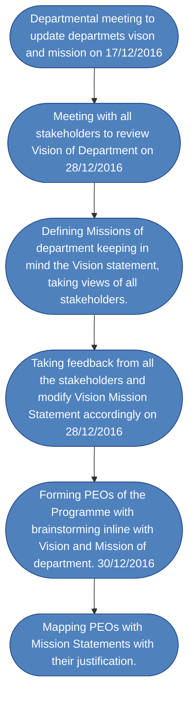

**Electronics and communication Engineering Department**

**Government Polytechnic, Palanpur**

**Institute Vision**

To produce competent diploma engineers as per need of Industries and Entrepreneurs with Ethical values.

**Mission of the Institute**

| M1   | *Industry oriented technical education*                      |
| ---- | ------------------------------------------------------------ |
| M2   | *Excellent teaching and learning environment*                |
| M3   | *Promote entrepreneurship activities*                        |
| M4   | *Continual growth in every sphere of life by developing core human values* |

**Vision of Department of Electronics and Communication Engineering**

To prepare competent diploma level electronics and communication engineers, catering the needs of industries and society as an excellent employee, innovator and entrepreneur with moral values.

**Mission of Department of Electronics and Communication Engineering**

| M1   | *Provide quality education in the field of EC engineering*   |
| ---- | ------------------------------------------------------------ |
| M2   | *Develop state of art laboratories, classrooms and* *up gradation of* *faculties* |
| M3   | *Strengthen industrial liaison by offering mutual beneficiaries services* |
| M4   | *Execute extracurricular and co-curricular activities to inculcate innovation, entrepreneurship  and moral values* |

1. **A DOCUMENT SHOWING VISION AND MISSION ARE IN LINE WITH NBA'S OUTCOME BASED EDUCATION.**

|                                                              | OBE’s three Pillars                                          |                                                              |                                                              |
| ------------------------------------------------------------ | ------------------------------------------------------------ | ------------------------------------------------------------ | ------------------------------------------------------------ |
|                                                              | Outcome based curriculum                                     | Outcome based Teaching andLearning process                   | Outcome based assessment                                     |
| **Vision:**                                                  |                                                              |                                                              |                                                              |
| To prepare competent diploma level electronics and communication engineers, catering the needs of industries and society as an excellent employee, innovator and entrepreneur with moral values. | Vision enables identification of the attributes required in an electronics and communication engineer to meet the industrial and societal needs. | This vision is focused on developing lifelonglearning approach.Vision is highly student centric.Vision aims at making students to apply, analyze and solve engineering problems. | Vision ensures that the  students will be able to use their Knowledge and skills in aprofessional way, such as solvingproblems, designing experiments, orCommunicating with clients in their respective work place. |
| Mission                                                      |                                                              |                                                              |                                                              |
| M1: Provide quality education in the field of EC engineering | Mission enables identification of key areas that focuses onimparting electronics and communication core knowledge and its application. | This mission aims at inclusion of tools and methods to enable student to learn all the aspects of Electronics and communication as a Diploma engineer.It indulges students to achieve learning outcomes. | This Mission ensures that quality education is evaluated by criteria based assessment by demonstration of achievement of outcome and ability performance. |
| M2: Develop state of art laboratories, classrooms and upgraded faculties knowledge wise | Mission Providing a framework for collaborative curriculum planningand tools for evaluating and improving the curriculum | Mission Helps to Providing a strategic way to enhance the quality of teaching and learning by effective student centric learning process in classrooms and Laboratories by Highly qualified faculties. | This Mission enables quality measure ofTechnical skillsthrough quiz, puzzles, Troubleshooting and project based learning. |
| M3: Strengthen industrial liaison by offering mutual beneficiary services | This mission Helps to develop the curriculum according to industrial needs by involving industry persons during the design of curriculum. | This Mission correlates the student learning with industry by arranging industrial visit, Workshop Seminars from industry experts and Student startup innovation policy(SSIP). | Mission Helps to students to articulate the knowledge, practical skills by Industrial problem solving. |
| M4:Execute extracurricular and co-curricular activities to inculcate innovation, entrepreneurship  and moral values | This mission helps to include extracurricular and co-curricular activities in curriculumas it encourage students for innovation, moral values and entrepreneurship | This mission helps to arrange extracurricular activities under gymkhana activitiesand different co curricular activities like technical events arrangements by students to boost skills for innovation and entrepreneurship | This mission helps to measure the students innovation and entrepreneurshipcapability with good moral values by how they participate and performing in extracurricular and co-curricular activities. |

**Program Educational Objectives (PEOs)**

| PEO1 | Successfully pursue professional electronics and communication engineering career working in multidisciplinary area focusing on innovation and entrepreneurship. |
| ---- | ------------------------------------------------------------ |
| PEO2 | Pursue higher education                                      |
| PEO3 | Demonstrate societal and ethical responsibility in every domain of life |
| PEO4 | Adapt technological changes with focus on societal and environmental issues |

